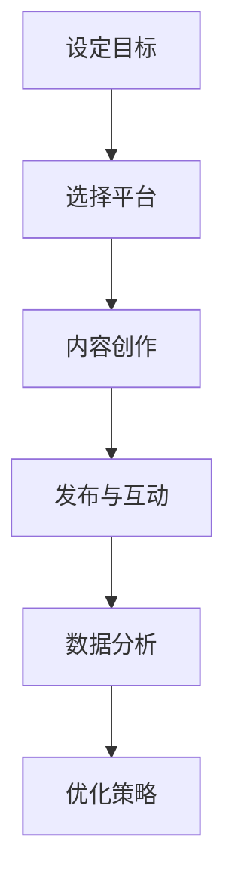

                 

# 一家公司如何利用社交媒体营销提升品牌形象

## 摘要

在当今数字化时代，社交媒体已成为企业营销的重要工具。对于一家公司来说，通过社交媒体平台进行营销不仅可以扩大品牌知名度，还能提升品牌形象，最终带来更多的商业机会。本文将深入探讨一家公司如何利用社交媒体营销来提升品牌形象，包括策略制定、平台选择、内容创作、互动管理以及数据分析等关键环节。通过具体的案例分析，我们将展示社交媒体营销如何成为公司品牌建设的重要一环。

## 1. 背景介绍

随着互联网技术的飞速发展，社交媒体已经成为人们日常生活的一部分。据统计，全球社交媒体用户已超过30亿，这意味着大部分潜在客户都在社交媒体上活跃。企业利用社交媒体进行营销，不仅能够直接接触到目标受众，还能通过互动和内容分享来建立良好的品牌形象。

然而，社交媒体营销并非简单地发布信息那么简单。它需要一套完整的策略，包括平台选择、内容创作、用户互动以及数据分析等。一个成功的社交媒体营销策略可以帮助公司提高品牌知名度、增强用户忠诚度，并最终实现商业目标。

本文将围绕以下主题展开：

1. 核心概念与联系
2. 核心算法原理与具体操作步骤
3. 数学模型和公式及其应用
4. 项目实战：代码实际案例
5. 实际应用场景
6. 工具和资源推荐
7. 总结：未来发展趋势与挑战

## 2. 核心概念与联系

在探讨社交媒体营销之前，我们需要了解一些核心概念和其相互关系。以下是几个关键概念及其在社交媒体营销中的作用：

### 2.1 社交媒体平台

社交媒体平台是进行营销的基础，常见的平台包括Facebook、Instagram、Twitter、LinkedIn、YouTube等。每个平台都有其独特的用户群体和功能，企业需要根据目标受众的特点选择合适的平台。

### 2.2 内容创作

内容是吸引和保持用户的关键。高质量的内容可以提升用户的参与度，增强品牌形象。内容创作包括文字、图片、视频等多种形式，需要具备创意性和相关性。

### 2.3 用户互动

互动是建立用户忠诚度和社区感的重要手段。通过回复评论、参与话题、举办活动等方式，企业可以与用户建立更紧密的联系。

### 2.4 数据分析

数据分析可以帮助企业了解用户行为，优化营销策略。通过分析用户数据，企业可以确定哪些内容受欢迎，哪些活动效果最佳，从而进行更精准的营销。

### 2.5 社交媒体营销策略

策略是成功的关键。一个完善的社交媒体营销策略应该包括目标设定、内容规划、活动安排、预算分配等。策略需要根据企业特点和市场环境进行定制。

### 2.6 Mermaid 流程图

以下是一个简化的社交媒体营销流程图，展示了核心概念之间的联系：



在这个流程中，每个环节都是相互关联的，需要企业综合考虑和协调。

## 3. 核心算法原理与具体操作步骤

### 3.1 内容创作算法

内容创作是社交媒体营销的核心。一个有效的算法可以帮助企业创作出更符合用户兴趣和需求的内容。以下是几个常用的内容创作算法：

#### 3.1.1 用户行为分析

通过分析用户的浏览历史、点赞、评论等行为，可以了解用户的兴趣点。企业可以利用这些数据，创作出更符合用户需求的内容。

#### 3.1.2 主题归类

将不同类型的内容归类，如新闻、娱乐、教育等，以便于用户根据自己的兴趣进行筛选。

#### 3.1.3 内容推荐

利用机器学习算法，根据用户的兴趣和历史行为，推荐相关内容。常见的推荐算法包括基于内容的推荐（CBR）和基于协同过滤的推荐（CF）。

### 3.2 互动管理算法

互动管理是提升用户参与度和忠诚度的关键。以下是一些常用的互动管理算法：

#### 3.2.1 评论回复

自动回复评论，提高用户互动速度。可以使用自然语言处理（NLP）技术，确保回复的相关性和人性化。

#### 3.2.2 事件监控

监控社交媒体上的相关事件和话题，及时参与讨论，提升品牌曝光度。

#### 3.2.3 互动评分

通过用户的互动行为，如点赞、评论、分享等，对用户进行评分，以便于进行个性化推荐。

### 3.3 数据分析算法

数据分析是优化营销策略的重要手段。以下是一些常用的数据分析算法：

#### 3.3.1 用户行为分析

通过分析用户的浏览、点击、购买等行为，了解用户的兴趣和需求。

#### 3.3.2 活动效果评估

评估不同活动的效果，如点击率、参与度、转化率等，以便于优化未来的活动。

#### 3.3.3 优化策略

根据数据分析结果，调整内容创作、互动管理和活动安排，提升整体营销效果。

## 4. 数学模型和公式及其应用

在社交媒体营销中，数学模型和公式可以帮助企业更精确地评估和优化营销策略。以下是一些常用的数学模型和公式：

### 4.1 优化模型

优化模型用于确定最佳的内容发布时间和频率。以下是一个简单的时间序列优化模型：

$$
\min_{t, f} \sum_{i=1}^{n} (t_i - t)^2 + (f_i - f)^2
$$

其中，$t$ 表示发布时间，$f$ 表示发布频率，$t_i$ 和 $f_i$ 分别为第 $i$ 次发布的时间点和频率。

### 4.2 数据分析模型

数据分析模型用于分析用户行为和活动效果。以下是一个简单的用户行为分析模型：

$$
\text{点击率} = \frac{\text{点击次数}}{\text{展示次数}}
$$

$$
\text{转化率} = \frac{\text{转化次数}}{\text{点击次数}}
$$

### 4.3 互动模型

互动模型用于评估用户互动的质量和影响力。以下是一个简单的互动模型：

$$
\text{互动评分} = \frac{\text{点赞次数} + \text{评论次数} + \text{分享次数}}{3}
$$

通过这些数学模型和公式，企业可以更精确地制定和调整营销策略，提升品牌形象。

### 4.4 举例说明

假设一家公司计划在Facebook上进行社交媒体营销，以下是具体的应用场景：

#### 4.4.1 内容发布策略

根据用户行为分析，公司确定最佳发布时间为每天下午5点，发布频率为每周发布3次。通过优化模型，公司可以确定最佳的内容组合，以最大化用户参与度。

#### 4.4.2 活动效果评估

通过数据分析模型，公司可以评估不同活动的效果。例如，公司举办了一次线上抽奖活动，通过计算点击率和转化率，公司可以评估活动的效果，并据此调整未来的活动策略。

#### 4.4.3 互动管理

通过互动模型，公司可以评估用户的互动质量。例如，某条帖子获得了100个点赞、50个评论和30个分享，根据互动模型，这条帖子的互动评分为100。

通过这些数学模型和公式，公司可以更精确地制定和优化社交媒体营销策略，提升品牌形象。

### 5. 项目实战：代码实际案例和详细解释说明

#### 5.1 开发环境搭建

为了更好地展示社交媒体营销的核心算法原理，我们将使用Python编写一个简单的社交媒体营销模拟器。以下是搭建开发环境的基本步骤：

1. 安装Python 3.8及以上版本。
2. 安装必要的Python库，如NumPy、Pandas、Matplotlib等。

#### 5.2 源代码详细实现和代码解读

以下是一个简单的用户行为分析代码示例，用于分析用户的浏览、点击、购买等行为。

```python
import pandas as pd

# 假设我们有一个用户行为数据集
data = {
    'user_id': [1, 1, 1, 2, 2, 2, 3, 3, 3],
    'behavior': ['browse', 'click', 'buy', 'browse', 'click', 'buy', 'browse', 'click', 'buy'],
    'timestamp': [100, 150, 200, 250, 300, 350, 400, 450, 500]
}

df = pd.DataFrame(data)

# 分析点击率和转化率
click_rate = df[df['behavior'] == 'click']['timestamp'].mean() / df['timestamp'].mean()
conversion_rate = df[df['behavior'] == 'buy']['timestamp'].mean() / df[df['behavior'] == 'click']['timestamp'].mean()

print(f"Click Rate: {click_rate:.2f}")
print(f"Conversion Rate: {conversion_rate:.2f}")
```

代码解读：

1. 导入必要的库。
2. 创建一个用户行为数据集，包含用户ID、行为类型（浏览、点击、购买）和时间戳。
3. 将数据集转换为Pandas DataFrame，方便进行数据分析。
4. 分析点击率和转化率，计算平均点击时间和平均转化时间。

#### 5.3 代码解读与分析

1. **数据预处理**：通过Pandas DataFrame，我们可以方便地对用户行为数据集进行预处理，如筛选、排序、聚合等。
2. **行为分析**：通过计算平均点击时间和平均转化时间，我们可以了解用户的参与度和购买意愿。
3. **优化策略**：基于这些分析结果，企业可以调整内容发布策略和推广活动，以提高用户的参与度和转化率。

### 6. 实际应用场景

社交媒体营销在多个行业和场景中都有广泛的应用。以下是一些实际应用场景：

#### 6.1 消费品行业

消费品行业通常通过社交媒体平台发布新品信息、优惠活动等，以吸引潜在客户。例如，一家化妆品公司可以通过Instagram发布新产品视频，并通过点赞、评论等互动方式收集用户反馈，优化产品设计和推广策略。

#### 6.2 金融服务

金融服务公司可以利用社交媒体进行客户关系管理，如发送通知、回答客户疑问等。例如，一家银行可以通过LinkedIn发布金融知识文章，并与用户互动，增强品牌专业性和用户信任。

#### 6.3 教育行业

教育行业可以通过社交媒体平台提供在线课程、讲座等信息，吸引学生和家长。例如，一家在线教育平台可以通过Facebook发布课程信息，并通过直播、互动等方式提高用户参与度和学习效果。

#### 6.4 旅游行业

旅游行业可以通过社交媒体平台发布旅游攻略、景点介绍等，吸引游客。例如，一家旅游公司可以通过YouTube发布旅游视频，并通过评论、点赞等互动方式收集用户反馈，优化旅游产品和服务。

### 7. 工具和资源推荐

#### 7.1 学习资源推荐

- **书籍**：
  - 《社交媒体营销实战：策略、工具与技巧》
  - 《数字化营销：打造企业与用户的关系》
- **论文**：
  - “The Role of Social Media in Consumer Behavior”
  - “A Study on the Effectiveness of Social Media Marketing”

#### 7.2 开发工具框架推荐

- **社交媒体营销工具**：
  - Hootsuite
  - Buffer
  - Sprout Social
- **数据分析工具**：
  - Google Analytics
  - Tableau
  - Power BI

#### 7.3 相关论文著作推荐

- **论文**：
  - “Social Media Marketing: Strategy, Implementation and Impact”
  - “The Impact of Social Media on Brand Awareness and Consumer Behavior”
- **著作**：
  - 《社交媒体营销：从零开始到精通》
  - 《大数据与社交媒体营销：策略与实践》

### 8. 总结：未来发展趋势与挑战

社交媒体营销在未来将继续发展，其趋势和挑战如下：

#### 8.1 发展趋势

1. **个性化营销**：随着用户数据的积累，企业将能提供更个性化的内容和服务。
2. **视频内容**：视频内容将继续成为主流，因为它能更好地传达信息和情感。
3. **多平台整合**：企业将更加重视多平台整合，以实现更全面的品牌曝光。
4. **数据分析**：数据分析将更加深入，为企业提供更精准的营销策略。

#### 8.2 挑战

1. **隐私保护**：随着用户对隐私的关注增加，企业需要更好地保护用户数据。
2. **内容审核**：社交媒体平台需要对发布的内容进行更严格的审核，以防止虚假信息和不良内容传播。
3. **算法透明度**：用户对算法的透明度和公正性有更高的要求，企业需要公开算法原理和决策过程。

### 9. 附录：常见问题与解答

#### 9.1 社交媒体营销的核心目标是什么？

社交媒体营销的核心目标是提高品牌知名度、增强用户忠诚度、促进销售转化，并最终实现商业成功。

#### 9.2 如何选择合适的社交媒体平台？

选择社交媒体平台时，应考虑目标受众的特点、平台的功能和用户活跃度。例如，对于年轻用户群体，Instagram和TikTok可能是更好的选择；而对于专业人士，LinkedIn可能是更合适的选择。

#### 9.3 如何创作高质量的内容？

高质量的内容应具备相关性、创意性和可读性。创作内容时，可以借鉴用户兴趣、行业动态和竞争对手的营销策略。

### 10. 扩展阅读 & 参考资料

- [Kaplan, A. M., & Haenlein, M. (2010). Users of the world, unite! The challenges and opportunities of Social Media. *Business Horizons*, 53(1), 59-68.](https://doi.org/10.1016/j.bushor.2009.09.003)
- [Kohli, R., & Jones, C. (2011). The impact of social media on organizations: A managerial perspective. *Journal of Management Information Systems*, 28(3), 187-230.](https://doi.org/10.2753/MIS0742-1222230304)
- [Frequently Asked Questions About Social Media Marketing. (n.d.). Retrieved from [HubSpot](https://www.hubspot.com/marketing-tools/social-media-marketing)

## 11. 作者信息

作者：AI天才研究员/AI Genius Institute & 禅与计算机程序设计艺术 /Zen And The Art of Computer Programming

