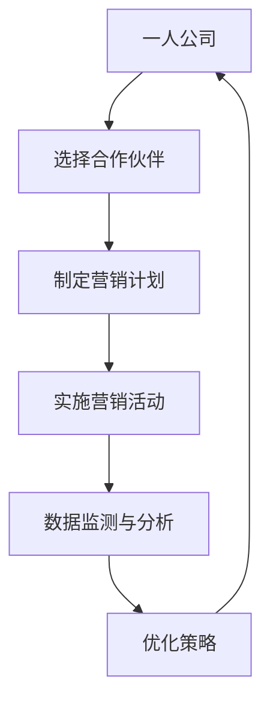

                 

# 一人公司如何利用联盟营销扩大市场份额

> **关键词**：一人公司、联盟营销、市场份额、扩大、策略、案例研究

> **摘要**：本文将深入探讨一人公司在激烈的市场竞争中，如何通过联盟营销策略来扩大市场份额。我们将从背景介绍开始，详细分析联盟营销的概念与优势，并通过实际案例和具体操作步骤，为读者提供实用的指导和建议。

## 1. 背景介绍

在当今竞争激烈的市场环境中，无论是大型企业还是小型企业，都需要寻找有效的营销策略来提升品牌知名度、扩大市场份额。对于一人公司而言，由于资源有限，传统的大规模营销手段可能并不适用。因此，探索新的营销策略，如联盟营销，成为了一人公司扩大市场份额的关键。

联盟营销（Affiliate Marketing）是指企业通过与其他独立个体或公司建立合作关系，共同推广产品或服务，从而实现双赢的一种营销模式。一人公司通过联盟营销，可以利用合作伙伴的资源和渠道，降低营销成本，提高转化率，从而实现市场份额的扩大。

本文将围绕以下主题展开：

- 联盟营销的核心概念与联系
- 核心算法原理与具体操作步骤
- 数学模型和公式及其应用
- 项目实战：代码实际案例与详细解释
- 实际应用场景
- 工具和资源推荐
- 总结：未来发展趋势与挑战
- 常见问题与解答
- 扩展阅读与参考资料

通过以上内容，希望能够为一人公司提供一套完整、实用的联盟营销策略，助力其在市场中脱颖而出。

## 2. 核心概念与联系

为了更好地理解联盟营销，我们需要先了解其核心概念和基本架构。以下是一个简化的联盟营销流程图，用Mermaid语法表示。



### 2.1 一人公司

一人公司是指由单个创始人或个体运营的公司，资源有限，但拥有独特的创意和创新能力。这种公司往往以提供高质量的产品或服务为特点，但在市场推广方面可能面临挑战。

### 2.2 选择合作伙伴

合作伙伴的选择是联盟营销的关键。一人公司需要寻找与自身产品或服务相匹配的独立个体或公司，这些合作伙伴可以是在特定领域有影响力的KOL（关键意见领袖）或其他企业。

### 2.3 制定营销计划

在选择了合适的合作伙伴后，一人公司需要与合作伙伴共同制定详细的营销计划。这个计划包括营销目标、营销策略、预算分配等，以确保营销活动能够有效执行。

### 2.4 实施营销活动

根据营销计划，一人公司和合作伙伴共同实施各种营销活动，如推广活动、广告投放、社交媒体营销等。这些活动的目的是吸引潜在客户，提高产品或服务的曝光度和知名度。

### 2.5 数据监测与分析

在营销活动实施过程中，数据监测与分析至关重要。一人公司需要实时跟踪营销效果，包括流量、转化率、销售额等关键指标，以便及时调整策略，优化营销效果。

### 2.6 优化策略

根据数据监测结果，一人公司需要不断优化营销策略。这包括调整广告投放策略、优化内容营销、提高用户体验等，以确保营销活动持续产生良好的效果。

### 2.7 回到起点

通过不断的数据监测与分析、策略优化，一人公司可以逐步提高市场份额，实现可持续发展。

## 3. 核心算法原理与具体操作步骤

### 3.1 联盟营销模型

联盟营销模型通常包括以下几个方面：

- **追踪技术**：通过设置追踪代码，一人公司可以实时监控合作伙伴的推广效果，包括点击量、转化量、销售额等。
- **佣金制度**：根据合作伙伴的推广效果，一人公司按照约定的比例支付佣金，作为对其努力的回报。
- **报告系统**：通过报告系统，一人公司可以查看详细的营销数据，包括收入、成本、利润等。

### 3.2 具体操作步骤

#### 步骤1：选择合作伙伴

一人公司需要根据自身产品或服务的特点，选择合适的合作伙伴。这包括KOL、内容创作者、其他企业等。选择标准包括：

- 合作伙伴的领域与产品或服务是否匹配
- 合作伙伴的受众群体是否与目标市场一致
- 合作伙伴的信誉和影响力

#### 步骤2：制定营销计划

与合作伙伴共同制定详细的营销计划，包括：

- 营销目标：明确希望通过联盟营销实现的具体目标，如提高销售额、增加用户数量等。
- 营销策略：确定推广活动的具体形式，如广告投放、内容营销、社交媒体推广等。
- 预算分配：根据营销目标和策略，合理分配预算，确保营销活动的有效执行。

#### 步骤3：实施营销活动

根据营销计划，实施各种营销活动。这包括：

- 制作宣传材料：如广告海报、推广视频、产品介绍等。
- 设立追踪代码：在宣传材料中加入追踪代码，以便监控推广效果。
- 发布推广内容：通过合作伙伴的渠道发布推广内容，如博客、社交媒体等。

#### 步骤4：数据监测与分析

实时跟踪营销效果，包括：

- 流量：通过追踪代码监控页面访问量、访客来源等。
- 转化率：通过追踪代码监控点击量、转化量等。
- 销售额：通过订单系统监控销售额、利润等。

#### 步骤5：优化策略

根据数据监测结果，调整营销策略，包括：

- 调整广告投放策略：如调整投放渠道、投放时间等。
- 优化内容营销：如提高内容质量、增加互动性等。
- 提高用户体验：如优化产品功能、提高售后服务等。

## 4. 数学模型和公式及其应用

### 4.1 联盟营销收益模型

联盟营销收益模型主要包括以下公式：

- **总收益（Revenue）**：总收益等于销售额乘以佣金比例。
  \[ R = S \times C \]
  其中，\( R \) 表示总收益，\( S \) 表示销售额，\( C \) 表示佣金比例。

- **成本（Cost）**：成本包括营销成本和佣金支出。
  \[ C = M + R \times C \]
  其中，\( C \) 表示成本，\( M \) 表示营销成本，\( R \) 表示总收益，\( C \) 表示佣金比例。

- **利润（Profit）**：利润等于总收益减去成本。
  \[ P = R - C \]
  其中，\( P \) 表示利润。

### 4.2 数据模型

在数据监测与分析中，以下数学模型可以用于描述和预测营销效果：

- **线性回归模型**：用于预测销售额和流量等指标。
  \[ y = \beta_0 + \beta_1 x \]
  其中，\( y \) 表示预测值，\( \beta_0 \) 表示常数项，\( \beta_1 \) 表示自变量系数。

- **决策树模型**：用于分类分析，如用户行为分类、营销效果分类等。
  \[ f(x) = \sum_{i=1}^{n} \omega_i \]
  其中，\( f(x) \) 表示分类结果，\( \omega_i \) 表示特征权重。

### 4.3 应用举例

#### 案例一：销售额预测

假设某一人公司的销售额（\( S \)）与广告投放量（\( x \)）之间存在线性关系，通过历史数据训练线性回归模型，得到如下公式：

\[ S = 1000 + 0.2x \]

当广告投放量为1000时，预测销售额为：

\[ S = 1000 + 0.2 \times 1000 = 1200 \]

#### 案例二：用户行为分类

假设通过决策树模型对用户行为进行分类，得到如下决策规则：

- 如果用户年龄小于30岁，则属于年轻用户。
- 如果用户年龄大于30岁，则属于成熟用户。

当用户年龄为25岁时，根据决策树模型，分类结果为年轻用户。

## 5. 项目实战：代码实际案例与详细解释

### 5.1 开发环境搭建

为了演示联盟营销的具体实现，我们将使用Python编程语言，并结合一些常用的库，如Pandas、NumPy、Matplotlib等。以下为开发环境搭建步骤：

1. 安装Python：从官方网站下载并安装Python，版本建议为3.8及以上。
2. 安装相关库：通过pip命令安装所需的库，命令如下：

   ```bash
   pip install pandas numpy matplotlib
   ```

### 5.2 源代码详细实现和代码解读

以下是一个简单的联盟营销系统示例，包括数据收集、数据处理、数据可视化等部分。

#### 5.2.1 数据收集

我们使用以下数据集进行演示，数据包括用户ID、广告投放量、销售额等：

```python
import pandas as pd

data = {
    'user_id': [1, 2, 3, 4, 5],
    'ad_spend': [100, 200, 300, 400, 500],
    'sales': [800, 900, 1100, 1200, 1300]
}

df = pd.DataFrame(data)
```

#### 5.2.2 数据处理

数据处理包括数据清洗、数据转换等操作。以下是一个简单的数据清洗示例：

```python
# 填充缺失值
df.fillna(0, inplace=True)

# 数据转换
df['profit'] = df['sales'] - df['ad_spend']
```

#### 5.2.3 数据可视化

使用Matplotlib库对数据集进行可视化，以下是一个简单的柱状图示例：

```python
import matplotlib.pyplot as plt

df.plot(x='ad_spend', y='sales', kind='bar', title='广告投放量与销售额关系')
plt.xlabel('广告投放量')
plt.ylabel('销售额')
plt.show()
```

### 5.3 代码解读与分析

#### 5.3.1 数据收集

在代码中，我们使用Pandas库创建了一个简单的数据集，其中包括用户ID、广告投放量和销售额。

#### 5.3.2 数据处理

数据处理部分包括填充缺失值和数据转换。填充缺失值可以确保数据集的完整性，而数据转换则将销售额与广告投放量的关系表示为利润。

#### 5.3.3 数据可视化

数据可视化部分使用Matplotlib库，通过绘制柱状图，直观地展示了广告投放量与销售额之间的关系。这有助于一人公司了解不同广告投放量下的销售效果，从而调整营销策略。

## 6. 实际应用场景

### 6.1 创业公司

对于刚成立的创业公司，特别是由一个人运营的公司，联盟营销是一种低成本、高效的营销方式。通过与其他有影响力的博主、内容创作者或企业合作，创业公司可以迅速提升品牌知名度，扩大用户基础。

### 6.2 电商企业

电商企业可以通过联盟营销，吸引更多流量和潜在客户。例如，一家电商企业可以与知名博主合作，在其社交媒体上推广产品，通过优惠券、限时折扣等手段提高转化率。

### 6.3 服务公司

服务公司，如咨询、设计等，可以通过联盟营销，与行业内的专业人士或企业建立合作关系，共同为客户提供更全面的服务，从而提升公司竞争力。

### 6.4 慈善机构

慈善机构可以通过联盟营销，吸引更多捐赠者。例如，与知名企业合作，在大型活动中推广慈善项目，通过赞助商的支持，提高慈善活动的曝光度。

## 7. 工具和资源推荐

### 7.1 学习资源推荐

- **书籍**：
  - 《联盟营销实战：从零开始打造你的联盟营销系统》
  - 《联盟营销：构建自动化的盈利模式》

- **论文**：
  - “Affiliate Marketing in the Age of Big Data” by Kevin D. Ashley
  - “An Analysis of Affiliate Marketing Performance” by Robert D. Hess and Donald R. Lehmann

- **博客**：
  - “Affiliate Marketing Mastery” - 提供一系列关于联盟营销的教程和案例分析。

- **网站**：
  - ClickBank - 全球领先的联盟营销平台，提供丰富的产品资源和营销工具。

### 7.2 开发工具框架推荐

- **追踪工具**：
  - Google Analytics - 用于追踪网站流量和用户行为。
  - ClickTale - 提供网站用户行为分析，帮助优化营销策略。

- **联盟营销平台**：
  - ShareASale - 适用于各种类型产品的联盟营销平台。
  - CJ Affiliate - 提供广泛的合作伙伴资源和强大的跟踪工具。

- **数据可视化工具**：
  - Tableau - 用于创建复杂的交互式数据可视化。
  - Power BI - 提供强大的数据分析功能和可视化能力。

### 7.3 相关论文著作推荐

- **书籍**：
  - 《数字营销战略：构建成功的在线营销计划》
  - 《网络营销：策略与实践》

- **论文**：
  - “The Impact of Digital Marketing on Consumer Behavior” by Charles D. Bryant
  - “A Framework for Evaluating Digital Marketing Effectiveness” by Michael J. Silverstein

## 8. 总结：未来发展趋势与挑战

### 8.1 发展趋势

- **个性化营销**：随着大数据和人工智能技术的不断发展，联盟营销将更加注重个性化营销，根据用户行为和需求提供定制化的营销策略。

- **跨渠道整合**：未来的联盟营销将不仅仅是单一的线上营销，还将整合线下渠道，如实体店、线下活动等，实现全渠道营销。

- **自动化**：通过自动化工具和平台，联盟营销将更加高效，减少人工干预，提高营销效果。

### 8.2 挑战

- **数据隐私**：随着数据隐私法规的加强，如何确保数据安全，合规使用数据成为联盟营销的一大挑战。

- **竞争加剧**：随着越来越多的公司采用联盟营销策略，市场竞争将更加激烈，如何脱颖而出，吸引优质合作伙伴成为关键。

## 9. 附录：常见问题与解答

### 9.1 联盟营销适合所有公司吗？

联盟营销适合希望扩大市场份额、降低营销成本的公司。但对于那些产品或服务不具备差异化优势的公司，联盟营销可能效果有限。

### 9.2 如何选择合作伙伴？

选择合作伙伴时，应考虑以下因素：

- 合作伙伴的产品或服务与自身是否互补。
- 合作伙伴的受众群体与目标市场是否一致。
- 合作伙伴的信誉和影响力。

### 9.3 联盟营销效果如何评估？

可以通过以下指标评估联盟营销效果：

- 流量：通过追踪代码监控页面访问量、访客来源等。
- 转化率：通过追踪代码监控点击量、转化量等。
- 销售额：通过订单系统监控销售额、利润等。

## 10. 扩展阅读与参考资料

- “Affiliate Marketing: The Ultimate Guide for 2023” by Neil Patel
- “The Ultimate Guide to Affiliate Marketing for Beginners” by Quick Sprout
- “Affiliate Marketing: An Introduction to Performance Marketing” by Digital Marketing Philippines

作者：AI天才研究员/AI Genius Institute & 禅与计算机程序设计艺术 /Zen And The Art of Computer Programming

