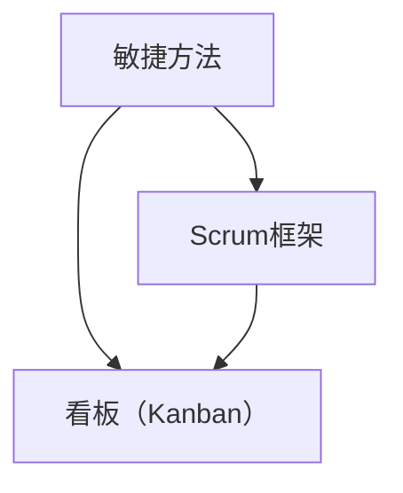

                 

### 一人公司如何实现业务的敏捷转型

在当今快速变化和竞争激烈的市场环境中，敏捷转型已经成为企业持续成长和成功的关键因素。对于一人公司来说，实现业务的敏捷转型尤为重要。本文将深入探讨一人公司如何通过敏捷方法来优化业务流程、提高效率和市场响应速度。

## 1. 背景介绍

一人公司，顾名思义，是指由一个人运营和管理的企业。虽然规模较小，但一人公司拥有独特的灵活性和快速决策的优势。然而，随着市场竞争的加剧和业务需求的多样化，一人公司也需要面对一系列挑战，如资源有限、管理复杂、市场变化等。

敏捷转型，源于软件开发领域的敏捷方法，旨在通过快速迭代、灵活响应和持续改进来提高组织的适应能力和市场竞争力。敏捷方法强调团队合作、客户反馈和持续交付，可以有效地解决一人公司面临的许多挑战。

## 2. 核心概念与联系

在探讨如何实现敏捷转型之前，我们需要理解几个核心概念：

- **敏捷方法**：一种以人为核心、迭代和灵活响应的软件开发方法。
- **Scrum框架**：一种常见的敏捷方法论，强调短期目标和持续改进。
- **看板（Kanban）**：一种管理方法，通过可视化工作流程来提高效率和透明度。

以下是敏捷方法、Scrum框架和Kanban之间关系的 Mermaid 流程图：



### 2.1 敏捷方法

敏捷方法强调以下几个关键原则：

- **客户合作**：与客户紧密合作，确保交付的软件产品满足实际需求。
- **迭代开发**：通过快速迭代开发，持续改进产品并快速响应变更。
- **团队协作**：鼓励团队成员之间的协作和沟通，提高整体效率。
- **自适应规划**：根据实际情况调整计划，灵活应对变化。

### 2.2 Scrum框架

Scrum框架是一种常见的敏捷方法论，它将项目分为一系列迭代（Sprint），每个Sprint通常持续2-4周。Scrum框架的关键角色包括：

- **产品负责人（Product Owner）**：负责定义产品的愿景和需求，确保产品交付的价值。
- **Scrum Master**：负责确保Scrum实践的有效实施，帮助团队解决障碍。
- **开发团队**：负责开发、测试和交付产品。

Scrum框架的核心活动包括：

- **规划会议（Sprint Planning）**：团队确定下一个Sprint的目标和任务。
- **每日站立会议（Daily Stand-up）**：团队成员分享进展、问题和计划。
- **回顾会议（Sprint Retrospective）**：团队反思和改进工作流程。

### 2.3 看板（Kanban）

看板是一种管理方法，通过可视化工作流程来提高效率和透明度。看板的核心原则包括：

- **限制工作项数量（Work in Progress, WIP）**：限制正在处理的工作项数量，以减少等待时间和提高工作效率。
- **可视化工作流程**：通过看板板面和卡片来展示工作流程，提高透明度和协作。
- **持续改进**：通过监控和改进工作流程，不断提高效率和效果。

## 3. 核心算法原理 & 具体操作步骤

### 3.1 敏捷转型步骤

一人公司实现敏捷转型可以遵循以下步骤：

1. **理解敏捷原则**：了解敏捷方法的核心原则和价值观，确保团队成员对敏捷有共同的理解。
2. **确定转型目标**：明确敏捷转型的目标和预期成果，如提高效率、缩短开发周期等。
3. **选择合适的敏捷方法**：根据业务需求和团队特点，选择Scrum、Kanban或其他敏捷方法。
4. **组建敏捷团队**：确保团队成员具备敏捷方法的技能和经验，包括产品负责人、Scrum Master和开发人员。
5. **实施敏捷实践**：根据选定的敏捷方法，实施相应的实践，如Sprint规划、每日站立会议等。
6. **持续改进**：通过回顾会议和持续反馈，不断改进敏捷实践和工作流程。

### 3.2 Scrum实践步骤

以下是一人公司实施Scrum实践的具体步骤：

1. **Sprint规划会议**：产品负责人和开发团队一起确定下一个Sprint的目标和任务。
2. **每日站立会议**：团队成员每天分享进展、问题和计划，确保透明度和协作。
3. **Sprint回顾会议**：在Sprint结束时，团队反思和讨论改进措施，以提高未来Sprint的效率和质量。
4. **持续交付**：确保在Sprint结束时交付可用的产品增量，以获得客户反馈和持续改进。

### 3.3 Kanban实践步骤

以下是一人公司实施Kanban实践的具体步骤：

1. **可视化工作流程**：使用看板板面和卡片来展示工作流程，确保透明度和协作。
2. **限制工作项数量**：根据团队的产能和资源限制，设置适当的工作项数量，以减少等待时间和提高工作效率。
3. **监控和改进**：定期监控工作流程的瓶颈和问题，通过改进措施来提高效率和效果。

## 4. 数学模型和公式 & 详细讲解 & 举例说明

### 4.1 敏捷方法中的关键指标

敏捷方法中常用以下关键指标来评估团队和项目的效率：

- **燃尽图（Burn-down Chart）**：显示剩余工作量的变化趋势，帮助团队了解项目进度。
- **速度图（Velocity Chart）**：显示每个Sprint完成的工作量，帮助团队预估未来工作量。
- **周期时间（Cycle Time）**：从任务开始到完成所需的时间，用于评估工作流程的效率。

以下是这些关键指标的 LaTeX 格式表示：

```latex
\text{燃尽图：} \frac{剩余工作量}{总工作量}

\text{速度图：} \frac{完成工作量}{Sprint时长}

\text{周期时间：} \frac{任务完成时间}{任务数量}
```

### 4.2 敏捷转型的影响因素

敏捷转型的影响因素包括：

- **团队协作**：团队成员之间的沟通和协作能力对敏捷转型至关重要。
- **客户需求**：快速响应客户需求是敏捷方法的核心原则。
- **技术能力**：团队成员需要具备敏捷开发所需的技术能力和经验。
- **组织文化**：敏捷转型需要组织文化的支持，如鼓励创新、持续改进等。

### 4.3 敏捷转型的成功案例

以下是一个敏捷转型的成功案例：

**公司名称**：XXX科技公司

**转型前状况**：公司项目开发周期长，产品质量不稳定，客户满意度低。

**转型步骤**：

1. **组建敏捷团队**：明确团队角色，包括产品负责人、Scrum Master和开发人员。
2. **实施Scrum实践**：按照Scrum框架进行Sprint规划、每日站立会议和回顾会议。
3. **持续改进**：通过回顾会议和持续反馈，不断改进工作流程和团队协作。

**转型后状况**：

1. **项目开发周期缩短**：从原来的6个月缩短到3个月。
2. **产品质量提高**：通过迭代开发，及时修复问题和优化功能。
3. **客户满意度提高**：快速响应客户需求，提高产品竞争力。

## 5. 项目实战：代码实际案例和详细解释说明

### 5.1 开发环境搭建

为了实现敏捷转型，我们需要搭建一个适合敏捷开发的开发环境。以下是一个基于Python的简单示例：

1. **安装Python**：下载并安装Python 3.8版本。
2. **安装PyCharm**：下载并安装PyCharm社区版。
3. **创建虚拟环境**：在PyCharm中创建一个名为`agile_project`的虚拟环境。

```shell
python -m venv agile_project
```

4. **激活虚拟环境**：

```shell
source agile_project/bin/activate
```

### 5.2 源代码详细实现和代码解读

以下是一个简单的敏捷方法实现示例，包括Scrum实践和Kanban可视化工作流程：

```python
# agile_project
# agile.py

import os
import json
import time
from datetime import datetime

# 5.2.1 Scrum实践
class Scrum:
    def __init__(self, product_backlog, sprint_duration):
        self.product_backlog = product_backlog
        self.sprint_duration = sprint_duration
        self.sprint_tasks = []

    def sprint_plan(self):
        for item in self.product_backlog:
            self.sprint_tasks.append(item)

    def daily_stand_up(self):
        print("Daily Stand-up:")
        for task in self.sprint_tasks:
            print(f"- {task}: {self.check_progress(task)}")

    def sprint_review(self):
        print("Sprint Review:")
        for task in self.sprint_tasks:
            print(f"- {task}: {self.check_completion(task)}")

    def check_progress(self, task):
        return "In Progress" if task["status"] == "In Progress" else "Completed"

    def check_completion(self, task):
        return "Completed" if task["status"] == "Completed" else "In Progress"

# 5.2.2 Kanban实践
class Kanban:
    def __init__(self, board):
        self.board = board

    def display_board(self):
        for column, tasks in self.board.items():
            print(f"{column}:")
            for task in tasks:
                print(f"- {task['name']}: {task['status']}")

    def update_status(self, task_name, status):
        for column, tasks in self.board.items():
            for task in tasks:
                if task["name"] == task_name:
                    task["status"] = status
                    break

# 5.2.3 主程序
if __name__ == "__main__":
    # 5.2.3.1 创建Scrum和Kanban实例
    product_backlog = [
        {"name": "任务1", "status": "Backlog"},
        {"name": "任务2", "status": "Backlog"},
        {"name": "任务3", "status": "Backlog"},
    ]

    scrum = Scrum(product_backlog, 2)
    kanban = Kanban({"To Do": [], "In Progress": [], "Done": []})

    # 5.2.3.2 实施Scrum实践
    scrum.sprint_plan()
    kanban.display_board()

    # 5.2.3.3 实施Kanban实践
    kanban.update_status("任务1", "In Progress")
    kanban.display_board()

    # 5.2.3.4 实施每日站立会议和Sprint回顾
    print("\nDaily Stand-up:")
    scrum.daily_stand_up()
    print("\nSprint Review:")
    scrum.sprint_review()
```

### 5.3 代码解读与分析

1. **Scrum类**

- `__init__` 方法：初始化Scrum实例，包括产品待办列表和Sprint任务列表。
- `sprint_plan` 方法：根据产品待办列表，将任务分配到Sprint任务列表中。
- `daily_stand_up` 方法：显示每日站立会议的进展情况。
- `sprint_review` 方法：显示Sprint回顾的完成情况。
- `check_progress` 和 `check_completion` 方法：检查任务的状态。

2. **Kanban类**

- `__init__` 方法：初始化Kanban实例，包括看板板面。
- `display_board` 方法：显示看板板面的当前状态。
- `update_status` 方法：更新任务的状态。

3. **主程序**

- 创建Scrum和Kanban实例。
- 实施Scrum实践，如Sprint计划和回顾。
- 实施Kanban实践，如任务状态更新和看板板面显示。

通过以上代码，我们可以实现一个简单的敏捷方法示例，包括Scrum实践和Kanban可视化工作流程。在实际应用中，可以根据业务需求进行扩展和定制。

## 6. 实际应用场景

一人公司在实现业务敏捷转型后，可以应用于以下实际场景：

1. **产品开发**：通过敏捷方法，快速开发并交付高质量产品。
2. **项目管理**：使用Scrum和Kanban等实践，提高项目管理和协作效率。
3. **客户服务**：快速响应客户需求，提高客户满意度和忠诚度。
4. **市场推广**：通过敏捷方法，快速调整市场策略和推广活动。
5. **团队协作**：鼓励团队成员之间的沟通和协作，提高整体效率。

## 7. 工具和资源推荐

### 7.1 学习资源推荐

- **书籍**：
  - 《敏捷开发实践指南》
  - 《Scrum敏捷开发实践》
  - 《Kanban实践指南》

- **论文**：
  - 《敏捷方法在软件开发中的应用》
  - 《敏捷转型对企业绩效的影响》

- **博客**：
  - 粉笔网（cnfeat）
  - Scrum官方博客（Scrum.org）

- **网站**：
  - 敏捷联盟（Agile Alliance）
  - 敏捷指南针（Agile Guide）

### 7.2 开发工具框架推荐

- **开发工具**：
  - PyCharm
  - Visual Studio Code
  - Git

- **敏捷框架**：
  - Scrum
  - Kanban
  - XP（极限编程）

### 7.3 相关论文著作推荐

- **论文**：
  - 《敏捷方法的最佳实践》
  - 《敏捷转型中的团队协作策略》

- **著作**：
  - 《敏捷软件开发：原则、实践与模式》
  - 《敏捷方法在项目管理中的应用》

## 8. 总结：未来发展趋势与挑战

在未来，敏捷转型将继续成为企业发展的关键趋势。一人公司可以通过以下方式应对未来挑战：

1. **持续学习和改进**：不断学习新的敏捷方法和实践，提高团队和组织的敏捷能力。
2. **技术能力的提升**：掌握先进的技术和工具，提高敏捷开发效率和质量。
3. **团队协作和文化建设**：鼓励团队成员之间的沟通和协作，建立积极向上的组织文化。

## 9. 附录：常见问题与解答

### 9.1 敏捷转型的好处有哪些？

- 提高项目管理和协作效率
- 加快产品开发速度和响应市场变化的能力
- 提高客户满意度和产品竞争力

### 9.2 敏捷转型有哪些常见障碍？

- 团队成员对敏捷方法的理解不一致
- 组织文化和流程的阻力
- 缺乏适当的敏捷工具和资源

### 9.3 如何评估敏捷转型的效果？

- 使用关键指标，如周期时间、速度图和燃尽图等
- 通过客户反馈和团队满意度来评估
- 定期回顾和改进敏捷实践

## 10. 扩展阅读 & 参考资料

- 《敏捷开发实践指南》
- 《Scrum敏捷开发实践》
- 《Kanban实践指南》
- 《敏捷方法在软件开发中的应用》
- 《敏捷转型中的团队协作策略》
- 《敏捷联盟官方网站》（Agile Alliance）
- 《敏捷指南针官方网站》（Agile Guide）<|im_sep|>作者：AI天才研究员/AI Genius Institute & 禅与计算机程序设计艺术 /Zen And The Art of Computer Programming<|im_sep|>

