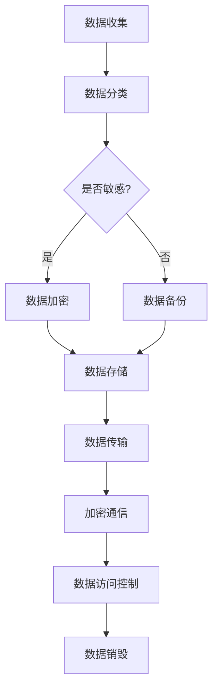

                 

# 一人公司如何实现数据安全与隐私保护的最佳实践

> **关键词：** 数据安全，隐私保护，一人公司，加密技术，安全协议

**摘要：** 本文将深入探讨一人公司在数据安全与隐私保护方面的最佳实践。通过分析当前的数据安全威胁和隐私泄露案例，介绍了一系列关键概念、算法原理、技术手段和实际应用案例，旨在为一人公司提供一套全面的、操作性强的数据安全与隐私保护策略。

## 1. 背景介绍

在当今数字化时代，数据已成为企业的重要资产。对于一人公司而言，数据的安全和隐私保护尤为重要。一方面，一人公司通常依赖于在线业务和云服务，使得数据存储和传输的风险增加；另一方面，由于规模较小，一人公司可能缺乏专业的数据安全团队和资源，更容易成为黑客和恶意软件的目标。

数据安全威胁和隐私泄露事件频繁发生，如2017年的“Facebook数据泄露”事件，暴露了8700万用户的个人信息。这些事件不仅对企业的声誉造成严重影响，还可能导致经济损失和法律责任。

因此，一人公司需要采取有效的数据安全与隐私保护措施，以保护其数据和客户的隐私。本文将围绕这一主题展开，介绍最佳实践和技术手段。

### 1.1 数据安全的重要性

数据安全是确保企业数据在存储、传输和处理过程中免受未经授权访问、篡改和泄露的重要保障。以下是数据安全的几个关键方面：

- **完整性**：确保数据未被非法修改或破坏。
- **保密性**：确保数据在传输和存储过程中不被未授权的人员访问。
- **可用性**：确保数据在需要时可以正常访问和使用。
- **真实性**：确保数据的来源和内容是真实可靠的。

### 1.2 隐私保护的意义

隐私保护是确保个人和企业的敏感信息不被非法收集、使用和泄露的过程。随着数据隐私法规（如《通用数据保护条例》GDPR）的实施，隐私保护已成为企业合规的必要条件。以下是隐私保护的关键方面：

- **数据最小化**：仅收集必要的数据，避免过度收集。
- **目的明确**：确保收集数据的目的明确、合法，并告知数据主体。
- **数据安全**：采取必要措施保护所收集的数据。
- **用户控制**：赋予用户对其数据的访问、删除和隐私设置的控制权。

## 2. 核心概念与联系

为了更好地理解数据安全和隐私保护，我们需要了解以下几个核心概念和它们之间的关系：

### 2.1 加密技术

加密技术是确保数据在传输和存储过程中保密性的关键手段。它通过将明文数据转换成密文，只有拥有正确密钥的实体才能解密和读取数据。

#### 加密算法

加密算法是加密技术的核心，可以分为对称加密和非对称加密。

- **对称加密**：加密和解密使用相同的密钥，如AES。
- **非对称加密**：加密和解密使用不同的密钥，如RSA。

#### 密钥管理

密钥管理是加密技术的关键环节，包括密钥的生成、存储、分发和销毁。良好的密钥管理可以确保加密系统的安全性。

### 2.2 安全协议

安全协议是确保通信过程安全的一系列规则和标准。常见的安全协议包括SSL/TLS、IPSec和SSH。

#### SSL/TLS

SSL/TLS是一种用于保护Web通信的安全协议，通过证书认证和加密通信来确保数据传输的安全性。

#### IPSec

IPSec是一种用于保护IP层通信的安全协议，适用于网络层的数据传输，支持加密和认证。

#### SSH

SSH是一种用于远程登录和文件传输的安全协议，通过加密确保通信过程中的数据保密性和完整性。

### 2.3 数据生命周期管理

数据生命周期管理是指对数据的整个生命周期（从创建到销毁）进行管理和监控的过程。包括数据收集、存储、传输、处理和销毁等环节。

#### 数据分类

数据分类是数据生命周期管理的重要环节，根据数据的重要性和敏感程度进行分类，采取不同的保护措施。

#### 数据加密

在数据生命周期中，数据加密是保护数据安全的关键手段。对存储和传输中的数据进行加密，可以防止未授权访问和泄露。

### 2.4 Mermaid 流程图

以下是一个简化的数据安全和隐私保护架构的Mermaid流程图：



## 3. 核心算法原理 & 具体操作步骤

### 3.1 数据加密算法原理

数据加密算法的核心是密钥和算法。以下是对对称加密（如AES）和非对称加密（如RSA）算法的简要介绍。

#### 对称加密

对称加密算法使用相同的密钥进行加密和解密。AES是一种常用的对称加密算法，具有以下特点：

- **算法复杂度**：时间复杂度为$2^{128}$，安全性高。
- **密钥长度**：密钥长度为128、192或256位。

具体操作步骤如下：

1. **密钥生成**：使用随机数生成器生成密钥。
2. **加密**：将明文数据通过AES算法加密成密文。
3. **解密**：使用相同的密钥将密文解密成明文。

#### 非对称加密

非对称加密算法使用一对密钥（公钥和私钥）进行加密和解密。RSA是一种常用的非对称加密算法，具有以下特点：

- **算法复杂度**：基于大整数分解问题，安全性高。
- **密钥长度**：密钥长度通常为1024或2048位。

具体操作步骤如下：

1. **密钥生成**：生成一对公钥和私钥。
2. **加密**：使用公钥将明文数据加密成密文。
3. **解密**：使用私钥将密文解密成明文。

### 3.2 安全协议原理

安全协议通过一系列规则和标准确保通信过程的安全。以下是对SSL/TLS、IPSec和SSH协议的简要介绍。

#### SSL/TLS

SSL/TLS是一种用于保护Web通信的安全协议。其工作原理如下：

1. **握手阶段**：客户端和服务器交换证书，验证对方身份。
2. **通信阶段**：客户端和服务器使用协商好的加密算法和密钥进行加密通信。

#### IPSec

IPSec是一种用于保护IP层通信的安全协议。其工作原理如下：

1. **密钥协商**：使用IKE（Internet Key Exchange）协议协商加密参数。
2. **数据加密**：对IP层的数据包进行加密和认证。

#### SSH

SSH是一种用于远程登录和文件传输的安全协议。其工作原理如下：

1. **用户认证**：用户使用用户名和密码或密钥进行认证。
2. **加密通信**：使用SSH协议进行加密通信。

## 4. 数学模型和公式 & 详细讲解 & 举例说明

### 4.1 数据加密数学模型

#### 对称加密（AES）

AES加密算法基于分块加密模式，将明文分成128位的块进行加密。其数学模型如下：

$$
C = E_K(P)
$$

其中，$C$是密文，$P$是明文，$K$是密钥。

#### 非对称加密（RSA）

RSA加密算法基于大整数分解问题，其数学模型如下：

$$
C = M^e \mod n
$$

其中，$C$是密文，$M$是明文，$e$是公钥，$n$是模数。

### 4.2 安全协议数学模型

#### SSL/TLS

SSL/TLS协议中的握手阶段涉及到一系列的数学计算，包括：

1. **非对称加密**：使用RSA算法进行加密和解密。
2. **哈希函数**：使用SHA算法生成消息摘要。

#### IPSec

IPSec协议中的加密和认证过程涉及到：

1. **对称加密**：使用AES算法进行加密。
2. **哈希函数**：使用MD5或SHA算法生成消息认证码（MAC）。

#### SSH

SSH协议中的加密和认证过程涉及到：

1. **非对称加密**：使用RSA算法进行密钥交换。
2. **对称加密**：使用AES算法进行数据加密。

### 4.3 举例说明

#### 对称加密（AES）示例

假设明文$P = 1234567890$，密钥$K = 0x2b7e151628aed2a6abf7158809cf4f3c$，加密轮数$Nb = 4$。

1. **密钥扩展**：
$$
\text{Key Schedule} \rightarrow \text{产生密钥轮} \rightarrow \text{轮密钥}
$$
2. **加密**：
$$
C = E_K(P) = \text{AES-128-Encrypt}(P, K)
$$

#### 非对称加密（RSA）示例

假设明文$M = 1234567890$，公钥$e = 65537$，模数$n = 1234567890123456789012345678901$。

1. **加密**：
$$
C = M^e \mod n
$$

## 5. 项目实战：代码实际案例和详细解释说明

### 5.1 开发环境搭建

在进行数据安全和隐私保护实践之前，我们需要搭建一个合适的开发环境。以下是开发环境搭建的步骤：

1. **安装Python**：Python是一种广泛使用的编程语言，适用于数据安全和隐私保护。
2. **安装必要的库**：安装Python的加密库，如`pycryptodome`。
3. **配置SSH密钥**：为远程访问和安全传输配置SSH密钥。

### 5.2 源代码详细实现和代码解读

以下是一个使用Python和`pycryptodome`库实现AES加密和非对称加密的示例代码：

```python
from Cryptodome.PublicKey import RSA
from Cryptodome.Cipher import AES, PKCS1_OAEP
from base64 import b64encode, b64decode
import os

# 对称加密（AES）实现
def aes_encrypt(plain_text, key):
    cipher = AES.new(key, AES.MODE_EAX)
    ciphertext, tag = cipher.encrypt_and_digest(plain_text)
    return b64encode(cipher.nonce + cipher.tag + ciphertext).decode('utf-8')

def aes_decrypt(encrypted_text, key):
    data = b64decode(encrypted_text)
    nonce, tag, ciphertext = data[:16], data[16:32], data[32:]
    cipher = AES.new(key, AES.MODE_EAX, nonce=nonce)
    plain_text = cipher.decrypt_and_verify(ciphertext, tag)
    return plain_text

# 非对称加密（RSA）实现
def rsa_encrypt(plain_text, public_key):
    rsa_cipher = PKCS1_OAEP.new(public_key)
    ciphertext = rsa_cipher.encrypt(plain_text)
    return b64encode(ciphertext).decode('utf-8')

def rsa_decrypt(encrypted_text, private_key):
    rsa_cipher = PKCS1_OAEP.new(private_key)
    ciphertext = b64decode(encrypted_text)
    plain_text = rsa_cipher.decrypt(ciphertext)
    return plain_text

# 测试代码
if __name__ == '__main__':
    # 生成密钥对
    rsa_key = RSA.generate(2048)
    private_key = rsa_key.export_key()
    public_key = rsa_key.publickey().export_key()

    # 对称加密
    aes_key = os.urandom(16)  # 生成AES密钥
    plain_text = b'Hello, World!'
    encrypted_text = aes_encrypt(plain_text, aes_key)
    print(f'AES加密结果：{encrypted_text}')

    # 非对称加密
    encrypted_text = rsa_encrypt(encrypted_text, public_key)
    print(f'RSA加密结果：{encrypted_text}')

    # 非对称解密
    decrypted_text = rsa_decrypt(encrypted_text, private_key)
    print(f'RSA解密结果：{decrypted_text}')

    # 对称解密
    decrypted_text = aes_decrypt(decrypted_text, aes_key)
    print(f'AES解密结果：{decrypted_text}')
```

### 5.3 代码解读与分析

上述代码实现了AES加密和非对称加密的简单示例。以下是代码的关键部分解读：

- **AES加密和解密**：使用`AES.new()`创建加密对象，通过`encrypt_and_digest()`方法进行加密，通过`decrypt_and_verify()`方法进行解密。
- **RSA加密和解密**：使用`PKCS1_OAEP.new()`创建加密对象，通过`encrypt()`方法进行加密，通过`decrypt()`方法进行解密。
- **密钥生成**：使用`RSA.generate()`方法生成RSA密钥对。
- **密钥和数据的编码与解码**：使用`b64encode()`和`b64decode()`方法进行数据的Base64编码和解码。

## 6. 实际应用场景

一人公司可以在多个实际应用场景中采用上述技术和实践来保护数据和隐私：

1. **在线业务**：对客户的敏感数据进行加密存储和传输，确保数据在传输过程中的安全性。
2. **云服务**：通过加密技术和安全协议，确保在云服务中存储和访问数据的安全性。
3. **远程办公**：使用SSH和加密技术确保远程登录和文件传输的安全。
4. **数据备份和恢复**：对备份数据进行加密，确保在数据恢复过程中数据的安全。

## 7. 工具和资源推荐

### 7.1 学习资源推荐

- **书籍**：
  - 《加密的艺术》
  - 《计算机安全：艺术与科学》
- **论文**：
  - 《AES加密算法的设计与实现》
  - 《RSA加密算法的数学原理与应用》
- **博客和网站**：
  - [Python Cryptodome库文档](https://www.dreamacro.com/lfr/index.html)
  - [SSL/TLS协议详解](https://www.ssllabs.com/ssllabs-server-test/)
- **在线课程**：
  - Coursera的《网络安全与加密》

### 7.2 开发工具框架推荐

- **开发工具**：
  - PyCharm
  - VS Code
- **框架和库**：
  - `pycryptodome`：Python加密库
  - `cryptography`：Python加密库
- **安全工具**：
  - OpenSSL：开源加密库和工具
  - Wireshark：网络协议分析工具

### 7.3 相关论文著作推荐

- **《密码学：理论与实践》**
- **《网络安全：设计与实现》**
- **《区块链技术指南》**

## 8. 总结：未来发展趋势与挑战

随着数据量和连接设备的增加，数据安全和隐私保护面临巨大的挑战。未来的发展趋势包括：

- **量子加密**：利用量子计算原理，提供更高的安全性能。
- **零知识证明**：在无需透露实际信息的情况下验证声明。
- **分布式隐私计算**：在保证数据安全的同时，实现数据的协同计算。

## 9. 附录：常见问题与解答

### 9.1 数据加密是否影响性能？

是的，数据加密会消耗一定的计算资源，特别是在使用强加密算法时。但是，现代处理器和硬件加速技术可以显著提高加密和解密的速度，使得加密对性能的影响相对较小。

### 9.2 SSL/TLS证书如何获取？

SSL/TLS证书可以从证书颁发机构（如Let's Encrypt）免费获取。证书颁发机构会通过自动化测试和验证过程，确保网站的安全性。

### 9.3 非对称加密的密钥长度如何选择？

密钥长度应根据所需的保护级别和安全需求进行选择。通常，2048位RSA密钥被认为是安全的。对于更高级别的安全需求，可以考虑使用4096位或更高位数的密钥。

## 10. 扩展阅读 & 参考资料

- **《网络安全标准化技术规范》**
- **《数据安全法》**
- **《加密技术与应用》**
- **《区块链安全研究》**

**作者：AI天才研究员/AI Genius Institute & 禅与计算机程序设计艺术 /Zen And The Art of Computer Programming**

