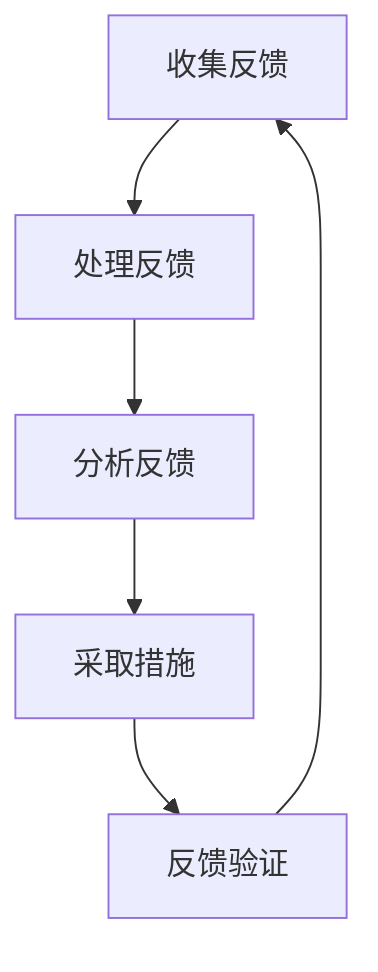

                 

# 一人公司如何建立有效的客户反馈循环

> 关键词：一人公司、客户反馈、循环、优化、持续改进

摘要：
在当今竞争激烈的商业环境中，有效的客户反馈循环对于企业的发展至关重要。尤其是对于一人公司，由于资源和时间的限制，建立高效的客户反馈机制显得尤为关键。本文将详细探讨如何通过逐步分析推理的方法，为一 人公司搭建一个有效的客户反馈循环，从而实现持续优化与成长。

## 1. 背景介绍

一人公司，顾名思义，是指由一位个人独立运营的企业。这类企业在创业初期非常常见，具有灵活性强、决策速度快等优点。然而，由于资源和时间的限制，一人公司在面对客户反馈时往往感到力不从心，难以形成高效的反馈循环。为了解决这一问题，我们需要深入分析客户反馈的重要性，以及如何通过系统化的方法建立有效的反馈循环。

### 1.1 客户反馈的重要性

客户反馈是企业了解市场需求的直接渠道，能够帮助公司迅速调整战略，优化产品或服务，从而提升客户满意度。以下是一些客户反馈对企业发展的重要性：

1. **产品改进**：通过客户反馈，企业可以了解产品在用户实际使用中的问题，及时进行改进，提高产品质量。
2. **市场定位**：客户反馈可以帮助企业明确市场定位，了解目标客户群体的需求和偏好。
3. **竞争力提升**：持续关注客户反馈，企业可以不断优化产品和服务，提升自身在市场中的竞争力。
4. **品牌建设**：积极回应客户反馈，能够增强客户对企业的信任，促进品牌形象的建立。

### 1.2 一人公司面临的挑战

对于一人公司而言，建立有效的客户反馈循环面临以下几大挑战：

1. **资源有限**：一人公司通常缺乏充足的人力、财力和时间来处理大量客户反馈。
2. **信息不对称**：由于规模较小，一人公司可能难以全面了解客户的需求和意见。
3. **反馈渠道单一**：一人公司可能只能依赖有限的渠道收集客户反馈，难以覆盖所有潜在客户。
4. **响应速度慢**：一人公司在处理客户反馈时可能反应迟缓，无法迅速作出调整。

## 2. 核心概念与联系

为了构建一个有效的客户反馈循环，我们需要理解以下几个核心概念，以及它们之间的相互关系。

### 2.1 客户反馈循环的基本流程

一个完整的客户反馈循环包括以下几个步骤：

1. **收集反馈**：通过多种渠道收集客户对产品或服务的反馈。
2. **处理反馈**：对收集到的反馈进行分类、筛选和处理。
3. **分析反馈**：对处理后的反馈进行分析，找出问题的根源和改进的方向。
4. **采取措施**：根据分析结果，制定并实施改进措施。
5. **反馈验证**：对改进措施进行验证，确保问题得到解决，并再次收集客户反馈。

### 2.2 客户反馈循环的Mermaid流程图



### 2.3 核心概念之间的关系

客户反馈循环中的各个步骤并非孤立存在，而是相互联系、相互影响的。例如，处理反馈的质量直接影响到分析反馈的准确性；而分析反馈的结果则决定了采取措施的效果。因此，确保每个步骤的高效运作至关重要。

## 3. 核心算法原理 & 具体操作步骤

### 3.1 数据收集算法原理

为了收集客户反馈，一人公司可以采用以下几种算法原理：

1. **自动数据分析**：利用数据分析工具，从客户行为、社交媒体评论等渠道自动收集数据。
2. **用户调研**：通过问卷调查、用户访谈等方式主动向客户收集反馈。
3. **反馈跟踪**：通过构建反馈跟踪系统，实时监控客户对产品或服务的使用情况，收集反馈。

### 3.2 数据处理算法原理

收集到的反馈需要进行处理，以确保其准确性和可用性。主要步骤包括：

1. **数据清洗**：去除无效、重复和错误的数据。
2. **数据分类**：将反馈根据主题、问题类型等进行分类，便于后续分析。
3. **数据筛选**：根据优先级和重要性，筛选出需要重点关注和处理的反馈。

### 3.3 数据分析算法原理

对处理后的反馈进行分析，以发现问题和改进方向。主要步骤包括：

1. **趋势分析**：通过统计方法，分析反馈中出现的问题和趋势。
2. **关联分析**：找出不同反馈之间的关联，发现潜在的问题根源。
3. **文本分析**：利用自然语言处理技术，对文本反馈进行情感分析、关键词提取等。

### 3.4 实际操作步骤

以下是建立客户反馈循环的具体操作步骤：

1. **确定反馈渠道**：选择合适的反馈渠道，如在线问卷调查、社交媒体互动等。
2. **设计反馈问卷**：根据业务需求，设计有针对性的反馈问卷，确保问题简明扼要。
3. **收集反馈数据**：通过在线工具或人工方式进行数据收集。
4. **数据处理**：使用数据分析工具，对收集到的数据进行处理。
5. **数据分析**：对处理后的数据进行分析，找出问题和改进方向。
6. **制定改进措施**：根据分析结果，制定并实施改进措施。
7. **反馈验证**：对改进措施进行验证，确保问题得到解决。
8. **持续优化**：根据验证结果，持续优化反馈循环，提高反馈质量。

## 4. 数学模型和公式 & 详细讲解 & 举例说明

### 4.1 数学模型

为了更好地理解客户反馈循环中的关键步骤，我们可以引入以下数学模型：

1. **反馈率模型**：
   $$反馈率 = \frac{收集到的反馈数量}{潜在客户数量}$$

2. **反馈响应时间模型**：
   $$反馈响应时间 = \frac{处理反馈所需时间}{反馈数量}$$

3. **反馈改进效果模型**：
   $$改进效果 = \frac{改进后的客户满意度}{原始客户满意度}$$

### 4.2 公式详细讲解

1. **反馈率模型**：

   反馈率模型用于衡量客户反馈的收集效率。反馈率越高，说明客户反馈的收集效果越好。为了提高反馈率，一人公司可以采取以下措施：

   - **增加反馈渠道**：提供多种反馈渠道，如在线问卷、社交媒体、电子邮件等，方便客户反馈。
   - **简化反馈流程**：设计简洁明了的反馈问卷，减少客户的填写负担。
   - **激励反馈**：提供小礼品、优惠券等激励措施，鼓励客户积极参与反馈。

2. **反馈响应时间模型**：

   反馈响应时间模型反映了企业对客户反馈的处理速度。响应时间越短，说明企业的响应速度越快。为了缩短反馈响应时间，一人公司可以：

   - **建立反馈处理团队**：专门负责处理客户反馈，确保反馈得到及时响应。
   - **优化反馈处理流程**：简化处理流程，减少不必要的环节。
   - **采用自动化工具**：利用自动化工具，如邮件提醒、任务分配系统等，提高处理效率。

3. **反馈改进效果模型**：

   反馈改进效果模型用于衡量企业对客户反馈改进的效果。改进效果越高，说明企业的改进措施越有效。为了提高反馈改进效果，一人公司可以：

   - **重视客户需求**：深入了解客户需求，确保改进措施符合客户期望。
   - **多渠道收集反馈**：通过不同渠道收集反馈，全面了解客户意见。
   - **持续优化改进**：根据反馈改进效果，持续优化产品和服务。

### 4.3 举例说明

假设一家一人公司收集到100条客户反馈，处理这些反馈需要10天时间，改进后的客户满意度提升了20%。根据上述模型，可以计算出以下指标：

- **反馈率**：
  $$反馈率 = \frac{100}{1000} = 10\%$$

- **反馈响应时间**：
  $$反馈响应时间 = \frac{10}{100} = 0.1 \text{天/条}$$

- **反馈改进效果**：
  $$改进效果 = \frac{120\%}{100\%} = 1.2$$

通过这些指标，一人公司可以评估自己在客户反馈循环中的表现，并制定相应的改进策略。

## 5. 项目实战：代码实际案例和详细解释说明

### 5.1 开发环境搭建

为了演示如何在一人公司中建立有效的客户反馈循环，我们将使用一个简单的在线问卷调查系统作为案例。以下是开发环境的搭建步骤：

1. **选择开发工具**：选择一款易于使用的在线问卷调查工具，如Google表单。
2. **创建问卷**：设计问卷内容，包括开放式和封闭式问题，以便收集不同类型的信息。
3. **部署问卷**：将问卷部署到企业的官方网站或社交媒体平台上。

### 5.2 源代码详细实现和代码解读

以下是一个基于Google表单的在线问卷调查系统的示例代码：

```html
<!DOCTYPE html>
<html>
<head>
  <title>客户反馈问卷</title>
</head>
<body>
  <h1>欢迎参加我们的客户反馈问卷</h1>
  <form action="https://docs.google.com/forms/u/0/d/e/1FAIpQLSctdfu7-3CprLHdXCEI4CshcYnix1p1AKGn6WYtZx5QwHu7xQ/formResponse" method="POST">
    <label for="q1">您对我们产品的满意度如何？</label>
    <select name="entry.1648097798" required>
      <option value="">请选择</option>
      <option value="非常满意">非常满意</option>
      <option value="满意">满意</option>
      <option value="一般">一般</option>
      <option value="不满意">不满意</option>
      <option value="非常不满意">非常不满意</option>
    </select><br>
    
    <label for="q2">您对产品功能的建议是什么？</label>
    <textarea name="entry.1218797510" rows="4" cols="50"></textarea><br>
    
    <input type="submit" value="提交">
  </form>
</body>
</html>
```

### 5.3 代码解读与分析

上述代码是一个简单的HTML表单，用于收集客户反馈。以下是代码的详细解读：

1. **HTML结构**：
   - `<html>`：定义整个文档的结构。
   - `<head>`：包含文档的元数据，如标题。
   - `<body>`：包含表单内容和提交按钮。

2. **表单设计**：
   - `<form>`：定义表单，包含`action`属性，指向Google表单的提交URL。
   - `<label>`：为表单元素提供标签。
   - `<select>`：创建下拉菜单，用于收集单选反馈。
   - `<option>`：定义下拉菜单的选项。
   - `<textarea>`：创建多行文本框，用于收集开放性反馈。

3. **表单提交**：
   - `<input type="submit">`：创建提交按钮，用于将表单数据发送到Google表单。

通过这个简单的示例，一人公司可以快速搭建一个在线问卷调查系统，从而收集客户反馈。后续，我们可以使用数据分析工具，对收集到的数据进行处理和分析，以优化产品和服务。

## 6. 实际应用场景

### 6.1 电子商务平台

电子商务平台是一个典型的需要建立有效客户反馈循环的场景。通过收集客户对产品、服务、购物体验的反馈，电子商务平台可以：

1. **优化产品**：了解客户对产品的满意度和需求，改进产品设计和功能。
2. **提升服务**：根据客户对客服、物流、支付等服务的反馈，优化服务流程。
3. **增加客户满意度**：及时回应客户的意见和建议，提升整体客户满意度。

### 6.2 教育培训机构

教育培训机构可以通过客户反馈循环，不断优化课程内容和教学方法。例如：

1. **课程评估**：收集学员对课程内容的评价，调整课程设置。
2. **教师反馈**：通过教师对学员反馈的分析，优化教学方法。
3. **学习支持**：根据学员的学习需求，提供更有针对性的学习支持。

### 6.3 咨询服务公司

咨询服务公司需要建立有效的客户反馈循环，以确保为客户提供高质量的服务。例如：

1. **项目评估**：收集客户对咨询项目的反馈，评估项目效果。
2. **服务改进**：根据客户反馈，改进咨询服务流程和方案。
3. **客户关系管理**：通过持续关注客户反馈，维护良好的客户关系。

## 7. 工具和资源推荐

### 7.1 学习资源推荐

1. **《用户体验要素》**：作者：唐纳德·诺曼
   - 本书详细介绍了用户体验设计的核心要素，对构建有效的客户反馈循环有重要指导意义。

2. **《创新者的窘境》**：作者：克里斯坦森
   - 本书探讨了企业在面对市场变化时的困境，强调了客户反馈在创新过程中的重要性。

### 7.2 开发工具框架推荐

1. **Google表单**：https://www.google.com/docs/about/forms/
   - Google表单是一款免费的在线问卷调查工具，适用于快速搭建客户反馈系统。

2. **Google Analytics**：https://www.google.com/analytics/
   - Google Analytics是一款强大的数据分析工具，可以帮助企业分析客户行为和反馈数据。

### 7.3 相关论文著作推荐

1. **《客户关系管理：策略、工具和技术》**：作者：菲利普·科特勒
   - 本书详细介绍了客户关系管理的基本策略和工具，对建立有效的客户反馈循环有重要参考价值。

2. **《用户体验度量：有效衡量用户行为和满意度》**：作者：唐纳德·诺曼
   - 本书探讨了用户体验度量方法，提供了多种评估用户满意度和行为的技术。

## 8. 总结：未来发展趋势与挑战

### 8.1 发展趋势

1. **数据驱动的反馈优化**：随着大数据和人工智能技术的发展，企业将更加依赖数据驱动的反馈优化，实现更加精准的改进。

2. **实时反馈机制**：实时反馈机制的普及，将使企业能够更快速地响应客户需求，提升客户满意度。

3. **个性化和智能化**：通过数据分析，企业将能够为客户提供更加个性化的服务和产品，实现更高效的客户反馈循环。

### 8.2 挑战

1. **数据安全与隐私**：在收集和处理客户反馈时，企业需要确保数据安全和用户隐私，以避免法律风险。

2. **反馈处理效率**：随着反馈量的增加，企业需要提高反馈处理效率，确保能够及时回应客户需求。

3. **持续改进与优化**：在快速变化的市场环境中，企业需要持续优化客户反馈循环，以保持竞争力。

## 9. 附录：常见问题与解答

### 9.1 如何确保客户反馈的真实性？

**解答**：为确保客户反馈的真实性，企业可以采取以下措施：

1. **匿名反馈**：允许客户匿名反馈，降低反馈过程中的心理压力。
2. **多渠道收集**：通过多种渠道收集反馈，如在线问卷、社交媒体、电话等，增加反馈的真实性。
3. **验证反馈**：对反馈进行随机验证，确保反馈来源可靠。

### 9.2 如何处理负面反馈？

**解答**：处理负面反馈时，企业可以采取以下策略：

1. **积极回应**：及时回应负面反馈，表达诚挚的歉意，并承诺改进。
2. **解决具体问题**：针对负面反馈中提到的问题，制定具体的改进措施。
3. **透明沟通**：在改进过程中，保持与客户的沟通，让客户了解企业的改进进展。

## 10. 扩展阅读 & 参考资料

1. **《客户关系管理实践指南》**：作者：克里斯·柯里
   - 本书提供了客户关系管理的全面指南，包括客户反馈循环的构建和实践。

2. **《大数据与客户反馈》**：作者：大卫·罗德里格斯
   - 本书探讨了大数据在客户反馈分析中的应用，帮助企业实现更高效的反馈优化。

3. **《客户体验管理》**：作者：杰夫·德沃斯
   - 本书详细介绍了客户体验管理的方法和实践，对构建有效的客户反馈循环有重要启示。

---

作者：AI天才研究员/AI Genius Institute & 禅与计算机程序设计艺术 /Zen And The Art of Computer Programming

