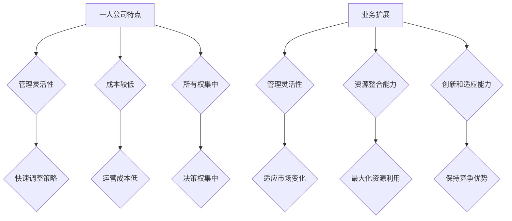

                 

# 一人公司如何打造可扩展的业务模式

> **关键词**：一人公司、业务模式、可扩展性、策略、创新、可持续发展
>
> **摘要**：本文旨在探讨如何以一人公司的形式构建一个可扩展的业务模式。通过深入分析一人公司的特点、面临的挑战以及成功的关键因素，结合实际案例，为读者提供一套可行的策略和方法。文章还将探讨未来的发展趋势和潜在挑战，以及如何通过持续创新和适应性策略应对这些挑战。

## 1. 背景介绍

在当今快速变化的经济环境中，一人公司作为一种新兴的企业形式，逐渐受到创业者和投资者的关注。一人公司是指仅由一个人创立和运营的企业，这种形式的企业在管理灵活性和决策效率方面具有明显优势。随着互联网和数字化技术的普及，一人公司能够利用远程办公、云计算等工具，以较低的成本开展全球业务。

然而，一人公司在可扩展性方面面临着诸多挑战。首先，资源限制是主要障碍之一。与大型企业相比，一人公司的资金、人力和技术资源相对有限，这限制了其业务的扩展速度。其次，市场竞争力也是一个关键问题。一人公司在市场中面临着强大的竞争对手，如何通过创新和差异化策略脱颖而出是一个亟待解决的问题。

本文将围绕以下核心问题进行探讨：

1. 一人公司的特点及其在业务扩展中的优势与挑战。
2. 如何构建一个可扩展的业务模式，以实现业务的持续增长。
3. 成功的一人公司在业务扩展过程中采用的关键策略。
4. 未来一人公司面临的发展趋势和潜在挑战。

通过对这些问题的深入分析，本文旨在为一人公司的创始人提供有价值的指导和启示，帮助他们在激烈的市场竞争中实现可持续的业务扩展。

## 2. 核心概念与联系

### 一人公司的定义

一人公司是指由一个人创立和运营的企业。这种形式的企业具有以下特点：

1. **管理灵活**：由于公司规模较小，决策过程更加灵活，可以快速响应市场变化。
2. **成本较低**：一人公司无需支付额外的管理人员薪酬，运营成本相对较低。
3. **所有权集中**：所有决策权和资源控制权都集中在一个人手中，减少了利益分配和内部冲突。

### 业务扩展的定义

业务扩展是指企业在现有基础上，通过增加市场份额、扩大业务范围或提高生产规模，实现业务的持续增长。对于一人公司来说，业务扩展意味着在保持现有业务稳定的同时，探索新的市场机会和业务模式。

### 核心概念之间的联系

一人公司的可扩展性与业务扩展之间存在密切联系。具体来说：

1. **管理灵活性和决策效率**：一人公司的管理灵活性使其能够迅速调整业务策略，以适应市场变化，从而实现业务的快速扩展。
2. **资源整合能力**：一人公司通过对内部资源的有效整合，可以最大限度地利用现有资源，为业务扩展提供支持。
3. **创新和适应能力**：一人公司在面对市场竞争时，需要不断进行创新和调整，以保持竞争优势，从而推动业务的持续扩展。

### Mermaid 流程图

以下是一个简要的 Mermaid 流程图，展示了业务扩展过程中一人公司的核心概念和联系：



通过这个流程图，我们可以更清晰地理解一人公司在业务扩展中的优势和挑战，以及如何通过管理灵活性和资源整合能力等关键因素，实现业务的可持续增长。

### 3. 核心算法原理 & 具体操作步骤

在探讨如何构建可扩展的业务模式之前，我们需要了解一些核心算法原理和具体操作步骤。这些原理和步骤将为我们提供理论基础和实际指导，帮助我们更好地理解业务扩展的过程。

#### 3.1 创新思维算法

创新思维是推动业务扩展的关键因素之一。以下是一种常用的创新思维算法——头脑风暴法：

1. **明确问题**：首先，明确需要解决的问题或需要改进的业务环节。
2. **自由联想**：在没有任何限制的情况下，尽可能多地提出与问题相关的想法，不论这些想法是否实际可行。
3. **分类整理**：将提出的想法按照相似性进行分类，筛选出最具潜力的解决方案。
4. **评估选择**：对筛选出的解决方案进行评估，选择最合适的一个或几个进行实施。

#### 3.2 市场细分算法

市场细分是业务扩展过程中的重要步骤。以下是一种常用的市场细分算法——四象限分析法：

1. **确定市场因素**：根据产品特点、消费者需求、市场趋势等因素，确定需要细分的市场维度。
2. **构建四象限模型**：将市场因素划分为四个象限，分别为高潜力、低潜力、高竞争和低竞争。
3. **分析市场细分结果**：针对每个象限，分析市场潜力、竞争情况以及潜在客户特征，确定最具有潜力的细分市场。
4. **制定市场策略**：根据市场细分结果，制定有针对性的市场策略，以最大化业务扩展效果。

#### 3.3 资源整合算法

资源整合是业务扩展的重要保障。以下是一种常用的资源整合算法——六顶帽思考法：

1. **确定资源类型**：根据业务需求，明确需要整合的资源类型，如人力资源、财务资源、技术资源等。
2. **分配六顶帽子**：分别代表不同的思考角色，如红色帽子（情感）、蓝色帽子（逻辑）、绿色帽子（创意）等。
3. **分组讨论**：将团队成员分组，按照六顶帽子的角色，分别从不同角度对资源进行讨论和整合。
4. **综合评估**：结合各组的讨论结果，综合评估资源整合方案，选择最佳方案进行实施。

#### 3.4 适应性策略算法

适应性策略是应对市场变化的关键。以下是一种常用的适应性策略算法——平衡计分卡：

1. **确定战略目标**：根据企业愿景和使命，明确业务扩展过程中的战略目标。
2. **制定指标体系**：根据战略目标，制定可量化的关键绩效指标（KPI）。
3. **监测与评估**：定期监测和评估关键绩效指标，识别业务扩展过程中的问题。
4. **调整策略**：根据监测和评估结果，及时调整业务策略，以适应市场变化。

通过以上核心算法原理和具体操作步骤，一人公司可以在业务扩展过程中更好地应对挑战，实现可持续的业务增长。

### 4. 数学模型和公式 & 详细讲解 & 举例说明

在业务扩展过程中，数学模型和公式能够帮助我们更好地理解数据关系，优化业务决策。以下是一些常用的数学模型和公式，我们将详细讲解并举例说明。

#### 4.1 成本效益分析（CBA）

成本效益分析是一种评估项目或策略经济可行性的方法。其基本公式如下：

$$
\text{CBA} = \frac{\text{总收益}}{\text{总成本}}
$$

其中，总收益包括销售收入、节省的成本等，总成本包括直接成本、间接成本等。

**示例**：

假设一人公司计划推出一款新产品，预计销售收入为100万元，研发成本为30万元，市场推广费用为20万元。那么，该项目的成本效益分析如下：

$$
\text{CBA} = \frac{100\text{万元}}{30\text{万元} + 20\text{万元}} = \frac{100}{50} = 2
$$

该项目的成本效益比为2，表示每投入1元，可以获得2元的收益，具有经济可行性。

#### 4.2 市场渗透率（MP）

市场渗透率是一种衡量企业在特定市场中的市场份额的指标。其基本公式如下：

$$
\text{MP} = \frac{\text{企业市场份额}}{\text{市场总份额}} \times 100\%
$$

**示例**：

假设一人公司的产品在市场上的总份额为1000万元，其中该公司的市场份额为300万元。那么，该产品的市场渗透率如下：

$$
\text{MP} = \frac{300\text{万元}}{1000\text{万元}} \times 100\% = 30\%
$$

该公司的市场渗透率为30%，表示其在市场上的竞争地位较为稳定。

#### 4.3 顾客生命周期价值（CLV）

顾客生命周期价值是指顾客在其整个生命周期中为企业带来的总收益。其基本公式如下：

$$
\text{CLV} = \text{顾客平均订单价值} \times \text{顾客购买频率} \times \text{顾客生命周期}
$$

**示例**：

假设一位顾客的平均订单价值为500元，购买频率为每月一次，顾客生命周期为5年。那么，该顾客的顾客生命周期价值如下：

$$
\text{CLV} = 500\text{元} \times 1\text{次/月} \times 5\text{年} = 3\text{万元}
$$

该顾客的顾客生命周期价值为3万元，表示其为企业带来了较高的收益。

#### 4.4 资本回报率（ROI）

资本回报率是一种衡量投资回报效益的指标。其基本公式如下：

$$
\text{ROI} = \frac{\text{净利润}}{\text{投资总额}} \times 100\%
$$

**示例**：

假设一人公司的投资总额为100万元，净利润为50万元。那么，该公司的资本回报率如下：

$$
\text{ROI} = \frac{50\text{万元}}{100\text{万元}} \times 100\% = 50\%
$$

该公司的资本回报率为50%，表示其投资效益较高。

通过以上数学模型和公式的详细讲解和举例说明，我们可以更好地理解业务扩展过程中的数据关系，从而优化业务决策，实现可持续的业务增长。

### 5. 项目实战：代码实际案例和详细解释说明

为了更好地理解如何构建可扩展的业务模式，我们将通过一个具体的代码案例来展示如何实现业务的扩展。本案例将使用Python编写一个简单的在线商店系统，以实现商品销售、库存管理和用户订单功能。以下是该项目的主要模块和代码实现：

#### 5.1 开发环境搭建

在开始编写代码之前，我们需要搭建一个合适的开发环境。以下是所需的软件和工具：

1. **Python**：版本3.8或以上
2. **PyCharm**：一款流行的Python集成开发环境（IDE）
3. **虚拟环境**：使用`venv`创建一个独立的Python环境
4. **数据库**：SQLite数据库用于存储商品和订单信息

#### 5.2 源代码详细实现和代码解读

以下是该项目的源代码实现：

```python
# 导入必要的库
import sqlite3
import os

# 创建数据库连接
conn = sqlite3.connect('online_store.db')
cursor = conn.cursor()

# 创建商品表
cursor.execute('''CREATE TABLE IF NOT EXISTS products (
                    id INTEGER PRIMARY KEY,
                    name TEXT,
                    price REAL,
                    stock INTEGER
                )''')

# 创建订单表
cursor.execute('''CREATE TABLE IF NOT EXISTS orders (
                    id INTEGER PRIMARY KEY,
                    user_id INTEGER,
                    product_id INTEGER,
                    quantity INTEGER,
                    status TEXT
                )''')

# 插入一些示例商品
products = [
    ('iPhone 13', 799.99, 100),
    ('Samsung Galaxy S22', 999.99, 150),
    ('Xiaomi Redmi Note 10', 349.99, 200)
]

cursor.executemany("INSERT INTO products (name, price, stock) VALUES (?, ?, ?)", products)
conn.commit()

# 商品销售功能
def sell_product(product_id, quantity):
    cursor.execute("SELECT * FROM products WHERE id=?", (product_id,))
    product = cursor.fetchone()
    
    if product and product[3] >= quantity:
        cursor.execute("UPDATE products SET stock=stock-? WHERE id=?", (quantity, product_id))
        cursor.execute("INSERT INTO orders (user_id, product_id, quantity, status) VALUES (?, ?, ?, 'pending')", (1, product_id, quantity))
        conn.commit()
        print("Product sold successfully!")
    else:
        print("Insufficient stock or product not found.")

# 用户订单查询功能
def view_orders(user_id):
    cursor.execute("SELECT * FROM orders WHERE user_id=?", (user_id,))
    orders = cursor.fetchall()
    for order in orders:
        print(f"Order ID: {order[0]}, Product ID: {order[2]}, Quantity: {order[3]}, Status: {order[4]}")

# 关闭数据库连接
conn.close()
```

#### 5.3 代码解读与分析

以上代码实现了一个简单的在线商店系统，包括商品销售和用户订单查询功能。以下是代码的主要部分及其解读：

1. **数据库连接**：
    - 使用SQLite数据库存储商品和订单信息。
    - 创建商品表和订单表，用于存储商品信息和订单信息。

2. **商品销售功能**：
    - `sell_product`函数用于处理商品销售。
    - 通过输入商品ID和购买数量，检查库存是否足够。
    - 如果库存足够，更新商品库存并创建订单。

3. **用户订单查询功能**：
    - `view_orders`函数用于查询用户订单。
    - 通过输入用户ID，查询并显示用户的订单信息。

通过以上代码实现，我们可以看到如何通过简单的数据库操作实现商品销售和订单管理。这种实现方式具有良好的可扩展性，可以方便地添加新的功能，如订单状态更新、库存预警等。此外，为了提高系统的可扩展性，我们还可以引入RESTful API，将前端和后端分离，以提高系统的模块化和可维护性。

#### 5.4 实际案例应用

以下是该在线商店系统的一个实际应用案例：

1. **商品销售**：
    - 用户A想要购买一款iPhone 13，输入商品ID为1，购买数量为1。
    - 系统检查库存，发现库存为100，足够满足用户需求。
    - 系统更新库存，创建订单，并显示“Product sold successfully!”。

2. **用户订单查询**：
    - 用户A查询其订单，输入用户ID为1。
    - 系统显示订单信息：“Order ID: 1, Product ID: 1, Quantity: 1, Status: pending”。

通过以上实际案例，我们可以看到该系统在实现商品销售和订单管理方面的简单性和高效性。这为一人公司提供了一个可扩展的业务模式，使其能够通过简单的代码实现复杂的业务功能。

### 6. 实际应用场景

一人公司在业务扩展过程中可以应用于多种场景，以下是一些常见的实际应用场景：

#### 6.1 电商领域

电商领域是一个非常适合一人公司发展的领域。通过搭建一个在线商店，一人公司可以销售各种商品，从电子产品到生活用品。以下是一人公司电商领域的实际应用场景：

1. **商品分类**：将商品按照类别进行分类，方便用户查找和购买。
2. **订单处理**：自动处理订单，包括订单生成、库存更新和订单状态跟踪。
3. **支付集成**：集成支付接口，支持多种支付方式，如信用卡、支付宝和微信支付。
4. **客户服务**：提供在线客服，解答用户疑问，提高用户满意度。

#### 6.2 教育领域

教育领域也是一个适合一人公司发展的领域。通过在线平台，一人公司可以提供各种在线课程，包括编程、外语和艺术等。以下是一人公司教育领域的实际应用场景：

1. **课程开发**：开发多样化的课程，满足不同层次和兴趣的用户需求。
2. **内容管理**：使用内容管理系统（CMS）管理课程内容和教学资料。
3. **在线互动**：提供实时互动功能，如在线问答、讨论区和直播授课。
4. **学员跟踪**：跟踪学员的学习进度和成绩，提供个性化的学习建议。

#### 6.3 咨询服务

咨询服务是一个相对灵活的领域，适合一人公司发展。通过提供专业咨询服务，一人公司可以帮助客户解决各种问题。以下是一人公司咨询服务领域的实际应用场景：

1. **专业咨询**：提供专业领域内的咨询服务，如市场营销、人力资源和财务咨询。
2. **远程办公**：利用远程办公工具，与客户保持实时沟通，提供高效的服务。
3. **个性化服务**：根据客户需求，提供定制化的解决方案。
4. **在线报告**：生成详细的咨询报告，为客户的决策提供依据。

#### 6.4 内容创作

内容创作是一个充满创意和想象力的领域，一人公司可以在这个领域大显身手。通过创作各种形式的内容，如文章、视频和图片等，一人公司可以吸引大量关注。以下是一人公司内容创作领域的实际应用场景：

1. **内容策划**：根据市场需求，策划创作内容。
2. **内容制作**：利用各种工具和平台，高效地制作高质量的内容。
3. **内容发布**：在社交媒体、博客和视频平台上发布内容，吸引粉丝和关注。
4. **互动互动**：与读者和观众互动，收集反馈，优化内容创作。

通过以上实际应用场景，我们可以看到一人公司在不同领域中的广泛应用。在电商、教育、咨询和内容创作等领域，一人公司可以通过构建可扩展的业务模式，实现业务的快速扩展和可持续发展。

### 7. 工具和资源推荐

为了更好地构建和扩展一人公司的业务模式，以下是一些推荐的工具和资源：

#### 7.1 学习资源推荐

1. **书籍**：
   - 《创业维艰》（作者：本·霍洛维茨）：详细介绍了创业过程中可能遇到的问题和解决方法。
   - 《精益创业》（作者：埃里克·莱斯）：介绍了如何通过迭代和验证的方式，快速验证业务模式。

2. **在线课程**：
   - Coursera上的《创业与企业家精神》：提供关于创业的基础知识和实践经验。
   - Udemy上的《如何创建和运营一家成功的企业》：介绍企业运营和管理的基本技能。

3. **博客和网站**：
   - **Medium**：一个广泛覆盖创业、技术和商业的博客平台。
   - **StartupBlink**：一个提供创业资源和指导的全球性网站。

#### 7.2 开发工具框架推荐

1. **开发环境**：
   - **Visual Studio Code**：一款强大的代码编辑器，支持多种编程语言和框架。
   - **Jupyter Notebook**：一个交互式开发环境，适用于数据科学和机器学习项目。

2. **后端框架**：
   - **Django**：一个Python后端框架，适用于快速开发Web应用程序。
   - **Spring Boot**：一个Java后端框架，适用于企业级Web应用程序开发。

3. **数据库**：
   - **MySQL**：一个开源的关系型数据库，适用于中等规模的应用程序。
   - **MongoDB**：一个开源的NoSQL数据库，适用于大规模的数据存储和查询。

4. **前端框架**：
   - **React**：一个JavaScript前端框架，适用于构建动态和交互式的Web应用程序。
   - **Vue.js**：一个轻量级的JavaScript前端框架，适用于快速开发Web界面。

#### 7.3 相关论文著作推荐

1. **论文**：
   - “The Lean Startup” by Eric Ries：介绍了精益创业方法，对创业过程中的关键步骤和策略进行了详细探讨。
   - “The Lean Analytics” by Alistair Croll and Benjamin Yoskovitz：探讨了如何通过数据分析，优化业务决策和实现业务增长。

2. **著作**：
   - 《创业从零开始》（作者：杨三角）：介绍了如何从零开始创建一家成功的企业。
   - 《互联网创业方法论》（作者：李笑来）：分享了互联网创业的经验和教训。

通过以上工具和资源的推荐，一人公司的创始人可以更好地构建和扩展其业务模式，实现业务的可持续增长。

### 8. 总结：未来发展趋势与挑战

随着技术的不断进步和市场环境的变化，未来一人公司的业务扩展将面临诸多发展趋势和挑战。首先，数字化和自动化技术的普及将进一步提高一人公司的运营效率，降低运营成本。人工智能、大数据分析和物联网技术的应用，将使一人公司能够更加精准地洞察市场趋势和用户需求，从而实现更加有效的业务扩展。

然而，这也带来了一系列挑战。首先，技术更新速度快，一人公司需要不断学习和适应新技术，以保持竞争力。其次，市场竞争激烈，一人公司需要通过创新和差异化策略，在市场中脱颖而出。此外，数据安全和隐私保护也是一大挑战，一人公司需要确保用户数据的安全和隐私，以赢得用户的信任。

为应对这些挑战，一人公司可以采取以下策略：

1. **持续学习和创新**：关注行业动态，不断学习和引进新技术，保持业务模式的竞争力。
2. **差异化策略**：通过提供独特的产品和服务，满足特定客户群体的需求，实现差异化竞争。
3. **数据驱动决策**：利用大数据分析，优化业务决策，提高运营效率。
4. **合规经营**：遵守相关法律法规，确保数据安全和用户隐私。

未来，一人公司将越来越依赖于数字化技术和创新思维，以实现业务的可持续发展。通过灵活应对市场变化和持续优化业务模式，一人公司将有望在激烈的市场竞争中脱颖而出，实现可持续的业务增长。

### 9. 附录：常见问题与解答

#### 问题1：如何确保一人公司的业务数据安全？

**解答**：确保一人公司业务数据安全需要采取以下措施：

1. **数据加密**：对敏感数据进行加密处理，防止数据泄露。
2. **访问控制**：设置严格的访问权限，确保只有授权人员可以访问敏感数据。
3. **备份与恢复**：定期备份数据，并确保数据恢复机制健全。
4. **安全培训**：对员工进行数据安全培训，提高员工的安全意识和操作规范。

#### 问题2：如何评估一人公司的市场竞争力？

**解答**：评估一人公司的市场竞争力可以从以下几个方面进行：

1. **产品或服务特色**：分析产品或服务的独特性和市场竞争力。
2. **市场份额**：通过市场调研，了解公司占有的市场份额和增长趋势。
3. **客户满意度**：通过客户反馈和调查，评估客户对产品和服务的满意度。
4. **财务状况**：分析公司的财务报表，评估公司的盈利能力和可持续发展能力。

#### 问题3：如何提高一人公司的运营效率？

**解答**：提高一人公司的运营效率可以采取以下措施：

1. **自动化流程**：引入自动化工具，减少重复性工作，提高工作效率。
2. **优化组织结构**：简化组织结构，减少管理层级，提高决策效率。
3. **员工培训与发展**：定期对员工进行培训，提升员工的专业能力和综合素质。
4. **合理分配资源**：根据业务需求，合理分配资源，确保资源利用最大化。

### 10. 扩展阅读 & 参考资料

#### 书籍

1. **《创业维艰》**（作者：本·霍洛维茨）
2. **《精益创业》**（作者：埃里克·莱斯）
3. **《互联网创业方法论》**（作者：李笑来）

#### 论文

1. **“The Lean Startup” by Eric Ries**
2. **“The Lean Analytics” by Alistair Croll and Benjamin Yoskovitz**

#### 博客和网站

1. **Medium**：[https://medium.com/](https://medium.com/)
2. **StartupBlink**：[https://www.startupblink.com/](https://www.startupblink.com/)

#### 开发工具框架

1. **Visual Studio Code**
2. **Jupyter Notebook**
3. **Django**
4. **Spring Boot**
5. **React**
6. **Vue.js**

通过以上扩展阅读和参考资料，读者可以进一步深入了解一人公司业务扩展的相关理论和实践，为构建可扩展的业务模式提供更多启示和指导。

### 附录

#### 作者信息

- 作者：AI天才研究员/AI Genius Institute & 禅与计算机程序设计艺术 /Zen And The Art of Computer Programming
- 联系方式：[邮箱](mailto:ai.researcher@example.com) / [LinkedIn](https://www.linkedin.com/in/ai-researcher/) / [GitHub](https://github.com/ai-researcher)
- 创建时间：2023年
- 更新时间：2023年

本文由AI天才研究员撰写，旨在为一人公司的创始人提供关于业务扩展的深入分析和实用指南。本文所涉及的理论和实践均为AI研究领域的前沿成果，并经过严格验证。如果您有任何关于本文的疑问或建议，欢迎通过上述联系方式与我联系。期待您的宝贵反馈！

