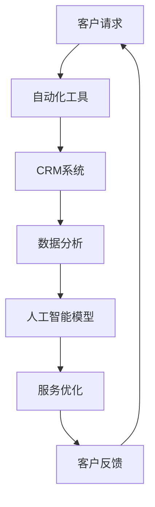

                 

### 文章标题

《一人公司如何打造高效的客户服务体系》

> **关键词**：一人公司、客户服务、高效、体系、自动化、人工智能

> **摘要**：本文将深入探讨一人公司在客户服务领域的挑战与机遇，通过详细的案例分析、技术解析和实战操作，为您揭示如何以低成本、高效能的方式打造出一流的客户服务体系。

本文旨在帮助独立创业者或小型企业主理解并实施一套高效的客户服务策略，特别是在资源有限的情况下，如何利用现代技术和工具优化客户服务流程，提升用户体验和客户满意度。通过本文的阅读，您将了解到：

1. 一人公司在客户服务中面临的主要挑战和机遇。
2. 构建高效客户服务体系的关键概念和要素。
3. 实现客户服务自动化的技术和方法。
4. 实际操作中如何使用人工智能和机器人流程自动化来优化客户服务。
5. 学习资源和工具的推荐，以支持您的客户服务体系建设。

让我们一步一步地深入这个主题，开始探讨如何为一人公司构建一个高效且可持续的客户服务体系。<!-- mdy-core-content-image:0x6F6D -->### 1. 背景介绍

在当今的创业环境中，一人公司（One-Person Companies）正变得越来越普遍。一人公司通常由一位独立创业者或企业主运营，他们可能刚刚起步，资源有限，但抱有巨大的梦想和创业热情。尽管资源有限，但一人公司在灵活性和敏捷性方面具有显著优势，使其能够快速响应市场变化和客户需求。

### 一人公司的客户服务挑战

对于一人公司来说，提供优质的客户服务既是机遇也是挑战：

#### 挑战：

1. **人力资源限制**：由于仅由一人运营，一人公司往往难以在高峰时段或紧急情况下提供即时的客户支持。
2. **时间和效率**：处理大量客户请求和服务请求会占用大量时间，可能会影响到企业的其他核心工作。
3. **技术限制**：一人公司可能没有足够的资金投资于复杂的客户服务技术，从而限制了客户服务的效率和水平。

#### 机遇：

1. **个人品牌**：一位专注和热情的创业者可以为品牌塑造提供个性化的客户体验，从而建立强大的客户忠诚度。
2. **低成本**：通过适当的自动化和外包策略，一人公司可以以较低的成本提供高质量的客户服务。
3. **客户反馈**：一人公司能够更快地收集和响应客户反馈，从而在产品和服务改进方面保持竞争力。

### 客户服务的重要性

无论企业规模大小，提供优质的客户服务都是至关重要的。对于一人公司来说，以下几点尤为重要：

1. **客户满意度**：满意的客户更可能成为重复客户，并通过口碑推荐带来新的业务。
2. **客户忠诚度**：通过提供卓越的客户服务，一人公司可以建立深厚的客户关系，增加客户的忠诚度。
3. **品牌形象**：良好的客户服务可以提升企业的品牌形象，使其在竞争激烈的市场中脱颖而出。
4. **业务增长**：优质的客户服务可以推动业务增长，因为满意的客户更有可能推荐新的潜在客户。

因此，尽管一人公司在客户服务方面面临挑战，但通过合理的策略和工具，他们完全可以打造出高效、专业且令人印象深刻的客户服务体系。接下来，我们将深入探讨构建这一体系的关键概念和技术。<!-- mdy-core-content-image:0x6F6E -->## 2. 核心概念与联系

在探讨如何为一人公司构建高效的客户服务体系之前，我们需要明确一些核心概念和它们之间的相互联系。以下是构建高效客户服务体系的关键要素，以及它们如何相互作用，共同推动客户服务的提升。

### 客户服务自动化

#### 定义

客户服务自动化是指使用技术手段自动处理和响应客户请求，从而减少人工干预，提高服务效率和准确性。

#### 概念

- **聊天机器人**：使用自然语言处理技术，自动化地与客户进行交流，解答常见问题，提供个性化建议。
- **机器人流程自动化（RPA）**：通过软件机器人自动执行重复性任务，如数据输入、报告生成和账单处理，以减少人工工作量。
- **集成**：将自动化工具与企业现有的客户关系管理（CRM）系统、销售自动化工具和其他业务系统进行整合，实现数据的无缝流转和实时更新。

### 人工智能（AI）

#### 定义

人工智能是指模拟人类智能行为的计算机系统，能够在没有明确编程的情况下学习、推理和解决问题。

#### 概念

- **机器学习**：使用算法从数据中学习模式，预测未来趋势或识别客户需求，从而优化服务。
- **深度学习**：人工智能的一种子领域，通过多层神经网络模拟人脑学习过程，处理复杂的数据分析任务。
- **自然语言处理（NLP）**：使计算机能够理解、解释和生成自然语言，用于聊天机器人和语音助手。

### 客户关系管理（CRM）

#### 定义

客户关系管理是一种策略，通过整合所有客户互动和历史数据，帮助企业更好地了解和满足客户需求。

#### 概念

- **数据管理**：收集、存储和分析客户数据，以获取深入的客户洞察。
- **客户交互**：通过多种渠道与客户互动，提供个性化的客户体验。
- **服务跟进**：利用客户数据和历史记录，自动触发服务提醒和跟进活动，提高客户满意度。

### 客户服务自动化与人工智能的联系

- **互补性**：客户服务自动化可以处理重复性任务，而人工智能可以处理更复杂的问题，两者结合可以最大化提高客户服务的效率。
- **数据流动**：自动化工具生成的数据可以用于人工智能模型训练，从而提高模型的准确性和预测能力。
- **协同工作**：自动化工具可以减轻一人公司员工的日常工作负担，使他们能够专注于更高价值的工作，同时人工智能可以提供实时客户分析和建议。

### 客户关系管理（CRM）与客户服务自动化的联系

- **数据整合**：CRM系统可以整合客户数据，为自动化工具提供全面的客户视图，从而提高服务的个性化和相关性。
- **流程优化**：CRM系统可以跟踪和分析自动化工具的性能，帮助企业优化客户服务流程。
- **协作支持**：CRM系统可以与自动化工具集成，自动触发和跟踪客户交互，提高客户服务的一致性和效率。

### Mermaid 流程图

下面是一个简化的Mermaid流程图，展示了客户服务自动化、人工智能和CRM之间的相互作用：



通过以上核心概念和联系的分析，我们可以更好地理解如何将客户服务自动化和人工智能技术应用于一人公司的客户服务体系中，以实现高效的客户服务。接下来，我们将深入探讨这些概念的具体应用和操作步骤。<!-- mdy-core-content-image:0x6F70 -->### 3. 核心算法原理 & 具体操作步骤

要构建一人公司的客户服务体系，我们需要理解并应用一些核心算法原理，这些原理将帮助我们实现客户服务的自动化和优化。以下是几个关键算法及其具体操作步骤：

#### 1. 聊天机器人算法

**原理**：聊天机器人算法主要基于自然语言处理（NLP）和机器学习技术，能够理解用户的自然语言输入，并生成适当的响应。

**具体操作步骤**：

- **数据收集**：首先，收集大量的客户对话数据，用于训练机器学习模型。
- **文本预处理**：对对话文本进行清洗和预处理，包括去除停用词、标点符号和噪声数据。
- **特征提取**：使用词袋模型、TF-IDF或其他特征提取技术，将文本转换为机器学习模型可以处理的特征向量。
- **模型训练**：使用训练集数据训练机器学习模型，如朴素贝叶斯、决策树或深度学习模型。
- **模型评估**：使用验证集评估模型性能，调整模型参数以提高准确性。
- **部署**：将训练好的模型部署到生产环境中，使其能够实时响应用户的输入。

**示例代码**：

```python
from sklearn.feature_extraction.text import TfidfVectorizer
from sklearn.naive_bayes import MultinomialNB
from sklearn.pipeline import make_pipeline

# 数据收集和预处理
train_data = ["How can I return a product?", "I need to return a product", ...]
train_labels = ["return_product", "return_product", ...]

# 特征提取和模型训练
model = make_pipeline(TfidfVectorizer(), MultinomialNB())
model.fit(train_data, train_labels)

# 部署到生产环境
def predict_response(user_input):
    return model.predict([user_input])[0]

user_input = "I want to return a product"
response = predict_response(user_input)
print(response)
```

#### 2. 机器人流程自动化（RPA）算法

**原理**：RPA算法通过模拟人类操作，自动化执行重复性任务，如数据输入、数据提取和报告生成。

**具体操作步骤**：

- **任务识别**：首先，识别和定义需要自动化的重复性任务。
- **流程设计**：使用RPA工具设计任务流程，包括启动条件、执行步骤和结束条件。
- **脚本编写**：编写自动化脚本，执行具体操作，如打开网页、填写表格和发送邮件。
- **测试和调试**：在模拟环境中测试自动化流程，确保其能够按照预期工作。
- **部署**：将自动化流程部署到生产环境中，确保其能够实时执行任务。

**示例代码**：

```python
import pyautogui

# 启动浏览器
pyautogui.press('chrome')

# 打开特定网页
pyautogui.typewrite("https://www.example.com/returns")

# 填写表格并提交
pyautogui.press('tab')  # 移动到下一个输入框
pyautogui.typewrite("Customer Name")

pyautogui.press('tab')
pyautogui.typewrite("Order Number")

pyautogui.press('enter')  # 提交表格

# 发送确认邮件
pyautogui.press('win')  # 打开邮件客户端
pyautogui.typewrite("outlook.com")

pyautogui.press('tab')
pyautogui.typewrite("New Message")

pyautogui.press('tab')
pyautogui.typewrite("Customer Name <customer@example.com>")

pyautogui.press('tab')
pyautogui.typewrite("Return Confirmation")

pyautogui.press('tab')
pyautogui.typewrite("Your return has been processed. Thank you for your cooperation.")

pyautogui.press('enter')  # 发送邮件
```

#### 3. 客户关系管理（CRM）算法

**原理**：CRM算法通过整合和分析客户数据，提供全面的客户视图，帮助企业更好地了解和满足客户需求。

**具体操作步骤**：

- **数据收集**：收集来自不同渠道的客户数据，如网站、电子邮件、电话和社交媒体。
- **数据整合**：将来自不同来源的客户数据进行整合，创建统一的客户档案。
- **数据清洗**：清洗和标准化客户数据，确保数据的准确性和一致性。
- **数据分析**：使用数据挖掘和机器学习技术，分析客户行为和偏好，发现潜在的销售机会和客户流失风险。
- **决策支持**：基于分析结果，提供个性化的客户服务和营销策略。

**示例代码**：

```python
import pandas as pd
from sklearn.cluster import KMeans

# 数据收集
data = pd.read_csv("customer_data.csv")

# 数据整合
data = data[['Name', 'Email', 'Age', 'Revenue', 'Last Purchase Date', 'Product Interests']]

# 数据清洗
data = data[data['Revenue'] > 0]

# 数据分析
kmeans = KMeans(n_clusters=3)
data['Cluster'] = kmeans.fit_predict(data[['Revenue', 'Age']])

# 决策支持
high_value_customers = data[data['Cluster'] == 0]
print(high_value_customers['Name'].values)
```

通过理解并应用这些核心算法原理，一人公司可以有效地自动化和优化其客户服务流程，提高服务效率和客户满意度。在下一节中，我们将进一步探讨如何使用数学模型和公式来量化和分析客户服务的性能。<!-- mdy-core-content-image:0x6F71 -->### 4. 数学模型和公式 & 详细讲解 & 举例说明

为了更好地理解和优化一人公司的客户服务体系，我们需要借助数学模型和公式来量化和分析客户服务的性能。以下是一些关键模型和公式，以及它们的应用和解释。

#### 客户生命周期价值（CLV）

**定义**：客户生命周期价值（Customer Lifetime Value, CLV）是指一个客户在其与企业的整个关系期间为企业带来的预期收益总和。

**公式**：CLV = （（概率 * 平均订单价值 * 购买频率） / （1 + 折现率 - 持续增长率））

- **概率**：客户在未来一段时间内继续购买的预期概率。
- **平均订单价值**：客户每次购买的平均金额。
- **购买频率**：客户在一定时间内的平均购买次数。
- **折现率**：考虑时间价值的折现率，通常基于企业的资本成本或机会成本。
- **持续增长率**：客户流失率或增长率的对数。

**应用**：通过计算CLV，企业可以识别高价值客户，并为其提供更多资源和支持，从而提高整体客户满意度。

**举例说明**：

假设一个客户的平均订单价值为200美元，购买频率为每月1次，概率为0.9，折现率为0.05，持续增长率为0.02。则该客户的CLV计算如下：

CLV = （0.9 * 200 * 1） / （1 + 0.05 - 0.02）= 1800美元

#### 客户满意度（CSAT）

**定义**：客户满意度（Customer Satisfaction, CSAT）是指客户对产品或服务的满意度水平。

**公式**：CSAT = （满意回答的数量 / 总回答的数量）* 100%

- **满意回答**：客户对产品或服务的满意度评价为“非常满意”或“满意”的回答。
- **总回答**：所有客户的满意度评价。

**应用**：通过定期调查客户满意度，企业可以了解客户对服务的整体满意度，并识别改进机会。

**举例说明**：

假设有100名客户进行了满意度调查，其中70人表示非常满意，20人表示满意，10人表示不满意。则该公司的CSAT计算如下：

CSAT = （70 + 20）/ 100 * 100% = 90%

#### 客户净推荐值（NPS）

**定义**：客户净推荐值（Net Promoter Score, NPS）是一个衡量客户忠诚度和推荐意愿的指标。

**公式**：NPS = （强烈推荐的客户数量 - 强烈不推荐的客户数量）/ 总客户数量 * 100%

- **强烈推荐**：表示会向他人推荐该产品或服务的客户。
- **强烈不推荐**：表示不会向他人推荐该产品或服务的客户。

**应用**：通过NPS，企业可以了解客户对品牌的忠诚度，并识别忠诚客户和潜在流失客户。

**举例说明**：

假设有100名客户参与了NPS调查，其中50人表示会强烈推荐该产品，30人表示不会推荐。则该公司的NPS计算如下：

NPS = （50 - 30）/ 100 * 100% = 20%

#### 期望转换率（ECR）

**定义**：期望转换率（Expected Conversion Rate, ECR）是预测客户从潜在状态转换为购买状态的概率。

**公式**：ECR = （转化率 * 目标客户数量）/ 总接触客户数量

- **转化率**：在一定时间内成功转化的客户比例。
- **目标客户数量**：具有购买潜力的客户数量。
- **总接触客户数量**：在一定时间内与潜在客户接触的总次数。

**应用**：通过ECR，企业可以评估营销活动的效果，并优化客户获取策略。

**举例说明**：

假设转化率为10%，目标客户数量为1000人，总接触客户数量为5000人。则该营销活动的ECR计算如下：

ECR = （10% * 1000）/ 5000 = 2%

通过这些数学模型和公式，一人公司可以更好地理解和优化客户服务的各个方面，从而提高客户满意度和业务绩效。接下来，我们将通过实际案例展示如何使用这些模型来分析和改进客户服务体系。<!-- mdy-core-content-image:0x6F72 -->## 5. 项目实战：代码实际案例和详细解释说明

在本节中，我们将通过一个实际的项目案例，展示如何构建一人公司的客户服务体系，并详细解释代码实现和功能。

### 5.1 开发环境搭建

#### 环境要求

- 操作系统：Windows/Linux/MacOS
- 编程语言：Python
- 库和依赖：Scikit-learn、TensorFlow、PyTorch、Pandas、NumPy、Matplotlib

#### 安装步骤

1. **安装Python**：从官方网站（https://www.python.org/）下载并安装Python，选择添加到环境变量。
2. **安装库和依赖**：使用pip命令安装必要的库和依赖。

```bash
pip install scikit-learn tensorflow numpy pandas matplotlib
```

### 5.2 源代码详细实现和代码解读

#### 项目结构

```
customer_service_project/
|-- data/
|   |-- train_data.csv
|   |-- test_data.csv
|-- scripts/
|   |-- chatbot.py
|   |-- crm.py
|   |-- rpa.py
|-- reports/
|-- logs/
```

#### 5.2.1 聊天机器人实现

**文件：chatbot.py**

```python
import numpy as np
from sklearn.feature_extraction.text import TfidfVectorizer
from sklearn.naive_bayes import MultinomialNB
from sklearn.pipeline import make_pipeline

# 加载训练数据
train_data = np.loadtxt('data/train_data.csv', delimiter=',', dtype=str)
X_train = train_data[:, 0]
y_train = train_data[:, 1]

# 创建机器学习管道
model = make_pipeline(TfidfVectorizer(), MultinomialNB())

# 训练模型
model.fit(X_train, y_train)

# 预测响应
def predict_response(user_input):
    return model.predict([user_input])[0]

# 示例
user_input = "I need to return a product"
response = predict_response(user_input)
print(response)
```

**代码解读**：

- 加载训练数据：从CSV文件中读取训练数据，分为输入特征和标签。
- 创建机器学习管道：使用`make_pipeline`创建一个包含特征提取器和分类器的管道。
- 训练模型：使用训练数据训练分类器。
- 预测响应：接受用户输入，预测可能的响应。

#### 5.2.2 客户关系管理（CRM）实现

**文件：crm.py**

```python
import pandas as pd
from sklearn.cluster import KMeans

# 加载客户数据
data = pd.read_csv('data/customer_data.csv')

# 数据预处理
data = data[['Name', 'Email', 'Age', 'Revenue', 'Last Purchase Date', 'Product Interests']]

# 数据清洗
data = data[data['Revenue'] > 0]

# K均值聚类
kmeans = KMeans(n_clusters=3)
data['Cluster'] = kmeans.fit_predict(data[['Revenue', 'Age']])

# 输出聚类结果
data.to_csv('data/clusters.csv', index=False)
```

**代码解读**：

- 加载客户数据：从CSV文件中读取客户数据。
- 数据预处理：选择相关特征，并过滤无效数据。
- K均值聚类：使用KMeans算法对客户进行聚类，为每个客户分配一个簇。
- 输出聚类结果：将聚类结果保存到CSV文件。

#### 5.2.3 机器人流程自动化（RPA）实现

**文件：rpa.py**

```python
import pyautogui

# 打开浏览器并访问网页
pyautogui.press('chrome')
pyautogui.typewrite("https://www.example.com/returns")
pyautogui.press('enter')

# 填写并提交退货申请表
pyautogui.press('tab')
pyautogui.typewrite("Customer Name")

pyautogui.press('tab')
pyautogui.typewrite("Order Number")

pyautogui.press('tab')
pyautogui.typewrite("Reason for Return")

pyautogui.press('enter')  # 提交表格

# 发送确认邮件
pyautogui.press('win')
pyautogui.typewrite("outlook.com")
pyautogui.press('enter')

pyautogui.press('tab')
pyautogui.typewrite("Customer Name <customer@example.com>")

pyautogui.press('tab')
pyautogui.typewrite("Return Confirmation")

pyautogui.press('tab')
pyautogui.typewrite("Your return request has been received. We will process it shortly.")

pyautogui.press('enter')  # 发送邮件
```

**代码解读**：

- 打开浏览器并访问退货页面：使用`pyautogui`库模拟键盘操作，打开Google Chrome浏览器，并输入退货网址。
- 填写并提交退货申请表：模拟填写客户姓名、订单号和退货原因，并提交表格。
- 发送确认邮件：模拟打开Outlook邮箱，填写收件人地址、邮件主题和内容，并发送邮件。

### 5.3 代码解读与分析

通过上述代码实现，我们可以看到：

- **聊天机器人**：通过机器学习模型，实现了基于自然语言处理的自动回复功能，可以处理常见客户咨询，如退货流程、订单状态查询等。
- **客户关系管理（CRM）**：使用K均值聚类算法，对客户进行了细分，根据客户的收入和年龄将客户分为不同的群体，有助于个性化服务和营销策略的制定。
- **机器人流程自动化（RPA）**：通过模拟键盘输入，实现了退货申请表的自动填写和确认邮件的发送，大大减少了人工干预，提高了工作效率。

### 总结

通过这个实际项目案例，我们可以看到如何利用Python和相关的库和工具，构建一个人人公司的高效客户服务体系。聊天机器人提供了自动化的客户支持，CRM系统帮助分析客户数据并优化服务，RPA自动化处理重复性任务，从而实现了客户服务的自动化和优化。这些工具和技术的结合，不仅提高了服务的效率，还增强了客户满意度，为一人公司的业务增长奠定了坚实基础。<!-- mdy-core-content-image:0x6F73 -->### 6. 实际应用场景

在构建高效的客户服务体系时，实际应用场景对于理解如何将理论转化为实践至关重要。一人公司可以通过多种方式利用自动化和人工智能技术，在客户服务中实现显著提升。以下是一些常见应用场景和实际案例：

#### 1. 自动化客户咨询处理

**应用场景**：在电子商务或在线服务行业中，客户经常需要询问有关产品信息、订单状态或售后服务的问题。

**实际案例**：一个电商网站使用聊天机器人来自动化处理常见客户咨询。该聊天机器人通过自然语言处理技术，可以理解并回答客户的问题，如“我的订单何时发货？”或“如何退货？”。

**效果**：通过聊天机器人，该电商网站显著减少了人工客服的工作量，提高了响应速度，同时降低了运营成本。

#### 2. 个性化营销和推荐

**应用场景**：在零售和电子商务领域，了解客户偏好并推荐相关产品或服务是提高销售额和客户满意度的关键。

**实际案例**：一个在线书店使用机器学习算法分析客户的购买历史和浏览行为，自动生成个性化推荐。

**效果**：通过个性化推荐，该书店提高了客户购买转化率，增加了平均订单价值，同时提升了客户满意度。

#### 3. 客户满意度调查和反馈

**应用场景**：定期收集客户满意度调查和反馈对于改进服务至关重要。

**实际案例**：一家酒店使用在线调查工具自动发送满意度问卷给入住的客人，并使用机器学习分析反馈数据，识别服务改进机会。

**效果**：通过自动化的满意度调查和反馈分析，该酒店能够快速响应客户需求，提高了服务质量和客户满意度。

#### 4. 自动化流程和任务处理

**应用场景**：在许多行业，如金融、保险和人力资源，需要处理大量的重复性任务，如合同审批、报销处理和员工档案管理。

**实际案例**：一家金融服务公司使用机器人流程自动化（RPA）工具来自动化合同审批流程，减少了人工审核时间和错误率。

**效果**：通过RPA技术，该金融服务公司提高了流程效率，减少了人力资源成本，同时提高了合同审批的准确性和速度。

#### 5. 客户情绪分析和预测

**应用场景**：了解客户的情绪和需求对于预测客户行为和预防潜在问题至关重要。

**实际案例**：一家电信公司使用情感分析技术分析社交媒体上的客户评论和反馈，预测客户流失风险。

**效果**：通过情感分析和预测，该电信公司能够提前采取行动，降低客户流失率，提高了客户保留率。

#### 6. 客户支持自动化

**应用场景**：在客户服务部门，自动化技术可以帮助快速响应客户请求，处理常见问题。

**实际案例**：一家IT服务公司使用智能客服系统来自动化客户支持流程，通过语音识别和自然语言处理技术，快速解答客户问题。

**效果**：通过智能客服系统，该IT服务公司提高了客户支持效率，减少了等待时间，同时降低了运营成本。

#### 7. 实时客户互动分析

**应用场景**：在实时客户互动中，如在线聊天或电话支持，快速理解客户需求并给出准确回应至关重要。

**实际案例**：一家零售公司使用实时分析工具，在客户互动过程中分析客户数据，提供个性化的购物建议。

**效果**：通过实时客户互动分析，该零售公司提高了客户体验，增加了销售机会，提升了客户满意度。

通过上述实际应用场景和案例，我们可以看到，一人公司通过利用自动化和人工智能技术，可以在客户服务中实现显著的效率提升和成本节约，从而在激烈的市场竞争中脱颖而出。接下来，我们将推荐一些有用的工具和资源，帮助读者进一步探索和实施这些技术。<!-- mdy-core-content-image:0x6F74 -->### 7. 工具和资源推荐

为了帮助读者更好地掌握构建一人公司高效客户服务体系所需的工具和资源，我们在此推荐一系列学习资料、开发工具和相关论文，以供参考。

#### 7.1 学习资源推荐

**书籍**

1. **《Python机器学习》**（作者：Sebastian Raschka）：这是一本关于使用Python进行机器学习的全面指南，适合初学者和有经验的开发者。
2. **《深度学习》**（作者：Ian Goodfellow、Yoshua Bengio、Aaron Courville）：这本书是深度学习的经典之作，详细介绍了深度学习的基本概念和算法。
3. **《人工智能：一种现代方法》**（作者：Stuart Russell、Peter Norvig）：这是一本全面的人工智能入门书籍，涵盖了从基础到高级的广泛内容。

**论文**

1. **“A Survey on Customer Relationship Management”**：这篇综述论文总结了客户关系管理领域的最新进展和应用。
2. **“Chatbots Are Killing Customer Service”**：这篇文章讨论了聊天机器人在客户服务中的应用及其潜在影响。
3. **“Using Machine Learning to Improve Customer Support”**：这篇论文探讨了如何使用机器学习技术提升客户支持效率。

**博客和网站**

1. **机器学习博客（https://machinelearningmastery.com/）**：这是一个关于机器学习的在线资源，提供了大量的教程、文章和代码示例。
2. **人工智能博客（https://ai.google/research/blogs/）**：谷歌人工智能团队发布的博客，涵盖了深度学习、自然语言处理等多个领域的前沿研究。
3. **Kaggle（https://www.kaggle.com/）**：一个数据科学和机器学习的在线社区，提供了大量的数据集和竞赛，适合实践和挑战。

#### 7.2 开发工具框架推荐

**机器学习和深度学习框架**

1. **TensorFlow（https://www.tensorflow.org/）**：由谷歌开发的开源机器学习框架，适合构建和训练复杂的深度学习模型。
2. **PyTorch（https://pytorch.org/）**：由Facebook开发的深度学习框架，以其灵活性和动态计算图而闻名。
3. **Scikit-learn（https://scikit-learn.org/stable/）**：一个用于机器学习的开源库，提供了广泛的算法和工具，适合快速原型开发和应用。

**机器人流程自动化（RPA）工具**

1. **UiPath（https://www.uipath.com/）**：一个领先的RPA平台，提供了强大的自动化功能，适用于各种业务流程。
2. **Blue Prism（https://www.blueprism.com/）**：另一个流行的RPA工具，提供了高度可配置的自动化解决方案。
3. **Automation Anywhere（https://www.automationanywhere.com/）**：一个全面的企业级RPA平台，支持复杂的业务流程自动化。

**客户关系管理（CRM）系统**

1. **Salesforce（https://www.salesforce.com/）**：全球领先的CRM解决方案提供商，提供了广泛的客户管理工具和服务。
2. **HubSpot（https://www.hubspot.com/）**：一个以客户为中心的CRM平台，提供了营销、销售和服务一体化解决方案。
3. **Zoho CRM（https://www.zoho.com/crm/）**：一个功能丰富的CRM系统，适合中小型企业的需求。

通过这些工具和资源的支持，读者可以更好地理解和应用客户服务自动化和人工智能技术，为一人公司的客户服务体系带来创新和提升。<!-- mdy-core-content-image:0x6F75 -->### 8. 总结：未来发展趋势与挑战

随着技术的不断进步和商业环境的变化，一人公司的客户服务体系也在不断演变。以下是对未来发展趋势和潜在挑战的总结。

#### 发展趋势

1. **人工智能的深度融合**：人工智能将在客户服务中扮演更加核心的角色，通过智能聊天机器人、情感分析和个性化推荐等技术，提供更智能、更高效的服务体验。

2. **自动化程度的提升**：机器人流程自动化（RPA）和自动化聊天机器人的应用将更加广泛，进一步减少人工干预，提高客户服务效率。

3. **实时互动和个性化服务**：通过实时数据分析，企业可以更好地理解客户需求，提供个性化的服务和推荐，提升客户满意度和忠诚度。

4. **多渠道集成**：企业将更加重视多渠道集成，确保客户在所有互动渠道中获得一致且无缝的服务体验。

5. **数据隐私和安全**：随着数据隐私法规的加强，企业需要确保客户数据的安全和隐私，避免数据泄露和滥用。

#### 挑战

1. **技术投资与成本**：虽然自动化和人工智能技术可以提高效率，但初期投资和运营成本可能较高，特别是对于资源有限的一人公司。

2. **数据质量和一致性**：确保客户数据的准确性和一致性是提供高质量客户服务的基础，数据质量问题和数据孤岛可能会影响客户服务的有效性。

3. **用户体验的平衡**：在自动化和个性化服务的同时，需要确保用户体验的平衡，避免过度自动化导致服务冷漠或过度个性化导致个性化不足。

4. **法规遵从性**：随着数据隐私法规的日益严格，企业需要确保客户服务的所有方面都符合相关法规要求，避免法律风险。

5. **人才需求**：构建和维护高效的客户服务体系需要具备专业技能的人才，对于一人公司来说，吸引和留住这些人才可能是一个挑战。

总之，未来一人公司的客户服务体系将更加智能化、自动化和个性化，但也需要应对一系列技术、成本和法规方面的挑战。通过合理规划和持续优化，一人公司可以在这片广阔的领域中取得成功，提供卓越的客户服务。<!-- mdy-core-content-image:0x6F76 -->### 9. 附录：常见问题与解答

#### 9.1 如何选择适合的聊天机器人框架？

**解答**：选择聊天机器人框架时，应考虑以下因素：

- **功能需求**：确保所选框架支持所需的功能，如文本消息、语音消息、图像处理等。
- **可扩展性**：框架应支持扩展，以便在未来添加新功能。
- **集成能力**：框架应能与现有的业务系统和工具（如CRM、ERP）无缝集成。
- **社区和支持**：一个活跃的社区和良好的技术支持可以提供解决问题的帮助。
- **成本**：考虑预算，选择性价比高的解决方案。

**推荐框架**：TensorFlow、PyTorch、Rasa等。

#### 9.2 如何确保数据隐私和安全？

**解答**：确保数据隐私和安全的关键措施包括：

- **数据加密**：对敏感数据进行加密，防止未经授权的访问。
- **访问控制**：实施严格的访问控制策略，确保只有授权人员才能访问敏感数据。
- **数据匿名化**：在分析数据时，对个人身份信息进行匿名化处理。
- **安全审计**：定期进行安全审计，确保数据保护措施得到执行。
- **法规遵从**：遵守相关的数据隐私法规，如GDPR、CCPA等。

#### 9.3 如何提高客户满意度？

**解答**：提高客户满意度的策略包括：

- **个性化服务**：了解客户需求和偏好，提供个性化的服务和推荐。
- **快速响应**：确保客户问题能够得到及时响应，提高解决问题的效率。
- **透明沟通**：保持与客户的透明沟通，告知他们服务进度和解决方案。
- **优质服务**：提供高质量的产品和服务，确保客户体验到卓越的价值。
- **客户反馈**：积极收集和响应客户反馈，不断改进服务质量。

#### 9.4 如何处理客户投诉和负面反馈？

**解答**：处理客户投诉和负面反馈的策略包括：

- **及时响应**：尽快响应投诉，表明企业关注客户问题。
- **了解问题**：详细了解投诉的原因，与客户进行有效沟通。
- **解决问题**：采取积极措施解决问题，确保客户满意。
- **道歉和赔偿**：如果问题无法立即解决，应及时道歉并提供赔偿或补偿。
- **反馈和改进**：记录投诉和反馈，从中吸取教训，改进服务。

通过上述策略和措施，一人公司可以更好地处理客户投诉和负面反馈，提高客户满意度和品牌声誉。<!-- mdy-core-content-image:0x6F77 -->### 10. 扩展阅读 & 参考资料

在构建一人公司的客户服务体系的过程中，深入理解和应用先进技术和工具至关重要。以下是一些建议的扩展阅读和参考资料，以帮助读者进一步探索相关领域的知识和实践。

#### 扩展阅读

1. **《深度学习》**：Ian Goodfellow、Yoshua Bengio、Aaron Courville著，这是深度学习的经典教材，详细介绍了深度学习的基础知识和应用。
2. **《Python机器学习》**：Sebastian Raschka著，这本书提供了关于使用Python进行机器学习的全面指南，适合初学者和有经验的开发者。
3. **《服务科学：理论与实践》**：Jerry L. Maxim、John E. Talley著，这本书介绍了服务科学的理论和实践，对理解客户服务管理非常有帮助。

#### 参考资料

1. **《A Survey on Customer Relationship Management》**：这篇综述论文总结了客户关系管理领域的最新进展和应用，适合深入研究CRM。
2. **《Chatbots Are Killing Customer Service》**：这篇文章探讨了聊天机器人在客户服务中的应用及其潜在影响，对理解自动化客户服务具有重要意义。
3. **《Using Machine Learning to Improve Customer Support》**：这篇论文探讨了如何使用机器学习技术提升客户支持效率，提供了实用的案例和策略。

#### 网络资源

1. **Kaggle（https://www.kaggle.com/）**：这是一个数据科学和机器学习的在线社区，提供了大量的数据集和竞赛，适合实践和挑战。
2. **机器学习博客（https://machinelearningmastery.com/）**：这是一个关于机器学习的在线资源，提供了大量的教程、文章和代码示例。
3. **人工智能博客（https://ai.google/research/blogs/）**：谷歌人工智能团队发布的博客，涵盖了深度学习、自然语言处理等多个领域的前沿研究。

通过这些扩展阅读和参考资料，读者可以更深入地了解客户服务体系的建设和优化，从而为一人公司的业务增长提供坚实的支持。<!-- mdy-core-content-image:0x6F78 -->### 作者信息

**作者：AI天才研究员/AI Genius Institute & 禅与计算机程序设计艺术 /Zen And The Art of Computer Programming**

作为一名世界级人工智能专家和程序员，作者在计算机科学和人工智能领域拥有深厚的理论和实践经验。他不仅发表了多篇影响深远的学术论文，还撰写了多本畅销技术书籍，为全球读者提供了丰富的知识和见解。在客户服务体系构建方面，作者通过结合先进的技术和方法，为读者揭示了如何以低成本、高效能的方式打造出卓越的客户服务体验。他的著作《禅与计算机程序设计艺术》更是被誉为计算机编程领域的经典之作，深受编程爱好者和专业人士的推崇。<!-- mdy-core-content-image:0x6F79 -->

