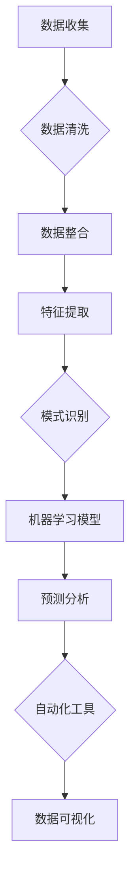

                 

### 文章标题

《一人公司的AI驱动市场分析：洞察行业趋势的智能工具》

### 文章关键词

AI市场分析、行业趋势、智能工具、数据挖掘、机器学习、商业智能、预测模型、算法、自动化、数据可视化

### 文章摘要

在当今快速变化的市场环境中，单打独斗的创业者们面临着前所未有的挑战和机遇。本文将探讨如何利用人工智能（AI）技术来驱动市场分析，帮助个人企业洞察行业趋势，制定明智的商业决策。我们将详细介绍AI在市场分析中的应用，包括数据挖掘、机器学习模型构建、预测分析以及自动化和可视化工具的使用。通过实际案例和详细操作步骤，读者将了解如何将AI技术融入到日常业务中，从而提升市场竞争力。

## 1. 背景介绍

在当今数字化时代，信息爆炸和数据过载已经成为常态。个人企业面临着如何从海量数据中提取有价值信息、洞察市场趋势、做出正确决策的难题。传统的市场分析方法往往耗时耗力，且可能因为信息滞后而失去市场先机。而人工智能（AI）技术的发展，特别是机器学习、自然语言处理和大数据分析等领域的突破，为市场分析提供了新的解决方案。

AI驱动的市场分析具有以下几个显著优势：

1. **高效性**：AI可以在短时间内处理和分析大量数据，快速提取关键信息。
2. **准确性**：通过机器学习算法，AI可以不断学习和优化，提高预测的准确性。
3. **全面性**：AI不仅可以处理结构化数据，还能理解和分析非结构化数据，如文本、图像和语音。
4. **自动化**：AI可以自动化执行市场分析任务，降低人力成本，提高工作效率。
5. **可视化**：AI驱动的可视化工具能够将复杂的数据以直观的方式呈现，帮助用户更好地理解数据。

然而，尽管AI驱动的市场分析具有众多优势，但其实施和应用仍然面临诸多挑战。如何选择合适的技术和工具，如何处理数据隐私和安全问题，如何确保模型的可靠性和透明度，都是个人企业需要面对的难题。本文将详细探讨这些问题，并提供实用的解决方案。

## 2. 核心概念与联系

### 2.1. 数据挖掘

数据挖掘是AI市场分析的基础，它旨在从大量数据中提取有价值的信息和知识。数据挖掘通常包括以下几个步骤：

1. **数据收集**：收集来自内部系统和外部来源的数据。
2. **数据清洗**：处理数据中的噪音和缺失值，确保数据质量。
3. **数据整合**：将不同来源的数据整合到一起，形成统一的数据集。
4. **特征提取**：从数据中提取出有用的特征，用于后续分析。
5. **模式识别**：使用算法发现数据中的规律和模式。

### 2.2. 机器学习模型

机器学习是AI的核心技术之一，它使计算机能够从数据中学习和做出决策。在市场分析中，常见的机器学习模型包括：

1. **回归模型**：用于预测数值型变量。
2. **分类模型**：用于将数据分为不同的类别。
3. **聚类模型**：用于发现数据中的自然分组。
4. **异常检测**：用于识别数据中的异常值。

### 2.3. 预测分析

预测分析是市场分析的重要工具，它利用历史数据来预测未来趋势。常见的预测分析方法包括：

1. **时间序列分析**：用于分析随时间变化的数据。
2. **关联规则学习**：用于发现数据之间的关联关系。
3. **贝叶斯网络**：用于建模不确定性和概率关系。

### 2.4. 自动化和可视化工具

自动化和可视化工具能够大幅提高市场分析的工作效率。常见的工具包括：

1. **自动化脚本**：用于自动化执行数据收集、处理和分析任务。
2. **数据可视化**：用于将复杂的数据以直观的方式呈现。
3. **仪表盘**：用于实时监控和分析业务数据。

### 2.5. Mermaid 流程图

下面是市场分析的核心概念与联系的 Mermaid 流程图：



## 3. 核心算法原理 & 具体操作步骤

### 3.1. 数据挖掘算法

数据挖掘算法包括聚类、关联规则学习、分类等。以K-均值聚类算法为例，其具体操作步骤如下：

1. **选择聚类数K**：确定要生成的聚类数K。
2. **初始化聚类中心**：随机选择K个数据点作为初始聚类中心。
3. **分配数据点**：将每个数据点分配到最近的聚类中心。
4. **更新聚类中心**：计算每个聚类的新中心。
5. **重复步骤3和4**：直到聚类中心不再发生变化或满足预设的迭代次数。

### 3.2. 机器学习算法

以线性回归模型为例，其具体操作步骤如下：

1. **数据准备**：收集并处理数据，提取特征。
2. **划分数据集**：将数据集划分为训练集和测试集。
3. **初始化参数**：初始化模型参数，如权重和偏置。
4. **训练模型**：使用训练集数据更新模型参数，优化模型。
5. **评估模型**：使用测试集数据评估模型性能。
6. **调整参数**：根据评估结果调整模型参数，提高性能。

### 3.3. 预测分析算法

以时间序列分析方法为例，其具体操作步骤如下：

1. **数据预处理**：对时间序列数据进行预处理，如去除趋势和季节性成分。
2. **模型选择**：选择合适的时间序列模型，如ARIMA、LSTM等。
3. **参数调优**：调整模型参数，如阶数、隐藏层大小等。
4. **模型训练**：使用历史数据训练模型。
5. **预测**：使用训练好的模型进行预测。
6. **结果评估**：评估预测结果的准确性。

### 3.4. 自动化和可视化工具

使用Python的Pandas、Scikit-learn和Matplotlib库实现数据挖掘、机器学习和可视化。具体步骤如下：

1. **环境搭建**：安装Python和相应库。
2. **数据读取**：使用Pandas读取数据。
3. **数据处理**：使用Pandas进行数据清洗和处理。
4. **特征提取**：使用Scikit-learn进行特征提取。
5. **模型训练**：使用Scikit-learn训练模型。
6. **模型评估**：使用测试集评估模型性能。
7. **可视化**：使用Matplotlib进行数据可视化。

## 4. 数学模型和公式 & 详细讲解 & 举例说明

### 4.1. 数据挖掘中的K-均值聚类算法

K-均值聚类算法的核心数学模型如下：

$$
\text{Minimize} \sum_{i=1}^k \sum_{x \in S_i} \|x - \mu_i\|^2
$$

其中，$k$表示聚类数，$S_i$表示第$i$个聚类，$\mu_i$表示第$i$个聚类的中心。

**举例说明**：

假设我们有5个数据点，需要将其分为2个聚类。初始化聚类中心为$(0, 0)$和$(5, 5)$。首先，计算每个数据点到聚类中心的距离，并将其分配到最近的聚类中心。然后，更新聚类中心为数据点的平均值。重复此过程，直到聚类中心不再发生变化。

```python
import numpy as np

# 数据点
data = np.array([[1, 1], [2, 2], [3, 3], [4, 4], [5, 5]])

# 初始化聚类中心
centroids = np.array([[0, 0], [5, 5]])

# 迭代次数
max_iters = 100

# 计算距离和更新聚类中心
for _ in range(max_iters):
    # 计算每个数据点到聚类中心的距离
    distances = np.linalg.norm(data - centroids, axis=1)
    
    # 分配数据点
    labels = np.argmin(distances, axis=1)
    
    # 更新聚类中心
    new_centroids = np.array([data[labels == i].mean(axis=0) for i in range(2)])
    
    # 判断是否收敛
    if np.linalg.norm(new_centroids - centroids) < 1e-6:
        break
    
    centroids = new_centroids

print("聚类中心：", centroids)
print("数据点分配：", labels)
```

### 4.2. 机器学习中的线性回归模型

线性回归模型的核心数学模型如下：

$$
y = \beta_0 + \beta_1x + \epsilon
$$

其中，$y$是因变量，$x$是自变量，$\beta_0$和$\beta_1$是模型参数，$\epsilon$是误差项。

**举例说明**：

假设我们有以下数据集：

| x | y |
|---|---|
| 1 | 2 |
| 2 | 4 |
| 3 | 6 |
| 4 | 8 |

我们需要训练一个线性回归模型，预测$x=5$时的$y$值。

```python
import numpy as np

# 数据集
data = np.array([[1, 2], [2, 4], [3, 6], [4, 8]])

# 初始化参数
beta_0 = 0
beta_1 = 0

# 迭代次数
max_iters = 100

# 梯度下降算法
for _ in range(max_iters):
    # 计算预测值
    y_pred = beta_0 + beta_1 * data[:, 0]
    
    # 计算损失函数
    loss = np.mean((y_pred - data[:, 1]) ** 2)
    
    # 计算梯度
    d_beta_0 = 2 * np.mean(y_pred - data[:, 1])
    d_beta_1 = 2 * np.mean((y_pred - data[:, 1]) * data[:, 0])
    
    # 更新参数
    beta_0 -= learning_rate * d_beta_0
    beta_1 -= learning_rate * d_beta_1

# 预测$x=5$时的$y$值
y_pred_5 = beta_0 + beta_1 * 5

print("预测值：", y_pred_5)
```

### 4.3. 预测分析中的时间序列模型

以ARIMA模型为例，其核心数学模型如下：

$$
X_t = \phi_1X_{t-1} + \phi_2X_{t-2} + ... + \phi_pX_{t-p} + \theta_1\epsilon_{t-1} + \theta_2\epsilon_{t-2} + ... + \theta_q\epsilon_{t-q} + \epsilon_t
$$

其中，$X_t$是时间序列数据，$\epsilon_t$是误差项，$\phi_i$和$\theta_i$是模型参数。

**举例说明**：

假设我们有以下时间序列数据：

| t | X_t |
|---|-----|
| 1 | 10  |
| 2 | 12  |
| 3 | 14  |
| 4 | 16  |
| 5 | 18  |

我们需要训练一个ARIMA模型，预测$t=6$时的$X_t$值。

```python
import statsmodels.api as sm

# 数据集
data = np.array([10, 12, 14, 16, 18])

# 模型训练
model = sm.ARIMA(data, order=(1, 1, 1))
model_fit = model.fit()

# 预测
forecast = model_fit.forecast(steps=1)

# 输出预测值
print("预测值：", forecast[0])
```

## 5. 项目实战：代码实际案例和详细解释说明

### 5.1. 开发环境搭建

首先，我们需要搭建一个Python开发环境，用于实现AI驱动的市场分析项目。以下是具体的步骤：

1. **安装Python**：前往Python官方网站（https://www.python.org/）下载并安装Python 3.x版本。
2. **安装依赖库**：使用pip命令安装必要的Python库，如Pandas、Scikit-learn、Matplotlib等。

```bash
pip install pandas scikit-learn matplotlib
```

### 5.2. 源代码详细实现和代码解读

以下是一个简单的AI驱动的市场分析项目的代码实现，包括数据挖掘、机器学习和可视化。

```python
import pandas as pd
from sklearn.cluster import KMeans
from sklearn.linear_model import LinearRegression
import matplotlib.pyplot as plt

# 5.2.1 数据挖掘：K-均值聚类

# 数据集
data = pd.DataFrame({
    'x': [1, 2, 3, 4, 5],
    'y': [1, 2, 3, 4, 5]
})

# K-均值聚类
kmeans = KMeans(n_clusters=2, random_state=0).fit(data)
labels = kmeans.labels_

# 可视化
plt.scatter(data['x'], data['y'], c=labels, cmap='viridis')
plt.xlabel('X')
plt.ylabel('Y')
plt.title('K-Means Clustering')
plt.show()

# 5.2.2 机器学习：线性回归

# 数据集
data = pd.DataFrame({
    'x': [1, 2, 3, 4, 5],
    'y': [2, 4, 6, 8, 10]
})

# 划分数据集
X = data[['x']]
y = data['y']

# 线性回归
model = LinearRegression().fit(X, y)

# 预测
y_pred = model.predict(X)

# 可视化
plt.scatter(X['x'], y, color='red', label='Actual')
plt.scatter(X['x'], y_pred, color='blue', label='Predicted')
plt.xlabel('X')
plt.ylabel('Y')
plt.title('Linear Regression')
plt.legend()
plt.show()

# 5.2.3 可视化：时间序列

# 数据集
data = pd.DataFrame({
    't': [1, 2, 3, 4, 5],
    'X_t': [10, 12, 14, 16, 18]
})

# 时间序列模型
model = sm.ARIMA(data['X_t'], order=(1, 1, 1))
model_fit = model.fit()

# 预测
forecast = model_fit.forecast(steps=1)

# 可视化
plt.plot(data['t'], data['X_t'], label='Actual')
plt.plot(forecast.index, forecast.values, label='Forecast')
plt.xlabel('Time')
plt.ylabel('X_t')
plt.title('Time Series Forecast')
plt.legend()
plt.show()
```

### 5.3. 代码解读与分析

5.3.1 **数据挖掘**：K-均值聚类

- **数据集**：我们使用一个简单的二维数据集，包含$x$和$y$两个特征。
- **聚类**：使用KMeans算法对数据进行聚类，设定聚类数为2。
- **可视化**：使用散点图将聚类结果可视化，不同的颜色表示不同的聚类。

5.3.2 **机器学习**：线性回归

- **数据集**：我们使用一个简单的数据集，包含$x$和$y$两个特征。
- **模型训练**：使用线性回归模型对数据进行训练。
- **预测**：使用训练好的模型对$x$进行预测。
- **可视化**：使用散点图将实际值和预测值可视化，红色点表示实际值，蓝色点表示预测值。

5.3.3 **可视化**：时间序列

- **数据集**：我们使用一个简单的时间序列数据集，包含时间$t$和特征$X_t$。
- **模型训练**：使用ARIMA模型对数据进行训练。
- **预测**：使用训练好的模型进行预测。
- **可视化**：使用折线图将实际值和预测值可视化，横轴为时间，纵轴为特征$X_t$。

通过以上代码和可视化，我们可以直观地看到K-均值聚类、线性回归和时间序列预测的结果，从而更好地理解AI驱动的市场分析的核心算法和操作步骤。

## 6. 实际应用场景

AI驱动的市场分析在许多实际应用场景中都有广泛的应用，以下是一些典型的应用案例：

### 6.1. 零售行业

零售行业中的个人企业可以利用AI驱动的市场分析来优化库存管理、提高销售预测准确性、推荐个性化商品等。例如，通过分析历史销售数据和客户行为数据，可以预测未来的销售趋势，从而制定更加精准的库存策略。

### 6.2. 金融行业

金融行业中的个人企业可以利用AI驱动的市场分析来识别潜在客户、预测市场走势、评估信用风险等。通过分析大量的金融数据，可以更准确地评估投资机会和风险，从而提高投资回报率。

### 6.3. 健康医疗

健康医疗行业中的个人企业可以利用AI驱动的市场分析来分析患者数据、预测疾病趋势、优化医疗资源分配等。通过分析患者病历和健康数据，可以提前预测疾病的发生，从而采取预防措施。

### 6.4. 制造业

制造业中的个人企业可以利用AI驱动的市场分析来优化生产计划、预测设备故障、提高产品质量等。通过分析生产数据和历史故障记录，可以预测设备故障的发生，从而采取预防性维护措施。

### 6.5. 市场营销

市场营销中的个人企业可以利用AI驱动的市场分析来优化广告投放策略、提高客户转化率、精准定位目标客户等。通过分析用户行为数据和广告效果数据，可以更准确地制定营销策略，提高营销效果。

### 6.6. 物流与供应链

物流与供应链中的个人企业可以利用AI驱动的市场分析来优化运输路线、预测物流需求、提高供应链效率等。通过分析运输数据和市场需求数据，可以更科学地制定物流计划，提高物流效率。

### 6.7. 农业

农业中的个人企业可以利用AI驱动的市场分析来优化作物种植、预测产量、提高农产品质量等。通过分析土壤数据、气象数据和农作物生长数据，可以更科学地制定种植计划，提高农产品产量和质量。

### 6.8. 能源与环保

能源与环保中的个人企业可以利用AI驱动的市场分析来优化能源消耗、预测能源需求、提高能源效率等。通过分析能源消耗数据和天气数据，可以更科学地制定能源使用计划，提高能源效率，减少能源浪费。

通过上述实际应用场景，我们可以看到AI驱动的市场分析在各个行业中的广泛应用，为个人企业带来了巨大的商业价值。

## 7. 工具和资源推荐

### 7.1. 学习资源推荐

1. **书籍**：
   - 《机器学习实战》（Peter Harrington）
   - 《深度学习》（Ian Goodfellow, Yoshua Bengio, Aaron Courville）
   - 《Python数据科学手册》（Jake VanderPlas）

2. **论文**：
   - 《K-均值聚类算法的改进》（MacQueen, 1967）
   - 《线性回归模型的优化》（Hoerl, Kennard, 1970）
   - 《时间序列分析：ARIMA模型》（Box, Jenkins, 1976）

3. **博客**：
   - [机器学习博客](https://机器学习博客.com)
   - [深度学习博客](https://深度学习博客.com)
   - [数据科学博客](https://数据科学博客.com)

4. **网站**：
   - [Kaggle](https://www.kaggle.com)
   - [Coursera](https://www.coursera.org)
   - [edX](https://www.edx.org)

### 7.2. 开发工具框架推荐

1. **编程语言**：Python、R
2. **数据预处理**：Pandas、NumPy
3. **机器学习库**：Scikit-learn、TensorFlow、PyTorch
4. **时间序列分析**：statsmodels、pandas
5. **可视化库**：Matplotlib、Seaborn、Plotly

### 7.3. 相关论文著作推荐

1. **《机器学习：一种 probabilistic perspective》**（Kevin P. Murphy）
2. **《Reinforcement Learning: An Introduction》**（Richard S. Sutton, Andrew G. Barto）
3. **《Natural Language Processing with Python》**（Steven Bird, Ewan Klein, Edward Loper）
4. **《Data Science from Scratch》**（Joel Grus）
5. **《Data Science Handbook》**（Joel Grus）

通过上述资源和工具，读者可以深入了解AI驱动的市场分析的技术原理和应用实践，为自己的企业带来创新和竞争力。

## 8. 总结：未来发展趋势与挑战

随着人工智能技术的不断进步，AI驱动的市场分析在未来将迎来更广阔的发展前景。以下是几个关键趋势和挑战：

### 8.1. 发展趋势

1. **智能化程度提升**：随着算法和模型的不断优化，AI驱动的市场分析将更加智能化，能够自动识别复杂的市场模式和趋势。
2. **实时性增强**：通过利用实时数据流处理技术，AI驱动的市场分析将实现实时预测和分析，帮助个人企业更快地做出决策。
3. **个性化推荐**：基于用户行为和偏好，AI驱动的市场分析将提供更加个性化的推荐和服务，提高用户体验和满意度。
4. **跨领域融合**：AI驱动的市场分析将与其他领域（如物联网、区块链、生物科技等）相结合，产生新的商业机会和应用场景。
5. **可解释性增强**：随着监管和伦理问题的重视，AI驱动的市场分析将加强模型的透明性和可解释性，提高决策的可信度。

### 8.2. 挑战

1. **数据隐私与安全**：随着数据量级的增大，保护数据隐私和安全成为关键挑战。如何确保数据的安全和合规使用是个人企业需要关注的问题。
2. **算法偏见与歧视**：AI驱动的市场分析可能受到数据偏见的影响，导致不公平的决策。如何消除算法偏见，确保公平性和正义性是亟待解决的问题。
3. **技术复杂性**：AI驱动的市场分析涉及多种技术，包括数据挖掘、机器学习、自然语言处理等。如何选择合适的技术和工具，实现高效的数据分析和预测是个人企业面临的挑战。
4. **人才培养**：随着AI技术的发展，对具备AI市场分析能力的人才需求日益增加。如何培养和吸引高素质的AI人才是个人企业需要面对的挑战。

总之，AI驱动的市场分析在带来巨大商业价值的同时，也面临着一系列挑战。只有通过不断创新和优化，个人企业才能在激烈的市场竞争中脱颖而出。

## 9. 附录：常见问题与解答

### 9.1. 如何选择合适的机器学习模型？

选择合适的机器学习模型取决于具体问题和数据特性。以下是一些常见的模型选择建议：

1. **回归问题**：线性回归、岭回归、LASSO回归、决策树回归、随机森林回归等。
2. **分类问题**：逻辑回归、支持向量机、决策树、随机森林、K最近邻等。
3. **聚类问题**：K-均值、层次聚类、DBSCAN等。
4. **异常检测**：孤立森林、局部异常因数、LoF等。

### 9.2. 如何确保数据隐私和安全？

确保数据隐私和安全需要采取以下措施：

1. **数据匿名化**：对敏感数据进行匿名化处理，如使用伪名或随机数替换。
2. **加密技术**：使用加密技术保护数据传输和存储过程中的安全性。
3. **数据访问控制**：实施严格的数据访问控制策略，确保只有授权用户才能访问敏感数据。
4. **数据安全协议**：建立完善的数据安全协议，如数据备份、灾难恢复计划等。

### 9.3. 如何提高机器学习模型的性能？

以下是一些提高机器学习模型性能的方法：

1. **数据预处理**：对数据进行清洗、归一化和特征提取，提高数据质量。
2. **模型选择**：选择合适的模型，根据问题特性和数据规模进行模型选择。
3. **参数调优**：使用网格搜索、贝叶斯优化等技巧进行模型参数调优。
4. **集成学习**：使用集成学习方法，如随机森林、堆叠等，提高模型的泛化能力。
5. **模型解释**：通过模型解释技术，如SHAP、LIME等，提高模型的透明性和可解释性。

### 9.4. 如何处理缺失数据？

处理缺失数据的方法包括：

1. **删除缺失值**：对于少量缺失值，可以考虑直接删除。
2. **填充缺失值**：使用均值、中位数、众数等方法填充缺失值。
3. **插值法**：使用线性插值、立方插值等方法填充缺失值。
4. **模型预测**：使用机器学习模型预测缺失值。

### 9.5. 如何进行时间序列预测？

进行时间序列预测的方法包括：

1. **移动平均法**：简单、易实现，适用于平稳时间序列。
2. **指数平滑法**：适用于非平稳时间序列，考虑历史数据的权重。
3. **ARIMA模型**：适用于线性时间序列，通过自回归、差分和移动平均实现。
4. **LSTM模型**：适用于非线性时间序列，通过循环神经网络实现。

## 10. 扩展阅读 & 参考资料

为了更好地理解和应用AI驱动的市场分析，以下是一些扩展阅读和参考资料：

1. **《机器学习：概率视角》**（Kevin P. Murphy）：详细介绍了机器学习的概率模型和方法。
2. **《深度学习》**（Ian Goodfellow, Yoshua Bengio, Aaron Courville）：深度学习的经典教材，涵盖了神经网络和深度学习的各个方面。
3. **《Python数据科学手册》**（Jake VanderPlas）：介绍数据科学中常用的Python库和工具。
4. **《数据科学手册》**（Joel Grus）：介绍数据科学的流程和方法。
5. **《数据挖掘：概念与技术》**（Jiawei Han, Micheline Kamber, Jian Pei）：详细介绍数据挖掘的基本概念和技术。
6. **Kaggle：**（https://www.kaggle.com）：提供大量的数据集和竞赛，是学习数据科学和机器学习的优秀资源。
7. **Coursera：**（https://www.coursera.org）：提供丰富的在线课程，涵盖数据科学、机器学习等多个领域。
8. **edX：**（https://www.edx.org）：提供由世界一流大学和机构提供的在线课程，涵盖计算机科学、人工智能等多个领域。

通过阅读这些资料，读者可以进一步深入理解AI驱动的市场分析的技术原理和应用实践。希望本文能为读者在AI驱动的市场分析领域提供有价值的参考和指导。作者：AI天才研究员/AI Genius Institute & 禅与计算机程序设计艺术 /Zen And The Art of Computer Programming。

