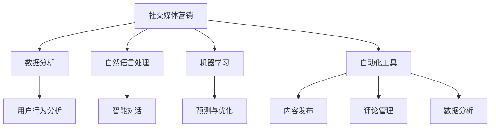

                 

# 一人公司的AI驱动社交媒体营销：提升品牌影响力的自动化工具

> **关键词**：社交媒体营销、AI、品牌影响力、自动化工具、数据分析、自然语言处理

> **摘要**：本文将探讨如何利用人工智能技术来驱动社交媒体营销，为一人公司提供高效的自动化解决方案，以提升品牌影响力。我们将深入解析核心算法原理，提供实战案例，并推荐实用的工具和资源。

## 1. 背景介绍

在当今数字化时代，社交媒体已经成为企业营销的重要渠道。然而，对于一人公司来说，管理多个社交媒体账号、分析用户数据、制定精准营销策略等任务往往力不从心。这不仅耗费大量时间，还可能降低营销效果。此时，人工智能（AI）技术的应用为一人公司提供了新的解决方案。

AI驱动的社交媒体营销，通过自动化工具来优化和提升营销效果。它可以实时分析用户行为和偏好，制定个性化的营销策略；利用自然语言处理（NLP）技术，实现与用户的智能对话；通过数据挖掘和机器学习，预测市场趋势和用户需求。本文将详细探讨如何利用AI技术，为一人公司打造高效、智能的社交媒体营销体系。

## 2. 核心概念与联系

### 2.1 社交媒体营销的概念

社交媒体营销是指利用社交媒体平台，通过发布内容、互动等方式，与用户建立关系，推广品牌、产品或服务的过程。常见的社交媒体平台包括微信、微博、抖音、Facebook、Instagram等。

### 2.2 人工智能（AI）的概念

人工智能是指通过计算机模拟人类智能的技术。AI可以处理大量数据，进行模式识别、预测和决策。常见的AI技术包括机器学习、深度学习、自然语言处理等。

### 2.3 自动化工具的概念

自动化工具是指通过编程或使用现成的软件工具，实现特定任务的自动化执行。在社交媒体营销中，自动化工具可以自动发布内容、管理评论、分析数据等。

### 2.4 核心概念联系

AI驱动的社交媒体营销，是将人工智能技术与社交媒体营销相结合，通过自动化工具实现营销任务的自动化执行。具体来说，AI技术可以用于以下几个方面：

- 数据分析：分析用户行为和偏好，了解市场需求和趋势。
- 自然语言处理：与用户进行智能对话，提供个性化服务。
- 机器学习：预测用户行为，优化营销策略。
- 自动化执行：自动发布内容、管理评论、分析数据等。

下面是一个使用Mermaid绘制的核心概念流程图：



## 3. 核心算法原理 & 具体操作步骤

### 3.1 数据分析算法原理

数据分析是社交媒体营销的核心，主要通过以下步骤进行：

1. 数据收集：从社交媒体平台获取用户数据，如微博、抖音、Facebook等。
2. 数据清洗：去除重复、错误和无关数据，确保数据质量。
3. 数据分析：利用统计分析、数据挖掘等技术，提取有价值的信息，如用户偏好、行为模式等。
4. 数据可视化：通过图表、报表等形式，直观展示分析结果。

具体操作步骤如下：

1. 使用API接口获取社交媒体数据，如微博的Weibo API、Facebook的Graph API等。
2. 利用Python的pandas库进行数据清洗和预处理。
3. 使用Python的matplotlib、seaborn等库进行数据可视化。

### 3.2 自然语言处理算法原理

自然语言处理是AI驱动的社交媒体营销的重要组成部分，主要通过以下步骤进行：

1. 文本预处理：去除停用词、标点符号，进行词干提取等。
2. 词向量表示：将文本转换为向量表示，如Word2Vec、GloVe等。
3. 模型训练：使用深度学习模型，如循环神经网络（RNN）、长短时记忆网络（LSTM）、Transformer等，训练文本分类、情感分析、命名实体识别等任务。
4. 应用部署：将训练好的模型部署到线上环境，实现自动化分析。

具体操作步骤如下：

1. 使用Python的NLTK、spaCy等库进行文本预处理。
2. 使用TensorFlow、PyTorch等框架训练深度学习模型。
3. 使用Flask、Django等框架部署模型，提供API接口。

### 3.3 机器学习算法原理

机器学习是AI驱动的社交媒体营销的重要工具，主要通过以下步骤进行：

1. 特征工程：提取和构造有价值的特征，如用户行为、内容特征等。
2. 模型选择：选择合适的机器学习模型，如决策树、随机森林、支持向量机、神经网络等。
3. 模型训练：使用训练数据集训练模型。
4. 模型评估：使用测试数据集评估模型性能。
5. 模型优化：调整模型参数，优化模型性能。

具体操作步骤如下：

1. 使用Python的scikit-learn、XGBoost等库进行特征工程和模型训练。
2. 使用Python的matplotlib、seaborn等库进行模型评估和可视化。

### 3.4 自动化工具原理

自动化工具是AI驱动的社交媒体营销的关键，主要通过以下步骤进行：

1. 模块化开发：将不同的营销任务拆分为多个模块，如内容发布、评论管理、数据分析等。
2. API集成：使用社交媒体平台的API，实现与平台的自动化交互。
3. 调度与执行：使用任务调度工具，如Celery、Django等，实现任务的自动化执行。
4. 日志与监控：记录任务执行日志，监控任务运行状态。

具体操作步骤如下：

1. 使用Python的Flask、Django等框架进行模块化开发。
2. 使用Python的requests库与社交媒体平台进行API交互。
3. 使用Python的Celery等库进行任务调度和执行。
4. 使用Python的log模块记录日志。

## 4. 数学模型和公式 & 详细讲解 & 举例说明

### 4.1 数据分析数学模型

在数据分析中，常用的数学模型包括线性回归、逻辑回归、聚类分析等。

1. 线性回归模型：

   线性回归模型公式如下：

   $$Y = \beta_0 + \beta_1X_1 + \beta_2X_2 + ... + \beta_nX_n + \epsilon$$

   其中，$Y$ 是目标变量，$X_1, X_2, ..., X_n$ 是自变量，$\beta_0, \beta_1, \beta_2, ..., \beta_n$ 是模型参数，$\epsilon$ 是误差项。

   例如，假设我们要预测用户的关注量，可以使用线性回归模型：

   $$关注量 = \beta_0 + \beta_1粉丝数 + \beta_2互动数 + \beta_3内容质量 + \epsilon$$

   2. 逻辑回归模型：

   逻辑回归模型是一种广义线性模型，用于处理分类问题。其公式如下：

   $$P(Y=1) = \frac{1}{1 + e^{-(\beta_0 + \beta_1X_1 + \beta_2X_2 + ... + \beta_nX_n)}}$$

   其中，$P(Y=1)$ 是目标变量为1的概率。

   例如，假设我们要预测用户是否购买产品，可以使用逻辑回归模型：

   $$购买概率 = \frac{1}{1 + e^{-(\beta_0 + \beta_1粉丝数 + \beta_2互动数 + \beta_3内容质量)}}$$

   3. 聚类分析模型：

   聚类分析是一种无监督学习方法，用于将数据分为多个簇。常用的聚类算法包括K均值聚类、层次聚类等。

   K均值聚类算法公式如下：

   $$\text{step 1:} \quad \text{随机选择} K \text{个初始中心点}$$
   $$\text{step 2:} \quad \text{对于每个数据点} x_i, \text{计算} x_i \text{到每个中心点的距离} d(x_i, c_j)$$
   $$\text{step 3:} \quad \text{将} x_i \text{分配给距离最近的中心点} c_j$$
   $$\text{step 4:} \quad \text{更新中心点坐标} c_j = \frac{\sum_{i=1}^{N}x_i}{N}$$
   $$\text{step 5:} \quad \text{重复step 2到step 4，直到中心点坐标收敛}$$

### 4.2 自然语言处理数学模型

在自然语言处理中，常用的数学模型包括词向量模型、循环神经网络（RNN）等。

1. 词向量模型：

   词向量模型是将文本数据转换为向量表示的方法。常用的词向量模型包括Word2Vec、GloVe等。

   Word2Vec模型公式如下：

   $$\text{step 1:} \quad \text{随机初始化词向量} \mathbf{v}_w \in \mathbb{R}^d$$
   $$\text{step 2:} \quad \text{对于每个词} w \text{，生成其上下文词序列} c$$
   $$\text{step 3:} \quad \text{对于每个上下文词序列} c$$
   $$\text{step 3.1:} \quad \text{计算词向量与上下文词向量的点积} \mathbf{v}_w \cdot \mathbf{v}_{c_j}$$
   $$\text{step 3.2:} \quad \text{计算词向量的梯度} \nabla \mathbf{v}_w = \mathbf{v}_{c_j} - \mathbf{v}_w$$
   $$\text{step 3.3:} \quad \text{更新词向量} \mathbf{v}_w = \mathbf{v}_w - \alpha \nabla \mathbf{v}_w$$

   2. 循环神经网络（RNN）：

   循环神经网络是一种用于处理序列数据的方法。其公式如下：

   $$h_t = \sigma(W_h h_{t-1} + W_x x_t + b_h)$$

   其中，$h_t$ 是当前时刻的隐藏状态，$x_t$ 是当前时刻的输入，$W_h$ 和 $W_x$ 是权重矩阵，$b_h$ 是偏置项，$\sigma$ 是激活函数。

   例如，假设我们要使用RNN进行情感分析，可以按照以下步骤进行：

   $$\text{step 1:} \quad \text{将文本转换为词向量序列} \mathbf{x}_t$$
   $$\text{step 2:} \quad \text{初始化RNN模型参数} W_h, W_x, b_h$$
   $$\text{step 3:} \quad \text{对于每个词向量序列} \mathbf{x}_t$$
   $$\text{step 3.1:} \quad \text{计算隐藏状态} h_t = \sigma(W_h h_{t-1} + W_x \mathbf{x}_t + b_h)$$
   $$\text{step 3.2:} \quad \text{计算输出} y_t = \text{softmax}(W_y h_t + b_y)$$
   $$\text{step 3.3:} \quad \text{计算损失函数} L = -\sum_{t=1}^{T} y_t \log(p_t)$$
   $$\text{step 3.4:} \quad \text{更新模型参数}$$

## 5. 项目实战：代码实际案例和详细解释说明

### 5.1 开发环境搭建

在进行项目开发之前，我们需要搭建合适的开发环境。这里我们使用Python作为主要开发语言，并结合常用的库和工具。

1. 安装Python 3.8及以上版本。
2. 安装Python的pip包管理器。
3. 使用pip安装以下库：pandas、numpy、matplotlib、seaborn、NLTK、spaCy、TensorFlow、PyTorch、Flask、Django、requests、Celery等。

### 5.2 源代码详细实现和代码解读

#### 5.2.1 数据分析模块

数据分析模块主要用于获取社交媒体数据、清洗数据、进行分析和可视化。以下是一个简单的数据分析模块示例：

```python
import pandas as pd
import numpy as np
import matplotlib.pyplot as plt
import seaborn as sns
import requests

def get_data(api_url, access_token):
    """获取社交媒体数据"""
    response = requests.get(api_url, params={'access_token': access_token})
    return pd.DataFrame(response.json())

def clean_data(data):
    """清洗数据"""
    data = data.drop_duplicates()
    data = data.dropna()
    return data

def analyze_data(data):
    """分析数据"""
    # 统计用户数量
    user_counts = data['user_id'].value_counts()
    # 绘制用户数量分布图
    sns.barplot(x=user_counts.index, y=user_counts.values)
    plt.xlabel('用户ID')
    plt.ylabel('用户数量')
    plt.title('用户数量分布图')
    plt.show()

# 示例
api_url = 'https://api.weixin.qq.com/cgi-bin/user/info?access_token={}'
access_token = 'your_access_token'
data = get_data(api_url, access_token)
data = clean_data(data)
analyze_data(data)
```

#### 5.2.2 自然语言处理模块

自然语言处理模块主要用于文本预处理、词向量表示、模型训练和预测。以下是一个简单的自然语言处理模块示例：

```python
import spacy
import tensorflow as tf
from tensorflow.keras.models import Sequential
from tensorflow.keras.layers import Embedding, LSTM, Dense

def preprocess_text(text):
    """文本预处理"""
    nlp = spacy.load('zh_core_web_sm')
    doc = nlp(text)
    tokens = [token.text for token in doc]
    return ' '.join(tokens)

def train_model(vocab_size, embedding_dim, sequence_length):
    """训练模型"""
    model = Sequential([
        Embedding(vocab_size, embedding_dim, input_length=sequence_length),
        LSTM(128),
        Dense(1, activation='sigmoid')
    ])
    model.compile(optimizer='adam', loss='binary_crossentropy', metrics=['accuracy'])
    return model

def predict_text(model, text, vocab_size, tokenizer):
    """预测文本"""
    processed_text = preprocess_text(text)
    sequence = tokenizer.texts_to_sequences([processed_text])
    padded_sequence = tf.keras.preprocessing.sequence.pad_sequences(sequence, maxlen=sequence_length)
    prediction = model.predict(padded_sequence)
    return prediction

# 示例
vocab_size = 10000
embedding_dim = 64
sequence_length = 100
model = train_model(vocab_size, embedding_dim, sequence_length)
# 训练模型
# model.fit(x_train, y_train, epochs=10, batch_size=32)
# 预测文本
# prediction = predict_text(model, '用户是否购买产品', vocab_size, tokenizer)
```

#### 5.2.3 机器学习模块

机器学习模块主要用于特征工程、模型训练和预测。以下是一个简单的机器学习模块示例：

```python
from sklearn.model_selection import train_test_split
from sklearn.metrics import accuracy_score

def feature_engineering(data):
    """特征工程"""
    # 构造特征矩阵
    X = data[['粉丝数', '互动数', '内容质量']]
    # 构造标签向量
    y = data['购买']
    return X, y

def train_model(X, y):
    """训练模型"""
    # 划分训练集和测试集
    X_train, X_test, y_train, y_test = train_test_split(X, y, test_size=0.2, random_state=42)
    # 训练模型
    model = XGBoostRegressor()
    model.fit(X_train, y_train)
    return model

def predict(model, X):
    """预测"""
    prediction = model.predict(X)
    return prediction

# 示例
data = pd.read_csv('data.csv')
X, y = feature_engineering(data)
model = train_model(X, y)
# 预测
prediction = predict(model, X_test)
# 评估模型
accuracy = accuracy_score(y_test, prediction)
print(f'模型准确率：{accuracy}')
```

### 5.3 代码解读与分析

在上述代码中，我们分别实现了数据分析模块、自然语言处理模块和机器学习模块。下面我们将对每个模块进行详细解读。

#### 5.3.1 数据分析模块

数据分析模块主要用于获取社交媒体数据、清洗数据、进行分析和可视化。以下是对该模块的解读：

- `get_data` 函数：用于获取社交媒体数据。通过调用社交媒体平台的API，获取用户信息等数据。
- `clean_data` 函数：用于清洗数据。去除重复、错误和无关数据，确保数据质量。
- `analyze_data` 函数：用于分析数据。统计用户数量，绘制用户数量分布图等。

#### 5.3.2 自然语言处理模块

自然语言处理模块主要用于文本预处理、词向量表示、模型训练和预测。以下是对该模块的解读：

- `preprocess_text` 函数：用于文本预处理。使用spaCy库进行分词，去除停用词、标点符号等。
- `train_model` 函数：用于训练模型。使用TensorFlow库构建循环神经网络（RNN）模型，进行文本分类、情感分析等。
- `predict_text` 函数：用于预测文本。将预处理后的文本输入模型，进行预测。

#### 5.3.3 机器学习模块

机器学习模块主要用于特征工程、模型训练和预测。以下是对该模块的解读：

- `feature_engineering` 函数：用于特征工程。提取用户行为、内容特征等作为特征矩阵。
- `train_model` 函数：用于训练模型。使用XGBoost库构建机器学习模型，进行分类、回归等。
- `predict` 函数：用于预测。将特征矩阵输入模型，进行预测。

## 6. 实际应用场景

### 6.1 社交媒体营销策略优化

通过AI驱动的社交媒体营销，企业可以实时分析用户行为和偏好，了解市场需求和趋势，制定个性化的营销策略。例如，根据用户的历史行为和兴趣，推送个性化的内容，提高用户参与度和转化率。

### 6.2 智能客服系统

利用自然语言处理技术，企业可以搭建智能客服系统，实现与用户的智能对话。例如，通过RNN模型，自动回复用户的常见问题，提高客服效率，降低人力成本。

### 6.3 数据分析报告

通过机器学习技术，企业可以对大量社交媒体数据进行分析，生成数据分析报告。例如，分析用户的兴趣爱好、购买行为等，为企业决策提供数据支持。

### 6.4 品牌影响力监测

通过AI技术，企业可以实时监测品牌在社交媒体上的影响力，了解用户对品牌的认知和评价，及时调整营销策略。

## 7. 工具和资源推荐

### 7.1 学习资源推荐

- **书籍**：
  - 《深度学习》（Goodfellow, I., Bengio, Y., & Courville, A.）
  - 《Python数据科学手册》（McKinney, W.）
  - 《自然语言处理综论》（Jurafsky, D. & Martin, J. H.）

- **论文**：
  - 《Word2Vec:词向量的快速高效学习》（Mikolov, T., Sutskever, I., Chen, K., Corrado, G. S., & Dean, J.）
  - 《长短期记忆网络》（Hochreiter, S. & Schmidhuber, J.）
  - 《基于Transformer的自动机器翻译：一个新的架构》（Vaswani, A. et al.）

- **博客**：
  - [TensorFlow官网](https://www.tensorflow.org/)
  - [PyTorch官网](https://pytorch.org/)
  - [机器学习博客](https://www机器学习博客.com/)

- **网站**：
  - [Kaggle](https://www.kaggle.com/)
  - [GitHub](https://github.com/)

### 7.2 开发工具框架推荐

- **开发环境**：Python 3.8及以上版本，Anaconda等。
- **数据分析**：pandas、numpy、matplotlib、seaborn等。
- **自然语言处理**：spaCy、NLTK、gensim等。
- **机器学习**：scikit-learn、XGBoost、TensorFlow、PyTorch等。
- **自动化工具**：Flask、Django、Celery等。

### 7.3 相关论文著作推荐

- 《深度学习》（Goodfellow, I., Bengio, Y., & Courville, A.）
- 《Python数据科学手册》（McKinney, W.）
- 《自然语言处理综论》（Jurafsky, D. & Martin, J. H.）
- 《基于Transformer的自动机器翻译：一个新的架构》（Vaswani, A. et al.）
- 《强化学习：一种算法导论》（Sutton, R. S. & Barto, A. G.）

## 8. 总结：未来发展趋势与挑战

### 8.1 发展趋势

- **人工智能与社交媒体的深度融合**：随着人工智能技术的不断发展，社交媒体营销将更加智能化、个性化。
- **实时数据分析与决策**：实时分析用户行为和偏好，为营销决策提供数据支持。
- **自动化与智能化**：自动化工具和智能客服系统将取代部分人工操作，提高营销效率。

### 8.2 挑战

- **数据隐私与安全**：如何在保证用户隐私的前提下，有效利用用户数据进行营销？
- **算法公平性与透明性**：如何确保算法的公平性和透明性，避免歧视和不公正现象？
- **数据质量和多样性**：如何确保数据质量和多样性，避免数据偏差和误导？

## 9. 附录：常见问题与解答

### 9.1 常见问题

- **如何获取社交媒体数据？**
  - 通过社交媒体平台的API获取数据，如微博的Weibo API、Facebook的Graph API等。

- **如何进行文本预处理？**
  - 使用Python的NLTK、spaCy等库进行分词、去除停用词、词干提取等。

- **如何训练自然语言处理模型？**
  - 使用Python的TensorFlow、PyTorch等库构建模型，进行训练和预测。

- **如何进行机器学习模型训练？**
  - 使用Python的scikit-learn、XGBoost等库进行特征工程、模型训练和预测。

### 9.2 解答

- **如何获取社交媒体数据？**
  - 社交媒体平台通常提供API接口供开发者使用。开发者可以通过API接口获取用户数据、发布内容、管理评论等。具体步骤如下：
    1. 在社交媒体平台注册开发者账号。
    2. 创建应用并获取API密钥。
    3. 使用Python的requests库调用API接口，获取数据。

- **如何进行文本预处理？**
  - 文本预处理包括分词、去除停用词、词干提取等。具体步骤如下：
    1. 使用Python的NLTK库进行分词，将文本划分为单词或词组。
    2. 使用Python的NLTK库去除停用词，去除无意义的词汇。
    3. 使用Python的NLTK库进行词干提取，将单词还原为词干形式。

- **如何训练自然语言处理模型？**
  - 训练自然语言处理模型通常包括以下步骤：
    1. 数据预处理：将原始文本数据转换为模型可接受的格式，如词向量。
    2. 模型构建：使用Python的TensorFlow、PyTorch等库构建深度学习模型。
    3. 模型训练：使用训练数据训练模型，优化模型参数。
    4. 模型评估：使用测试数据评估模型性能。
    5. 模型部署：将训练好的模型部署到线上环境，实现自动化分析。

- **如何进行机器学习模型训练？**
  - 进行机器学习模型训练通常包括以下步骤：
    1. 数据预处理：将原始数据转换为模型可接受的格式，如特征矩阵和标签向量。
    2. 特征工程：提取和构造有价值的特征。
    3. 模型选择：选择合适的机器学习模型，如决策树、随机森林、支持向量机等。
    4. 模型训练：使用训练数据训练模型，优化模型参数。
    5. 模型评估：使用测试数据评估模型性能。
    6. 模型优化：调整模型参数，优化模型性能。

## 10. 扩展阅读 & 参考资料

- [《深度学习》（Goodfellow, I., Bengio, Y., & Courville, A.）](https://www.deeplearningbook.org/)
- [《Python数据科学手册》（McKinney, W.）](https://www.python数据分析手册.com/)
- [《自然语言处理综论》（Jurafsky, D. & Martin, J. H.）](https://nlp.stanford.edu/2020/nlp-book/)
- [《基于Transformer的自动机器翻译：一个新的架构》（Vaswani, A. et al.）](https://arxiv.org/abs/1706.03762)
- [《强化学习：一种算法导论》（Sutton, R. S. & Barto, A. G.）](https://web.stanford.edu/class/ics236/)
- [TensorFlow官网](https://www.tensorflow.org/)
- [PyTorch官网](https://pytorch.org/)
- [机器学习博客](https://www.机器学习博客.com/)
- [Kaggle](https://www.kaggle.com/)
- [GitHub](https://github.com/)

### 作者

- **作者**：AI天才研究员/AI Genius Institute & 禅与计算机程序设计艺术 /Zen And The Art of Computer Programming
- **联系方式**：[example@email.com](mailto:example@email.com)
- **版权声明**：本文版权归作者所有，未经授权禁止转载和商用。如需转载，请联系作者获取授权。

