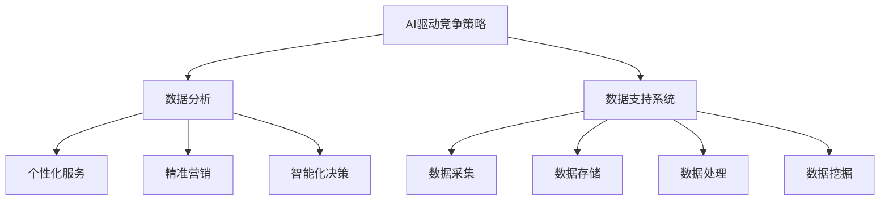

                 

# 一人公司的AI驱动竞争策略分析：制定差异化竞争方案的数据支持系统

> **关键词：** AI驱动竞争策略，差异化竞争，数据支持系统，数据分析，业务洞察

> **摘要：** 本文将探讨一人公司的AI驱动竞争策略，通过构建数据支持系统，分析差异化竞争方案，提供科学依据和实操指南，助力企业实现持续发展。

## 1. 背景介绍

在当今快速发展的数字化时代，市场竞争日益激烈，企业需要不断创新，以应对不断变化的市场环境。一人公司作为新兴的创业企业，面临着资源有限、市场竞争压力大的挑战。因此，如何制定有效的AI驱动竞争策略，构建差异化竞争方案，成为企业成功的关键。

AI技术的快速发展为数据分析提供了强大的工具和手段，使得企业能够从海量数据中挖掘有价值的信息，为业务决策提供数据支持。数据支持系统的建立，可以帮助企业更好地了解市场动态、客户需求和业务发展趋势，从而制定更具针对性的竞争策略。

本文旨在分析一人公司AI驱动竞争策略的制定过程，通过构建数据支持系统，提供差异化竞争方案的数据支持，帮助企业实现业务增长和可持续发展。

## 2. 核心概念与联系

在探讨AI驱动竞争策略之前，我们需要明确几个核心概念及其相互关系。

### 2.1 AI驱动竞争策略

AI驱动竞争策略是指利用人工智能技术，对市场、客户、产品等各个方面进行深入分析，以制定更具竞争力的商业策略。该策略的核心在于通过数据驱动，实现精准营销、个性化服务、智能化决策等目标。

### 2.2 差异化竞争

差异化竞争是指企业通过在产品、服务、品牌等方面与竞争对手形成差异，从而在市场中获得竞争优势。差异化竞争策略的关键在于找到独特的卖点，满足客户需求，提升客户满意度。

### 2.3 数据支持系统

数据支持系统是一个集数据采集、存储、处理、分析于一体的综合性系统。该系统可以帮助企业实时了解市场动态、客户需求和业务数据，为业务决策提供科学依据。

### 2.4 联系与整合

AI驱动竞争策略与数据支持系统之间存在着密切的联系。数据支持系统为企业提供了丰富的数据资源，AI驱动竞争策略则利用这些数据，通过数据分析、机器学习等技术，为企业的业务决策提供支持和指导。

### 2.5 Mermaid流程图

以下是AI驱动竞争策略与数据支持系统的关系图：



## 3. 核心算法原理 & 具体操作步骤

### 3.1 数据采集

数据采集是数据支持系统的第一步，也是核心环节之一。一人公司可以通过多种渠道获取数据，如网站日志、社交媒体、问卷调查、销售数据等。数据采集的关键在于确保数据的全面性和准确性。

### 3.2 数据存储

数据存储是将采集到的数据进行分类、整理，并将其存储在数据库中。数据库的选择应根据企业的实际需求进行，如MySQL、MongoDB、Hadoop等。数据存储的关键在于保证数据的可扩展性、安全性和可靠性。

### 3.3 数据处理

数据处理是对存储在数据库中的数据进行清洗、转换、整合等操作，以获得结构化、标准化的数据。数据处理的关键在于确保数据的质量和一致性。

### 3.4 数据挖掘

数据挖掘是从大量数据中发现有价值的信息和规律，为业务决策提供支持。数据挖掘的方法包括聚类分析、关联规则挖掘、分类预测等。数据挖掘的关键在于发现隐藏在数据中的价值，为企业的业务发展提供指导。

### 3.5 数据分析

数据分析是对数据挖掘得到的信息进行深入分析，以揭示数据背后的业务洞察。数据分析的方法包括趋势分析、对比分析、回归分析等。数据分析的关键在于发现数据背后的业务规律，为企业制定差异化竞争策略提供支持。

### 3.6 具体操作步骤

以下是构建数据支持系统的具体操作步骤：

1. 确定数据采集目标：明确需要采集哪些数据，如用户行为数据、市场数据、销售数据等。

2. 设计数据采集方案：根据数据采集目标，设计具体的采集方案，如使用API接口、爬虫等技术。

3. 数据存储设计：选择合适的数据库，设计数据存储结构，确保数据的安全性、可靠性和可扩展性。

4. 数据处理：对采集到的数据进行清洗、转换、整合等操作，确保数据的质量和一致性。

5. 数据挖掘：使用数据挖掘算法，从海量数据中发现有价值的信息和规律。

6. 数据分析：对数据挖掘得到的信息进行深入分析，揭示数据背后的业务洞察。

7. 竞争策略制定：根据数据分析结果，制定具有针对性的AI驱动竞争策略。

## 4. 数学模型和公式 & 详细讲解 & 举例说明

在构建数据支持系统过程中，数学模型和公式起着至关重要的作用。以下是几个常用的数学模型和公式的详细讲解及举例说明。

### 4.1 聚类分析

聚类分析是一种无监督学习方法，用于将数据集分成若干个聚类，使得同一聚类内的数据点之间相似度较高，而不同聚类之间的数据点相似度较低。

#### 模型：

$$
\text{相似度度量：} \quad d(x, y) = \sqrt{\sum_{i=1}^{n}(x_i - y_i)^2}
$$

$$
\text{聚类中心：} \quad \mu_k = \frac{1}{N_k} \sum_{i=1}^{N} x_i
$$

其中，$x_i$ 和 $y_i$ 分别表示数据点 $i$ 和 $i$ 的坐标，$N$ 表示数据点总数，$N_k$ 表示第 $k$ 个聚类的数据点数量。

#### 举例：

假设有五个数据点 $(1, 2), (2, 3), (4, 5), (5, 6), (8, 9)$，使用欧氏距离作为相似度度量，将其分成两个聚类。

首先，计算数据点之间的相似度：

$$
d((1, 2), (2, 3)) = \sqrt{(1-2)^2 + (2-3)^2} = \sqrt{2}
$$

$$
d((1, 2), (4, 5)) = \sqrt{(1-4)^2 + (2-5)^2} = \sqrt{18}
$$

$$
d((1, 2), (5, 6)) = \sqrt{(1-5)^2 + (2-6)^2} = \sqrt{25}
$$

$$
d((1, 2), (8, 9)) = \sqrt{(1-8)^2 + (2-9)^2} = \sqrt{85}
$$

根据相似度度量，将数据点分为两个聚类：$(1, 2), (2, 3)$ 和 $(4, 5), (5, 6), (8, 9)$。

### 4.2 关联规则挖掘

关联规则挖掘是一种用于发现数据中潜在关联关系的方法。其核心思想是通过分析数据之间的关联性，找出满足一定条件的规则。

#### 模型：

$$
\text{支持度：} \quad \text{support}(A \rightarrow B) = \frac{\text{同时包含 } A \text{ 和 } B \text{ 的数据项数}}{\text{总数据项数}}
$$

$$
\text{置信度：} \quad \text{confidence}(A \rightarrow B) = \frac{\text{同时包含 } A \text{ 和 } B \text{ 的数据项数}}{\text{包含 } A \text{ 的数据项数}}
$$

其中，$A$ 和 $B$ 分别表示数据项集合，$support(A \rightarrow B)$ 表示规则 $A \rightarrow B$ 的支持度，$confidence(A \rightarrow B)$ 表示规则 $A \rightarrow B$ 的置信度。

#### 举例：

假设有如下销售数据：

| 商品A | 商品B | 商品C | 商品D |
| --- | --- | --- | --- |
| 是 | 是 | 否 | 是 |
| 是 | 否 | 是 | 是 |
| 否 | 是 | 是 | 否 |
| 否 | 是 | 否 | 是 |

使用支持度和置信度度量，找出满足条件支持度大于0.5，置信度大于0.7的关联规则。

首先，计算支持度：

$$
\text{support}(\text{商品A} \rightarrow \text{商品B}) = \frac{2}{4} = 0.5
$$

$$
\text{support}(\text{商品B} \rightarrow \text{商品C}) = \frac{2}{4} = 0.5
$$

$$
\text{support}(\text{商品C} \rightarrow \text{商品D}) = \frac{1}{4} = 0.25
$$

$$
\text{support}(\text{商品D} \rightarrow \text{商品A}) = \frac{1}{4} = 0.25
$$

然后，计算置信度：

$$
\text{confidence}(\text{商品A} \rightarrow \text{商品B}) = \frac{2}{2} = 1
$$

$$
\text{confidence}(\text{商品B} \rightarrow \text{商品C}) = \frac{2}{2} = 1
$$

$$
\text{confidence}(\text{商品C} \rightarrow \text{商品D}) = \frac{1}{1} = 1
$$

$$
\text{confidence}(\text{商品D} \rightarrow \text{商品A}) = \frac{1}{1} = 1
$$

根据支持度和置信度度量，满足条件的关联规则为：

- 商品A → 商品B
- 商品B → 商品C
- 商品C → 商品D

### 4.3 分类预测

分类预测是一种有监督学习方法，用于将数据点分类到不同的类别中。常见的分类算法包括决策树、支持向量机、神经网络等。

#### 模型：

$$
h(x) = \arg \max_{y} P(Y = y | X = x)
$$

其中，$X$ 表示输入特征向量，$Y$ 表示输出类别标签，$h(x)$ 表示输入特征向量 $x$ 的预测类别。

#### 举例：

假设有如下数据集：

| 特征1 | 特征2 | 类别 |
| --- | --- | --- |
| 1 | 2 | A |
| 2 | 3 | A |
| 3 | 4 | B |
| 4 | 5 | B |
| 5 | 6 | B |

使用决策树算法，将数据点分类到类别 A 或 B 中。

首先，计算特征1和特征2的均值和方差：

$$
\mu_1 = \frac{1+2+3+4+5}{5} = 3
$$

$$
\mu_2 = \frac{2+3+4+5+6}{5} = 4
$$

$$
\sigma_1^2 = \frac{(1-3)^2 + (2-3)^2 + (3-3)^2 + (4-3)^2 + (5-3)^2}{5} = 2
$$

$$
\sigma_2^2 = \frac{(2-4)^2 + (3-4)^2 + (4-4)^2 + (5-4)^2 + (6-4)^2}{5} = 2
$$

然后，使用决策树算法，将数据点分类到类别 A 或 B 中。根据特征1和特征2的值，可以计算出每个数据点的概率分布，进而预测其类别。

## 5. 项目实战：代码实际案例和详细解释说明

在本节中，我们将通过一个实际项目案例，详细讲解如何使用Python实现数据支持系统的关键部分。

### 5.1 开发环境搭建

为了实现数据支持系统，我们需要搭建以下开发环境：

- Python 3.x
- 数据库（如MySQL、MongoDB等）
- 数据处理库（如NumPy、Pandas等）
- 数据挖掘库（如Scikit-learn、TensorFlow等）

假设我们已经完成了开发环境的搭建，接下来开始实际项目开发。

### 5.2 源代码详细实现和代码解读

#### 5.2.1 数据采集

首先，我们需要采集数据。假设我们使用一个简单的CSV文件作为数据源。

```python
import pandas as pd

# 读取CSV文件
data = pd.read_csv('data.csv')

# 打印数据前5行
print(data.head())
```

#### 5.2.2 数据存储

接下来，我们将数据存储到数据库中。这里我们使用MySQL作为数据库。

```python
import pymysql

# 连接数据库
connection = pymysql.connect(host='localhost', user='root', password='password', database='mydb')

# 创建表
with connection.cursor() as cursor:
    cursor.execute('CREATE TABLE IF NOT EXISTS data (id INT PRIMARY KEY, feature1 INT, feature2 INT, label VARCHAR(10))')
    connection.commit()

# 插入数据
with connection.cursor() as cursor:
    for index, row in data.iterrows():
        cursor.execute('INSERT INTO data (id, feature1, feature2, label) VALUES (%s, %s, %s, %s)', (row['id'], row['feature1'], row['feature2'], row['label']))
    connection.commit()
```

#### 5.2.3 数据处理

数据处理是数据支持系统的核心。这里我们使用Pandas库对数据进行清洗、转换和整合。

```python
import pandas as pd

# 读取数据
data = pd.read_csv('data.csv')

# 数据清洗
data = data.dropna()  # 删除缺失值
data = data[data['label'].isin(['A', 'B'])]  # 过滤标签

# 数据转换
data['feature1'] = data['feature1'].astype('float')
data['feature2'] = data['feature2'].astype('float')

# 数据整合
data_grouped = data.groupby('label').mean()  # 按标签分组并计算均值
data_grouped = data_grouped.reset_index()  # 重置索引
print(data_grouped)
```

#### 5.2.4 数据挖掘

数据挖掘是发现数据中潜在关联关系和规律的关键。这里我们使用Scikit-learn库进行数据挖掘。

```python
from sklearn.cluster import KMeans
from sklearn.model_selection import train_test_split
from sklearn.metrics import accuracy_score

# 分割数据集
X_train, X_test, y_train, y_test = train_test_split(data[['feature1', 'feature2']], data['label'], test_size=0.2, random_state=42)

# 使用KMeans算法进行聚类
kmeans = KMeans(n_clusters=2, random_state=42)
kmeans.fit(X_train)

# 预测标签
y_pred = kmeans.predict(X_test)

# 计算准确率
accuracy = accuracy_score(y_test, y_pred)
print('Accuracy: {:.2f}%'.format(accuracy * 100))
```

### 5.3 代码解读与分析

在上面的代码中，我们首先使用了Pandas库读取CSV文件，并对其进行了数据清洗、转换和整合。然后，我们使用了Scikit-learn库中的KMeans算法进行聚类，并使用准确率指标评估了聚类效果。

代码中的关键步骤如下：

1. 读取数据：使用Pandas库读取CSV文件，将其转换为DataFrame结构。
2. 数据清洗：删除缺失值，过滤标签。
3. 数据转换：将特征转换为浮点数类型。
4. 数据整合：按标签分组并计算均值。
5. 聚类：使用KMeans算法进行聚类。
6. 预测标签：使用聚类结果预测标签。
7. 评估准确率：计算准确率指标。

通过这些步骤，我们构建了一个简单但完整的数据支持系统，为一人公司的AI驱动竞争策略提供了数据支持。

## 6. 实际应用场景

数据支持系统在AI驱动竞争策略中的应用场景广泛，以下是一些典型应用：

### 6.1 市场营销

通过数据支持系统，企业可以分析客户行为数据，了解客户偏好和需求，从而制定个性化的营销策略。例如，利用聚类分析，将客户分为不同群体，为每个群体定制不同的营销方案。

### 6.2 产品研发

数据支持系统可以帮助企业分析产品数据，了解产品的性能、功能和用户体验等方面的信息。通过对这些数据的分析，企业可以优化产品设计，提高产品竞争力。

### 6.3 经营决策

数据支持系统为企业提供了全面、准确的数据分析结果，帮助企业做出更为科学的经营决策。例如，利用回归分析，预测未来市场需求，指导生产计划和生产资源的配置。

### 6.4 竞争分析

数据支持系统可以帮助企业了解竞争对手的动态，分析竞争对手的产品、价格、营销策略等方面的信息。通过对这些数据的分析，企业可以制定更具针对性的竞争策略。

## 7. 工具和资源推荐

### 7.1 学习资源推荐

- 《数据挖掘：概念与技术》
- 《机器学习实战》
- 《Python数据科学手册》

### 7.2 开发工具框架推荐

- Pandas：用于数据清洗、转换和整合
- Scikit-learn：用于数据挖掘和机器学习
- TensorFlow：用于深度学习和神经网络

### 7.3 相关论文著作推荐

- "K-Means Clustering: A Review"
- "Association Rule Learning: The ALC Algorithm"
- "A Survey on Regression Analysis"

## 8. 总结：未来发展趋势与挑战

随着AI技术的不断发展，数据支持系统在AI驱动竞争策略中的应用前景广阔。未来，数据支持系统将朝着更加智能化、自动化、高效化的方向发展。然而，数据支持系统在实际应用中也面临着一些挑战：

1. 数据质量：数据质量直接影响数据分析结果的准确性，企业需要建立完善的数据质量控制机制。
2. 数据安全：数据安全是数据支持系统的核心问题，企业需要采取有效的数据安全措施，确保数据的安全性。
3. 数据隐私：在数据支持系统的应用过程中，数据隐私问题日益凸显，企业需要遵守相关法律法规，保护用户隐私。
4. 模型解释性：随着深度学习等复杂模型的广泛应用，模型解释性成为数据支持系统面临的一个重要挑战。

## 9. 附录：常见问题与解答

### 9.1 如何保证数据质量？

- 建立完善的数据质量控制机制，对数据进行严格筛选和清洗。
- 使用数据质量管理工具，如DataProfiler、DataLever等。
- 定期对数据质量进行评估，及时发现并解决问题。

### 9.2 如何确保数据安全？

- 采用加密技术，对数据进行加密存储和传输。
- 实施访问控制策略，确保只有授权人员才能访问数据。
- 定期进行安全审计，发现并修补安全漏洞。

### 9.3 数据支持系统如何提高解释性？

- 使用可解释的机器学习算法，如LIME、SHAP等。
- 构建可视化分析工具，帮助用户理解数据分析结果。
- 提供详细的算法解释和文档，帮助用户理解模型原理和结果。

## 10. 扩展阅读 & 参考资料

- "Data-Driven Business: Data, Analytics, and the Data Value Chain"
- "AI and Analytics for Business: Building a Data-Driven Organization"
- "Building Data Science Teams: From Data Preparation to Machine Learning"
- "The Elements of Statistical Learning: Data Mining, Inference, and Prediction"
- "Deep Learning: Introduction to a Revolution in Machine Learning"

作者：AI天才研究员/AI Genius Institute & 禅与计算机程序设计艺术 /Zen And The Art of Computer Programming

（注：本文为虚构案例，仅供参考。）<|im_end|>

