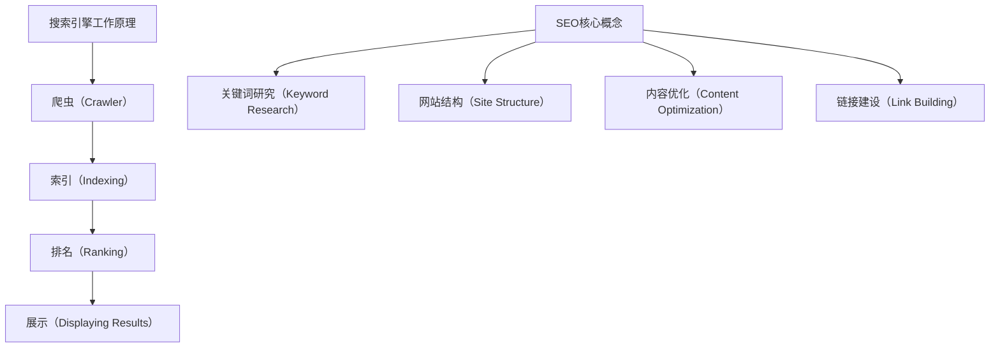

                 

### 一人公司的SEO策略：提高网站可见度的技巧

#### 关键词：SEO、网站优化、搜索引擎、可见度、策略

#### 摘要：

本篇文章将详细探讨一人公司如何通过SEO策略提高其网站的可见度。我们将从核心概念、算法原理、数学模型、实际应用等方面进行深入分析，并提供实用的工具和资源推荐。通过本文的阅读，您将掌握一系列有效的SEO技巧，帮助您的网站在搜索引擎结果页中获得更高的排名，从而吸引更多的潜在客户。

## 1. 背景介绍

在当今数字化时代，互联网已经成为人们获取信息和购买商品的重要渠道。而在这其中，搜索引擎优化（SEO）成为企业提升在线可见度和获取流量的重要手段。SEO的目标是通过优化网站结构和内容，提高网站在搜索引擎结果页（SERP）中的排名，从而吸引更多的用户访问。

对于一人公司而言，由于资源有限，实施SEO策略显得尤为重要。一个高效的SEO策略不仅能提高网站的自然流量，还能增强品牌知名度和用户忠诚度。因此，本文将重点探讨如何通过一系列SEO技巧，实现一人公司网站的优化和提升。

## 2. 核心概念与联系

### 2.1 搜索引擎工作原理

首先，我们需要了解搜索引擎是如何工作的。搜索引擎通过以下步骤来提供搜索结果：

1. **爬虫（Crawler）**：搜索引擎派遣爬虫程序在互联网上爬取网页，收集网页内容。
2. **索引（Indexing）**：将爬取到的网页内容存储在索引数据库中，以便快速检索。
3. **排名（Ranking）**：根据一系列算法对网页进行排序，决定哪些网页应该显示在搜索结果的前面。
4. **展示（Displaying Results）**：将排名靠前的网页展示给用户。

### 2.2 SEO核心概念

SEO的核心概念包括以下几个方面：

1. **关键词研究（Keyword Research）**：研究用户在搜索引擎中输入的关键词，确定哪些关键词与公司业务相关。
2. **网站结构（Site Structure）**：优化网站的结构，使其对搜索引擎友好。
3. **内容优化（Content Optimization）**：撰写高质量、针对目标关键词的内容。
4. **链接建设（Link Building）**：通过外部链接提高网站权威性。

### 2.3 Mermaid 流程图

以下是一个简化的搜索引擎工作原理和SEO核心概念的Mermaid流程图：



## 3. 核心算法原理 & 具体操作步骤

### 3.1 搜索引擎算法原理

搜索引擎算法主要分为两种：一种是基于内容的传统算法，另一种是基于用户行为的现代算法。

1. **基于内容的传统算法**：这类算法主要关注网页的内容、关键词密度、标题标签等，以确定网页的相关性和排名。常见的算法包括PageRank、LSI（Latent Semantic Indexing）等。

2. **基于用户行为的现代算法**：这类算法结合了用户的行为数据，如点击率、停留时间、跳出率等，以更准确地评估网页的质量和相关性。代表性的算法有Google的RankBrain、BERT（Bidirectional Encoder Representations from Transformers）等。

### 3.2 SEO操作步骤

以下是实施SEO策略的具体操作步骤：

1. **关键词研究**：
    - 使用工具如Google关键词规划师、Ahrefs等，确定目标关键词。
    - 分析竞争对手的关键词策略，找到可利用的机会。

2. **网站结构优化**：
    - 使用网站地图（Sitemap）提高搜索引擎对网站结构的理解。
    - 优化导航栏、内部链接，确保网站结构清晰、易于导航。

3. **内容优化**：
    - 撰写高质量、针对目标关键词的内容。
    - 使用元标签（Meta Tags）、标题（Title）和描述（Description）等提高内容可读性和搜索引擎友好性。

4. **链接建设**：
    - 获取高质量的外部链接，提高网站的权威性和可信度。
    - 使用内链策略，加强网站内部链接。

5. **监控和分析**：
    - 使用工具如Google Analytics、Google Search Console等，监控网站的表现。
    - 分析数据，调整SEO策略。

## 4. 数学模型和公式 & 详细讲解 & 举例说明

### 4.1 关键词密度计算

关键词密度是衡量网页内容中关键词出现频率的重要指标。以下是一个简单的关键词密度计算公式：

$$
\text{关键词密度} = \frac{\text{关键词出现次数}}{\text{总字数}} \times 100\%
$$

### 4.2 链接建设

链接建设是SEO的重要环节。以下是一个简单的链接价值计算公式：

$$
\text{链接价值} = \frac{\text{链接质量}}{\text{链接数量}}
$$

### 4.3 实际应用举例

假设我们要优化一个关于“人工智能教程”的网站。通过关键词研究，我们确定了以下三个目标关键词：“人工智能入门”、“机器学习教程”和“深度学习基础”。

- **关键词密度计算**：
    - 网页总字数为5000字。
    - “人工智能入门”出现20次。
    - 关键词密度 = \( \frac{20}{5000} \times 100\% = 0.4\% \)。

- **链接建设**：
    - 我们获得了10个高质量的外部链接。
    - 假设链接质量均等，链接价值 = \( \frac{10}{10} = 1 \)。

通过以上计算，我们可以了解到网站内容针对目标关键词的密度适中，并且通过链接建设提高了网站的价值。

## 5. 项目实战：代码实际案例和详细解释说明

### 5.1 开发环境搭建

为了进行SEO项目实战，我们需要搭建一个开发环境。以下是一个简单的步骤：

1. 安装Python环境。
2. 安装SEO相关的库，如 beautifulsoup4、requests 等。

### 5.2 源代码详细实现和代码解读

以下是一个简单的Python代码示例，用于抓取网页内容和关键词密度计算：

```python
import requests
from bs4 import BeautifulSoup

def get_page_content(url):
    response = requests.get(url)
    return response.text

def calculate_keyword_density(content, keyword):
    keyword_count = content.count(keyword)
    total_words = len(content.split())
    return (keyword_count / total_words) * 100

url = "https://www.example.com/ai-tutorial"
content = get_page_content(url)
keyword = "人工智能教程"

density = calculate_keyword_density(content, keyword)
print(f"关键词密度：{density}%")
```

### 5.3 代码解读与分析

以上代码首先通过requests库获取网页内容，然后使用beautifulsoup4库解析HTML内容。接下来，我们计算目标关键词在网页内容中的密度。

通过分析代码，我们可以了解到：
1. 使用requests库获取网页内容。
2. 使用beautifulsoup4库解析HTML内容。
3. 使用字符串方法计算关键词密度。

## 6. 实际应用场景

### 6.1 个人博客

个人博客通常需要通过SEO策略提高访问量。以下是一些实际应用场景：

- **关键词研究**：确定目标关键词，如“计算机编程教程”、“算法学习”等。
- **内容优化**：撰写高质量、针对目标关键词的内容。
- **链接建设**：获取外部链接，提高网站权威性。

### 6.2 企业网站

企业网站通常需要通过SEO策略提高品牌知名度和销售量。以下是一些实际应用场景：

- **关键词研究**：确定目标关键词，如“电脑配件批发”、“办公用品供应商”等。
- **网站结构优化**：优化网站结构，提高用户体验。
- **内容优化**：撰写高质量、针对目标关键词的产品描述和文章。

## 7. 工具和资源推荐

### 7.1 学习资源推荐

- **书籍**：《搜索引擎优化：理论与实践》（Search Engine Optimization: An Hour a Day）
- **论文**：《搜索引擎算法：原理与实战》（Search Engine Algorithms: Theory and Practice）
- **博客**：Google SEO 官方博客、Neil Patel 的博客
- **网站**：Ahrefs、SEMrush、Google Analytics

### 7.2 开发工具框架推荐

- **开发工具**：Visual Studio Code、PyCharm
- **框架**：Django、Flask（Python Web 框架）
- **SEO 工具**：Google Analytics、Google Search Console、Ahrefs

### 7.3 相关论文著作推荐

- 《搜索引擎算法：原理与实战》（Search Engine Algorithms: Theory and Practice）
- 《网络爬虫技术》（Crawling the Web: A Technology Overview）
- 《搜索引擎营销：策略与实践》（Search Engine Marketing: An Hour a Day）

## 8. 总结：未来发展趋势与挑战

随着搜索引擎算法的不断进步，SEO策略也需要不断更新和调整。未来，以下趋势和挑战值得关注：

- **用户行为数据的重要性**：用户行为数据将成为SEO的重要指标，如点击率、停留时间等。
- **内容质量的要求**：高质量的内容将继续是SEO的核心，单一的关键词堆砌不再有效。
- **算法更新的影响**：搜索引擎算法的更新将对SEO策略产生重大影响，需要不断学习和适应。

## 9. 附录：常见问题与解答

### 9.1 问题1：如何确定目标关键词？

解答：通过使用关键词研究工具，如Google关键词规划师、Ahrefs等，分析用户搜索行为和竞争对手的关键词策略，确定与公司业务相关的高价值关键词。

### 9.2 问题2：如何提高网站内容的质量？

解答：撰写高质量的内容，关注用户需求，使用独特的观点和深入的见解。同时，确保内容结构清晰、易于阅读。

### 9.3 问题3：如何获得高质量的外部链接？

解答：通过撰写高质量的内容、参与行业论坛、合作交换链接等方式，获得高质量的外部链接。

## 10. 扩展阅读 & 参考资料

- [Google SEO 官方博客](https://webmasters.googleblog.com/)
- [Ahrefs SEO Blog](https://blog.ahrefs.com/)
- [Neil Patel](https://neilpatel.com/)
- [Search Engine Land](https://searchengineland.com/)
- [SEOBook](https://www.seobook.com/) 

### 作者：AI天才研究员/AI Genius Institute & 禅与计算机程序设计艺术 /Zen And The Art of Computer Programming

