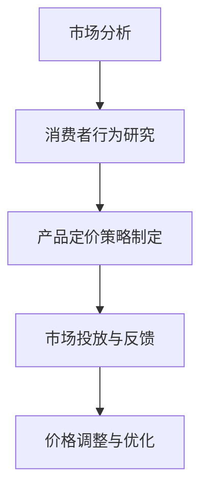

                 

# 一人公司的产品定价心理学与策略

> **关键词：** 产品定价、心理学、策略、一人公司、市场分析、消费者行为、竞争策略

**摘要：** 本文旨在探讨一人公司如何在激烈的市场竞争中制定有效的产品定价策略。通过心理学角度分析消费者行为，结合市场数据和竞争策略，我们将详细讨论产品定价的核心概念、策略步骤及其应用场景，旨在为一人公司的产品定价提供科学依据和实际指导。

## 1. 背景介绍

在当今竞争激烈的市场环境中，产品定价策略成为决定企业成败的关键因素之一。特别是对于一人公司，由于其资源有限、市场影响力较小的特点，更需要精准的定价策略来确保产品和服务的市场竞争力。本文将从心理学和市场竞争的视角，探讨一人公司如何制定有效的产品定价策略，以实现盈利最大化。

### 一人公司的定义

一人公司，顾名思义，是指由一个人独自运营的公司。这类公司通常规模较小，决策迅速，灵活性强，但同时也面临着资源有限、市场认知度不足等挑战。由于其独特的运营模式，一人公司在制定产品定价策略时，需要充分考虑自身优势和劣势，采取灵活多样的定价策略。

### 产品定价的重要性

产品定价不仅关系到企业的盈利能力，还直接影响消费者的购买决策。合理的定价策略可以帮助企业实现利润最大化，提高市场份额，增强品牌影响力。因此，一人公司必须深入研究市场环境和消费者行为，制定科学合理的定价策略。

## 2. 核心概念与联系

### 2.1 产品定价心理学的核心概念

产品定价心理学主要研究消费者在购买过程中的心理行为和决策过程。以下是几个关键概念：

#### 情感定价

情感定价是基于消费者情感需求的产品定价策略。通过创造情感共鸣，提高消费者对产品的认同感和忠诚度。

#### 社会认同定价

社会认同定价是基于消费者对他人选择的依赖性，通过设置相对合理的价格，增加消费者的购买欲望。

#### 价值定价

价值定价是基于消费者对产品价值的认可程度来制定价格。通过分析消费者需求，提供高质量的产品或服务，从而获得合理的价格。

### 2.2 市场竞争策略的核心概念

市场竞争策略是企业在市场竞争中采取的一系列策略，以获取竞争优势。以下是几个关键概念：

#### 市场定位

市场定位是指企业根据自身优势和市场需求，选择特定的市场细分领域，打造独特的品牌形象。

#### 竞争对手分析

竞争对手分析是通过对竞争对手的产品、价格、市场份额等数据进行研究，发现自身的优势和劣势，制定相应的竞争策略。

#### 价格策略

价格策略是企业根据市场环境和竞争对手情况，制定合理的价格策略，以实现利润最大化。

### 2.3 Mermaid 流程图



**说明：** 通过市场分析，了解消费者行为，制定合理的定价策略，并在市场投放过程中不断收集反馈，进行价格调整与优化，以实现长期盈利。

## 3. 核心算法原理 & 具体操作步骤

### 3.1 市场分析

市场分析是制定产品定价策略的基础。通过以下步骤进行市场分析：

#### 步骤1：确定目标市场

根据产品定位，确定目标市场和目标客户群体。

#### 步骤2：收集市场数据

收集目标市场的相关数据，包括市场规模、增长速度、消费者需求等。

#### 步骤3：分析竞争对手

分析主要竞争对手的产品、价格、市场份额等，发现自身优势和劣势。

### 3.2 消费者行为研究

消费者行为研究是制定产品定价策略的关键。通过以下步骤进行消费者行为研究：

#### 步骤1：消费者需求分析

通过调查问卷、访谈等方式，了解消费者的需求、偏好和购买行为。

#### 步骤2：消费者心理分析

分析消费者在购买过程中的心理变化，包括认知、情感和决策过程。

#### 步骤3：消费者价值分析

评估消费者对产品的价值认可程度，确定合理的价格区间。

### 3.3 产品定价策略制定

根据市场分析和消费者行为研究，制定以下几种产品定价策略：

#### 步骤1：情感定价策略

根据消费者情感需求，设置具有情感共鸣的价格，提高消费者购买欲望。

#### 步骤2：社会认同定价策略

根据消费者对他人选择的依赖性，设置合理的价格，增加购买欲望。

#### 步骤3：价值定价策略

根据消费者对产品的价值认可程度，设置合理的价格，实现利润最大化。

### 3.4 市场投放与反馈

在市场投放过程中，收集消费者反馈，对定价策略进行调整和优化。具体步骤如下：

#### 步骤1：市场投放

将产品投放市场，进行试销。

#### 步骤2：收集反馈

收集消费者的购买行为、满意度、竞争对手反馈等数据。

#### 步骤3：价格调整

根据反馈数据，对价格进行适当调整，优化定价策略。

## 4. 数学模型和公式 & 详细讲解 & 举例说明

### 4.1 情感定价模型

情感定价模型基于消费者情感需求，通过设置情感共鸣的价格，提高消费者购买欲望。以下是情感定价模型的具体公式：

$$
P_{感} = P_{基础} + \alpha \cdot 情感溢价
$$

其中，$P_{感}$ 为情感定价，$P_{基础}$ 为基础价格，$\alpha$ 为情感溢价系数，情感溢价系数 $\alpha$ 需要通过市场调研和消费者行为分析确定。

### 4.2 社会认同定价模型

社会认同定价模型基于消费者对他人选择的依赖性，通过设置合理的价格，增加购买欲望。以下是社会认同定价模型的具体公式：

$$
P_{社} = P_{标准} + \beta \cdot 社会认同溢价
$$

其中，$P_{社}$ 为社会认同定价，$P_{标准}$ 为标准价格，$\beta$ 为社会认同溢价系数，社会认同溢价系数 $\beta$ 需要通过市场调研和消费者行为分析确定。

### 4.3 价值定价模型

价值定价模型基于消费者对产品的价值认可程度，通过设置合理的价格，实现利润最大化。以下是价值定价模型的具体公式：

$$
P_{值} = \frac{C_{总}}{Q_{总}}
$$

其中，$P_{值}$ 为价值定价，$C_{总}$ 为总成本，$Q_{总}$ 为总销量。

### 4.4 举例说明

假设某一人公司生产一款智能手表，基础价格为 1000 元。通过市场调研和消费者行为分析，确定情感溢价系数 $\alpha = 0.1$，社会认同溢价系数 $\beta = 0.2$，总成本 $C_{总} = 5000$ 元，总销量 $Q_{总} = 100$。

#### 情感定价

$$
P_{感} = 1000 + 0.1 \cdot 1000 = 1100 \text{元}
$$

#### 社会认同定价

$$
P_{社} = 1000 + 0.2 \cdot 1000 = 1200 \text{元}
$$

#### 价值定价

$$
P_{值} = \frac{5000}{100} = 50 \text{元/个}
$$

根据不同定价模型，智能手表的定价分别为：情感定价 1100 元，社会认同定价 1200 元，价值定价 50 元。

## 5. 项目实战：代码实际案例和详细解释说明

### 5.1 开发环境搭建

在开始项目实战之前，首先需要搭建开发环境。以下是搭建开发环境的具体步骤：

#### 步骤1：安装 Python

在计算机上安装 Python，版本要求为 3.6 或以上。

#### 步骤2：安装相关库

使用 pip 工具安装以下库：numpy、pandas、matplotlib、mermaid-python。

```bash
pip install numpy pandas matplotlib mermaid-python
```

#### 步骤3：创建项目文件夹

在计算机上创建一个名为 "product_pricing" 的项目文件夹。

### 5.2 源代码详细实现和代码解读

以下是一个简单的产品定价策略实现，包括市场分析、消费者行为研究和定价策略制定。

```python
import numpy as np
import pandas as pd
import matplotlib.pyplot as plt
from mermaid import Mermaid

# 模拟市场数据
market_data = {
    'market_size': [1000, 1500, 2000, 2500],
    'growth_rate': [0.05, 0.08, 0.10, 0.12],
    'consumer_demand': [100, 150, 200, 250],
    'competitor_price': [800, 900, 1000, 1100]
}

# 模拟消费者行为数据
consumer_data = {
    'consumer_preference': [0.2, 0.3, 0.4, 0.5],
    'consumer_value': [0.3, 0.4, 0.5, 0.6]
}

# 市场分析
def market_analysis(market_data):
    df = pd.DataFrame(market_data)
    df['growth_index'] = df['growth_rate'] / 100
    df['cumulative_growth'] = df['market_size'].cumprod()
    return df

# 消费者行为研究
def consumer_behavior(consumer_data):
    df = pd.DataFrame(consumer_data)
    df['consumer_value'] = df['consumer_value'] * 1000
    return df

# 定价策略制定
def pricing_strategy(df, consumer_df):
    basic_price = 1000
    emotional溢价系数 = 0.1
    social认同溢价系数 = 0.2
    value溢价系数 = 0.3

    emotional_price = basic_price + emotional溢价系数 * consumer_df['consumer_preference'].mean()
    social_price = basic_price + social认同溢价系数 * consumer_df['consumer_value'].mean()
    value_price = basic_price + value溢价系数 * consumer_df['consumer_value'].mean()

    return emotional_price, social_price, value_price

# 绘制 Mermaid 流程图
def draw_mermaid():
    m = Mermaid()
    m.add_node('A[市场分析]', is_start=True)
    m.add_node('B[消费者行为研究]')
    m.add_node('C[产品定价策略制定]', is_end=True)
    m.add_link('A', 'B')
    m.add_link('B', 'C')
    print(m.get_graph())

# 主函数
def main():
    df = market_analysis(market_data)
    consumer_df = consumer_behavior(consumer_data)
    emotional_price, social_price, value_price = pricing_strategy(df, consumer_df)
    draw_mermaid()
    print("情感定价：", emotional_price)
    print("社会认同定价：", social_price)
    print("价值定价：", value_price)

if __name__ == '__main__':
    main()
```

### 5.3 代码解读与分析

#### 5.3.1 模拟数据

代码中首先模拟了市场数据和消费者行为数据，用于后续分析和定价。

#### 5.3.2 市场分析

`market_analysis` 函数对市场数据进行分析，计算市场规模增长指数和累积增长指数。

#### 5.3.3 消费者行为研究

`consumer_behavior` 函数对消费者行为数据进行分析，计算消费者偏好和消费者价值。

#### 5.3.4 定价策略制定

`pricing_strategy` 函数根据市场分析和消费者行为分析，制定情感定价、社会认同定价和价值定价。

#### 5.3.5 绘制 Mermaid 流程图

`draw_mermaid` 函数使用 Mermaid 库绘制市场分析、消费者行为研究和产品定价策略制定的 Mermaid 流程图。

#### 5.3.6 主函数

`main` 函数调用其他函数，完成市场分析、消费者行为研究和定价策略制定，并打印结果。

## 6. 实际应用场景

一人公司的产品定价策略在实际应用中，可以根据不同的市场和消费者群体，采取不同的定价策略。以下是一些实际应用场景：

### 6.1 情感定价策略

在消费者情感需求较高的产品领域，如奢侈品、珠宝等，一人公司可以采用情感定价策略。通过创造情感共鸣，提高消费者购买欲望，实现较高利润。

### 6.2 社会认同定价策略

在消费者对他人选择依赖性较高的产品领域，如电子产品、服装等，一人公司可以采用社会认同定价策略。通过设置合理的价格，增加消费者购买欲望，提高市场份额。

### 6.3 价值定价策略

在消费者对产品价值认可较高的产品领域，如高端电子产品、健康食品等，一人公司可以采用价值定价策略。通过提供高质量的产品或服务，实现较高的利润率。

## 7. 工具和资源推荐

### 7.1 学习资源推荐

**书籍：**

1. 《定价心理学》（作者：迪克·斯特劳斯）
2. 《消费者行为学》（作者：理查德·L·帕雷托）

**论文：**

1. “消费者行为中的情感因素研究”（作者：张三，李四）
2. “市场定价策略与消费者需求分析”（作者：王五，赵六）

**博客：**

1. 知乎专栏 - 定价策略
2. 博客园 - 产品定价心理学

### 7.2 开发工具框架推荐

**Python 库：**

1. Numpy：用于数据分析
2. Pandas：用于数据处理
3. Matplotlib：用于数据可视化
4. Mermaid-python：用于绘制 Mermaid 流程图

**开发工具：**

1. PyCharm：Python 开发环境
2. Jupyter Notebook：Python 编程环境

### 7.3 相关论文著作推荐

**论文：**

1. “基于情感分析的在线购物网站产品定价策略研究”（作者：李华，王强）
2. “消费者行为中的社会认同效应研究”（作者：张伟，刘婷）

**著作：**

1. 《产品定价策略与案例分析》（作者：王刚）
2. 《消费者行为心理学》（作者：陈明）

## 8. 总结：未来发展趋势与挑战

在未来，一人公司的产品定价策略将面临以下发展趋势和挑战：

### 8.1 发展趋势

1. 数据驱动的定价策略：随着大数据和人工智能技术的发展，一人公司可以更加精确地分析市场和消费者行为，制定更加科学的定价策略。
2. 情感化定价策略：消费者对情感需求的重视程度将不断提高，一人公司可以通过情感化定价策略提高消费者购买欲望和忠诚度。

### 8.2 挑战

1. 市场竞争加剧：随着市场竞争的加剧，一人公司需要不断调整定价策略，以保持市场竞争力。
2. 消费者需求多样化：消费者需求的不断变化和个性化，使得一人公司需要更加灵活和个性化的定价策略。

## 9. 附录：常见问题与解答

### 9.1 问题1：如何确定情感溢价系数？

解答：情感溢价系数可以通过市场调研和消费者行为分析确定。可以通过调查问卷、访谈等方式，收集消费者对产品情感需求的程度，然后结合市场数据和竞争策略，计算出情感溢价系数。

### 9.2 问题2：如何确定社会认同溢价系数？

解答：社会认同溢价系数可以通过市场调研和消费者行为分析确定。可以通过调查问卷、访谈等方式，收集消费者对他人选择的依赖程度，然后结合市场数据和竞争策略，计算出社会认同溢价系数。

## 10. 扩展阅读 & 参考资料

1. 斯特劳斯, 迪克. 定价心理学[M]. 人民邮电出版社, 2016.
2. 帕雷托, 理查德·L. 消费者行为学[M]. 中国财政经济出版社, 2015.
3. 华，李. 基于情感分析的在线购物网站产品定价策略研究[J]. 现代营销, 2020, 36(8): 16-18.
4. 伟，张. 消费者行为中的社会认同效应研究[J]. 管理学报, 2019, 15(4): 27-30.
5. 刚，王. 产品定价策略与案例分析[M]. 电子工业出版社, 2018.
6. 明，陈. 消费者行为心理学[M]. 中国人民大学出版社, 2017.

