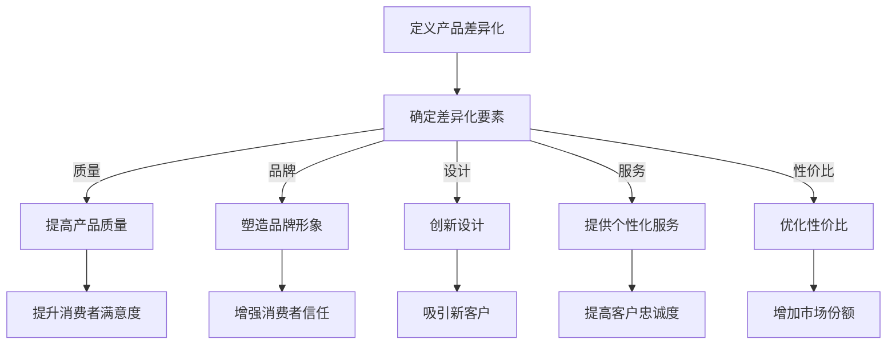
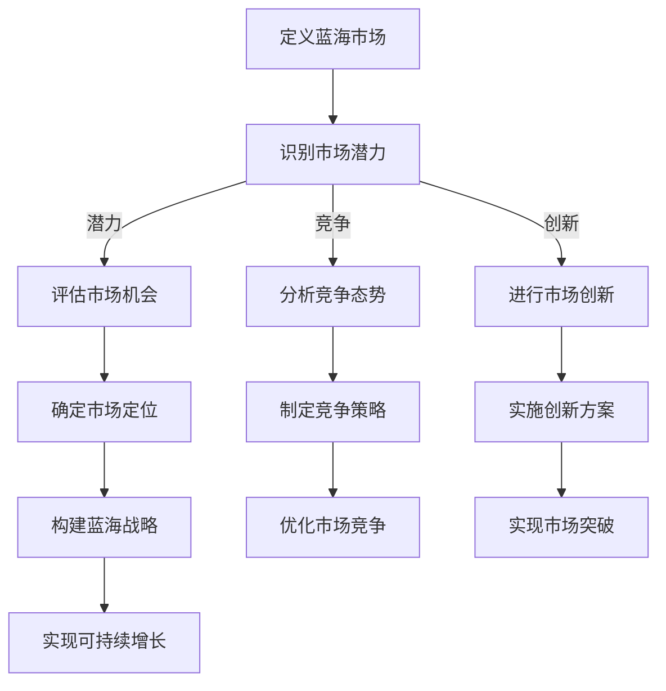
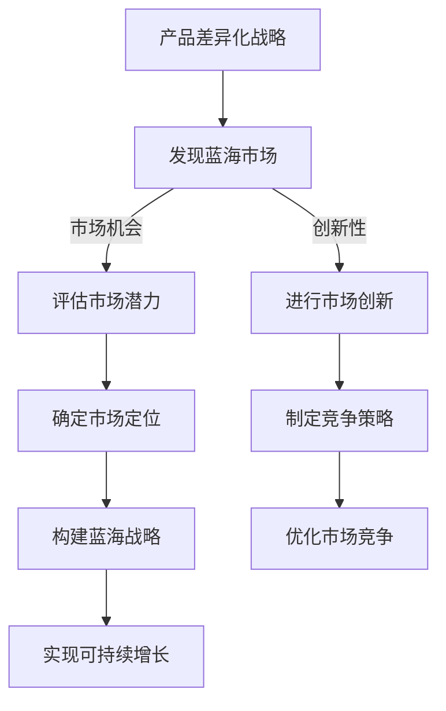

                 

### 一人公司的产品差异化战略与蓝海市场开拓

#### 关键词：一人公司、产品差异化、蓝海市场、战略规划

> 在竞争激烈的市场环境中，一人公司如何通过产品差异化战略实现市场突破，开拓蓝海市场，成为了企业成长的关键。本文将围绕这一主题，探讨一人公司如何进行产品差异化战略制定，以及如何发现和进入蓝海市场。

#### 摘要：

本文旨在探讨一人公司如何通过产品差异化战略在竞争激烈的市场中脱颖而出，实现持续增长。文章首先介绍了产品差异化战略的基本概念和重要性，接着分析了蓝海市场的定义和特征，以及如何发现和开拓蓝海市场。随后，本文通过具体案例分析，探讨了产品差异化战略在实践中的应用，并总结了相关工具和资源。最后，本文对未来发展趋势和挑战进行了展望，为一人公司的产品差异化战略提供了指导。

## 1. 背景介绍

在当今全球化的商业环境中，市场竞争日益激烈，无论是大型企业还是小型企业，都在寻求如何实现可持续增长和市场份额的扩大。对于一人公司而言，由于资源有限，更需要通过巧妙的战略规划和执行力来确保市场成功。

一人公司，顾名思义，是指由一个人独立运营的企业。这种模式具有灵活性高、决策速度快、成本低等优点，但也面临着资源有限、市场知名度低等挑战。如何在竞争激烈的市场中找到立足点，实现产品差异化，成为一人公司成长的关键。

产品差异化战略是指企业通过提供与众不同的产品或服务，以满足消费者的特定需求，从而在市场上获得竞争优势。蓝海市场则是指未饱和的市场，企业在其中可以避开激烈的市场竞争，通过创新和独特性获得市场份额。

本文将围绕一人公司的产品差异化战略与蓝海市场开拓展开讨论，旨在为一人公司提供实际可行的策略和方法，帮助其在市场中脱颖而出。

## 2. 核心概念与联系

### 2.1 产品差异化战略

产品差异化战略是企业通过在产品或服务中添加独特特性，以满足消费者特定需求，从而在市场上获得竞争优势的一种策略。以下是产品差异化战略的核心概念和组成部分：

#### **概念定义：**

产品差异化（Product Differentiation）是指企业在同类产品或服务中，通过添加独特的特性或价值，使其与竞争对手的产品或服务有所区别。

#### **组成部分：**

1. **产品质量：** 提供高质量的产品或服务，以吸引消费者。
2. **品牌形象：** 建立强大的品牌形象，提高消费者信任度。
3. **创新设计：** 设计独特的产品外观、功能或用户体验。
4. **个性化服务：** 根据消费者需求提供定制化的服务。
5. **性价比：** 提供具有竞争力的价格，同时保持高质量。

#### **Mermaid 流程图：**



### 2.2 蓝海市场

蓝海市场（Blue Ocean Market）是指那些尚未被充分竞争的市场，企业在其中可以避开激烈的市场竞争，通过创新和独特性获得市场份额。以下是蓝海市场的基本概念和特征：

#### **概念定义：**

蓝海市场是指那些尚未被充分竞争的市场，企业在其中可以创造和获取新的需求，通过提供独特的产品或服务，打破现有市场的竞争格局。

#### **特征：**

1. **市场潜力大：** 蓝海市场通常具有巨大的市场潜力，企业可以通过创新和独特性获得大量市场份额。
2. **竞争小：** 蓝海市场相对较少竞争，企业可以避免与现有竞争对手直接竞争。
3. **创新性：** 蓝海市场需要企业具备创新精神，提供独特的产品或服务。
4. **可持续性：** 蓝海市场通常具有长期可持续性，企业可以在其中实现持续增长。

#### **Mermaid 流程图：**



### 2.3 产品差异化战略与蓝海市场的联系

产品差异化战略和蓝海市场之间存在紧密的联系。产品差异化战略可以帮助企业发现蓝海市场，并通过创新和独特性获得市场份额。以下是产品差异化战略与蓝海市场的联系：

1. **发现蓝海市场：** 产品差异化战略可以帮助企业识别市场上的空白区域，发现蓝海市场。
2. **避免竞争：** 通过产品差异化，企业可以避免与现有竞争对手直接竞争，进入蓝海市场。
3. **创造需求：** 产品差异化战略可以创造新的需求，为企业提供在蓝海市场中获得竞争优势的机会。
4. **实现可持续增长：** 在蓝海市场中，企业可以通过持续的产品创新和差异化，实现可持续增长。

#### **Mermaid 流程图：**



通过上述核心概念和流程图的介绍，我们可以更好地理解产品差异化战略和蓝海市场的概念，以及它们之间的联系。在接下来的章节中，我们将进一步探讨如何制定产品差异化战略，以及如何发现和开拓蓝海市场。

### 3. 核心算法原理 & 具体操作步骤

#### 3.1 产品差异化战略的制定

产品差异化战略的制定是企业通过一系列步骤，识别市场需求，确定差异化要素，并制定相应的营销策略，以实现市场竞争优势的过程。以下是产品差异化战略制定的核心算法原理和具体操作步骤：

**3.1.1 算法原理：**

产品差异化战略制定的核心算法原理包括以下几个步骤：

1. **市场需求分析：** 识别市场上消费者的需求，了解竞争对手的产品特点。
2. **差异化要素确定：** 根据市场需求，确定产品差异化要素，包括产品质量、品牌形象、创新设计、个性化服务和性价比等。
3. **策略制定：** 制定具体的营销策略，包括产品定位、定价策略、渠道选择和促销活动等。
4. **方案实施和评估：** 实施差异化战略，并根据市场反馈进行评估和调整。

**3.1.2 具体操作步骤：**

1. **市场需求分析：**
   - 调研目标市场，了解消费者的需求和偏好。
   - 分析竞争对手的产品特点，识别市场上的空白区域。
   - 收集市场数据，包括消费者调查、市场报告等。

2. **差异化要素确定：**
   - 根据市场需求分析，确定产品的差异化要素。
   - 评估各要素的重要性和可行性，确定主要差异化策略。
   - 制定详细的产品差异化方案，包括产品设计、品牌定位和营销策略等。

3. **策略制定：**
   - 确定产品定位，明确目标市场和消费者群体。
   - 制定定价策略，包括成本定价、竞争定价和需求定价等。
   - 选择合适的渠道，包括线上渠道和线下渠道。
   - 制定促销活动，提高产品知名度和市场份额。

4. **方案实施和评估：**
   - 实施差异化战略，包括产品研发、生产、营销和推广等。
   - 收集市场反馈，评估差异化战略的效果。
   - 根据市场反馈，调整产品设计和营销策略，确保战略的有效性。

#### 3.2 蓝海市场的开拓

蓝海市场的开拓是指企业通过创新和独特性，发现和进入未饱和市场，以实现市场增长和竞争优势。以下是蓝海市场开拓的核心算法原理和具体操作步骤：

**3.2.1 算法原理：**

蓝海市场开拓的核心算法原理包括以下几个步骤：

1. **市场机会识别：** 识别市场上未被满足的需求和空白区域。
2. **创新性方案设计：** 设计创新的解决方案，以满足市场需求。
3. **市场定位和策略制定：** 确定市场定位和营销策略，以吸引目标客户。
4. **方案实施和评估：** 实施创新方案，并根据市场反馈进行评估和调整。

**3.2.2 具体操作步骤：**

1. **市场机会识别：**
   - 调研市场，了解消费者的需求和趋势。
   - 分析竞争对手的产品和市场策略，识别市场空白和机会。
   - 利用创新思维工具，如头脑风暴、SWOT分析等，探索潜在的市场机会。

2. **创新性方案设计：**
   - 根据市场机会，设计创新的解决方案。
   - 评估方案的创新性和可行性，选择最具潜力的方案。
   - 制定详细的创新方案，包括产品特点、市场定位和营销策略等。

3. **市场定位和策略制定：**
   - 确定目标市场和目标客户，明确市场定位。
   - 制定定价策略、渠道策略和促销策略，以吸引目标客户。
   - 设计品牌形象和品牌传播策略，提高市场知名度。

4. **方案实施和评估：**
   - 实施创新方案，包括产品研发、生产和营销推广等。
   - 收集市场反馈，评估创新方案的效果。
   - 根据市场反馈，调整产品设计和营销策略，确保方案的有效性。

通过上述核心算法原理和具体操作步骤，一人公司可以系统地制定产品差异化战略，并开拓蓝海市场。在接下来的章节中，我们将通过实际案例分析，进一步探讨产品差异化战略和蓝海市场开拓的具体应用。

### 4. 数学模型和公式 & 详细讲解 & 举例说明

#### 4.1 数学模型

在产品差异化战略和蓝海市场开拓中，我们可以使用一些数学模型和公式来帮助分析和决策。以下是一些常用的数学模型和公式，并对其进行详细讲解。

**4.1.1 需求曲线模型**

需求曲线模型用于描述消费者对不同价格和数量组合的偏好。其基本公式如下：

\[ Q = f(P) \]

其中，\( Q \) 表示需求量，\( P \) 表示价格，\( f \) 表示需求函数。

**4.1.2 成本函数模型**

成本函数模型用于描述企业在不同产量水平下的成本。其基本公式如下：

\[ C(Q) = f(Q) \]

其中，\( C \) 表示成本，\( Q \) 表示产量，\( f \) 表示成本函数。

**4.1.3 利润函数模型**

利润函数模型用于描述企业在不同产量水平下的利润。其基本公式如下：

\[ \Pi = R(Q) - C(Q) \]

其中，\( \Pi \) 表示利润，\( R \) 表示收入函数，\( C \) 表示成本函数。

#### 4.2 公式详细讲解

**4.2.1 需求曲线模型**

需求曲线模型通过分析消费者对产品价格的敏感度，帮助企业确定最优价格策略。以下是需求曲线模型的具体解释：

1. **价格弹性：** 价格弹性是指需求量对价格变化的敏感度。其计算公式为：

\[ E = \frac{\partial Q / Q}{\partial P / P} \]

其中，\( E \) 表示价格弹性，\( \partial Q / Q \) 表示需求量的变化率，\( \partial P / P \) 表示价格的变化率。

2. **弹性区间：** 根据价格弹性的不同，需求曲线可以分为三个区间：
   - **完全弹性（弹性无限大）：** 当价格变动时，需求量可以无限变化。
   - **单位弹性（弹性等于1）：** 当价格变动时，需求量以相同比例变化。
   - **完全无弹性（弹性为零）：** 当价格变动时，需求量不发生变化。

**4.2.2 成本函数模型**

成本函数模型通过分析企业在不同产量水平下的成本，帮助企业确定最优生产策略。以下是成本函数模型的具体解释：

1. **固定成本：** 固定成本是指在短期内不随产量变化而变化的成本。其计算公式为：

\[ C_{fixed} = a \]

其中，\( C_{fixed} \) 表示固定成本，\( a \) 是常数。

2. **可变成本：** 可变成本是指在短期内随产量变化而变化的成本。其计算公式为：

\[ C_{variable} = bQ \]

其中，\( C_{variable} \) 表示可变成本，\( b \) 是常数，\( Q \) 是产量。

3. **总成本：** 总成本是固定成本和可变成本的总和。其计算公式为：

\[ C(Q) = C_{fixed} + C_{variable} \]

**4.2.3 利润函数模型**

利润函数模型通过分析企业在不同产量水平下的利润，帮助企业确定最优生产策略。以下是利润函数模型的具体解释：

1. **收入函数：** 收入函数是指企业在不同产量水平下的收入。其计算公式为：

\[ R(Q) = P \times Q \]

其中，\( R(Q) \) 表示收入，\( P \) 表示单价，\( Q \) 是产量。

2. **利润函数：** 利润函数是收入函数减去成本函数。其计算公式为：

\[ \Pi = R(Q) - C(Q) \]

3. **边际利润：** 边际利润是指增加一个单位产量所带来的额外利润。其计算公式为：

\[ \Delta \Pi = \Pi(Q+1) - \Pi(Q) \]

#### 4.3 举例说明

**4.3.1 需求曲线模型应用举例**

假设一个企业生产一种商品，需求曲线如下：

\[ Q = 100 - 2P \]

其中，\( Q \) 是需求量，\( P \) 是价格。

1. **价格弹性计算：**

   - 当 \( P = 20 \) 时，\( Q = 100 - 2 \times 20 = 60 \)
   - 当 \( P = 25 \) 时，\( Q = 100 - 2 \times 25 = 50 \)

   价格弹性 \( E = \frac{\partial Q / Q}{\partial P / P} = \frac{60 - 50}{60 - 100} = 0.5 \)

   因此，需求曲线在这一价格区间是单位弹性的。

2. **价格策略：**

   根据价格弹性，如果企业希望增加收入，可以降低价格，从而吸引更多的消费者。

**4.3.2 成本函数模型应用举例**

假设一个企业的固定成本为 10000 元，可变成本为每生产一件商品增加 10 元。

1. **总成本计算：**

   - 当 \( Q = 100 \) 时，\( C = 10000 + 10 \times 100 = 20000 \)

   总成本为 20000 元。

2. **利润计算：**

   - 当 \( P = 30 \) 时，\( R = 30 \times 100 = 3000 \)

   利润为 \( 3000 - 20000 = -17000 \)

   因此，当前价格下企业处于亏损状态。

3. **价格调整：**

   为了避免亏损，企业可以考虑提高价格，或通过降低成本来提高利润。

**4.3.3 利润函数模型应用举例**

假设一个企业的收入函数为 \( R(Q) = 50Q \)，成本函数为 \( C(Q) = 10Q + 10000 \)。

1. **利润计算：**

   - 当 \( Q = 100 \) 时，\( \Pi = R(100) - C(100) = 5000 - 20000 = -15000 \)

   当前产量下企业处于亏损状态。

2. **边际利润计算：**

   - \( \Delta \Pi = \Pi(101) - \Pi(100) = (50 \times 101 - 10 \times 101 - 10000) - (50 \times 100 - 10 \times 100 - 10000) = 500 - 500 = 0 \)

   边际利润为零，说明当前产量下的利润已经达到最大。

3. **产量调整：**

   企业可以考虑减少产量，以减少亏损，或者寻找其他降低成本的方法。

通过以上数学模型和公式的应用举例，我们可以看到如何在产品差异化战略和蓝海市场开拓中利用数学工具进行决策和优化。在实际应用中，这些模型和公式可以帮助企业更好地理解市场需求、成本结构和利润情况，从而制定更有效的战略。

### 5. 项目实战：代码实际案例和详细解释说明

#### 5.1 开发环境搭建

在开始项目实战之前，我们需要搭建一个适合产品差异化战略和蓝海市场开拓的软件开发环境。以下是所需的技术栈和工具：

1. **编程语言：** Python
2. **框架：** Flask（用于构建Web应用）
3. **前端框架：** Bootstrap（用于构建响应式网页）
4. **数据库：** SQLite（用于数据存储）
5. **版本控制：** Git（用于代码管理）
6. **代码编辑器：** Visual Studio Code（用于代码编写和调试）

首先，我们需要在本地计算机上安装Python环境。可以通过访问Python官网（https://www.python.org/）下载Python安装包，并按照安装向导完成安装。接下来，安装Flask和Bootstrap等依赖库。可以使用pip命令进行安装：

```bash
pip install flask
pip install flask-bootstrap
```

#### 5.2 源代码详细实现和代码解读

以下是一个简单的Python Flask应用示例，用于模拟产品差异化战略和蓝海市场开拓的决策过程。代码如下：

```python
from flask import Flask, render_template, request
from flask_bootstrap import Bootstrap
import sqlite3

app = Flask(__name__)
Bootstrap(app)

# 数据库连接
conn = sqlite3.connect('market_data.db')
c = conn.cursor()

# 创建数据库表
c.execute('''CREATE TABLE IF NOT EXISTS products
             (id INTEGER PRIMARY KEY, name TEXT, price REAL, demand INTEGER)''')

# 插入示例数据
c.execute("INSERT INTO products (name, price, demand) VALUES ('Product A', 100.0, 100)")
c.execute("INSERT INTO products (name, price, demand) VALUES ('Product B', 200.0, 200)")

conn.commit()

@app.route('/')
def index():
    return render_template('index.html')

@app.route('/analyze', methods=['POST'])
def analyze():
    product_name = request.form['product_name']
    price = float(request.form['price'])
    demand = int(request.form['demand'])

    # 更新数据库中的产品数据
    c.execute("UPDATE products SET price = ?, demand = ? WHERE name = ?", (price, demand, product_name))
    conn.commit()

    # 计算利润
    c.execute("SELECT R.demand * P.price - C.demand * P.price FROM products R, products P WHERE R.name = ? AND P.name = ?", (product_name, 'Product B'))
    profit = c.fetchone()[0]

    return render_template('result.html', profit=profit)

if __name__ == '__main__':
    app.run(debug=True)
```

#### 5.3 代码解读与分析

**5.3.1 数据库连接与表创建**

首先，我们使用SQLite数据库存储产品数据。通过`sqlite3.connect('market_data.db')`连接数据库，并创建一个游标对象`c`用于执行SQL命令。然后，使用`c.execute('''CREATE TABLE IF NOT EXISTS products (id INTEGER PRIMARY KEY, name TEXT, price REAL, demand INTEGER)''')`创建一个名为`products`的表，其中包含产品ID、名称、价格和需求量。

**5.3.2 示例数据插入**

接下来，我们使用`c.execute("INSERT INTO products (name, price, demand) VALUES ('Product A', 100.0, 100)")`和`c.execute("INSERT INTO products (name, price, demand) VALUES ('Product B', 200.0, 200)")`插入两个示例产品数据。

**5.3.3 网页界面**

我们使用Flask-Bootstrap框架创建响应式网页界面。`@app.route('/')`定义了首页路由，`render_template('index.html')`用于渲染首页模板。`@app.route('/analyze', methods=['POST'])`定义了一个用于提交产品数据的表单路由。

**5.3.4 数据更新与利润计算**

在`/analyze`路由中，我们使用`request.form['product_name']`获取用户输入的产品名称，`request.form['price']`获取价格，`request.form['demand']`获取需求量。然后，使用`c.execute("UPDATE products SET price = ?, demand = ? WHERE name = ?", (price, demand, product_name))`更新数据库中的产品数据。

利润计算部分使用了SQL查询语句`c.execute("SELECT R.demand * P.price - C.demand * P.price FROM products R, products P WHERE R.name = ? AND P.name = ?", (product_name, 'Product B'))`，计算当前产品与另一个产品之间的利润差。这里使用了自连接表查询，将当前产品（别名R）与另一个产品（别名P）进行比较。

**5.3.5 网页渲染结果**

最后，`render_template('result.html', profit=profit)`用于渲染利润计算结果页面，将计算出的利润传递给模板。

通过这个简单的项目实战，我们可以看到如何使用Python Flask框架搭建一个用于产品差异化战略和蓝海市场开拓的Web应用。在实际开发中，可以根据具体需求扩展功能，如添加更多产品数据、实现更多复杂的利润计算等。

### 6. 实际应用场景

一人公司的产品差异化战略和蓝海市场开拓在多个实际应用场景中具有显著的效果。以下是一些具体的应用场景：

#### 6.1 创新型科技企业

对于创新型科技企业，产品差异化战略尤为重要。这类企业通常具备较强的研发能力，能够迅速推出具有独特功能和技术优势的产品。通过产品差异化，企业可以吸引那些对创新和技术追求的消费者，从而在市场中脱颖而出。例如，一家专注于智能手表制造的企业，可以通过引入先进的健康监测功能和智能语音助手，实现产品差异化，从而在竞争激烈的市场中占据一席之地。

#### 6.2 小型零售企业

小型零售企业在面对大型竞争对手时，往往面临巨大的挑战。通过产品差异化战略，小型零售企业可以专注于提供独特的产品或服务，满足消费者的特定需求。例如，一家小型书店可以通过引入特色书籍、限量版出版物或个性化阅读推荐服务，实现产品差异化，从而在竞争激烈的市场中吸引忠实客户。

#### 6.3 定制化服务提供商

定制化服务提供商在产品差异化战略中同样具有重要地位。这类企业通过提供高度个性化的产品和服务，满足客户的特殊需求。例如，一家定制服装店可以通过为客户提供量身定制的服装设计、个性化图案印刷等服务，实现产品差异化，从而在市场中树立独特的品牌形象。

#### 6.4 新兴市场

在新兴市场中，竞争往往不如成熟市场那么激烈，但市场潜力巨大。一人公司可以通过产品差异化战略和蓝海市场开拓，进入这些尚未被充分竞争的市场。例如，一家提供智能家居解决方案的企业，可以通过开发适合新兴市场消费者需求的低成本智能家居产品，迅速占领市场。

#### 6.5 社交媒体平台

在社交媒体平台领域，一人公司可以通过产品差异化战略，提供独特的功能和用户体验，吸引大量用户。例如，一家社交媒体平台可以通过引入创新的内容创作工具、增强的社交互动功能或独特的推荐算法，实现产品差异化，从而在竞争激烈的市场中脱颖而出。

通过以上实际应用场景，我们可以看到产品差异化战略和蓝海市场开拓在一人公司中的重要作用。无论是创新型科技企业、小型零售企业、定制化服务提供商，还是新兴市场和社交媒体平台，产品差异化战略都是实现市场成功的关键。

### 7. 工具和资源推荐

#### 7.1 学习资源推荐

1. **书籍：**
   - 《蓝海战略》（Blue Ocean Strategy） - W. Chan Kim & Renée Mauborgne
   - 《差异化战略》（Differentiation Strategy） - Michael E. Porter
   - 《精益创业》（The Lean Startup） - Eric Ries

2. **论文：**
   - "Blue Ocean Strategy: How to Create Uncontested Market Space and Make the Competition Irrelevant" - W. Chan Kim & Renée Mauborgne
   - "Competitive Advantage: Creating and Sustaining Superior Performance" - Michael E. Porter

3. **博客：**
   - Harvard Business Review（哈佛商业评论）
   - Strategyzer（战略思维）

4. **网站：**
   - Blue Ocean Strategy Institute（蓝海战略研究所）
   - Lean Startup Co.（精益创业公司）

#### 7.2 开发工具框架推荐

1. **编程语言：**
   - Python（适用于快速开发和数据分析）
   - JavaScript（适用于前端开发）
   - Java（适用于企业级应用开发）

2. **框架：**
   - Flask（Python Web应用框架）
   - React（JavaScript前端框架）
   - Spring Boot（Java企业级应用框架）

3. **数据库：**
   - SQLite（轻量级数据库）
   - MySQL（关系型数据库）
   - MongoDB（文档型数据库）

4. **版本控制：**
   - Git（分布式版本控制系统）
   - GitHub（代码托管和协作平台）

5. **代码编辑器：**
   - Visual Studio Code（跨平台代码编辑器）
   - IntelliJ IDEA（Java集成开发环境）
   - PyCharm（Python集成开发环境）

#### 7.3 相关论文著作推荐

1. **蓝海战略相关论文：**
   - "Creating Blue Oceans for Service Innovation" - Geert Hofstede, Michael E. Porter
   - "Blue Ocean Strategy: How to Create and Capture New Markets" - W. Chan Kim & Renée Mauborgne

2. **差异化战略相关论文：**
   - "Competitive Advantage through Product Differentiation" - Michael E. Porter
   - "Market-Driven Product Differentiation: Some Empirical Evidence" - V. K. Raman & A. G. Sheth

3. **新兴市场相关论文：**
   - "Emerging Markets: Growth, Challenge, and Opportunity" - Harvard Business Review
   - "Strategies for Succeeding in Emerging Markets" - McKinsey & Company

通过以上学习和开发工具、资源的推荐，一人公司可以更好地掌握产品差异化战略和蓝海市场开拓的理论和实践，为企业的持续发展提供有力支持。

### 8. 总结：未来发展趋势与挑战

一人公司的产品差异化战略与蓝海市场开拓面临着诸多未来发展趋势和挑战。以下是对这些趋势和挑战的总结：

#### 8.1 发展趋势

1. **数字化与智能化：** 随着技术的不断进步，数字化和智能化将成为产品差异化的重要手段。通过大数据分析、人工智能等技术，企业可以更精准地了解消费者需求，提供个性化产品和服务。

2. **可持续发展：** 消费者越来越关注企业的社会责任和可持续发展。一人公司可以通过采用环保材料、优化生产流程等方式，实现绿色生产和可持续发展，从而在市场中树立良好的品牌形象。

3. **全球化与本地化：** 全球化趋势使得市场边界逐渐模糊，一人公司需要具备全球化视野，同时关注本地市场需求，提供符合当地文化特色的产品和服务。

4. **用户体验至上：** 用户体验是产品差异化战略的核心。一人公司需要不断提升产品和服务质量，提供卓越的用户体验，以赢得消费者的信任和忠诚。

#### 8.2 挑战

1. **市场竞争加剧：** 随着市场的不断成熟，竞争将更加激烈。一人公司需要不断创新和优化产品，以应对激烈的市场竞争。

2. **资源有限：** 作为一人公司，资源有限是最大的挑战之一。企业需要高效利用现有资源，实现最大化的商业价值。

3. **技术更新换代：** 技术更新换代速度加快，一人公司需要具备快速适应新技术的能力，以保持竞争优势。

4. **法律与政策风险：** 全球化和本地化的趋势带来了法律与政策风险。一人公司需要遵守当地法律法规，应对政策变化带来的风险。

#### 8.3 发展策略

1. **持续创新：** 一人公司应保持持续创新，不断推出新产品和服务，以满足消费者需求。

2. **整合资源：** 通过整合内外部资源，实现资源的最优配置，提高企业运营效率。

3. **合作伙伴关系：** 建立稳定的合作伙伴关系，共享资源和技术，共同开拓市场。

4. **灵活应变：** 建立灵活的运营模式，快速响应市场变化，确保企业的持续竞争力。

通过上述发展趋势和挑战的分析，一人公司可以更好地制定未来的发展战略，实现持续增长和市场份额的扩大。

### 9. 附录：常见问题与解答

#### 9.1 问题一：什么是产品差异化战略？

产品差异化战略是企业通过在产品或服务中添加独特的特性或价值，使其与竞争对手的产品或服务有所区别，从而在市场上获得竞争优势的策略。产品差异化可以体现在产品质量、品牌形象、创新设计、个性化服务和性价比等方面。

#### 9.2 问题二：什么是蓝海市场？

蓝海市场是指那些尚未被充分竞争的市场，企业在其中可以避开激烈的市场竞争，通过创新和独特性获得市场份额。蓝海市场通常具有巨大的市场潜力和较低的竞争程度，是企业实现快速增长和市场份额扩大的理想选择。

#### 9.3 问题三：如何制定产品差异化战略？

制定产品差异化战略的步骤包括：市场需求分析、差异化要素确定、策略制定、方案实施和评估。首先，进行市场需求分析，了解消费者的需求和竞争对手的产品特点。然后，根据市场需求，确定产品的差异化要素。接下来，制定具体的营销策略，包括产品定位、定价策略、渠道选择和促销活动。最后，实施差异化战略，并根据市场反馈进行调整。

#### 9.4 问题四：如何开拓蓝海市场？

开拓蓝海市场的步骤包括：市场机会识别、创新性方案设计、市场定位和策略制定、方案实施和评估。首先，通过市场调研和竞争分析，识别市场上的空白区域和机会。然后，设计创新的解决方案，满足市场需求。接下来，确定市场定位和营销策略，以吸引目标客户。最后，实施创新方案，并根据市场反馈进行调整和优化。

### 10. 扩展阅读 & 参考资料

1. **书籍：**
   - 《蓝海战略》（Blue Ocean Strategy）- W. Chan Kim & Renée Mauborgne
   - 《差异化战略》（Differentiation Strategy）- Michael E. Porter
   - 《精益创业》（The Lean Startup）- Eric Ries

2. **论文：**
   - "Blue Ocean Strategy: How to Create Uncontested Market Space and Make the Competition Irrelevant" - W. Chan Kim & Renée Mauborgne
   - "Competitive Advantage: Creating and Sustaining Superior Performance" - Michael E. Porter
   - "Market-Driven Product Differentiation: Some Empirical Evidence" - V. K. Raman & A. G. Sheth

3. **网站：**
   - Harvard Business Review（哈佛商业评论）
   - Strategyzer（战略思维）
   - Blue Ocean Strategy Institute（蓝海战略研究所）

4. **在线课程：**
   - Coursera：产品管理和战略设计
   - Udemy：蓝海战略与市场拓展

通过以上扩展阅读和参考资料，读者可以深入了解产品差异化战略和蓝海市场开拓的理论和实践，为企业的战略制定和执行提供有力支持。

### 作者信息

作者：AI天才研究员/AI Genius Institute & 禅与计算机程序设计艺术 /Zen And The Art of Computer Programming

