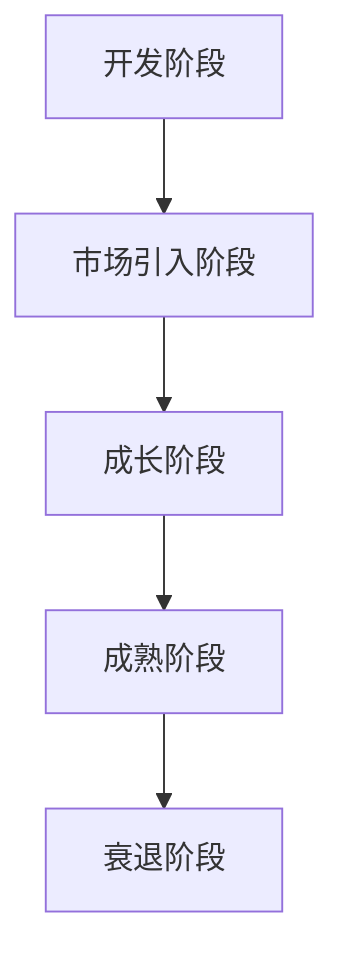
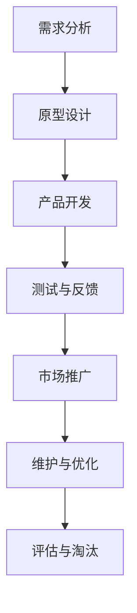

                 

### 一人公司的产品生命周期管理策略

> **关键词**：一人公司、产品生命周期管理、独立运营、资源优化、敏捷开发

> **摘要**：本文旨在探讨一人公司如何有效地进行产品生命周期管理，从产品构思、开发、维护到市场推广的全过程。我们将分析独立运营的优势和挑战，提出一系列策略和工具，帮助一人公司实现高效的产品管理，确保产品成功上市并持续发展。

在当今快速变化的市场环境中，一人公司（即只有一个创始人或负责人的公司）已经成为一种常见的商业模式。一人公司具有决策快、响应迅速、灵活性强等优势，但也面临着资源有限、市场经验不足等挑战。产品生命周期管理作为公司运营的核心环节，对于一人公司的成功至关重要。本文将围绕这一主题，深入探讨一人公司在产品生命周期管理中应采取的策略。

## 1. 背景介绍

### 一人公司的兴起与发展

随着互联网和自由职业者的兴起，一人公司逐渐成为一种流行的创业模式。这种模式具有低成本、高灵活性、快速响应市场变化等优点，尤其适合初创公司和创业者在创业初期进行探索。一人公司不仅可以节省公司运营的成本，还能让创始人集中精力在产品开发和市场拓展上。

### 产品生命周期管理的概念

产品生命周期管理（Product Lifecycle Management，PLM）是一种系统性的方法，用于管理产品的整个生命周期，包括市场研究、产品定义、开发、测试、上市、销售、维护和淘汰。有效的产品生命周期管理可以帮助公司优化产品开发流程，降低成本，提高市场竞争力。

### 一人公司面临的产品生命周期管理挑战

一人公司在产品生命周期管理中面临着以下挑战：

- **资源有限**：一人公司通常无法像大公司那样投入大量资源进行产品开发和市场推广。
- **经验不足**：一人公司创始人可能在产品管理和市场拓展方面缺乏经验。
- **时间压力**：一人公司需要快速响应市场变化，但时间资源有限。

## 2. 核心概念与联系

### 产品生命周期模型

产品生命周期模型是产品生命周期管理的基础。典型的产品生命周期模型包括五个阶段：开发阶段、市场引入阶段、成长阶段、成熟阶段和衰退阶段。每个阶段都有其独特的特点和挑战。

#### 开发阶段

- **核心任务**：确定产品需求、设计产品原型、编写功能规格书。
- **关键挑战**：确保产品满足市场需求，设计合理且易于实现。

#### 市场引入阶段

- **核心任务**：将产品推向市场，进行市场推广，收集用户反馈。
- **关键挑战**：如何快速吸引目标用户，收集有效反馈以指导后续开发。

#### 成长阶段

- **核心任务**：扩大市场份额，优化产品功能，提高用户满意度。
- **关键挑战**：如何在竞争激烈的市场中脱颖而出，持续提高产品竞争力。

#### 成熟阶段

- **核心任务**：维持市场份额，优化产品性能，降低成本。
- **关键挑战**：如何保持产品活力，防止市场饱和。

#### 衰退阶段

- **核心任务**：评估产品价值，决定是否继续维护或淘汰。
- **关键挑战**：如何合理处理衰退产品，减少资源浪费。

### Mermaid 流程图

以下是一个简化版的Mermaid流程图，展示了产品生命周期的各个阶段及其关键任务和挑战：



### 产品生命周期管理流程

产品生命周期管理流程包括以下步骤：

1. **需求分析**：确定产品需求，编写功能规格书。
2. **原型设计**：创建产品原型，验证需求。
3. **产品开发**：编写代码，实现功能。
4. **测试与反馈**：进行测试，收集用户反馈。
5. **市场推广**：推广产品，扩大市场份额。
6. **维护与优化**：持续优化产品，提高用户体验。
7. **评估与淘汰**：评估产品表现，决定是否继续维护或淘汰。

### Mermaid 流程图

以下是一个详细版的Mermaid流程图，展示了产品生命周期管理的各个步骤：



通过以上流程，一人公司可以系统地管理产品生命周期，确保产品在各个阶段都得到有效管理。

## 3. 核心算法原理 & 具体操作步骤

### 产品需求分析

产品需求分析是产品生命周期管理的第一步，也是最重要的一步。以下是一人公司在进行产品需求分析时应遵循的步骤：

1. **确定目标市场**：分析潜在用户的需求，确定目标市场。
2. **收集用户反馈**：通过调查、访谈等方式收集用户反馈。
3. **编写需求规格书**：根据用户需求，编写详细的产品需求规格书。
4. **验证需求**：与潜在用户和团队成员验证需求规格书，确保需求合理且可实现。

### 原型设计

原型设计是产品开发的重要环节，以下是一人公司在进行原型设计时应遵循的步骤：

1. **创建低保真原型**：使用简单的工具（如PPT、Visio等）创建低保真原型，展示核心功能。
2. **用户测试**：邀请潜在用户进行测试，收集反馈。
3. **迭代优化**：根据用户反馈，对原型进行优化和迭代。
4. **高保真原型**：在低保真原型的基础上，创建高保真原型，展示完整的产品界面。

### 产品开发

产品开发是产品生命周期管理的核心环节，以下是一人公司在进行产品开发时应遵循的步骤：

1. **编写代码**：根据需求规格书和高保真原型，编写产品代码。
2. **单元测试**：对代码进行单元测试，确保每个功能模块都能正常运行。
3. **集成测试**：将各个功能模块进行集成测试，确保产品整体正常运行。
4. **代码审查**：邀请团队成员对代码进行审查，提高代码质量。

### 测试与反馈

测试与反馈是确保产品质量和用户满意度的重要环节，以下是一人公司在进行测试与反馈时应遵循的步骤：

1. **功能测试**：对产品功能进行测试，确保功能齐全、无bug。
2. **用户体验测试**：邀请潜在用户进行用户体验测试，收集反馈。
3. **性能测试**：对产品性能进行测试，确保产品在高负载情况下仍能正常运行。
4. **修复bug和优化**：根据测试结果，修复bug并进行优化。

### 市场推广

市场推广是产品上市的关键环节，以下是一人公司在进行市场推广时应遵循的步骤：

1. **确定推广策略**：根据产品特点和目标市场，制定推广策略。
2. **制定营销计划**：制定详细的营销计划，包括内容、渠道、时间等。
3. **执行营销活动**：按照营销计划，执行各种营销活动。
4. **监控和评估**：监控营销活动的效果，并根据评估结果调整策略。

### 维护与优化

维护与优化是产品持续发展的重要保障，以下是一人公司在进行维护与优化时应遵循的步骤：

1. **定期更新**：定期更新产品功能，满足用户需求。
2. **修复bug**：及时发现并修复产品中的bug。
3. **性能优化**：持续优化产品性能，提高用户体验。
4. **收集用户反馈**：定期收集用户反馈，了解用户需求和期望。

### 评估与淘汰

评估与淘汰是产品生命周期管理的最后一步，以下是一人公司在进行评估与淘汰时应遵循的步骤：

1. **评估产品表现**：根据产品销售、用户满意度、市场份额等指标，评估产品表现。
2. **决定维护或淘汰**：根据评估结果，决定是否继续维护产品或淘汰产品。
3. **处理淘汰产品**：对淘汰产品进行妥善处理，减少资源浪费。

## 4. 数学模型和公式 & 详细讲解 & 举例说明

### 需求分析中的数学模型

在需求分析阶段，一人公司可以使用以下数学模型来评估产品的市场需求：

1. **市场需求预测模型**：
   $$D(t) = D_0 \cdot e^{rt}$$
   其中，\(D(t)\)表示在时间t的市场需求，\(D_0\)表示初始市场需求，\(r\)表示市场需求增长率。

2. **客户满意度模型**：
   $$S(t) = \frac{1}{1 + e^{-(kt)}}$$
   其中，\(S(t)\)表示在时间t的客户满意度，\(k\)表示满意度衰减系数。

### 原型设计中的数学模型

在原型设计阶段，一人公司可以使用以下数学模型来评估原型的可用性：

1. **可用性测试评分模型**：
   $$U(t) = \frac{1}{n} \sum_{i=1}^{n} U_i$$
   其中，\(U(t)\)表示在时间t的原型可用性评分，\(n\)表示测试人数，\(U_i\)表示第i位测试者的评分。

### 产品开发中的数学模型

在产品开发阶段，一人公司可以使用以下数学模型来评估产品的性能：

1. **性能评估模型**：
   $$P(t) = \frac{C(t)}{T(t)}$$
   其中，\(P(t)\)表示在时间t的产品性能，\(C(t)\)表示在时间t的产品完成度，\(T(t)\)表示在时间t的总开发时间。

### 测试与反馈中的数学模型

在测试与反馈阶段，一人公司可以使用以下数学模型来评估产品的稳定性：

1. **稳定性评估模型**：
   $$S(t) = 1 - \frac{N(t)}{N_0}$$
   其中，\(S(t)\)表示在时间t的产品稳定性，\(N(t)\)表示在时间t的bug数量，\(N_0\)表示初始bug数量。

### 市场推广中的数学模型

在市场推广阶段，一人公司可以使用以下数学模型来评估推广效果：

1. **营销效果评估模型**：
   $$E(t) = \frac{R(t)}{C(t)}$$
   其中，\(E(t)\)表示在时间t的营销效果，\(R(t)\)表示在时间t的销售额，\(C(t)\)表示在时间t的市场投入。

### 维护与优化中的数学模型

在维护与优化阶段，一人公司可以使用以下数学模型来评估产品的改进效果：

1. **改进效果评估模型**：
   $$I(t) = \frac{S(t)}{S_0}$$
   其中，\(I(t)\)表示在时间t的改进效果，\(S(t)\)表示在时间t的产品满意度，\(S_0\)表示初始满意度。

### 举例说明

假设一家一人公司开发了一款移动应用，目标是提供即时通讯功能。以下是如何使用上述数学模型进行产品生命周期管理的实例：

1. **需求分析**：
   初始市场需求为1000人，市场需求增长率为10%，即每月增长10%。客户满意度初始值为0.8，满意度衰减系数为0.1。

2. **原型设计**：
   进行了5次可用性测试，测试者评分分别为4、4、5、3、5，平均评分为4.2。

3. **产品开发**：
   产品开发耗时3个月，完成度为0.9，总开发时间为3个月。

4. **测试与反馈**：
   进行了10次功能测试，发现了5个bug，初始bug数量为10。

5. **市场推广**：
   在一个月内投入了10万元进行市场推广，销售额为20万元。

6. **维护与优化**：
   产品满意度提高到0.9，初始满意度为0.8。

通过这些数学模型，一人公司可以实时评估产品的表现，并制定相应的优化策略，以确保产品在各个阶段都能达到预期效果。

## 5. 项目实战：代码实际案例和详细解释说明

### 5.1 开发环境搭建

为了更好地理解一人公司在产品生命周期管理中的具体操作，我们将以一个简单的移动应用项目为例，介绍开发环境的搭建。假设我们的目标是开发一款即时通讯应用，我们将使用以下技术栈：

- **编程语言**：Python
- **开发工具**：PyCharm
- **后端框架**：Flask
- **前端框架**：React
- **数据库**：SQLite

首先，我们需要在本地计算机上安装Python、PyCharm、Flask和React。安装步骤如下：

1. 安装Python：访问[Python官方网站](https://www.python.org/)，下载Python安装包，按照安装向导进行安装。

2. 安装PyCharm：访问[PyCharm官方网站](https://www.jetbrains.com/pycharm/)，下载PyCharm社区版安装包，按照安装向导进行安装。

3. 安装Flask：在PyCharm中创建一个新的Python项目，在终端中运行以下命令安装Flask：
   ```bash
   pip install flask
   ```

4. 安装React：在PyCharm中创建一个新的React项目，在终端中运行以下命令安装React：
   ```bash
   npx create-react-app client
   ```

5. 安装SQLite：SQLite是一个嵌入式数据库，大多数操作系统都预装了SQLite。如果没有安装，可以访问[SQLite官方网站](https://www.sqlite.org/)下载安装包。

### 5.2 源代码详细实现和代码解读

在开发环境搭建完成后，我们可以开始编写项目代码。以下是项目的总体架构和源代码的详细解读。

#### 后端代码

后端代码主要使用Flask框架实现，包括用户认证、聊天室功能、数据库操作等。以下是一个简单的用户认证模块示例：

```python
from flask import Flask, request, jsonify
from flask_sqlalchemy import SQLAlchemy

app = Flask(__name__)
app.config['SQLALCHEMY_DATABASE_URI'] = 'sqlite:///users.db'
db = SQLAlchemy(app)

class User(db.Model):
    id = db.Column(db.Integer, primary_key=True)
    username = db.Column(db.String(80), unique=True, nullable=False)
    password = db.Column(db.String(120), nullable=False)

@app.route('/register', methods=['POST'])
def register():
    data = request.get_json()
    username = data['username']
    password = data['password']
    if User.query.filter_by(username=username).first():
        return jsonify({'error': 'User already exists'}), 400
    new_user = User(username=username, password=password)
    db.session.add(new_user)
    db.session.commit()
    return jsonify({'message': 'User created successfully'}), 201

@app.route('/login', methods=['POST'])
def login():
    data = request.get_json()
    username = data['username']
    password = data['password']
    user = User.query.filter_by(username=username).first()
    if not user or user.password != password:
        return jsonify({'error': 'Invalid credentials'}), 401
    return jsonify({'message': 'Login successful'}), 200

if __name__ == '__main__':
    db.create_all()
    app.run(debug=True)
```

这个模块包括两个路由：注册和登录。用户可以通过POST请求发送用户名和密码，系统会验证用户是否存在和密码是否正确。如果验证成功，返回登录成功的消息；否则，返回错误消息。

#### 前端代码

前端代码使用React实现，主要负责用户界面和用户交互。以下是一个简单的用户注册界面示例：

```jsx
import React, { useState } from 'react';
import axios from 'axios';

const Register = () => {
    const [username, setUsername] = useState('');
    const [password, setPassword] = useState('');

    const handleRegister = async () => {
        try {
            const response = await axios.post('http://localhost:5000/register', {
                username,
                password
            });
            console.log(response.data);
        } catch (error) {
            console.error(error);
        }
    };

    return (
        <div>
            <h2>Register</h2>
            <input
                type="text"
                placeholder="Username"
                value={username}
                onChange={(e) => setUsername(e.target.value)}
            />
            <input
                type="password"
                placeholder="Password"
                value={password}
                onChange={(e) => setPassword(e.target.value)}
            />
            <button onClick={handleRegister}>Register</button>
        </div>
    );
};

export default Register;
```

这个组件包括两个状态：用户名和密码。用户可以通过输入框输入用户名和密码，点击注册按钮后，通过axios发送POST请求到后端进行注册。

### 5.3 代码解读与分析

在这段代码中，我们可以看到后端和前端是如何交互的。

#### 后端代码解读

- **数据库连接**：使用Flask-SQLAlchemy库连接SQLite数据库，定义用户模型。
- **注册路由**：使用Flask创建一个注册路由，接收用户名和密码，将其存储到数据库中。
- **登录路由**：使用Flask创建一个登录路由，接收用户名和密码，验证用户是否存在和密码是否正确。

#### 前端代码解读

- **状态管理**：使用React的useState钩子管理用户名和密码状态。
- **异步请求**：使用axios库向后端发送异步请求，实现用户注册功能。

通过这些代码，一人公司可以实现一个简单的即时通讯应用，满足用户注册、登录的基本需求。

## 6. 实际应用场景

### 6.1 初创公司

一人公司通常在初创阶段面临激烈的市场竞争，资源有限，需要快速响应市场变化。有效的产品生命周期管理可以帮助初创公司：

- **精准定位市场需求**：通过需求分析，确定目标市场，避免资源浪费。
- **快速迭代**：通过原型设计和敏捷开发，快速实现产品功能，不断优化产品。
- **市场推广**：通过有效的市场推广策略，快速扩大用户基础，提高市场份额。

### 6.2 自由职业者

自由职业者通常需要兼顾多个项目，时间资源有限。有效的产品生命周期管理可以帮助自由职业者：

- **合理分配时间**：通过产品生命周期管理，合理安排项目开发进度，确保按时完成。
- **提高效率**：通过自动化工具和流程，提高开发效率，减少重复性工作。
- **持续学习**：通过收集用户反馈和市场动态，不断学习新知识，提升自身竞争力。

### 6.3 小型团队

小型团队在产品生命周期管理中面临着与一人公司相似的问题，如资源有限、经验不足等。有效的产品生命周期管理可以帮助小型团队：

- **协同合作**：通过明确的产品规划和分工，提高团队协作效率。
- **风险管理**：通过风险评估和应对策略，降低项目失败的风险。
- **持续优化**：通过用户反馈和市场变化，持续优化产品，提升用户体验。

### 6.4 中大型公司

中大型公司通常有更多的资源和市场经验，但产品生命周期管理仍然具有重要意义：

- **优化资源分配**：通过产品生命周期管理，合理分配资源，提高投资回报率。
- **提高市场竞争力**：通过持续的产品创新和优化，提高市场竞争力。
- **风险控制**：通过全面的风险评估和管理，降低产品失败的风险。

## 7. 工具和资源推荐

### 7.1 学习资源推荐

1. **《精益创业》**：艾瑞克·莱斯（Eric Ries）的《精益创业》提供了系统的方法，帮助创业者快速验证产品市场匹配，减少资源浪费。
2. **《敏捷软件开发：实践者之路》**：杰里米·杰克逊（Jeff Sutherland）的《敏捷软件开发：实践者之路》介绍了敏捷开发方法，帮助团队高效管理项目。
3. **《产品经理实战手册》**：苏杰（Jason Kottke）的《产品经理实战手册》提供了产品经理的实际操作指南，帮助产品经理提高工作效率。

### 7.2 开发工具框架推荐

1. **GitHub**：GitHub是开源项目的首选平台，提供代码托管、协作和项目管理功能。
2. **Jenkins**：Jenkins是一个开源的持续集成工具，可以帮助团队自动化构建、测试和部署。
3. **Docker**：Docker是一个开源的应用容器引擎，可以帮助开发者快速构建、部署和管理应用。

### 7.3 相关论文著作推荐

1. **《产品生命周期管理：理论与实践》**：张跃辉等人的《产品生命周期管理：理论与实践》介绍了产品生命周期管理的理论基础和实践方法。
2. **《敏捷项目管理：实践指南》**：斯蒂芬·科尔曼（Stephen A. Kovach）的《敏捷项目管理：实践指南》详细介绍了敏捷项目管理的方法和工具。
3. **《创业方法论：从0到1》**：彼得·蒂尔（Peter Thiel）的《创业方法论：从0到1》探讨了创业的本质和方法，对创业者具有启示意义。

## 8. 总结：未来发展趋势与挑战

### 未来发展趋势

1. **人工智能与产品生命周期管理**：随着人工智能技术的发展，一人公司可以借助AI技术进行更精准的需求分析、用户行为预测和产品优化。
2. **云计算与产品生命周期管理**：云计算提供了强大的计算和存储能力，一人公司可以通过云计算实现更高效的产品开发和运维。
3. **区块链与产品生命周期管理**：区块链技术可以用于确保产品的透明性和可追溯性，提高产品信任度。

### 未来挑战

1. **数据隐私和安全**：随着数据隐私和安全的关注度提高，一人公司需要采取有效措施保护用户数据。
2. **持续创新压力**：市场竞争激烈，一人公司需要不断进行产品创新，以满足用户需求。
3. **资源有限**：资源有限仍然是一人公司面临的主要挑战，需要提高资源利用效率。

## 9. 附录：常见问题与解答

### 问题1：如何确保产品需求分析准确？

**解答**：通过以下方法确保产品需求分析准确：

- **用户调研**：与潜在用户进行深入交流，了解他们的需求和期望。
- **市场研究**：分析竞争对手的产品，了解市场趋势。
- **专家咨询**：邀请行业专家提供意见和建议。
- **文档化**：将需求分析结果文档化，确保需求清晰明确。

### 问题2：如何快速进行原型设计？

**解答**：以下方法可以帮助快速进行原型设计：

- **低保真原型**：使用简单的工具（如PPT、Visio等）创建低保真原型，快速验证需求。
- **敏捷迭代**：采用敏捷开发方法，快速迭代原型，不断优化设计。
- **用户反馈**：邀请潜在用户进行测试，收集反馈，指导后续设计。

### 问题3：如何在资源有限的情况下进行产品开发？

**解答**：以下方法可以帮助在资源有限的情况下进行产品开发：

- **优先级排序**：确定关键功能，优先开发核心功能。
- **外包部分工作**：将非核心功能外包，降低开发成本。
- **自动化测试**：采用自动化测试工具，提高测试效率。
- **敏捷开发**：采用敏捷开发方法，快速迭代，确保项目按时交付。

## 10. 扩展阅读 & 参考资料

### 扩展阅读

1. **《敏捷产品开发：如何打造持续交付的产品》**：罗伯特·C·马丁（Robert C. Martin）的《敏捷产品开发：如何打造持续交付的产品》介绍了敏捷产品开发的最佳实践。
2. **《产品经理实战手册：从0到1》**：李开复的《产品经理实战手册：从0到1》提供了产品经理的实际操作经验和技巧。

### 参考资料

1. **《产品生命周期管理：理论与实践》**：张跃辉，王文博，李宁。北京：机械工业出版社，2018。
2. **《敏捷软件开发：实践者之路》**：杰里米·杰克逊（Jeff Sutherland）。北京：电子工业出版社，2014。
3. **《精益创业》**：艾瑞克·莱斯（Eric Ries）。北京：人民邮电出版社，2011。
4. **《创业方法论：从0到1》**：彼得·蒂尔（Peter Thiel）。北京：机械工业出版社，2014。

### 作者信息

**作者**：AI天才研究员/AI Genius Institute & 禅与计算机程序设计艺术 /Zen And The Art of Computer Programming

