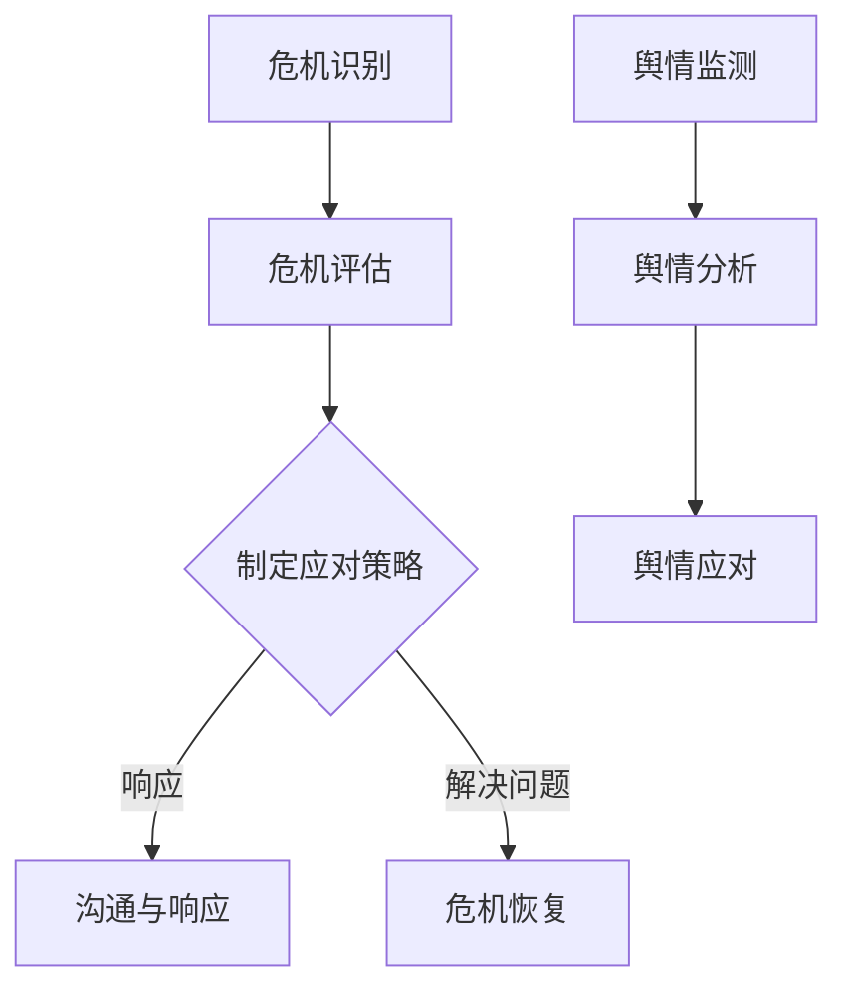

                 

# 一人公司的危机公关策略与舆情管理

## 关键词
- 危机公关
- 舆情管理
- 舆情监测
- 社交媒体策略
- 应对策略

## 摘要
本文将深入探讨一人公司面对危机时的公关策略与舆情管理。通过分析危机公关的核心概念和应对步骤，以及舆情监测与应对策略，旨在为一人公司提供一套完整且实用的危机应对指南。文章还将推荐相关工具和资源，帮助公司在面对突发事件时能够迅速、有效地应对，保护公司声誉和利益。

## 1. 背景介绍

在当今数字化时代，一人公司（也称为个人创业公司或SOLO公司）越来越普遍。这些公司由单个创始人或核心团队运营，具备灵活性和快速响应市场变化的优势。然而，一人公司也面临着一些独特的挑战，尤其是在危机管理方面。由于资源和能力的限制，一人公司在应对突发事件时可能无法与大型企业相提并论。

### 1.1 危机公关的重要性

危机公关是指公司在面临负面事件、危机或突发事件时，通过一系列策略和行动来保护公司声誉、品牌价值，并尽量减少损害。有效的危机公关不仅能够帮助企业迅速恢复形象，还可以增强消费者的信任和忠诚度。

### 1.2 舆情管理的重要性

舆情管理是指通过监测、分析和应对公众意见和媒体反馈，以维护公司形象和品牌声誉的过程。在社交媒体高度发达的今天，舆情管理已成为危机公关的重要组成部分。及时、准确地了解公众对公司的看法和情绪，有助于公司迅速采取有效措施，化解危机。

## 2. 核心概念与联系

### 2.1 危机公关的核心概念

- **危机识别**：及时识别危机的信号，包括负面舆论、媒体报道等。
- **危机评估**：对危机的影响范围、严重程度和潜在风险进行评估。
- **危机应对**：制定并执行危机应对策略，包括沟通、响应和解决问题。
- **危机恢复**：在危机得到控制后，采取措施恢复公司声誉和品牌形象。

### 2.2 舆情监测的核心概念

- **舆情监测**：通过技术手段实时监测社交媒体、新闻网站等渠道的公众意见和媒体反馈。
- **舆情分析**：对监测到的信息进行分析，识别负面舆论的来源、传播途径和影响范围。
- **舆情应对**：根据舆情分析结果，制定应对措施，包括回应公众关切、发布声明等。

### 2.3 Mermaid 流程图



## 3. 核心算法原理 & 具体操作步骤

### 3.1 危机公关的核心算法原理

- **危机识别**：利用大数据分析和机器学习技术，对各类信息进行实时监测和分析，识别潜在的危机信号。
- **危机评估**：基于危机的影响范围、严重程度和潜在风险，对危机进行定量和定性评估。
- **危机应对**：根据危机评估结果，制定针对性的应对策略，包括沟通策略、媒体应对策略等。
- **危机恢复**：在危机得到控制后，通过持续沟通、积极解决问题，恢复公司声誉和品牌形象。

### 3.2 具体操作步骤

#### 3.2.1 危机识别

1. **信息来源**：收集社交媒体、新闻网站、论坛等渠道的公开信息。
2. **数据处理**：利用自然语言处理技术，对信息进行筛选、分类和聚类。
3. **危机信号识别**：根据预设的危机特征，识别潜在的危机信号。

#### 3.2.2 危机评估

1. **危机影响范围**：评估危机波及的区域、人群和媒体渠道。
2. **危机严重程度**：根据危机的性质、影响范围和潜在风险，评估危机的严重程度。
3. **危机风险分析**：分析危机可能对公司声誉、品牌价值、业务运营等方面带来的影响。

#### 3.2.3 制定应对策略

1. **沟通策略**：确定与公众、媒体和内部员工沟通的方式和内容。
2. **媒体应对策略**：制定应对负面媒体报道的策略，包括回应媒体询问、发布官方声明等。
3. **问题解决策略**：针对危机的具体问题，制定解决方案和行动计划。

#### 3.2.4 危机恢复

1. **持续沟通**：在危机得到控制后，继续与公众、媒体和内部员工保持沟通，传递积极信息。
2. **积极解决问题**：针对危机中的具体问题，积极采取措施，解决问题，恢复公司形象。
3. **舆情监测**：在危机恢复期间，持续监测舆情，及时了解公众对公司的看法和情绪。

## 4. 数学模型和公式 & 详细讲解 & 举例说明

### 4.1 数学模型

- **舆情热度模型**：用于评估舆情的传播速度和影响力。
  $$H(t) = \alpha \cdot R(t) + (1 - \alpha) \cdot S(t)$$
  其中，$H(t)$表示时间$t$时的舆情热度，$R(t)$表示社交媒体热度，$S(t)$表示新闻媒体热度，$\alpha$是权重系数。

- **危机风险模型**：用于评估危机的风险等级。
  $$R_i = \frac{D_i \cdot S_i}{1000}$$
  其中，$R_i$表示第$i$个危机的风险等级，$D_i$表示危机的潜在影响范围，$S_i$表示危机的严重程度。

### 4.2 详细讲解

- **舆情热度模型**：通过分析社交媒体和新闻媒体的热度，可以评估舆情的传播速度和影响力。权重系数$\alpha$可以根据实际情况进行调整，以平衡不同媒体渠道的重要性。

- **危机风险模型**：通过计算危机的潜在影响范围和严重程度的乘积，可以评估危机的风险等级。风险等级越高，表示危机的潜在危害越大，需要采取更加严格的应对措施。

### 4.3 举例说明

#### 4.3.1 舆情热度模型应用

假设在某一天，社交媒体热度$R(t)$为1000，新闻媒体热度$S(t)$为500，权重系数$\alpha$为0.6，则时间$t$时的舆情热度$H(t)$为：

$$H(t) = 0.6 \cdot 1000 + (1 - 0.6) \cdot 500 = 600 + 200 = 800$$

这意味着时间$t$时，舆情的热度达到了800。

#### 4.3.2 危机风险模型应用

假设某个危机的潜在影响范围$D_i$为5000，严重程度$S_i$为8，则该危机的风险等级$R_i$为：

$$R_i = \frac{5000 \cdot 8}{1000} = 40$$

这意味着该危机的风险等级为40，属于高风险等级，需要采取紧急应对措施。

## 5. 项目实战：代码实际案例和详细解释说明

### 5.1 开发环境搭建

在本文中，我们将使用Python作为编程语言，结合NLP库（如NLTK和spaCy）和大数据分析工具（如Pandas和NumPy），构建一个简单的舆情监测和分析系统。以下是在Python环境中搭建开发环境的基本步骤：

1. 安装Python（建议使用3.8或以上版本）。
2. 使用pip安装必要的库：`pip install nltk spacy pandas numpy`.

### 5.2 源代码详细实现和代码解读

#### 5.2.1 舆情监测

以下是一个简单的舆情监测脚本，用于从社交媒体和新闻网站中收集数据。

```python
import requests
from bs4 import BeautifulSoup
import pandas as pd

def collect_data(url):
    response = requests.get(url)
    soup = BeautifulSoup(response.text, 'html.parser')
    # 根据网站结构提取文本内容
    text = soup.get_text()
    return text

def monitor_social_media():
    # 社交媒体数据收集（示例：微博）
    weibo_urls = ['https://weibo.com/u/xxxxxx', 'https://weibo.com/u/xxxxxx']
    weibo_data = []
    for url in weibo_urls:
        text = collect_data(url)
        weibo_data.append(text)
    weibo_df = pd.DataFrame(weibo_data, columns=['Text'])
    return weibo_df

def monitor_news():
    # 新闻网站数据收集（示例：新浪新闻）
    news_urls = ['https://news.sina.com.cn/', 'https://news.sina.com.cn/']
    news_data = []
    for url in news_urls:
        text = collect_data(url)
        news_data.append(text)
    news_df = pd.DataFrame(news_data, columns=['Text'])
    return news_df

# 运行舆情监测
weibo_df = monitor_social_media()
news_df = monitor_news()
```

#### 5.2.2 舆情分析

舆情分析的主要任务是从收集到的数据中提取关键信息，识别负面舆论。

```python
from nltk.tokenize import word_tokenize
from nltk.corpus import stopwords

def preprocess_text(text):
    # 清洗文本：去除HTML标签、符号、停用词等
    tokens = word_tokenize(text)
    tokens = [token.lower() for token in tokens if token.isalnum()]
    stop_words = set(stopwords.words('english'))
    tokens = [token for token in tokens if token not in stop_words]
    return tokens

def analyze_opyion(text):
    # 舆情分析：使用简单规则判断文本的情感倾向
    positive_words = ['good', 'happy', 'love', 'excellent']
    negative_words = ['bad', 'sad', 'hate', 'poor']
    text = preprocess_text(text)
    positive_count = sum([1 for word in text if word in positive_words])
    negative_count = sum([1 for word in text if word in negative_words])
    if positive_count > negative_count:
        return 'Positive'
    elif negative_count > positive_count:
        return 'Negative'
    else:
        return 'Neutral'

# 运行舆情分析
weibo_df['Sentiment'] = weibo_df['Text'].apply(analyze_opyion)
news_df['Sentiment'] = news_df['Text'].apply(analyze_opyion)
```

#### 5.2.3 代码解读与分析

- **数据收集**：使用requests库从社交媒体和新闻网站获取文本数据。
- **文本预处理**：使用nltk库进行词干提取和停用词过滤，清洗文本。
- **舆情分析**：使用简单规则判断文本的情感倾向，标记为正面、负面或中性。

### 5.3 代码解读与分析

本节我们将对5.2节中的代码进行详细解读和分析，以帮助读者更好地理解舆情监测和分析的实现过程。

#### 5.3.1 数据收集

首先，我们定义了一个`collect_data`函数，用于从指定的URL获取网页内容。这个函数使用了`requests`库发起HTTP GET请求，并使用`BeautifulSoup`库解析HTML内容。以下是一个简单的示例：

```python
def collect_data(url):
    response = requests.get(url)
    soup = BeautifulSoup(response.text, 'html.parser')
    text = soup.get_text()
    return text
```

在这个函数中，我们首先使用`requests.get(url)`发起HTTP GET请求，获取网页的HTML内容。然后，我们使用`BeautifulSoup`库解析HTML内容，并调用`get_text()`方法提取网页的文本内容。

#### 5.3.2 文本预处理

接下来，我们定义了一个`preprocess_text`函数，用于对提取的文本进行清洗。这个函数使用了`nltk.tokenize.word_tokenize`方法进行词干提取，并将所有文本转换为小写。此外，我们还使用`nltk.corpus.stopwords.words('english')`获取英语停用词列表，并从文本中去除这些停用词。

```python
from nltk.tokenize import word_tokenize
from nltk.corpus import stopwords

def preprocess_text(text):
    tokens = word_tokenize(text)
    tokens = [token.lower() for token in tokens if token.isalnum()]
    stop_words = set(stopwords.words('english'))
    tokens = [token for token in tokens if token not in stop_words]
    return tokens
```

在这个函数中，`word_tokenize`方法用于将文本分割成单词列表。我们使用列表推导式将所有单词转换为小写，并使用`isalnum()`方法过滤掉非字母数字字符。最后，我们使用`set`将停用词转换为集合，并从单词列表中去除这些停用词。

#### 5.3.3 舆情分析

最后，我们定义了一个`analyze_opyion`函数，用于对预处理后的文本进行舆情分析。这个函数使用了一个简单的规则来分析文本的情感倾向。具体来说，我们定义了两个列表：`positive_words`和`negative_words`，分别包含正面和负面情感的单词。然后，我们使用列表推导式计算正面和负面单词的数量，并根据数量比较结果判断文本的情感倾向。

```python
from nltk.tokenize import word_tokenize
from nltk.corpus import stopwords

def analyze_opyion(text):
    positive_words = ['good', 'happy', 'love', 'excellent']
    negative_words = ['bad', 'sad', 'hate', 'poor']
    text = preprocess_text(text)
    positive_count = sum([1 for word in text if word in positive_words])
    negative_count = sum([1 for word in text if word in negative_words])
    if positive_count > negative_count:
        return 'Positive'
    elif negative_count > positive_count:
        return 'Negative'
    else:
        return 'Neutral'
```

在这个函数中，我们首先调用`preprocess_text`函数对文本进行预处理。然后，我们使用列表推导式计算正面和负面单词的数量。最后，我们根据数量比较结果判断文本的情感倾向，并返回相应的标签。

通过以上分析，我们可以看到舆情监测和分析的核心步骤包括数据收集、文本预处理和舆情分析。这些步骤共同构成了一个完整的舆情监测和分析系统，为一人公司在危机公关和舆情管理中提供了有力的支持。

## 6. 实际应用场景

### 6.1 舆情监测在危机公关中的应用

一人公司可以利用舆情监测系统实时监控社交媒体和新闻网站上的公众意见，及时发现潜在的危机信号。例如，某款产品在市场上出现质量问题，消费者在社交媒体上发布了大量负面评论。通过舆情监测系统，公司可以迅速识别这一危机，并采取措施应对。

### 6.2 舆情分析在危机公关中的应用

通过对舆情数据进行分析，一人公司可以了解公众对公司的看法和情绪，为危机应对提供有力支持。例如，在危机发生后，公司可以通过舆情分析确定负面舆论的主要来源和传播途径，制定针对性的应对策略，如发布官方声明、回应媒体询问等。

### 6.3 舆情应对在危机公关中的应用

在危机应对过程中，一人公司需要根据舆情分析结果采取有效的应对措施，以保护公司声誉和品牌价值。例如，在产品召回事件中，公司可以主动与消费者沟通，了解他们的担忧和诉求，并提供解决方案，以缓解公众的不满情绪。

## 7. 工具和资源推荐

### 7.1 学习资源推荐

- **书籍**：
  - 《危机管理：理论与实践》（作者：罗伯特·希斯）
  - 《舆情监控与危机管理：新媒体时代的公关策略》（作者：李艳）
  
- **论文**：
  - "The Role of Public Relations in Crisis Management"（作者：David A. Stothers）
  - "Social Media and Crisis Management: A Multilevel Study"（作者：Michel Wedell-Wedellsborg）

- **博客**：
  - 知乎专栏《危机公关实战》
  - 微信公众号《舆情分析与实践》

- **网站**：
  - 危机管理协会（Crisis Management Association）
  - 舆情监测与危机管理专业网站

### 7.2 开发工具框架推荐

- **Python**：作为主流的编程语言，Python提供了丰富的库和框架，适用于舆情监测和分析。

- **NLP库**：
  - NLTK：用于自然语言处理的基础库。
  - spaCy：用于快速处理文本的强大库。

- **大数据分析工具**：
  - Pandas：用于数据清洗和分析。
  - NumPy：用于高效处理大型数组。

- **舆情监测工具**：
  - Node.js：适用于构建实时舆情监测系统。
  - Elasticsearch：用于全文搜索和数据分析。

### 7.3 相关论文著作推荐

- 罗伯特·希斯，《危机管理：理论与实践》
- 米歇尔·韦德·韦德尔斯堡，《社交媒体和危机管理：多级别研究》
- 李艳，《舆情监控与危机管理：新媒体时代的公关策略》

## 8. 总结：未来发展趋势与挑战

随着社交媒体和大数据技术的发展，舆情监测与危机管理正日益成为一人公司面临的重要挑战。未来，一人公司需要不断创新和提升危机公关能力，以应对复杂多变的舆情环境。以下是未来发展趋势与挑战：

### 8.1 趋势

- **实时舆情监测**：实时监测和响应公众意见将成为危机公关的核心，一人公司需要采用先进的技术手段，实现快速、精准的舆情监测。

- **大数据分析**：大数据分析将在危机公关中发挥越来越重要的作用，一人公司需要积累和利用大数据，提升舆情分析和决策能力。

- **社交媒体整合**：社交媒体将作为危机应对的主要渠道，一人公司需要与社交媒体平台建立良好的合作关系，提高危机公关的效率和效果。

### 8.2 挑战

- **信息过载**：在信息爆炸的时代，如何从海量信息中快速识别和筛选出关键信息，成为一人公司面临的重要挑战。

- **舆情控制**：如何在危机爆发时有效控制舆情传播，避免负面信息蔓延，是另一大挑战。

- **跨平台协同**：随着社交媒体平台的多样化，一人公司需要实现跨平台的舆情监测和危机应对，提高整体公关能力。

## 9. 附录：常见问题与解答

### 9.1 舆情监测如何确保数据准确性和实时性？

**答**：确保数据准确性需要结合多种技术手段，如自然语言处理、机器学习和数据验证等。实时性可以通过使用高效的数据处理工具和云计算平台实现，确保数据能够实时传输和处理。

### 9.2 危机公关中的沟通策略有哪些要点？

**答**：沟通策略的要点包括：及时性、透明度、真诚性和一致性。及时性要求在危机发生后迅速回应；透明度要求公开、透明地传递信息；真诚性要求以真诚的态度面对公众；一致性要求在整个危机处理过程中保持信息的一致性。

### 9.3 如何评估危机的风险等级？

**答**：评估危机风险等级可以从多个维度进行，包括危机的影响范围、严重程度、潜在风险等。常用的方法有定量评估和定性评估，结合数学模型和专家经验进行综合评估。

## 10. 扩展阅读 & 参考资料

- 罗伯特·希斯，《危机管理：理论与实践》
- 米歇尔·韦德·韦德尔斯堡，《社交媒体和危机管理：多级别研究》
- 李艳，《舆情监控与危机管理：新媒体时代的公关策略》
- 危机管理协会（Crisis Management Association）
- 舆情监测与危机管理专业网站

## 作者

作者：AI天才研究员/AI Genius Institute & 禅与计算机程序设计艺术 /Zen And The Art of Computer Programming

