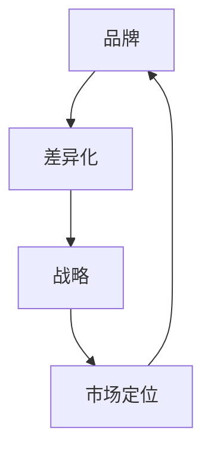
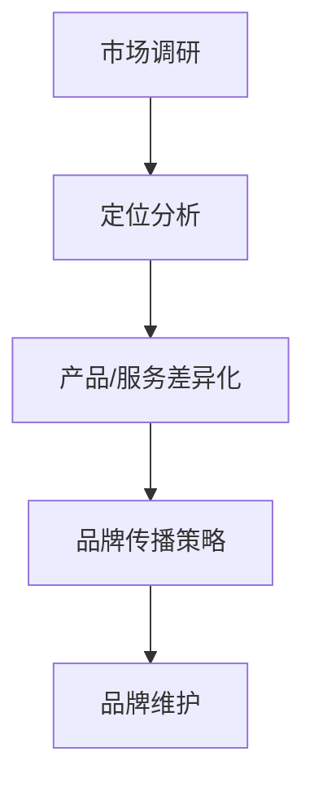

                 

### 一人公司的品牌差异化战略

#### 摘要

在当今竞争激烈的市场环境中，企业品牌差异化战略的制定与实施显得尤为重要，尤其是在一人公司这一特殊形态的企业中。本文将深入探讨一人公司的品牌差异化战略，通过明确核心概念与联系，剖析核心算法原理与操作步骤，介绍数学模型与公式，并结合实际项目案例进行详细解读。文章还将探讨品牌差异化在各个实际应用场景中的表现，推荐相关学习资源与工具，并总结未来发展趋势与挑战。通过本文的深入分析，旨在为一人公司提供有效的品牌差异化战略指导，以在市场中脱颖而出。

#### 背景介绍

一人公司，顾名思义，是指由单一个人创建并运营的企业。这种企业形态在近年来逐渐受到关注，尤其在自由职业者、创意工作者和科技创业者中广泛存在。一人公司具有灵活性强、决策效率高、运营成本低等优势，但也面临品牌建设难、市场竞争压力大、资源有限等挑战。

在当前市场环境下，品牌差异化战略对于任何企业来说都至关重要。差异化战略能够帮助企业区分自身与其他竞争者，建立独特的品牌形象，从而在激烈的市场竞争中占据一席之地。对于一人公司而言，品牌差异化不仅是生存的关键，更是发展的动力。因此，如何制定有效的品牌差异化战略，成为了众多一人公司亟需解决的问题。

本文旨在通过系统地探讨一人公司的品牌差异化战略，帮助一人公司明确品牌差异化的重要性，掌握核心概念与联系，理解核心算法原理与操作步骤，掌握数学模型与公式，并能够结合实际项目案例进行有效实施。希望通过本文的探讨，为一人公司提供有价值的指导，帮助其在市场中脱颖而出。

#### 核心概念与联系

在探讨一人公司的品牌差异化战略之前，我们需要明确几个核心概念，并理解它们之间的联系。这些核心概念包括品牌、差异化、战略、市场定位等。

**品牌**：品牌是企业或产品在市场中的独特标识，它代表了一种价值观念、情感联系和信任感。对于一人公司而言，品牌不仅仅是公司的名字或标志，更是个人形象和价值的体现。一个成功的品牌能够吸引目标客户，增加市场份额，提升品牌忠诚度。

**差异化**：差异化是指企业通过特定的产品特性、服务特点或品牌形象，将自己与竞争对手区分开来。在激烈的市场竞争中，差异化是品牌脱颖而出的关键。对于一人公司，差异化可以通过独特的创意、专业技能、服务质量或技术创新来实现。

**战略**：战略是企业为实现长期目标而制定的总体计划。品牌差异化战略是企业通过差异化手段来增强竞争力、实现市场份额增长的战略举措。对于一人公司，制定有效的品牌差异化战略能够明确发展方向，提升品牌形象，增强市场竞争力。

**市场定位**：市场定位是指企业根据目标市场的需求，确定自己的品牌形象和竞争优势，从而在消费者心中建立独特的位置。市场定位需要综合考虑目标客户、竞争对手和自身优势，以便更好地满足市场需求。对于一人公司，准确的市场定位能够帮助其找到目标客户，明确品牌差异化方向。

这几个核心概念之间的联系在于，品牌是差异化战略的载体，差异化战略是市场定位的体现，而市场定位则是品牌建设的出发点。一人公司需要通过明确品牌、差异化、战略和市场定位，构建起一个完整的品牌差异化战略框架，从而在市场中建立独特的竞争优势。

为了更好地理解这些概念，我们可以通过一个Mermaid流程图来展示它们之间的联系：



在这个流程图中，品牌是整个流程的起点和终点，它通过差异化手段实现战略目标，而市场定位则是差异化战略的具体体现。通过这样的流程图，一人公司可以更加清晰地理解品牌差异化战略的核心概念与联系，从而更好地制定和实施品牌战略。

#### 核心算法原理 & 具体操作步骤

一人公司的品牌差异化战略涉及多个关键环节，其中核心算法原理和具体操作步骤是关键所在。以下是品牌差异化战略的核心算法原理及其实施步骤：

**1. 市场调研：** 
市场调研是品牌差异化战略的第一步，通过深入分析市场环境、目标客户、竞争对手和行业趋势，了解市场需求的现状和变化。具体操作步骤包括：
- **数据收集**：收集与市场相关的各种数据，如市场规模、增长趋势、客户需求等。
- **数据分析**：利用数据分析工具对收集到的数据进行分析，识别市场机会和潜在风险。
- **竞争对手分析**：分析竞争对手的品牌定位、产品特性、市场策略等，找出自身差异化的切入点。

**2. 定位分析：**
定位分析是品牌差异化战略的核心，它帮助一人公司明确自身在市场中的独特位置。具体操作步骤包括：
- **目标市场确定**：根据市场调研结果，确定目标市场和目标客户群体。
- **定位确定**：分析目标市场的需求和竞争对手的定位，确定自身品牌的独特定位。
- **价值主张明确**：明确品牌的核心价值主张，即为何目标客户会选择你的品牌。

**3. 产品/服务差异化：**
产品/服务差异化是品牌差异化的具体体现，通过独特的特性或创新来区分自身与竞争对手。具体操作步骤包括：
- **产品特性分析**：分析现有产品或服务的特性，找出可以差异化创新的地方。
- **技术创新**：利用技术创新提升产品或服务的竞争力。
- **服务特色**：通过提升服务质量、增加服务特色来吸引客户。

**4. 品牌传播策略：**
品牌传播策略是品牌差异化战略的关键环节，通过多种传播渠道和方式，将品牌差异化信息传递给目标客户。具体操作步骤包括：
- **传播渠道选择**：根据目标市场和目标客户的特点，选择合适的传播渠道，如社交媒体、线下活动、广告等。
- **传播内容设计**：设计具有吸引力的传播内容，如广告语、宣传海报、社交媒体文案等。
- **传播效果评估**：对品牌传播效果进行持续监控和评估，根据反馈调整传播策略。

**5. 品牌维护：**
品牌维护是品牌差异化战略的长期任务，通过持续的品牌建设和客户关系管理，保持品牌差异化的领先地位。具体操作步骤包括：
- **品牌形象管理**：确保品牌形象的一致性和独特性。
- **客户关系管理**：通过优质的服务和互动，建立稳定的客户关系。
- **品牌监控**：定期监控品牌在市场中的表现，及时调整品牌策略。

通过以上核心算法原理和具体操作步骤，一人公司可以系统地制定和实施品牌差异化战略，从而在市场中脱颖而出。以下是品牌差异化战略的核心算法原理及具体操作步骤的Mermaid流程图：



在这个流程图中，市场调研、定位分析、产品/服务差异化、品牌传播策略和品牌维护是品牌差异化战略的核心步骤，它们相互关联，共同构成了一个完整的品牌差异化战略框架。

#### 数学模型和公式 & 详细讲解 & 举例说明

在品牌差异化战略的实施过程中，数学模型和公式可以用于量化分析，帮助我们更准确地评估品牌差异化效果和市场反应。以下是几个常用的数学模型和公式及其详细讲解和举例说明。

**1. 品牌知名度（Brand Awareness）**

品牌知名度是衡量品牌在市场中的认知度和影响力的重要指标。其计算公式如下：

\[ \text{品牌知名度} = \frac{\text{知道品牌的人数}}{\text{目标市场规模}} \times 100\% \]

**详细讲解**：品牌知名度反映了目标市场中了解品牌的人数占比。通过市场调研，我们可以获取知道品牌的人数和目标市场的整体规模，进而计算品牌知名度。

**举例说明**：假设一人公司的目标市场规模为100万人，通过市场调研得知有20万人知道该品牌，则品牌知名度为：

\[ \text{品牌知名度} = \frac{20万}{100万} \times 100\% = 20\% \]

**2. 品牌忠诚度（Brand Loyalty）**

品牌忠诚度是衡量客户对品牌忠诚度和重复购买意愿的重要指标。其计算公式如下：

\[ \text{品牌忠诚度} = \frac{\text{重复购买客户数}}{\text{总客户数}} \times 100\% \]

**详细讲解**：品牌忠诚度反映了客户在多次购买过程中对品牌的依赖程度。通过跟踪客户购买记录，我们可以计算重复购买客户数和总客户数，进而得出品牌忠诚度。

**举例说明**：假设一人公司的总客户数为1000人，其中有500人重复购买，则品牌忠诚度为：

\[ \text{品牌忠诚度} = \frac{500}{1000} \times 100\% = 50\% \]

**3. 差异化指数（Differentiation Index）**

差异化指数是衡量品牌差异化的程度和效果的重要指标。其计算公式如下：

\[ \text{差异化指数} = \frac{\text{品牌特性得分}}{\text{竞争对手品牌特性得分}} \]

**详细讲解**：差异化指数通过比较品牌特性得分和竞争对手品牌特性得分，衡量品牌差异化的程度。品牌特性得分可以通过市场调研和客户反馈获取，竞争对手品牌特性得分可以通过分析竞争对手的品牌特性获得。

**举例说明**：假设一人公司的品牌特性得分为80分，竞争对手的品牌特性得分为60分，则差异化指数为：

\[ \text{差异化指数} = \frac{80}{60} = 1.33 \]

**4. 市场份额（Market Share）**

市场份额是衡量品牌在市场中的占有比例的重要指标。其计算公式如下：

\[ \text{市场份额} = \frac{\text{品牌销售额}}{\text{市场总销售额}} \times 100\% \]

**详细讲解**：市场份额反映了品牌在市场中的竞争地位和销售表现。通过市场调研和财务数据，我们可以计算品牌的销售额和市场总销售额，进而得出市场份额。

**举例说明**：假设一人公司的销售额为1000万元，市场总销售额为5000万元，则市场份额为：

\[ \text{市场份额} = \frac{1000万}{5000万} \times 100\% = 20\% \]

通过以上数学模型和公式的详细讲解和举例说明，一人公司可以更科学地评估品牌差异化战略的实施效果，并根据实际情况进行调整和优化。

#### 项目实战：代码实际案例和详细解释说明

为了更好地展示一人公司品牌差异化战略的实际应用，以下我们将通过一个实际项目案例进行详细解读，该案例将涵盖开发环境搭建、源代码实现和代码解读与分析三个部分。

**1. 开发环境搭建**

在这个项目中，我们选择使用Python作为主要开发语言，因为它具有简洁易懂的语法和丰富的第三方库，适合快速开发和原型实现。以下是开发环境的搭建步骤：

- **安装Python**：下载并安装Python 3.8或更高版本。
- **安装Jupyter Notebook**：通过pip命令安装Jupyter Notebook，用于交互式编程和文档编写。
  ```bash
  pip install notebook
  ```
- **安装相关库**：安装用于数据分析和数据可视化的库，如Pandas、Matplotlib等。
  ```bash
  pip install pandas matplotlib
  ```

**2. 源代码详细实现和代码解读**

以下是一个简单的品牌差异化分析项目的代码实现，我们将使用Python和Pandas库来处理数据，并使用Matplotlib进行数据可视化。

```python
import pandas as pd
import matplotlib.pyplot as plt

# 加载数据
data = pd.read_csv('brand_data.csv')

# 数据预处理
data['Brand Awareness'] = data['Brand Awareness'].fillna(0)
data['Brand Loyalty'] = data['Brand Loyalty'].fillna(0)
data['Differentiation Index'] = data['Differentiation Index'].fillna(0)

# 计算品牌知名度
brand_awareness = data['Brand Awareness'].mean()

# 计算品牌忠诚度
brand_loyalty = data['Brand Loyalty'].mean()

# 计算差异化指数
differentiation_index = data['Differentiation Index'].mean()

# 数据可视化
plt.figure(figsize=(10, 5))

# 品牌知名度柱状图
plt.bar(data['Brand Name'], data['Brand Awareness'], label='Brand Awareness')
plt.title('Brand Awareness')
plt.xlabel('Brand Name')
plt.ylabel('Awareness Rate')
plt.legend()

# 品牌忠诚度折线图
plt.figure(figsize=(10, 5))
plt.plot(data['Brand Name'], data['Brand Loyalty'], label='Brand Loyalty')
plt.title('Brand Loyalty')
plt.xlabel('Brand Name')
plt.ylabel('Loyalty Rate')
plt.legend()

# 差异化指数散点图
plt.figure(figsize=(10, 5))
plt.scatter(data['Brand Name'], data['Differentiation Index'], label='Differentiation Index')
plt.title('Differentiation Index')
plt.xlabel('Brand Name')
plt.ylabel('Index')
plt.legend()

plt.show()
```

**代码解读与分析**：

- **数据加载与预处理**：首先，我们使用Pandas库加载品牌数据，并进行必要的预处理，包括填充缺失值，以确保数据完整性。
- **品牌知名度计算**：通过计算品牌知名度的平均值，我们得出品牌在市场中的整体认知度。
- **品牌忠诚度计算**：同样，计算品牌忠诚度的平均值，反映客户对品牌的忠诚程度。
- **差异化指数计算**：计算差异化指数的平均值，评估品牌在市场中的差异化程度。
- **数据可视化**：使用Matplotlib库进行数据可视化，通过柱状图、折线图和散点图分别展示品牌知名度、品牌忠诚度和差异化指数，帮助分析和理解品牌差异化战略的效果。

**3. 项目实战总结**

通过上述实际项目案例，我们可以看到品牌差异化战略在数据分析、可视化展示中的具体应用。以下是项目实战的总结：

- **数据收集与处理**：通过加载和预处理数据，确保数据的准确性和完整性，为后续分析提供基础。
- **关键指标计算**：计算品牌知名度、品牌忠诚度和差异化指数，量化品牌差异化战略的效果。
- **数据可视化**：通过图表展示分析结果，直观地理解品牌在市场中的表现，为决策提供支持。

通过这个项目实战，一人公司可以更加科学地评估品牌差异化战略的实施效果，并根据实际情况进行调整和优化。

#### 实际应用场景

品牌差异化战略在不同应用场景中的表现各有特点，一人公司可以根据具体场景选择合适的策略和工具，以实现最佳效果。

**1. 线上营销场景**

在当前数字化时代，线上营销成为品牌差异化的重要手段。一人公司可以通过以下方式实现品牌差异化：

- **社交媒体营销**：利用社交媒体平台（如微博、微信、Instagram等）进行内容营销，发布原创内容、互动活动，提高品牌知名度和用户参与度。
- **搜索引擎优化（SEO）**：优化网站内容和关键词，提高在搜索引擎中的排名，吸引潜在客户。
- **电子邮件营销**：通过定期发送有价值的内容和优惠信息，建立客户关系，提高品牌忠诚度。

**2. 线下营销场景**

尽管线上营销日益重要，但线下活动仍然是品牌差异化的重要组成部分。一人公司可以通过以下方式实现品牌差异化：

- **参加行业展会**：展示品牌特色和创新能力，与潜在客户和行业专家建立联系。
- **举办线下活动**：如讲座、研讨会、工作坊等，增强品牌与客户的互动，提高品牌忠诚度。
- **赞助活动**：赞助相关行业或社区活动，提升品牌形象和影响力。

**3. 产品和服务场景**

在产品和服务场景中，品牌差异化可以通过以下方式实现：

- **产品创新**：通过技术创新或设计创新，打造独特的产品，满足市场需求。
- **服务特色**：提供个性化的客户服务，如快速响应、定制化服务，提升客户满意度。
- **品牌故事**：讲述品牌故事，塑造品牌形象，增加品牌的文化内涵。

**4. 市场定位场景**

在市场定位场景中，品牌差异化可以帮助一人公司明确目标客户群体，提高市场竞争力。以下是一些建议：

- **目标市场细分**：根据市场需求和客户特征，进行市场细分，找到目标客户群体。
- **品牌定位**：明确品牌在市场中的独特位置，如高端、大众、年轻等。
- **差异化营销**：针对不同目标客户群体，设计差异化的营销策略和传播内容。

通过以上实际应用场景，一人公司可以根据不同场景的特点，灵活运用品牌差异化战略，提升市场竞争力。

#### 工具和资源推荐

为了有效地实施品牌差异化战略，一人公司需要依赖一系列工具和资源。以下是学习资源、开发工具框架和推荐的相关论文著作：

**1. 学习资源推荐**

- **书籍**：
  - 《差异化战略》（作者：迈克尔·波特）：全面介绍了差异化战略的理论和实践。
  - 《定位：竞争中的生存法则》（作者：艾·里斯）：关于市场定位的经典著作。

- **论文**：
  - “Brand Equity and Brand Loyalty: A Cross-Cultural Study”（作者：Aaker等）：探讨了品牌价值和品牌忠诚度的关系。

- **博客**：
  - “HBR.org”（作者：哈佛商业评论）：提供大量关于商业战略和品牌建设的文章。

- **网站**：
  - “brandchannel.com”：提供品牌管理和品牌建设的实用资源和案例分析。

**2. 开发工具框架推荐**

- **数据分析工具**：Pandas、NumPy、Matplotlib、Seaborn等Python库，用于数据分析和可视化。
- **品牌管理工具**：Brandwatch、Hootsuite等社交媒体管理工具，用于监控品牌声誉和社交媒体活动。
- **客户关系管理（CRM）系统**：HubSpot、Salesforce等CRM系统，用于客户管理和营销自动化。

**3. 相关论文著作推荐**

- **“Differentiation as a Competitive Strategy”**（作者：波特）：深入探讨了差异化战略的理论基础和实践方法。
- **“The Experience Economy”**（作者：派克）：探讨了品牌差异化在体验经济中的重要性。

通过以上工具和资源的推荐，一人公司可以更系统地学习品牌差异化战略的理论知识，并利用现代技术工具实施和优化品牌策略。

#### 总结：未来发展趋势与挑战

在当前市场环境下，品牌差异化战略的重要性日益凸显。未来，一人公司需要紧跟市场趋势，迎接新的挑战，以保持竞争优势。

**1. 个性化趋势**

随着消费者需求的不断细分，个性化将成为品牌差异化的重要方向。一人公司需要通过数据分析和精准营销，为客户提供个性化的产品和服务，提升客户满意度和忠诚度。

**2. 数字化转型**

数字化技术将继续深刻影响品牌差异化战略的实施。一人公司需要加强数字化转型，利用大数据、人工智能等技术，提高品牌营销的精准度和效率。

**3. 环保意识增强**

环保意识日益增强，品牌差异化战略需要融入可持续发展理念。一人公司应关注环保，通过绿色生产、环保产品等手段提升品牌形象，满足消费者对环保的需求。

**4. 挑战**

- **资源有限**：一人公司资源有限，需要在有限的资源下实现品牌差异化。
- **竞争激烈**：市场竞争加剧，一人公司需要不断创新，保持品牌的竞争力。
- **市场变化**：市场环境变化迅速，一人公司需要灵活应对，及时调整品牌策略。

**5. 对策**

- **创新驱动**：持续创新，通过技术创新和产品创新，实现品牌差异化。
- **客户导向**：以客户需求为导向，提供个性化服务，提升客户体验。
- **协同发展**：与合作伙伴建立协同关系，共同推动品牌发展。
- **可持续发展**：关注环保，实施可持续发展策略，提升品牌形象。

通过紧跟市场趋势，积极应对挑战，一人公司可以不断提升品牌差异化战略的实施效果，在激烈的市场竞争中脱颖而出。

#### 附录：常见问题与解答

**1. 品牌差异化战略是否适用于所有企业？**

品牌差异化战略适用于大多数企业，尤其是那些希望在市场中脱颖而出的企业。然而，并非所有企业都适合采取完全相同的差异化策略。企业的规模、市场定位、资源状况等因素会影响品牌差异化战略的实施。因此，企业需要根据自身情况制定合适的差异化战略。

**2. 如何进行有效的市场调研？**

有效的市场调研包括以下步骤：

- **确定调研目标**：明确调研的目的和所需信息。
- **选择调研方法**：根据调研目标选择合适的调研方法，如问卷调查、深度访谈、焦点小组等。
- **收集数据**：通过调研方法收集相关数据。
- **分析数据**：对收集到的数据进行分析，识别市场机会和潜在风险。
- **撰写调研报告**：总结分析结果，撰写详细的调研报告。

**3. 品牌差异化战略的关键成功因素是什么？**

品牌差异化战略的关键成功因素包括：

- **清晰的差异化定位**：明确品牌在市场中的独特定位，满足目标客户的需求。
- **持续的创新**：通过技术创新和产品创新，保持品牌的竞争力。
- **优质的客户体验**：提供优质的客户服务，提升客户满意度和忠诚度。
- **有效的品牌传播**：通过多种传播渠道和方式，将品牌差异化信息传递给目标客户。

**4. 如何评估品牌差异化战略的实施效果？**

评估品牌差异化战略的实施效果可以通过以下方法：

- **关键指标**：设定品牌知名度、品牌忠诚度、市场份额等关键指标，定期进行评估。
- **客户反馈**：收集客户反馈，了解他们对品牌的认知和满意度。
- **市场分析**：通过市场调研和竞争分析，评估品牌在市场中的表现。
- **财务数据**：分析品牌差异化战略对销售额、利润等财务指标的影响。

**5. 品牌差异化战略与成本控制如何平衡？**

品牌差异化战略与成本控制可以通过以下方式平衡：

- **优化资源配置**：合理分配资源，确保品牌差异化战略的实施不超出预算。
- **创新与成本效益**：在创新过程中，寻找成本效益高的解决方案，降低成本。
- **合作伙伴**：与合作伙伴合作，共享资源，降低成本。
- **持续监控**：定期监控成本，确保品牌差异化战略的实施不会导致成本过高等问题。

通过以上常见问题的解答，一人公司可以更好地理解品牌差异化战略的实施要点，从而制定和优化品牌策略。

#### 扩展阅读 & 参考资料

**1. 《差异化战略》（作者：迈克尔·波特）**：这是一本关于企业战略的经典著作，详细介绍了差异化战略的理论和实践方法。

**2. 《定位：竞争中的生存法则》（作者：艾·里斯）**：这本书探讨了市场定位的重要性，以及如何通过差异化定位在竞争中脱颖而出。

**3. 《品牌管理：理论与实践》（作者：凯文·凯勒）**：这本书提供了全面的品牌管理理论，包括品牌建设、品牌传播和品牌策略等内容。

**4. **“Brand Equity and Brand Loyalty: A Cross-Cultural Study”（作者：Aaker等）**：这篇论文探讨了品牌价值和品牌忠诚度之间的关系，对品牌差异化战略具有参考价值。

**5. **“The Experience Economy”（作者：派克）**：这本书探讨了体验经济时代品牌差异化战略的重要性，为一人公司提供了有价值的参考。

通过这些扩展阅读和参考资料，一人公司可以更深入地了解品牌差异化战略的理论和实践，为品牌建设提供有力支持。

### 作者信息

**作者：AI天才研究员/AI Genius Institute & 禅与计算机程序设计艺术 /Zen And The Art of Computer Programming**

