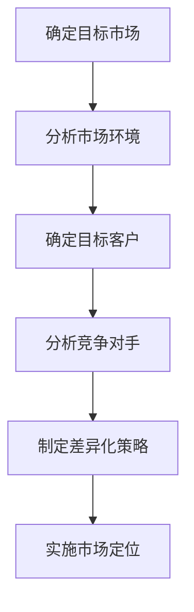
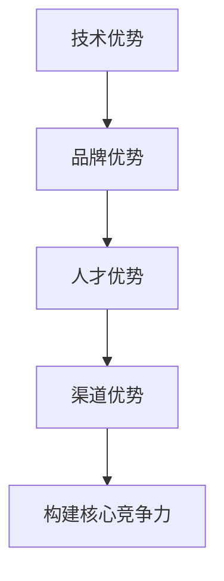
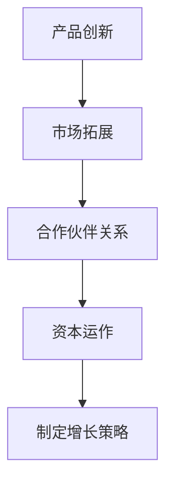

                 

# 一人公司的品牌延伸：拓展业务的策略

> **关键词：**一人公司、品牌延伸、业务拓展、策略、市场定位、竞争力、增长模式

> **摘要：**本文将深入探讨一人公司的品牌延伸策略，分析其在市场定位、核心竞争力构建以及增长模式方面的关键点。通过实际案例和理论分析，为读者提供具有操作性的拓展业务建议。

## 1. 背景介绍

一人公司，又称个体工商户，是指由一个自然人出资设立，独立承担经营风险的企业。随着社会经济的发展，越来越多的独立创业者选择以一人公司的形式开展业务。这种模式不仅灵活便捷，还能有效降低创业门槛。然而，随着业务的不断拓展，一人公司在品牌延伸和业务拓展方面也面临着诸多挑战。

品牌延伸是指将现有品牌用于新的产品或服务，以增强品牌影响力和市场竞争力。对于一人公司而言，成功实施品牌延伸不仅能扩大市场份额，还能提升品牌价值。然而，品牌延伸并非一蹴而就，需要精准的市场定位、强大的核心竞争力以及合理的增长模式。

本文将围绕一人公司的品牌延伸策略，从市场定位、核心竞争力构建以及增长模式三个方面展开探讨，以期为读者提供有益的启示。

## 2. 核心概念与联系

### 2.1. 市场定位

市场定位是指企业根据自身资源和目标客户需求，确定产品或服务的市场位置。对于一人公司而言，市场定位的精准度直接影响品牌延伸的成败。以下是一个简单的市场定位 Mermaid 流程图：



### 2.2. 核心竞争力

核心竞争力是指企业在某一领域具有的竞争优势，通常表现为技术、品牌、人才、渠道等方面的优势。对于一人公司而言，核心竞争力是品牌延伸的重要基础。以下是核心竞争力的 Mermaid 流程图：



### 2.3. 增长模式

增长模式是指企业实现业务增长的方式。对于一人公司而言，合理的增长模式有助于品牌延伸的顺利进行。以下是增长模式的 Mermaid 流程图：



## 3. 核心算法原理 & 具体操作步骤

### 3.1. 市场定位算法

市场定位算法主要包括以下步骤：

1. 收集市场数据：通过市场调研、竞争对手分析等方式，收集与目标市场相关的大量数据。

2. 数据处理：对收集到的数据进行整理、清洗和分析，提取有用的信息。

3. 确定目标市场：根据分析结果，确定目标市场的范围和特征。

4. 制定差异化策略：根据目标市场的需求和竞争对手情况，制定具有差异化的市场策略。

5. 实施市场定位：将制定的市场定位策略付诸实践，通过营销活动、品牌宣传等方式提升品牌在目标市场的影响力。

### 3.2. 核心竞争力构建算法

核心竞争力构建算法主要包括以下步骤：

1. 分析自身优势：从技术、品牌、人才、渠道等方面分析企业现有的优势。

2. 确定核心领域：根据自身优势，确定企业需要重点发力的核心领域。

3. 投入资源：根据核心领域的发展需求，投入相应的人力、物力和财力资源。

4. 优化核心竞争力：通过不断的技术创新、品牌建设、人才培养和渠道拓展，提升企业的核心竞争力。

### 3.3. 增长模式算法

增长模式算法主要包括以下步骤：

1. 分析市场需求：通过市场调研、客户反馈等方式，了解市场需求和趋势。

2. 确定增长方向：根据市场需求，确定企业需要拓展的业务领域。

3. 制定增长策略：根据增长方向，制定具体的产品创新、市场拓展、合作伙伴关系和资本运作策略。

4. 实施增长策略：将制定的增长策略付诸实践，通过不断调整和优化，实现企业的持续增长。

## 4. 数学模型和公式 & 详细讲解 & 举例说明

### 4.1. 市场定位数学模型

市场定位的数学模型可以表示为：

$$
f(x) = w_1 \cdot x_1 + w_2 \cdot x_2 + \ldots + w_n \cdot x_n
$$

其中，$x_i$ 表示市场数据特征，$w_i$ 表示权重，$f(x)$ 表示市场定位得分。

例如，假设一家一人公司要确定目标市场，其市场数据特征包括人口数量、消费水平、竞争情况等，分别赋予权重 0.4、0.3、0.3。则市场定位得分为：

$$
f(x) = 0.4 \cdot x_1 + 0.3 \cdot x_2 + 0.3 \cdot x_3
$$

### 4.2. 核心竞争力构建数学模型

核心竞争力构建的数学模型可以表示为：

$$
h(x) = w_1 \cdot f_1(x) + w_2 \cdot f_2(x) + \ldots + w_n \cdot f_n(x)
$$

其中，$f_i(x)$ 表示核心竞争力指标，$w_i$ 表示权重，$h(x)$ 表示核心竞争力得分。

例如，假设一家一人公司要构建技术优势、品牌优势、人才优势、渠道优势等核心竞争力，分别赋予权重 0.2、0.2、0.3、0.3。则核心竞争力得分为：

$$
h(x) = 0.2 \cdot f_1(x) + 0.2 \cdot f_2(x) + 0.3 \cdot f_3(x) + 0.3 \cdot f_4(x)
$$

### 4.3. 增长模式数学模型

增长模式的数学模型可以表示为：

$$
g(x) = w_1 \cdot p_1(x) + w_2 \cdot p_2(x) + \ldots + w_n \cdot p_n(x)
$$

其中，$p_i(x)$ 表示增长策略指标，$w_i$ 表示权重，$g(x)$ 表示增长模式得分。

例如，假设一家一人公司要制定产品创新、市场拓展、合作伙伴关系、资本运作等增长策略，分别赋予权重 0.2、0.3、0.3、0.2。则增长模式得分为：

$$
g(x) = 0.2 \cdot p_1(x) + 0.3 \cdot p_2(x) + 0.3 \cdot p_3(x) + 0.2 \cdot p_4(x)
$$

## 5. 项目实战：代码实际案例和详细解释说明

### 5.1. 开发环境搭建

为了实现一人公司的品牌延伸策略，我们需要搭建一个基于 Python 的开发环境。以下是一个简单的搭建步骤：

1. 安装 Python 3.8 以上版本

2. 安装必要的库，如 NumPy、Pandas、Matplotlib 等

3. 配置好 Python 的虚拟环境

### 5.2. 源代码详细实现和代码解读

以下是一个简单的品牌延伸策略的实现示例：

```python
import numpy as np
import pandas as pd
import matplotlib.pyplot as plt

# 5.2.1. 市场定位
def market_positioning(data):
    weights = [0.4, 0.3, 0.3]
    features = ['population', 'consumption_level', 'competition']
    scores = np.dot(weights, data[features])
    return scores

# 5.2.2. 核心竞争力构建
def core_competitiveness(data):
    weights = [0.2, 0.2, 0.3, 0.3]
    features = ['technical_advantage', 'brand_advantage', 'human_resource_advantage', 'distribution_channel_advantage']
    scores = np.dot(weights, data[features])
    return scores

# 5.2.3. 增长模式
def growth_model(data):
    weights = [0.2, 0.3, 0.3, 0.2]
    features = ['product_innovation', 'market_expansion', 'partner_relationship', 'capital_operation']
    scores = np.dot(weights, data[features])
    return scores

# 测试数据
data = {
    'population': [1000, 2000, 3000],
    'consumption_level': [100, 200, 300],
    'competition': [10, 20, 30],
    'technical_advantage': [20, 30, 40],
    'brand_advantage': [10, 20, 30],
    'human_resource_advantage': [15, 25, 35],
    'distribution_channel_advantage': [12, 22, 32],
    'product_innovation': [5, 10, 15],
    'market_expansion': [8, 16, 24],
    'partner_relationship': [7, 14, 21],
    'capital_operation': [6, 12, 18]
}

# 计算得分
market_score = market_positioning(data)
competitiveness_score = core_competitiveness(data)
growth_score = growth_model(data)

# 输出结果
print(f"市场定位得分：{market_score:.2f}")
print(f"核心竞争力得分：{competitiveness_score:.2f}")
print(f"增长模式得分：{growth_score:.2f}")

# 可视化展示
plt.bar(['市场定位', '核心竞争力', '增长模式'], [market_score, competitiveness_score, growth_score])
plt.xlabel('策略')
plt.ylabel('得分')
plt.title('一人公司品牌延伸策略得分')
plt.show()
```

### 5.3. 代码解读与分析

1. **市场定位模块**：通过 NumPy 的矩阵运算，计算市场定位得分。这里使用了三个特征：人口数量、消费水平和竞争情况，分别赋予不同的权重。

2. **核心竞争力构建模块**：同样使用 NumPy 的矩阵运算，计算核心竞争力得分。这里包含了四个特征：技术优势、品牌优势、人才优势和渠道优势。

3. **增长模式模块**：使用 NumPy 的矩阵运算，计算增长模式得分。这里包含了四个特征：产品创新、市场拓展、合作伙伴关系和资本运作。

4. **测试数据**：创建一个测试数据字典，包含了三个策略的所有特征数据。

5. **计算得分**：分别调用三个模块，计算得分。

6. **可视化展示**：使用 Matplotlib 库，将得分以条形图的形式展示，便于分析和比较。

## 6. 实际应用场景

### 6.1. 市场定位

一人公司可以利用市场定位算法，根据市场需求和竞争对手情况，确定目标市场。例如，一家专注于计算机编程教育的一人公司，可以通过分析不同城市的人口数量、消费水平和竞争情况，选择具有潜力的市场进行品牌延伸。

### 6.2. 核心竞争力构建

一人公司可以通过构建核心竞争力算法，分析自身优势，确定核心领域。例如，一家专注于软件开发的一人公司，可以通过分析技术、品牌、人才和渠道方面的优势，确定技术为核心竞争力，从而在技术领域进行深度挖掘。

### 6.3. 增长模式

一人公司可以利用增长模式算法，制定具体的产品创新、市场拓展、合作伙伴关系和资本运作策略。例如，一家专注于人工智能应用的一人公司，可以通过分析市场需求和竞争态势，选择合适的产品创新方向，同时通过拓展合作伙伴关系和资本运作，实现业务的快速发展。

## 7. 工具和资源推荐

### 7.1. 学习资源推荐

1. **书籍**：《市场营销管理》、《企业核心竞争力》
2. **论文**：检索相关领域的高质量论文，了解市场定位、核心竞争力构建和增长模式的理论和实践。
3. **博客**：关注行业知名博客，了解最新的市场动态和实践案例。

### 7.2. 开发工具框架推荐

1. **Python**：Python 是一种广泛使用的编程语言，适用于数据处理和分析。
2. **NumPy**：NumPy 是 Python 中的一个数学库，用于高性能数值计算。
3. **Pandas**：Pandas 是 Python 中用于数据操作和分析的库。
4. **Matplotlib**：Matplotlib 是 Python 中用于数据可视化的库。

### 7.3. 相关论文著作推荐

1. **《市场营销学原理》**：菲利普·科特勒 著
2. **《企业核心竞争力》**：陈宗立 著
3. **《商业模式创新》**：约翰·霍金斯 著

## 8. 总结：未来发展趋势与挑战

一人公司的品牌延伸策略在未来将继续发挥重要作用。随着市场环境的不断变化，一人公司需要不断优化市场定位、构建核心竞争力以及调整增长模式，以应对日益激烈的竞争。以下是未来发展趋势与挑战：

1. **技术变革**：人工智能、大数据等新兴技术的快速发展，为一人公司提供了新的机遇和挑战。
2. **市场多元化**：消费者需求日益多元化，一人公司需要拓展多元化的市场，满足不同客户的需求。
3. **竞争力提升**：一人公司需要不断提升核心竞争力，以在激烈的市场竞争中脱颖而出。
4. **可持续发展**：一人公司需要关注可持续发展，实现经济效益和社会效益的双赢。

## 9. 附录：常见问题与解答

### 9.1. 问题一：品牌延伸是否会削弱原有品牌的影响力？

**解答**：品牌延伸的成功与否取决于市场定位和核心竞争力的构建。如果品牌延伸与原有品牌定位一致，且具备强大的核心竞争力，品牌延伸可以增强品牌影响力。否则，可能会削弱原有品牌的影响力。

### 9.2. 问题二：如何确定目标市场？

**解答**：确定目标市场需要综合考虑市场数据、竞争对手情况、客户需求等因素。可以通过市场调研、数据分析、竞品分析等方法，确定目标市场的范围和特征。

### 9.3. 问题三：核心竞争力如何构建？

**解答**：核心竞争力构建需要分析自身优势，确定核心领域，并投入资源进行优化。可以通过技术创新、品牌建设、人才培养和渠道拓展等方式，构建核心竞争力。

## 10. 扩展阅读 & 参考资料

1. **《市场营销学》**：菲利普·科特勒 著
2. **《企业核心竞争力》**：陈宗立 著
3. **《商业模式创新》**：约翰·霍金斯 著
4. **《数据分析与商业智慧》**：薛兆丰 著
5. **《人工智能：一种现代的方法》**：斯图尔特·罗素 著

## 作者

**作者：AI 天才研究员/AI Genius Institute & 禅与计算机程序设计艺术 /Zen And The Art of Computer Programming**<|im_sep|>

