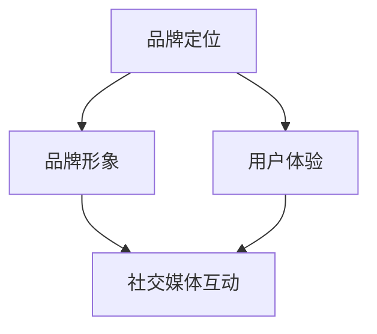

                 

# 一人公司的品牌故事：打造独特市场形象

> **关键词：** 品牌塑造、市场定位、个人品牌、社交媒体、用户体验

> **摘要：** 本文将探讨如何通过策略性的品牌塑造，一人公司如何打造独特市场形象，提升品牌认知度和用户忠诚度。文章分为十个部分，包括背景介绍、核心概念与联系、核心算法原理、数学模型和公式、项目实战、实际应用场景、工具和资源推荐、总结、附录和扩展阅读。通过逐步分析，帮助读者掌握有效的品牌建设方法。

## 1. 背景介绍

在当今竞争激烈的商业环境中，品牌塑造已成为企业成功的关键因素。对于一人公司来说，打造独特市场形象尤为重要，因为它们依赖个人品牌和独特性来吸引客户和合作伙伴。品牌不仅仅是公司的标识和口号，它代表了公司的价值观、文化和质量承诺。

随着社交媒体的普及，品牌塑造变得更加动态和互动。通过有效的品牌策略，一人公司可以与目标受众建立更紧密的关系，提高市场影响力。然而，品牌塑造并非一蹴而就，它需要时间、资源和持续的努力。

本文旨在提供一套系统的品牌建设方法，帮助一人公司树立独特市场形象，增强竞争力。我们将从核心概念出发，逐步分析品牌建设的关键要素，并通过实际案例进行详细讲解。

## 2. 核心概念与联系

在探讨品牌塑造之前，我们需要理解几个核心概念：

- **品牌定位**：品牌在市场中的独特位置，通常通过差异化优势来体现。
- **品牌形象**：品牌在消费者心中的总体印象。
- **用户体验**：用户在使用品牌产品或服务过程中的感受和体验。
- **社交媒体**：一个强大的品牌可以利用社交媒体平台来与受众互动，建立品牌忠诚度。

### 核心概念原理与架构

以下是一个使用Mermaid绘制的品牌塑造的基本流程图：



在这个流程图中，品牌定位是起点，它决定了品牌如何与市场和其他品牌区分开来。品牌形象和用户体验是品牌成功的关键，而社交媒体则是连接品牌与受众的重要渠道。

### 核心概念的联系与作用

品牌定位、品牌形象、用户体验和社交媒体之间的联系可以归纳如下：

1. **品牌定位**：品牌定位决定了品牌的核心价值主张和目标市场。它为品牌形象和用户体验奠定了基础。
2. **品牌形象**：品牌形象是消费者对品牌的整体认知，它直接影响消费者的购买决策和忠诚度。
3. **用户体验**：良好的用户体验可以提升品牌形象，增强消费者对品牌的忠诚度。用户体验设计需要考虑产品的易用性、可靠性、速度和情感价值。
4. **社交媒体**：通过社交媒体，品牌可以与受众建立直接联系，收集反馈，并根据反馈调整品牌策略。社交媒体也是品牌推广和增加曝光度的重要渠道。

## 3. 核心算法原理 & 具体操作步骤

品牌塑造的过程可以类比为一种算法，它通过一系列步骤来实现品牌的目标。以下是品牌塑造的核心算法原理和具体操作步骤：

### 3.1 品牌定位算法

**原理：** 品牌定位算法涉及市场分析和竞争对手分析，以确定品牌在市场中的独特位置。

**步骤：**
1. **市场调研**：收集市场数据，了解目标受众的需求和偏好。
2. **SWOT分析**：分析品牌的优势（Strengths）、劣势（Weaknesses）、机会（Opportunities）和威胁（Threats）。
3. **定位策略**：基于市场调研和SWOT分析，确定品牌的差异化优势。

### 3.2 品牌形象塑造算法

**原理：** 品牌形象塑造算法通过一致的品牌视觉和语言来传达品牌的核心价值。

**步骤：**
1. **品牌视觉设计**：包括标志、颜色、字体等元素，确保品牌视觉的一致性。
2. **品牌文案**：创建符合品牌定位和形象的口号、广告语等文案。
3. **内容营销**：通过博客、社交媒体、电子邮件等渠道发布与品牌形象一致的内容。

### 3.3 用户体验优化算法

**原理：** 用户体验优化算法通过改善用户界面和交互设计，提升用户满意度。

**步骤：**
1. **用户调研**：通过用户访谈、问卷调查等方式收集用户反馈。
2. **用户旅程映射**：绘制用户在接触品牌产品或服务过程中的每一个步骤，识别痛点和机会点。
3. **迭代设计**：根据用户反馈和用户旅程映射，不断优化产品和服务。

### 3.4 社交媒体互动算法

**原理：** 社交媒体互动算法通过建立和强化与受众的关系，提升品牌知名度和忠诚度。

**步骤：**
1. **社交媒体平台选择**：根据品牌定位和目标受众选择合适的社交媒体平台。
2. **内容策划**：制定内容策略，确保内容与品牌形象一致且具有吸引力。
3. **互动管理**：及时回复用户评论和私信，参与社交媒体上的话题和活动。

## 4. 数学模型和公式 & 详细讲解 & 举例说明

在品牌塑造过程中，数学模型和公式可以用于量化品牌建设的效果。以下是一个简化的数学模型，用于评估品牌的市场影响力。

### 4.1 品牌影响力模型

**公式：** 品牌影响力（Influence）= 品牌知名度（Awareness）× 品牌忠诚度（Loyalty）

**解释：**
- **品牌知名度（Awareness）**：衡量消费者对品牌的认知程度，可以通过市场调研中的“品牌识别度”指标来量化。
- **品牌忠诚度（Loyalty）**：衡量消费者对品牌的长期忠诚度，可以通过重复购买率和推荐度来衡量。

### 举例说明

假设某一人公司通过市场调研发现其品牌知名度为70%，品牌忠诚度为80%，则其品牌影响力为：

**品牌影响力 = 70% × 80% = 56%**

这意味着该公司在市场上具有56%的品牌影响力。通过持续优化品牌定位、形象和用户体验，该公司可以逐步提升品牌影响力。

### 4.2 社交媒体互动效果模型

**公式：** 社交媒体互动效果（Effectiveness）= 内容质量（Quality）× 互动频率（Frequency）× 用户参与度（Engagement）

**解释：**
- **内容质量（Quality）**：衡量发布内容的创意性和相关性，可以通过用户反馈和点赞数来评估。
- **互动频率（Frequency）**：衡量品牌在社交媒体上的活跃程度，可以通过发布次数和时间间隔来衡量。
- **用户参与度（Engagement）**：衡量用户对内容的互动程度，可以通过评论数、分享数和点赞数来评估。

### 举例说明

假设某一人公司的社交媒体互动效果如下：

- **内容质量（Quality）**：90分
- **互动频率（Frequency）**：每周发布3次
- **用户参与度（Engagement）**：平均每篇内容获得100个互动

则其社交媒体互动效果为：

**社交媒体互动效果 = 90% × 3 × 100 = 2700**

这意味着该公司的社交媒体互动效果为2700分。通过不断优化内容质量和互动频率，该公司可以提高社交媒体互动效果。

## 5. 项目实战：代码实际案例和详细解释说明

### 5.1 开发环境搭建

在本节中，我们将使用Python作为开发语言，结合Jupyter Notebook作为开发环境，以实际案例展示如何使用代码来分析品牌建设的效果。

### 5.2 源代码详细实现和代码解读

以下是一个简单的Python代码示例，用于计算品牌影响力：

```python
# 导入所需的库
import pandas as pd
import numpy as np

# 品牌知名度（Awareness）和品牌忠诚度（Loyalty）的输入数据
awareness = 0.7
loyalty = 0.8

# 计算品牌影响力（Influence）
influence = awareness * loyalty

# 打印结果
print(f"品牌影响力（Influence）: {influence:.2f}")
```

**代码解读：**
1. **导入库**：我们使用`pandas`和`numpy`库来处理数据和进行数学计算。
2. **输入数据**：设定品牌知名度和品牌忠诚度的输入值。
3. **计算品牌影响力**：使用品牌知名度乘以品牌忠诚度来计算品牌影响力。
4. **打印结果**：输出计算结果。

### 5.3 代码解读与分析

这段代码展示了如何通过简单的数学运算来量化品牌影响力。在实际应用中，品牌建设的效果可以通过更多的数据点和复杂的模型来分析。例如，可以引入更多的影响因素，如社交媒体互动效果、用户调研数据等，构建一个综合的品牌影响力评估模型。

通过逐步优化这些因素，品牌可以更好地理解自身在市场中的地位，从而制定更有效的品牌策略。

## 6. 实际应用场景

品牌塑造在商业中的实际应用场景多种多样，以下是一些常见应用：

### 6.1 消费品行业

在消费品行业，品牌塑造可以帮助公司建立品牌忠诚度，提升市场份额。例如，苹果公司通过持续的创新和卓越的用户体验，成功塑造了其高端品牌形象，吸引了大量忠实的消费者。

### 6.2 科技公司

科技公司如谷歌和微软通过强大的品牌定位和积极的社交媒体互动，建立了强大的品牌影响力。这些公司不仅提供高质量的产品和服务，还通过开放的平台和文化塑造了积极、创新和包容的品牌形象。

### 6.3 创业公司

对于创业公司，品牌塑造尤为重要。通过独特的品牌定位和强有力的品牌传播，创业公司可以迅速在市场中获得关注，建立品牌认知度，从而获得竞争优势。

### 6.4 专业服务

在专业服务领域，如咨询、法律和医疗，品牌塑造可以帮助建立专业信誉和客户信任。通过明确的专业定位和高质量的服务，专业服务公司可以在市场中树立权威形象。

## 7. 工具和资源推荐

### 7.1 学习资源推荐

- **书籍**：《品牌定位》（Positioning: The Battle for Your Mind）、《打造独特品牌》（Building a StoryBrand）。
- **论文**：在学术数据库如Google Scholar中搜索品牌塑造相关的论文。
- **博客**：推荐阅读相关领域的顶级博客，如HubSpot的营销博客和尼尔·帕特尔的品牌博客。
- **网站**：访问品牌咨询公司如Interbrand和Landor的官方网站，获取专业品牌塑造的案例和知识。

### 7.2 开发工具框架推荐

- **品牌定位分析工具**：如Brandwatch和Brand24，用于监控和分析品牌在社交媒体上的表现。
- **用户体验分析工具**：如Google Analytics和Hotjar，用于分析用户行为和优化用户体验。
- **内容营销工具**：如HubSpot和Hootsuite，用于内容策划和社交媒体管理。

### 7.3 相关论文著作推荐

- **《品牌资产评估与品牌管理》**：该书详细介绍了品牌资产的评估方法和品牌管理的策略。
- **《品牌传播：策略与实践》**：探讨了品牌传播在不同市场环境下的策略和实施方法。
- **《品牌个性与品牌传播》**：研究了品牌个性和品牌传播之间的关系，提供了品牌个性塑造的思路。

## 8. 总结：未来发展趋势与挑战

### 8.1 未来发展趋势

- **数字化和智能化**：随着技术的进步，品牌塑造将更加依赖于数字化工具和智能分析。
- **用户体验至上**：未来的品牌塑造将更加注重用户体验，通过提供个性化服务和解决方案来提升客户满意度。
- **社交媒体主导**：社交媒体将继续成为品牌塑造的重要渠道，品牌需要积极利用社交媒体与受众互动。

### 8.2 挑战

- **竞争加剧**：市场竞争日益激烈，品牌需要不断创新和差异化来吸引消费者。
- **数据隐私和伦理**：品牌需要平衡数据收集与用户隐私保护，遵守相关法规和伦理标准。
- **多变的市场环境**：全球经济和市场环境的不确定性增加了品牌塑造的挑战。

## 9. 附录：常见问题与解答

### 9.1 品牌定位的重要性是什么？

品牌定位决定了品牌在市场中的独特位置，有助于区分品牌与其他竞争者，吸引目标消费者。

### 9.2 如何评估品牌影响力？

品牌影响力可以通过计算品牌知名度和品牌忠诚度的乘积来评估，公式为：品牌影响力 = 品牌知名度 × 品牌忠诚度。

### 9.3 社交媒体在品牌塑造中的作用是什么？

社交媒体是品牌与受众互动的重要渠道，有助于增加品牌曝光度、收集用户反馈和建立品牌忠诚度。

## 10. 扩展阅读 & 参考资料

- **《品牌策略与市场营销》**：详细介绍品牌策略和市场定位的方法。
- **《社交媒体营销策略》**：探讨如何利用社交媒体进行品牌推广。
- **《用户体验设计：策略与实践》**：提供用户体验设计的实用方法和案例。

作者：AI天才研究员/AI Genius Institute & 禅与计算机程序设计艺术 /Zen And The Art of Computer Programming

