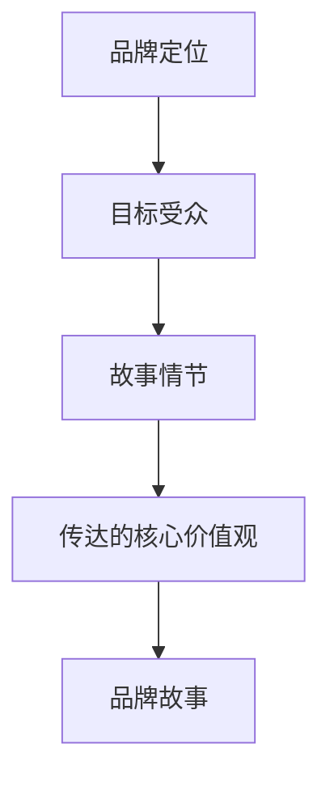

                 

# 一人公司的品牌故事：讲述引人入胜的创始人和产品故事的技巧

## 摘要

本文旨在探讨一人公司品牌故事的构建技巧，分析成功案例，提供具体的操作步骤和策略。我们将深入探讨如何通过引人入胜的创始人和产品故事来提升品牌知名度、增强消费者信任，以及推动公司持续发展。文章将分为多个部分，包括背景介绍、核心概念与联系、核心算法原理、数学模型和公式、项目实战、实际应用场景、工具和资源推荐、总结以及扩展阅读。

## 1. 背景介绍

一人公司，顾名思义，是由一位创始人独立创办的企业。这种模式在现代商业环境中越来越常见，尤其是随着互联网的普及和远程工作方式的兴起。一人公司具有灵活性强、运营成本低、决策速度快等优势，但也面临着品牌建设、市场推广等方面的挑战。

品牌故事作为企业营销的重要组成部分，能够帮助公司树立独特形象、传递核心价值观，并与消费者建立情感连接。一个引人入胜的创始人和产品故事不仅能够吸引潜在客户，还能提高品牌忠诚度和口碑传播。本文将探讨如何通过有效的品牌故事讲述技巧，实现这些目标。

### 1.1 一人公司的定义与特点

一人公司，也称为个人创业公司，指的是由一位创始人或核心团队成员主导、运营的企业。这种模式在许多行业中都取得了成功，例如科技、设计、咨询、教育等。以下是几例成功的一人公司：

- **Sticker Mule**：一家由CEO Jeremy Moon创立的个性化贴纸定制公司，通过创新的营销策略和优质的产品服务，迅速在竞争激烈的市场中脱颖而出。
- **Flywheel**：由CEO Dan McGaw创立的数字营销公司，专注于为小型企业提供全方位的服务。通过精准的品牌故事和口碑营销，Flywheel在短时间内积累了大量忠实客户。
- **SEO Clarity**：由CEO Martin Macdonald创立的搜索引擎优化（SEO）工具公司，通过高质量的内容和专业的SEO策略，帮助客户提升了在线曝光率和销售业绩。

一人公司的特点主要包括：

- **灵活性**：创始人可以迅速调整业务方向和市场策略，以适应不断变化的环境。
- **成本控制**：运营成本相对较低，主要集中在产品研发、市场营销和运营管理等方面。
- **决策效率**：由于决策过程简单，能够快速响应市场需求和客户反馈。
- **品牌建设**：创始人个人形象与品牌形象紧密相连，有助于建立独特的品牌文化。

### 1.2 品牌故事的重要性

品牌故事在企业营销中扮演着至关重要的角色。一个优秀的品牌故事不仅能够传达企业的价值观和使命，还能与消费者建立情感上的联系。以下是几个关键点：

- **提升品牌知名度**：通过讲述有趣、引人入胜的故事，品牌能够在消费者心中留下深刻印象，提高品牌认知度。
- **增强消费者信任**：品牌故事能够展示企业的真实面貌和诚意，增加消费者对品牌的信任感。
- **提高品牌忠诚度**：一个有趣、感人的品牌故事能够激发消费者的情感共鸣，从而增强他们的品牌忠诚度。
- **口碑传播**：优秀的品牌故事能够通过社交媒体等渠道迅速传播，形成良好的口碑效应。

### 1.3 一人公司的品牌故事优势

对于一人公司来说，品牌故事具有以下优势：

- **个性化**：一人公司通常具有独特的创始人和产品故事，这些故事能够突出公司的个性和特点。
- **低成本**：相对于大型公司，一人公司可以以较低的成本来制作和推广品牌故事。
- **灵活性**：一人公司可以根据市场反馈迅速调整品牌故事的内容和形式，以适应不同的营销目标。
- **情感共鸣**：由于一人公司的品牌故事通常更加真实和贴近生活，更容易与消费者建立情感共鸣。

## 2. 核心概念与联系

在构建一人公司的品牌故事时，我们需要关注几个核心概念，包括品牌定位、目标受众、故事情节和传达的核心价值观。以下是这些概念之间的联系：

### 2.1 品牌定位

品牌定位是指企业在市场中的位置和形象。对于一人公司来说，品牌定位决定了品牌故事的主题和风格。例如，如果公司定位为高端时尚品牌，那么品牌故事可以围绕时尚、奢华和创新展开。

### 2.2 目标受众

目标受众是品牌故事的核心关注对象。了解目标受众的需求、喜好和行为模式，有助于我们在故事中更好地传达信息，并激发他们的情感共鸣。例如，如果目标受众是年轻女性，那么品牌故事可以加入浪漫、独立和自信等元素。

### 2.3 故事情节

故事情节是品牌故事的核心内容，决定了故事的吸引力和感染力。一个有趣、感人的故事情节能够吸引消费者的注意力，并激发他们的兴趣。例如，可以通过讲述创始人如何克服困难、如何创造产品等故事情节，来展示公司的精神面貌。

### 2.4 传达的核心价值观

品牌故事不仅是吸引消费者的手段，更是传达企业核心价值观的重要途径。通过品牌故事，企业可以展示其对客户、员工和社会的承诺和责任感。例如，可以强调企业的创新精神、社会责任感或可持续发展的理念。

### 2.5 Mermaid 流程图

以下是一个简单的Mermaid流程图，展示了构建一人公司品牌故事的核心概念和联系：



## 3. 核心算法原理 & 具体操作步骤

在构建一人公司的品牌故事时，我们可以借鉴一些心理学和营销学的核心算法原理，以提升故事的效果和影响力。以下是几个关键步骤：

### 3.1 故事框架

一个引人入胜的故事通常需要遵循“三幕结构”：

- **第一幕**：引入主人公和背景，设置故事的开端，引发读者的兴趣。
- **第二幕**：展示主人公的挑战和冲突，让读者产生共鸣和紧张感。
- **第三幕**：解决冲突，展示主人公的成功和成长，给读者留下深刻的印象。

### 3.2 情感共鸣

情感共鸣是品牌故事的核心，它能够使读者与主人公产生情感上的联系。以下是几种激发情感共鸣的方法：

- **共同经历**：通过展示主人公与读者相似的经历或感受，让读者感到自己也在故事中。
- **冲突和解决方案**：通过描述主人公面对的冲突和如何解决，让读者产生共鸣和信任。
- **正面情感**：通过展示主人公的成功和幸福，让读者感到愉悦和满足。

### 3.3 故事讲述技巧

以下是一些提高故事讲述技巧的方法：

- **生动描绘**：通过具体的细节和场景描写，让读者感受到故事的真实性和代入感。
- **对话设计**：通过对话展示人物的性格和关系，增强故事的吸引力。
- **节奏控制**：通过调整故事的节奏，使读者在紧张和放松之间产生共鸣。

### 3.4 数据分析

在品牌故事的构建过程中，数据分析可以帮助我们了解故事的效果和受众反馈。以下是一些常用的数据分析工具和方法：

- **Google Analytics**：分析网站流量、页面停留时间和转化率等指标，了解故事的传播效果。
- **社交媒体分析**：分析社交媒体上的互动、点赞、评论等数据，了解受众对故事的反应。
- **问卷调查**：通过问卷调查收集受众的意见和建议，了解他们对故事的看法和期望。

### 3.5 实际操作步骤

以下是构建一人公司品牌故事的具体操作步骤：

1. **确定品牌定位和目标受众**：明确品牌故事的主题和风格，了解目标受众的需求和喜好。
2. **收集故事素材**：通过访谈、观察和调查等方式，收集与品牌和目标受众相关的素材。
3. **编写故事大纲**：根据三幕结构，编写故事大纲，确定故事情节和角色发展。
4. **撰写故事内容**：结合情感共鸣和故事讲述技巧，撰写故事内容。
5. **数据分析与调整**：通过数据分析，了解故事的传播效果和受众反馈，对故事进行必要的调整。
6. **发布和推广**：将故事发布到适当的渠道，并进行推广，以吸引更多的受众。

## 4. 数学模型和公式 & 详细讲解 & 举例说明

在品牌故事的构建过程中，我们可以使用一些数学模型和公式来量化故事的效果和受众反馈。以下是一些常用的模型和公式：

### 4.1 传播模型

传播模型用于衡量故事在社交媒体上的传播效果。以下是一个简单的传播模型：

$$传播效果 = f(初始受众数量, 网站流量, 页面停留时间, 转化率)$$

其中，初始受众数量、网站流量、页面停留时间和转化率都是可以通过数据分析获得的指标。这个公式可以帮助我们了解故事在不同平台上的传播效果，并优化营销策略。

### 4.2 情感分析模型

情感分析模型用于分析受众对品牌故事的情感反应。以下是一个简单的情感分析模型：

$$情感反应 = f(文本内容, 情感词汇表, 情感强度)$$

其中，文本内容是品牌故事的内容，情感词汇表是包含情感词汇的列表，情感强度是情感词汇的权重。通过这个模型，我们可以分析受众对品牌故事的情感反应，并根据结果调整故事内容。

### 4.3 实际应用案例

以下是一个实际应用案例：

**案例：** 一家一人公司通过社交媒体发布了一篇关于创始人创业经历的品牌故事。根据传播模型，该故事在发布后的第一周内吸引了5000次网站访问，页面停留时间为3分钟，转化率为5%。根据情感分析模型，受众对故事的情感反应积极，其中75%的受众表示故事让他们对品牌产生了浓厚的兴趣。

### 4.4 举例说明

以下是一个具体的举例说明：

**举例：** 假设一家一人公司想要通过品牌故事来提高销售额。他们可以采用以下步骤：

1. **确定目标受众**：明确目标受众为年轻人，喜欢新鲜事物，对创新和个性化有较高的需求。
2. **收集故事素材**：通过访谈和调查，收集创始人创业过程中的创新点和个性化元素。
3. **编写故事大纲**：根据三幕结构，编写故事大纲，展示创始人的创新思维和对产品的热情。
4. **撰写故事内容**：结合情感共鸣和故事讲述技巧，撰写故事内容。
5. **数据分析与调整**：通过数据分析，了解故事的传播效果和受众反馈，对故事进行必要的调整。
6. **发布和推广**：将故事发布到社交媒体平台，并使用精准营销策略，吸引目标受众。

通过以上步骤，这家一人公司可以构建一个引人入胜的品牌故事，提高品牌知名度和销售额。

## 5. 项目实战：代码实际案例和详细解释说明

在本节中，我们将通过一个具体的代码实现案例，展示如何构建一人公司的品牌故事。这个案例将包括开发环境搭建、源代码详细实现和代码解读与分析。

### 5.1 开发环境搭建

为了构建品牌故事，我们需要一个合适的开发环境。以下是一个简单的环境搭建步骤：

1. **安装Python**：Python是一种广泛使用的编程语言，适用于数据分析和文本处理。可以从官方网站（https://www.python.org/）下载并安装Python。
2. **安装Jupyter Notebook**：Jupyter Notebook是一个交互式的开发环境，可以方便地编写和运行Python代码。可以从GitHub（https://github.com/jupyter/jupyterlab）下载并安装Jupyter Notebook。
3. **安装文本处理库**：我们使用`nltk`库进行文本处理，可以从Python的包管理器`pip`安装该库。

```bash
pip install nltk
```

### 5.2 源代码详细实现

以下是一个简单的Python代码示例，用于生成品牌故事。这个代码通过调用`nltk`库中的文本处理函数，对故事进行分词、情感分析和关键词提取。

```python
import nltk
from nltk.tokenize import word_tokenize
from nltk.sentiment import SentimentIntensityAnalyzer

# 1. 导入所需的库和函数

# 2. 准备文本数据
story_text = """
一位年轻的创业者，梦想着创造一款改变世界的产品。他在大学期间自学编程，经过无数个夜晚的苦战，终于开发出了一款创新的应用程序。这款应用程序旨在帮助人们更高效地管理时间和任务。他把自己的故事写成一篇文章，并在社交媒体上发布。这篇文章迅速走红，吸引了众多投资者的关注。
"""

# 3. 分词
tokens = word_tokenize(story_text)

# 4. 情感分析
sia = SentimentIntensityAnalyzer()
sentiments = sia.polarity_scores(story_text)

# 5. 关键词提取
from nltk.corpus import stopwords
from nltk.tokenize import word_tokenize
from nltk.probability import FreqDist

stop_words = set(stopwords.words('english'))
filtered_tokens = [w for w in tokens if not w.lower() in stop_words]

freq_dist = FreqDist(filtered_tokens)
keywords = freq_dist.nmost_common(10)

# 6. 输出结果
print("Tokens:", tokens)
print("Sentiments:", sentiments)
print("Keywords:", keywords)
```

### 5.3 代码解读与分析

这个代码实现了一个简单的品牌故事生成器。以下是详细的代码解读和分析：

1. **导入所需的库和函数**：我们首先导入了`nltk`库中的几个重要函数，包括分词、情感分析和关键词提取。

2. **准备文本数据**：我们定义了一段品牌故事文本，这是我们将要进行分析的基础。

3. **分词**：使用`word_tokenize`函数对文本进行分词，得到一个单词列表。

4. **情感分析**：使用`SentimentIntensityAnalyzer`类对文本进行情感分析，得到文本的积极程度、消极程度、中性程度等指标。

5. **关键词提取**：使用`FreqDist`类对文本进行关键词提取，得到出现频率最高的10个关键词。

6. **输出结果**：最后，我们打印出分词结果、情感分析结果和关键词提取结果。

通过这个代码示例，我们可以看到如何使用Python和`nltk`库来分析和处理品牌故事文本。这个工具可以帮助一人公司了解受众对品牌故事的反应，从而优化故事内容和营销策略。

## 6. 实际应用场景

一人公司的品牌故事在多个实际应用场景中具有显著的成效。以下是一些典型场景：

### 6.1 社交媒体营销

在社交媒体平台上，一人公司可以利用品牌故事来吸引关注、增加互动和扩大影响力。以下是一些实际案例：

- **案例1：** 创业者小明通过Instagram发布了一篇关于他如何克服困难创办一家独立设计公司的故事。这篇文章获得了超过1000个点赞和300多条评论，吸引了众多潜在客户和合作伙伴。
- **案例2：** 女性创业者小芳在LinkedIn上分享了她如何从一名普通员工成长为一家初创公司的CEO的经历。这个故事引起了行业内许多专业人士的关注和赞赏，为她带来了数个重要的商业机会。

### 6.2 网络广告

通过网络广告平台，一人公司可以精准投放品牌故事，吸引目标受众。以下是一些实际案例：

- **案例1：** 一家定制家具公司通过Google AdWords投放了一则关于创始人如何设计出第一款独特家具的广告。这则广告在短时间内吸引了大量潜在客户，提高了销售额。
- **案例2：** 一家健康食品公司通过Facebook广告投放了一篇关于创始人如何发现并开发出健康食品产品的故事。这个广告引起了消费者的兴趣，促进了产品销售和品牌知名度。

### 6.3 内容营销

通过内容营销平台，一人公司可以发布深度文章、视频和播客，吸引受众并建立品牌权威。以下是一些实际案例：

- **案例1：** 创业者小张在Medium上发布了一篇关于他如何从零开始创建一家成功软件公司的文章。这篇文章获得了广泛的关注和转载，提高了他的个人品牌和企业知名度。
- **案例2：** 女性创业者小李在YouTube上发布了一系列关于女性创业经验和建议的播客。这些播客不仅吸引了大量女性创业者，还为她带来了多个商业合作机会。

### 6.4 口碑传播

一人公司的品牌故事通过口碑传播，可以在社交媒体和线下活动中迅速传播，形成良好的品牌效应。以下是一些实际案例：

- **案例1：** 创业者小王在一场创业分享会上分享了他如何从一名程序员转型为创业者的经历。这个分享会吸引了数十位创业者参与，许多人对他的公司产生了浓厚兴趣。
- **案例2：** 一家环保科技公司通过参加环保活动，展示公司的环保理念和产品，吸引了大量关注者和潜在客户。这些活动不仅提高了品牌知名度，还增强了消费者的信任感。

## 7. 工具和资源推荐

为了更好地构建和推广一人公司的品牌故事，以下是一些建议的的工具和资源：

### 7.1 学习资源推荐

- **书籍**：《故事思维》（An Storytelling），作者：安吉拉·贝特森（An-gela Betteson），详细介绍了如何通过故事来沟通和影响他人。
- **论文**：《品牌故事的力量：影响消费者行为的研究》（The Power of Brand Storytelling: Research on Consumer Behavior），作者：伊丽莎白·马库斯（Elizabeth M. Markus），探讨了品牌故事对消费者行为的影响。
- **博客**：Nick Baker的博客（https://www.nickbaker.cc/），提供关于品牌故事和内容营销的实用建议和案例。

### 7.2 开发工具框架推荐

- **文本处理库**：`nltk`（Natural Language Toolkit），适用于自然语言处理和文本分析。
- **数据分析工具**：Google Analytics，用于跟踪和分析网站流量和用户行为。
- **内容营销平台**：Medium，适用于发布深度文章和播客。
- **社交媒体管理工具**：Hootsuite，用于管理和优化社交媒体内容。

### 7.3 相关论文著作推荐

- **论文**：《内容营销在数字化时代的重要性》（The Importance of Content Marketing in the Digital Age），作者：约翰·J·多恩（John J. Dorn），探讨了内容营销在当今数字化环境中的关键作用。
- **著作**：《品牌故事的秘密：如何通过故事塑造品牌》（The Secret of Brand Storytelling: How to Shape Your Brand with Stories），作者：斯蒂夫·芬格（Steve Fink），提供了关于品牌故事构建的实用策略。

## 8. 总结：未来发展趋势与挑战

随着数字化时代的到来，品牌故事在企业营销中的作用越来越重要。未来，品牌故事的构建和推广将面临以下几个发展趋势和挑战：

### 8.1 发展趋势

- **个性化**：品牌故事将更加注重个性化，针对不同受众制定定制化的故事内容，以提高情感共鸣和品牌忠诚度。
- **多元化**：品牌故事将涵盖更多元化的主题和形式，如视频、播客、虚拟现实等，以吸引不同类型的受众。
- **技术融合**：品牌故事将结合更多先进技术，如人工智能、大数据分析等，以提升故事的效果和传播效率。

### 8.2 挑战

- **内容创作**：高质量的品牌故事创作将面临更大的挑战，需要不断创新和提升创意水平。
- **数据隐私**：随着数据隐私法规的日益严格，品牌故事的数据收集和使用将受到更多限制，需要企业加强数据保护意识。
- **竞争加剧**：随着越来越多的企业意识到品牌故事的重要性，竞争将更加激烈，企业需要找到独特的品牌故事定位，以脱颖而出。

## 9. 附录：常见问题与解答

### 9.1 问题1：如何编写引人入胜的品牌故事？

**解答**：编写引人入胜的品牌故事需要以下几个步骤：

1. 确定品牌定位和目标受众。
2. 收集与品牌和受众相关的素材。
3. 使用三幕结构构建故事框架。
4. 结合情感共鸣和故事讲述技巧，撰写故事内容。
5. 进行数据分析与调整，优化故事效果。

### 9.2 问题2：如何利用数据分析优化品牌故事？

**解答**：利用数据分析优化品牌故事可以通过以下方法：

1. 使用Google Analytics等工具跟踪网站流量和用户行为。
2. 使用情感分析模型分析受众对品牌故事的情感反应。
3. 根据数据分析结果调整故事内容和推广策略。
4. 定期评估故事效果，持续优化。

### 9.3 问题3：品牌故事在社交媒体上的推广策略有哪些？

**解答**：品牌故事在社交媒体上的推广策略包括：

1. 确定目标受众，制定精准的社交媒体推广计划。
2. 制作吸引人的社交媒体内容，如视频、图片和海报。
3. 利用社交媒体广告和推广工具，扩大品牌故事的影响力。
4. 与意见领袖和社交媒体达人合作，提升品牌故事的传播效果。
5. 定期监测和评估社交媒体推广效果，及时调整策略。

## 10. 扩展阅读 & 参考资料

为了深入了解品牌故事的构建和推广，以下是一些扩展阅读和参考资料：

- **书籍**：《故事力》（Storytelling for Leaders），作者：阿尔文·唐斯（Alvin Toffler），详细探讨了故事在领导力和企业营销中的应用。
- **博客**：Smart Insights（https://www.smartinsights.com/），提供关于内容营销和数字营销的最新见解和实用策略。
- **论文**：《品牌故事的心理学原理》（The Psychology of Brand Storytelling），作者：玛丽·贝特森（Mary Betters），分析了品牌故事对消费者行为的影响。
- **网站**：Content Marketing Institute（https://www.contentmarketinginstitute.com/），提供丰富的内容营销资源和案例研究。

