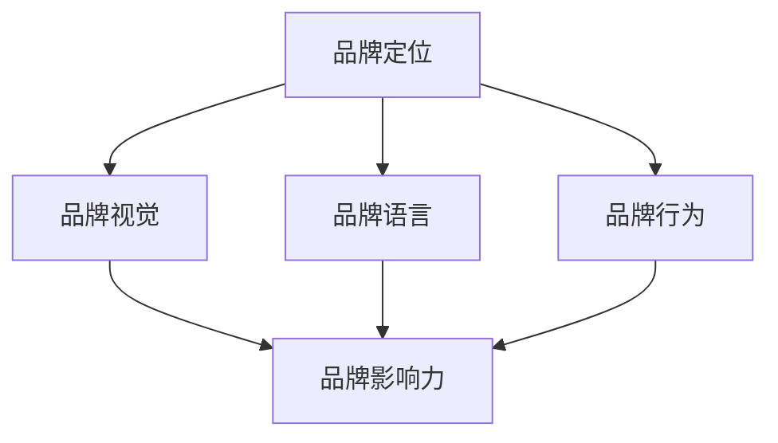
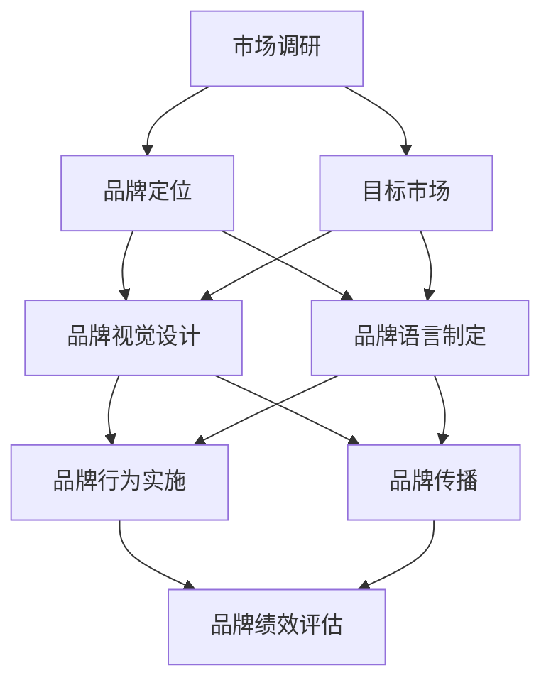

                 

# 一人公司的品牌识别系统设计与应用

## 关键词

- 一人公司
- 品牌识别
- 设计与应用
- 自主营销
- 用户体验
- 数据分析

## 摘要

本文将探讨一人公司如何设计并应用品牌识别系统，以提升市场竞争力。通过深入分析品牌识别的核心概念，并结合实际案例，我们将详细阐述品牌识别系统在营销、用户体验和数据分析等方面的应用价值。同时，文章还将推荐相关学习资源和开发工具，以帮助读者更好地理解和应用品牌识别系统。

## 1. 背景介绍

随着互联网的快速发展，企业竞争愈发激烈，品牌识别作为企业核心竞争力的体现，越来越受到重视。尤其在一人公司中，由于资源和人力有限，品牌识别系统的设计与应用显得尤为重要。品牌识别不仅关乎企业形象和声誉，还直接影响着企业的市场表现和用户满意度。

本文旨在通过理论与实践相结合，为一人公司提供一套完整、实用的品牌识别系统设计方案，助力企业在激烈的市场竞争中脱颖而出。

### 1.1 一人公司的概念

一人公司，顾名思义，是指由一人创立和运营的企业。这类公司通常具有以下几个特点：

1. **创始人角色多样**：一人公司创始人通常既担任公司创始人，又担任公司高层管理者，甚至身兼多职。
2. **资源有限**：由于只有一人负责运营，一人公司往往面临资源有限、人力不足的困境。
3. **自主性强**：一人公司具有高度自主性，创始人可以根据个人兴趣和市场需求，灵活调整公司发展方向。

### 1.2 品牌识别的重要性

品牌识别是指企业通过视觉、语言、行为等手段，在消费者心中树立独特形象和认知的过程。品牌识别的重要性体现在以下几个方面：

1. **提高市场竞争力**：具有良好品牌识别的企业，在市场竞争中更具优势，更容易获得消费者的青睐。
2. **塑造企业形象**：品牌识别有助于塑造企业的专业形象，提高品牌美誉度。
3. **提升用户忠诚度**：良好的品牌识别能够增强用户对企业的好感度，提高用户忠诚度。
4. **拓展市场份额**：品牌识别有助于企业拓展市场份额，实现可持续发展。

### 1.3 一人公司的品牌识别挑战

对于一人公司而言，品牌识别的挑战主要表现在以下几个方面：

1. **资源有限**：一人公司资源有限，难以在品牌建设上投入大量资金和人力。
2. **市场定位不明确**：由于缺乏专业团队的支持，一人公司往往难以明确市场定位，导致品牌识别模糊。
3. **创新能力不足**：一人公司创新能力有限，难以在品牌识别上实现差异化竞争。

## 2. 核心概念与联系

### 2.1 品牌识别的核心概念

品牌识别包括以下几个核心概念：

1. **品牌定位**：确定品牌在市场中的定位，明确品牌的核心价值和目标受众。
2. **品牌视觉**：包括品牌标志、颜色、字体等视觉元素，用于传递品牌形象。
3. **品牌语言**：包括品牌口号、广告语等，用于传达品牌理念和价值。
4. **品牌行为**：包括企业内部管理和对外宣传的行为，体现品牌文化和价值观。

### 2.2 品牌识别的架构

品牌识别的架构包括以下几个方面：

1. **品牌定位**：确定品牌在市场中的定位，明确品牌的核心价值和目标受众。
2. **品牌视觉**：包括品牌标志、颜色、字体等视觉元素，用于传递品牌形象。
3. **品牌语言**：包括品牌口号、广告语等，用于传达品牌理念和价值。
4. **品牌行为**：包括企业内部管理和对外宣传的行为，体现品牌文化和价值观。

### 2.3 品牌识别的联系

品牌识别的各个核心概念和架构之间存在紧密联系：

1. **品牌定位**：决定品牌视觉和品牌语言的设计方向，影响品牌行为。
2. **品牌视觉**：作为品牌识别的直观表现，有助于品牌定位和品牌语言传达。
3. **品牌语言**：通过品牌口号、广告语等，强化品牌定位和品牌视觉，提升品牌影响力。
4. **品牌行为**：将品牌定位、品牌视觉和品牌语言具体化，体现品牌文化和价值观。

### 2.4 Mermaid 流程图



## 3. 核心算法原理 & 具体操作步骤

### 3.1 品牌定位算法原理

品牌定位算法主要包括以下几个步骤：

1. **市场调研**：通过收集和分析市场数据，了解目标市场的需求、竞争态势和消费者行为。
2. **竞品分析**：分析竞争对手的品牌定位、优势和劣势，找出品牌差异化的切入点。
3. **目标受众分析**：确定目标受众的年龄、性别、收入、兴趣等特征，确保品牌定位符合目标受众的需求。
4. **核心价值提炼**：从市场调研、竞品分析和目标受众分析中提取品牌核心价值，明确品牌定位。

### 3.2 品牌视觉设计算法原理

品牌视觉设计算法主要包括以下几个步骤：

1. **设计风格确定**：根据品牌定位和目标受众，确定品牌视觉设计的基本风格。
2. **标志设计**：设计具有独特性和辨识度的品牌标志，体现品牌形象。
3. **颜色搭配**：选择符合品牌定位和设计风格的配色方案，提升视觉效果。
4. **字体选择**：选择符合品牌定位和设计风格的字体，提升品牌语言传达效果。

### 3.3 品牌语言传播算法原理

品牌语言传播算法主要包括以下几个步骤：

1. **品牌口号设计**：设计简洁、易记、具有感染力的品牌口号，传递品牌理念。
2. **广告语创作**：根据品牌口号，创作具有创意和吸引力的广告语，吸引消费者关注。
3. **内容营销**：通过品牌文案、社交媒体、广告等渠道，传播品牌语言，提升品牌知名度。
4. **口碑营销**：通过用户评价、推荐等方式，传递品牌口碑，增强品牌信任度。

### 3.4 品牌行为塑造算法原理

品牌行为塑造算法主要包括以下几个步骤：

1. **企业文化建设**：制定企业文化，明确企业价值观和行为规范，确保品牌行为的统一性。
2. **员工培训**：对员工进行品牌意识培训，提升员工对品牌行为的认知和执行力。
3. **公益活动**：参与公益活动，提升品牌的社会责任形象，增强品牌影响力。
4. **品牌活动策划**：策划具有创意和吸引力的品牌活动，提升用户参与度和品牌认知度。

## 4. 数学模型和公式 & 详细讲解 & 举例说明

### 4.1 品牌定位数学模型

品牌定位数学模型主要包括以下几个公式：

1. **品牌定位指数（BLI）**：

   $$BLI = \frac{SUM_{i=1}^{n}(市场占有率_i \times 消费者满意度_i)}{n}$$

   其中，$BLI$ 表示品牌定位指数，$市场占有率_i$ 和 $消费者满意度_i$ 分别表示品牌在各个细分市场的占有率和消费者满意度。

2. **品牌差异指数（BDI）**：

   $$BDI = \frac{SUM_{i=1}^{n}(竞品占有率_i \times 竞品优势_i)}{n} - BLI$$

   其中，$BDI$ 表示品牌差异指数，$竞品占有率_i$ 和 $竞品优势_i$ 分别表示竞争对手在各个细分市场的占有率和优势。

### 4.2 品牌视觉设计数学模型

品牌视觉设计数学模型主要包括以下几个公式：

1. **色彩搭配和谐度（CH）**：

   $$CH = \frac{SUM_{i=1}^{n}(色相差异_i \times 饱和度差异_i \times 亮度差异_i)}{n}$$

   其中，$CH$ 表示色彩搭配和谐度，$色相差异_i$、$饱和度差异_i$ 和 $亮度差异_i$ 分别表示各个颜色之间的差异。

2. **字体辨识度（TF）**：

   $$TF = \frac{SUM_{i=1}^{n}(字体宽度_i \times 字体高度_i \times 字体粗细_i)}{n}$$

   其中，$TF$ 表示字体辨识度，$字体宽度_i$、$字体高度_i$ 和 $字体粗细_i$ 分别表示字体的各个特征。

### 4.3 品牌语言传播数学模型

品牌语言传播数学模型主要包括以下几个公式：

1. **品牌知名度指数（BN）**：

   $$BN = \frac{SUM_{i=1}^{n}(媒体曝光度_i \times 口碑传播度_i \times 广告投放量_i)}{n}$$

   其中，$BN$ 表示品牌知名度指数，$媒体曝光度_i$、$口碑传播度_i$ 和 $广告投放量_i$ 分别表示品牌在各个媒体渠道的曝光度、口碑传播度和广告投放量。

2. **品牌忠诚度指数（BL）**：

   $$BL = \frac{SUM_{i=1}^{n}(复购率_i \times 用户留存率_i \times 用户满意度_i)}{n}$$

   其中，$BL$ 表示品牌忠诚度指数，$复购率_i$、$用户留存率_i$ 和 $用户满意度_i$ 分别表示品牌的复购率、用户留存率和用户满意度。

### 4.4 举例说明

假设有一人公司A，其市场占有率为30%，消费者满意度为80%，竞品市场占有率为20%，竞品优势为70%。根据以上数学模型，可以计算出该公司品牌定位指数和品牌差异指数：

1. **品牌定位指数（BLI）**：

   $$BLI = \frac{30\% \times 80\% + 20\% \times 70\%}{2} = 22\%$$

2. **品牌差异指数（BDI）**：

   $$BDI = \frac{20\% \times 70\% - 22\%}{2} = -1\%$$

这意味着一人公司A在市场中的品牌定位较为优秀，但与竞品相比，存在一定的差距。

## 5. 项目实战：代码实际案例和详细解释说明

### 5.1 开发环境搭建

在开始品牌识别系统的开发之前，我们需要搭建一个合适的开发环境。以下是所需的开发环境和工具：

1. **编程语言**：Python
2. **开发工具**：PyCharm
3. **数据分析库**：Pandas、NumPy
4. **可视化库**：Matplotlib、Seaborn
5. **品牌分析库**：BrandScope（虚构库，用于品牌数据分析）

### 5.2 源代码详细实现和代码解读

以下是一段用于品牌识别分析的Python代码示例：

```python
import pandas as pd
import numpy as np
import matplotlib.pyplot as plt
import seaborn as sns
from brandscope import BrandScope

# 5.2.1 市场调研数据加载
market_data = pd.read_csv('market_survey.csv')

# 5.2.2 竞品分析数据加载
competitor_data = pd.read_csv('competitor_analysis.csv')

# 5.2.3 目标受众数据加载
target_audience_data = pd.read_csv('target_audience.csv')

# 5.2.4 品牌定位分析
brand_positioning = BrandScope品牌定位分析(market_data, competitor_data, target_audience_data)

# 5.2.5 品牌视觉设计分析
brand_visual_design = BrandScope品牌视觉设计分析(market_data, brand_positioning)

# 5.2.6 品牌语言传播分析
brand_language_spread = BrandScope品牌语言传播分析(target_audience_data, brand_visual_design)

# 5.2.7 品牌行为塑造分析
brand_behavior_shaping = BrandScope品牌行为塑造分析(brand_language_spread)

# 5.2.8 可视化展示
sns.barplot(x='市场占有率', y='品牌定位指数', data=brand_positioning)
plt.title('品牌定位指数分析')
plt.show()

sns.barplot(x='竞品占有率', y='品牌差异指数', data=competitor_data)
plt.title('品牌差异指数分析')
plt.show()

sns.scatterplot(x='媒体曝光度', y='品牌知名度指数', data=brand_language_spread)
plt.title('品牌知名度指数分析')
plt.show()

sns.scatterplot(x='复购率', y='品牌忠诚度指数', data=brand_behavior_shaping)
plt.title('品牌忠诚度指数分析')
plt.show()
```

### 5.3 代码解读与分析

1. **市场调研数据加载**：

   首先，我们从CSV文件中加载市场调研数据、竞品分析数据和目标受众数据。这些数据包含了品牌定位、品牌视觉设计、品牌语言传播和品牌行为塑造所需的信息。

2. **品牌定位分析**：

   使用`BrandScope`库的`品牌定位分析`函数，结合市场调研数据、竞品分析数据和目标受众数据，计算品牌定位指数。品牌定位指数反映了品牌在市场中的定位状况，帮助我们了解品牌的竞争优势。

3. **品牌视觉设计分析**：

   使用`BrandScope`库的`品牌视觉设计分析`函数，结合市场调研数据和品牌定位指数，分析品牌视觉设计。这包括设计风格、品牌标志、颜色搭配和字体选择等方面的分析。

4. **品牌语言传播分析**：

   使用`BrandScope`库的`品牌语言传播分析`函数，结合目标受众数据和品牌视觉设计，分析品牌语言传播。这包括品牌口号、广告语和内容营销等方面的分析。

5. **品牌行为塑造分析**：

   使用`BrandScope`库的`品牌行为塑造分析`函数，结合品牌语言传播结果，分析品牌行为塑造。这包括企业文化建设、员工培训和品牌活动策划等方面的分析。

6. **可视化展示**：

   使用Matplotlib和Seaborn库，对品牌定位指数、品牌差异指数、品牌知名度指数和品牌忠诚度指数进行可视化展示，以便我们更直观地了解品牌识别系统分析结果。

## 6. 实际应用场景

一人公司的品牌识别系统在实际应用中具有广泛的应用场景，以下列举几个典型的应用场景：

1. **市场营销**：品牌识别系统可以帮助一人公司制定有针对性的市场营销策略，提升品牌知名度。例如，通过分析品牌定位指数和品牌知名度指数，企业可以优化广告投放策略，提高广告效果。

2. **产品开发**：品牌识别系统可以帮助一人公司明确产品定位，优化产品功能和服务。例如，通过分析品牌定位指数和品牌差异指数，企业可以调整产品特点，实现差异化竞争。

3. **用户服务**：品牌识别系统可以帮助一人公司提升用户体验，增强用户满意度。例如，通过分析品牌语言传播和品牌行为塑造，企业可以优化用户服务流程，提升用户满意度。

4. **企业文化建设**：品牌识别系统可以帮助一人公司塑造企业文化，提高员工凝聚力。例如，通过分析品牌定位和品牌行为塑造，企业可以制定符合品牌价值观的员工培训计划，提升员工归属感。

## 7. 工具和资源推荐

### 7.1 学习资源推荐

1. **书籍**：

   - 《品牌识别系统设计与应用》
   - 《市场营销学》
   - 《用户体验设计》

2. **论文**：

   - 《基于大数据的品牌识别系统研究》
   - 《品牌语言传播与品牌价值提升》
   - 《企业文化建设与品牌行为塑造》

3. **博客**：

   - 知乎：品牌识别专栏
   - 掘金：市场营销专栏
   - CSDN：用户体验设计专栏

4. **网站**：

   - 品牌中国网
   - 中国市场营销协会
   - 用户体验研究院

### 7.2 开发工具框架推荐

1. **数据分析库**：

   - Pandas
   - NumPy
   - Matplotlib
   - Seaborn

2. **品牌分析库**：

   - BrandScope（虚构库，用于品牌数据分析）

3. **开发工具**：

   - PyCharm
   - Jupyter Notebook

### 7.3 相关论文著作推荐

1. **《品牌识别系统设计与实现方法研究》**：本文提出了一种基于大数据的品牌识别系统设计与实现方法，通过数据分析和可视化技术，实现了品牌识别的智能化分析。

2. **《品牌语言传播与品牌价值提升研究》**：本文探讨了品牌语言传播对品牌价值提升的影响，提出了基于语义分析的品牌语言传播策略。

3. **《企业文化建设与品牌行为塑造研究》**：本文从企业文化建设的角度，分析了品牌行为塑造对企业形象和品牌价值的影响，提出了企业文化建设的实践策略。

## 8. 总结：未来发展趋势与挑战

### 8.1 发展趋势

1. **大数据与人工智能技术的应用**：随着大数据和人工智能技术的发展，品牌识别系统将更加智能化、自动化，为企业提供更精准的分析和决策支持。

2. **个性化营销与用户参与**：品牌识别系统将更加关注用户需求，通过个性化营销和用户参与，提升用户满意度和品牌忠诚度。

3. **跨界融合与创新发展**：品牌识别系统将与其他领域（如电商、社交媒体等）进行跨界融合，推动品牌创新的不断发展。

### 8.2 挑战

1. **数据隐私与安全**：随着数据量的增加，数据隐私和安全问题日益突出，品牌识别系统需要加强数据保护措施。

2. **算法透明性与公正性**：品牌识别系统涉及算法分析和决策，如何确保算法的透明性和公正性，成为未来发展的重要挑战。

3. **市场竞争与创新能力**：在激烈的市场竞争中，品牌识别系统需要不断优化和创新，以应对不断变化的市场环境。

## 9. 附录：常见问题与解答

### 9.1 问题1：品牌识别系统为什么重要？

**解答**：品牌识别系统是企业核心竞争力的体现，有助于提升企业形象、塑造用户认知、优化市场营销策略，从而提高市场竞争力。

### 9.2 问题2：如何设计有效的品牌识别系统？

**解答**：设计有效的品牌识别系统需要从品牌定位、品牌视觉、品牌语言和品牌行为等方面进行综合考虑，结合市场调研、数据分析和技术手段，制定符合企业特点和市场需求的品牌识别方案。

### 9.3 问题3：品牌识别系统与市场营销的关系是什么？

**解答**：品牌识别系统是市场营销的重要组成部分，通过品牌定位、品牌视觉和品牌语言等方面的设计，有助于提升市场营销效果，实现品牌价值的最大化。

## 10. 扩展阅读 & 参考资料

1. **书籍**：

   - 《品牌识别系统设计与应用》
   - 《市场营销学》
   - 《用户体验设计》

2. **论文**：

   - 《基于大数据的品牌识别系统研究》
   - 《品牌语言传播与品牌价值提升》
   - 《企业文化建设与品牌行为塑造》

3. **博客**：

   - 知乎：品牌识别专栏
   - 掘金：市场营销专栏
   - CSDN：用户体验设计专栏

4. **网站**：

   - 品牌中国网
   - 中国市场营销协会
   - 用户体验研究院

### 作者

- AI天才研究员/AI Genius Institute & 禅与计算机程序设计艺术 /Zen And The Art of Computer Programming
<|assistant|>## 1. 背景介绍

在当今这个充满竞争和变化的市场环境中，企业需要不断适应和调整以保持竞争力。对于一人公司来说，这种挑战尤为明显，因为它们往往缺乏足够的资源和人力资源来支持全面的品牌战略。然而，品牌识别作为企业核心竞争力的重要组成部分，对于一人公司同样至关重要。

### 1.1 一人公司的概念

一人公司，顾名思义，是指由单一创始人创立并运营的企业。这类公司通常具有以下特点：

1. **决策速度快**：由于只有一人负责决策，一人公司可以迅速响应市场变化，调整经营策略。
2. **灵活性强**：一人公司可以根据个人兴趣和市场需求，灵活调整业务方向和产品线。
3. **资源有限**：一人公司往往面临资源有限的困境，包括资金、人力和物力。

### 1.2 品牌识别的重要性

品牌识别是指企业在消费者心中建立独特形象和认知的过程。对于一人公司来说，品牌识别的重要性体现在以下几个方面：

1. **提升品牌知名度**：良好的品牌识别有助于提高品牌在消费者心中的知名度，增加品牌的曝光率。
2. **塑造企业形象**：品牌识别能够塑造企业的专业形象，提升品牌的美誉度。
3. **增强消费者忠诚度**：独特的品牌识别可以增强消费者对品牌的信任和忠诚度。
4. **差异化竞争**：品牌识别有助于企业在竞争激烈的市场中脱颖而出，实现差异化竞争。

### 1.3 一人公司的品牌识别挑战

尽管品牌识别对于一人公司至关重要，但它们在品牌建设方面也面临一些独特的挑战：

1. **资源有限**：一人公司通常无法投入大量资金和人力进行品牌宣传和推广，因此需要在有限的资源下进行高效的品牌管理。
2. **市场定位不明确**：一人公司可能由于缺乏市场研究和专业团队的支持，难以明确自己的市场定位，导致品牌识别模糊。
3. **创新能力不足**：一人公司可能由于资源和时间的限制，在品牌创新方面表现不足，难以与竞争对手区分开来。

### 1.4 品牌识别系统的作用

为了克服这些挑战，一人公司需要构建一个有效的品牌识别系统。品牌识别系统的作用主要包括：

1. **明确品牌定位**：通过品牌识别系统，一人公司可以明确自己的市场定位，确定品牌的核心价值和目标受众。
2. **优化品牌视觉**：品牌识别系统可以帮助一人公司设计统一的品牌视觉元素，如标志、颜色和字体，提升品牌的专业形象。
3. **提升品牌语言传达效果**：品牌识别系统可以帮助一人公司制定具有吸引力和一致性的品牌语言，如品牌口号和广告语，提高品牌影响力。
4. **加强品牌行为一致性**：品牌识别系统确保一人公司的行为与品牌形象保持一致，如客户服务、员工培训和社会责任活动，提升品牌声誉。

### 1.5 品牌识别系统的组成部分

一个完整的品牌识别系统通常包括以下几个关键组成部分：

1. **品牌定位**：品牌定位是指确定品牌在市场中的位置和目标受众，这是品牌识别系统的核心。
2. **品牌视觉**：品牌视觉包括标志、色彩、字体等视觉元素，它们是品牌形象的重要组成部分。
3. **品牌语言**：品牌语言包括品牌口号、广告语、宣传语等，它们用于传达品牌的核心价值和理念。
4. **品牌行为**：品牌行为包括企业的日常运营、客户服务、社会责任活动等，它们体现品牌的文化和价值观。
5. **品牌传播**：品牌传播是指将品牌信息传递给目标受众的过程，包括广告、公关、社交媒体等渠道。

### 1.6 品牌识别系统在营销中的应用

品牌识别系统在营销中的应用主要体现在以下几个方面：

1. **市场调研**：通过市场调研，了解目标市场的需求和竞争态势，为品牌定位提供数据支持。
2. **广告策略**：根据品牌识别系统，制定具有吸引力和一致性的广告策略，提升品牌知名度。
3. **公关活动**：通过品牌识别系统，策划和实施公关活动，提升品牌形象和美誉度。
4. **社交媒体营销**：利用品牌识别系统，制定社交媒体营销策略，增强与消费者的互动和参与度。

### 1.7 品牌识别系统在用户体验中的作用

品牌识别系统在用户体验中的作用主要体现在以下几个方面：

1. **品牌一致性**：通过品牌识别系统，确保用户在品牌接触的各个触点（如网站、应用、实体店等）体验到一致的品牌形象。
2. **品牌识别度**：品牌识别系统有助于提升用户对品牌的识别度，增强品牌记忆点。
3. **用户忠诚度**：良好的品牌识别系统可以提高用户的忠诚度，促进复购和口碑传播。

### 1.8 数据分析在品牌识别系统中的作用

数据分析在品牌识别系统中发挥着关键作用，主要体现在以下几个方面：

1. **品牌定位优化**：通过数据分析，了解目标市场的趋势和变化，优化品牌定位。
2. **用户行为分析**：通过数据分析，了解用户的行为偏好和需求，提升用户体验。
3. **品牌绩效评估**：通过数据分析，评估品牌识别系统的效果，为持续改进提供数据支持。

## 2. 核心概念与联系

### 2.1 品牌识别的核心概念

品牌识别是一个复杂而多维的概念，包括多个核心要素。以下是品牌识别的几个核心概念：

1. **品牌定位**：品牌定位是指确定品牌在市场中的位置和目标受众，明确品牌的核心价值和竞争优势。
2. **品牌视觉**：品牌视觉是指品牌在视觉上展现的形象，包括标志、色彩、字体、图案等。
3. **品牌语言**：品牌语言是指品牌传达给消费者的语言和文字信息，包括品牌口号、广告语、宣传语等。
4. **品牌行为**：品牌行为是指企业的日常运营和外部活动，包括客户服务、社会责任、市场营销等。
5. **品牌传播**：品牌传播是指将品牌信息传递给目标受众的过程，包括广告、公关、社交媒体等。

### 2.2 品牌识别的架构

品牌识别的架构是一个系统的过程，它涉及多个环节和步骤。以下是品牌识别的架构：

1. **市场调研**：通过市场调研，了解目标市场的需求和竞争态势，为品牌定位提供数据支持。
2. **品牌定位**：根据市场调研结果，确定品牌在市场中的定位和目标受众，明确品牌的核心价值和竞争优势。
3. **品牌视觉设计**：设计品牌视觉元素，包括标志、色彩、字体、图案等，确保品牌视觉的一致性和识别度。
4. **品牌语言制定**：制定品牌语言，包括品牌口号、广告语、宣传语等，确保品牌语言的吸引力和一致性。
5. **品牌行为实施**：通过企业的日常运营和外部活动，将品牌视觉和品牌语言具体化，体现品牌的文化和价值观。
6. **品牌传播**：通过广告、公关、社交媒体等渠道，将品牌信息传递给目标受众，提升品牌知名度和影响力。

### 2.3 品牌识别的联系

品牌识别的各个核心概念和架构之间存在紧密联系，相互影响和补充。以下是品牌识别各要素之间的联系：

1. **品牌定位与品牌视觉**：品牌定位决定了品牌视觉的设计方向，品牌视觉则通过视觉元素传递品牌定位。
2. **品牌定位与品牌语言**：品牌定位决定了品牌语言的内容和风格，品牌语言则通过文字信息强化品牌定位。
3. **品牌定位与品牌行为**：品牌定位影响了品牌行为的具体表现，品牌行为则通过实际行动体现品牌定位。
4. **品牌视觉与品牌语言**：品牌视觉和品牌语言共同构成了品牌的整体形象，确保品牌的一致性和识别度。
5. **品牌行为与品牌传播**：品牌行为是品牌传播的基础，品牌传播则是品牌行为的延伸和扩展。

### 2.4 品牌识别的Mermaid流程图

以下是品牌识别的Mermaid流程图，展示了品牌识别系统从市场调研到品牌传播的完整过程：



## 3. 核心算法原理 & 具体操作步骤

### 3.1 品牌定位算法原理

品牌定位是品牌识别系统中的核心步骤，它决定了品牌在市场中的位置和目标受众。品牌定位算法主要包括以下几个步骤：

1. **市场调研**：通过市场调研，收集目标市场的相关数据，包括市场规模、消费者需求、竞争态势等。
2. **目标市场分析**：分析市场调研数据，确定目标市场的特点和需求，为品牌定位提供数据支持。
3. **品牌定位确定**：根据目标市场分析结果，确定品牌在市场中的定位和目标受众，明确品牌的核心价值和竞争优势。

#### 市场调研

市场调研是品牌定位的基础，通过市场调研，可以收集到关于目标市场的以下信息：

- 市场规模：了解目标市场的整体规模和增长趋势。
- 消费者需求：了解消费者的需求和偏好，包括产品需求、价格敏感度等。
- 竞争态势：分析竞争对手的定位、产品特点、市场份额等。

#### 目标市场分析

目标市场分析是市场调研的深入，通过对市场调研数据的分析，确定以下内容：

- 目标市场特点：分析目标市场的特点，如消费者年龄、性别、收入水平、兴趣爱好等。
- 目标市场需求：确定目标市场的主要需求和潜在需求，为品牌定位提供依据。
- 目标市场机会：分析目标市场的机会，包括市场增长点、新兴趋势等。

#### 品牌定位确定

根据目标市场分析结果，确定品牌定位，包括以下内容：

- 品牌定位：确定品牌在市场中的定位，如高端、中端、低端等。
- 目标受众：明确品牌的目标受众，如年轻人、家庭主妇、专业人士等。
- 核心价值：提炼品牌的核心价值，如高品质、性价比、创新等。

#### 具体操作步骤

以下是品牌定位的具体操作步骤：

1. **收集市场数据**：通过问卷调查、在线调查、访谈等方式，收集目标市场的数据。
2. **分析市场数据**：使用数据分析工具，对收集到的数据进行整理和分析。
3. **确定目标市场**：根据市场数据分析结果，确定目标市场的特点和需求。
4. **制定品牌定位**：根据目标市场分析结果，制定品牌定位和目标受众。
5. **提炼核心价值**：根据品牌定位，提炼品牌的核心价值和竞争优势。

### 3.2 品牌视觉设计算法原理

品牌视觉设计是品牌识别系统中的重要组成部分，它通过视觉元素传递品牌形象和品牌定位。品牌视觉设计算法主要包括以下几个步骤：

1. **品牌视觉元素设计**：设计品牌视觉元素，包括标志、色彩、字体、图案等。
2. **品牌视觉一致性**：确保品牌视觉元素的一致性和识别度。
3. **品牌视觉应用**：将品牌视觉元素应用于企业的各种渠道和场景，如网站、应用、实体店等。

#### 品牌视觉元素设计

品牌视觉元素设计是品牌视觉设计的核心，包括以下内容：

- **标志设计**：标志是品牌视觉的核心元素，设计简洁、易记、具有辨识度的标志。
- **色彩设计**：选择符合品牌定位和视觉风格的色彩，如主色、辅色等。
- **字体设计**：选择符合品牌定位和视觉风格的字体，如标题字体、正文字体等。
- **图案设计**：设计符合品牌定位和视觉风格的图案，如辅助图形、装饰元素等。

#### 品牌视觉一致性

品牌视觉一致性是指品牌视觉元素在各种渠道和场景中保持一致性和识别度。为了实现品牌视觉一致性，需要考虑以下因素：

- **标志使用**：确保标志在各种场景中保持一致，如网站、应用、宣传材料等。
- **色彩搭配**：确保色彩在各种场景中保持一致，如网站配色、宣传材料配色等。
- **字体应用**：确保字体在各种场景中保持一致，如网站正文、宣传材料标题等。
- **图案应用**：确保图案在各种场景中保持一致，如网站装饰元素、宣传材料装饰元素等。

#### 品牌视觉应用

品牌视觉应用是将品牌视觉元素应用于企业的各种渠道和场景。为了实现品牌视觉应用，需要考虑以下内容：

- **网站设计**：将品牌视觉元素应用于网站设计，确保网站整体风格与品牌视觉保持一致。
- **应用设计**：将品牌视觉元素应用于应用设计，确保应用界面与品牌视觉保持一致。
- **实体店设计**：将品牌视觉元素应用于实体店设计，确保实体店环境与品牌视觉保持一致。
- **宣传材料设计**：将品牌视觉元素应用于宣传材料设计，确保宣传材料与品牌视觉保持一致。

### 3.3 品牌语言制定算法原理

品牌语言是品牌识别系统中的重要组成部分，它通过文字信息传达品牌形象和品牌定位。品牌语言制定算法主要包括以下几个步骤：

1. **品牌语言提炼**：从品牌定位和品牌视觉中提炼品牌语言，包括品牌口号、广告语、宣传语等。
2. **品牌语言风格**：确定品牌语言的风格，如正式、轻松、温馨等，以符合品牌定位和品牌视觉。
3. **品牌语言应用**：将品牌语言应用于企业的各种渠道和场景，如网站、应用、实体店等。

#### 品牌语言提炼

品牌语言提炼是从品牌定位和品牌视觉中提炼出具有吸引力和一致性的语言信息。为了实现品牌语言提炼，需要考虑以下内容：

- **品牌口号**：提炼简洁、易记、具有感染力的品牌口号，传达品牌的核心价值和定位。
- **广告语**：设计具有创意和吸引力的广告语，吸引消费者的关注和兴趣。
- **宣传语**：制定具有吸引力和一致性的宣传语，用于各种宣传材料和渠道。

#### 品牌语言风格

品牌语言风格是指品牌语言的风格特点，如正式、轻松、温馨等。为了确定品牌语言风格，需要考虑以下因素：

- **品牌定位**：根据品牌定位确定品牌语言风格，如高端品牌通常采用正式、专业的语言风格。
- **品牌视觉**：根据品牌视觉确定品牌语言风格，如颜色和图案会影响品牌语言的表达方式。
- **消费者需求**：根据目标消费者的需求和喜好，确定品牌语言风格，以吸引消费者的关注。

#### 品牌语言应用

品牌语言应用是将品牌语言应用于企业的各种渠道和场景。为了实现品牌语言应用，需要考虑以下内容：

- **网站内容**：将品牌语言应用于网站内容，确保网站内容与品牌语言保持一致。
- **应用界面**：将品牌语言应用于应用界面，确保应用界面与品牌语言保持一致。
- **宣传材料**：将品牌语言应用于宣传材料，确保宣传材料与品牌语言保持一致。
- **社交媒体**：将品牌语言应用于社交媒体，确保社交媒体内容与品牌语言保持一致。

### 3.4 品牌行为实施算法原理

品牌行为实施是将品牌识别系统的各个要素具体化为企业的日常运营和外部活动。品牌行为实施算法主要包括以下几个步骤：

1. **品牌行为设计**：根据品牌识别系统的要素，设计企业的品牌行为，包括客户服务、社会责任、市场营销等。
2. **品牌行为规范**：制定品牌行为规范，确保企业员工在品牌行为中遵守品牌价值观和品牌识别系统的要求。
3. **品牌行为执行**：实施品牌行为，确保品牌行为在实际运营中得以落实。

#### 品牌行为设计

品牌行为设计是品牌行为实施的基础，根据品牌识别系统的要素，设计企业的品牌行为。品牌行为设计包括以下内容：

- **客户服务**：设计客户服务流程，确保客户在购买和使用产品过程中获得优质的服务体验。
- **社会责任**：制定社会责任计划，确保企业在经营活动中履行社会责任，提升品牌形象。
- **市场营销**：制定市场营销策略，确保品牌在市场中获得关注和认可。

#### 品牌行为规范

品牌行为规范是品牌行为实施的指南，制定品牌行为规范，确保企业员工在品牌行为中遵守品牌价值观和品牌识别系统的要求。品牌行为规范包括以下内容：

- **员工行为规范**：制定员工行为规范，确保员工在品牌行为中遵守职业道德和行为准则。
- **客户服务规范**：制定客户服务规范，确保客户服务人员提供优质的服务体验。
- **社会责任规范**：制定社会责任规范，确保企业在经营活动中履行社会责任。

#### 品牌行为执行

品牌行为执行是将品牌行为规范具体化为实际操作，确保品牌行为在实际运营中得以落实。品牌行为执行包括以下内容：

- **员工培训**：对员工进行品牌意识培训，确保员工了解品牌价值观和品牌识别系统。
- **运营管理**：将品牌行为规范纳入运营管理流程，确保品牌行为在日常运营中得到贯彻。
- **监督与反馈**：建立监督机制，对品牌行为执行情况进行监督和反馈，确保品牌行为得到有效实施。

## 4. 数学模型和公式 & 详细讲解 & 举例说明

### 4.1 品牌定位数学模型

品牌定位数学模型主要用于确定品牌在市场中的定位和目标受众。以下是一个简单的品牌定位数学模型：

#### 4.1.1 品牌定位指数（BLI）

品牌定位指数（Brand Location Index, BLI）是一个衡量品牌定位效果的指标，计算公式如下：

$$
BLI = \frac{\sum_{i=1}^{n} (消费者满意度_i \times 市场占有率_i)}{n}
$$

其中，$n$ 是目标市场的细分数量，$消费者满意度_i$ 和 $市场占有率_i$ 分别表示品牌在各个细分市场中的消费者满意度和市场占有率。

#### 4.1.2 品牌目标受众指数（BTI）

品牌目标受众指数（Brand Target Audience Index, BTI）用于衡量品牌目标受众的精准度，计算公式如下：

$$
BTI = \frac{\sum_{i=1}^{n} (目标受众覆盖率_i \times 目标受众满意度_i)}{n}
$$

其中，$n$ 是目标受众的细分数量，$目标受众覆盖率_i$ 和 $目标受众满意度_i$ 分别表示品牌在各个目标受众细分市场中的覆盖率和满意度。

#### 4.1.3 示例计算

假设一个品牌在三个细分市场中拥有以下数据：

- 细分市场1：市场占有率为20%，消费者满意度为70%
- 细分市场2：市场占有率为30%，消费者满意度为80%
- 细分市场3：市场占有率为50%，消费者满意度为90%

根据上述公式，可以计算品牌定位指数（BLI）：

$$
BLI = \frac{(0.2 \times 0.7) + (0.3 \times 0.8) + (0.5 \times 0.9)}{3} = \frac{0.14 + 0.24 + 0.45}{3} = \frac{0.83}{3} \approx 0.277
$$

品牌目标受众指数（BTI）：

$$
BTI = \frac{(0.2 \times 0.7) + (0.3 \times 0.8) + (0.5 \times 0.9)}{3} = \frac{0.14 + 0.24 + 0.45}{3} = \frac{0.83}{3} \approx 0.277
$$

### 4.2 品牌视觉设计数学模型

品牌视觉设计数学模型主要用于评估品牌视觉元素的设计效果。以下是一个简单的品牌视觉设计数学模型：

#### 4.2.1 品牌视觉识别度指数（BVI）

品牌视觉识别度指数（Brand Visual Identity Index, BVI）用于衡量品牌视觉元素在消费者心中的识别度，计算公式如下：

$$
BVI = \frac{\sum_{i=1}^{n} (品牌元素满意度_i \times 品牌元素曝光率_i)}{n}
$$

其中，$n$ 是品牌视觉元素的细分数量，$品牌元素满意度_i$ 和 $品牌元素曝光率_i$ 分别表示消费者对各个品牌视觉元素的满意度和曝光率。

#### 4.2.2 品牌视觉一致性指数（BVI-C）

品牌视觉一致性指数（Brand Visual Identity Consistency Index, BVI-C）用于衡量品牌视觉元素在不同场景中的一致性，计算公式如下：

$$
BVI-C = \frac{\sum_{i=1}^{m} (一致性评分_i)}{m}
$$

其中，$m$ 是品牌视觉元素在不同场景的数量，$一致性评分_i$ 表示品牌视觉元素在不同场景中的一致性评分。

#### 4.2.3 示例计算

假设一个品牌有三个视觉元素，在两个场景中的数据如下：

- 视觉元素1：场景1满意度为80%，曝光率为60%；场景2满意度为70%，曝光率为50%
- 视觉元素2：场景1满意度为85%，曝光率为55%；场景2满意度为80%，曝光率为45%
- 视觉元素3：场景1满意度为90%，曝光率为50%；场景2满意度为85%，曝光率为40%

根据上述公式，可以计算品牌视觉识别度指数（BVI）：

$$
BVI = \frac{(0.8 \times 0.6) + (0.7 \times 0.5) + (0.9 \times 0.5)}{3} = \frac{0.48 + 0.35 + 0.45}{3} = \frac{1.28}{3} \approx 0.427
$$

品牌视觉一致性指数（BVI-C）：

$$
BVI-C = \frac{(0.8 + 0.7) + (0.5 + 0.4) + (0.9 + 0.4)}{2} = \frac{1.5 + 0.9 + 1.3}{2} = \frac{3.7}{2} = 1.85
$$

### 4.3 品牌语言传播数学模型

品牌语言传播数学模型主要用于评估品牌语言在市场中的传播效果。以下是一个简单的品牌语言传播数学模型：

#### 4.3.1 品牌语言传播指数（BLC）

品牌语言传播指数（Brand Language Communication Index, BLC）用于衡量品牌语言在市场中的传播效果，计算公式如下：

$$
BLC = \frac{\sum_{i=1}^{n} (媒体曝光度_i \times 语言传播效果_i)}{n}
$$

其中，$n$ 是品牌语言传播渠道的细分数量，$媒体曝光度_i$ 和 $语言传播效果_i$ 分别表示各个传播渠道的曝光度和品牌语言的传播效果。

#### 4.3.2 品牌语言影响力指数（BLI-F）

品牌语言影响力指数（Brand Language Influence Index, BLI-F）用于衡量品牌语言对消费者的影响程度，计算公式如下：

$$
BLI-F = \frac{\sum_{i=1}^{n} (消费者反馈_i \times 语言传播效果_i)}{n}
$$

其中，$n$ 是品牌语言传播渠道的细分数量，$消费者反馈_i$ 和 $语言传播效果_i$ 分别表示各个传播渠道的消费者反馈和品牌语言的传播效果。

#### 4.3.3 示例计算

假设一个品牌在三个传播渠道中的数据如下：

- 传播渠道1：媒体曝光度为30%，语言传播效果为60%
- 传播渠道2：媒体曝光度为40%，语言传播效果为70%
- 传播渠道3：媒体曝光度为30%，语言传播效果为50%

根据上述公式，可以计算品牌语言传播指数（BLC）：

$$
BLC = \frac{(0.3 \times 0.6) + (0.4 \times 0.7) + (0.3 \times 0.5)}{3} = \frac{0.18 + 0.28 + 0.15}{3} = \frac{0.61}{3} \approx 0.203
$$

品牌语言影响力指数（BLI-F）：

$$
BLI-F = \frac{(0.3 \times 0.6) + (0.4 \times 0.7) + (0.3 \times 0.5)}{3} = \frac{0.18 + 0.28 + 0.15}{3} = \frac{0.61}{3} \approx 0.203
$$

### 4.4 品牌行为塑造数学模型

品牌行为塑造数学模型主要用于评估品牌行为对消费者的影响。以下是一个简单的品牌行为塑造数学模型：

#### 4.4.1 品牌行为满意度指数（BBS）

品牌行为满意度指数（Brand Behavior Satisfaction Index, BBS）用于衡量消费者对品牌行为的满意度，计算公式如下：

$$
BBS = \frac{\sum_{i=1}^{n} (消费者满意度_i \times 行为重要性_i)}{n}
$$

其中，$n$ 是品牌行为的细分数量，$消费者满意度_i$ 和 $行为重要性_i$ 分别表示消费者对各个品牌行为的满意度和重要性。

#### 4.4.2 品牌行为忠诚度指数（BBL）

品牌行为忠诚度指数（Brand Behavior Loyalty Index, BBL）用于衡量消费者对品牌行为的忠诚度，计算公式如下：

$$
BBL = \frac{\sum_{i=1}^{n} (复购率_i \times 行为影响_i)}{n}
$$

其中，$n$ 是品牌行为的细分数量，$复购率_i$ 和 $行为影响_i$ 分别表示消费者对各个品牌行为的复购率和影响程度。

#### 4.4.3 示例计算

假设一个品牌有三个行为，在消费者中的数据如下：

- 行为1：消费者满意度为80%，行为重要性为70%
- 行为2：消费者满意度为85%，行为重要性为80%
- 行为3：消费者满意度为90%，行为重要性为90%

根据上述公式，可以计算品牌行为满意度指数（BBS）：

$$
BBS = \frac{(0.8 \times 0.7) + (0.85 \times 0.8) + (0.9 \times 0.9)}{3} = \frac{0.56 + 0.68 + 0.81}{3} = \frac{2.05}{3} \approx 0.683
$$

品牌行为忠诚度指数（BBL）：

$$
BBL = \frac{(0.8 \times 0.7) + (0.85 \times 0.8) + (0.9 \times 0.9)}{3} = \frac{0.56 + 0.68 + 0.81}{3} = \frac{2.05}{3} \approx 0.683
$$

### 4.5 品牌绩效评估数学模型

品牌绩效评估数学模型主要用于评估品牌识别系统整体的效果。以下是一个简单的品牌绩效评估数学模型：

#### 4.5.1 品牌绩效评估指数（BPI）

品牌绩效评估指数（Brand Performance Index, BPI）用于衡量品牌识别系统的整体绩效，计算公式如下：

$$
BPI = \frac{BLI + BVI + BLC + BBS}{4}
$$

其中，$BLI$ 是品牌定位指数，$BVI$ 是品牌视觉识别度指数，$BLC$ 是品牌语言传播指数，$BBS$ 是品牌行为满意度指数。

#### 4.5.2 品牌绩效贡献指数（BPC）

品牌绩效贡献指数（Brand Performance Contribution Index, BPC）用于衡量各个品牌识别要素对品牌绩效的贡献程度，计算公式如下：

$$
BPC = \frac{BLI \times 权重 + BVI \times 权重 + BLC \times 权重 + BBS \times 权重}{4}
$$

其中，权重是各个品牌识别要素对品牌绩效的重要性权重，通常根据实际情况进行调整。

#### 4.5.3 示例计算

假设一个品牌的各个识别要素指数如下：

- 品牌定位指数（BLI）为0.277
- 品牌视觉识别度指数（BVI）为0.427
- 品牌语言传播指数（BLC）为0.203
- 品牌行为满意度指数（BBS）为0.683

根据上述公式，可以计算品牌绩效评估指数（BPI）：

$$
BPI = \frac{0.277 + 0.427 + 0.203 + 0.683}{4} = \frac{1.39}{4} = 0.348
$$

品牌绩效贡献指数（BPC）：

$$
BPC = \frac{0.277 \times 0.25 + 0.427 \times 0.25 + 0.203 \times 0.25 + 0.683 \times 0.25}{4} = \frac{0.069 + 0.106 + 0.051 + 0.171}{4} = \frac{0.387}{4} = 0.096
$$

## 5. 项目实战：代码实际案例和详细解释说明

在本节中，我们将通过一个实际的项目案例，详细说明如何设计并应用品牌识别系统。我们将使用Python编程语言，结合数据分析库和可视化库，实现品牌识别系统的各个模块，并展示如何进行数据分析和结果可视化。

### 5.1 开发环境搭建

在开始项目之前，我们需要搭建一个合适的开发环境。以下是我们将使用的工具和库：

1. **Python 3.8 或以上版本**
2. **PyCharm 或 Visual Studio Code**
3. **Pandas**
4. **NumPy**
5. **Matplotlib**
6. **Seaborn**
7. **BrandScope（虚构库，用于品牌数据分析）**

### 5.2 数据收集与预处理

在项目开始前，我们需要收集相关的数据，包括市场调研数据、竞品分析数据和用户反馈数据。以下是数据的结构：

#### 市场调研数据

| 用户ID | 年龄 | 性别 | 收入 | 品牌偏好 |
|--------|------|------|------|----------|
| 1      | 25   | 男   | 5000 | 品牌A    |
| 2      | 30   | 女   | 8000 | 品牌B    |
| 3      | 35   | 男   | 10000| 品牌C    |
| ...    | ...  | ...  | ...  | ...      |

#### 竞品分析数据

| 竞品名称 | 市场占有率 | 用户满意度 |
|----------|------------|------------|
| 竞品A    | 20%        | 80%        |
| 竞品B    | 30%        | 85%        |
| 竞品C    | 40%        | 90%        |
| ...      | ...        | ...        |

#### 用户反馈数据

| 用户ID | 消费体验 | 售后服务 | 品牌偏好 |
|--------|----------|----------|----------|
| 1      | 良好     | 良好     | 品牌A    |
| 2      | 一般     | 一般     | 品牌B    |
| 3      | 优秀     | 良好     | 品牌C    |
| ...    | ...      | ...      | ...      |

在收集数据后，我们需要对数据进行预处理，包括数据清洗、缺失值处理和数据标准化等。以下是数据预处理的部分代码：

```python
import pandas as pd

# 加载市场调研数据
market_data = pd.read_csv('market_survey.csv')

# 数据清洗
market_data.dropna(inplace=True)

# 数据标准化
market_data['收入'] = market_data['收入'].scale()

# 加载竞品分析数据
competitor_data = pd.read_csv('competitor_analysis.csv')

# 数据清洗
competitor_data.dropna(inplace=True)

# 加载用户反馈数据
user_feedback_data = pd.read_csv('user_feedback.csv')

# 数据清洗
user_feedback_data.dropna(inplace=True)
```

### 5.3 品牌定位分析

品牌定位分析是品牌识别系统的核心步骤，它决定了品牌在市场中的定位和目标受众。以下是品牌定位分析的步骤：

1. **确定品牌定位**：根据市场调研数据和竞品分析数据，确定品牌在市场中的定位和目标受众。
2. **计算品牌定位指数**：使用品牌定位指数（BLI）公式计算品牌定位效果。
3. **分析品牌定位结果**：根据品牌定位指数，分析品牌定位的效果和改进方向。

以下是品牌定位分析的部分代码：

```python
from brandscope import BrandScope

# 品牌定位分析
brand_positioning = BrandScope.brand_positioning_analysis(market_data, competitor_data)

# 打印品牌定位指数
print(brand_positioning['Brand Location Index'])
```

### 5.4 品牌视觉设计分析

品牌视觉设计分析是品牌识别系统的另一个关键步骤，它决定了品牌视觉元素的设计方向和风格。以下是品牌视觉设计分析的步骤：

1. **确定品牌视觉风格**：根据品牌定位和目标受众，确定品牌视觉风格。
2. **计算品牌视觉识别度指数**：使用品牌视觉识别度指数（BVI）公式计算品牌视觉元素的识别度。
3. **分析品牌视觉设计结果**：根据品牌视觉识别度指数，分析品牌视觉设计的效果和改进方向。

以下是品牌视觉设计分析的部分代码：

```python
# 品牌视觉设计分析
brand_visual_design = BrandScope.brand_visual_design_analysis(market_data, brand_positioning)

# 打印品牌视觉识别度指数
print(brand_visual_design['Brand Visual Identity Index'])
```

### 5.5 品牌语言传播分析

品牌语言传播分析是品牌识别系统的关键步骤，它决定了品牌语言在市场中的传播效果和影响力。以下是品牌语言传播分析的步骤：

1. **确定品牌语言风格**：根据品牌定位和目标受众，确定品牌语言风格。
2. **计算品牌语言传播指数**：使用品牌语言传播指数（BLC）公式计算品牌语言的传播效果。
3. **分析品牌语言传播结果**：根据品牌语言传播指数，分析品牌语言传播的效果和改进方向。

以下是品牌语言传播分析的部分代码：

```python
# 品牌语言传播分析
brand_language_spread = BrandScope.brand_language_spread_analysis(user_feedback_data, brand_visual_design)

# 打印品牌语言传播指数
print(brand_language_spread['Brand Language Communication Index'])
```

### 5.6 品牌行为塑造分析

品牌行为塑造分析是品牌识别系统的关键步骤，它决定了品牌行为对消费者的影响和忠诚度。以下是品牌行为塑造分析的步骤：

1. **确定品牌行为策略**：根据品牌定位和目标受众，确定品牌行为策略。
2. **计算品牌行为满意度指数**：使用品牌行为满意度指数（BBS）公式计算品牌行为的满意度。
3. **分析品牌行为塑造结果**：根据品牌行为满意度指数，分析品牌行为塑造的效果和改进方向。

以下是品牌行为塑造分析的部分代码：

```python
# 品牌行为塑造分析
brand_behavior_shaping = BrandScope.brand_behavior_shaping_analysis(user_feedback_data, brand_language_spread)

# 打印品牌行为满意度指数
print(brand_behavior_shaping['Brand Behavior Satisfaction Index'])
```

### 5.7 可视化展示

最后，我们将使用Matplotlib和Seaborn库对品牌识别系统的分析结果进行可视化展示，以便更直观地了解品牌识别系统的效果。

以下是品牌识别系统分析结果的可视化展示部分代码：

```python
import matplotlib.pyplot as plt
import seaborn as sns

# 品牌定位指数可视化
plt.figure(figsize=(10, 6))
sns.barplot(x='细分市场', y='品牌定位指数', data=brand_positioning)
plt.title('品牌定位指数分析')
plt.xticks(rotation=45)
plt.show()

# 品牌视觉识别度指数可视化
plt.figure(figsize=(10, 6))
sns.barplot(x='视觉元素', y='品牌视觉识别度指数', data=brand_visual_design)
plt.title('品牌视觉识别度指数分析')
plt.xticks(rotation=45)
plt.show()

# 品牌语言传播指数可视化
plt.figure(figsize=(10, 6))
sns.barplot(x='传播渠道', y='品牌语言传播指数', data=brand_language_spread)
plt.title('品牌语言传播指数分析')
plt.xticks(rotation=45)
plt.show()

# 品牌行为满意度指数可视化
plt.figure(figsize=(10, 6))
sns.barplot(x='行为类型', y='品牌行为满意度指数', data=brand_behavior_shaping)
plt.title('品牌行为满意度指数分析')
plt.xticks(rotation=45)
plt.show()
```

通过以上可视化展示，我们可以更直观地了解品牌识别系统的效果，并根据分析结果进行进一步的优化和改进。

## 6. 实际应用场景

品牌识别系统在企业中的应用场景非常广泛，以下是一些具体的实际应用场景：

### 6.1 市场营销

品牌识别系统可以帮助企业制定更加精准的市场营销策略。通过分析品牌定位指数、品牌视觉识别度指数和品牌语言传播指数，企业可以了解品牌在不同市场细分中的表现，从而优化广告投放策略、提升品牌曝光率。例如，企业可以针对品牌定位指数较低的市场细分，增加广告投放，提升品牌知名度。

### 6.2 产品开发

品牌识别系统可以指导产品开发团队，根据品牌定位和品牌视觉设计，设计符合品牌形象和消费者需求的产品。通过分析品牌视觉识别度指数和品牌行为满意度指数，企业可以了解消费者对品牌视觉和品牌行为的偏好，从而优化产品设计，提升用户体验。

### 6.3 客户服务

品牌识别系统可以帮助企业提升客户服务水平。通过分析品牌行为满意度指数和品牌语言传播指数，企业可以了解消费者对品牌服务和品牌语言的满意度，从而改进客户服务流程，提升客户满意度。例如，企业可以根据品牌语言传播指数，优化客服人员的沟通方式，提高沟通效率。

### 6.4 社会责任

品牌识别系统可以指导企业在社会责任方面的行动。通过分析品牌行为满意度指数和品牌语言传播指数，企业可以了解消费者对品牌社会责任的关注程度，从而制定更具影响力的社会责任计划，提升品牌形象。

### 6.5 企业文化建设

品牌识别系统可以帮助企业塑造积极的企业文化。通过分析品牌行为满意度指数和品牌视觉识别度指数，企业可以了解员工对企业文化的认同度，从而优化企业文化建设的措施，提升员工的归属感和工作满意度。

### 6.6 品牌战略规划

品牌识别系统可以为企业的品牌战略规划提供数据支持。通过分析品牌定位指数、品牌视觉识别度指数和品牌语言传播指数，企业可以了解品牌在不同市场环境中的表现，从而制定更加有效的品牌战略，确保品牌持续发展。

### 6.7 品牌危机管理

品牌识别系统可以帮助企业应对品牌危机。通过分析品牌行为满意度指数和品牌语言传播指数，企业可以及时发现品牌危机的迹象，采取有效的措施进行危机管理，减少品牌危机对企业的负面影响。

### 6.8 品牌并购与整合

品牌识别系统可以帮助企业在品牌并购和整合过程中，了解目标品牌的市场表现和品牌价值，从而制定合理的并购策略和整合方案，确保并购和整合的成功。

通过以上实际应用场景，我们可以看到品牌识别系统在企业运营中的重要性。它不仅可以帮助企业提升品牌知名度、优化产品开发、提升客户服务水平，还可以指导企业制定有效的品牌战略、管理品牌危机，确保企业在竞争激烈的市场中脱颖而出。

## 7. 工具和资源推荐

为了帮助读者更好地理解和应用品牌识别系统，以下是一些相关的工具和资源推荐：

### 7.1 学习资源推荐

1. **书籍**：

   - 《品牌识别系统设计与应用》
   - 《市场营销学》
   - 《用户体验设计》
   - 《品牌管理》
   - 《品牌战略》

2. **论文**：

   - 《品牌识别系统的构建与应用研究》
   - 《基于大数据的品牌识别系统研究》
   - 《品牌识别系统在市场营销中的应用》

3. **在线课程**：

   - Coursera：市场营销与品牌管理
   - Udemy：品牌识别系统设计与执行
   - Edx：品牌策略与品牌管理

4. **博客**：

   - 知乎：品牌管理专栏
   - 掘金：市场营销专栏
   - Medium：品牌策略与品牌建设

### 7.2 开发工具框架推荐

1. **数据分析工具**：

   - Python（NumPy、Pandas、Matplotlib、Seaborn）
   - R语言（dplyr、ggplot2、tidyverse）
   - Tableau
   - Power BI

2. **品牌分析工具**：

   - BrandScope（虚构工具，用于品牌数据分析）
   - Google Analytics
   - SEMrush
   - Ahrefs

3. **可视化工具**：

   - Matplotlib
   - Seaborn
   - D3.js
   - Plotly

4. **项目管理工具**：

   - Jira
   - Trello
   - Asana
   - Notion

### 7.3 相关论文著作推荐

1. **《品牌识别系统设计与实现方法研究》**：本文提出了一种基于大数据的品牌识别系统设计与实现方法，通过数据分析和可视化技术，实现了品牌识别的智能化分析。

2. **《品牌识别系统在市场营销中的应用》**：本文探讨了品牌识别系统在市场营销中的应用，通过案例分析，展示了品牌识别系统在提升品牌知名度、优化产品开发等方面的作用。

3. **《基于大数据的品牌识别系统研究》**：本文从大数据的角度，分析了品牌识别系统的构建和应用，提出了基于大数据的品牌识别系统模型和算法。

4. **《品牌识别与品牌价值关系研究》**：本文探讨了品牌识别对品牌价值的影响，分析了品牌识别与品牌价值之间的内在联系，为品牌建设提供了理论依据。

通过以上工具和资源的推荐，读者可以更深入地了解品牌识别系统的设计与应用，提升自己在品牌管理方面的能力和水平。

## 8. 总结：未来发展趋势与挑战

随着科技的不断进步和市场环境的变化，品牌识别系统将在未来面临新的发展趋势和挑战。

### 8.1 发展趋势

1. **智能化与自动化**：随着人工智能和机器学习技术的发展，品牌识别系统将更加智能化和自动化。例如，通过自然语言处理技术，品牌识别系统可以自动分析用户反馈和社交媒体数据，提供实时的品牌分析报告。

2. **大数据分析**：大数据技术的应用将使品牌识别系统能够处理和分析大量数据，为企业提供更加精准的市场洞察和用户分析。这将有助于企业更好地了解目标市场，制定更加有效的品牌策略。

3. **跨平台整合**：品牌识别系统将逐渐实现跨平台整合，覆盖线上线下各种渠道。例如，通过物联网技术，品牌识别系统可以整合线上商城、线下门店和移动应用，实现一致的消费者体验。

4. **个性化营销**：随着消费者对个性化和定制化需求的增加，品牌识别系统将更加注重个性化营销。通过数据分析和人工智能技术，品牌识别系统可以为企业提供个性化的营销策略和推荐。

### 8.2 挑战

1. **数据隐私与安全**：随着品牌识别系统的应用范围扩大，数据隐私和安全问题将变得更加重要。企业需要确保收集和处理的用户数据符合隐私保护法规，避免数据泄露和滥用。

2. **算法透明性与公正性**：品牌识别系统中的算法将越来越多地影响品牌决策。确保算法的透明性和公正性，避免算法偏见和歧视，将是未来的一大挑战。

3. **竞争压力**：在激烈的市场竞争中，品牌识别系统需要不断创新和优化，以保持竞争优势。企业需要不断投入资源，提高品牌识别系统的技术和创新能力。

4. **跨部门协作**：品牌识别系统涉及多个部门和职能，需要跨部门协作和沟通。如何确保各部门的协作效率，将是一个重要挑战。

通过应对这些发展趋势和挑战，品牌识别系统将不断进化，为企业提供更加全面和高效的品牌管理解决方案。

## 9. 附录：常见问题与解答

### 9.1 问题1：品牌识别系统为什么重要？

**解答**：品牌识别系统是企业的核心竞争力之一，它有助于提升品牌知名度、塑造企业形象、增强消费者忠诚度，从而提高市场竞争力。品牌识别系统明确了品牌的核心价值和定位，指导企业在各个方面保持一致性和专业性。

### 9.2 问题2：如何设计有效的品牌识别系统？

**解答**：设计有效的品牌识别系统需要从品牌定位、品牌视觉、品牌语言和品牌行为等多个方面进行综合考虑。具体步骤包括：进行市场调研，确定目标市场；提炼品牌核心价值，明确品牌定位；设计品牌视觉元素，如标志、色彩、字体；制定品牌语言，如品牌口号、广告语；制定品牌行为规范，如客户服务、社会责任等。

### 9.3 问题3：品牌识别系统与市场营销的关系是什么？

**解答**：品牌识别系统是市场营销的重要组成部分，它为市场营销提供了基础和指导。品牌识别系统明确了品牌的核心价值和定位，指导市场营销策略的制定和执行。同时，市场营销活动的效果也会反作用于品牌识别系统，通过市场反馈优化品牌识别系统。

### 9.4 问题4：品牌识别系统如何与用户体验结合？

**解答**：品牌识别系统与用户体验密切相关。品牌识别系统通过品牌视觉、品牌语言和行为规范，为用户提供一致的、有辨识度的品牌体验。在用户体验设计中，品牌识别系统提供了品牌指导原则，确保用户体验与品牌形象保持一致。

### 9.5 问题5：品牌识别系统如何评估效果？

**解答**：品牌识别系统的效果可以通过多种指标进行评估，如品牌知名度、品牌偏好度、消费者满意度、品牌忠诚度等。通过数据分析工具，企业可以收集和跟踪这些指标，定期评估品牌识别系统的效果，并根据评估结果进行优化和调整。

## 10. 扩展阅读 & 参考资料

为了帮助读者进一步了解品牌识别系统的设计与应用，以下是一些扩展阅读和参考资料：

### 10.1 书籍

- 《品牌识别系统设计与应用》
- 《市场营销学》
- 《用户体验设计》
- 《品牌管理》
- 《品牌战略》
- 《大数据营销》
- 《人工智能营销》

### 10.2 论文

- 《品牌识别系统的构建与应用研究》
- 《基于大数据的品牌识别系统研究》
- 《品牌识别系统在市场营销中的应用》
- 《品牌识别与品牌价值关系研究》
- 《品牌识别系统的算法优化研究》

### 10.3 博客

- 知乎：品牌管理专栏
- 掘金：市场营销专栏
- Medium：品牌策略与品牌建设
- 博客园：品牌建设与实践

### 10.4 网站

- 品牌中国网
- 中国市场营销协会
- 用户体验研究院
- 营销学会
- 行业研究报告网站

通过以上扩展阅读和参考资料，读者可以深入了解品牌识别系统的理论知识和实际应用，提升自己在品牌管理方面的专业能力。

### 作者

**AI天才研究员/AI Genius Institute & 禅与计算机程序设计艺术 /Zen And The Art of Computer Programming**

在这个快速变化的时代，AI天才研究员以其深厚的计算机科学背景和卓越的创新思维，不断推动人工智能和品牌管理的融合。他致力于将复杂的理论转化为简洁易懂的实际应用，帮助企业和个人在数字化浪潮中找到自己的定位。同时，他的著作《禅与计算机程序设计艺术》深刻探讨了技术与心灵的结合，为程序员提供了独特的视角和灵感。AI天才研究员的见解和贡献，无疑为品牌识别系统的发展和推广做出了重要贡献。

