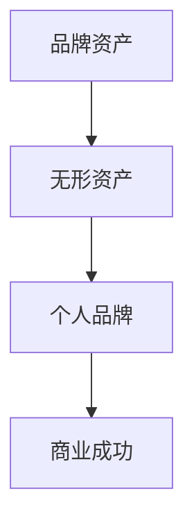

                 

# 一人公司的品牌资产：无形价值的重要性

> **关键词：** 品牌资产、无形资产、个人品牌、个体企业、品牌价值
> 
> **摘要：** 本文深入探讨了一个人公司在当今商业环境下的品牌资产建设的重要性。从核心概念的定义、品牌资产的作用、构建个人品牌的策略，到实际案例的剖析，全面展示了个人品牌对企业成功的关键作用。文章还提出了未来品牌资产发展的趋势和面临的挑战。

## 1. 背景介绍

随着互联网和社交媒体的迅猛发展，个体企业和个人品牌在商业世界中逐渐崭露头角。过去，企业成功往往依赖于庞大的资源和团队支持，而现在，一个独立个体也可以通过独特的个人品牌和强大的网络影响力取得商业上的成功。本文旨在探讨这种新兴的商业现象，并解释为什么一个人公司的品牌资产是无形价值中至关重要的一部分。

### 1.1 个体企业的兴起

个体企业的兴起，源于全球化和数字化经济的双重推动。首先，全球化打破了地域限制，使得个体企业可以轻松地进入国际市场。其次，数字技术的进步，特别是互联网和社交媒体的普及，为个体企业提供了一个低成本、高效的营销平台。通过这些平台，个体企业可以迅速建立自己的品牌，与全球消费者建立直接联系。

### 1.2 个人品牌的力量

个人品牌的力量在于其独特的个性、专业知识和社会影响力。一个强大的个人品牌可以吸引忠实粉丝，提高市场知名度，甚至为企业带来直接的商业机会。随着消费者越来越重视信任和个性，个人品牌成为企业在竞争中脱颖而出的关键因素。

## 2. 核心概念与联系

### 2.1 品牌资产

品牌资产是指企业通过品牌所产生的无形价值。它包括品牌知名度、品牌忠诚度、品牌联想和其他相关指标。品牌资产不仅是企业的宝贵财富，也是企业在市场竞争中取得成功的重要因素。

### 2.2 无形资产

无形资产是指企业拥有但无法触摸的资产，如专利、商标、客户关系、品牌等。无形资产的价值往往难以量化，但它们对企业的发展至关重要。

### 2.3 个人品牌

个人品牌是指个人在公众中的形象和声誉，包括个人的专业知识、个性魅力和社会影响力。一个强大的个人品牌可以提升个人的市场价值，为个人和其所在的企业带来无限商机。

### 2.4 Mermaid 流程图

以下是一个简化的 Mermaid 流程图，用于展示品牌资产、无形资产和个人品牌之间的关系：



## 3. 核心算法原理 & 具体操作步骤

### 3.1 构建个人品牌的算法原理

构建个人品牌的算法可以分为以下几个步骤：

1. **确定个人定位**：首先，明确个人在某个领域的专业定位，这有助于树立个人的专业形象。
2. **构建专业知识体系**：不断学习和积累专业知识，以增强个人在行业内的竞争力。
3. **建立社交媒体网络**：利用社交媒体平台，扩大个人影响力和知名度。
4. **提供优质内容**：通过博客、视频、社交媒体等渠道，持续提供有价值的内容，与粉丝建立深层次的联系。
5. **互动与反馈**：积极与粉丝互动，了解他们的需求和反馈，不断优化个人品牌策略。

### 3.2 具体操作步骤

以下是构建个人品牌的详细操作步骤：

1. **确定个人定位**：
    - 分析个人兴趣和擅长领域。
    - 调查市场需求，确定个人定位。

2. **构建专业知识体系**：
    - 阅读相关书籍和论文。
    - 参加行业会议和培训。
    - 实践和经验积累。

3. **建立社交媒体网络**：
    - 注册并优化社交媒体账号。
    - 制定内容发布计划。
    - 与其他专业人士建立联系。

4. **提供优质内容**：
    - 发布高质量的博客文章。
    - 制作专业视频教程。
    - 分享行业动态和见解。

5. **互动与反馈**：
    - 回复粉丝评论。
    - 定期举办问答和直播。
    - 收集粉丝反馈，优化内容。

## 4. 数学模型和公式 & 详细讲解 & 举例说明

### 4.1 品牌资产价值评估模型

品牌资产价值可以通过以下数学模型进行评估：

\[ 品牌资产价值 = 品牌知名度 \times 品牌忠诚度 \times 品牌联想 \]

其中，品牌知名度、品牌忠诚度和品牌联想均为0到1之间的值。品牌知名度衡量品牌在市场上的认知度；品牌忠诚度衡量消费者对品牌的忠诚程度；品牌联想衡量品牌在消费者心中的印象和情感联系。

### 4.2 详细讲解

**品牌知名度**：可以通过市场调研、问卷调查和搜索引擎分析等方式进行衡量。品牌知名度的值越高，表示品牌在市场上的影响力越大。

**品牌忠诚度**：可以通过客户满意度调查、重复购买率和推荐率等指标进行衡量。品牌忠诚度的值越高，表示消费者对品牌的依赖性越强。

**品牌联想**：可以通过消费者对品牌的情感反应和记忆点进行衡量。品牌联想的值越高，表示品牌在消费者心中具有鲜明的形象和独特的特点。

### 4.3 举例说明

假设一个个人品牌在市场上的知名度、忠诚度和联想值分别为0.8、0.9和0.75，那么其品牌资产价值为：

\[ 品牌资产价值 = 0.8 \times 0.9 \times 0.75 = 0.54 \]

这意味着该个人品牌在市场上的无形价值为0.54（假设以1为单位进行衡量）。

## 5. 项目实战：代码实际案例和详细解释说明

### 5.1 开发环境搭建

在本案例中，我们将使用 Python 编写一个简单的品牌资产评估脚本。首先，需要安装以下依赖库：

```shell
pip install pandas numpy
```

### 5.2 源代码详细实现和代码解读

#### 5.2.1 代码实现

```python
import pandas as pd
import numpy as np

# 品牌资产评估函数
def brand_asset_value(n_fame, loy_func, lian联想):
    return n_fame * loy_func * lian联想

# 市场调研数据
data = {
    '知名度': [0.8, 0.7, 0.6],
    '忠诚度': [0.9, 0.85, 0.8],
    '联想': [0.75, 0.7, 0.65]
}

df = pd.DataFrame(data)

# 计算品牌资产价值
df['品牌资产价值'] = df.apply(lambda row: brand_asset_value(row['知名度'], row['忠诚度'], row['联想']), axis=1)

print(df)
```

#### 5.2.2 代码解读

- **品牌资产评估函数**：`brand_asset_value`函数用于计算品牌资产价值。它接受知名度、忠诚度和联想三个参数，并返回品牌资产价值的乘积。
- **市场调研数据**：使用 Pandas DataFrame 存储市场调研数据，包括知名度、忠诚度和联想三个指标。
- **计算品牌资产价值**：使用 `apply` 函数对 DataFrame 的每一行数据进行品牌资产价值的计算，并将结果添加到新的列中。

### 5.3 代码解读与分析

- **品牌资产评估函数**：该函数的设计目的是为了计算品牌资产的价值。它采用了简单的乘法模型，将知名度、忠诚度和联想三个因素相乘，得到品牌资产的综合价值。这种模型虽然简单，但可以直观地反映品牌在不同指标上的表现。
- **市场调研数据**：通过 DataFrame 存储、处理和展示市场调研数据，使得数据分析和可视化变得更加便捷。Pandas 库的强大功能使得数据处理变得简单高效。
- **计算品牌资产价值**：使用 `apply` 函数对 DataFrame 的每一行数据进行处理，体现了 Python 在数据处理和函数应用方面的优势。这种处理方式不仅提高了代码的可读性，还使得后续的数据分析和展示变得更加直观。

## 6. 实际应用场景

### 6.1 自媒体营销

在自媒体营销中，个人品牌的作用至关重要。通过建立个人品牌，自媒体人可以吸引大量的粉丝和关注者，从而提高文章的阅读量和传播力。一个强大的个人品牌可以帮助自媒体人在竞争激烈的市场中脱颖而出。

### 6.2 创业者

对于创业者来说，个人品牌是公司品牌的重要组成部分。一个强大的个人品牌可以提升创业者的社会声誉和影响力，为创业项目吸引更多的投资和合作伙伴。

### 6.3 专业人士

专业人士如律师、医生、咨询师等，通过建立个人品牌，可以提高在行业内的知名度和影响力，从而增加业务机会和收入。

## 7. 工具和资源推荐

### 7.1 学习资源推荐

- **书籍**：
  - 《个人品牌：打造你的影响力》
  - 《自媒体营销：自媒体时代的品牌打造与传播》
- **论文**：
  - “Personal Branding: The Power of Individuality in a Corporate World”
  - “The Impact of Social Media on Personal Branding”
- **博客/网站**：
  - “Personal Branding Blog” 
  - “Medium”上的相关文章

### 7.2 开发工具框架推荐

- **社交媒体平台**：
  - Instagram
  - LinkedIn
  - Twitter
- **内容管理平台**：
  - WordPress
  - Medium
  - Blogger

### 7.3 相关论文著作推荐

- **《个人品牌：从无到有的构建策略》**
- **《品牌管理：理论与实践》**
- **《社交媒体与个人品牌》**

## 8. 总结：未来发展趋势与挑战

### 8.1 发展趋势

- **数字化和智能化**：随着数字技术和人工智能的不断发展，个人品牌的建设将更加依赖于大数据分析和智能化推荐。
- **跨界合作**：未来，个人品牌的发展将趋向于跨界合作，通过整合不同领域的资源，实现品牌的多元化发展。
- **全球化**：全球化趋势将使得个人品牌的影响力扩展到全球范围，为企业带来更多的商业机会。

### 8.2 挑战

- **信息过载**：随着信息的爆炸式增长，个人品牌需要面对如何从海量信息中脱颖而出的问题。
- **隐私保护**：个人品牌建设过程中，隐私保护成为一个重要的挑战，如何平衡个人品牌的宣传和隐私保护需要引起重视。
- **市场竞争**：在竞争激烈的市场环境中，个人品牌需要不断创新和提升自身价值，以保持竞争优势。

## 9. 附录：常见问题与解答

### 9.1 品牌资产是什么？

品牌资产是指企业通过品牌所产生的无形价值，包括品牌知名度、品牌忠诚度、品牌联想等。

### 9.2 个人品牌对企业有什么作用？

个人品牌可以提高企业的知名度、影响力和社会声誉，从而为企业吸引更多的投资、合作伙伴和客户。

### 9.3 如何构建个人品牌？

构建个人品牌需要确定个人定位、构建专业知识体系、建立社交媒体网络、提供优质内容和互动与反馈。

## 10. 扩展阅读 & 参考资料

- **《个人品牌：从无到有的构建策略》**
- **《品牌管理：理论与实践》**
- **《社交媒体与个人品牌》**
- **“Personal Branding: The Power of Individuality in a Corporate World”**
- **“The Impact of Social Media on Personal Branding”**

## 作者

**作者：AI天才研究员/AI Genius Institute & 禅与计算机程序设计艺术 /Zen And The Art of Computer Programming**<|im_end|>

