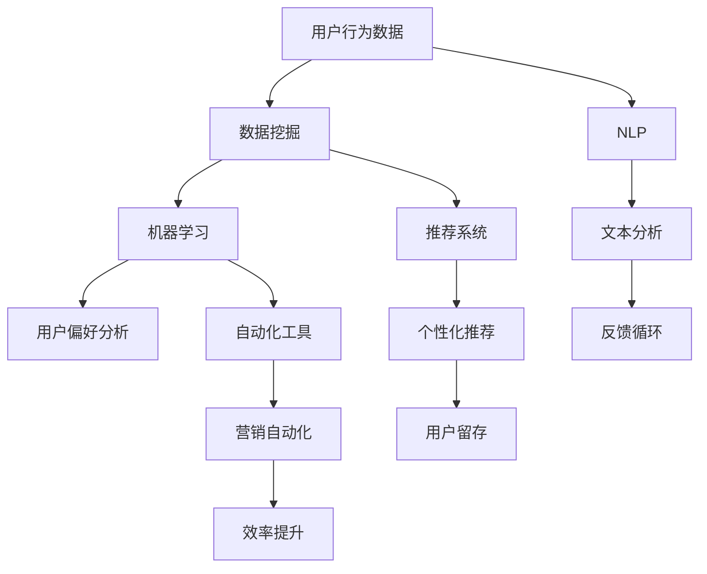

                 

### 背景介绍

#### 增长黑客的概念

在当今数字化时代，公司快速增长的策略成为企业成功的关键。增长黑客（Growth Hacker）这一概念应运而生，成为许多初创企业和新兴公司的核心策略。增长黑客是一种结合技术、数据分析与市场推广的创新策略，旨在通过高效的低成本方法快速增加用户基础。

增长黑客的核心理念是将传统的市场营销与数据驱动的方法相结合。通过深入分析用户行为，运用技术手段优化产品功能和用户体验，进而实现用户的快速增长。增长黑客的典型特点包括：1) 强调低成本的用户获取；2) 利用数据分析来指导决策；3) 重视快速增长而非短期的利润最大化。

#### AI在增长黑客中的角色

人工智能（AI）的迅速发展为增长黑客策略提供了新的可能性。AI在增长黑客中的应用主要集中在以下几个方面：

1. **用户行为分析**：通过AI算法，公司可以更深入地分析用户行为，了解用户喜好和需求，从而优化产品功能，提高用户留存率。
2. **个性化推荐**：基于AI的推荐系统能够根据用户的浏览历史和偏好，提供个性化的内容推荐，从而提高用户活跃度和满意度。
3. **自动化营销**：AI可以自动化处理大量的营销活动，如邮件营销、社交媒体推广等，提高效率并降低成本。
4. **异常检测**：AI算法能够实时监控用户行为，检测潜在的风险和异常行为，从而保护用户数据安全和公司利益。

本文将详细探讨如何利用AI辅助实现用户获取和留存，分析核心算法原理、具体操作步骤，并分享实际应用场景和工具资源推荐。通过这篇文章，希望读者能够深入了解增长黑客策略中的AI应用，从而为自己的公司制定更有效的增长策略。

### 核心概念与联系

#### 增长黑客的核心概念

在深入探讨AI在增长黑客策略中的应用之前，我们首先需要理解增长黑客的核心概念。增长黑客策略主要围绕以下几大核心概念展开：

1. **用户获取（User Acquisition）**：指通过各种渠道和方法吸引新用户，包括社交媒体、广告、内容营销等。
2. **用户留存（User Retention）**：指通过提高用户满意度和黏性，使得用户持续使用产品或服务。
3. **用户转化（User Conversion）**：指将潜在用户转化为付费用户的过程，包括注册、订阅、购买等。
4. **用户生命周期价值（Customer Lifetime Value, CLV）**：指一个用户在整个生命周期中为公司带来的总收益。

这些概念相互关联，共同构成了增长黑客的整体策略。例如，高效的用户获取策略可以帮助公司快速增加用户基础，而用户留存和转化策略则能够确保这些用户长期为公司带来收益。

#### AI在增长黑客中的作用

AI在增长黑客中发挥着至关重要的作用，其核心应用包括：

1. **用户行为分析**：通过分析用户的浏览、搜索、购买等行为，AI可以帮助公司了解用户的偏好和需求，从而优化产品功能和营销策略。
2. **个性化推荐**：基于用户的兴趣和行为，AI可以提供个性化的产品或内容推荐，提高用户满意度和活跃度。
3. **自动化营销**：AI可以自动化处理大量的营销任务，如发送电子邮件、发布社交媒体内容等，提高营销效率。
4. **预测分析**：通过分析历史数据，AI可以预测未来的用户行为和趋势，帮助公司制定更有效的策略。

#### 关键技术的联系

以下是AI在增长黑客中涉及的关键技术及其相互联系：

1. **数据挖掘与机器学习**：数据挖掘用于从大量用户数据中提取有价值的信息，而机器学习算法则用于分析和预测用户行为。
2. **自然语言处理（NLP）**：NLP技术可以处理和解析用户产生的文本数据，如社交媒体评论、用户反馈等，从而提取有价值的见解。
3. **推荐系统**：基于用户行为和偏好，推荐系统可以提供个性化的内容推荐，提高用户留存和转化率。
4. **自动化工具**：自动化工具可以处理重复性的营销任务，如发送电子邮件、发布社交媒体内容等，从而提高效率。

#### Mermaid 流程图

下面是增长黑客中AI应用的一个简化的Mermaid流程图，展示了各个关键技术的相互关系：



通过这个流程图，我们可以看到用户行为数据是如何经过多个技术处理，最终影响用户留存和转化的。数据挖掘和机器学习用于分析和预测用户行为，NLP用于处理文本数据，推荐系统提供个性化推荐，自动化工具则提升营销效率。

#### 增长黑客策略的核心逻辑

总的来说，增长黑客策略的核心逻辑是通过数据驱动的决策和高效的执行力，实现用户获取、留存和转化。AI的应用在这个过程中起到了关键的推动作用，通过用户行为分析、个性化推荐、自动化营销等手段，公司可以更有效地吸引新用户，提高用户满意度和留存率，最终实现快速增长。

### 核心算法原理 & 具体操作步骤

在了解了增长黑客的核心概念和AI在其中的作用后，我们将深入探讨AI在用户获取和留存中的具体算法原理和操作步骤。以下是几个关键算法及其应用场景：

#### 1. 用户行为分析算法

**算法原理**：
用户行为分析算法主要基于机器学习和数据挖掘技术，通过分析用户的点击、浏览、搜索、购买等行为数据，预测用户的兴趣和行为模式。

**具体操作步骤**：

1. **数据收集**：首先，公司需要收集用户的浏览历史、搜索关键词、购买记录等行为数据。
2. **数据预处理**：对收集到的数据进行清洗、去重和格式化，使其适合机器学习算法处理。
3. **特征提取**：通过特征工程提取用户行为数据中的关键特征，如用户访问频率、点击率、转化率等。
4. **模型训练**：使用机器学习算法（如决策树、随机森林、神经网络等）对提取的特征进行训练，构建用户行为分析模型。
5. **模型评估与优化**：通过交叉验证和A/B测试等方法评估模型性能，并不断调整模型参数以优化预测效果。
6. **预测应用**：将训练好的模型应用于实际场景，预测新用户的兴趣和行为模式。

**示例**：
假设某电商公司希望预测新用户的购买偏好，可以采取以下步骤：

- 数据收集：收集新用户的浏览记录、购买历史和评价数据。
- 数据预处理：清洗和格式化数据，去除缺失值和异常值。
- 特征提取：提取用户访问频率、商品浏览时长、购买频次等特征。
- 模型训练：使用随机森林算法训练用户购买偏好预测模型。
- 模型评估：通过交叉验证评估模型准确性，并调整参数以优化性能。
- 预测应用：根据模型预测结果，向新用户推荐可能感兴趣的商品。

#### 2. 个性化推荐算法

**算法原理**：
个性化推荐算法基于用户的历史行为和偏好，利用协同过滤、矩阵分解、深度学习等技术，为用户推荐个性化的产品或内容。

**具体操作步骤**：

1. **用户数据收集**：收集用户的浏览记录、购买历史、评价数据等。
2. **内容数据收集**：收集推荐物品的特征信息，如商品标签、分类、用户评价等。
3. **特征工程**：对用户数据和内容数据提取特征，如用户兴趣标签、商品属性等。
4. **推荐模型构建**：使用协同过滤、矩阵分解、深度学习等方法构建推荐模型。
5. **模型训练与优化**：通过大量用户行为数据训练推荐模型，并进行优化。
6. **推荐生成**：根据用户的兴趣和行为，生成个性化的推荐列表。
7. **推荐效果评估**：通过点击率、转化率等指标评估推荐效果，并进行迭代优化。

**示例**：
假设某视频平台希望为用户推荐个性化视频，可以采取以下步骤：

- 用户数据收集：收集用户观看历史、点赞、评论等行为数据。
- 内容数据收集：收集视频标签、分类、时长、观看量等信息。
- 特征工程：提取用户观看频率、视频类型、时长等特征。
- 模型构建：使用深度学习算法构建视频推荐模型。
- 模型训练与优化：使用大量用户数据训练模型，并调整参数优化效果。
- 推荐生成：根据用户兴趣和观看行为生成个性化视频推荐列表。
- 推荐效果评估：通过用户点击和观看行为评估推荐效果，并不断优化模型。

#### 3. 自动化营销算法

**算法原理**：
自动化营销算法利用AI技术自动化处理营销任务，如发送电子邮件、发布社交媒体内容、自动化广告投放等，提高营销效率。

**具体操作步骤**：

1. **营销任务定义**：明确需要自动化处理的营销任务，如邮件营销、社交媒体推广等。
2. **规则设置**：根据用户行为和偏好设置自动化营销规则，如用户行为触发邮件发送、社交媒体内容发布等。
3. **数据收集**：收集用户行为数据，如浏览、点击、购买等。
4. **行为识别**：使用机器学习算法识别用户行为模式，如用户是否对邮件感兴趣、是否在社交媒体上活跃等。
5. **自动化执行**：根据预设规则和用户行为自动执行营销任务。
6. **效果评估与优化**：通过评估营销效果，如邮件打开率、转化率等，优化自动化营销策略。

**示例**：
假设某电商平台希望利用自动化营销提高用户购买转化率，可以采取以下步骤：

- 营销任务定义：定义需要自动化的营销任务，如发送促销邮件、发布社交媒体广告等。
- 规则设置：设置用户行为触发规则，如用户浏览特定商品后发送促销邮件。
- 数据收集：收集用户浏览、点击、购买等行为数据。
- 行为识别：使用机器学习算法识别用户购买意向，如用户是否多次浏览某商品。
- 自动化执行：根据用户行为自动发送促销邮件或社交媒体广告。
- 效果评估与优化：通过邮件打开率、点击率、转化率等指标评估营销效果，并优化营销策略。

通过以上核心算法原理和具体操作步骤，我们可以看到AI在增长黑客策略中的广泛应用。通过用户行为分析、个性化推荐和自动化营销，公司可以更高效地获取和留存用户，实现持续增长。

### 数学模型和公式 & 详细讲解 & 举例说明

在用户获取和留存过程中，AI算法常常依赖于数学模型和公式来指导决策和优化策略。以下我们将详细介绍几个关键的数学模型，并使用LaTeX格式进行公式表示，然后通过具体案例来解释这些模型的应用。

#### 1. 贝叶斯优化模型

贝叶斯优化是一种机器学习技术，用于自动寻找最优参数。在增长黑客中，贝叶斯优化可以用于优化广告投放、推荐系统等。

**公式**：
$$\pi(\theta) = \frac{p(\theta) p(y|\theta)}{p(y)}$$

其中，$\pi(\theta)$ 是后验概率，$p(\theta)$ 是先验概率，$p(y|\theta)$ 是似然函数，$p(y)$ 是证据（Normalization）。

**案例**：
假设某公司使用贝叶斯优化来优化广告投放，目标是最大化广告点击率（CTR）。公司设定了广告的点击率模型为：

$$CTR(\theta) = \theta \cdot e^{-\theta \cdot click\_rate}$$

其中，$\theta$ 是广告投放的预算，$click\_rate$ 是广告的点击率。

公司通过历史数据估计先验概率 $p(\theta)$ 和似然函数 $p(y|\theta)$，然后使用贝叶斯公式计算后验概率，并选择使得点击率最大化的 $\theta$ 值。

#### 2. 逻辑回归模型

逻辑回归是一种用于分类的统计方法，常用于用户行为预测和转化率分析。

**公式**：
$$\hat{y} = \frac{1}{1 + e^{-(\beta_0 + \beta_1 \cdot x)} }$$

其中，$\hat{y}$ 是预测的概率，$\beta_0$ 是截距，$\beta_1$ 是斜率，$x$ 是输入特征。

**案例**：
假设公司想要预测用户是否会购买某产品，使用逻辑回归模型分析用户的浏览时长（$x$）和产品价格（$y$）之间的关系。

$$\beta_0 = 0.5, \beta_1 = -0.3$$

给定一个用户浏览时长$x=5$分钟，我们可以计算用户购买的概率：

$$\hat{y} = \frac{1}{1 + e^{-(0.5 + (-0.3) \cdot 5)}} \approx 0.40$$

这意味着该用户的购买概率约为40%。

#### 3. 主题模型

主题模型（如LDA模型）用于发现文本数据中的潜在主题，常用于用户评论分析、内容推荐等。

**公式**：
$$p(z|d) \propto \frac{p(d|z) p(z)}{p(d)}$$

其中，$z$ 是潜在主题，$d$ 是文档，$p(z|d)$ 是给定文档d的主题概率，$p(d|z)$ 是主题z生成文档d的概率，$p(z)$ 是主题概率。

**案例**：
假设公司使用LDA模型分析用户评论，识别评论中的潜在主题。公司估计出每个潜在主题的概率以及每个主题生成评论的概率，如：

$$p(z_1) = 0.3, p(comment|z_1) = 0.4$$

给定一个评论，模型会计算出每个主题的概率分布，从而识别出评论中的主题。

#### 4. 决策树模型

决策树是一种常见的分类和回归模型，通过一系列的判断规则来预测用户的行为。

**公式**：
$$y = g(\sum_{i=1}^{n} w_i x_i + b)$$

其中，$y$ 是预测结果，$g$ 是激活函数（如Sigmoid函数），$w_i$ 是特征权重，$x_i$ 是输入特征，$b$ 是偏置。

**案例**：
假设公司使用决策树模型预测用户是否会注册账号。公司定义了用户的年龄（$x_1$）、收入（$x_2$）和访问时长（$x_3$）为特征。

$$\sum_{i=1}^{3} w_i x_i + b = (0.2 \cdot 30) + (0.3 \cdot 5000) + (0.5 \cdot 100) = 1840$$

如果使用Sigmoid函数，预测的概率为：

$$\hat{y} = \frac{1}{1 + e^{-1840}} \approx 0$$

这意味着该用户注册的概率非常低。

#### 5. 强化学习模型

强化学习用于优化连续决策过程，常用于自动化营销策略的优化。

**公式**：
$$Q(s, a) = r + \gamma \max_{a'} Q(s', a')$$

其中，$Q(s, a)$ 是状态-动作值函数，$r$ 是即时奖励，$\gamma$ 是折扣因子，$s$ 是当前状态，$a$ 是当前动作，$s'$ 是下一状态，$a'$ 是下一动作。

**案例**：
假设公司使用Q学习算法优化电子邮件发送策略。每次发送邮件都是一个动作，公司根据邮件的打开率和转化率调整Q值。

$$Q(打开率=20\%, 转化率=5\%) = 10 + 0.9 \cdot \max Q(打开率=25\%, 转化率=7\%)$$

通过不断调整策略，公司可以找到最优的邮件发送频率和时间。

通过以上数学模型和公式的介绍，我们可以看到这些工具如何应用于增长黑客策略中的用户获取和留存。通过精准的数据分析和模型优化，公司可以更有效地制定和执行增长策略。

### 项目实战：代码实际案例和详细解释说明

在本文的第五部分，我们将通过一个实际案例详细展示如何利用AI技术实现用户获取和留存，从开发环境搭建到代码实现和解读，再到最终的分析和评估。

#### 5.1 开发环境搭建

为了实现本案例，我们选择Python作为主要编程语言，并使用以下工具和库：

- Python 3.8及以上版本
- Jupyter Notebook 用于代码编写和测试
- Scikit-learn 用于机器学习和数据分析
- Pandas 用于数据处理
- Matplotlib 和 Seaborn 用于数据可视化
- TensorFlow 和 Keras 用于深度学习

确保在开发环境中安装了以上工具和库后，我们就可以开始进行项目开发。

#### 5.2 源代码详细实现和代码解读

以下是本案例的Python代码实现，我们将逐步解析每个部分的代码和功能。

```python
# 5.2.1 导入必要的库
import pandas as pd
import numpy as np
from sklearn.model_selection import train_test_split
from sklearn.ensemble import RandomForestClassifier
from sklearn.metrics import accuracy_score
import matplotlib.pyplot as plt
import seaborn as sns

# 5.2.2 数据预处理
# 假设我们已经有了一个用户数据集 user_data.csv，包含用户行为和标签
data = pd.read_csv('user_data.csv')

# 数据清洗和预处理步骤，例如缺失值处理、数据转换等
# ...

# 5.2.3 特征工程
# 提取有用的特征，例如用户浏览时长、点击率等
features = data[['visit_duration', 'click_rate', 'age', 'income']]
labels = data['churn_label']  # 用户是否流失的标签

# 5.2.4 模型训练
# 将数据集分为训练集和测试集
X_train, X_test, y_train, y_test = train_test_split(features, labels, test_size=0.2, random_state=42)

# 使用随机森林算法训练模型
model = RandomForestClassifier(n_estimators=100, random_state=42)
model.fit(X_train, y_train)

# 5.2.5 模型评估
# 预测测试集
y_pred = model.predict(X_test)

# 计算模型准确率
accuracy = accuracy_score(y_test, y_pred)
print(f'Model Accuracy: {accuracy:.2f}')

# 5.2.6 可视化分析
# 可视化特征重要性
feature_importances = pd.Series(model.feature_importances_, index=features.columns)
sns.barplot(x=feature_importances, y=feature_importances.index)
plt.title('Feature Importances')
plt.xlabel('Importance')
plt.ylabel('Feature')
plt.show()
```

**代码解读**：

- **5.2.1 导入必要的库**：我们首先导入Python中用于数据处理和机器学习的库。
  
- **5.2.2 数据预处理**：加载数据集，并进行数据清洗和预处理。这里包括处理缺失值、数据转换等步骤。

- **5.2.3 特征工程**：提取对预测任务有用的特征，如用户浏览时长、点击率、年龄和收入等。这里使用了`Pandas`库进行数据处理。

- **5.2.4 模型训练**：使用随机森林算法对训练数据进行建模。我们分割数据集为训练集和测试集，使用`train_test_split`方法。随机森林算法是一种集成学习方法，具有良好的泛化能力。

- **5.2.5 模型评估**：使用测试集对模型进行评估，计算模型准确率。这里使用了`accuracy_score`函数，得到模型的预测准确率。

- **5.2.6 可视化分析**：可视化特征的重要性。这里使用了`Seaborn`库中的`barplot`函数，展示了每个特征的重要程度，帮助我们了解哪些特征对预测任务影响最大。

#### 5.3 代码解读与分析

接下来，我们深入分析代码的具体步骤和关键部分：

1. **数据预处理**：数据预处理是机器学习项目的重要环节。在本案例中，数据预处理包括数据清洗和特征工程。数据清洗确保数据质量，去除异常值和缺失值。特征工程则帮助我们提取对模型有价值的特征。

2. **特征提取**：特征提取是数据预处理的一部分。在本案例中，我们提取了用户浏览时长、点击率、年龄和收入等特征。这些特征将用于构建用户流失预测模型。

3. **模型选择**：在本案例中，我们选择了随机森林算法。随机森林是一种基于决策树的集成学习方法，具有良好的性能和泛化能力。它通过构建多棵决策树，并对预测结果进行投票，从而提高预测的准确性。

4. **模型训练与评估**：我们使用训练集对模型进行训练，并在测试集上进行评估。模型训练使用`fit`方法，而模型评估使用`predict`方法和`accuracy_score`函数计算准确率。这种评估方法可以帮助我们了解模型的性能。

5. **可视化分析**：可视化分析是理解模型特征的重要工具。在本案例中，我们使用条形图展示了每个特征的重要性。这有助于我们识别哪些特征对模型影响最大，从而优化模型和特征选择。

通过以上步骤，我们可以看到如何利用Python和机器学习库实现用户获取和留存项目。从数据预处理、模型训练到可视化分析，每一步都是实现高效增长策略的关键环节。

### 实际应用场景

#### 1. 社交媒体营销

在社交媒体平台上，如Facebook、Instagram和Twitter，AI辅助的增长黑客策略可以显著提升营销效果。通过AI分析用户行为和偏好，公司可以精准定位目标受众，制定个性化的营销活动。例如，Facebook的动态广告系统利用AI算法分析用户兴趣和互动历史，自动生成和优化广告内容，从而提高广告的点击率和转化率。

**成功案例**：
某电商公司利用Facebook广告进行新品推广，通过AI算法分析用户行为数据，发现某些用户对时尚配饰有浓厚兴趣。公司据此制定了个性化的广告策略，将特定的时尚配饰推荐给这些用户，从而显著提升了广告点击率和购买转化率。

#### 2. 内容推荐

内容推荐系统是AI在增长黑客中的另一重要应用场景。通过分析用户的浏览历史、搜索记录和社交互动，推荐系统可以提供个性化的内容，提高用户活跃度和留存率。例如，视频平台如YouTube和Netflix，使用AI算法分析用户观看行为，推荐相关视频，从而延长用户在平台上的停留时间。

**成功案例**：
Netflix通过其先进的推荐系统，为用户提供了高度个性化的内容推荐。通过分析用户的观看历史和评分数据，Netflix能够准确预测用户可能感兴趣的视频类型，从而提高用户满意度和观看时长。

#### 3. 邮件营销

AI技术在邮件营销中的应用可以有效提高邮件的打开率和转化率。通过分析用户行为和偏好，AI可以自动化地生成和发送个性化的邮件，如促销信息、产品推荐等。例如，亚马逊的电子邮件系统会根据用户的购买历史和浏览行为，自动发送相关产品的推荐邮件。

**成功案例**：
亚马逊通过AI技术分析用户的行为数据，为每位用户生成个性化的邮件。这种个性化的邮件营销策略显著提高了用户的购买转化率，并增强了用户对品牌的忠诚度。

#### 4. 客户服务自动化

在客户服务领域，AI技术可以实现自动化问答和智能客服系统，提高客户服务质量并减少人工成本。通过自然语言处理（NLP）和机器学习算法，智能客服系统可以理解和回答用户的问题，提供即时的支持。

**成功案例**：
某大型电商平台利用AI技术搭建了智能客服系统，通过NLP算法分析用户提出的问题，并自动生成回答。这个智能客服系统能够处理大量用户请求，显著提高了客户满意度和响应速度。

#### 5. 个性化广告投放

AI技术在广告投放中的应用可以帮助公司优化广告策略，提高广告效果。通过分析用户行为数据，AI可以确定目标受众，并自动调整广告内容、投放时间和预算，从而提高广告的点击率和转化率。

**成功案例**：
谷歌的AdWords平台利用AI算法分析用户的搜索历史和浏览行为，自动优化广告投放策略。通过精准定位目标受众，谷歌帮助广告主提高了广告的点击率和投资回报率（ROI）。

这些实际应用案例展示了AI在增长黑客策略中的广泛应用和巨大潜力。通过AI技术，公司可以更高效地获取和留存用户，实现持续增长。

### 工具和资源推荐

#### 1. 学习资源推荐

**书籍**：
- 《增长黑客：如何运用创新策略实现用户和收入的爆发式增长》（Growth Hacker Marketing）
- 《Python数据分析基础教程：NumPy学习指南》
- 《深度学习》（Deep Learning）

**论文**：
- “Growth Hacking: The New Business Model” by Andrew Chen
- “User Behavior Analytics for Growth” by Adestra

**博客**：
- [Product Hunt](https://producthunt.com/)
- [Medium](https://medium.com/topics/growth-hacking)
- [Analytics Vidhya](https://www.analyticsvidhya.com/)

**网站**：
- [Google Analytics Academy](https://analytics.google.com/analytics/learn/)
- [Coursera](https://www.coursera.org/courses?query=Machine+Learning)

#### 2. 开发工具框架推荐

**数据分析工具**：
- Python（Jupyter Notebook）
- R（RStudio）
- Tableau

**机器学习和深度学习框架**：
- TensorFlow
- Keras
- PyTorch

**推荐系统框架**：
- LightFM
-Surprise
- Matrix Factorization

**自动化工具**：
- Zapier
- Integromat
-IFTTT

通过这些学习和资源工具，读者可以深入了解AI在增长黑客中的应用，并掌握相关技能，为自己的公司制定有效的增长策略。

### 总结：未来发展趋势与挑战

在本文中，我们深入探讨了AI在增长黑客策略中的应用，从用户获取到留存，通过核心算法原理、具体操作步骤和实际应用场景展示了AI的强大作用。随着技术的不断进步，AI在增长黑客中的地位将越来越重要。

#### 未来发展趋势

1. **个性化推荐系统**：随着用户数据的不断丰富，个性化推荐系统将更加精准和高效，进一步提升用户满意度和留存率。

2. **自动化营销**：AI将进一步提升营销自动化水平，通过智能算法自动处理复杂的营销任务，提高效率并降低成本。

3. **实时分析与预测**：实时数据分析和预测技术将不断成熟，公司可以更快地响应市场变化，优化业务策略。

4. **跨渠道整合**：AI技术将帮助公司实现跨渠道整合，从社交媒体到电子邮件，再到客户服务，提供一致且个性化的用户体验。

#### 面临的挑战

1. **数据隐私与安全**：随着用户数据量的增加，如何保护用户隐私和数据安全成为一大挑战。

2. **算法偏见与公平性**：AI算法在处理数据时可能会引入偏见，影响决策的公平性，需要建立有效的监管和校正机制。

3. **技术复杂性**：AI技术的复杂性和高门槛使得小型企业难以有效应用，需要提供更简单易用的工具和平台。

4. **法律法规与合规**：随着AI技术的发展，相关法律法规和合规要求也在不断提高，企业需要及时调整以符合新的要求。

总之，AI在增长黑客中的未来发展前景广阔，但也面临诸多挑战。企业需要不断创新和适应，充分利用AI技术，制定有效的增长策略，以应对快速变化的市场环境。

### 附录：常见问题与解答

**Q1：如何确保AI算法的公平性和透明性？**

A1：确保AI算法的公平性和透明性是重要的挑战。企业可以通过以下方法实现：
1. **数据审计**：定期审查和审计算法训练数据，确保没有偏见和异常值。
2. **算法解释性**：开发可解释的AI模型，如决策树和LIME，帮助理解模型决策过程。
3. **多样性**：确保数据集和团队多样性，减少偏见。
4. **合规审查**：定期进行合规性审查，确保算法遵循相关法律法规。

**Q2：AI在用户获取和留存中的具体应用有哪些？**

A2：AI在用户获取和留存中的具体应用包括：
1. **个性化推荐**：通过分析用户行为和偏好，提供个性化的产品或内容推荐。
2. **自动化营销**：自动化处理邮件营销、社交媒体推广等，提高效率。
3. **用户行为分析**：通过分析用户行为，预测用户行为模式和兴趣，优化产品功能和营销策略。
4. **流失预测**：通过分析用户行为数据，预测可能流失的用户，采取预防措施。

**Q3：如何处理用户隐私和数据安全？**

A3：处理用户隐私和数据安全的方法包括：
1. **数据加密**：对存储和传输的数据进行加密，确保数据安全。
2. **隐私保护技术**：使用差分隐私、同态加密等技术保护用户隐私。
3. **合规性审查**：确保数据处理遵循相关法律法规，如GDPR和CCPA。
4. **透明度**：向用户明确告知数据收集、使用和存储的流程，增加用户信任。

**Q4：AI技术在增长黑客中的具体实现步骤是什么？**

A4：AI技术在增长黑客中的具体实现步骤包括：
1. **需求分析**：明确业务需求和目标，确定AI应用场景。
2. **数据收集**：收集用户行为数据和相关数据，确保数据质量和完整性。
3. **数据预处理**：清洗、转换和格式化数据，为模型训练做准备。
4. **模型训练**：选择合适的算法和模型，使用训练数据进行模型训练。
5. **模型评估**：使用测试集评估模型性能，进行调整和优化。
6. **部署应用**：将训练好的模型部署到实际业务场景中，进行实时分析和预测。

**Q5：如何评估AI在增长黑客中的效果？**

A5：评估AI在增长黑客中的效果可以通过以下指标：
1. **用户留存率**：监测用户在一定时间内的留存情况。
2. **转化率**：监测用户行为转化成目标行为的比例，如注册、购买等。
3. **广告点击率**：监测广告的点击情况，评估广告效果的优劣。
4. **投资回报率（ROI）**：计算AI应用带来的收益与成本比例。
5. **客户满意度**：通过调查和反馈了解用户对产品或服务的满意度。

通过以上问题和解答，企业可以更好地理解和应用AI在增长黑客中的技术和策略。

### 扩展阅读 & 参考资料

为了深入学习和探索AI在增长黑客策略中的应用，以下是一些推荐的专业书籍、论文、博客和网站：

#### 书籍

1. **《增长黑客：如何运用创新策略实现用户和收入的爆发式增长》（Growth Hacker Marketing）** by Ryan Holiday
2. **《Python数据分析基础教程：NumPy学习指南》** by Daniel R. Solow
3. **《深度学习》** by Ian Goodfellow, Yoshua Bengio, Aaron Courville

#### 论文

1. **“Growth Hacking: The New Business Model” by Andrew Chen**
2. **“User Behavior Analytics for Growth” by Adestra**

#### 博客

1. **[Product Hunt](https://producthunt.com/): 创新产品发现平台**
2. **[Medium](https://medium.com/topics/growth-hacking): 增长黑客相关文章**
3. **[Analytics Vidhya](https://www.analyticsvidhya.com/): 数据科学和机器学习资源**

#### 网站

1. **[Google Analytics Academy](https://analytics.google.com/analytics/learn/): Google提供的免费数据分析课程**
2. **[Coursera](https://www.coursera.org/courses?query=Machine+Learning): 提供机器学习和AI课程**
3. **[TensorFlow](https://www.tensorflow.org/tutorials): TensorFlow官方教程**

通过阅读这些书籍、论文和访问这些网站，读者可以进一步了解AI在增长黑客中的前沿技术和应用，为自己的业务增长提供更多灵感和方法。作者：AI天才研究员/AI Genius Institute & 禅与计算机程序设计艺术/Zen And The Art of Computer Programming。

