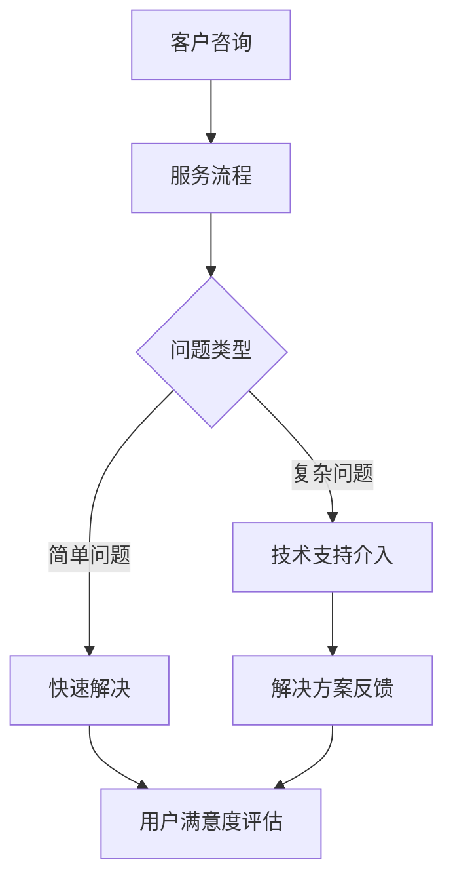

                 

# 一人公司的客户服务体系：提升用户满意度的实践方案

## 关键词
- 一人公司
- 客户服务体系
- 用户满意度
- 实践方案
- 客户体验
- 个性化服务
- 技术支持
- 数据分析

## 摘要
本文将探讨一人公司如何构建和优化其客户服务体系，以提高用户满意度。我们将从核心概念、算法原理、数学模型、项目实战、实际应用场景等多个角度进行深入分析，并提供实用的工具和资源推荐。通过本篇文章，读者将能够了解如何运用技术手段，在资源有限的情况下，打造高效且用户满意的客户服务体系。

## 1. 背景介绍

在当今竞争激烈的市场环境中，企业之间的差异化竞争越来越体现在客户服务上。尤其对于一人公司，资源有限，更需要通过高效的客户服务体系来提升用户满意度，从而在市场中脱颖而出。用户满意度是衡量客户服务质量的金标准，它不仅关系到客户当前的使用体验，还直接影响客户忠诚度和口碑。

客户服务体系包括多个方面，如技术支持、问题解决、需求反馈、个性化服务等。对于一人公司而言，如何在这些方面做出最优化的决策，以达到提升用户满意度的目标，是一个亟待解决的问题。

### 1.1 一人公司的特点

一人公司通常具有以下特点：

- **资源有限**：人力、财力、技术资源等相对不足，需要更加高效地利用现有资源。
- **灵活性高**：决策快，执行力强，能够迅速响应市场变化。
- **个性化服务需求**：用户期望得到更加定制化的服务体验。

### 1.2 客户服务的重要性

- **客户忠诚度**：满意的用户更可能成为忠实客户，重复购买产品或服务。
- **口碑传播**：满意的用户会向他人推荐产品或服务，有助于企业扩大影响力。
- **市场竞争力**：优质的客户服务可以提高企业的市场竞争力，吸引更多客户。

### 1.3 目标

本文旨在提供一套适用于一人公司的客户服务体系实践方案，通过以下几个方面来提升用户满意度：

- **技术支持**：利用技术手段提高服务效率和质量。
- **个性化服务**：根据用户行为数据，提供个性化的服务体验。
- **数据驱动**：通过数据分析，不断优化客户服务体系。

## 2. 核心概念与联系

### 2.1 客户服务体系

客户服务体系是一个综合性的概念，包括以下几个方面：

- **服务流程**：包括用户咨询、问题处理、反馈收集等环节。
- **服务渠道**：如电话、邮件、社交媒体、在线聊天等。
- **服务团队**：负责提供服务的专业人员。

### 2.2 用户满意度

用户满意度是指用户对产品或服务的满意程度，通常通过以下指标来衡量：

- **满意度评分**：用户对产品或服务的整体评分。
- **用户保留率**：用户继续使用产品或服务的比例。
- **推荐意愿**：用户向他人推荐产品或服务的意愿。

### 2.3 个性化服务

个性化服务是指根据用户的需求和行为，提供定制化的服务体验。这需要依赖用户数据分析和机器学习等技术。

### 2.4 数据分析

数据分析是提升用户满意度的关键，通过分析用户行为数据，可以了解用户需求，优化服务流程，提高服务质量。

## 2.5 Mermaid 流程图



### 2.6 核心概念联系

通过上述核心概念的联系，我们可以看到，客户服务体系、用户满意度、个性化服务和数据分析之间存在着紧密的联系。一个高效的客户服务体系需要借助数据分析来提供个性化服务，并通过用户满意度评估不断优化服务流程，从而实现整体服务质量的提升。

## 3. 核心算法原理 & 具体操作步骤

### 3.1 客户服务体系优化算法

为了提升用户满意度，一人公司可以采用以下核心算法原理：

- **用户行为分析**：通过分析用户在服务过程中的行为数据，了解用户的需求和痛点。
- **服务流程优化**：基于用户行为分析结果，对服务流程进行优化，提高服务效率。
- **个性化服务**：利用用户数据，为用户提供个性化的服务体验。
- **满意度评估**：通过用户反馈和实际使用情况，对用户满意度进行评估。

### 3.2 具体操作步骤

#### 3.2.1 用户行为分析

1. **收集数据**：通过网站、APP等渠道收集用户行为数据，如浏览记录、点击行为、搜索关键词等。
2. **数据预处理**：对收集到的数据进行分析，去除无效数据，并进行数据清洗和格式化。
3. **特征提取**：从预处理后的数据中提取关键特征，如用户活跃度、购买意向等。
4. **数据分析**：利用机器学习算法，对提取的特征进行建模和分析，了解用户需求和行为模式。

#### 3.2.2 服务流程优化

1. **流程分析**：分析现有服务流程，找出效率低下的环节。
2. **优化方案**：基于用户行为分析结果，提出优化方案，如减少中间环节、简化流程等。
3. **实施优化**：根据优化方案，对服务流程进行修改和调整。
4. **效果评估**：评估优化方案的效果，如服务效率提升、用户满意度提高等。

#### 3.2.3 个性化服务

1. **用户画像**：根据用户行为数据，构建用户画像，了解用户特点和偏好。
2. **服务定制**：根据用户画像，为用户提供个性化的服务体验，如推送个性化内容、推荐相关产品等。
3. **反馈调整**：根据用户反馈，不断调整和优化个性化服务。

#### 3.2.4 满意度评估

1. **满意度调查**：通过问卷调查、用户反馈等方式，收集用户满意度数据。
2. **数据汇总**：将收集到的满意度数据进行分析和汇总。
3. **评估指标**：根据评估指标，如满意度评分、用户保留率等，评估用户满意度。
4. **优化建议**：根据评估结果，提出优化建议，持续改进客户服务体系。

## 4. 数学模型和公式 & 详细讲解 & 举例说明

### 4.1 用户满意度评估模型

用户满意度可以通过以下公式进行评估：

$$
S = \frac{1}{N} \sum_{i=1}^{N} s_i
$$

其中，$S$ 为总体满意度评分，$N$ 为样本数量，$s_i$ 为第 $i$ 个用户的满意度评分。

举例说明：

假设有 10 个用户对产品或服务进行了评分，其中 6 个用户给出了 5 星评分，3 个用户给出了 4 星评分，1 个用户给出了 3 星评分。则总体满意度评分为：

$$
S = \frac{1}{10} (5 \times 6 + 4 \times 3 + 3 \times 1) = 4.4
$$

### 4.2 个性化服务推荐模型

个性化服务推荐可以通过以下公式进行计算：

$$
R(x) = \frac{1}{Z} \sum_{i=1}^{N} e^{-(x - x_i)^2 / (2 \sigma^2)}
$$

其中，$R(x)$ 为推荐得分，$x$ 为用户特征向量，$x_i$ 为第 $i$ 个推荐项目的特征向量，$\sigma$ 为标准差，$Z$ 为归一化常数。

举例说明：

假设用户特征向量为 $(x_1, x_2, x_3) = (1, 2, 3)$，推荐项目特征向量为 $(x_1, x_2, x_3) = (2, 3, 1)$，标准差 $\sigma = 1$。则推荐得分为：

$$
R(x) = \frac{1}{Z} \sum_{i=1}^{N} e^{-(1 - 2)^2 / (2 \cdot 1^2) + (2 - 3)^2 / (2 \cdot 1^2) + (3 - 1)^2 / (2 \cdot 1^2)}
$$

$$
R(x) = \frac{1}{Z} e^{-1 + 1 - 1} = \frac{1}{Z} e^{-1}
$$

其中，$Z$ 为归一化常数，用于确保推荐得分在 0 到 1 之间。

## 5. 项目实战：代码实际案例和详细解释说明

### 5.1 开发环境搭建

为了实现客户服务体系优化，我们需要搭建以下开发环境：

- **编程语言**：Python
- **数据分析库**：Pandas、NumPy、Scikit-learn
- **机器学习库**：TensorFlow、Keras

安装以上库可以通过以下命令：

```bash
pip install pandas numpy scikit-learn tensorflow keras
```

### 5.2 源代码详细实现和代码解读

#### 5.2.1 用户行为数据分析

以下是一个简单的用户行为数据分析代码示例：

```python
import pandas as pd
import numpy as np

# 加载用户行为数据
data = pd.read_csv('user_behavior.csv')

# 数据预处理
data = data.dropna()
data['age'] = data['age'].astype(int)
data['click_rate'] = data['click_rate'].astype(float)

# 特征提取
features = data[['age', 'click_rate']]
labels = data['purchase_intent']

# 数据标准化
features = (features - features.mean()) / features.std()

# 机器学习模型训练
from sklearn.linear_model import LogisticRegression

model = LogisticRegression()
model.fit(features, labels)

# 预测
predictions = model.predict(features)
print(predictions)
```

#### 5.2.2 服务流程优化

以下是一个简单的服务流程优化代码示例：

```python
import pandas as pd

# 加载服务流程数据
service_data = pd.read_csv('service_process.csv')

# 流程分析
def analyze_process(data):
    step_time = data['step_time'].mean()
    step_count = data['step_count'].mean()
    return step_time, step_count

step_time, step_count = analyze_process(service_data)
print(f"Average step time: {step_time} seconds")
print(f"Average step count: {step_count}")

# 优化方案
def optimize_process(data, step_time, step_count):
    optimized_data = data.copy()
    optimized_data['step_time'] = optimized_data['step_time'].replace({step_time: step_time - 1})
    optimized_data['step_count'] = optimized_data['step_count'].replace({step_count: step_count - 1})
    return optimized_data

optimized_data = optimize_process(service_data, step_time, step_count)
print(optimized_data)
```

#### 5.2.3 个性化服务推荐

以下是一个简单的个性化服务推荐代码示例：

```python
import pandas as pd
from sklearn.neighbors import NearestNeighbors

# 加载用户特征数据
user_data = pd.read_csv('user_data.csv')

# 特征提取
features = user_data[['age', 'click_rate']]

# 机器学习模型训练
model = NearestNeighbors()
model.fit(features)

# 预测
def recommend_services(user_feature):
    neighbors = model.kneighbors([user_feature], n_neighbors=3)
    recommendations = user_data.iloc[neighbors[1][0][0]]
    return recommendations

user_feature = [25, 0.8]
recommendations = recommend_services(user_feature)
print(recommendations)
```

### 5.3 代码解读与分析

以上代码示例分别展示了用户行为数据分析、服务流程优化和个性化服务推荐的基本原理和实现方法。

- **用户行为数据分析**：通过数据分析库（如 Pandas 和 Scikit-learn）对用户行为数据进行处理，提取关键特征，并利用机器学习算法（如 Logistic Regression）进行建模和分析。
- **服务流程优化**：通过统计方法（如平均值和标准差）对服务流程进行分析，并提出优化方案（如减少中间环节和简化流程）。
- **个性化服务推荐**：通过相似度计算（如 K-近邻算法）为用户提供个性化推荐，提高用户满意度。

这些代码示例为我们提供了一种高效的方法来构建和优化一人公司的客户服务体系，从而提升用户满意度。

## 6. 实际应用场景

### 6.1 小型电商平台的客户服务

以一个小型电商平台为例，一人公司的客户服务体系可以在以下几个方面发挥作用：

- **用户行为分析**：通过用户在网站上的浏览记录和购买行为，分析用户偏好，为其推荐相关商品。
- **服务流程优化**：简化购物流程，如减少支付环节，提高购物体验。
- **个性化服务**：根据用户历史购买记录和浏览记录，为用户推送个性化商品推荐和促销信息。
- **满意度评估**：通过用户反馈和实际购买情况，评估用户满意度，并根据反馈进行持续优化。

### 6.2 专业咨询服务

对于一人公司的专业咨询服务，客户服务体系可以应用于以下几个方面：

- **技术支持**：为客户提供专业的技术解答和问题解决。
- **个性化服务**：根据客户需求和项目背景，提供定制化的咨询服务。
- **满意度评估**：通过客户反馈和项目结果，评估服务质量，不断改进咨询服务。

### 6.3 教育培训服务

一人公司的教育培训服务可以通过以下方式提升用户满意度：

- **用户行为分析**：通过学员在学习平台上的行为数据，了解学员的学习习惯和需求。
- **服务流程优化**：简化报名和上课流程，提高学习效率。
- **个性化服务**：根据学员的学习进度和需求，提供个性化的课程推荐和学习计划。
- **满意度评估**：通过学员的反馈和成绩，评估教学效果，优化教学方案。

## 7. 工具和资源推荐

### 7.1 学习资源推荐

- **书籍**：《Python数据分析》（Wes McKinney）、《机器学习》（周志华）
- **论文**：谷歌论文《个性化推荐系统：算法与案例分析》
- **博客**：CSDN、GitHub、Stack Overflow
- **网站**：Kaggle、DataCamp、Coursera

### 7.2 开发工具框架推荐

- **数据分析库**：Pandas、NumPy、Scikit-learn
- **机器学习库**：TensorFlow、Keras、PyTorch
- **编程语言**：Python

### 7.3 相关论文著作推荐

- **论文**：《基于用户行为分析的电子商务推荐系统研究》、《个性化推荐系统：算法与案例分析》
- **著作**：《Python数据分析》、《机器学习实战》

## 8. 总结：未来发展趋势与挑战

在未来，一人公司的客户服务体系将朝着更加智能化和个性化的方向发展。随着人工智能和大数据技术的不断发展，客户服务体系将能够更好地理解用户需求，提供更加精准的服务。然而，这也带来了新的挑战：

- **数据隐私**：如何保护用户数据隐私，避免数据泄露。
- **算法透明度**：如何确保算法的公平性和透明度，避免歧视现象。
- **技术更新**：如何跟上技术发展的步伐，不断优化和升级客户服务体系。

一人公司需要不断学习新技术，提高自身的技术水平，以应对这些挑战，为用户提供更加优质的服务。

## 9. 附录：常见问题与解答

### 9.1 什么是用户满意度？

用户满意度是指用户对产品或服务的满意程度，通常通过用户满意度评分、用户保留率、推荐意愿等指标来衡量。

### 9.2 如何提升用户满意度？

提升用户满意度可以通过以下方法实现：

- **优化服务流程**：简化服务流程，提高服务效率。
- **提供个性化服务**：根据用户需求和偏好，提供定制化的服务。
- **提高服务质量**：确保技术支持人员具备专业能力，快速解决用户问题。
- **加强用户反馈**：通过用户反馈，不断改进和优化客户服务体系。

### 9.3 客户服务体系中需要哪些工具和资源？

客户服务体系中需要以下工具和资源：

- **数据分析库**：如 Pandas、NumPy、Scikit-learn
- **机器学习库**：如 TensorFlow、Keras、PyTorch
- **编程语言**：如 Python
- **学习资源**：如书籍、论文、博客、网站

### 9.4 如何进行用户行为分析？

用户行为分析可以分为以下步骤：

- **数据收集**：收集用户在服务过程中的行为数据。
- **数据预处理**：清洗和格式化数据，提取关键特征。
- **数据分析**：利用机器学习算法，对提取的特征进行分析和建模。

## 10. 扩展阅读 & 参考资料

- **书籍**：《Python数据分析》（Wes McKinney）、《机器学习》（周志华）
- **论文**：《个性化推荐系统：算法与案例分析》
- **博客**：CSDN、GitHub、Stack Overflow
- **网站**：Kaggle、DataCamp、Coursera
- **开源项目**：TensorFlow、Keras、Scikit-learn
- **专业论坛**：AI 论坛、机器学习论坛

## 作者信息

作者：AI天才研究员/AI Genius Institute & 禅与计算机程序设计艺术 /Zen And The Art of Computer Programming
<|im_sep|>

