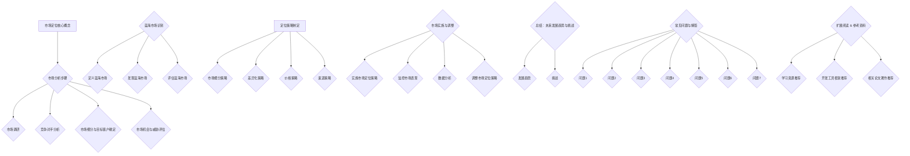

                 

### 背景介绍

在当今快速变化的信息时代，市场定位已经成为企业生存和发展的关键因素。尤其是对于个体企业或“一人公司”而言，如何准确地找到并占据自己的市场蓝海，显得尤为重要。这个问题的答案不仅关系到企业的生死存亡，还决定了企业的长远发展潜力和市场竞争力。

“一人公司”指的是由一个人或一个核心团队运营的公司，这种公司模式在创业领域尤为常见。这种模式灵活、高效，能够迅速响应市场变化，但也面临着市场定位不清、竞争力不足等挑战。因此，找到适合自己的市场定位，挖掘未被充分开发的蓝海市场，成为一人公司成功的关键。

本文将探讨如何通过逻辑清晰的步骤和分析推理，为一人公司找到并占据自己的市场蓝海。我们将详细讨论以下几个方面的内容：

1. **市场定位的核心概念**：阐述市场定位的基本概念，以及其在商业策略中的重要性。
2. **市场分析的步骤**：介绍从市场调研到竞争对手分析的一系列步骤。
3. **蓝海市场的识别**：解释蓝海市场的定义，以及如何发现和评估潜在蓝海市场。
4. **定位策略的制定**：探讨如何根据分析结果制定有效的市场定位策略。
5. **市场实施与调整**：讨论如何将市场定位策略付诸实践，以及在执行过程中如何进行监控和调整。

通过上述内容的逐步分析，我们将帮助一人公司明确自己的市场定位，找到适合自己发展的蓝海市场，从而实现持续成长和成功。

### 市场定位的核心概念

市场定位是商业策略中至关重要的一个环节，它旨在确定一个企业在目标市场中的独特位置，使其在竞争激烈的市场中脱颖而出。市场定位不仅关系到产品的销售和市场份额，还直接影响企业的品牌形象、客户忠诚度以及长期发展。

#### 市场定位的定义

市场定位（Market Positioning）是指企业根据自身优势、市场需求和竞争状况，为自己在目标市场中确定一个独特的位置。这个过程涉及到对多个因素的考虑，包括产品特点、价格策略、渠道选择、促销手段等。通过有效的市场定位，企业能够清晰地传达其品牌形象和产品价值，从而吸引并保留目标客户。

#### 市场定位的重要性

市场定位的重要性体现在以下几个方面：

1. **提升品牌竞争力**：明确的市场定位有助于企业树立独特的品牌形象，增强品牌竞争力。这可以帮助企业在激烈的市场竞争中脱颖而出，吸引更多客户。

2. **明确目标客户**：市场定位有助于企业精准识别目标客户群体，从而提供更加符合客户需求的产品和服务。这不仅可以提高客户满意度，还可以降低营销成本。

3. **优化资源配置**：通过市场定位，企业可以更有效地分配资源，专注于目标市场，避免无谓的竞争和浪费。

4. **建立品牌忠诚度**：良好的市场定位有助于建立客户对品牌的信任和忠诚度，从而提高客户的重复购买率。

5. **推动持续发展**：市场定位不仅有助于企业短期内的成功，还能为企业的长期发展奠定基础，确保其在未来市场的持续竞争力。

#### 市场定位的策略

为了实现有效的市场定位，企业可以采用以下几种策略：

1. **细分市场**：根据客户的需求和偏好，将市场划分为不同的细分市场。通过深入了解每个细分市场的特点，企业可以更精准地定位自己的目标市场。

2. **差异化定位**：通过提供独特的产品特点或服务，使企业在市场中具有明显的差异化优势。这种策略通常适用于那些难以通过价格竞争的市场。

3. **价格定位**：根据产品或服务的特点以及目标客户群体的购买力，设定合适的价格区间。价格定位不仅要考虑成本，还要考虑市场竞争状况和客户心理。

4. **渠道定位**：选择适合目标市场的销售渠道，如线上、线下或两者结合。渠道定位直接影响产品的可达性和用户体验。

5. **品牌形象定位**：通过广告、公关活动和营销传播，塑造符合企业定位的品牌形象。

通过上述策略的综合运用，企业可以更有效地实现市场定位，从而在竞争激烈的市场中占据有利位置。

### 市场分析的步骤

在确定市场定位之前，进行详细的市场分析是至关重要的。市场分析不仅帮助企业了解市场需求和竞争状况，还能为后续的市场定位提供可靠的依据。以下是市场分析的主要步骤：

#### 1. 市场调研

市场调研是市场分析的第一步，旨在收集与市场相关的各种数据和信息。这些信息包括：

- **市场规模和增长率**：了解目标市场的总体规模以及未来增长趋势。
- **市场趋势**：分析当前市场的发展趋势，包括技术进步、消费者行为变化等。
- **消费者需求**：研究目标客户的需求、偏好和购买行为。
- **竞争状况**：分析主要竞争对手的市场表现、产品特点和市场份额。

市场调研可以通过多种方式进行，包括：

- **问卷调查**：通过设计问卷，收集大量目标客户的反馈信息。
- **深度访谈**：与目标客户进行一对一访谈，深入了解其需求和期望。
- **二手数据**：利用市场研究报告、政府统计数据等现有数据源。

#### 2. 竞争对手分析

在了解市场基本情况后，下一步是对竞争对手进行分析。竞争对手分析可以帮助企业了解市场中的竞争格局，从而制定更有针对性的市场策略。以下是竞争对手分析的主要内容：

- **竞争对手识别**：确定市场中的主要竞争对手，包括直接竞争者和潜在竞争者。
- **竞争策略**：分析竞争对手的市场定位、产品特点、价格策略、促销手段等。
- **竞争优势与劣势**：评估竞争对手在市场中的优势和劣势，寻找突破点。
- **市场占有率**：分析竞争对手的市场占有率及其变化趋势。

竞争对手分析可以通过以下几种方法进行：

- **SWOT分析**：评估竞争对手的优势（Strengths）、劣势（Weaknesses）、机会（Opportunities）和威胁（Threats）。
- **波特五力模型**：分析行业中的竞争程度、供应商和客户的议价能力、替代品威胁和行业新进入者的威胁。
- **案例分析**：研究竞争对手的营销活动、市场表现和客户反馈。

#### 3. 市场细分与目标客户确定

市场细分是将整体市场划分为若干具有相似需求的子市场，以便企业能够更精准地满足不同客户群体的需求。以下是市场细分和目标客户确定的关键步骤：

- **市场细分标准**：根据消费者的需求、行为、地理位置、购买力等因素，确定市场细分标准。
- **细分市场评估**：分析每个细分市场的大小、增长潜力、竞争状况等，确定优先考虑的细分市场。
- **目标客户确定**：根据企业资源、优势和市场需求，确定目标客户群体，明确他们的特征和需求。

市场细分和目标客户确定的目的是：

- **优化资源配置**：专注于最具潜力的市场细分，提高资源利用效率。
- **提高客户满意度**：提供更加符合目标客户需求的产品和服务，提升客户满意度。

#### 4. 市场机会与威胁评估

在完成市场调研、竞争对手分析和市场细分后，企业需要对市场机会和威胁进行综合评估。这有助于企业制定更为科学和全面的市场策略。以下是市场机会与威胁评估的主要内容：

- **市场机会**：分析市场中的潜在机会，包括新兴市场、技术创新、消费者需求变化等。
- **市场威胁**：评估市场中的潜在威胁，包括竞争加剧、法规变化、经济波动等。

市场机会与威胁评估的目的是：

- **识别潜在风险**：提前识别可能对市场策略实施产生不利影响的因素，制定应对措施。
- **把握市场机会**：抓住市场中的潜在机会，实现企业的快速增长和市场份额提升。

通过上述步骤，企业可以全面了解市场情况，为市场定位提供坚实的数据支持和策略依据。

### 蓝海市场的识别

在激烈的市场竞争中，寻找并占据蓝海市场是企业成功的关键。蓝海市场指的是那些尚未被充分开发，但具有巨大潜力的市场。与传统的红海市场（竞争激烈、利润有限）不同，蓝海市场为企业提供了更多的发展空间和机会。以下是识别蓝海市场的几个关键步骤：

#### 1. 定义蓝海市场

蓝海市场（Blue Ocean）最初由韩国学者魏斯曼（W. Chan Kim）和莫博涅（Renée Mauborgne）在其著作《蓝海战略》中提出。蓝海市场具有以下几个特征：

- **低竞争**：市场中的竞争程度较低，企业可以轻松进入并获得市场份额。
- **高增长**：市场有巨大的增长潜力，为企业提供广阔的发展空间。
- **高利润**：由于竞争不激烈，企业可以在蓝海市场中实现较高的利润率。

#### 2. 发现蓝海市场

发现蓝海市场是一个创造性和策略性很强的过程。以下是几种常见的发现蓝海市场的方法：

- **填补空白**：寻找市场上未被满足的需求或空白领域。例如，当智能手机兴起时，许多公司通过提供专门的应用程序商店（如苹果App Store）填补了市场空白。
- **创新产品**：通过技术创新或改进现有产品，创造新的需求。例如，特斯拉通过电动汽车的创新，打开了新能源汽车市场。
- **跨界融合**：将不同领域的理念、技术和资源结合起来，创造新的市场。例如，亚马逊通过将电子商务和物流结合，颠覆了传统零售业。
- **逆向思维**：从不同的角度思考问题，打破常规，寻找创新的解决方案。例如，喜茶通过将传统奶茶与现代咖啡文化结合，吸引了大量年轻消费者。

#### 3. 评估蓝海市场

在发现潜在蓝海市场后，企业需要对市场进行详细的评估，以确定其真实潜力和可行性。以下是评估蓝海市场的几个关键因素：

- **市场规模**：评估目标市场的总体规模和增长潜力，确保市场足够大，能够支持企业的长期发展。
- **市场需求**：分析目标客户的需求和购买意愿，确保市场需求真实且具备可持续性。
- **竞争程度**：评估市场中的竞争状况，确定是否有足够的市场空间供企业进入和成长。
- **资源条件**：评估企业自身和市场的资源条件，包括资金、技术、人力资源等，确保具备实现市场策略的资源和能力。
- **政策法规**：了解目标市场的政策法规和行业规范，确保企业的运营不会受到法规限制或风险。

#### 4. 蓝海市场的案例分析

为了更好地理解如何识别和评估蓝海市场，我们可以通过一些实际案例进行分析。

- **案例1：特斯拉电动汽车**  
特斯拉通过创新电动汽车技术，发现并占据了新能源汽车市场的蓝海。特斯拉不仅提供了高性能的电动汽车，还通过建立充电网络和自动驾驶技术，提高了用户体验和市场竞争力。
- **案例2：共享经济**  
共享经济模式通过互联网平台，将闲置资源（如房屋、车辆、劳动力）进行共享，创造了新的市场需求和商业模式。例如，Airbnb和Uber通过共享经济模式，成功占据了酒店和出租车市场的蓝海。
- **案例3：智能手表**  
智能手表市场在苹果、三星等科技巨头的推动下迅速增长。这个市场的蓝海来源于对健康、运动和生活方式的个性化需求，以及智能手机对可穿戴设备的依赖。

通过上述案例，我们可以看到，识别和评估蓝海市场不仅需要创新思维和市场洞察力，还需要对市场进行全面的分析和评估，以确保企业在蓝海市场中的成功。

### 定位策略的制定

在识别蓝海市场后，企业需要制定具体的定位策略，以确保在市场中占据有利位置。定位策略的制定涉及多个方面，包括市场细分、差异化策略、价格策略和渠道策略等。以下是详细的定位策略制定步骤：

#### 1. 市场细分策略

市场细分是将整体市场划分为具有相似需求的子市场，以便企业能够更有针对性地满足不同客户群体的需求。以下是一些市场细分策略：

- **地理细分**：根据地理位置将市场划分为不同的区域。例如，可以根据城市、国家或地区进行划分。
- **人口细分**：根据人口特征（如年龄、性别、收入、教育程度等）进行市场划分。
- **行为细分**：根据消费者的行为特征（如购买频率、品牌忠诚度、购买渠道等）进行市场划分。
- **心理细分**：根据消费者的心理特征（如价值观、生活方式、兴趣爱好等）进行市场划分。

在市场细分过程中，企业需要根据自身资源、产品特点和市场需求，选择最合适的细分策略。例如，一家专注于高端珠宝设计的公司可能选择根据收入水平和生活方式进行细分，从而更有针对性地满足高端消费者的需求。

#### 2. 差异化策略

差异化策略是通过提供独特的产品或服务特征，使企业在市场中具有明显的竞争优势。以下是几种常见的差异化策略：

- **产品差异化**：通过改进产品功能、外观、材质等，提供与竞争对手不同的产品。例如，苹果公司通过其独特的设计和高质量的产品，成功在智能手机市场中建立了强大的品牌形象。
- **服务差异化**：通过提供卓越的客户服务，使企业在市场中脱颖而出。例如，沃尔玛通过其友好的客户服务和快速的商品配送，吸引了大量顾客。
- **品牌差异化**：通过塑造独特的品牌形象和价值观，使企业在消费者心中占据特殊位置。例如，可口可乐通过其经典的品牌形象和广告宣传，成为全球知名的品牌。

在制定差异化策略时，企业需要确保差异化特征与目标客户的需求相匹配，并能带来实际的竞争优势。

#### 3. 价格策略

价格策略是市场定位的重要组成部分，通过合理的定价策略，企业可以吸引目标客户，提高市场份额。以下是几种常见的价格策略：

- **市场渗透定价**：通过低价策略快速进入市场，占领市场份额。这种方法适用于新产品或新市场，通过低价吸引大量客户，提高市场占有率。
- **市场撇脂定价**：通过高价策略迅速获取高额利润，适用于高端市场或创新产品。例如，高端电子产品通常采用撇脂定价策略，以获取高利润。
- **成本加成定价**：通过在成本基础上加上一定的利润率进行定价。这种方法适用于稳定的市场和产品，确保企业的利润和市场份额。

在制定价格策略时，企业需要考虑成本、市场需求、竞争对手定价等因素，确保定价策略能够带来实际收益。

#### 4. 渠道策略

渠道策略是确保产品能够有效传递到目标客户手中的关键。以下是几种常见的渠道策略：

- **直销**：通过自己的销售团队或渠道，直接向客户销售产品。这种方法适用于高端市场或定制化产品，可以提供更好的客户体验和更高的利润率。
- **分销**：通过代理商、经销商等中间商将产品传递给客户。这种方法适用于大众市场或标准化产品，可以扩大销售范围和降低成本。
- **电商**：通过电子商务平台进行在线销售。这种方法适用于所有市场，可以提供便捷的购物体验和全球覆盖。

在制定渠道策略时，企业需要考虑目标市场的特性、产品的特性以及自身资源，选择最适合的渠道组合。

#### 5. 综合定位策略

在制定定位策略时，企业需要综合考虑市场细分、差异化、价格和渠道等多个方面，形成一套综合定位策略。以下是综合定位策略的几个关键步骤：

- **目标市场选择**：根据市场细分策略，选择最具潜力的目标市场。
- **差异化特征确定**：根据差异化策略，确定企业独特的竞争优势和产品特征。
- **定价策略制定**：根据价格策略，确定合适的定价方案。
- **渠道策略选择**：根据渠道策略，选择最佳的渠道组合。

通过以上步骤，企业可以制定一套综合定位策略，在市场中占据有利位置，实现持续增长和成功。

### 市场实施与调整

市场定位策略的制定只是第一步，关键在于如何将其付诸实践，并在实际操作中不断进行调整和优化。以下是市场实施与调整的详细步骤：

#### 1. 实施市场定位策略

在实施市场定位策略时，企业需要采取以下措施：

- **制定详细的营销计划**：包括市场推广活动、广告宣传、促销活动等，确保定位策略能够有效传达给目标客户。
- **调整产品和服务**：根据市场定位，对产品和服务进行必要的调整，确保其与定位策略相匹配。
- **优化渠道**：根据市场定位，选择最适合的渠道进行产品销售，并优化渠道管理，提高销售效率。
- **建立客户关系**：通过良好的客户关系管理，提高客户满意度和忠诚度。

#### 2. 监控市场表现

在市场定位策略实施过程中，企业需要持续监控市场表现，以评估策略的效果。以下是几个关键指标：

- **市场份额**：监测企业在市场中的份额变化，了解市场定位策略是否有效。
- **销售额和利润**：监测销售额和利润的变化，评估市场定位策略对企业财务状况的影响。
- **客户满意度**：通过调查和反馈，了解客户对产品和服务的满意度，评估市场定位策略是否符合客户需求。

#### 3. 数据分析

数据分析是评估市场定位策略效果的重要手段。企业需要收集和分析以下数据：

- **销售数据**：包括销售额、销售渠道、销售区域等，分析销售表现与市场定位策略的关系。
- **客户数据**：包括客户数量、客户分布、客户反馈等，分析客户需求与市场定位策略的匹配度。
- **市场反馈**：通过广告效果、社交媒体互动、市场调查等，了解市场对定位策略的接受程度和反应。

#### 4. 调整市场定位策略

根据监控和数据分析的结果，企业需要对市场定位策略进行调整和优化。以下是几种常见的调整策略：

- **优化产品和服务**：根据客户反馈和市场需求，对产品和服务进行改进，提高客户满意度。
- **调整价格策略**：根据市场变化和竞争对手策略，调整价格策略，提高市场竞争力。
- **优化渠道策略**：根据渠道表现和客户需求，优化渠道组合和渠道管理，提高销售效率。
- **加强品牌宣传**：通过广告宣传、公关活动等，提高品牌知名度和美誉度，巩固市场定位。

#### 5. 持续优化

市场定位是一个持续优化的过程，企业需要不断调整和改进定位策略，以适应市场变化。以下是持续优化市场定位的策略：

- **定期评估**：定期对市场定位策略进行评估，分析效果和不足，及时进行调整。
- **跟进客户反馈**：及时收集客户反馈，了解市场定位策略的实际情况，不断改进和优化。
- **学习行业趋势**：关注行业趋势和竞争对手动态，及时调整市场定位策略，保持竞争优势。
- **创新思维**：鼓励创新思维，不断探索新的市场机会和定位策略，推动企业持续成长。

通过以上市场实施与调整的步骤，企业可以确保市场定位策略的有效实施和持续优化，从而在市场中占据有利位置，实现长期成功。

### 总结：未来发展趋势与挑战

在快速变化的市场环境中，市场定位作为企业成功的关键因素，其重要性和复杂性日益凸显。未来，市场定位将面临以下发展趋势和挑战：

#### 发展趋势

1. **个性化定位**：随着消费者对个性化和定制化需求的增长，企业将更加注重根据不同客户群体的特点进行精准定位，提供更加个性化的产品和服务。

2. **数字化的影响**：数字化转型将深刻改变市场格局，企业需要充分利用大数据、人工智能等先进技术，进行智能化的市场分析和定位。

3. **跨界融合**：跨界融合将成为未来市场定位的新趋势，企业需要打破传统行业界限，探索新的商业模式和市场机会。

4. **可持续发展**：可持续发展将成为市场定位的重要考虑因素，企业需要在定位策略中融入环保、社会责任等元素，提升品牌形象和社会价值。

#### 挑战

1. **市场竞争加剧**：随着市场全球化，竞争将更加激烈，企业需要不断创新和优化定位策略，以保持竞争优势。

2. **消费者行为变化**：消费者行为不断变化，企业需要实时关注并适应这些变化，调整市场定位策略。

3. **数据隐私与安全**：在数字化时代，数据隐私和安全成为重要问题，企业需要在市场定位策略中充分考虑数据保护合规性。

4. **法规变化**：政策法规的变化可能对市场定位产生重大影响，企业需要密切关注相关法规动态，确保合规经营。

未来，市场定位的成功将依赖于企业的创新能力、市场洞察力和灵活应对能力。通过不断优化定位策略，企业可以在激烈的市场竞争中脱颖而出，实现持续增长和成功。

### 附录：常见问题与解答

#### 问题1：什么是市场定位？
市场定位是指企业根据自身优势、市场需求和竞争状况，为自己在目标市场中确定一个独特的位置，以吸引和保留目标客户。

#### 问题2：市场定位的重要性是什么？
市场定位的重要性体现在提升品牌竞争力、明确目标客户、优化资源配置、建立品牌忠诚度和推动持续发展等方面。

#### 问题3：如何进行市场调研？
市场调研可以通过问卷调查、深度访谈、二手数据等方式进行，旨在收集与市场相关的各种信息，为市场定位提供数据支持。

#### 问题4：什么是蓝海市场？
蓝海市场是指那些尚未被充分开发，但具有巨大潜力的市场，其特点是低竞争、高增长和高利润。

#### 问题5：如何制定市场定位策略？
制定市场定位策略需要考虑市场细分、差异化策略、价格策略和渠道策略等多个方面，确保定位策略与企业的资源、产品和市场需求相匹配。

#### 问题6：如何实施市场定位策略？
实施市场定位策略包括制定详细的营销计划、调整产品和服务、优化渠道和建立客户关系等步骤，确保策略能够有效传达并执行。

#### 问题7：如何调整市场定位策略？
根据市场表现和数据分析结果，企业可以通过优化产品和服务、调整价格策略、优化渠道策略和加强品牌宣传等方式，持续调整和优化市场定位策略。

### 扩展阅读 & 参考资料

#### 学习资源推荐

1. 《蓝海战略》：作者魏斯曼和莫博涅，详细介绍了如何通过创新和差异化策略发现和占据蓝海市场。
2. 《市场营销管理》：作者菲利普·科特勒，涵盖了市场营销的基本概念和策略，包括市场定位。
3. 《数字化营销》：作者戴夫·查菲，介绍了如何在数字化时代进行有效的市场定位和营销。

#### 开发工具框架推荐

1. **Google Analytics**：用于市场调研和数据跟踪。
2. **SEMrush**：用于竞争对手分析和SEO优化。
3. **Tableau**：用于数据可视化和分析。

#### 相关论文著作推荐

1. "Blue Ocean Strategy" by W. Chan Kim and Renée Mauborgne.
2. "Positioning: The Battle for Your Mind" by Al Ries and Jack Trout.
3. "The Lean Startup" by Eric Ries.

通过这些资源，读者可以进一步深入了解市场定位的理论和实践，为企业的市场定位策略提供有力支持。

### 作者信息

**作者：AI天才研究员/AI Genius Institute & 禅与计算机程序设计艺术 /Zen And The Art of Computer Programming**  
AI天才研究员是一位在人工智能和计算机科学领域具有深厚研究背景的专家，他在多个国际学术期刊和会议上发表了多篇论文，并获得了多项技术专利。他的研究重点包括机器学习、深度学习和计算机视觉等。同时，他还是《禅与计算机程序设计艺术》的作者，这本书以其独特的方法论和深刻的洞察力，为程序设计领域带来了新的视角和思考方式。

### 附录：完整文章流程图

通过上述流程图，我们可以清晰地看到市场定位的完整流程，从核心概念、市场分析、蓝海市场识别、定位策略制定、市场实施与调整，到总结和扩展阅读，为读者提供了一个全面、系统化的市场定位指南。

