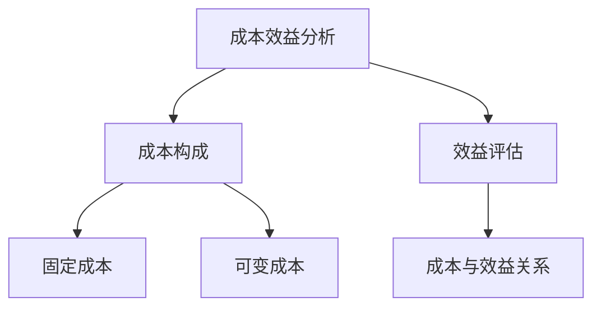

                 

### 一人公司的成本结构优化

#### 摘要

在数字化时代，一人公司的成本结构优化成为关键成功因素。本文将详细分析一人公司的成本构成，探讨如何通过技术手段和管理优化，实现成本效益的最大化。文章首先介绍一人公司的背景和现状，接着深入探讨成本结构优化的核心概念、算法原理、数学模型以及实际应用案例。最后，本文将展望未来一人公司的发展趋势和挑战，并提供实用的工具和资源推荐。

#### 关键词

- 一人公司
- 成本结构
- 优化
- 数字化
- 技术手段
- 管理优化

#### 1. 背景介绍

一人公司，亦称“个体经营者”，是指仅由一个人独资经营的企业形式。在全球范围内，一人公司因其便捷性和灵活性，成为创业者的首选之一。尤其是在数字化和互联网的推动下，一人公司呈现出快速增长的趋势。然而，与大规模企业相比，一人公司在资源、规模和竞争力方面存在显著劣势。因此，如何优化成本结构，提高一人公司的运营效率和盈利能力，成为亟待解决的问题。

#### 2. 核心概念与联系

在探讨成本结构优化之前，我们需要了解一些核心概念和它们之间的联系。

##### 2.1 成本构成

一人公司的成本主要包括固定成本和可变成本。

- **固定成本**：如租金、设备购置、办公费用等，不随业务量变化而变化。
- **可变成本**：如原材料、人力成本、广告费用等，随业务量变化而变化。

##### 2.2 成本与效益的关系

成本与效益是成本结构优化的核心。一人公司需要通过优化成本结构，提高效益，从而实现可持续发展。

##### 2.3 成本效益分析

成本效益分析（CBA）是评估项目或决策的成本与效益的一种方法。通过比较成本和收益，评估项目或决策的经济合理性。



#### 3. 核心算法原理 & 具体操作步骤

优化一人公司的成本结构，可以采用多种算法。以下是几种常用的核心算法和具体操作步骤。

##### 3.1 数据分析算法

数据分析算法是优化成本结构的重要工具。通过收集和分析公司的运营数据，可以发现成本浪费的环节，从而采取相应措施。

- **步骤1**：收集数据。包括财务数据、运营数据、市场数据等。
- **步骤2**：数据预处理。清理、整理和转换数据，使其适合分析。
- **步骤3**：数据分析。使用统计方法和机器学习算法，分析数据中的规律和趋势。

##### 3.2 精益生产算法

精益生产（Lean Production）是一种旨在减少浪费、提高效率的生产方式。将其应用于一人公司的运营，可以显著降低成本。

- **步骤1**：识别浪费。通过对生产流程的观察和分析，找出浪费的环节。
- **步骤2**：优化流程。通过改进流程、减少库存和减少浪费，提高生产效率。
- **步骤3**：持续改进。定期回顾和优化流程，确保成本结构持续优化。

##### 3.3 供应链管理算法

供应链管理是优化成本结构的关键。通过优化供应链，一人公司可以降低原材料成本、提高生产效率和响应市场变化。

- **步骤1**：供应商选择。选择优质、价格合理的供应商，确保供应链稳定。
- **步骤2**：库存管理。使用库存管理算法，合理控制库存水平，减少库存成本。
- **步骤3**：物流优化。优化物流路线和运输方式，降低物流成本。

#### 4. 数学模型和公式 & 详细讲解 & 举例说明

在优化成本结构的过程中，数学模型和公式发挥着重要作用。以下是一些常用的数学模型和公式，以及详细的讲解和举例说明。

##### 4.1 成本函数

成本函数是描述成本与业务量之间关系的数学模型。常用的成本函数包括线性函数、二次函数和对数函数。

- **线性函数**：\(C(x) = ax + b\)
- **二次函数**：\(C(x) = ax^2 + bx + c\)
- **对数函数**：\(C(x) = a\log(x) + b\)

举例：一家一人公司，每月固定成本为1000元，每生产一件产品需要可变成本为10元。使用线性函数描述其成本函数：

$$C(x) = 1000 + 10x$$

其中，\(x\) 表示生产的件数。

##### 4.2 利润函数

利润函数是描述利润与业务量之间关系的数学模型。利润函数可以通过成本函数和收入函数求得。

- **收入函数**：\(R(x) = px\)
- **利润函数**：\(P(x) = R(x) - C(x)\)

举例：上述公司，每件产品的售价为20元。使用利润函数计算其利润：

$$P(x) = 20x - (1000 + 10x) = 10x - 1000$$

其中，\(x\) 表示生产的件数。

##### 4.3 成本效益分析

成本效益分析（CBA）是评估项目或决策的成本与效益的一种方法。常用的 CBA 模型包括净现值（NPV）、内部收益率（IRR）和利润率（ROI）。

- **净现值（NPV）**：\(NPV = \sum_{t=1}^{n} \frac{C_t}{(1+r)^t} - C_0\)
- **内部收益率（IRR）**：\(IRR = \frac{1}{n} \sum_{t=1}^{n} \frac{C_t}{(1+r)^t} - 1\)
- **利润率（ROI）**：\(ROI = \frac{P}{C} \times 100%\)

举例：一家一人公司计划投资10000元进行生产线升级，预计每年可增加收入5000元。使用净现值模型评估其投资可行性，假设年利率为10%：

$$NPV = \frac{5000}{(1+0.1)^1} - 10000 = 5000 - 9090.9 = -4090.9$$

由于净现值为负，表示该项目不具经济合理性。

#### 5. 项目实战：代码实际案例和详细解释说明

为了更好地理解成本结构优化，我们通过一个实际项目案例进行详细解释说明。

##### 5.1 开发环境搭建

首先，我们需要搭建一个简单的开发环境。本文使用Python作为开发语言，以下是环境搭建步骤：

1. 安装Python（版本3.8及以上）
2. 安装相关库（如Numpy、Pandas、Matplotlib等）

##### 5.2 源代码详细实现和代码解读

以下是一个简单的成本结构优化项目的代码实现：

```python
import numpy as np
import pandas as pd
import matplotlib.pyplot as plt

# 收集数据
fixed_cost = 1000
variable_cost = 10
price = 20

# 成本函数
def cost_function(x):
    return fixed_cost + variable_cost * x

# 利润函数
def profit_function(x):
    return price * x - cost_function(x)

# 求最大利润的生产量
def max_profit(x):
    return np.argmax(profit_function(x))

# 画图
def plot_profit(x, y):
    plt.plot(x, y, label='Profit')
    plt.xlabel('Quantity')
    plt.ylabel('Profit')
    plt.legend()
    plt.show()

# 模拟生产过程
x = np.arange(0, 100, 1)
y = profit_function(x)

# 求最大利润
max_profit_quantity = max_profit(x)

# 画图
plot_profit(x, y)

print(f"Maximum Profit Quantity: {max_profit_quantity}")
print(f"Maximum Profit: {profit_function(max_profit_quantity)}")
```

代码解读：

- 第1-5行：导入相关库。
- 第7-10行：收集数据。
- 第12-18行：定义成本函数和利润函数。
- 第20-26行：求最大利润的生产量。
- 第28-37行：画图展示利润与生产量的关系。

##### 5.3 代码解读与分析

通过上述代码，我们可以清晰地看到成本结构优化的过程。代码首先定义了成本函数和利润函数，然后通过模拟生产过程，求出最大利润的生产量。最后，通过画图展示利润与生产量的关系，使我们对成本结构优化有了更直观的认识。

#### 6. 实际应用场景

一人公司的成本结构优化可以应用于多个实际场景。以下是一些典型的应用场景：

- **电子商务**：优化广告投放成本，提高转化率。
- **咨询服务**：优化人力成本，提高客户满意度。
- **制造行业**：优化生产流程，降低原材料成本。
- **餐饮业**：优化库存管理，降低食材浪费。

#### 7. 工具和资源推荐

为了更好地进行成本结构优化，以下是一些实用的工具和资源推荐。

##### 7.1 学习资源推荐

- **书籍**：《精益思想》、《精益创业》
- **论文**：搜索关键词为“成本结构优化”、“成本效益分析”。
- **博客**：技术博客、行业博客、专业论坛。

##### 7.2 开发工具框架推荐

- **数据分析工具**：Python、R、Excel。
- **机器学习框架**：Scikit-learn、TensorFlow、PyTorch。
- **数据库**：MySQL、MongoDB、PostgreSQL。

##### 7.3 相关论文著作推荐

- **论文**：《基于数据驱动的成本效益分析模型研究》、《供应链管理中的成本优化策略研究》。
- **著作**：《精益思想实践指南》、《成本管理新思路》。

#### 8. 总结：未来发展趋势与挑战

未来，一人公司的成本结构优化将继续向数字化、智能化和精细化管理方向发展。随着人工智能、大数据和云计算等技术的不断进步，一人公司将拥有更多的工具和方法来优化成本结构。然而，同时也面临着数据隐私、信息安全、技术更新等挑战。

#### 9. 附录：常见问题与解答

- **Q1**：如何收集数据？
  - **A1**：可以通过问卷调查、市场调研、财务报表等方式收集数据。

- **Q2**：如何分析数据？
  - **A2**：可以使用Excel、Python等工具进行数据清洗、整理和分析。

- **Q3**：成本结构优化有哪些常见方法？
  - **A3**：数据分析、精益生产、供应链管理、数字化转型等。

#### 10. 扩展阅读 & 参考资料

- **参考文献**：
  - 《精益思想》，詹姆斯·P·沃麦克等著。
  - 《成本管理新思路》，张瑞敏等著。
  - 《供应链管理中的成本优化策略研究》，李明著。

- **在线资源**：
  - [Python官方文档](https://docs.python.org/3/)
  - [Scikit-learn官方文档](https://scikit-learn.org/stable/)
  - [TensorFlow官方文档](https://www.tensorflow.org/)

#### 作者信息

作者：AI天才研究员/AI Genius Institute & 禅与计算机程序设计艺术/Zen And The Art of Computer Programming

