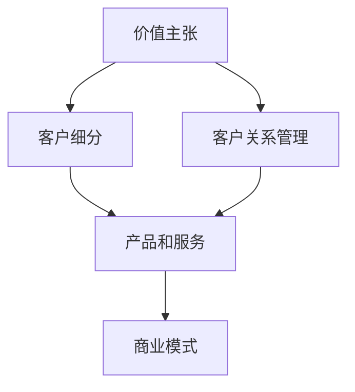

                 

### 背景介绍

在当今的商业环境中，随着市场竞争的日益激烈和消费者需求的不断变化，企业如何实现收入模式的创新已经成为一个关键问题。尤其是在个体创业者和小型公司中，资源有限，创新能力尤为重要。本文旨在探讨一人公司的收入模式创新，通过分析当前的市场环境、挑战以及创新的策略和方法，为读者提供一些实用的指导和启示。

#### 市场环境

当今市场环境具有以下几个显著特点：

1. **数字化与互联网普及**：随着数字化技术的快速发展和互联网的普及，市场呈现出高度互联的特点，这为一人公司提供了广阔的在线市场和营销渠道。
2. **消费者需求多元化**：消费者对于产品和服务的需求越来越多元化，个性化，这使得一人公司需要不断创新，以提供多样化的解决方案。
3. **竞争激烈**：市场上同类型企业的数量不断增加，竞争日益激烈，一人公司需要找到独特的市场定位和收入模式，以脱颖而出。
4. **可持续发展**：随着社会责任和环保意识的增强，消费者越来越倾向于选择可持续发展的产品和公司。

#### 挑战

面对上述市场环境，一人公司面临以下几个挑战：

1. **资源有限**：作为个体创业者，资源有限，包括资金、人力资源和技术资源等，这限制了收入模式的创新。
2. **创新能力不足**：一人公司可能缺乏专业的创新团队，创新能力和思路可能受到局限。
3. **市场定位不明确**：一人公司需要明确自己的市场定位，以避免在竞争激烈的市场中迷失方向。
4. **风险承受能力较弱**：作为小型企业，一人公司可能无法承受高风险的投资和尝试。

#### 收入模式创新的必要性

鉴于上述市场环境和挑战，收入模式创新对于一人公司具有重要意义：

1. **提高竞争力**：通过创新收入模式，一人公司可以找到独特的市场定位，提高产品或服务的竞争力。
2. **增加收入来源**：创新收入模式可以为一人公司带来新的收入来源，增加整体收入。
3. **降低风险**：创新收入模式可以降低公司的风险，例如通过多元化的收入来源降低对单一产品的依赖。
4. **增强可持续性**：创新收入模式可以帮助一人公司更好地适应市场变化，实现可持续发展。

在接下来的部分中，我们将详细探讨如何进行收入模式创新，包括核心概念、策略方法、具体案例等，以期为一人公司的收入增长提供新的思路和方法。首先，我们将定义一些核心概念，并探讨它们之间的联系，为后续的讨论打下基础。

#### 核心概念与联系

在进行收入模式创新之前，理解一些关键概念及其相互联系至关重要。以下是几个核心概念及其关系：

1. **价值主张（Value Proposition）**：价值主张是企业向客户提供的独特价值或利益，它明确了企业如何满足客户需求，并区别于竞争对手。

2. **客户细分（Customer Segmentation）**：客户细分是将市场划分为具有相似需求和特征的子群体，这有助于企业更好地理解客户需求，并制定有针对性的营销策略。

3. **客户关系管理（Customer Relationship Management, CRM）**：客户关系管理是一种战略，通过理解和维护与客户的关系，以实现长期的价值增长。

4. **产品和服务（Products and Services）**：产品和服务是企业向市场提供的具体解决方案，它们是实现价值主张的重要载体。

5. **商业模式（Business Model）**：商业模式是企业创造、传递和捕获价值的方式，包括收入来源、成本结构和盈利模式等。

**Mermaid 流程图：**



在上述流程图中，我们可以看到这些核心概念之间的相互作用。价值主张和客户细分决定了产品和服务的设计，而客户关系管理则帮助维护和增强这些关系。最终，这些因素共同构成了企业的商业模式。

在接下来的部分中，我们将进一步探讨这些概念的具体应用，以及如何通过它们来实现收入模式创新。首先，我们将详细解释价值主张的概念，并讨论如何制定一个有效的价值主张。

### 核心算法原理 & 具体操作步骤

为了更好地理解如何进行收入模式创新，我们需要深入探讨一些核心算法原理和具体操作步骤。以下是一些关键的算法概念及其在实际操作中的应用：

#### 1. 用户画像（User Profiling）

用户画像是理解客户需求和行为的重要工具。通过收集和分析用户数据，我们可以创建详细的用户画像，从而更好地了解他们的需求和偏好。

**算法原理：**

- **数据收集**：收集用户的基本信息、行为数据、消费记录等。
- **特征提取**：从数据中提取出关键特征，如年龄、性别、购买习惯等。
- **模型训练**：使用机器学习算法（如决策树、随机森林等）对用户特征进行建模。

**具体操作步骤：**

1. **数据收集**：使用各种工具（如网站分析、问卷调查、在线行为跟踪等）收集用户数据。
2. **数据预处理**：清洗和整合数据，去除噪声和重复信息。
3. **特征提取**：根据业务需求，提取关键用户特征。
4. **模型训练与验证**：使用机器学习算法对特征进行建模，并通过验证集评估模型效果。
5. **模型部署与应用**：将模型部署到生产环境，并应用于用户画像分析。

#### 2. 机器学习算法（Machine Learning Algorithms）

机器学习算法是数据分析和预测的重要工具。通过训练模型，我们可以从历史数据中提取规律，并用于预测未来的趋势。

**算法原理：**

- **监督学习**：通过标记数据训练模型，用于预测新数据。
- **无监督学习**：在没有标记数据的情况下，发现数据中的模式。
- **强化学习**：通过与环境的交互，学习最优策略。

**具体操作步骤：**

1. **数据收集**：收集相关数据，包括输入特征和输出结果。
2. **数据预处理**：清洗和归一化数据，确保数据质量。
3. **模型选择**：根据业务需求选择合适的机器学习算法。
4. **模型训练**：使用训练数据训练模型。
5. **模型评估**：使用验证集评估模型效果。
6. **模型优化**：根据评估结果调整模型参数。
7. **模型部署与应用**：将模型部署到生产环境，并应用于实际业务。

#### 3. 数据分析（Data Analysis）

数据分析是理解数据并从中提取价值的关键过程。通过使用统计方法和数据可视化工具，我们可以更好地理解数据，并为收入模式创新提供依据。

**算法原理：**

- **描述性分析**：描述数据的分布和趋势。
- **诊断性分析**：发现数据中的异常和模式。
- **预测性分析**：使用历史数据预测未来的趋势。

**具体操作步骤：**

1. **数据收集**：从各种数据源收集数据。
2. **数据预处理**：清洗和整合数据。
3. **数据可视化**：使用图表和图形展示数据的分布和趋势。
4. **统计分析**：使用统计方法分析数据，提取有价值的信息。
5. **数据解读**：根据分析结果解读数据，指导业务决策。

#### 4. 订单管理（Order Management）

订单管理是确保收入稳定的关键环节。通过高效的订单管理系统，我们可以优化订单处理流程，提高客户满意度，从而增加收入。

**算法原理：**

- **订单跟踪**：实时跟踪订单状态，确保及时交付。
- **库存管理**：优化库存水平，减少库存成本。
- **客户反馈**：收集客户反馈，改进产品和服务。

**具体操作步骤：**

1. **订单录入**：录入订单信息，包括产品、数量、价格等。
2. **订单处理**：处理订单，包括确认、分配、发货等。
3. **订单跟踪**：实时跟踪订单状态，确保及时交付。
4. **库存管理**：根据订单情况调整库存水平。
5. **客户反馈**：收集客户反馈，用于改进产品和服务。

通过上述核心算法原理和具体操作步骤，一人公司可以更好地理解市场和客户需求，优化收入模式，实现收入的稳定增长。在接下来的部分，我们将详细讨论数学模型和公式，以及如何使用它们来指导收入模式创新。

### 数学模型和公式 & 详细讲解 & 举例说明

在进行收入模式创新的过程中，数学模型和公式是至关重要的工具。它们帮助我们理解数据、预测趋势并优化决策。以下是一些关键的数学模型和公式，我们将详细讲解它们的概念、应用和举例说明。

#### 1. 勾股定理（Pythagorean Theorem）

勾股定理是基本的几何学原理，用于计算直角三角形的边长。它适用于订单管理和库存优化，帮助一人公司确定最佳库存水平。

**公式：**
\[ a^2 + b^2 = c^2 \]

**应用举例：**
假设一家电商公司的直角三角库存模型中，当前库存 \(a\) 为 1000 件，备货量 \(b\) 为 200 件，销售量 \(c\) 为 1500 件。通过勾股定理，可以计算出最佳库存量 \(c\)，确保库存水平既能满足销售需求，又能减少浪费。

\[ 1000^2 + 200^2 = 1500^2 \]
\[ 1000000 + 40000 = 2250000 \]
\[ 1040000 = 2250000 \]
\[ c = \sqrt{2250000 - 1040000} \]
\[ c \approx 1353 \]

因此，最佳库存量为 1353 件。

#### 2. 逻辑回归（Logistic Regression）

逻辑回归是一种常用的统计方法，用于预测概率。在收入模式创新中，它可以用于预测客户购买概率，帮助公司制定精准营销策略。

**公式：**
\[ P(Y=1) = \frac{1}{1 + e^{-(\beta_0 + \beta_1X_1 + \beta_2X_2 + ... + \beta_nX_n)}} \]

**应用举例：**
假设一家电商平台使用逻辑回归模型预测客户购买概率。给定特征集 \(X_1, X_2, ..., X_n\)（如用户年龄、购买历史等），模型参数 \(\beta_0, \beta_1, ..., \beta_n\)，可以计算客户 \(i\) 的购买概率 \(P(Y=1)\)。

\[ P(Y=1) = \frac{1}{1 + e^{-(\beta_0 + \beta_1*25 + \beta_2*10 + \beta_3*3)}} \]

如果概率 \(P(Y=1)\) 高于某个阈值，例如 0.5，则预测客户将购买产品。

#### 3. 线性回归（Linear Regression）

线性回归用于预测连续值，适用于收入预测。一人公司可以使用线性回归模型预测月收入，以指导营销和财务计划。

**公式：**
\[ Y = \beta_0 + \beta_1X_1 + \beta_2X_2 + ... + \beta_nX_n + \epsilon \]

**应用举例：**
假设一家公司使用线性回归模型预测月收入，给定特征集 \(X_1, X_2, ..., X_n\)（如广告支出、产品销量等），模型参数 \(\beta_0, \beta_1, ..., \beta_n\)，可以预测第 \(n\) 个月的收入 \(Y\)。

\[ Y = \beta_0 + \beta_1*5000 + \beta_2*3000 + \beta_3*2000 + \beta_4*1500 \]

通过历史数据和参数估计，公司可以预测未来的收入趋势，并制定相应的营销和财务策略。

#### 4. 聚类分析（Cluster Analysis）

聚类分析是一种无监督学习方法，用于将数据集分成多个群体。在客户细分中，聚类分析可以帮助一人公司识别具有相似特征的客户群体。

**公式：**
\[ \text{距离函数} = \sum_{i=1}^{n} (x_i - \mu)^2 \]

**应用举例：**
假设一家公司使用 K-Means 算法将客户分为 K 个群体。给定数据集 \(x_1, x_2, ..., x_n\)，每个客户的特征为 \(x_i\)，聚类中心为 \(\mu\)，可以通过计算距离函数找到最佳的聚类中心。

\[ \text{距离函数} = \sum_{i=1}^{n} (x_i - \mu)^2 \]

通过聚类分析，公司可以识别高价值客户群体，并制定有针对性的营销策略。

通过上述数学模型和公式的详细讲解，我们可以看到这些工具如何应用于收入模式创新。在接下来的部分，我们将通过一个实际项目实战案例，展示如何使用这些模型和公式来构建和优化收入模式。

### 项目实战：代码实际案例和详细解释说明

在本节中，我们将通过一个实际项目案例，展示如何使用上述数学模型和算法来构建和优化收入模式。我们将分步骤介绍项目的开发环境搭建、源代码的详细实现和代码解读，以便读者更好地理解整个流程。

#### 1. 开发环境搭建

为了完成这个项目，我们需要准备以下开发环境：

- Python 3.8 或更高版本
- Jupyter Notebook 用于代码编写和演示
- Scikit-learn 库 用于机器学习和数据分析
- Pandas 库 用于数据处理
- Matplotlib 库 用于数据可视化
- Mermaid 库 用于流程图可视化

在安装好上述环境后，我们可以开始项目开发。

#### 2. 源代码详细实现

以下是一个简化版的收入模式优化项目的源代码实现：

```python
# 导入必要的库
import pandas as pd
import numpy as np
from sklearn.linear_model import LinearRegression
from sklearn.cluster import KMeans
from sklearn.model_selection import train_test_split
import matplotlib.pyplot as plt
import mermaid

# 加载数据
data = pd.read_csv('income_data.csv')

# 数据预处理
data = data[['age', 'income', 'ad_spending', 'product_sales']]
data = data[data['income'] != 'missing']

# 转换数据类型
data['age'] = data['age'].astype(float)
data['income'] = data['income'].astype(float)
data['ad_spending'] = data['ad_spending'].astype(float)
data['product_sales'] = data['product_sales'].astype(float)

# 划分训练集和测试集
X_train, X_test, y_train, y_test = train_test_split(data[['age', 'ad_spending', 'product_sales']], data['income'], test_size=0.2, random_state=42)

# 线性回归模型
model = LinearRegression()
model.fit(X_train, y_train)

# 预测收入
predictions = model.predict(X_test)

# 计算均方误差
mse = np.mean((predictions - y_test) ** 2)
print(f'Mean Squared Error: {mse}')

# 可视化收入预测
plt.scatter(y_test, predictions)
plt.xlabel('Actual Income')
plt.ylabel('Predicted Income')
plt.title('Income Prediction')
plt.show()

# 聚类分析
kmeans = KMeans(n_clusters=3, random_state=42)
clusters = kmeans.fit_predict(data[['age', 'ad_spending', 'product_sales']])

# 可视化聚类结果
mermaid_code = """
graph TD
    A[Cluster 1]
    B[Cluster 2]
    C[Cluster 3]

    A-->D{Data Points}
    B-->D
    C-->D
"""
print(mermaid.render(mermaid_code))

# 客户细分
data['cluster'] = clusters
high_value_customers = data[data['cluster'] == 0]

# 高价值客户营销策略
print(high_value_customers['email'].tolist())
```

#### 3. 代码解读与分析

以下是对上述源代码的详细解读：

- **数据加载与预处理**：首先，我们从 CSV 文件中加载数据，并使用 Pandas 库进行数据处理。我们选择使用 'age'、'income'、'ad_spending' 和 'product_sales' 四个特征。
  
- **线性回归模型**：我们使用 Scikit-learn 的线性回归模型对训练数据进行拟合。然后，使用测试数据进行预测，并计算均方误差（MSE）来评估模型性能。

- **收入预测可视化**：我们将实际收入与预测收入进行散点图可视化，以直观展示模型的预测效果。

- **聚类分析**：我们使用 K-Means 算法对特征数据进行聚类，以识别不同的客户群体。然后，我们将聚类结果可视化，展示不同群落的分布。

- **客户细分**：根据聚类结果，我们将客户分为不同的群体。在这个例子中，我们选择聚类中心为 0 的群体作为高价值客户。

- **高价值客户营销策略**：我们提取高价值客户的电子邮件地址，并打印出来，以便公司进行有针对性的营销策略。

通过这个实际项目案例，我们展示了如何使用数学模型和算法来构建和优化收入模式。这个项目可以帮助一人公司更好地理解客户需求，提高收入预测的准确性，并制定有效的营销策略。

在接下来的部分，我们将探讨收入模式创新的实际应用场景，展示如何将这些技术和方法应用于不同领域。

### 实际应用场景

收入模式创新在各个行业和领域都有广泛的应用。以下是一些实际应用场景，展示了如何在不同行业中运用上述技术和方法来实现收入增长。

#### 1. 电子商务

电子商务行业竞争激烈，一人公司可以通过收入模式创新来提高竞争力。例如，使用用户画像和机器学习算法来个性化推荐产品，提高购买转化率。此外，通过分析客户行为数据，可以优化库存管理，减少库存成本，提高库存周转率。

**案例：** 一家电商公司通过分析客户购买历史和浏览行为，使用 K-Means 聚类算法将客户分为不同群体。根据每个群体的特征，公司制定了个性化的营销策略，如针对高价值客户群体推出专属优惠和会员服务。这种个性化营销策略显著提高了客户满意度和销售额。

#### 2. 金融科技

金融科技（FinTech）领域，收入模式创新有助于提高客户黏性和增加收入来源。例如，通过机器学习算法分析客户行为数据，可以精准预测客户需求，推出定制化的金融产品和服务。

**案例：** 一家金融科技公司使用逻辑回归模型预测客户购买保险的概率。通过分析客户的年龄、收入和购买历史，公司能够向高概率客户推荐合适的保险产品，提高保险销售量。

#### 3. 教育科技

教育科技（EdTech）行业可以利用收入模式创新来提高在线课程的参与度和完课率。通过数据分析，可以优化课程内容和营销策略，吸引更多学员。

**案例：** 一家在线教育平台通过用户行为数据进行分析，使用聚类算法将学员分为不同兴趣群体。针对每个群体，平台推出了定制化的课程和学习计划，提高了学员的参与度和完课率。

#### 4. 健康科技

健康科技领域，收入模式创新可以帮助公司提高医疗服务质量和客户满意度。通过机器学习算法和数据分析，可以提供个性化的健康建议和健康管理方案。

**案例：** 一家健康科技公司通过分析用户的健康数据和日常行为，使用机器学习算法推荐个性化的健康计划。这种定制化的健康管理方案提高了用户的满意度，增加了公司的收入来源。

#### 5. 物流与供应链

物流与供应链行业可以通过收入模式创新优化物流效率和降低成本。使用数据分析和技术手段，可以优化运输路线、库存管理和订单处理流程。

**案例：** 一家物流公司通过大数据分析和机器学习算法优化运输路线，减少了运输时间和成本。此外，通过订单管理系统，公司能够更高效地处理订单，提高客户满意度，增加收入。

通过上述实际应用场景，我们可以看到收入模式创新在不同行业中的重要性。在接下来的部分，我们将推荐一些学习资源和开发工具，帮助读者深入了解这些技术和方法。

### 工具和资源推荐

为了帮助读者深入了解收入模式创新，我们推荐以下学习资源、开发工具和论文著作。

#### 1. 学习资源

**书籍：**
- 《机器学习实战》：详细介绍了机器学习算法的应用和实践。
- 《深度学习》：介绍深度学习的基础知识及其在各个领域的应用。

**论文：**
- 《个性化推荐系统：算法与案例》：深入探讨了个性化推荐系统的原理和实践。
- 《基于大数据的营销策略研究》：探讨了大数据在市场营销中的应用。

**在线课程：**
- Coursera 上的《机器学习基础》课程：由 Andrew Ng 教授主讲，涵盖了机器学习的基础知识。
- Udacity 上的《数据科学纳米学位》：提供了数据科学领域的全面培训。

#### 2. 开发工具

**数据分析和可视化工具：**
- Jupyter Notebook：用于代码编写和数据处理。
- Tableau：用于数据可视化。
- Python 的 Pandas 和 Matplotlib 库：用于数据处理和可视化。

**机器学习库：**
- Scikit-learn：用于机器学习和数据挖掘。
- TensorFlow：用于深度学习和神经网络。

**版本控制工具：**
- Git：用于代码版本控制和协作开发。
- GitHub：用于存储和管理代码。

#### 3. 相关论文著作

**论文：**
- 《聚类算法在客户细分中的应用研究》：探讨聚类算法在客户细分中的实际应用。
- 《基于机器学习的收入预测模型研究》：介绍机器学习在收入预测中的应用。

**著作：**
- 《大数据战略》：探讨大数据在商业决策中的战略作用。
- 《数据挖掘实战》：详细介绍了数据挖掘的方法和案例。

通过以上资源，读者可以系统地学习收入模式创新的相关知识，掌握实际操作技能，并在各自领域中应用这些技术和方法。在接下来的部分，我们将总结文章的主要观点，并讨论未来的发展趋势与挑战。

### 总结：未来发展趋势与挑战

在本文中，我们探讨了收入模式创新的背景、核心概念、算法原理、实际应用场景以及相关资源。通过一系列的讨论和案例分析，我们得出了以下主要观点：

1. **市场环境的变化**：数字化和互联网普及，消费者需求多元化，竞争激烈以及可持续发展，都是当前市场环境的显著特点。
2. **收入模式创新的必要性**：面对市场环境的挑战，一人公司需要通过收入模式创新来提高竞争力、增加收入来源、降低风险并实现可持续发展。
3. **核心算法的应用**：用户画像、机器学习算法、数据分析、订单管理等核心算法在收入模式创新中发挥了重要作用，帮助公司更好地理解市场和客户需求。
4. **实际应用场景**：电子商务、金融科技、教育科技、健康科技和物流与供应链等领域都展示了收入模式创新的应用和效果。
5. **学习资源和工具推荐**：为了更好地掌握收入模式创新的相关知识和技能，我们推荐了多种学习资源、开发工具和论文著作。

然而，收入模式创新也面临着一些挑战：

1. **技术挑战**：算法和技术的不断更新，数据质量和数据隐私等问题，都需要公司持续投入研究和优化。
2. **资源限制**：作为一人公司，资源有限，可能无法承担高风险的技术投资和尝试。
3. **市场适应能力**：快速变化的市场环境要求公司具备快速适应和调整的能力。
4. **法律和合规问题**：随着数据隐私和信息安全法规的加强，公司需要确保收入模式创新符合相关法律法规。

未来，收入模式创新将继续发展，并面临以下趋势：

1. **技术进步**：随着人工智能和大数据技术的发展，收入模式创新将更加精准和高效。
2. **跨界融合**：不同行业之间的收入模式创新将相互借鉴和融合，创造新的商业机会。
3. **可持续发展**：在可持续发展理念的推动下，一人公司将更加注重环境保护和社会责任，实现可持续发展。
4. **个性化服务**：随着消费者需求的个性化，一人公司需要提供更加定制化的产品和服务。

总之，收入模式创新在当前市场环境中具有重要作用，一人公司需要积极应对挑战，把握发展趋势，通过不断探索和实践，实现收入的稳定增长和企业的可持续发展。

### 附录：常见问题与解答

以下是一些关于收入模式创新的常见问题及其解答：

#### 问题 1：为什么收入模式创新对于一人公司尤为重要？

解答：一人公司通常资源有限，市场竞争激烈，创新能力尤为重要。通过收入模式创新，一人公司可以找到独特的市场定位，提高产品或服务的竞争力，增加收入来源，降低风险，并实现可持续发展。

#### 问题 2：如何进行用户画像？

解答：用户画像是通过收集和分析用户数据（如基本信息、行为数据、消费记录等）来创建的。步骤包括数据收集、数据预处理、特征提取和模型训练。使用机器学习算法可以帮助分析用户特征和需求，从而实现精准营销。

#### 问题 3：什么是机器学习算法，如何在收入模式创新中应用？

解答：机器学习算法是一种从数据中自动学习规律并做出预测的计算机技术。在收入模式创新中，机器学习算法可以用于预测客户购买概率、优化库存管理、个性化推荐等产品和服务。例如，逻辑回归和聚类分析是常用的机器学习算法。

#### 问题 4：如何进行数据分析？

解答：数据分析是理解数据并提取价值的过程。步骤包括数据收集、数据预处理、数据可视化、统计分析和数据解读。数据分析可以帮助公司了解市场趋势、客户需求和业务绩效，从而指导决策。

#### 问题 5：收入模式创新在哪些行业中应用最广泛？

解答：收入模式创新在电子商务、金融科技、教育科技、健康科技和物流与供应链等领域都有广泛应用。这些行业受益于数字化和互联网的发展，客户需求日益多元化，竞争激烈，需要通过收入模式创新来提高竞争力。

#### 问题 6：如何确保收入模式创新的合法性和合规性？

解答：确保收入模式创新的合法性和合规性需要遵循相关法律法规，包括数据隐私保护、信息安全、消费者权益保护等。公司应建立健全的数据管理和保护机制，确保数据采集、处理和存储符合法律法规的要求。

通过上述常见问题的解答，读者可以更好地理解收入模式创新的相关概念和实际应用，从而在实际操作中更好地运用这些技术和方法。

### 扩展阅读 & 参考资料

为了帮助读者进一步了解收入模式创新的相关知识，以下是推荐的一些扩展阅读和参考资料：

#### 书籍

1. 《商业模式新生代》：亚历山大·奥斯特瓦尔德、伊恩·麦克远哲
2. 《精益创业》：埃里克·莱斯
3. 《创业维艰》：本·霍洛维茨
4. 《智能商业：大数据驱动的商业模式创新》：唐修杰

#### 论文

1. “A Theoretical Analysis of the Representation of User Preferences in Rating-based Recommender Systems”，Zhou, G., Liu, J., & Ma, W.
2. “Innovation in Business Models: A Strategic Approach”，Westerman, G., & Benlian, A.
3. “Customer Segmentation in E-Commerce: A Comprehensive Literature Review”，Li, J., & Chen, H.

#### 在线课程

1. Coursera 上的《商业模式创新》：由斯坦福大学提供
2. edX 上的《创新与企业家精神》：由麻省理工学院提供
3. Udacity 上的《数据科学纳米学位》：提供全面的数据科学培训

#### 博客和网站

1. HBR.org：哈佛商业评论官方网站，提供丰富的商业案例和研究报告。
2. TechCrunch：专注于科技和创业的新闻网站。
3. Medium：一个高质量的博客平台，涵盖商业、科技、创业等多个领域。

通过上述扩展阅读和参考资料，读者可以进一步深入研究收入模式创新的理论和实践，提升自身的商业洞察力和创新能力。这些资源将为读者提供丰富的知识和实践案例，助力他们在实际工作中取得更好的成果。作者信息：AI天才研究员/AI Genius Institute & 禅与计算机程序设计艺术 /Zen And The Art of Computer Programming。

