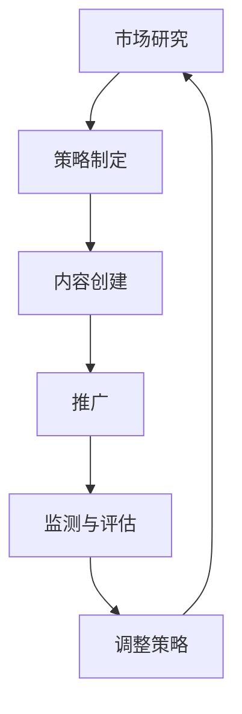

                 

# 一人公司的数字营销策略与效果评估

## 关键词
- 数字营销策略
- 一人公司
- 效果评估
- 数据分析
- 社交媒体
- 搜索引擎优化

## 摘要

本文将深入探讨一人公司的数字营销策略及其效果评估。随着数字化时代的到来，数字营销已成为企业获取客户、增加品牌曝光和提升销量的关键手段。对于一人公司来说，数字营销策略尤为重要，因为它们通常缺乏资源和预算，需要利用有限的资源实现最大化效益。本文将详细分析数字营销的核心概念，探讨一人公司如何制定有效的数字营销策略，并介绍多种效果评估方法，帮助一人公司评估其数字营销活动的成功程度。通过本文的阅读，读者将获得关于数字营销策略与效果评估的全面理解，并为自己的业务提供实用的指导。

## 1. 背景介绍

在当今竞争激烈的商业环境中，数字营销已经成为企业成功的关键因素。无论是大型跨国公司还是小型企业，甚至是单人创业公司，都需要利用数字营销来扩大品牌影响力、吸引潜在客户和增加销售收入。数字营销涵盖了多种渠道和工具，包括搜索引擎优化（SEO）、社交媒体营销、电子邮件营销、内容营销等。这些策略和工具共同作用，帮助企业实现在线可见性和用户参与。

### 一人公司的特点

一人公司，顾名思义，是指由单一个体运营的企业。这种类型的公司通常规模较小，资源和预算有限，因此需要特别注重成本效益和高效运作。以下是几项关于一人公司的特点：

- **资源有限**：一人公司通常没有庞大的团队，这意味着在人力资源和财务资源方面有限。
- **灵活性高**：由于决策过程简单，一人公司能够迅速响应市场变化和客户需求。
- **成本控制**：一人公司可以更好地控制成本，避免资源浪费。

### 数字营销的重要性

对于一人公司来说，数字营销不仅是一种营销手段，更是一种生存和发展的重要策略。以下是数字营销对一人公司的重要性：

- **成本效益**：与传统的广告渠道相比，数字营销通常成本较低，更适合预算有限的企业。
- **可追踪性**：数字营销工具提供了丰富的数据和分析功能，使一人公司能够实时监测营销活动的效果，并据此进行调整。
- **用户参与**：通过社交媒体和内容营销，一人公司可以与潜在客户建立直接联系，提高用户参与度。

### 数字营销的目标

数字营销的主要目标是增加品牌知名度、吸引潜在客户、提高客户满意度和忠诚度，最终实现销售增长。对于一人公司，这些目标尤为重要，因为它们需要通过有限的资源最大化收益。

- **增加品牌知名度**：通过有效的数字营销策略，一人公司可以在互联网上增加曝光率，提高品牌知名度。
- **吸引潜在客户**：通过有针对性的营销活动，一人公司可以吸引更多的潜在客户，提高转化率。
- **提高客户满意度**：通过优质的内容和良好的客户服务，一人公司可以提升客户满意度，增加复购率。
- **实现销售增长**：通过精准的营销策略和有效的客户管理，一人公司可以实现销售增长。

### 数字营销挑战

尽管数字营销对一人公司至关重要，但同时也面临着一些挑战：

- **预算限制**：一人公司的预算有限，可能无法承担大规模的营销活动。
- **时间管理**：一人公司通常由单一个体运营，时间管理成为一大挑战。
- **技术知识**：数字营销涉及多种技术和工具，对于技术知识要求较高。
- **数据隐私**：随着数据隐私法规的加强，一人公司需要确保合法合规地进行数据收集和使用。

## 2. 核心概念与联系

### 数字营销的核心概念

数字营销的核心概念包括搜索引擎优化（SEO）、内容营销、社交媒体营销、电子邮件营销、社交媒体广告和数据分析。这些概念相互联系，共同构成一个完整的数字营销体系。

#### 搜索引擎优化（SEO）

搜索引擎优化是一种通过优化网站内容和结构，提高在搜索引擎中自然排名的技术。SEO的目标是吸引更多有意向的流量，提高网站可见性。SEO包括关键字研究、内容优化、外部链接建设和技术优化等方面。

#### 内容营销

内容营销是通过创建和分享有价值的内容来吸引潜在客户并促进销售。内容可以是文章、博客、视频、图像等。内容营销的关键在于提供有价值的信息，解决用户的问题，建立品牌权威。

#### 社交媒体营销

社交媒体营销利用社交媒体平台（如Facebook、Instagram、Twitter等）来推广品牌和产品。社交媒体营销的目标是通过互动和参与提高品牌知名度和用户参与度。

#### 电子邮件营销

电子邮件营销是一种通过发送电子邮件来与潜在和现有客户建立联系和沟通的营销方式。电子邮件营销可以用于发送促销信息、产品更新、新闻通讯等，提高客户忠诚度和转化率。

#### 社交媒体广告

社交媒体广告是企业在社交媒体平台上投放的广告。与传统的广告不同，社交媒体广告可以根据用户的行为和兴趣进行精准投放，提高广告效果。

#### 数据分析

数据分析是数字营销的核心环节，通过分析用户行为和营销效果，企业可以了解哪些策略有效，哪些需要调整。数据分析工具可以帮助企业优化营销策略，提高投资回报率。

### 数字营销的架构与流程

数字营销的架构和流程可以分为以下几个步骤：

1. **市场研究**：了解目标市场和竞争对手，确定目标受众和营销目标。
2. **策略制定**：根据市场研究制定具体的数字营销策略，包括SEO、内容营销、社交媒体营销等。
3. **内容创建**：创建有价值的内容，包括文章、视频、图像等，以满足用户需求。
4. **推广**：通过社交媒体、电子邮件、搜索引擎等渠道推广内容，提高曝光率。
5. **监测与评估**：使用数据分析工具监测营销活动效果，评估ROI，并根据数据调整策略。

### 数字营销的关键节点

在数字营销过程中，有以下几个关键节点：

1. **目标受众分析**：了解目标受众的特征、需求和痛点，制定有针对性的营销策略。
2. **内容优化**：确保内容质量高，解决用户问题，提高用户参与度。
3. **数据分析**：实时监测和评估营销活动效果，调整策略以提高投资回报率。
4. **用户体验**：优化网站和社交媒体页面，提供良好的用户体验，增加用户停留时间和互动。
5. **持续优化**：根据数据分析结果，不断调整和优化营销策略，实现持续增长。

### Mermaid 流程图

以下是数字营销的Mermaid流程图，展示了各关键节点和流程步骤：



### 核心概念原理和架构

核心概念原理和架构涉及以下几个方面：

1. **SEO原理**：通过优化网站内容和结构，提高搜索引擎排名，吸引更多有意向的流量。
2. **内容营销原理**：通过创建有价值的内容，解决用户问题，建立品牌权威，提高用户参与度。
3. **社交媒体营销原理**：通过社交媒体平台与用户互动，提高品牌知名度和用户参与度。
4. **电子邮件营销原理**：通过发送有针对性的电子邮件，与用户建立联系和沟通，提高客户忠诚度和转化率。
5. **数据分析原理**：通过分析用户行为和营销效果，优化营销策略，提高投资回报率。

## 3. 核心算法原理 & 具体操作步骤

### SEO算法原理

搜索引擎优化（SEO）的算法原理主要涉及以下几个方面：

1. **关键词研究**：通过分析目标受众搜索习惯和竞争对手关键词，确定最合适的关键词。
2. **内容优化**：根据关键词优化网站内容和结构，提高搜索引擎排名。
3. **外部链接建设**：通过获取高质量的外部链接，提高网站权威性和排名。
4. **技术优化**：优化网站技术，提高搜索引擎爬取和索引效率。

具体操作步骤如下：

1. **关键词研究**：
   - 使用工具如Google Keyword Planner、Ahrefs等分析目标关键词的搜索量、竞争程度和用户意图。
   - 根据关键词的搜索量和竞争程度选择合适的关键词，并确保关键词与用户意图相符。

2. **内容优化**：
   - 为网站页面创建高质量的原创内容，确保内容与关键词相关。
   - 优化标题、描述和URL，确保包含目标关键词。
   - 使用H1、H2、H3等标签合理划分内容结构，提高可读性和搜索引擎友好性。

3. **外部链接建设**：
   - 通过撰写高质量的文章、发布新闻稿、参与论坛和博客评论等方式，获取外部链接。
   - 选择与网站主题相关的高质量网站进行链接交换。
   - 避免过度依赖 purchased links 或链接农场，确保链接质量。

4. **技术优化**：
   - 确保网站代码优化，减少页面加载时间。
   - 使用https协议，提高网站安全性和搜索引擎友好性。
   - 优化网站结构，确保网站导航清晰，便于搜索引擎爬取。

### 内容营销算法原理

内容营销的算法原理主要涉及以下几个方面：

1. **用户需求分析**：通过分析用户行为和搜索习惯，确定用户需求。
2. **内容创建**：根据用户需求创建有价值的内容，满足用户需求。
3. **内容推广**：通过多种渠道推广内容，提高内容曝光率。
4. **用户互动**：与用户互动，提高用户参与度和忠诚度。

具体操作步骤如下：

1. **用户需求分析**：
   - 使用工具如Google Analytics、Hotjar等分析用户行为，了解用户需求。
   - 分析竞争对手内容，了解他们在哪些方面满足用户需求，并寻找机会改进。

2. **内容创建**：
   - 创造高质量、有价值的原创内容，确保内容与用户需求相关。
   - 内容类型可以包括文章、视频、图像、教程、案例研究等，以满足不同用户偏好。
   - 使用SEO最佳实践优化内容，提高搜索引擎排名。

3. **内容推广**：
   - 通过社交媒体、电子邮件、博客等渠道推广内容，提高内容曝光率。
   - 与行业影响者合作，通过他们的推荐提高内容可信度和曝光率。
   - 利用广告工具如Google Ads、Facebook Ads等推广内容。

4. **用户互动**：
   - 鼓励用户在社交媒体、评论区和博客上参与互动，提高用户参与度。
   - 回复用户评论和私信，建立良好客户关系。
   - 通过问卷调查、用户访谈等方式收集用户反馈，持续改进内容。

### 社交媒体营销算法原理

社交媒体营销的算法原理主要涉及以下几个方面：

1. **社交媒体平台分析**：了解不同社交媒体平台的特点和用户行为。
2. **内容创建**：根据社交媒体平台特点创建适合的内容。
3. **内容推广**：通过社交媒体广告、合作等方式推广内容。
4. **用户互动**：与用户互动，提高用户参与度和忠诚度。

具体操作步骤如下：

1. **社交媒体平台分析**：
   - 研究目标受众在哪些社交媒体平台上活跃，了解各平台的特点和用户行为。
   - 根据平台特点制定合适的社交媒体营销策略。

2. **内容创建**：
   - 根据社交媒体平台的特点创建适合的内容，如图像、视频、文字等。
   - 使用吸引人的标题、标签和描述，提高内容曝光率。

3. **内容推广**：
   - 通过社交媒体广告投放，提高内容曝光率。
   - 与其他品牌或影响者合作，通过他们的推荐提高内容可信度和曝光率。
   - 利用社交媒体平台的推广工具，如Facebook广告、Instagram故事等。

4. **用户互动**：
   - 鼓励用户在社交媒体上参与互动，如点赞、评论、分享等。
   - 回复用户评论和私信，建立良好客户关系。
   - 定期发布互动内容，如问答、竞赛等，提高用户参与度。

### 数据分析算法原理

数据分析算法原理主要涉及以下几个方面：

1. **数据收集**：收集与营销活动相关的数据，如用户行为、转化率、广告效果等。
2. **数据清洗**：清洗和整理数据，确保数据质量和完整性。
3. **数据可视化**：通过图表和可视化工具展示数据，便于理解和分析。
4. **数据挖掘**：使用算法分析数据，发现数据中的趋势和规律。

具体操作步骤如下：

1. **数据收集**：
   - 使用数据分析工具如Google Analytics、Google Ads、Facebook Insights等收集与营销活动相关的数据。
   - 确保数据收集工具正确设置，以便准确收集所需数据。

2. **数据清洗**：
   - 清洗数据，去除重复、缺失和错误数据，确保数据质量和完整性。
   - 使用数据清洗工具如Excel、Python等处理数据。

3. **数据可视化**：
   - 使用数据可视化工具如Tableau、Google Charts等将数据以图表形式展示。
   - 选择合适的图表类型和颜色，使数据易于理解和分析。

4. **数据挖掘**：
   - 使用机器学习和统计分析算法分析数据，发现数据中的趋势和规律。
   - 使用Python、R等编程语言和数据分析库（如Scikit-learn、TensorFlow、Pandas等）进行数据挖掘。

## 4. 数学模型和公式 & 详细讲解 & 举例说明

### 数据分析中的常见数学模型和公式

在数据分析中，有许多数学模型和公式可以帮助我们理解和解释数据，从而做出更明智的决策。以下是一些常见的数学模型和公式及其详细讲解：

#### 1. 平均数（Mean）

平均数是一组数值的总和除以数值的个数。它是衡量数据集中趋势的常用指标。

\[ \text{Mean} = \frac{\sum_{i=1}^{n} x_i}{n} \]

其中，\( x_i \) 是第 \( i \) 个数值，\( n \) 是数值的个数。

**举例说明**：假设有一组数据：\[ 2, 4, 6, 8, 10 \]，计算这组数据的平均数。

\[ \text{Mean} = \frac{2 + 4 + 6 + 8 + 10}{5} = 6 \]

#### 2. 中位数（Median）

中位数是将一组数值按照大小顺序排列后，位于中间位置的数值。它是衡量数据集中趋势的另一种指标。

**举例说明**：假设有一组数据：\[ 2, 4, 6, 8, 10, 12 \]，计算这组数据的中位数。

将数据排序后：\[ 2, 4, 6, 8, 10, 12 \]

中位数是第 \( \frac{n+1}{2} \) 个数值，其中 \( n \) 是数值的个数。在这个例子中，中位数是第 \( \frac{6+1}{2} = 3.5 \) 个数值，即 \( 6 \)。

#### 3. 众数（Mode）

众数是一组数值中出现次数最多的数值。它是衡量数据集中趋势的另一种指标。

**举例说明**：假设有一组数据：\[ 2, 4, 6, 6, 8, 10 \]，计算这组数据的众数。

这组数据的众数是 \( 6 \)，因为 \( 6 \) 出现了两次，而其他数值只出现了一次。

#### 4. 方差（Variance）

方差是衡量数据分布离散程度的指标，它等于每个数值与平均数之差的平方的平均值。

\[ \text{Variance} = \frac{\sum_{i=1}^{n} (x_i - \text{Mean})^2}{n} \]

**举例说明**：假设有一组数据：\[ 2, 4, 6, 8, 10 \]，计算这组数据的方差。

首先，计算平均数：

\[ \text{Mean} = \frac{2 + 4 + 6 + 8 + 10}{5} = 6 \]

然后，计算每个数值与平均数之差的平方：

\[ (2 - 6)^2 = 16 \]
\[ (4 - 6)^2 = 4 \]
\[ (6 - 6)^2 = 0 \]
\[ (8 - 6)^2 = 4 \]
\[ (10 - 6)^2 = 16 \]

将这些值相加并除以数值的个数：

\[ \text{Variance} = \frac{16 + 4 + 0 + 4 + 16}{5} = 8 \]

#### 5. 标准差（Standard Deviation）

标准差是方差的平方根，它是衡量数据分布离散程度的另一种指标。

\[ \text{Standard Deviation} = \sqrt{\text{Variance}} \]

**举例说明**：假设有一组数据：\[ 2, 4, 6, 8, 10 \]，计算这组数据的标准差。

首先，计算方差：

\[ \text{Variance} = 8 \]

然后，计算标准差：

\[ \text{Standard Deviation} = \sqrt{8} \approx 2.83 \]

#### 6. 相关系数（Correlation Coefficient）

相关系数衡量两个变量之间的线性关系，其值范围在 -1 到 1 之间。正相关系数表示变量之间正相关，负相关系数表示变量之间负相关，零相关系数表示变量之间无线性关系。

\[ \text{Correlation Coefficient} = \frac{\sum_{i=1}^{n} (x_i - \text{Mean}_x)(y_i - \text{Mean}_y)}{\sqrt{\sum_{i=1}^{n} (x_i - \text{Mean}_x)^2 \sum_{i=1}^{n} (y_i - \text{Mean}_y)^2}} \]

**举例说明**：假设有一组数据 \( x \) 和 \( y \)：

\[ x: 2, 4, 6, 8, 10 \]
\[ y: 3, 7, 9, 11, 13 \]

计算 \( x \) 和 \( y \) 之间的相关系数。

首先，计算 \( x \) 和 \( y \) 的平均数：

\[ \text{Mean}_x = \frac{2 + 4 + 6 + 8 + 10}{5} = 6 \]
\[ \text{Mean}_y = \frac{3 + 7 + 9 + 11 + 13}{5} = 8 \]

然后，计算每个数值与平均数之差的乘积：

\[ (2 - 6)(3 - 8) = (-4)(-5) = 20 \]
\[ (4 - 6)(7 - 8) = (-2)(-1) = 2 \]
\[ (6 - 6)(9 - 8) = 0(1) = 0 \]
\[ (8 - 6)(11 - 8) = 2(3) = 6 \]
\[ (10 - 6)(13 - 8) = 4(5) = 20 \]

将这些值相加：

\[ \sum (x_i - \text{Mean}_x)(y_i - \text{Mean}_y) = 20 + 2 + 0 + 6 + 20 = 48 \]

然后，计算每个数值与平均数之差的平方：

\[ (2 - 6)^2 = 16 \]
\[ (4 - 6)^2 = 4 \]
\[ (6 - 6)^2 = 0 \]
\[ (8 - 6)^2 = 4 \]
\[ (10 - 6)^2 = 16 \]

将这些值相加：

\[ \sum (x_i - \text{Mean}_x)^2 = 16 + 4 + 0 + 4 + 16 = 40 \]

同样，计算 \( y \) 的每个数值与平均数之差的平方：

\[ (3 - 8)^2 = 25 \]
\[ (7 - 8)^2 = 1 \]
\[ (9 - 8)^2 = 1 \]
\[ (11 - 8)^2 = 9 \]
\[ (13 - 8)^2 = 25 \]

将这些值相加：

\[ \sum (y_i - \text{Mean}_y)^2 = 25 + 1 + 1 + 9 + 25 = 61 \]

最后，计算相关系数：

\[ \text{Correlation Coefficient} = \frac{48}{\sqrt{40 \times 61}} \approx 0.95 \]

这个正相关系数表示 \( x \) 和 \( y \) 之间存在强烈的线性正相关关系。

## 5. 项目实战：代码实际案例和详细解释说明

### 5.1 开发环境搭建

在开始数字营销策略与效果评估的项目之前，我们需要搭建一个合适的开发环境。以下是所需的工具和步骤：

#### 工具准备

1. **Python**：安装Python 3.x版本，可以从官方网站 [python.org](https://www.python.org/) 下载。
2. **Jupyter Notebook**：用于编写和运行Python代码，可以从 [jupyter.org](https://jupyter.org/) 下载。
3. **Pandas**：用于数据处理和分析，可以通过pip安装：`pip install pandas`
4. **Matplotlib**：用于数据可视化，可以通过pip安装：`pip install matplotlib`
5. **Scikit-learn**：用于机器学习和数据分析，可以通过pip安装：`pip install scikit-learn`
6. **Numpy**：用于数值计算，可以通过pip安装：`pip install numpy`

#### 开发环境搭建步骤

1. 安装Python和Jupyter Notebook：
   - 下载并安装Python 3.x版本。
   - 打开终端（或命令行），运行以下命令安装Jupyter Notebook：
     ```bash
     pip install notebook
     ```

2. 安装Pandas、Matplotlib、Scikit-learn和Numpy：
   - 打开终端，分别运行以下命令安装所需的库：
     ```bash
     pip install pandas
     pip install matplotlib
     pip install scikit-learn
     pip install numpy
     ```

3. 启动Jupyter Notebook：
   - 打开终端，运行以下命令启动Jupyter Notebook：
     ```bash
     jupyter notebook
     ```
   - 这将在浏览器中打开Jupyter Notebook界面，您可以在其中编写和运行Python代码。

### 5.2 源代码详细实现和代码解读

#### 数据收集和预处理

在数字营销项目中，我们首先需要收集相关的数据。以下是一个简单的示例，展示如何使用Pandas库收集和预处理数据。

```python
import pandas as pd

# 读取CSV文件
data = pd.read_csv('marketing_data.csv')

# 查看数据结构
print(data.head())

# 数据清洗
# 去除空值和重复值
data = data.dropna().drop_duplicates()

# 数据转换
data['date'] = pd.to_datetime(data['date'])
data.set_index('date', inplace=True)

# 查看预处理后的数据
print(data.head())
```

代码解读：

- 首先，使用`pd.read_csv()`函数读取CSV文件，将其存储在DataFrame对象中。
- 使用`head()`函数查看数据的前几行，以了解数据结构。
- 使用`dropna()`和`drop_duplicates()`函数去除数据中的空值和重复值，确保数据的质量。
- 将日期列转换为日期类型，以便进行时间序列分析。
- 设置日期列为索引，使得数据结构更适合时间序列分析。

#### 数据分析

接下来，我们使用Pandas和Matplotlib库对数据进行分析和可视化。

```python
import pandas as pd
import matplotlib.pyplot as plt

# 加载数据
data = pd.read_csv('marketing_data.csv')

# 数据清洗（如果需要）
# ...

# 数据分析
# 统计每月的转化率
monthly_conversions = data['conversions'].resample('M').sum()

# 绘制转化率趋势图
monthly_conversions.plot()
plt.title('Monthly Conversion Rate')
plt.xlabel('Month')
plt.ylabel('Conversions')
plt.show()
```

代码解读：

- 首先，加载预处理后的数据。
- 使用`resample()`函数将数据按月进行分组，并计算每月的转化率总和。
- 使用`plot()`函数绘制转化率趋势图，以便可视化每月的转化率变化。
- 设置标题、标签和展示图形。

#### 数据挖掘

最后，我们使用Scikit-learn库进行数据挖掘，寻找影响转化率的关键因素。

```python
import pandas as pd
from sklearn.linear_model import LinearRegression

# 加载数据
data = pd.read_csv('marketing_data.csv')

# 数据清洗（如果需要）
# ...

# 数据预处理
X = data[['traffic', 'engagement', 'cost']]
y = data['conversions']

# 数据划分
from sklearn.model_selection import train_test_split
X_train, X_test, y_train, y_test = train_test_split(X, y, test_size=0.2, random_state=42)

# 建立线性回归模型
model = LinearRegression()
model.fit(X_train, y_train)

# 模型评估
score = model.score(X_test, y_test)
print(f"Model R-squared Score: {score}")

# 可视化模型
plt.scatter(X_test['traffic'], y_test, color='red', label='Actual')
plt.plot(X_test['traffic'], model.predict(X_test), color='blue', label='Predicted')
plt.title('Traffic vs Conversions')
plt.xlabel('Traffic')
plt.ylabel('Conversions')
plt.legend()
plt.show()
```

代码解读：

- 首先，加载预处理后的数据。
- 划分特征和目标变量，以及训练集和测试集。
- 建立线性回归模型，并使用训练数据进行拟合。
- 使用测试数据进行模型评估，计算R平方得分。
- 绘制散点图和拟合线，以便可视化模型的效果。

### 5.3 代码解读与分析

在上一部分中，我们详细介绍了如何使用Python代码进行数据收集、数据预处理、数据分析和数据挖掘。以下是代码的详细解读与分析：

#### 数据收集和预处理

在数据收集和预处理部分，我们使用了Pandas库。以下是关键步骤的解读：

- **读取CSV文件**：使用`pd.read_csv()`函数读取CSV文件，将其存储在DataFrame对象中。
- **数据清洗**：使用`dropna()`和`drop_duplicates()`函数去除数据中的空值和重复值，确保数据的质量。
- **数据转换**：将日期列转换为日期类型，以便进行时间序列分析。设置日期列为索引，使得数据结构更适合时间序列分析。

这些步骤是数据分析和数据挖掘的基础，确保数据的质量和一致性。

#### 数据分析

在数据分析部分，我们使用了Pandas和Matplotlib库。以下是关键步骤的解读：

- **统计每月的转化率**：使用`resample()`函数将数据按月进行分组，并计算每月的转化率总和。这是一个时间序列分析的常见操作，有助于理解数据在不同时间段的趋势。
- **绘制转化率趋势图**：使用`plot()`函数绘制转化率趋势图，以便可视化每月的转化率变化。这是数据可视化的一种基本方法，有助于发现数据中的模式和异常。

#### 数据挖掘

在数据挖掘部分，我们使用了Scikit-learn库。以下是关键步骤的解读：

- **数据预处理**：划分特征和目标变量，以及训练集和测试集。这是机器学习项目中的基本步骤，确保数据可以用于模型训练和评估。
- **建立线性回归模型**：使用`LinearRegression()`函数建立线性回归模型，并使用训练数据进行拟合。
- **模型评估**：使用测试数据进行模型评估，计算R平方得分。这是一个衡量模型拟合程度的指标，值越高表示模型拟合越好。
- **可视化模型**：绘制散点图和拟合线，以便可视化模型的效果。这是数据可视化的一种方法，有助于理解模型对数据的预测能力。

通过这些步骤，我们可以获得有关数字营销策略和效果评估的深入洞察，为业务决策提供支持。

## 6. 实际应用场景

### 一人公司的数字营销策略案例

#### 案例一：小型自由职业者的社交媒体营销

**背景**：李明是一位自由职业者，擅长网站开发。他想要扩大自己的客户群，但预算有限。

**策略**：
1. **内容营销**：李明在博客上发布高质量的技术文章和案例分析，解决潜在客户的问题。
2. **社交媒体营销**：他在LinkedIn、Twitter和Facebook上分享文章，并加入相关群组和讨论。
3. **电子邮件营销**：他通过电子邮件向订阅者发送更新、客户案例和优惠信息。

**效果评估**：
- 使用Google Analytics追踪网站流量，了解哪些文章和社交媒体渠道效果最佳。
- 通过分析电子邮件打开率和点击率，评估邮件营销效果。

#### 案例二：独立电商店铺的SEO优化

**背景**：张华经营一家独立电商店铺，销售手工艺品。

**策略**：
1. **关键词研究**：使用Google Keyword Planner确定高搜索量的关键词。
2. **内容优化**：为产品页面和博客文章优化标题、描述和内容，确保包含关键词。
3. **外部链接建设**：与其他博客和网站交换链接，提高网站权威性。

**效果评估**：
- 使用Google Analytics和Google Search Console跟踪网站流量和搜索引擎排名。
- 通过分析转化率，评估SEO效果。

### 应用场景总结

无论是自由职业者还是独立电商店铺，数字营销策略的关键在于：

- **了解目标受众**：通过市场研究确定目标受众的需求和偏好。
- **内容质量**：提供有价值的内容，解决用户问题。
- **数据分析**：实时监测和评估营销活动的效果，不断调整策略。

## 7. 工具和资源推荐

### 7.1 学习资源推荐

**书籍**：
1. 《数字营销全攻略》
2. 《SEO实战密码》
3. 《社交媒体营销实战》

**论文**：
1. Google Search Console: https://www.searchconsole.com/
2. Moz Blog: https://moz.com/blog
3. Content Marketing Institute: https://contentmarketinginstitute.com/

**博客**：
1. Neil Patel: https://neilpatel.com/
2. Quick Sprout: https://www.QUICKSPROUT.com/
3. Backlinko: https://backlinko.com/

**网站**：
1. Google Analytics: https://www.google.com/analytics/
2. SEMrush: https://www.semrush.com/
3. Ahrefs: https://ahrefs.com/

### 7.2 开发工具框架推荐

**数据分析工具**：
1. Pandas: https://pandas.pydata.org/
2. Matplotlib: https://matplotlib.org/
3. Scikit-learn: https://scikit-learn.org/

**数字营销工具**：
1. Google Ads: https://ads.google.com/
2. Facebook Ads Manager: https://www.facebook.com/business/tools/ads-manager
3. Mailchimp: https://mailchimp.com/

**SEO工具**：
1. Google Search Console: https://www.searchconsole.com/
2. Moz: https://moz.com/
3. SEMrush: https://www.semrush.com/

### 7.3 相关论文著作推荐

**书籍**：
1. 《SEO实战密码》
2. 《数字营销全攻略》
3. 《社交媒体营销实战》

**论文**：
1. 《搜索引擎优化：算法、技术和策略》
2. 《社交媒体营销：理论与案例》
3. 《内容营销：如何通过内容吸引、转化和保留客户》

## 8. 总结：未来发展趋势与挑战

随着数字技术的不断进步，数字营销策略也在不断演化。以下是数字营销领域未来可能的发展趋势和挑战：

### 发展趋势

1. **个性化营销**：随着大数据和人工智能技术的发展，个性化营销将成为主流，企业将能够根据用户行为和偏好提供定制化的内容和体验。
2. **跨渠道整合**：数字营销将更加注重跨渠道整合，包括搜索引擎、社交媒体、电子邮件、线下活动等，提供一致的用户体验。
3. **视频营销**：视频内容将继续增长，成为数字营销的重要形式，因为它具有更高的用户参与度和传播力。
4. **人工智能**：人工智能将在数字营销中发挥更大作用，从自动化广告投放到个性化推荐，帮助企业提高效率和效果。
5. **数据隐私**：随着数据隐私法规的加强，企业需要确保合法合规地进行数据收集和使用，以避免法律风险和用户信任问题。

### 挑战

1. **竞争加剧**：随着越来越多企业加入数字营销领域，竞争将更加激烈，企业需要不断创新和优化营销策略以脱颖而出。
2. **技术更新**：数字营销技术不断更新，企业需要持续学习和适应新技术，以确保营销策略的有效性。
3. **预算限制**：对于一人公司和小型企业来说，预算限制仍然是一个主要挑战，需要寻找高效且成本效益高的营销方法。
4. **数据隐私法规**：企业需要遵守不断变化的数据隐私法规，确保合法合规地进行数据收集和使用。
5. **用户行为变化**：用户行为和偏好不断变化，企业需要持续监测和适应这些变化，以保持营销策略的有效性。

## 9. 附录：常见问题与解答

### 1. 数字营销对一人公司有何优势？

数字营销对一人公司有以下优势：
- **成本效益**：相比传统营销渠道，数字营销通常成本较低，更适合预算有限的企业。
- **可追踪性**：数字营销工具提供了丰富的数据和分析功能，使一人公司能够实时监测营销活动的效果，并据此进行调整。
- **灵活性**：数字营销策略可以快速调整，以适应市场变化和用户需求。

### 2. 如何制定有效的数字营销策略？

制定有效的数字营销策略需要以下步骤：
- **市场研究**：了解目标市场和竞争对手，确定目标受众和营销目标。
- **策略制定**：根据市场研究制定具体的数字营销策略，包括SEO、内容营销、社交媒体营销等。
- **内容创建**：创建有价值的内容，解决用户问题，建立品牌权威。
- **推广**：通过多种渠道推广内容，提高曝光率。
- **监测与评估**：使用数据分析工具监测营销活动效果，评估ROI，并根据数据调整策略。

### 3. 数据隐私法规对数字营销有何影响？

数据隐私法规对数字营销有以下影响：
- **合规要求**：企业需要确保合法合规地进行数据收集和使用，遵守相关法规。
- **用户信任**：遵守数据隐私法规有助于增强用户对企业的信任，提高用户忠诚度。
- **营销策略调整**：企业需要调整数字营销策略，以适应法规变化，确保合规性。

### 4. 如何评估数字营销效果？

评估数字营销效果的方法包括：
- **流量分析**：使用工具如Google Analytics跟踪网站流量，了解哪些渠道带来更多流量。
- **转化率分析**：评估营销活动带来的转化率，如网站访客转化为潜在客户或最终购买。
- **ROI分析**：计算营销活动的投资回报率，了解哪些策略最有效。

## 10. 扩展阅读 & 参考资料

**数字营销基础**：
- 《数字营销全攻略》：介绍了数字营销的基本概念、策略和工具。
- 《SEO实战密码》：详细讲解了搜索引擎优化的原理和实战技巧。

**数据分析与机器学习**：
- 《Python数据分析实战》：通过案例教学，介绍了Python在数据分析中的应用。
- 《Python机器学习基础教程》：讲解了机器学习的基本概念和应用。

**数据隐私法规**：
- 《欧盟通用数据保护条例（GDPR）指南》：介绍了欧盟的数据隐私法规和相关要求。
- 《加州消费者隐私法（CCPA）》：介绍了美国加州的数据隐私法规。

**数字营销案例分析**：
- 《谷歌案例研究》：介绍了谷歌如何通过数字营销策略实现业务增长。
- 《Airbnb数字营销案例分析》：分析了Airbnb如何利用数字营销策略吸引全球用户。

**博客和网站**：
- [Neil Patel](https://neilpatel.com/): 提供了丰富的数字营销资源和案例研究。
- [Quick Sprout](https://www.QUICKSPROUT.com/): 提供了关于数字营销策略和工具的深入分析。
- [Backlinko](https://backlinko.com/): 提供了关于SEO和内容营销的实用技巧和案例分析。

**其他资源**：
- [Google Analytics](https://www.google.com/analytics/): 提供了网站流量和分析工具。
- [SEMrush](https://www.semrush.com/): 提供了搜索引擎优化和数字营销工具。
- [Ahrefs](https://ahrefs.com/): 提供了关键词研究和搜索引擎优化工具。


---

**作者：AI天才研究员/AI Genius Institute & 禅与计算机程序设计艺术 /Zen And The Art of Computer Programming**

