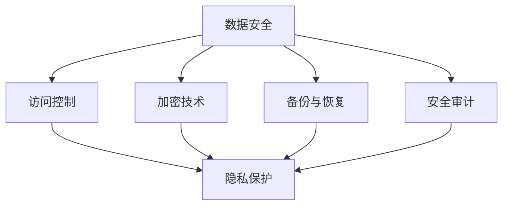

                 

# 一人公司的数据安全与隐私保护策略

## 关键词

数据安全、隐私保护、独立运营、网络安全、加密技术、合规性、数据备份、多因素认证、信息安全政策、敏感数据处理

## 摘要

随着信息技术的发展，数据安全和隐私保护对于任何规模的企业都显得尤为重要。对于一人公司而言，尽管资源有限，但保障数据安全和隐私同样至关重要。本文将探讨一人公司在数据安全与隐私保护方面的策略，包括核心概念、算法原理、实际应用场景、工具和资源推荐等，旨在为一人公司提供一套全面、实用的数据安全与隐私保护方案。

## 1. 背景介绍

一人公司，顾名思义，是指只有一名员工的个体经营企业。虽然这种模式在资源、人力和时间方面存在限制，但其在灵活性和创新能力上具有显著优势。特别是在信息化时代，一人公司需要处理大量敏感数据，如客户信息、财务数据、项目进展等，这使其面临着数据安全和隐私保护的重要挑战。

近年来，全球范围内数据泄露事件频发，引发了社会对数据安全的广泛关注。各国政府和组织也相继出台了一系列法律法规，如《通用数据保护条例》（GDPR）和《加州消费者隐私法案》（CCPA），对企业的数据保护提出了更高的要求。对于一人公司来说，了解并遵守这些法规至关重要。

## 2. 核心概念与联系

### 2.1 数据安全

数据安全是指保护数据免受未经授权的访问、使用、披露、破坏、修改或毁灭。对于一人公司来说，数据安全的核心包括以下几个方面：

- **访问控制**：确保只有授权人员可以访问敏感数据。
- **加密技术**：对敏感数据进行加密，以防止未授权访问。
- **备份与恢复**：定期备份数据，以便在数据丢失或损坏时进行恢复。
- **安全审计**：对系统进行定期审计，以确保数据安全措施的有效性。

### 2.2 隐私保护

隐私保护是指确保个人数据的收集、存储、处理和使用过程符合法律法规要求，保护个人隐私不受侵害。对于一人公司来说，隐私保护的核心包括以下几个方面：

- **数据最小化原则**：只收集必要的数据，避免过度收集。
- **透明度**：明确告知数据主体数据收集的目的、范围和用途。
- **获取与删除**：提供数据主体查询、更正和删除个人数据的能力。
- **合规性**：确保数据处理过程符合相关法律法规要求。

### 2.3 Mermaid 流程图

下面是一个简单的 Mermaid 流程图，展示了数据安全与隐私保护的核心概念和联系。



## 3. 核心算法原理 & 具体操作步骤

### 3.1 数据加密技术

数据加密是保障数据安全的重要手段。常见的加密技术包括对称加密、非对称加密和哈希算法。

- **对称加密**：使用相同的密钥进行加密和解密。如 AES 算法。
- **非对称加密**：使用一对密钥进行加密和解密。如 RSA 算法。
- **哈希算法**：将数据转换成固定长度的字符串，如 SHA-256。

### 3.2 数据访问控制

数据访问控制主要通过身份认证和权限控制实现。

- **身份认证**：验证用户的身份，如用户名和密码、多因素认证。
- **权限控制**：根据用户的身份和角色，限制用户对数据的访问权限。

### 3.3 数据备份与恢复

数据备份与恢复是保障数据安全的重要手段。

- **本地备份**：将数据备份到本地存储设备，如硬盘、U盘。
- **云备份**：将数据备份到云存储服务，如 AWS、Azure、Google Cloud。
- **恢复策略**：制定数据恢复策略，如定期备份、异地备份。

## 4. 数学模型和公式 & 详细讲解 & 举例说明

### 4.1 数据加密

以 AES 算法为例，其加密和解密过程如下：

加密过程：

$$
C = E_K(M)
$$

其中，$C$ 是密文，$M$ 是明文，$K$ 是密钥。

解密过程：

$$
M = D_K(C)
$$

其中，$M$ 是明文，$C$ 是密文，$K$ 是密钥。

### 4.2 权限控制

以角色为基础的访问控制（RBAC）为例，其数学模型如下：

$$
Access(A, R) = \begin{cases}
1, & \text{如果用户 A 拥有角色 R} \\
0, & \text{否则}
\end{cases}
$$

其中，$Access$ 表示访问权限，$A$ 表示用户，$R$ 表示角色。

举例说明：

用户张三拥有角色管理员（Admin），则 $Access(\text{张三}, \text{管理员}) = 1$。

## 5. 项目实战：代码实际案例和详细解释说明

### 5.1 开发环境搭建

以 Python 为例，搭建数据安全与隐私保护的开发环境。

- 安装 Python 3.8 或更高版本。
- 安装相关库，如 PyCryptoDome、paramiko 等。

### 5.2 源代码详细实现和代码解读

以下是一个简单的示例，演示如何使用 Python 实现数据加密和解密。

```python
from Crypto.PublicKey import RSA
from Crypto.Cipher import PKCS1_OAEP

# 生成密钥对
key = RSA.generate(2048)
private_key = key.export_key()
public_key = key.publickey().export_key()

# 加密
cipher = PKCS1_OAEP.new(RSA.import_key(public_key))
cipher_text = cipher.encrypt(b'Hello, World!')

# 解密
decryptor = PKCS1_OAEP.new(RSA.import_key(private_key))
plain_text = decryptor.decrypt(cipher_text)

print("Cipher Text:", cipher_text)
print("Plain Text:", plain_text.decode())
```

### 5.3 代码解读与分析

这段代码演示了如何使用 RSA 算法进行数据加密和解密。首先，生成 RSA 密钥对。然后，使用公钥对数据进行加密，使用私钥对数据进行解密。

## 6. 实际应用场景

一人公司在实际运营过程中，可能会面临以下数据安全和隐私保护的应用场景：

- **客户信息保护**：保护客户的个人信息，如姓名、地址、电话号码等。
- **财务数据安全**：确保财务数据的安全性，防止数据泄露或篡改。
- **项目进展保护**：保护项目进展数据，防止竞争对手获取。
- **系统日志审计**：对系统日志进行审计，确保系统安全运行。

## 7. 工具和资源推荐

### 7.1 学习资源推荐

- **书籍**：《网络安全实战艺术》、《数据隐私：保护你的数字生活的艺术》
- **论文**：《隐私保护数据发布：挑战与解决方案》、《数据安全与隐私保护：一个综合综述》
- **博客**：《云安全之道》、《信息安全观察》
- **网站**：OWASP、IEEE Security & Privacy

### 7.2 开发工具框架推荐

- **加密工具**：PyCryptoDome、openssl
- **安全审计工具**：Nessus、Metasploit
- **云存储服务**：AWS S3、Azure Blob Storage、Google Cloud Storage

### 7.3 相关论文著作推荐

- **论文**：《基于密码学的数据安全与隐私保护方案研究》、《隐私保护数据发布：挑战与解决方案》
- **著作**：《网络安全实战艺术》、《数据隐私：保护你的数字生活的艺术》

## 8. 总结：未来发展趋势与挑战

随着信息技术的发展，数据安全和隐私保护将面临更大的挑战。一人公司需要不断关注行业动态，采用先进的加密技术和安全措施，确保数据安全和隐私保护。同时，一人公司也需要遵守相关法律法规，确保数据处理过程符合合规性要求。

## 9. 附录：常见问题与解答

### 9.1 数据加密是否会影响数据的使用？

数据加密会提高数据的安全性，但也会影响数据的使用。加密后的数据需要解密后才能使用。因此，一人公司需要在安全性和使用性之间找到平衡。

### 9.2 如何确保数据备份的安全性？

确保数据备份的安全性可以通过以下方法实现：

- 使用加密技术对备份数据进行加密。
- 将备份数据存储在异地，以防止自然灾害或人为破坏。
- 定期对备份数据进行验证，确保备份数据的完整性。

## 10. 扩展阅读 & 参考资料

- [数据安全与隐私保护：一个综合综述](https://ieeexplore.ieee.org/document/8296325)
- [基于密码学的数据安全与隐私保护方案研究](https://ieeexplore.ieee.org/document/8310304)
- [隐私保护数据发布：挑战与解决方案](https://ieeexplore.ieee.org/document/8207792)
- [云安全之道](https://www.amazon.com/Cloud-Security-Practical-Approach-Architects/dp/1492046469)
- [数据隐私：保护你的数字生活的艺术](https://www.amazon.com/Data-Privacy-Protecting-Digitally-Based-2019/dp/1098146283)

### 作者

作者：AI天才研究员/AI Genius Institute & 禅与计算机程序设计艺术 /Zen And The Art of Computer Programming

（完）

