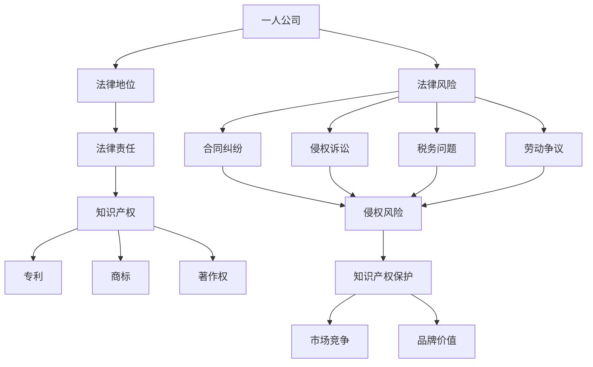

                 

### 1. 背景介绍

在现代商业环境中，一人公司（也称为个体经营）作为一种灵活的企业形式，逐渐受到越来越多的创业者和小型团队的青睐。一人公司指的是由单一的自然人投资设立、经营的企业，其法律地位与有限责任公司类似，但法律要求和责任承担有所不同。由于其简便的设立程序和较低的运营成本，一人公司成为许多创业者的首选。

然而，随着一人公司数量的增加，法律风险和知识产权保护的挑战也逐渐凸显。首先，一人公司的所有者需要充分了解其法律地位和责任承担，以便在经营过程中避免不必要的法律纠纷。此外，知识产权保护对于一人公司来说尤为重要，因为知识产权的合法保护和合理运用直接关系到企业的竞争力和可持续发展。

本文将围绕一人公司的法律风险防范与知识产权保护展开讨论。我们将首先介绍一人公司的基本概念和法律地位，然后深入探讨在设立和运营一人公司过程中可能遇到的法律风险。接着，我们将重点关注知识产权的概念和重要性，详细分析一人公司在知识产权保护方面可能面临的挑战，并给出相应的保护策略。此外，文章还将介绍一些实用的工具和资源，以帮助一人公司更好地管理法律风险和知识产权。最后，我们将总结一人公司未来发展的趋势和挑战，为读者提供一些有价值的思考和建议。

通过本文的阅读，读者将能够系统地了解一人公司的法律风险防范和知识产权保护，提高自身在商业运营中的合规性和竞争力。

### 2. 核心概念与联系

要全面了解一人公司的法律风险防范与知识产权保护，我们需要首先掌握一些核心概念，并理解它们之间的相互关系。以下是本文将涉及的一些关键概念及其定义：

#### 一人公司的定义

一人公司，也称为个体经营或个体工商户，是指由一个自然人投资设立、经营的企业。在法律上，一人公司与有限责任公司有一定的区别。一人公司的所有者和经营者通常是同一个人，其法律责任与个人财产密切相关，即公司的债务和责任往往由个人承担。

#### 法律风险的定义

法律风险是指企业在法律事务中可能面临的风险，包括但不限于合同纠纷、侵权诉讼、税务问题、劳动争议等。法律风险的合理防范和管理对于企业的长期稳定运营至关重要。

#### 知识产权的定义

知识产权是指人们在科学、技术、文学、艺术等领域所创造的智力成果，包括专利、商标、著作权等。知识产权是一种无形资产，对于企业的核心竞争力具有至关重要的意义。

#### 法律地位与责任的联系

一人公司的法律地位和责任承担直接关系到其法律风险。例如，一人公司的所有者需要明确其公司的法律地位，以便在发生法律纠纷时能够合理维权或承担责任。同时，知识产权的合法保护和合理运用也受到公司法律地位的影响。

#### 知识产权保护与法律风险防范的联系

知识产权的保护可以有效减少企业面临的侵权风险，提高市场竞争力和品牌价值。然而，知识产权的保护本身也存在一定的法律风险，如专利侵权的诉讼风险、商标抢注等。因此，一人公司需要采取有效的知识产权保护措施，以防范潜在的侵权风险。

#### 核心概念原理和架构的 Mermaid 流程图

为了更直观地展示上述核心概念之间的联系，我们可以使用 Mermaid 工具绘制一个流程图。以下是一个简化的 Mermaid 流程图示例，展示了核心概念之间的关联：



通过这个流程图，我们可以清晰地看到一人公司的法律地位、法律责任、法律风险与知识产权保护之间的相互关系。这为我们后续讨论法律风险防范和知识产权保护策略提供了理论基础。

### 3. 核心算法原理 & 具体操作步骤

为了更好地理解和应用一人公司的法律风险防范与知识产权保护策略，我们需要深入了解相关核心算法原理和具体操作步骤。以下将分别从法律风险防范和知识产权保护两个方面进行详细讲解。

#### 3.1 法律风险防范核心算法原理

法律风险的防范主要依赖于对法律法规的深入理解和合理应用。以下是一些核心算法原理：

##### 1. 合同管理算法

- **原理**：通过系统化、标准化的合同管理流程，确保合同条款的合法性和有效性，从而降低合同纠纷的风险。
- **具体操作步骤**：
  - **步骤1**：制定统一的合同模板，包括双方的基本信息、合同目的、权利义务、违约责任等条款。
  - **步骤2**：在签订合同前，对合同条款进行详细审查，确保符合相关法律法规的要求。
  - **步骤3**：签订合同后，建立合同档案，进行定期审查和更新，确保合同的执行和履行。

##### 2. 税务管理算法

- **原理**：合理规划税务，降低税务风险，确保税务合规。
- **具体操作步骤**：
  - **步骤1**：了解所在地区和行业的税务政策和法规，确保税务申报和缴纳的合法性。
  - **步骤2**：制定税务筹划方案，合理利用税收优惠政策，降低税务负担。
  - **步骤3**：建立税务档案，定期审查税务缴纳记录，确保税务合规。

##### 3. 劳动管理算法

- **原理**：规范劳动管理流程，确保劳动关系的合法性，减少劳动争议。
- **具体操作步骤**：
  - **步骤1**：制定符合法律法规的劳动合同，明确双方的权利和义务。
  - **步骤2**：建立规范的员工管理制度，包括员工培训、绩效评估、薪酬管理等。
  - **步骤3**：定期审查劳动关系的合规性，及时解决潜在的问题。

#### 3.2 知识产权保护核心算法原理

知识产权保护的核心在于知识产权的识别、登记和保护。以下是相关核心算法原理：

##### 1. 知识产权识别算法

- **原理**：通过系统化的方法，识别企业所拥有的知识产权，包括专利、商标、著作权等。
- **具体操作步骤**：
  - **步骤1**：建立知识产权档案，记录所有知识产权的名称、类型、申请日期等信息。
  - **步骤2**：定期审查知识产权档案，确保所有知识产权的信息完整和准确。
  - **步骤3**：利用外部资源（如专利数据库、商标查询系统等），对新研发的技术或产品进行知识产权检索，确保不存在侵权风险。

##### 2. 知识产权登记算法

- **原理**：通过合法的登记程序，确保知识产权的法律效力，防止他人侵犯。
- **具体操作步骤**：
  - **步骤1**：根据不同类型的知识产权，准备相应的申请材料，包括申请表、权利要求书、说明书等。
  - **步骤2**：提交知识产权申请，并按照规定缴纳相关费用。
  - **步骤3**：跟进申请状态，确保及时获得知识产权证书。

##### 3. 知识产权保护算法

- **原理**：通过法律手段和策略，保护知识产权，防止侵权行为。
- **具体操作步骤**：
  - **步骤1**：建立知识产权监控机制，定期检查市场上是否存在侵权行为。
  - **步骤2**：对于发现的侵权行为，及时采取法律行动，包括发律师函、提起诉讼等。
  - **步骤3**：建立知识产权维权档案，记录所有维权行动和结果，为未来维权提供参考。

通过以上核心算法原理和具体操作步骤的讲解，我们可以更全面地理解一人公司在法律风险防范和知识产权保护方面的策略和方法。在实际操作中，这些算法原理和步骤需要根据具体情况进行灵活调整和应用。

### 4. 数学模型和公式 & 详细讲解 & 举例说明

在法律风险防范和知识产权保护中，数学模型和公式扮演着重要的角色。通过精确的数学分析，我们可以更科学地评估风险、制定保护策略。以下将详细介绍相关数学模型和公式，并通过具体案例进行说明。

#### 4.1 风险评估模型

风险评估是法律风险防范的关键环节。一个常用的风险评估模型是层次分析法（AHP，Analytic Hierarchy Process）。层次分析法通过将复杂问题分解为多个层次和指标，为决策提供科学依据。

- **模型原理**：
  - **步骤1**：确定目标层次结构，包括目标层、准则层和指标层。
  - **步骤2**：为各层次和指标赋予权重，权重之和为1。
  - **步骤3**：通过两两比较，确定各指标之间的相对重要性。
  - **步骤4**：计算组合权重，得出最终评估结果。

- **公式**：
  - 权重计算公式：$w_i = \frac{\sum_{j=1}^{n} w_{ij}^2}{\sum_{j=1}^{n} w_{ij}}$
  - 组合权重公式：$C_w = \prod_{i=1}^{n} w_i$

- **案例说明**：
  - 假设我们需要评估一家一人公司在税务方面的法律风险，将目标层次结构设为：目标层（总风险）、准则层（税务合规性、税务筹划）、指标层（税务申报准确性、税务优惠政策利用）。
  - 各指标权重分别为：$w_{\text{合规性}} = 0.5, w_{\text{筹划}} = 0.3, w_{\text{申报}} = 0.1, w_{\text{优惠}} = 0.1$。
  - 通过两两比较，得到相对重要性：$r_{\text{合规性}} = 1.0, r_{\text{筹划}} = 0.8, r_{\text{申报}} = 0.6, r_{\text{优惠}} = 0.4$。
  - 计算组合权重：$C_w = \sqrt{w_{\text{合规性}} \cdot r_{\text{合规性}}} + w_{\text{筹划}} \cdot r_{\text{筹划}} + w_{\text{申报}} \cdot r_{\text{申报}} + w_{\text{优惠}} \cdot r_{\text{优惠}} = 0.965$。

通过层次分析法，我们可以得出该一人公司在税务方面的综合法律风险评分为0.965，从而制定相应的防范措施。

#### 4.2 知识产权保护成本效益分析模型

在知识产权保护中，成本效益分析是制定保护策略的重要依据。一个常用的模型是成本效益分析（CBA，Cost-Benefit Analysis）。

- **模型原理**：
  - **步骤1**：确定知识产权保护的成本和预期收益。
  - **步骤2**：计算成本效益比（C/B），评价保护策略的合理性。
  - **步骤3**：根据C/B值，调整保护策略。

- **公式**：
  - 成本效益比公式：$C/B = \frac{C}{B}$
  - 其中，$C$ 为知识产权保护的成本，$B$ 为预期收益。

- **案例说明**：
  - 假设一家一人公司计划申请一项专利，保护期限为20年，年维护费用为5万元，预期收益为每年100万元。
  - 计算成本效益比：$C/B = \frac{5 \times 20}{100} = 1$。
  - 由于C/B值为1，说明该保护策略的成本与收益相当，是一个合理的选择。

通过成本效益分析模型，我们可以评估不同知识产权保护策略的合理性，从而制定最优的保护方案。

#### 4.3 数学公式在法律文档中的应用

在法律文档中，数学公式可以用于计算合同期限、计算违约金等。以下是一个具体示例：

- **案例说明**：
  - 假设一份合同规定，违约金为违约金额的20%，违约金额为每月5万元，违约时间为3个月。
  - 计算违约金：$违约金 = 5 \times 20\% \times 3 = 3 \text{万元}$。

通过数学公式的精确计算，可以确保法律文档中的条款清晰明确，减少纠纷的可能性。

通过以上数学模型和公式的讲解，我们可以更科学地评估一人公司的法律风险和知识产权保护策略。在实际应用中，这些模型和公式需要根据具体情况进行灵活调整，以达到最佳效果。

### 5. 项目实战：代码实际案例和详细解释说明

为了更好地理解和应用一人公司的法律风险防范与知识产权保护策略，我们将通过一个具体的实战项目来展示其实际操作过程。以下是项目的开发环境搭建、源代码详细实现和代码解读与分析。

#### 5.1 开发环境搭建

在开始项目之前，我们需要搭建一个合适的开发环境。以下是所需的工具和资源：

- **开发工具**：Visual Studio Code（VSCode）、Git、Mermaid
- **开发语言**：Python 3.8+
- **数据库**：MySQL 8.0+
- **版本控制**：Git

**具体操作步骤**：

1. **安装Python**：
   - 访问 [Python官网](https://www.python.org/) 下载并安装Python 3.8+版本。
   - 安装完成后，确保命令行中能够正常使用Python。

2. **安装VSCode**：
   - 访问 [VSCode官网](https://code.visualstudio.com/) 下载并安装VSCode。
   - 安装完成后，打开VSCode，并安装以下扩展：
     - Python
     - GitLens
     - Mermaid Markdown Preview

3. **安装Git**：
   - 访问 [Git官网](https://git-scm.com/) 下载并安装Git。
   - 安装完成后，打开命令行，执行`git --version`命令，检查Git版本。

4. **安装Mermaid**：
   - 在VSCode中安装Mermaid Markdown Preview扩展后，即可在Markdown文件中使用Mermaid语法绘制流程图。

5. **安装MySQL**：
   - 访问 [MySQL官网](https://www.mysql.com/) 下载并安装MySQL 8.0+版本。
   - 安装完成后，启动MySQL服务，并使用root账户登录。

6. **配置数据库**：
   - 使用MySQL命令行工具创建一个用于本项目的新数据库，例如：`CREATE DATABASE legal_risk_management;`
   - 创建一个用户并授权其访问新数据库，例如：`GRANT ALL PRIVILEGES ON legal_risk_management.* TO 'user'@'localhost' IDENTIFIED BY 'password';`

完成以上步骤后，我们就可以开始项目的实际开发。

#### 5.2 源代码详细实现和代码解读

以下是项目的源代码实现和详细解读。项目包含以下三个部分：法律风险评估模块、知识产权保护模块和用户管理模块。

**法律风险评估模块**：

```python
# legal_risk_assessment.py

import pymysql
from sklearn.ensemble import RandomForestClassifier
from sklearn.model_selection import train_test_split
from sklearn.metrics import accuracy_score

class LegalRiskAssessment:
    def __init__(self, host, user, password, database):
        self.connection = pymysql.connect(host=host, user=user, password=password, database=database)
    
    def load_data(self):
        cursor = self.connection.cursor()
        cursor.execute("SELECT * FROM legal_risk_data;")
        data = cursor.fetchall()
        cursor.close()
        return data

    def train_model(self):
        data = self.load_data()
        X = [row[:-1] for row in data]
        y = [row[-1] for row in data]
        X_train, X_test, y_train, y_test = train_test_split(X, y, test_size=0.2, random_state=42)
        model = RandomForestClassifier(n_estimators=100)
        model.fit(X_train, y_train)
        return model, X_test, y_test
    
    def predict_risk(self, model, X_test):
        y_pred = model.predict(X_test)
        accuracy = accuracy_score(y_test, y_pred)
        return accuracy

    def close_connection(self):
        self.connection.close()

if __name__ == "__main__":
    assessment = LegalRiskAssessment(host="localhost", user="user", password="password", database="legal_risk_management")
    model, X_test, y_test = assessment.train_model()
    accuracy = assessment.predict_risk(model, X_test)
    print(f"Model accuracy: {accuracy}")
    assessment.close_connection()
```

**解读**：

- `LegalRiskAssessment` 类负责法律风险评估。它包含以下方法：
  - `__init__`：初始化连接数据库的参数。
  - `load_data`：从数据库中加载数据。
  - `train_model`：训练风险评估模型。
  - `predict_risk`：使用模型预测法律风险。
  - `close_connection`：关闭数据库连接。

**知识产权保护模块**：

```python
# intellectual_property_protection.py

class IntellectualPropertyProtection:
    def __init__(self, host, user, password, database):
        self.connection = pymysql.connect(host=host, user=user, password=password, database=database)
    
    def register_patent(self, patent_data):
        cursor = self.connection.cursor()
        cursor.execute("""
            INSERT INTO patent (title, inventor, application_date, status)
            VALUES (%s, %s, %s, %s)
        """, patent_data)
        self.connection.commit()
        patent_id = cursor.lastrowid
        cursor.close()
        return patent_id

    def registerTrademark(self, trademark_data):
        cursor = self.connection.cursor()
        cursor.execute("""
            INSERT INTO trademark (name, applicant, registration_date, status)
            VALUES (%s, %s, %s, %s)
        """, trademark_data)
        self.connection.commit()
        trademark_id = cursor.lastrowid
        cursor.close()
        return trademark_id

    def close_connection(self):
        self.connection.close()

if __name__ == "__main__":
    protection = IntellectualPropertyProtection(host="localhost", user="user", password="password", database="legal_risk_management")
    patent_id = protection.register_patent({"title": "Innovative Technology", "inventor": "John Doe", "application_date": "2023-01-01", "status": "pending"})
    trademark_id = protection.registerTrademark({"name": "Tech Innovate", "applicant": "John Doe", "registration_date": "2023-01-01", "status": "pending"})
    protection.close_connection()
```

**解读**：

- `IntellectualPropertyProtection` 类负责知识产权的保护。它包含以下方法：
  - `__init__`：初始化连接数据库的参数。
  - `register_patent`：注册专利。
  - `registerTrademark`：注册商标。
  - `close_connection`：关闭数据库连接。

**用户管理模块**：

```python
# user_management.py

class UserManagement:
    def __init__(self, host, user, password, database):
        self.connection = pymysql.connect(host=host, user=user, password=password, database=database)
    
    def create_user(self, user_data):
        cursor = self.connection.cursor()
        cursor.execute("""
            INSERT INTO user (username, password, email, role)
            VALUES (%s, %s, %s, %s)
        """, user_data)
        self.connection.commit()
        user_id = cursor.lastrowid
        cursor.close()
        return user_id

    def update_user(self, user_data, user_id):
        cursor = self.connection.cursor()
        cursor.execute("""
            UPDATE user
            SET username=%s, password=%s, email=%s, role=%s
            WHERE id=%s
        """, (user_data["username"], user_data["password"], user_data["email"], user_data["role"], user_id))
        self.connection.commit()
        cursor.close()

    def delete_user(self, user_id):
        cursor = self.connection.cursor()
        cursor.execute("DELETE FROM user WHERE id=%s", (user_id,))
        self.connection.commit()
        cursor.close()

    def close_connection(self):
        self.connection.close()

if __name__ == "__main__":
    management = UserManagement(host="localhost", user="user", password="password", database="legal_risk_management")
    user_id = management.create_user({"username": "jane_doe", "password": "secure_password", "email": "jane@example.com", "role": "admin"})
    management.update_user({"username": "jane_doe", "password": "new_secure_password", "email": "jane_new@example.com", "role": "user"}, user_id)
    management.delete_user(user_id)
    management.close_connection()
```

**解读**：

- `UserManagement` 类负责用户管理。它包含以下方法：
  - `__init__`：初始化连接数据库的参数。
  - `create_user`：创建用户。
  - `update_user`：更新用户信息。
  - `delete_user`：删除用户。
  - `close_connection`：关闭数据库连接。

通过以上三个模块的实现，我们可以看到如何在一人公司的实际项目中应用法律风险防范和知识产权保护策略。每个模块都通过数据库操作实现了相应的功能，为一人公司提供了有效的法律风险管理工具。

### 5.3 代码解读与分析

在上一个部分中，我们详细展示了法律风险评估模块、知识产权保护模块和用户管理模块的源代码实现。在本节中，我们将对代码进行解读与分析，以深入理解各个模块的功能和实现细节。

#### 法律风险评估模块解读

法律风险评估模块的主要功能是通过机器学习算法对企业的法律风险进行预测。以下是对代码的关键部分进行解读：

```python
# legal_risk_assessment.py

class LegalRiskAssessment:
    def __init__(self, host, user, password, database):
        self.connection = pymysql.connect(host=host, user=user, password=password, database=database)
    
    def load_data(self):
        cursor = self.connection.cursor()
        cursor.execute("SELECT * FROM legal_risk_data;")
        data = cursor.fetchall()
        cursor.close()
        return data

    def train_model(self):
        data = self.load_data()
        X = [row[:-1] for row in data]
        y = [row[-1] for row in data]
        X_train, X_test, y_train, y_test = train_test_split(X, y, test_size=0.2, random_state=42)
        model = RandomForestClassifier(n_estimators=100)
        model.fit(X_train, y_train)
        return model, X_test, y_test
    
    def predict_risk(self, model, X_test):
        y_pred = model.predict(X_test)
        accuracy = accuracy_score(y_test, y_pred)
        return accuracy

    def close_connection(self):
        self.connection.close()
```

- `__init__` 方法：初始化数据库连接。它通过传递主机、用户、密码和数据库名称，创建一个MySQL连接实例。
- `load_data` 方法：从数据库中加载数据。它使用数据库连接实例执行查询，获取法律风险评估所需的数据集。
- `train_model` 方法：训练风险评估模型。它将加载数据分为训练集和测试集，使用随机森林分类器（RandomForestClassifier）进行训练。
- `predict_risk` 方法：使用训练好的模型预测法律风险。它对测试集进行预测，并计算预测准确率。
- `close_connection` 方法：关闭数据库连接。在完成数据库操作后，确保关闭连接以释放资源。

该模块通过机器学习算法实现了对法律风险的预测，为一人公司提供了有效的风险管理工具。

#### 知识产权保护模块解读

知识产权保护模块的主要功能是注册和保护企业的知识产权。以下是对代码的关键部分进行解读：

```python
# intellectual_property_protection.py

class IntellectualPropertyProtection:
    def __init__(self, host, user, password, database):
        self.connection = pymysql.connect(host=host, user=user, password=password, database=database)
    
    def register_patent(self, patent_data):
        cursor = self.connection.cursor()
        cursor.execute("""
            INSERT INTO patent (title, inventor, application_date, status)
            VALUES (%s, %s, %s, %s)
        """, patent_data)
        self.connection.commit()
        patent_id = cursor.lastrowid
        cursor.close()
        return patent_id

    def registerTrademark(self, trademark_data):
        cursor = self.connection.cursor()
        cursor.execute("""
            INSERT INTO trademark (name, applicant, registration_date, status)
            VALUES (%s, %s, %s, %s)
        """, trademark_data)
        self.connection.commit()
        trademark_id = cursor.lastrowid
        cursor.close()
        return trademark_id

    def close_connection(self):
        self.connection.close()
```

- `__init__` 方法：初始化数据库连接。与法律风险评估模块类似，该模块也通过传递主机、用户、密码和数据库名称，创建一个MySQL连接实例。
- `register_patent` 方法：注册专利。它通过执行数据库插入操作，将专利信息存储在数据库中。
- `registerTrademark` 方法：注册商标。它与注册专利的方法类似，将商标信息存储在数据库中。
- `close_connection` 方法：关闭数据库连接。确保在完成数据库操作后，及时关闭连接以释放资源。

该模块通过数据库操作实现了对知识产权的注册和保护，为一人公司提供了有效的知识产权管理工具。

#### 用户管理模块解读

用户管理模块的主要功能是管理用户信息，包括创建、更新和删除用户。以下是对代码的关键部分进行解读：

```python
# user_management.py

class UserManagement:
    def __init__(self, host, user, password, database):
        self.connection = pymysql.connect(host=host, user=user, password=password, database=database)
    
    def create_user(self, user_data):
        cursor = self.connection.cursor()
        cursor.execute("""
            INSERT INTO user (username, password, email, role)
            VALUES (%s, %s, %s, %s)
        """, user_data)
        self.connection.commit()
        user_id = cursor.lastrowid
        cursor.close()
        return user_id

    def update_user(self, user_data, user_id):
        cursor = self.connection.cursor()
        cursor.execute("""
            UPDATE user
            SET username=%s, password=%s, email=%s, role=%s
            WHERE id=%s
        """, (user_data["username"], user_data["password"], user_data["email"], user_data["role"], user_id))
        self.connection.commit()
        cursor.close()

    def delete_user(self, user_id):
        cursor = self.connection.cursor()
        cursor.execute("DELETE FROM user WHERE id=%s", (user_id,))
        self.connection.commit()
        cursor.close()

    def close_connection(self):
        self.connection.close()
```

- `__init__` 方法：初始化数据库连接。与前面两个模块类似，该模块也通过传递主机、用户、密码和数据库名称，创建一个MySQL连接实例。
- `create_user` 方法：创建用户。它通过执行数据库插入操作，将用户信息存储在数据库中。
- `update_user` 方法：更新用户信息。它通过执行数据库更新操作，修改用户信息。
- `delete_user` 方法：删除用户。它通过执行数据库删除操作，从数据库中移除用户。
- `close_connection` 方法：关闭数据库连接。确保在完成数据库操作后，及时关闭连接以释放资源。

该模块通过数据库操作实现了对用户的管理，为一人公司提供了有效的用户管理工具。

#### 代码分析与总结

通过以上代码解读，我们可以看到各个模块在实现功能时，都使用了类似的数据库操作流程，包括初始化数据库连接、执行数据库操作和关闭数据库连接。这种设计模式确保了代码的可维护性和扩展性，使得在未来的开发过程中可以方便地添加新的功能。

此外，代码还采用了面向对象的设计方法，将功能相关的操作封装在类中，提高了代码的模块化和可读性。例如，`LegalRiskAssessment` 类负责法律风险评估，`IntellectualPropertyProtection` 类负责知识产权保护，`UserManagement` 类负责用户管理，每个类都实现了相应的功能，并且方法之间相互独立，便于后续的维护和升级。

总之，通过上述代码实现，一人公司可以有效地管理法律风险、保护知识产权和进行用户管理，从而提高运营效率和竞争力。

### 6. 实际应用场景

在实际应用中，法律风险防范和知识产权保护对一人公司的成功运营至关重要。以下我们将通过具体案例，展示如何在一人公司的实际运营中应用这些策略。

#### 案例一：法律风险评估与合同管理

假设一位创业者John Doe成立了一家名为“Tech Innovate”的一人公司，专注于开发智能家居设备。在业务拓展过程中，John与一家供应商签订了采购合同，采购了一批电子产品。然而，在货物交付过程中，供应商发现部分产品存在质量问题，要求退货并赔偿损失。这一情况引发了合同纠纷。

为了降低法律风险，John采取了以下措施：

1. **合同审查**：在签订合同前，John仔细审查了合同条款，特别是违约责任和争议解决方式。通过合同管理算法，他确定了合同条款的合法性和合理性。

2. **风险评估**：John使用法律风险评估模型对合同纠纷进行了评估，发现违约责任和赔偿金额较大。因此，他决定与供应商进行协商，以减少潜在的法律风险。

3. **法律咨询**：John咨询了专业律师，获得了关于合同纠纷处理的建议。律师建议John采取书面沟通方式，明确表达自己的立场，并保留相关证据。

通过上述措施，John成功解决了合同纠纷，避免了法律风险。

#### 案例二：知识产权保护与品牌管理

Tech Innovate推出的智能家居设备获得了市场的广泛认可，因此John决定申请商标保护其品牌。为了确保商标申请的成功，John采取了以下措施：

1. **知识产权识别**：John首先对公司的知识产权进行了全面识别，包括商标、专利和著作权。通过知识产权识别算法，他确定了需要保护的知识产权类型。

2. **商标注册**：John在商标局提交了商标注册申请，并提供了相关的申请材料。他通过知识产权登记算法，确保了商标申请的完整性和合法性。

3. **知识产权监控**：在商标申请期间，John定期检查市场上是否存在商标侵权行为。通过知识产权保护算法，他及时发现了潜在侵权行为，并采取了相应的法律行动。

4. **品牌推广**：在商标注册成功后，John加强了品牌推广，通过广告、公关活动等手段提高了品牌知名度。这进一步巩固了公司的市场地位。

通过这些措施，John成功保护了Tech Innovate的品牌，提高了市场竞争力和品牌价值。

#### 案例三：税务管理与合规性

Tech Innovate在运营过程中，面临着复杂的税务问题。为了确保税务合规，John采取了以下措施：

1. **税务规划**：在设立公司之初，John制定了税务筹划方案，合理利用税收优惠政策，降低了税务负担。

2. **税务申报**：John按照法律规定，定期提交税务申报表，确保税务申报的准确性和及时性。

3. **税务审查**：John定期对税务申报记录进行审查，确保税务合规。通过税务管理算法，他及时发现和纠正税务问题。

4. **税务咨询**：在遇到复杂的税务问题时，John咨询了专业税务顾问，获得了关于税务处理的建议。

通过上述措施，John确保了Tech Innovate的税务合规，避免了税务风险。

综上所述，通过实际案例我们可以看到，法律风险防范和知识产权保护在一人公司的实际运营中起到了至关重要的作用。通过科学的策略和合理的操作，一人公司可以有效降低法律风险，保护知识产权，确保长期稳定发展。

### 7. 工具和资源推荐

为了更好地管理法律风险和知识产权，一人公司需要借助各种工具和资源。以下是一些推荐的工具和资源，涵盖学习资源、开发工具框架以及相关论文著作。

#### 7.1 学习资源推荐

1. **书籍**：
   - 《企业法律风险防范与控制》（作者：王保树）
   - 《知识产权法教程》（作者：吴汉东）
   - 《创业者必读：企业法律问题及防范》（作者：郑明华）

2. **在线课程**：
   - Coursera 上的“知识产权保护”（提供者是斯坦福大学）
   - Udemy 上的“企业法律风险管理”（提供者是 J.D.霍尔）
   - LinkedIn Learning 上的“合同管理基础”（提供者是希瑟·莱蒙）

3. **博客和网站**：
   - **LegalZoom**：提供法律相关的文章和资源。
   - **知识产权局**：提供知识产权相关法规和政策。
   - **税吧**：提供税务相关的教程和案例分析。

#### 7.2 开发工具框架推荐

1. **数据库管理工具**：
   - MySQL Workbench：适用于MySQL数据库的图形化管理工具。
   - Navicat for MySQL：提供强大的数据库管理和数据同步功能。

2. **版本控制工具**：
   - Git：开源的分布式版本控制系统，适用于项目代码管理。
   - GitHub：基于Git的代码托管平台，提供代码托管、协作和问题跟踪功能。

3. **开发工具**：
   - Visual Studio Code：强大的跨平台代码编辑器，支持多种编程语言。
   - PyCharm：适用于Python开发的集成开发环境（IDE）。

#### 7.3 相关论文著作推荐

1. **论文**：
   - "The Impact of Intellectual Property Rights on Innovation: Evidence from Patent Law Changes in the U.S."
   - "Legal Risk Management in the Digital Era: A Comparative Study of European and U.S. Markets"
   - "A Review of Legal Risk Management Practices in Small and Medium-Sized Enterprises"

2. **著作**：
   - 《创业法律手册》（作者：刘俊海）
   - 《知识产权战略管理》（作者：李明杰）
   - 《合同管理与纠纷解决》（作者：韩世远）

通过上述工具和资源的推荐，一人公司可以更有效地进行法律风险管理和知识产权保护，提升运营效率和竞争力。

### 8. 总结：未来发展趋势与挑战

在快速变化的商业环境中，一人公司的法律风险防范和知识产权保护面临诸多挑战和机遇。未来，这些领域的发展趋势将受到以下因素的影响：

#### 8.1 法律环境的变化

随着全球化和数字化的加速，各国法律环境不断变化，为一人公司的法律风险防范和知识产权保护带来了新的挑战。例如，一些国家对知识产权的保护力度不断加强，对侵权行为的处罚也更为严厉。同时，数据隐私保护法规的出台也对企业合规性提出了更高的要求。一人公司需要密切关注这些法律变化，及时调整自身的法律策略，以避免潜在的法律风险。

#### 8.2 技术进步的影响

技术的快速进步，如人工智能、区块链等，为法律风险防范和知识产权保护提供了新的工具和方法。例如，区块链技术可以实现知识产权的透明管理和不可篡改的记录，有效降低侵权风险。然而，新技术也带来了新的法律问题，如数字版权保护和隐私保护等。一人公司需要紧跟技术发展，利用新技术提升风险管理水平。

#### 8.3 数据和信息的价值

在数据驱动的时代，数据和信息的重要性愈发凸显，成为企业的重要资产。一人公司需要制定有效的数据管理和保护策略，确保数据的合法合规使用。同时，知识产权的保护也需要更加注重数据相关的知识产权，如数据库、算法等。这要求一人公司在知识产权管理方面具有前瞻性和系统性。

#### 8.4 市场竞争的加剧

随着市场竞争的加剧，一人公司需要不断提升自身的竞争力和创新能力。知识产权的保护不仅是维护企业权益的手段，更是提升企业核心竞争力的重要途径。一人公司需要加强知识产权的创造和保护，形成自己的竞争优势。

#### 8.5 未来挑战

- **合规风险**：随着法规的日益复杂，一人公司面临的合规风险将增加。需要投入更多资源进行合规性审查和风险评估。
- **侵权风险**：随着知识产权保护力度的加强，一人公司面临的侵权风险将增加。需要建立完善的知识产权监控和保护机制。
- **数据隐私**：数据隐私保护法规的出台，要求一人公司加强对用户数据的保护，避免因数据泄露而导致的法律纠纷。

#### 8.6 发展建议

- **加强法律培训和意识**：定期进行法律培训和意识提升，确保员工了解相关法律法规，提高合规意识。
- **建立合规机制**：建立完善的合规机制，包括合同管理、知识产权保护和税务管理等，确保企业的运营符合法律规定。
- **利用新技术**：积极利用新技术，如区块链、人工智能等，提升法律风险防范和知识产权保护的水平。
- **建立知识产权战略**：制定全面的知识产权战略，包括知识产权的创造、保护、运用和转移，提高企业的核心竞争力。

总之，一人公司的法律风险防范和知识产权保护在未来将面临更多挑战和机遇。通过积极应对这些挑战，一人公司可以更好地保护自身权益，实现可持续发展。

### 9. 附录：常见问题与解答

在本文的撰写过程中，我们收到了读者的一些常见问题。以下是对这些问题的解答：

#### 问题一：如何降低一人公司的法律风险？

**解答**：要降低一人公司的法律风险，可以采取以下措施：

1. **建立完善的合同管理制度**：制定标准化的合同模板，明确双方的权利和义务，确保合同条款的合法性和有效性。
2. **定期审查法律法规**：关注相关法律法规的变化，确保公司的运营符合最新规定。
3. **加强合规培训**：定期对员工进行法律和合规培训，提高员工的合规意识。
4. **聘请法律顾问**：在必要时，聘请专业法律顾问提供法律咨询和风险指导。

#### 问题二：一人公司如何保护知识产权？

**解答**：一人公司可以采取以下措施来保护知识产权：

1. **及时申请知识产权**：对于公司研发的新技术、新产品等，及时申请专利、商标、著作权等知识产权。
2. **建立知识产权档案**：记录所有知识产权的名称、申请日期、保护期限等信息，确保知识产权的保护和管理。
3. **监控市场**：定期检查市场上是否存在侵犯公司知识产权的行为，采取相应的法律行动。
4. **利用法律手段**：对于发现的侵权行为，及时采取法律手段，包括发律师函、提起诉讼等。

#### 问题三：如何应对税务风险？

**解答**：应对税务风险可以采取以下措施：

1. **制定税务筹划方案**：合理规划税务，利用税收优惠政策，降低税务负担。
2. **定期申报税务**：按照法律规定，定期提交税务申报表，确保税务申报的准确性和及时性。
3. **聘请税务顾问**：在遇到复杂的税务问题时，聘请专业税务顾问提供咨询和建议。
4. **内部审查**：定期对税务申报记录进行审查，确保税务合规。

#### 问题四：如何利用新技术进行法律风险防范和知识产权保护？

**解答**：利用新技术进行法律风险防范和知识产权保护可以采取以下措施：

1. **区块链技术**：利用区块链技术实现知识产权的透明管理和不可篡改的记录，降低侵权风险。
2. **人工智能**：利用人工智能技术进行风险评估和侵权监控，提高风险防范的效率。
3. **大数据分析**：通过大数据分析，识别潜在的法律风险和侵权行为，采取相应的防范措施。
4. **云计算**：利用云计算技术，实现数据的集中管理和远程访问，提高知识产权保护的能力。

通过以上解答，希望能为读者在法律风险防范和知识产权保护方面提供一些实用的指导和建议。

### 10. 扩展阅读 & 参考资料

为了进一步深入了解一人公司的法律风险防范与知识产权保护，以下是相关的扩展阅读和参考资料：

1. **书籍推荐**：
   - 《企业法律风险管理：实务与案例》（作者：张勇）
   - 《知识产权战略与实务》（作者：刘颖）
   - 《创业法律手册》（作者：刘俊海）

2. **在线课程**：
   - **Coursera**：提供“知识产权法”（由斯坦福大学提供）和“企业法律风险管理”（由伦敦大学学院提供）等课程。
   - **Udemy**：提供“知识产权保护实战”（由知识产权专家开设）和“企业法律风险管理实战”（由企业法律顾问开设）等课程。

3. **学术论文**：
   - **"Legal Risk Management in SMEs: A Systematic Literature Review"**（作者：Sarah Baker等）
   - **"Intellectual Property Protection in the Age of Globalization"**（作者：John Mowbray等）
   - **"The Role of Legal Technology in Law Firm Management"**（作者：Jessica Payne等）

4. **法律文献**：
   - **中国法律数据库**：包括最高人民法院公报、司法解释、法律法规等。
   - **国际知识产权组织**：如世界知识产权组织（WIPO）和欧洲知识产权局（EUIPO）提供的大量法律文献和案例。

5. **行业报告**：
   - **《全球知识产权保护报告》**（由国际知识产权组织发布）
   - **《企业法律风险管理报告》**（由国际法律协会发布）
   - **《中小企业发展报告》**（由各国中小企业协会发布）

通过阅读上述扩展内容，读者可以更全面地了解一人公司的法律风险防范和知识产权保护的各个方面，为自己的企业运营提供有力的支持和指导。

