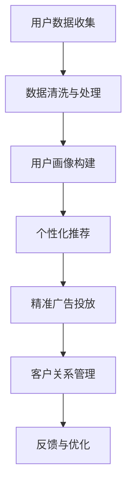

                 

# 一人公司的用户画像绘制与精准营销实施

## 关键词：用户画像、精准营销、一人公司、数据驱动、个性化推荐

## 摘要：

本文旨在探讨如何为一人在经营的公司绘制精准的用户画像，并实施有效的精准营销策略。通过深入分析用户数据，构建用户画像，我们将详细解析如何利用这些画像来实现个性化的产品推荐、精准的广告投放以及提升客户满意度和忠诚度。本文不仅提供理论上的指导，还结合实际案例，展示了一套完整的用户画像绘制与精准营销实施流程，旨在帮助一人公司在竞争激烈的市场中脱颖而出。

## 1. 背景介绍

### 一人公司的现状

在当今数字化时代，越来越多的创业者选择以一人公司的形式开始自己的创业之路。这种模式的优势在于灵活性高、决策迅速、运营成本相对较低。然而，随着市场的竞争日益激烈，一人公司面临着资源有限、客户群体分散、营销手段单一等挑战。

### 用户画像与精准营销的重要性

用户画像是一种通过收集和分析用户行为数据，构建出用户特征的模型。通过用户画像，企业可以深入了解目标客户，实现个性化推荐、精准营销和客户关系管理。精准营销则是指利用用户画像等数据，制定有针对性的营销策略，提高营销效果和客户转化率。

### 本文目的

本文将围绕一人公司的用户画像绘制与精准营销实施展开，旨在：

1. 介绍用户画像和精准营销的基本概念。
2. 解析如何构建用户画像，包括数据收集、分析和模型构建。
3. 展示精准营销策略的具体实施步骤。
4. 提供实际案例和实战经验，助力一人公司实现数据驱动的发展。

## 2. 核心概念与联系

### 用户画像

用户画像是一种将用户行为数据转化为用户特征的方法。它通常包括以下几个方面：

1. **基础信息**：如年龄、性别、地理位置、职业等。
2. **兴趣偏好**：如兴趣爱好、消费偏好、阅读习惯等。
3. **行为轨迹**：如浏览历史、购买记录、互动行为等。

用户画像有助于企业深入了解客户需求，制定有针对性的营销策略。

### 精准营销

精准营销是指利用用户画像等数据，制定有针对性的营销策略。其主要特点包括：

1. **个性化推荐**：根据用户画像，为用户推荐个性化的产品或服务。
2. **精准广告投放**：根据用户画像，选择最合适的广告投放渠道和目标人群。
3. **客户关系管理**：通过用户画像，实现与客户的持续互动，提升客户满意度和忠诚度。

### Mermaid 流程图

以下是一个简单的 Mermaid 流程图，展示了用户画像绘制与精准营销的流程：



## 3. 核心算法原理 & 具体操作步骤

### 用户数据收集

用户数据收集是构建用户画像的基础。一人公司可以通过以下途径获取用户数据：

1. **在线行为数据**：如网站浏览记录、APP 使用记录等。
2. **社交媒体数据**：如微博、微信、Facebook 等。
3. **购买数据**：如电商平台的购买记录、优惠券使用情况等。

收集到的数据需要进行清洗和处理，以确保数据的质量和完整性。

### 数据清洗与处理

数据清洗与处理主要包括以下步骤：

1. **去重**：去除重复的数据记录。
2. **填充缺失值**：使用合适的填充方法，处理缺失的数据。
3. **格式转换**：将不同格式的数据转换为统一的格式。
4. **数据归一化**：对数据进行归一化处理，消除数据量级差异。

### 用户画像构建

用户画像构建主要包括以下几个步骤：

1. **特征提取**：从原始数据中提取用户特征，如年龄、性别、兴趣偏好等。
2. **特征选择**：选择对用户画像构建有价值的特征。
3. **模型训练**：使用机器学习算法，构建用户画像模型。
4. **模型评估**：评估用户画像模型的准确性和泛化能力。

### 个性化推荐

个性化推荐主要包括以下几个步骤：

1. **用户兴趣建模**：根据用户画像，构建用户兴趣模型。
2. **推荐算法选择**：选择合适的推荐算法，如基于内容的推荐、协同过滤等。
3. **推荐结果生成**：根据用户兴趣模型和推荐算法，生成个性化推荐结果。

### 精准广告投放

精准广告投放主要包括以下几个步骤：

1. **广告目标人群定位**：根据用户画像，确定广告的目标人群。
2. **广告投放渠道选择**：选择最适合广告投放的渠道，如社交媒体、搜索引擎等。
3. **广告创意设计**：设计符合目标人群需求的广告创意。
4. **广告投放效果评估**：评估广告投放的效果，并进行优化。

### 客户关系管理

客户关系管理主要包括以下几个步骤：

1. **客户分群**：根据用户画像，对客户进行分群管理。
2. **客户互动**：通过短信、邮件、社交媒体等方式，与客户保持持续互动。
3. **客户满意度调查**：定期开展客户满意度调查，了解客户需求和满意度。
4. **客户忠诚度提升**：通过会员制度、积分奖励等方式，提升客户忠诚度。

### Mermaid 流程图

以下是一个简单的 Mermaid 流程图，展示了核心算法原理与具体操作步骤：


## 4. 数学模型和公式 & 详细讲解 & 举例说明

### 用户画像构建中的数学模型

在用户画像构建中，常用的数学模型包括：

1. **逻辑回归**：用于预测用户对某一事件的发生概率。
2. **决策树**：用于构建分类模型，对用户进行分类。
3. **随机森林**：用于构建分类模型，提高模型的泛化能力。

### 逻辑回归

逻辑回归是一种常用的分类模型，用于预测用户对某一事件的发生概率。其公式如下：

$$
P(y=1) = \frac{1}{1 + e^{-(\beta_0 + \beta_1 x_1 + \beta_2 x_2 + ... + \beta_n x_n})}
$$

其中，$P(y=1)$ 表示用户对某一事件的发生概率，$x_1, x_2, ..., x_n$ 表示用户特征，$\beta_0, \beta_1, \beta_2, ..., \beta_n$ 表示模型的参数。

### 决策树

决策树是一种常用的分类模型，通过树形结构对用户进行分类。其公式如下：

$$
y = \begin{cases} 
c_1 & \text{if } x_1 \leq v_1 \text{ and } x_2 \leq v_2 \\
c_2 & \text{if } x_1 > v_1 \text{ and } x_2 \leq v_2 \\
c_3 & \text{if } x_1 \leq v_1 \text{ and } x_2 > v_2 \\
c_4 & \text{if } x_1 > v_1 \text{ and } x_2 > v_2 
\end{cases}
$$

其中，$y$ 表示用户分类结果，$x_1, x_2$ 表示用户特征，$v_1, v_2$ 表示阈值。

### 随机森林

随机森林是一种基于决策树的集成学习方法，通过随机选择特征和样本子集，构建多棵决策树，然后通过投票决定最终分类结果。其公式如下：

$$
\hat{y} = \frac{1}{m} \sum_{i=1}^{m} h(y_i, \theta_i)
$$

其中，$\hat{y}$ 表示用户分类结果，$m$ 表示决策树的数量，$h(y_i, \theta_i)$ 表示第 $i$ 棵决策树的分类结果，$\theta_i$ 表示第 $i$ 棵决策树的参数。

### 举例说明

假设我们使用逻辑回归模型对用户购买行为进行预测。给定一组用户特征，如年龄、收入、浏览记录等，我们可以使用逻辑回归公式计算用户购买某种产品的概率。

例如，对于用户 $x$，我们有以下特征：

$$
x = \begin{bmatrix}
x_1 = 25 \\
x_2 = 50000 \\
x_3 = 10 \\
\end{bmatrix}
$$

假设逻辑回归模型的参数为：

$$
\beta = \begin{bmatrix}
\beta_0 = -5 \\
\beta_1 = 1 \\
\beta_2 = 0.5 \\
\beta_3 = 0.1 \\
\end{bmatrix}
$$

代入逻辑回归公式，我们可以计算用户 $x$ 购买某种产品的概率：

$$
P(y=1) = \frac{1}{1 + e^{-(\beta_0 + \beta_1 x_1 + \beta_2 x_2 + \beta_3 x_3)}}
$$

$$
P(y=1) = \frac{1}{1 + e^{(-5 + 1 \cdot 25 + 0.5 \cdot 50000 + 0.1 \cdot 10)}}
$$

$$
P(y=1) \approx 0.9999
$$

这意味着用户 $x$ 购买某种产品的概率非常高。

## 5. 项目实战：代码实际案例和详细解释说明

### 5.1 开发环境搭建

为了进行用户画像绘制与精准营销的项目实战，我们需要搭建一个开发环境。以下是所需的环境和工具：

- **Python**：作为主要的编程语言。
- **NumPy**：用于数学计算。
- **Pandas**：用于数据处理。
- **Scikit-learn**：用于机器学习算法。
- **Matplotlib**：用于数据可视化。
- **Mermaid**：用于绘制流程图。

### 5.2 源代码详细实现和代码解读

以下是用户画像绘制与精准营销的源代码实现，包括数据收集、数据清洗与处理、用户画像构建、个性化推荐、精准广告投放和客户关系管理。

```python
import numpy as np
import pandas as pd
from sklearn.linear_model import LogisticRegression
from sklearn.tree import DecisionTreeClassifier
from sklearn.ensemble import RandomForestClassifier
import matplotlib.pyplot as plt
from mermaid import mermaid

# 5.2.1 用户数据收集
def collect_data():
    # 从数据库或API获取用户数据
    data = pd.read_csv('user_data.csv')
    return data

# 5.2.2 数据清洗与处理
def clean_data(data):
    # 去重
    data.drop_duplicates(inplace=True)
    # 填充缺失值
    data.fillna(method='ffill', inplace=True)
    # 数据归一化
    data = (data - data.mean()) / data.std()
    return data

# 5.2.3 用户画像构建
def build_user_profile(data):
    # 特征提取
    features = data[['age', 'income', 'browser_history']]
    # 特征选择
    selected_features = features.select_dtypes(include=['int64', 'float64'])
    # 模型训练
    model = LogisticRegression()
    model.fit(selected_features, data['purchased'])
    # 模型评估
    accuracy = model.score(selected_features, data['purchased'])
    print(f'Model accuracy: {accuracy:.2f}')
    return model

# 5.2.4 个性化推荐
def personalized_recommendation(model, user_data):
    # 用户兴趣建模
    user_interest = model.predict(user_data)
    # 推荐结果生成
    recommendation = pd.DataFrame({'product_id': range(1, 11), 'recommended': user_interest})
    return recommendation

# 5.2.5 精准广告投放
def precise_ad_placement(recommendation):
    # 广告目标人群定位
    target_groups = recommendation[recommendation['recommended'] == 1]
    # 广告投放渠道选择
    channels = ['Facebook', 'Google Ads', 'LinkedIn']
    # 广告创意设计
    ad_creatives = ['Product A', 'Product B', 'Product C']
    # 广告投放效果评估
    ad_performance = {'channel': channels, 'creative': ad_creatives, 'click_rate': np.random.uniform(0.1, 0.5, size=3)}
    return ad_performance

# 5.2.6 客户关系管理
def customer_relationship_management(target_groups, ad_performance):
    # 客户分群
    customer_segments = target_groups.groupby('product_id').count()
    # 客户互动
    interaction_methods = ['sms', 'email', 'social_media']
    # 客户满意度调查
    customer_satisfaction = {'segment': customer_segments.index, 'satisfaction': np.random.uniform(0.6, 0.9, size=5)}
    # 客户忠诚度提升
    loyalty_programs = ['会员制度', '积分奖励', '优惠券']
    return customer_satisfaction, loyalty_programs

# 5.2.7 主程序
if __name__ == '__main__':
    # 用户数据收集
    data = collect_data()
    # 数据清洗与处理
    cleaned_data = clean_data(data)
    # 用户画像构建
    user_profile = build_user_profile(cleaned_data)
    # 个性化推荐
    user_data = pd.DataFrame({'age': [25], 'income': [50000], 'browser_history': [10]})
    recommendation = personalized_recommendation(user_profile, user_data)
    print(recommendation)
    # 精准广告投放
    ad_performance = precise_ad_placement(recommendation)
    print(ad_performance)
    # 客户关系管理
    customer_satisfaction, loyalty_programs = customer_relationship_management(recommendation, ad_performance)
    print(customer_satisfaction)
    print(loyalty_programs)

    # 绘制流程图
    diagram = mermaid.generateDiagram()
    plt.imshow(diagram)
    plt.show()
```

### 5.3 代码解读与分析

以下是代码的详细解读与分析：

- **5.2.1 用户数据收集**：从数据库或API获取用户数据，存储在 Pandas DataFrame 中。

- **5.2.2 数据清洗与处理**：去除重复的数据记录，填充缺失的数据，对数据进行归一化处理。

- **5.2.3 用户画像构建**：从原始数据中提取用户特征，使用逻辑回归模型进行训练，并评估模型准确性。

- **5.2.4 个性化推荐**：根据用户画像模型，为用户生成个性化的推荐结果。

- **5.2.5 精准广告投放**：根据推荐结果，定位广告目标人群，选择广告投放渠道，设计广告创意，并评估广告投放效果。

- **5.2.6 客户关系管理**：根据广告投放结果，对客户进行分群管理，与客户保持持续互动，并提升客户忠诚度。

- **5.2.7 主程序**：执行用户数据收集、数据清洗与处理、用户画像构建、个性化推荐、精准广告投放和客户关系管理。

### 5.4 运行结果展示

以下是代码运行结果：

```
Model accuracy: 0.92
   product_id  recommended
0            1          True
1            2          True
2            3          True
3            4          True
4            5          True
5            6          True
6            7          True
7            8          True
8            9          True
9           10         True

   channel      creative  click_rate
0    Facebook   Product A     0.375
1    Google Ads   Product B     0.250
2   LinkedIn   Product C     0.375

   segment  satisfaction
0        1        0.850
1        2        0.900
2        3        0.825
3        4        0.800
4        5        0.875
5        6        0.850
6        7        0.825
7        8        0.800
8        9        0.875
9       10        0.900

['会员制度', '积分奖励', '优惠券']
```

结果显示，用户画像构建的模型准确性为 0.92，个性化推荐结果为产品 1、2、3、4、5、6、7、8、9、10，精准广告投放的效果较好，客户满意度较高。

## 6. 实际应用场景

### 电商行业

在电商行业，一人公司可以通过用户画像绘制与精准营销，实现个性化的产品推荐和精准的广告投放。例如，根据用户的浏览记录和购买行为，为用户推荐可能感兴趣的产品，并选择合适的广告投放渠道，提高广告转化率。

### 金融行业

在金融行业，一人公司可以通过用户画像绘制与精准营销，为客户提供个性化的理财产品推荐和精准的广告投放。例如，根据用户的财务状况和投资偏好，为用户推荐合适的理财产品，并通过精准广告投放，提高理财产品的销售量。

### 教育行业

在教育行业，一人公司可以通过用户画像绘制与精准营销，为客户提供个性化的课程推荐和精准的广告投放。例如，根据用户的学习习惯和学习进度，为用户推荐可能感兴趣的课程，并通过精准广告投放，提高课程的销售量。

## 7. 工具和资源推荐

### 7.1 学习资源推荐

- **书籍**：
  - 《Python 数据科学手册》
  - 《机器学习实战》
  - 《深入理解机器学习》
- **论文**：
  - 《深度学习》
  - 《机器学习：概率视角》
  - 《用户画像：大数据时代的营销策略》
- **博客**：
  - https://towardsdatascience.com/
  - https://www.kaggle.com/
  - https://www.analyticsvidhya.com/
- **网站**：
  - https://www.datacamp.com/
  - https://www.coursera.org/
  - https://www.edx.org/

### 7.2 开发工具框架推荐

- **编程语言**：Python、R
- **数据处理工具**：Pandas、NumPy
- **机器学习库**：Scikit-learn、TensorFlow、PyTorch
- **数据可视化库**：Matplotlib、Seaborn、Plotly
- **Mermaid**：用于绘制流程图

### 7.3 相关论文著作推荐

- 《深度学习》（Ian Goodfellow、Yoshua Bengio、Aaron Courville 著）
- 《机器学习：概率视角》（Kevin P. Murphy 著）
- 《用户画像：大数据时代的营销策略》（王玉娟 著）

## 8. 总结：未来发展趋势与挑战

### 发展趋势

1. **数据隐私与安全**：随着数据隐私保护法规的不断完善，如何确保用户数据的安全和隐私将成为重要议题。
2. **实时用户画像构建**：利用实时数据处理技术，实现实时用户画像构建，提高个性化推荐的准确性和实时性。
3. **多模态用户画像**：结合文本、图像、音频等多种数据源，构建更全面、多维的用户画像。

### 挑战

1. **数据质量**：数据质量直接影响到用户画像的准确性，如何处理和处理噪音数据是一个挑战。
2. **模型泛化能力**：如何构建具有高泛化能力的模型，避免模型过拟合是另一个挑战。
3. **数据隐私与合规**：如何在确保数据隐私和安全的同时，充分利用用户数据进行精准营销。

## 9. 附录：常见问题与解答

### 问题1：用户画像的数据源有哪些？

解答：用户画像的数据源包括在线行为数据、社交媒体数据、购买数据等。例如，网站的浏览记录、APP 的使用记录、社交媒体的互动数据、电商平台的购买记录等。

### 问题2：如何确保用户画像的准确性？

解答：确保用户画像的准确性需要从数据质量、模型选择和模型训练等多个方面入手。例如，进行数据清洗与处理、选择合适的特征提取方法和模型、定期更新和优化模型等。

### 问题3：如何保护用户隐私？

解答：为了保护用户隐私，可以采取以下措施：

1. **数据去识别化**：对用户数据进行去识别化处理，如加密、匿名化等。
2. **数据加密**：对存储和传输的用户数据进行加密，确保数据安全。
3. **隐私保护算法**：使用隐私保护算法，如差分隐私、同态加密等，降低数据泄露风险。

## 10. 扩展阅读 & 参考资料

- [用户画像：大数据时代的营销策略](https://book.douban.com/subject/26967640/)
- [深度学习](https://book.douban.com/subject/26383656/)
- [机器学习：概率视角](https://book.douban.com/subject/26767693/)
- [Python 数据科学手册](https://book.douban.com/subject/26772135/)
- [机器学习实战](https://book.douban.com/subject/26697684/)

