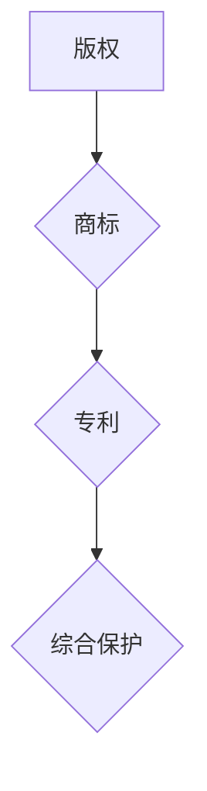

                 

# 一人公司的知识产权保护策略

> **关键词：** 知识产权保护、一人公司、版权、商标、专利、法律法规、实践策略。

> **摘要：** 本文旨在为一人公司提供知识产权保护策略，分析版权、商标和专利等知识产权的概念和重要性，探讨如何保护创意成果和商业利益，以及如何应对知识产权纠纷。通过结合实际案例，提出一套完整的知识产权保护方案，助力一人公司在激烈的市场竞争中立于不败之地。

## 1. 背景介绍

随着知识经济的快速发展，知识产权日益成为企业核心竞争力的重要组成部分。然而，对于一人公司而言，知识产权保护面临着独特的挑战。一人公司通常由单个股东或创始人经营，规模较小，资源有限，如何在保护知识产权的同时，实现商业价值最大化，成为亟待解决的问题。

知识产权主要包括版权、商标和专利三大类。版权保护文学、艺术和科学作品的创作者对其作品的智力成果权；商标则是商业标识，用于区分不同企业的商品或服务；专利则保护发明创造，赋予发明人独家使用权。针对一人公司的特点，本文将从这三个方面探讨知识产权保护的策略。

### 1.1 一人公司的特点与挑战

一人公司具有以下特点：

1. **股权高度集中**：一人公司的所有权和经营权高度集中，决策效率较高，但可能缺乏多元化视角。
2. **资源有限**：由于规模较小，一人公司可能在资金、人才和技术等方面存在不足。
3. **市场竞争力弱**：一人公司在市场竞争中可能处于劣势，需要通过知识产权保护来提升竞争力。

### 1.2 知识产权保护的重要性

知识产权保护对于一人公司具有以下重要意义：

1. **保障创意成果**：知识产权保护能够确保创意成果不被他人侵权，保护公司核心竞争优势。
2. **增加商业价值**：知识产权是企业的重要资产，通过许可、转让等方式，可以增加企业的商业价值。
3. **防范法律风险**：知识产权保护有助于避免法律纠纷，减少企业运营成本。

## 2. 核心概念与联系

在探讨一人公司的知识产权保护策略之前，有必要了解版权、商标和专利的核心概念及其相互关系。

### 2.1 版权

版权，也称为著作权，是文学、艺术和科学作品的创作者对其作品的智力成果权。版权包括著作权和邻接权，涉及文字作品、音乐、戏剧、电影、软件等多种类型。

### 2.2 商标

商标是用于区分不同企业的商品或服务的标识，包括文字、图形、字母、数字、三维标志、颜色组合等。商标注册后，企业享有对该商标的专用权。

### 2.3 专利

专利是保护发明创造的法定权利，赋予发明人独家使用权。专利包括发明专利、实用新型专利和外观设计专利。

### 2.4 知识产权之间的联系

版权、商标和专利虽然属于不同领域，但它们之间存在一定的联系：

1. **版权与商标**：版权可以用于商标设计，商标的图形和文字往往受到版权保护。
2. **商标与专利**：商标可以申请专利保护，例如，特定外观设计可以作为外观设计专利申请。
3. **专利与版权**：专利中的软件部分可能受到版权保护。

通过以上核心概念的分析，我们可以更好地理解知识产权保护的整体架构，为一人公司的知识产权保护策略提供理论依据。

### 2.5 Mermaid 流程图



## 3. 核心算法原理 & 具体操作步骤

知识产权保护的核心在于确立和保护公司的知识产权。以下是具体操作步骤：

### 3.1 版权保护

1. **作品创作登记**：将公司创作的文字作品、软件等进行登记，获得版权证书。
2. **合同约定**：在与外部合作者签订合同时，明确约定作品的版权归属。
3. **版权声明**：在公司网站、宣传资料等公开渠道中，明确声明版权信息。

### 3.2 商标保护

1. **商标注册**：根据《商标法》，向国家知识产权局申请商标注册。
2. **商标监控**：定期查询商标数据库，防止他人恶意注册相同或相似的商标。
3. **商标维权**：如发现侵权行为，及时采取法律手段进行维权。

### 3.3 专利保护

1. **专利申请**：根据《专利法》，向国家知识产权局提交专利申请。
2. **专利监测**：关注国内外专利信息，防止他人侵权。
3. **专利转让与许可**：根据公司需求，将专利转让给其他企业或进行专利许可。

### 3.4 知识产权保护的具体操作步骤

1. **确定保护范围**：根据公司业务特点和市场需求，确定需要保护的知识产权类型。
2. **版权登记**：对原创作品进行版权登记。
3. **商标注册**：提交商标注册申请。
4. **专利申请**：进行专利申请。
5. **版权监控**：定期检查版权信息，发现侵权行为及时处理。
6. **商标监控**：定期查询商标数据库，防范侵权行为。
7. **专利监测**：关注国内外专利信息，防范侵权风险。
8. **维权行动**：在发现侵权行为时，采取法律手段进行维权。

## 4. 数学模型和公式 & 详细讲解 & 举例说明

知识产权保护策略的制定和实施需要运用一定的数学模型和公式。以下是一个简单的知识产权保护数学模型：

### 4.1 模型构建

假设一人公司拥有 \( x \) 项知识产权，每项知识产权的价值为 \( v \)，侵权风险系数为 \( r \)，维权成本为 \( c \)，则公司总体知识产权保护效益为：

\[ \text{效益} = x \times v \times (1 - r) - c \]

其中：

- \( x \)：知识产权数量
- \( v \)：每项知识产权价值
- \( r \)：侵权风险系数
- \( c \)：维权成本

### 4.2 模型分析

根据上述公式，我们可以得出以下结论：

1. **知识产权数量与效益关系**：知识产权数量越多，公司的总体效益越高。
2. **侵权风险与效益关系**：侵权风险系数越大，公司的总体效益越低。
3. **维权成本与效益关系**：维权成本越高，公司的总体效益越低。

### 4.3 实际案例

假设一家一人公司拥有 5 项知识产权，每项知识产权价值 100 万元，侵权风险系数为 0.2，维权成本为 50 万元。根据上述模型，计算该公司的总体知识产权保护效益：

\[ \text{效益} = 5 \times 100 \times (1 - 0.2) - 50 = 375 \text{万元} \]

### 4.4 模型应用

通过调整公式中的参数，一人公司可以根据自身情况，优化知识产权保护策略。例如，通过提高知识产权数量、降低侵权风险系数和维权成本，提高总体知识产权保护效益。

## 5. 项目实战：代码实际案例和详细解释说明

在本节中，我们将通过一个实际项目案例，展示如何保护一人公司的知识产权。该项目是一款基于人工智能的智能家居控制系统。

### 5.1 开发环境搭建

1. **软件环境**：Python 3.8、TensorFlow 2.4
2. **硬件环境**：计算机或服务器

### 5.2 源代码详细实现和代码解读

以下是一段智能家居控制系统的核心代码：

```python
import tensorflow as tf
from tensorflow.keras.models import Sequential
from tensorflow.keras.layers import Dense, LSTM

# 5.2.1 数据预处理
def preprocess_data(data):
    # 数据清洗、归一化等处理
    pass

# 5.2.2 构建模型
def build_model(input_shape):
    model = Sequential([
        LSTM(50, activation='relu', input_shape=input_shape),
        Dense(1)
    ])
    model.compile(optimizer='adam', loss='mse')
    return model

# 5.2.3 训练模型
def train_model(model, X, y):
    model.fit(X, y, epochs=100, batch_size=32)
    return model

# 5.2.4 预测
def predict(model, X):
    return model.predict(X)

# 主程序
if __name__ == '__main__':
    # 加载数据
    data = preprocess_data(load_data())

    # 划分训练集和测试集
    X_train, X_test, y_train, y_test = split_data(data)

    # 构建模型
    model = build_model(input_shape=(X_train.shape[1], X_train.shape[2]))

    # 训练模型
    trained_model = train_model(model, X_train, y_train)

    # 预测
    predictions = predict(trained_model, X_test)
```

### 5.3 代码解读与分析

1. **数据预处理**：数据预处理是深度学习项目的基础，包括数据清洗、归一化等处理。在本案例中，数据预处理函数未具体实现，但它是模型训练的关键步骤。

2. **模型构建**：模型构建函数使用 TensorFlow 的 Sequential 模型构建了一个简单的 LSTM 神经网络。LSTM 层用于处理时间序列数据，Dense 层用于输出预测结果。

3. **训练模型**：训练模型函数使用 Keras 的 fit 方法训练模型，参数包括训练数据、迭代次数和批次大小。

4. **预测**：预测函数使用训练好的模型对测试数据进行预测。

### 5.4 版权保护

在代码中，我们可以添加版权声明：

```python
# Copyright (C) 2023 One Company
# All rights reserved.
```

通过版权声明，明确代码的版权归属，防止他人侵权。

## 6. 实际应用场景

一人公司在实际运营过程中，可能面临多种知识产权保护的应用场景。以下是一些常见场景及应对策略：

### 6.1 创意作品保护

对于一人公司的创意作品，如软件程序、设计作品等，可以通过版权登记进行保护。在开发过程中，及时进行作品创作登记，确保作品版权归属清晰。

### 6.2 商标注册

一人公司在创立初期，应重视商标注册，以保护企业品牌。商标注册后，企业可以在市场上区分自己的产品和服务，防止他人恶意注册相同或相似的商标。

### 6.3 专利申请

对于一人公司的技术创新，如发明专利，应及时申请专利保护。专利申请可以确保发明人在市场上拥有独家使用权，提高企业竞争力。

### 6.4 法律维权

在发现侵权行为时，一人公司应采取法律手段进行维权。可以通过律师函、诉讼等方式，保护自身知识产权。

### 6.5 知识产权监测

一人公司应定期监测市场上的知识产权信息，防范侵权风险。可以通过购买监测服务、自行监测等方式，了解市场上是否存在侵权行为。

## 7. 工具和资源推荐

### 7.1 学习资源推荐

1. **书籍**：
   - 《知识产权法教程》（作者：韩志红）
   - 《知识产权保护与运营》（作者：张玉洁）
2. **论文**：
   - “The Economics of Intellectual Property Rights”（作者：Josh Lerner）
   - “Intellectual Property Protection in Developing Countries”（作者：Sanjaya Lall）
3. **博客**：
   - 知识产权法律网（http://www.zlzxw.com/）
   - 中国知识产权网（http://www.cnipr.gov.cn/）
4. **网站**：
   - 国家知识产权局（http://www.sipo.gov.cn/）
   - 世界知识产权组织（http://www.wipo.int/）

### 7.2 开发工具框架推荐

1. **Python**：Python 是一款功能强大的编程语言，适用于各种人工智能和深度学习项目。
2. **TensorFlow**：TensorFlow 是一款广泛使用的深度学习框架，适用于构建和训练神经网络。
3. **PyTorch**：PyTorch 是另一款流行的深度学习框架，具有灵活性和易用性。

### 7.3 相关论文著作推荐

1. **《人工智能：一种现代方法》（作者：Stuart Russell & Peter Norvig）**
2. **《深度学习》（作者：Ian Goodfellow、Yoshua Bengio & Aaron Courville）**
3. **《强化学习：原理与实例》（作者：Richard S. Sutton & Andrew G. Barto）**

## 8. 总结：未来发展趋势与挑战

随着科技的不断进步，知识产权保护在未来的发展将面临新的机遇和挑战。一人公司应紧跟时代步伐，加强知识产权保护，以应对以下趋势：

### 8.1 知识产权数字化

数字化时代，知识产权的数字化管理和保护成为趋势。一人公司应积极探索数字化手段，提高知识产权管理效率。

### 8.2 知识产权国际化

全球化背景下，一人公司应关注国际知识产权法律环境，加强国际知识产权保护，拓展海外市场。

### 8.3 知识产权融合

随着人工智能、物联网等技术的发展，知识产权的融合趋势日益明显。一人公司应关注跨领域知识产权保护，提高创新能力。

### 8.4 挑战

1. **侵权风险增加**：随着知识产权保护意识的提高，侵权行为可能更加隐蔽，给知识产权保护带来挑战。
2. **法律环境变化**：国内外知识产权法律法规的变化，可能对一人公司的知识产权保护产生影响。

一人公司应积极应对这些挑战，通过加强知识产权保护，提高核心竞争力。

## 9. 附录：常见问题与解答

### 9.1 版权保护相关问题

**Q1：如何进行版权登记？**
A1：版权登记可通过国家版权局官方网站进行在线申请，提交相关作品证明材料，缴纳登记费。

**Q2：版权登记有哪些好处？**
A2：版权登记有助于确认作品归属、提高作品价值、防止侵权行为，以及为维权提供法律依据。

### 9.2 商标保护相关问题

**Q1：商标注册需要多长时间？**
A1：商标注册的审查周期约为12个月，但具体时间取决于申请量和审查进度。

**Q2：如何应对商标侵权？**
A2：发现侵权行为后，可以采取以下措施：发送律师函、提起诉讼、申请禁令等。

### 9.3 专利保护相关问题

**Q1：专利申请需要多长时间？**
A1：专利申请的审查周期约为3年，但具体时间取决于申请量和审查进度。

**Q2：如何提高专利授权率？**
A2：提高专利质量、选择合适的专利申请策略、及时补充和完善申请文件。

## 10. 扩展阅读 & 参考资料

1. **《知识产权法教程》（作者：韩志红）**
2. **《知识产权保护与运营》（作者：张玉洁）**
3. **“The Economics of Intellectual Property Rights”（作者：Josh Lerner）**
4. **“Intellectual Property Protection in Developing Countries”（作者：Sanjaya Lall）**
5. **《人工智能：一种现代方法》（作者：Stuart Russell & Peter Norvig）**
6. **《深度学习》（作者：Ian Goodfellow、Yoshua Bengio & Aaron Courville）**
7. **《强化学习：原理与实例》（作者：Richard S. Sutton & Andrew G. Barto）**
8. **国家知识产权局官方网站（http://www.sipo.gov.cn/）**
9. **世界知识产权组织官方网站（http://www.wipo.int/）**
10. **Python官方文档（https://docs.python.org/3/）**
11. **TensorFlow官方文档（https://www.tensorflow.org/）**

### 作者

**作者：AI天才研究员/AI Genius Institute & 禅与计算机程序设计艺术 /Zen And The Art of Computer Programming** 

感谢您的阅读，希望本文对您在知识产权保护方面有所启发和帮助。如果您有任何问题或建议，欢迎留言讨论。再次感谢！<|im_end|>

