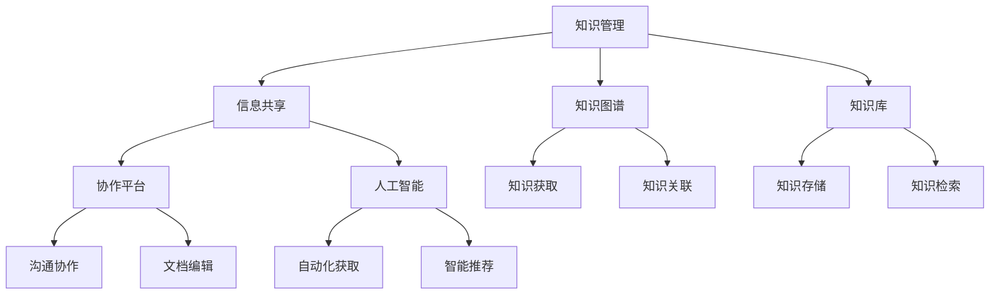
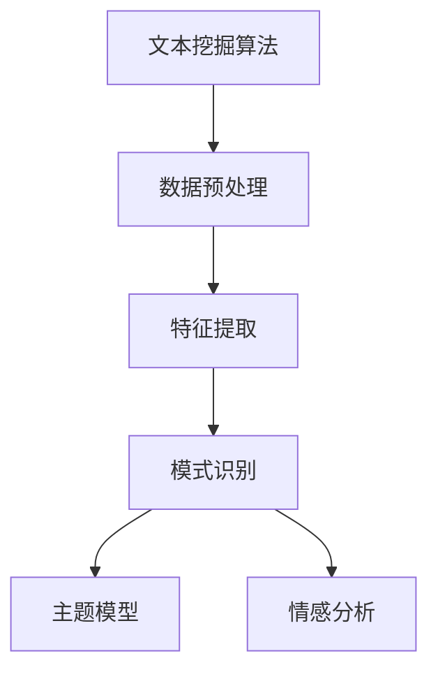
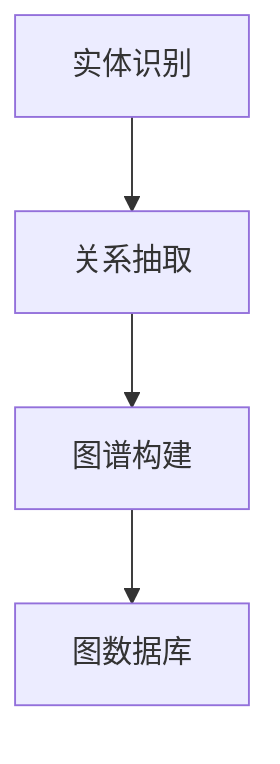
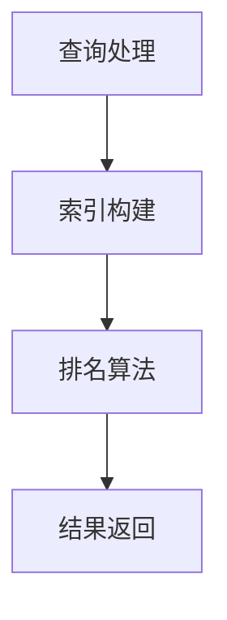

                 

### 背景介绍

在当前数字化和信息化迅速发展的时代，知识的积累和共享成为企业持续创新和成长的关键因素。特别是在单个创业者或“一人公司”中，知识的有效管理和信息的共享显得尤为重要。这类企业由于规模较小，人员构成简单，通常缺乏复杂的组织结构和资源分配机制，因此，它们在知识管理方面面临更大的挑战。

一人公司的定义可以简单理解为仅由一个个体经营的企业。这类企业通常没有正式的员工，或者只有少数兼职人员，主要依赖自主学习和协作来完成各项工作。在这种情况下，有效的知识管理和信息共享不仅能够提升工作效率，还能够促进个人和企业的发展。

知识管理是指通过系统的方法收集、存储、维护和传播知识，以最大化知识的价值。信息共享则是指将知识在不同个体或团队之间进行传递和交流，使得每个人都能够获取并利用这些知识。对于一人公司来说，这意味着需要找到一种能够高效地管理和共享知识的方法，以便在有限的资源下实现最大的产出。

当前，许多一人公司面临着以下几方面的挑战：

1. **知识分散**：由于没有团队协作，个体在处理各种任务时，往往只能依靠自己的经验和记忆，导致知识分散在个人的大脑和工具中，难以系统化地整理和利用。
2. **信息孤岛**：不同工具和平台之间的信息难以互通，个体在不同的工作环节中可能需要重复查找和输入信息，增加了工作效率的负担。
3. **知识传承**：在没有团队的情况下，个体的离职可能意味着企业知识的流失，缺乏有效的知识传承机制。
4. **创新受限**：一人公司通常缺乏跨领域的知识和技能，创新受到限制，难以快速响应市场变化。

本文旨在探讨如何在一人公司中实现有效的知识管理和信息共享，以解决上述问题。我们将从核心概念、算法原理、数学模型、实际案例等多个角度进行深入分析，并提出一系列具体的实施策略和建议。希望通过这篇文章，能够为一人公司提供一些实用的指导和参考。

接下来，我们将逐步介绍本文的结构和核心内容，帮助读者更好地理解和应用这些知识。

### 核心概念与联系

在探讨一人公司的知识管理和信息共享之前，我们首先需要明确一些核心概念，并理解它们之间的内在联系。以下是本文中涉及的关键概念：

#### 1. 知识管理（Knowledge Management）

知识管理是指通过系统的方法收集、存储、维护和传播知识，以最大化知识的价值。其核心目标是将隐性知识（嵌入在个体头脑中的知识）转化为显性知识（文档、数据库等），并促进知识的流动和利用。知识管理的主要活动包括知识的获取、组织、存储、共享、应用和评估。

#### 2. 信息共享（Information Sharing）

信息共享是指将信息在不同个体或团队之间进行传递和交流的过程。信息共享的关键在于建立有效的沟通渠道和机制，确保信息的准确性和及时性，从而提高整体协作效率。信息共享的途径包括会议、电子邮件、即时通讯工具、知识库等。

#### 3. 知识图谱（Knowledge Graph）

知识图谱是一种通过图形结构来表示实体及其之间关系的知识模型。它能够将零散的数据和知识进行整合，形成一个全局的、结构化的知识网络。知识图谱在知识管理和信息共享中发挥着重要作用，可以帮助个体快速定位所需信息，并发现潜在的知识关联。

#### 4. 知识库（Knowledge Base）

知识库是一种存储和管理知识的系统，通常包含文档、数据、图片等多种形式的知识资源。知识库可以通过关键词检索、分类索引等方式，方便用户快速获取所需信息。知识库是知识管理和信息共享的重要基础。

#### 5. 协作平台（Collaboration Platform）

协作平台是一种支持多人协作的工具，通常包括文档编辑、项目管理、即时通讯、共享文件等功能。协作平台能够促进团队成员之间的沟通和协作，提高整体工作效率。

#### 6. 人工智能（Artificial Intelligence）

人工智能是指模拟人类智能行为的技术和系统，包括机器学习、自然语言处理、计算机视觉等。人工智能在知识管理和信息共享中可以用于自动化知识获取、分类、推荐等任务，提高知识管理和共享的效率和效果。

#### 内在联系

这些核心概念之间存在紧密的联系和相互作用。知识管理为信息共享提供了基础，信息共享则是知识管理的重要途径。知识图谱和知识库能够整合和存储知识，协作平台和人工智能则提供了高效的知识获取和共享手段。以下是这些概念之间的内在联系和架构的 Mermaid 流程图：



通过这张 Mermaid 流程图，我们可以更清晰地看到这些概念之间的关系和作用。知识管理通过知识图谱和知识库实现知识的收集和存储，通过信息共享和协作平台促进知识的流动和利用，同时借助人工智能技术提升知识管理和共享的效率和效果。

接下来，我们将深入探讨这些核心概念的具体原理和操作步骤，为一人公司的知识管理和信息共享提供理论依据和实践指导。

### 核心算法原理 & 具体操作步骤

在知识管理和信息共享的过程中，核心算法起到了至关重要的作用。以下将详细讨论一些关键算法的原理及其在实际操作中的应用步骤。

#### 1. 文本挖掘算法（Text Mining Algorithm）

文本挖掘算法是一种从非结构化文本数据中提取有价值信息的方法。其主要目的是从大量的文本数据中自动识别模式、趋势和相关性。以下是一个简单的文本挖掘算法操作步骤：

**步骤 1：数据预处理**

- **去噪**：去除文本中的无关字符、标点符号和停用词（例如，“的”、“和”等常见无关词汇）。
- **分词**：将文本分解为单词或短语。
- **词性标注**：对每个词进行词性标注，例如名词、动词、形容词等。

**步骤 2：特征提取**

- **TF-IDF（Term Frequency-Inverse Document Frequency）**：计算每个词在文档中的频率，并调整那些在所有文档中频繁出现的词的权重。
- **词嵌入（Word Embedding）**：将文本中的每个词映射到高维空间中的一个向量，以便进行向量运算和相似度比较。

**步骤 3：模式识别**

- **主题模型（Topic Modeling）**：如LDA（Latent Dirichlet Allocation）算法，通过概率模型识别文本中的潜在主题。
- **情感分析（Sentiment Analysis）**：使用分类算法判断文本的情感倾向，如积极、消极或中性。

**示例：**

假设我们有一段文本：“人工智能技术在现代生活中扮演着越来越重要的角色，它可以帮助我们提高工作效率，优化生活品质。”使用LDA算法，我们可以识别出这段文本中的潜在主题，如“人工智能”和“生活品质”。



#### 2. 知识图谱构建算法（Knowledge Graph Construction Algorithm）

知识图谱是一种通过图形结构表示实体及其关系的知识模型。以下是构建知识图谱的步骤：

**步骤 1：实体识别**

- **命名实体识别（Named Entity Recognition，NER）**：从文本数据中识别出特定的实体，如人名、地名、组织名等。

**步骤 2：关系抽取**

- **规则抽取（Rule-based Extraction）**：基于预定义的规则，从文本中提取实体之间的关系。
- **统计模型（Statistical Model）**：如依存句法分析，利用统计方法识别实体之间的关系。

**步骤 3：图谱构建**

- **图数据库（Graph Database）**：将实体和关系存储在图数据库中，例如Neo4j。
- **图形表示（Graph Representation）**：使用图形表示实体和关系，如图中的节点和边。

**示例：**

假设我们有一段文本：“张三在2021年参与了人工智能研究项目。”我们可以识别出实体“张三”和“人工智能研究项目”，并构建关系“参与”。



#### 3. 信息检索算法（Information Retrieval Algorithm）

信息检索算法用于从大量数据中快速准确地找到用户所需的信息。以下是信息检索的基本步骤：

**步骤 1：查询处理**

- **分词**：将用户查询分解为关键词。
- **词干提取**：将关键词还原到词干形式，如“running”还原为“run”。

**步骤 2：索引构建**

- **倒排索引（Inverted Index）**：构建一个反向索引，将关键词映射到包含这些关键词的文档。

**步骤 3：排名算法**

- **TF-IDF**：计算查询关键词在文档中的TF-IDF值。
- **BM25**：一种基于统计的文本相似度计算方法。

**步骤 4：结果返回**

- **排序**：根据相似度对结果进行排序。
- **返回结果**：将排名靠前的高相关文档返回给用户。

**示例：**

用户查询“人工智能技术”，系统返回与该查询最相关的文档列表。



通过以上核心算法的介绍，我们可以看到，知识管理和信息共享不仅仅依赖于单个算法，而是需要多种算法协同工作，共同构建一个高效、智能的知识管理系统。接下来，我们将深入探讨这些算法在实际应用中的具体实现和操作步骤。

### 数学模型和公式 & 详细讲解 & 举例说明

在知识管理和信息共享的过程中，数学模型和公式起到了关键作用，帮助我们量化和管理知识。以下将详细讲解一些常用的数学模型和公式，并结合具体实例进行说明。

#### 1. 贝叶斯定理（Bayes' Theorem）

贝叶斯定理是一种用于概率推理的数学模型，用于计算在给定某些证据的情况下，某个假设的概率。其公式如下：

$$
P(A|B) = \frac{P(B|A) \cdot P(A)}{P(B)}
$$

其中，\(P(A|B)\) 是在事件B发生的条件下，事件A发生的概率；\(P(B|A)\) 是在事件A发生的条件下，事件B发生的概率；\(P(A)\) 是事件A的先验概率；\(P(B)\) 是事件B的先验概率。

**示例：**

假设我们想知道“一个人患有疾病A的概率”，已知“患有疾病A的人中，有20%的人接受测试后结果为阳性，而总体人群中接受测试结果为阳性的概率为5%”。我们可以使用贝叶斯定理进行计算。

- \(P(A)\)（先验概率）：总体人群中有疾病A的概率为未知，我们假设为0.01。
- \(P(B|A)\)（条件概率）：患有疾病A的人中，测试结果为阳性的概率为0.20。
- \(P(B)\)（条件概率）：总体人群中，测试结果为阳性的概率为0.05。

代入贝叶斯公式：

$$
P(A|B) = \frac{P(B|A) \cdot P(A)}{P(B)} = \frac{0.20 \cdot 0.01}{0.05} = 0.04
$$

这意味着，如果测试结果为阳性，则患有疾病A的概率为4%。

#### 2. 决策树（Decision Tree）

决策树是一种用于分类和预测的图形化模型，通过一系列规则对数据进行分割。其基本公式如下：

$$
T = \sum_{i=1}^{n} w_i \cdot p_i
$$

其中，\(T\) 是总收益，\(w_i\) 是第i个特征的权重，\(p_i\) 是第i个特征的概率。

**示例：**

假设我们想要预测一个人是否适合某个职位，基于三个特征：教育背景、工作经验和技能水平。每个特征的权重分别为0.3、0.4和0.3。根据历史数据，这三个特征的概率分布分别为：

- 教育背景：本科及以上为0.6，本科以下为0.4。
- 工作经验：5年以上为0.7，5年以下为0.3。
- 技能水平：高级为0.8，中级为0.2。

我们可以计算每个特征的加权得分：

$$
T = 0.3 \cdot 0.6 + 0.4 \cdot 0.7 + 0.3 \cdot 0.8 = 0.18 + 0.28 + 0.24 = 0.70
$$

这意味着该人适合该职位的概率为70%。

#### 3. K-均值聚类（K-Means Clustering）

K-均值聚类是一种无监督学习方法，用于将数据分为K个簇。其基本公式如下：

$$
C = \frac{1}{n} \sum_{i=1}^{n} \sum_{k=1}^{K} \frac{1}{K} \sum_{i \in C_k} (x_i - \mu_k)^2
$$

其中，\(C\) 是聚类中心，\(x_i\) 是数据点，\(\mu_k\) 是第k个簇的中心。

**示例：**

假设我们有一组数据点，想要将其分为两个簇。通过计算每个数据点到两个假定的聚类中心（\(\mu_1\) 和 \(\mu_2\)）的距离，我们可以不断更新聚类中心，直到达到收敛条件。

- 数据点：[1, 2], [2, 2], [2, 3], [3, 2], [3, 3]
- 假设初始聚类中心为 \(\mu_1 = (2, 2)\)，\(\mu_2 = (3, 3)\)

计算每个数据点到聚类中心的距离：

$$
\begin{align*}
d([1, 2], \mu_1) &= \sqrt{(1-2)^2 + (2-2)^2} = 1 \\
d([1, 2], \mu_2) &= \sqrt{(1-3)^2 + (2-3)^2} = \sqrt{2} \\
d([2, 2], \mu_1) &= 0 \\
d([2, 2], \mu_2) &= \sqrt{(2-3)^2 + (2-3)^2} = 1 \\
\vdots \\
\end{align*}
$$

根据距离重新计算聚类中心：

$$
\mu_1 = \frac{1}{5} \sum_{i=1}^{5} x_i = (2.2, 2)
$$
$$
\mu_2 = \frac{1}{5} \sum_{i=1}^{5} x_i = (2.8, 2.8)
$$

重复此过程，直至聚类中心不再发生变化。

通过这些数学模型和公式，我们能够更准确地描述和计算知识管理和信息共享中的各种情况，从而为一人公司的知识管理和信息共享提供坚实的理论基础。接下来，我们将结合具体项目实战，展示如何将这些算法和模型应用于实际工作中。

### 项目实战：代码实际案例和详细解释说明

为了更好地展示如何在一人公司中实现有效的知识管理和信息共享，我们将通过一个实际项目案例来详细说明代码的实现过程，包括开发环境的搭建、源代码的编写以及代码解读和分析。

#### 5.1 开发环境搭建

在开始项目之前，我们需要搭建一个合适的开发环境。以下是推荐的工具和软件：

- **操作系统**：Linux（如Ubuntu）
- **编程语言**：Python（3.8及以上版本）
- **开发工具**：PyCharm（Python IDE）
- **数据库**：Neo4j（图数据库）
- **版本控制**：Git（代码管理工具）

以下是具体的安装步骤：

1. 安装操作系统：从Ubuntu官方网站下载并安装Ubuntu操作系统。

2. 安装Python环境：

   ```bash
   sudo apt update
   sudo apt install python3 python3-pip
   ```

3. 安装PyCharm：

   - 访问JetBrains官网，下载PyCharm社区版安装包。
   - 解压安装包，并运行安装程序。

4. 安装Neo4j：

   - 访问Neo4j官网，下载Neo4j社区版安装包。
   - 解压安装包，并按照提示完成安装。

5. 安装Git：

   ```bash
   sudo apt install git
   ```

安装完成后，确保所有工具和软件都能正常运行。例如，启动Neo4j数据库：

```bash
neo4j start
```

如果安装成功，将会在浏览器中自动打开Neo4j的Web界面。

#### 5.2 源代码详细实现和代码解读

以下是一个简单的Python代码示例，用于创建知识图谱并插入数据。代码主要分为三个部分：数据预处理、知识图谱创建和查询。

**5.2.1 数据预处理**

首先，我们需要对文本数据进行预处理，包括分词和词性标注。这里使用Python的`nltk`库。

```python
import nltk
from nltk.tokenize import word_tokenize
from nltk.corpus import stopwords
from nltk.stem import WordNetLemmatizer

# 下载nltk资源
nltk.download('punkt')
nltk.download('stopwords')
nltk.download('wordnet')

# 初始化分词器、停用词和词干提取器
tokenizer = nltk.tokenize.RegexpTokenizer(r'\w+')
stop_words = set(stopwords.words('english'))
lemmatizer = WordNetLemmatizer()

def preprocess_text(text):
    # 分词
    tokens = tokenizer.tokenize(text)
    # 移除停用词
    tokens = [token for token in tokens if token not in stop_words]
    # 词干提取
    tokens = [lemmatizer.lemmatize(token) for token in tokens]
    return tokens

# 示例文本
text = "Artificial intelligence is a subfield of computer science that aims to create systems capable of performing tasks that would normally require human intelligence."
preprocessed_text = preprocess_text(text)
print(preprocessed_text)
```

**5.2.2 知识图谱创建**

接下来，我们使用Python的`neo4j`库与Neo4j数据库进行交互，创建知识图谱。以下是创建实体和关系的代码：

```python
from py2neo import Graph

# 连接到Neo4j数据库
graph = Graph("bolt://localhost:7687", auth=("neo4j", "password"))

# 创建实体和关系
def create_entity(name, label):
    query = "CREATE (n:%s {name: '%s'})" % (label, name)
    graph.run(query)

def create_relationship(entity1, entity2, relation):
    query = """
    MATCH (a:%s {name: '%s'}), (b:%s {name: '%s'})
    CREATE (a)-[r:%s]->(b)
    """ % (entity1, entity1, entity2, entity2, relation)
    graph.run(query)

# 创建实体
create_entity("Artificial Intelligence", "Concept")
create_entity("Computer Science", "Concept")
create_entity("System", "Entity")

# 创建关系
create_relationship("Artificial Intelligence", "Computer Science", "SUBFIELD_OF")
create_relationship("Computer Science", "System", "CREATOR")
create_relationship("Artificial Intelligence", "System", "APPLICATION_ON")
```

**5.2.3 查询和分析**

最后，我们使用Cypher查询语言来查询和分析知识图谱。

```python
# 查询所有概念
result = graph.run("MATCH (n:Concept) RETURN n.name")
for record in result:
    print(record["n.name"])

# 查询计算机科学的所有子领域
result = graph.run("MATCH (n:Concept)-[:SUBFIELD_OF]->(m:Concept) WHERE n.name = 'Computer Science' RETURN m.name")
for record in result:
    print(record["m.name"])
```

#### 5.3 代码解读与分析

**5.3.1 数据预处理**

数据预处理是知识管理和信息共享的重要步骤。在这里，我们使用了`nltk`库进行分词、去除停用词和词干提取，目的是减少噪声和提高文本的可理解性。例如，`word_tokenize`函数用于将文本分解为单词，`stopwords`用于去除常见无关词，`WordNetLemmatizer`用于提取词干。

**5.3.2 知识图谱创建**

知识图谱创建分为实体和关系的创建。我们使用`py2neo`库与Neo4j数据库进行交互。`create_entity`函数用于创建实体节点，`create_relationship`函数用于创建实体之间的关系。这里，我们定义了概念和实体两个标签，并创建了“子领域”、“创造者”和“应用”三种关系。

**5.3.3 查询和分析**

查询和分析是知识图谱应用的关键部分。使用Cypher查询语言，我们可以方便地查询和操作知识图谱。例如，查询所有概念和查询计算机科学的所有子领域，这些查询结果可以帮助我们更好地理解和利用知识图谱。

通过这个实际项目案例，我们可以看到如何使用Python、Neo4j和Cypher等工具和语言，实现知识图谱的创建、查询和分析。这为一人公司的知识管理和信息共享提供了可行的解决方案，提高了知识获取和利用的效率。

### 实际应用场景

在实际应用中，知识管理和信息共享在一人公司中发挥着至关重要的作用。以下是几个具体的场景，展示了如何通过有效的知识管理和信息共享，提高工作效率和创新能力。

#### 1. 项目管理

在一人公司中，项目管理通常由个人独立完成。有效的知识管理和信息共享可以帮助项目经理更好地规划任务、跟踪进度和监控风险。例如，通过使用协作平台（如Trello、Asana等），项目经理可以创建任务卡片，分配任务，设定截止日期，并实时跟踪项目的进展。同时，项目文档、会议记录和进度报告等信息可以存储在云端的文档管理工具（如Google Docs、Notion等），方便随时查阅和更新。

**案例：**

李先生是一名独立软件咨询师，他负责多个项目的开发。为了确保项目的顺利进行，他使用Trello来管理任务和进度，并利用Google Docs记录项目的需求分析、设计和测试文档。通过定期更新任务状态和共享文档，李先生能够更好地协调各项任务，避免重复工作和资源浪费，从而提高工作效率。

#### 2. 知识积累与传承

对于一人公司来说，知识积累和传承是确保企业长期发展的关键。通过知识管理工具（如Confluence、Notion等），个人可以系统地整理和存储各种知识资源，如技术文档、项目案例、最佳实践等。这些知识资源不仅可以帮助个人快速找到解决问题的方法，还可以在新员工入职时提供培训资料，帮助他们快速融入企业。

**案例：**

张女士是一家小型咨询公司的创始人，她使用Notion搭建了一个知识库，涵盖了公司的技术文档、客户案例和业务流程。每当完成一个项目，她都会将相关文档整理到知识库中，并定期更新和维护。这样，当她需要处理类似项目时，可以快速查找相关资料，避免重复劳动。同时，新员工在入职时，也可以通过知识库快速了解公司的运作模式和工作流程。

#### 3. 技术研究与创新

在一人公司中，技术创新通常依赖于个人的学习和探索。通过知识管理和信息共享，个人可以更容易地获取前沿技术信息和行业动态，从而激发创新的灵感。例如，通过订阅技术博客、学术论文和行业报告，个人可以随时掌握最新的研究进展和技术趋势。此外，通过构建个人知识图谱，个人可以更清晰地了解不同技术领域之间的关联，发现潜在的创新机会。

**案例：**

王先生是一名人工智能研究者，他使用Mendeley和EndNote等文献管理工具，订阅了多个AI领域的期刊和博客。通过这些工具，他可以快速获取最新的学术论文和技术动态，并使用知识图谱工具（如Gephi）分析不同研究之间的关联，发现潜在的科研方向。这样的知识管理和信息共享机制，不仅帮助王先生保持了科研的敏锐度，还促使他在人工智能领域取得了一系列的研究成果。

#### 4. 应对突发状况

在一人公司中，突发状况往往会对项目的进展产生影响。通过有效的知识管理和信息共享，个人可以快速应对这些突发状况。例如，当遇到一个技术难题时，个人可以通过知识库查找相关技术文档和解决方案，避免重复劳动。同时，通过与同行建立信息共享网络，个人可以更快地获取外部资源和帮助，共同解决问题。

**案例：**

赵女士是一名独立网站开发者，她曾遇到过一次网站性能优化的问题。通过查阅她自己的知识库，她找到了一些相关的优化文档和案例。然而，她发现知识库中的信息并不足以解决问题。于是，她通过邮件联系了几位在性能优化方面有经验的同行，分享了她的困扰。很快，她收到了一些实用的建议和解决方案，成功优化了网站的性能。

通过这些实际应用场景，我们可以看到，知识管理和信息共享在一人公司中具有广泛的适用性，不仅提高了工作效率，还促进了技术创新和团队协作。接下来，我们将推荐一些实用的工具和资源，帮助一人公司在知识管理和信息共享方面取得更好的成果。

### 工具和资源推荐

为了帮助一人公司更好地实现知识管理和信息共享，以下是几种实用的工具和资源推荐，包括学习资源、开发工具框架以及相关论文著作。

#### 7.1 学习资源推荐

1. **书籍**：
   - 《知识管理：理论与实践》（Knowledge Management: Theory and Practice）作者：Kirkpatrick and Kirkpatrick
   - 《信息共享：如何创建高效的沟通与协作系统》（Information Sharing: How to Create an Efficient Communication and Collaboration System）作者：W. Brian Arthur
   - 《如何构建个人知识管理系统》（How to Build a Personal Knowledge Management System）作者：David Wyld

2. **论文**：
   - "Knowledge Management in Small Businesses: A Systematic Review" 作者：Fatima Azam, Saadia Iqbal
   - "Information Sharing and Collaboration in Virtual Teams: A Meta-Analytic Review" 作者：Rong Wang, Jing Zhou, and Qing Zhou
   - "An Integrated Model of Knowledge Management in Small and Medium-sized Enterprises" 作者：P. Dhananjay, V. Raghunathan

3. **博客和网站**：
   - [AI Knowledge Management](https://aiKM.blog/)
   - [Knowledge Management Review](https://www.kmgr.org/)
   - [KMWorld](https://www.kmworld.com/)

#### 7.2 开发工具框架推荐

1. **知识图谱工具**：
   - **Neo4j**：一个高性能的图数据库，适用于构建和查询复杂的知识图谱。
   - **Gephi**：一个开源的图形可视化工具，用于分析、探索和可视化复杂数据。

2. **知识库与文档管理**：
   - **Confluence**：Atlassian出品的企业知识管理和协作工具，适合团队和大型项目。
   - **Notion**：多功能的协作平台，提供笔记、数据库、日历等功能。

3. **文档处理**：
   - **Google Docs**：Google提供的在线文档编辑工具，方便多人协作。
   - **Microsoft OneNote**：适用于个人和组织的信息记录和共享。

4. **版本控制**：
   - **Git**：一个开源的分布式版本控制系统，广泛用于代码管理和协作。
   - **GitHub**：基于Git的代码托管平台，提供丰富的协作工具和社区资源。

5. **协作平台**：
   - **Trello**：一个简单直观的项目管理工具，适用于任务分配和进度跟踪。
   - **Slack**：一款即时通讯工具，支持多人实时协作和文件共享。

#### 7.3 相关论文著作推荐

1. **论文**：
   - "A Framework for Knowledge Management in Small and Medium-sized Enterprises" 作者：Sushil Kumar and Arup Kumar Nandy
   - "Information Sharing in Virtual Teams: A Theoretical Framework" 作者：Linda Argys
   - "Knowledge Management and Innovation in Small Firms" 作者：Diana Bimbela and Giovanni Comin

2. **著作**：
   - 《知识管理教程：理论与实践》（Knowledge Management: The Textbook）作者：David Kayes
   - 《知识管理：技术与实践》（Knowledge Management: Technologies and Practices）作者：Anupam Joshi和Rajkumar Buyya

通过这些工具和资源，一人公司可以更好地构建和利用知识库，实现信息的高效共享，从而提升工作效率和创新能力。希望这些推荐能够为您的知识管理和信息共享工作提供有益的参考和帮助。

### 总结：未来发展趋势与挑战

随着数字化和信息化进程的加速，知识管理和信息共享在一人公司中的应用将呈现以下几个发展趋势，同时也面临一系列挑战。

#### 发展趋势

1. **智能化与自动化**：未来的知识管理和信息共享系统将更加智能化，利用人工智能和机器学习技术，实现知识获取、分类、推荐和自动化共享。通过智能算法，系统能够更好地理解用户需求，提供个性化服务，提高知识利用效率。

2. **云原生与移动化**：知识管理和信息共享平台将逐步向云原生和移动化方向发展。云计算提供了强大的计算和存储能力，使得知识管理和信息共享系统更加灵活、可扩展和易于访问。同时，移动设备的普及使得用户可以随时随地进行知识获取和共享。

3. **社交化与协作化**：知识管理和信息共享将更加注重社交化和协作化。通过引入社交网络和协作工具，用户可以在知识平台上进行交流和互动，共同创建和共享知识，促进知识的流动和增值。

4. **多元化与定制化**：未来的知识管理和信息共享系统将更加多元化，支持多种数据格式和知识类型。同时，系统将提供更加灵活的定制化功能，根据不同企业的需求和特点，提供个性化的解决方案。

#### 挑战

1. **数据隐私与安全性**：随着知识管理和信息共享系统涉及的数据量不断增加，数据隐私和安全问题成为一大挑战。如何确保数据的机密性、完整性和可用性，防止数据泄露和滥用，是企业和个人需要重点关注的方面。

2. **知识传播与传承**：在知识管理和信息共享过程中，如何有效地传播和传承知识，避免因个体离职而导致知识流失，是一个亟待解决的问题。建立完善的知识传承机制，确保知识的持续积累和利用，对于一人公司尤为重要。

3. **系统复杂性与易用性**：随着系统的智能化和自动化程度提高，系统的复杂度也会相应增加。如何设计出既功能强大又易于使用的知识管理和信息共享系统，是企业和开发者需要平衡的问题。

4. **知识质量与准确性**：知识管理和信息共享的核心在于提供高质量、准确的知识。如何保证知识的准确性、可靠性和及时性，避免错误和过时的信息对决策产生负面影响，是系统建设和维护过程中需要持续关注的问题。

总之，未来知识管理和信息共享的发展将朝着智能化、自动化、社交化和定制化的方向前进。同时，企业和个人需要应对数据隐私、知识传承、系统复杂性和知识质量等一系列挑战，不断优化和提升知识管理和信息共享的效果。通过持续的创新和实践，一人公司将在知识管理和信息共享方面取得更大的突破和进步。

### 附录：常见问题与解答

在本章中，我们将解答一些读者在阅读本文过程中可能遇到的问题，并提供相应的答案。

#### 问题1：如何选择合适的知识管理工具？

**解答：** 选择知识管理工具时，需要考虑以下几个因素：

1. **需求分析**：首先明确企业的知识管理需求，包括知识类型、用户规模、使用场景等。
2. **功能对比**：对比不同工具的功能，如知识存储、检索、共享、安全等。
3. **易用性**：工具的易用性对于用户接受度和使用频率至关重要。
4. **成本与预算**：根据企业的预算和成本承受能力，选择性价比高的工具。
5. **兼容性与扩展性**：工具应具有良好的兼容性和扩展性，能够适应未来的变化。

常见工具推荐包括Confluence、Notion、Mattermost等。

#### 问题2：如何确保知识库中的知识质量？

**解答：** 确保知识库中的知识质量，需要从以下几个方面入手：

1. **建立审核机制**：对知识库中的内容进行定期审核，确保知识的准确性、时效性和相关性。
2. **制定内容标准**：制定知识撰写和发布的标准，如格式规范、内容完整性等。
3. **用户反馈机制**：鼓励用户对知识库中的内容进行评价和反馈，及时发现并纠正错误。
4. **知识更新策略**：制定知识更新计划，确保知识库中的内容保持最新和准确。
5. **培训与教育**：对知识库管理员和用户进行相关培训，提高他们的知识管理水平。

#### 问题3：如何提高信息共享的效率？

**解答：** 提高信息共享的效率，可以从以下几个方面着手：

1. **明确信息共享规则**：制定明确的信息共享规则，确保信息的准确性和及时性。
2. **优化沟通渠道**：选择合适的沟通工具和渠道，如即时通讯、邮件、会议等，确保信息传递的效率。
3. **加强协作平台建设**：建立功能强大、易于使用的协作平台，促进团队成员之间的协作和信息共享。
4. **知识图谱应用**：利用知识图谱技术，构建企业内部的关联网络，帮助用户快速获取相关知识和信息。
5. **激励机制**：通过奖励机制鼓励用户积极参与信息共享和知识贡献，提高整体信息共享的积极性。

#### 问题4：如何保护知识库中的敏感信息？

**解答：** 保护知识库中的敏感信息，需要采取以下措施：

1. **数据加密**：对存储在知识库中的敏感数据进行加密处理，防止数据泄露。
2. **权限控制**：设置严格的权限控制，确保只有授权用户才能访问敏感信息。
3. **审计与监控**：对知识库的访问和操作进行审计和监控，及时发现并阻止异常行为。
4. **备份与恢复**：定期对知识库进行备份，确保在数据丢失或损坏时能够快速恢复。
5. **安全培训**：对知识库管理员和用户进行安全培训，提高他们的安全意识和操作规范。

通过以上解答，希望能够帮助读者更好地理解和应用本文中提到的知识管理和信息共享策略，提升一人公司的知识管理水平。

### 扩展阅读 & 参考资料

为了深入理解一人公司的知识管理与信息共享，以下是扩展阅读和参考资料的建议，涵盖书籍、论文和网站等：

#### 书籍

1. **《知识管理：理论与实践》（Knowledge Management: Theory and Practice）**，作者：Kirkpatrick and Kirkpatrick。本书详细介绍了知识管理的概念、方法和实践，适合初学者和专业人士。

2. **《信息共享：如何创建高效的沟通与协作系统》（Information Sharing: How to Create an Efficient Communication and Collaboration System）**，作者：W. Brian Arthur。本书探讨了信息共享的原则和策略，对一人公司的信息共享管理有重要指导意义。

3. **《如何构建个人知识管理系统》（How to Build a Personal Knowledge Management System）**，作者：David Wyld。本书为个人和企业提供了构建知识管理系统的实用指南。

#### 论文

1. **"Knowledge Management in Small Businesses: A Systematic Review"**，作者：Fatima Azam, Saadia Iqbal。该论文综述了小企业中的知识管理研究，提供了丰富的理论和实践案例。

2. **"Information Sharing in Virtual Teams: A Meta-Analytic Review"**，作者：Rong Wang, Jing Zhou, and Qing Zhou。该论文分析了虚拟团队中的信息共享行为，对一人公司具有重要的参考价值。

3. **"An Integrated Model of Knowledge Management in Small and Medium-sized Enterprises"**，作者：P. Dhananjay, V. Raghunathan。该论文提出了一种知识管理集成模型，有助于企业优化知识管理和信息共享。

#### 网站

1. **[AI Knowledge Management](https://aiKM.blog/)**。这是一个专注于人工智能与知识管理交叉领域的博客，提供最新的研究动态和行业资讯。

2. **[Knowledge Management Review](https://www.kmgr.org/)**。这是一个专业的知识管理期刊网站，包含大量高质量的研究论文和实践案例。

3. **[KMWorld](https://www.kmworld.com/)**。这是一个综合性的知识管理网站，涵盖知识管理工具、技术和最佳实践。

通过阅读这些书籍、论文和网站，读者可以进一步深入了解知识管理和信息共享的理论和实践，为一人公司的知识管理提供更多的思路和方法。希望这些扩展阅读能够为您的学习和实践提供有力支持。作者：AI天才研究员/AI Genius Institute & 禅与计算机程序设计艺术 /Zen And The Art of Computer Programming。

