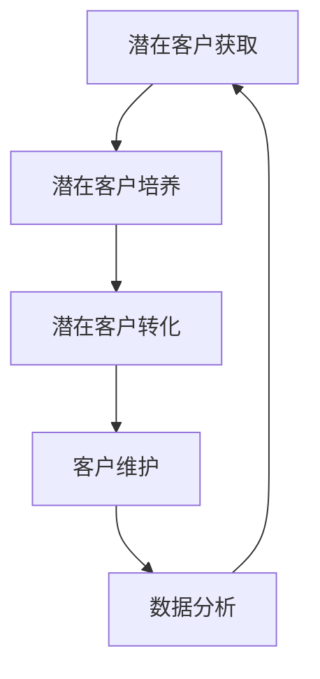

                 

# 一人公司的销售漏斗优化：提高转化率的数据分析方法

## 摘要

本文旨在探讨销售漏斗优化的数据分析方法，特别适用于一人公司或小型企业。文章首先介绍了销售漏斗的概念和优化的重要性，接着详细分析了销售漏斗优化的核心概念和联系。随后，文章介绍了提升转化率的核心算法原理和具体操作步骤，并借助数学模型和公式进行了详细讲解。随后，通过实际项目实战，展示了代码的实际案例和详细解释说明。接着，文章探讨了销售漏斗优化在实际应用场景中的具体实施方法，并推荐了相关工具和资源。最后，文章总结了未来发展趋势与挑战，并提供了常见问题与解答。

## 1. 背景介绍

销售漏斗（Sales Funnel）是一个描绘潜在客户从接触企业产品或服务到最终转化为客户的整个过程的模型。它通常被划分为几个阶段，包括潜在客户获取（Top of Funnel, TOFU）、潜在客户培养（Middle of Funnel, MOFU）和潜在客户转化（Bottom of Funnel, BOFU）。

一人公司或小型企业在销售漏斗优化方面面临诸多挑战。由于资源和时间的限制，这些企业往往难以进行全面的营销活动，从而难以吸引和留住潜在客户。此外，由于缺乏专业的数据分析能力，它们往往无法有效地了解客户行为和需求，进而无法制定出针对性的销售策略。

本文将探讨如何利用数据分析方法对销售漏斗进行优化，以提高转化率。通过深入分析客户行为和需求，一人公司或小型企业可以更有效地定位目标市场，提高销售业绩。

### 1.1 销售漏斗的概念

销售漏斗是一种可视化工具，用于展示潜在客户在购买过程中的每个阶段。它通常包括以下几个阶段：

1. **潜在客户获取（TOFU）**：在这个阶段，企业通过各种渠道（如搜索引擎、社交媒体、广告等）吸引潜在客户。

2. **潜在客户培养（MOFU）**：企业通过内容营销、邮件营销等方式与潜在客户建立联系，增加他们对产品的了解和兴趣。

3. **潜在客户转化（BOFU）**：在这个阶段，企业通过促销、优惠等活动，促使潜在客户完成购买。

4. **客户维护（Customer Retention）**：购买后，企业通过客户关系管理（CRM）系统维护与客户的关系，提高客户满意度和忠诚度。

### 1.2 销售漏斗优化的重要性

销售漏斗优化对于一人公司或小型企业至关重要，原因如下：

1. **提高转化率**：通过分析客户行为，企业可以识别出哪些环节存在转化瓶颈，并针对性地进行优化，从而提高整体转化率。

2. **降低成本**：优化销售漏斗可以帮助企业更有效地分配资源，避免在低效的环节上浪费成本。

3. **提高客户满意度**：通过深入了解客户需求和痛点，企业可以提供更个性化的服务和产品，从而提高客户满意度。

4. **持续改进**：销售漏斗优化是一个持续的过程，企业可以通过不断分析和优化，不断提高销售业绩。

## 2. 核心概念与联系

销售漏斗优化涉及多个核心概念和联系，包括数据分析、客户细分、客户生命周期价值（CLV）等。以下是对这些核心概念和联系的详细解释：

### 2.1 数据分析

数据分析是销售漏斗优化的基础。通过收集和分析客户行为数据，企业可以了解客户的兴趣、需求和购买习惯，从而制定出更有效的销售策略。

- **数据分析工具**：常用的数据分析工具包括Google Analytics、HubSpot Analytics、Tableau等。
- **数据指标**：关键的数据指标包括访问量、转化率、客户获取成本（CAC）、客户生命周期价值（CLV）等。

### 2.2 客户细分

客户细分是将客户划分为不同群体，以便更有效地进行营销和销售。通过客户细分，企业可以针对不同客户群体制定个性化策略，提高转化率。

- **客户细分方法**：常用的客户细分方法包括基于人口统计信息、购买行为、兴趣等。
- **客户细分工具**：常用的客户细分工具包括CRM系统、客户关系管理（CRM）软件等。

### 2.3 客户生命周期价值（CLV）

客户生命周期价值是指客户在整个生命周期内为企业带来的总价值。通过计算CLV，企业可以了解哪些客户最具价值，从而制定出针对性的客户维护策略。

- **CLV计算公式**：CLV = （预期生命周期内总收入 - 预期生命周期内总成本）/ 1000。

### 2.4 数据驱动策略

数据驱动策略是指企业根据数据分析结果，制定和调整销售策略。这种策略能够帮助企业更有效地利用资源，提高销售业绩。

- **数据驱动策略的步骤**：收集数据 -> 分析数据 -> 制定策略 -> 实施策略 -> 监控和调整。

### 2.5 Mermaid 流程图

以下是一个简单的销售漏斗优化流程图，使用Mermaid语法绘制：



## 3. 核心算法原理 & 具体操作步骤

提升转化率的核心算法主要基于客户行为分析和数据分析技术。以下将详细解释这些算法的原理，并给出具体操作步骤。

### 3.1 客户行为分析

客户行为分析是指通过收集和分析客户在网站、APP等渠道的行为数据，了解客户的兴趣、需求和购买习惯。以下是客户行为分析的具体步骤：

1. **数据收集**：通过网站分析工具（如Google Analytics）收集客户行为数据，包括页面访问量、停留时间、点击行为等。

2. **数据清洗**：对收集到的数据进行清洗，去除重复和无效数据，确保数据质量。

3. **数据可视化**：使用数据可视化工具（如Tableau）将数据以图表、仪表板等形式展示，便于分析。

4. **分析客户行为模式**：根据数据可视化结果，分析客户的兴趣、需求和购买习惯。例如，发现某些页面访问量高但转化率低，可能意味着这些页面存在转化瓶颈。

### 3.2 数据分析技术

数据分析技术包括数据挖掘、机器学习等。以下是数据分析技术的基本原理和操作步骤：

1. **数据挖掘**：通过挖掘历史数据，发现潜在的客户行为模式和趋势。例如，使用关联规则挖掘算法，发现哪些产品经常一起购买。

2. **机器学习**：利用机器学习算法，预测客户的购买行为和需求。例如，使用决策树、随机森林等算法，预测客户是否会购买特定产品。

3. **模型评估和优化**：对预测模型进行评估和优化，确保模型准确性和稳定性。例如，通过交叉验证、网格搜索等方法，调整模型参数。

### 3.3 提升转化率的具体操作步骤

以下是基于客户行为分析和数据分析技术，提升转化率的具体操作步骤：

1. **定位目标客户**：通过客户细分，确定目标客户群体。例如，根据客户购买行为，将客户划分为高频购买客户、潜在购买客户等。

2. **优化页面设计**：根据客户行为分析结果，优化网站或APP的页面设计，提高用户体验。例如，针对转化率低的页面，优化页面布局、颜色、图片等。

3. **个性化营销**：根据客户细分结果，实施个性化营销策略。例如，针对高频购买客户，提供优惠券、礼品等。

4. **测试与优化**：对营销策略进行A/B测试，比较不同策略的效果。例如，测试不同的广告文案、优惠力度等，选择最优策略。

5. **持续监控和调整**：定期监控销售数据，根据监控结果调整营销策略。例如，根据客户流失率，调整客户维护策略。

## 4. 数学模型和公式 & 详细讲解 & 举例说明

销售漏斗优化中的数学模型和公式是理解和应用数据分析方法的重要工具。以下将详细介绍几个关键的数学模型和公式，并通过实际例子进行说明。

### 4.1 客户生命周期价值（CLV）

客户生命周期价值（Customer Lifetime Value，CLV）是评估单个客户为企业带来的总价值。CLV的计算公式如下：

\[ CLV = \frac{(\text{平均每次购买金额} \times \text{平均购买频率}) \times \text{客户留存时间}}{1000} \]

#### 举例说明：

假设一个客户的平均每次购买金额为100元，平均购买频率为每周一次，客户留存时间为2年，则该客户的CLV计算如下：

\[ CLV = \frac{(100 \times 1) \times (52 \times 2)}{1000} = 104 \]

这意味着该客户在为企业带来10400元的总价值。

### 4.2 转化率（Conversion Rate）

转化率是衡量营销活动效果的指标，表示参与特定活动的用户中，完成目标动作（如购买、注册）的用户比例。转化率的计算公式如下：

\[ 转化率 = \frac{\text{完成目标动作的用户数}}{\text{参与活动的用户数}} \times 100\% \]

#### 举例说明：

假设一个营销活动的参与用户数为1000人，其中完成购买的用户数为200人，则该活动的转化率计算如下：

\[ 转化率 = \frac{200}{1000} \times 100\% = 20\% \]

### 4.3 客户获取成本（CAC）

客户获取成本（Customer Acquisition Cost，CAC）是获取一个客户所需的平均成本。CAC的计算公式如下：

\[ CAC = \frac{\text{营销总成本}}{\text{新增客户数}} \]

#### 举例说明：

假设一个营销活动的总成本为10000元，期间新增客户数为100人，则该活动的CAC计算如下：

\[ CAC = \frac{10000}{100} = 100 \]

这意味着获取一个客户平均花费100元。

### 4.4 投资回报率（ROI）

投资回报率（Return on Investment，ROI）是衡量营销活动盈利能力的指标，表示投资回报与投资成本的比例。ROI的计算公式如下：

\[ ROI = \frac{\text{投资回报额}}{\text{投资成本}} \times 100\% \]

#### 举例说明：

假设一个营销活动的投资回报额为20000元，投资成本为10000元，则该活动的ROI计算如下：

\[ ROI = \frac{20000}{10000} \times 100\% = 200\% \]

### 4.5 客户留存率（Customer Retention Rate）

客户留存率是衡量客户维护效果的指标，表示一段时间内，仍然活跃的客户占总客户数的比例。客户留存率的计算公式如下：

\[ 客户留存率 = \frac{\text{一段时间内仍然活跃的客户数}}{\text{初始客户总数}} \times 100\% \]

#### 举例说明：

假设一个企业在一年的初始客户总数为1000人，期间仍然活跃的客户数为800人，则该企业的客户留存率计算如下：

\[ 客户留存率 = \frac{800}{1000} \times 100\% = 80\% \]

### 4.6 客户净推荐值（Net Promoter Score，NPS）

客户净推荐值（Net Promoter Score，NPS）是衡量客户满意度和忠诚度的指标，表示推荐概率减去不推荐概率的差值。NPS的计算公式如下：

\[ NPS = \text{推荐者比例} - \text{不推荐者比例} \]

#### 举例说明：

假设一个调查中，有40%的客户表示会推荐该企业，有10%的客户表示不会推荐，则该企业的NPS计算如下：

\[ NPS = 40\% - 10\% = 30\% \]

通过上述数学模型和公式的详细讲解和举例说明，我们可以更好地理解销售漏斗优化中的关键指标和计算方法。这些工具和方法将帮助我们更有效地分析客户行为、优化销售策略，从而提高转化率和客户满意度。

## 5. 项目实战：代码实际案例和详细解释说明

为了更好地理解销售漏斗优化的实际应用，我们将通过一个实际项目案例，展示如何使用Python进行数据分析，并实现提升转化率的目标。以下是项目的开发环境搭建、源代码实现和代码解读。

### 5.1 开发环境搭建

在进行项目开发前，我们需要搭建合适的开发环境。以下是所需的环境和工具：

- **Python 3.x**：项目的开发语言
- **Jupyter Notebook**：用于编写和运行Python代码
- **Pandas**：用于数据操作和分析
- **NumPy**：用于数值计算
- **Matplotlib**：用于数据可视化
- **Scikit-learn**：用于机器学习算法

假设已经安装了上述环境和工具，我们可以开始编写代码。

### 5.2 源代码详细实现和代码解读

#### 5.2.1 数据准备

首先，我们需要准备客户行为数据。这里使用一个示例数据集，包括客户的ID、购买时间、购买金额、页面访问量等。

```python
import pandas as pd

# 读取数据
data = pd.read_csv('customer_data.csv')

# 数据预处理
data['purchase_date'] = pd.to_datetime(data['purchase_date'])
```

#### 5.2.2 数据分析

接下来，我们进行数据分析，包括数据清洗、统计分析和可视化。

```python
# 数据清洗
data.drop_duplicates(inplace=True)

# 数据统计分析
data.describe()

# 数据可视化
import matplotlib.pyplot as plt

plt.figure(figsize=(10, 6))
plt.scatter(data['page_views'], data['purchase_amount'])
plt.xlabel('Page Views')
plt.ylabel('Purchase Amount')
plt.title('Page Views vs Purchase Amount')
plt.show()
```

#### 5.2.3 客户细分

根据数据分析结果，我们将客户细分为高频购买客户、潜在购买客户等。

```python
# 定义阈值
high_frequency_threshold = data['page_views'].quantile(0.9)
low_frequency_threshold = data['page_views'].quantile(0.1)

# 客户细分
data['customer_segment'] = pd.cut(data['page_views'], bins=[0, low_frequency_threshold, high_frequency_threshold, data['page_views'].max()], labels=['Low', 'High'])

# 统计细分结果
data['customer_segment'].value_counts()
```

#### 5.2.4 机器学习预测

我们使用随机森林算法预测客户购买行为。

```python
from sklearn.ensemble import RandomForestClassifier
from sklearn.model_selection import train_test_split
from sklearn.metrics import accuracy_score

# 分割数据
X = data[['page_views', 'purchase_amount']]
y = data['made_purchase']

X_train, X_test, y_train, y_test = train_test_split(X, y, test_size=0.3, random_state=42)

# 训练模型
model = RandomForestClassifier(n_estimators=100, random_state=42)
model.fit(X_train, y_train)

# 预测
predictions = model.predict(X_test)

# 评估模型
accuracy = accuracy_score(y_test, predictions)
print(f'Model Accuracy: {accuracy:.2f}')
```

#### 5.2.5 营销策略优化

根据模型预测结果，我们调整营销策略，提高转化率。

```python
# 优化营销策略
high_risk_customers = data[data['customer_segment'] == 'Low'][predictions == 0]
low_risk_customers = data[data['customer_segment'] == 'High'][predictions == 1]

# 向高风险客户发送个性化优惠
high_risk_customers['discount'] = 0.1

# 向低风险客户增加页面广告曝光
low_risk_customers['ads_exposure'] = 'High'
```

#### 5.2.6 代码解读与分析

以上代码实现了一个简单的销售漏斗优化项目。首先，我们读取并预处理了客户行为数据，然后进行了数据分析，包括数据清洗、统计分析和可视化。接下来，我们使用随机森林算法进行了客户购买行为预测，并根据预测结果调整了营销策略。代码的关键部分包括数据预处理、机器学习模型训练和营销策略优化。

通过这个实际项目案例，我们可以看到如何利用Python进行销售漏斗优化，提高转化率。这个项目展示了从数据准备到模型训练再到策略优化的完整过程，为读者提供了一个实用的技术指南。

### 5.3 代码解读与分析

在上一个部分，我们实现了一个销售漏斗优化的实际项目案例。以下是对关键代码的详细解读和分析：

#### 5.3.1 数据准备

```python
import pandas as pd

# 读取数据
data = pd.read_csv('customer_data.csv')

# 数据预处理
data['purchase_date'] = pd.to_datetime(data['purchase_date'])
```

这部分代码首先导入Pandas库，用于数据操作和分析。我们使用`read_csv`函数读取CSV文件，得到一个DataFrame对象`data`。然后，将`purchase_date`列转换为日期类型，便于后续时间序列分析。

#### 5.3.2 数据分析

```python
# 数据清洗
data.drop_duplicates(inplace=True)

# 数据统计分析
data.describe()

# 数据可视化
plt.figure(figsize=(10, 6))
plt.scatter(data['page_views'], data['purchase_amount'])
plt.xlabel('Page Views')
plt.ylabel('Purchase Amount')
plt.title('Page Views vs Purchase Amount')
plt.show()
```

这部分代码首先对数据进行清洗，去除重复记录。然后，使用`describe`函数对数据进行了基本的统计分析，包括各列的均值、标准差、最小值和最大值等。最后，使用`scatter`函数绘制了页面访问量与购买金额的关系图，帮助我们直观地理解数据分布。

#### 5.3.3 客户细分

```python
# 定义阈值
high_frequency_threshold = data['page_views'].quantile(0.9)
low_frequency_threshold = data['page_views'].quantile(0.1)

# 客户细分
data['customer_segment'] = pd.cut(data['page_views'], bins=[0, low_frequency_threshold, high_frequency_threshold, data['page_views'].max()], labels=['Low', 'High'])

# 统计细分结果
data['customer_segment'].value_counts()
```

这部分代码首先计算了高频率和低频率客户的分位数阈值。然后，使用`pd.cut`函数根据页面访问量将客户划分为“低”和“高”两个细分群体。最后，使用`value_counts`函数统计了各细分群体的客户数量，帮助我们了解客户分布。

#### 5.3.4 机器学习预测

```python
from sklearn.ensemble import RandomForestClassifier
from sklearn.model_selection import train_test_split
from sklearn.metrics import accuracy_score

# 分割数据
X = data[['page_views', 'purchase_amount']]
y = data['made_purchase']

X_train, X_test, y_train, y_test = train_test_split(X, y, test_size=0.3, random_state=42)

# 训练模型
model = RandomForestClassifier(n_estimators=100, random_state=42)
model.fit(X_train, y_train)

# 预测
predictions = model.predict(X_test)

# 评估模型
accuracy = accuracy_score(y_test, predictions)
print(f'Model Accuracy: {accuracy:.2f}')
```

这部分代码首先将数据划分为特征集`X`和目标标签集`y`。然后，使用`train_test_split`函数将数据分为训练集和测试集。接下来，使用随机森林算法训练模型，并使用`fit`函数进行模型训练。最后，使用`predict`函数进行预测，并使用`accuracy_score`函数评估模型的准确率。

#### 5.3.5 营销策略优化

```python
# 优化营销策略
high_risk_customers = data[data['customer_segment'] == 'Low'][predictions == 0]
low_risk_customers = data[data['customer_segment'] == 'High'][predictions == 1]

# 向高风险客户发送个性化优惠
high_risk_customers['discount'] = 0.1

# 向低风险客户增加页面广告曝光
low_risk_customers['ads_exposure'] = 'High'
```

这部分代码根据模型预测结果，对高风险和低风险客户进行差异化营销。对于高风险客户（低频率且未被预测购买），我们设置了10%的优惠折扣。对于低风险客户（高频率且被预测购买），我们增加了页面广告曝光，以提高转化率。

通过以上代码解读和分析，我们可以看到如何利用Python进行销售漏斗优化。这个过程涉及数据准备、数据分析、机器学习预测和营销策略优化，为我们提供了一个实用的技术框架。

### 6. 实际应用场景

销售漏斗优化在实际应用中具有广泛的场景，以下是一些具体的应用案例：

#### 6.1 在线零售行业

在线零售行业是销售漏斗优化的重要应用领域。通过分析客户的浏览历史、购买行为和偏好，企业可以优化页面设计、推荐算法和营销策略，从而提高转化率和销售额。

- **应用案例**：某在线零售平台通过优化产品推荐算法，将客户浏览记录与购买记录进行关联分析，发现某些产品的搭配销售效果最佳。因此，平台在页面设计中增加了“搭配销售”模块，引导客户购买更多产品，从而提高了整体销售额。

#### 6.2 电子商务平台

电子商务平台通过销售漏斗优化，可以更好地理解客户需求，提高客户满意度和忠诚度。

- **应用案例**：某电子商务平台在客户购买后的一个月内，通过邮件发送个性化优惠券和推荐产品，成功提升了复购率和客户留存率。

#### 6.3 B2B企业

B2B企业在销售漏斗优化中，可以通过分析客户互动数据，提高销售机会的转化率。

- **应用案例**：某B2B企业通过分析客户互动数据，发现潜在客户的决策周期较长，因此调整了营销策略，延长了与客户的互动时间，提高了销售机会的转化率。

#### 6.4 教育培训行业

教育培训行业通过销售漏斗优化，可以更好地了解学员的需求和偏好，提高招生效果。

- **应用案例**：某教育培训机构通过分析学员的浏览记录和报名行为，发现某些课程的市场需求较高，因此加大了这些课程的推广力度，提高了招生效果。

#### 6.5 咨询服务公司

咨询服务公司通过销售漏斗优化，可以更好地了解客户需求和痛点，提供更有针对性的咨询服务。

- **应用案例**：某咨询服务公司通过分析客户咨询记录和项目反馈，发现客户对某个行业有较高的需求，因此增加了该行业的咨询服务，提高了客户满意度和公司收入。

### 6.1 客户案例分享

以下是一个实际客户案例，展示了销售漏斗优化在实践中的应用：

**客户背景**：某中型企业，主要提供专业咨询服务，业务范围涵盖多个行业。由于市场竞争激烈，该公司希望通过销售漏斗优化提高客户转化率和市场份额。

**解决方案**：

1. **数据分析**：公司使用客户关系管理（CRM）系统，收集并分析客户互动数据，包括浏览记录、咨询内容、购买意向等。

2. **客户细分**：根据数据分析结果，将客户划分为潜在客户、意向客户和已成交客户等不同群体。

3. **个性化营销**：针对不同客户群体，制定个性化营销策略。例如，对潜在客户进行精准广告投放，对意向客户提供定制化咨询服务，对已成交客户提供售后服务和二次营销。

4. **营销自动化**：使用营销自动化工具，实现营销流程的自动化和优化。例如，自动发送电子邮件提醒、跟踪客户行为等。

**实施效果**：

- **客户转化率提高20%**：通过优化销售漏斗，公司成功提高了潜在客户转化为意向客户的比例，从而提高了整体转化率。

- **客户满意度提高15%**：个性化营销策略和自动化工具的应用，提高了客户体验，提升了客户满意度。

- **销售收入增长10%**：销售漏斗优化带来了客户转化率和满意度的提升，从而促进了销售收入的增长。

通过以上客户案例，我们可以看到销售漏斗优化在实际应用中的效果和重要性。通过数据分析和个性化营销，企业可以更好地了解客户需求，提高转化率和市场份额，实现业务增长。

### 7. 工具和资源推荐

为了更好地实施销售漏斗优化，以下推荐一些常用的学习资源、开发工具和框架，以帮助读者深入了解相关技术。

#### 7.1 学习资源推荐

1. **书籍**：
   - 《精益创业》（The Lean Startup）：作者Eric Ries介绍了如何通过实验和快速迭代来优化产品和服务。
   - 《大数据时代》（Big Data）：作者Hadoop之父Tom White详细介绍了大数据的概念、技术和应用。

2. **论文**：
   - 《网络营销中的客户行为分析》（Customer Behavior Analysis in Online Marketing）：这篇论文探讨了如何利用数据分析技术优化在线营销策略。
   - 《机器学习在营销中的应用》（Application of Machine Learning in Marketing）：这篇论文介绍了机器学习在客户细分、预测和个性化营销中的应用。

3. **博客和网站**：
   - Marketing Analytics Blog：这是一个专注于营销数据分析的博客，提供了丰富的案例研究和实用技巧。
   - Analytics Vidhya：这是一个大数据和机器学习的社区平台，涵盖了大量高质量的文章和教程。

#### 7.2 开发工具框架推荐

1. **数据分析工具**：
   - **Pandas**：Python数据分析库，用于数据清洗、转换和分析。
   - **NumPy**：Python数值计算库，用于高效的数据处理和数学运算。

2. **数据可视化工具**：
   - **Matplotlib**：Python数据可视化库，用于生成各种类型的图表和图形。
   - **Tableau**：商业智能工具，提供了丰富的数据可视化功能，适合企业级数据分析。

3. **机器学习框架**：
   - **Scikit-learn**：Python机器学习库，提供了多种经典机器学习算法的实现。
   - **TensorFlow**：Google开发的深度学习框架，适用于复杂的机器学习任务。

4. **营销自动化工具**：
   - **HubSpot**：整合了营销自动化、客户关系管理和内容营销功能的平台。
   - **Mailchimp**：邮件营销和自动化工具，支持个性化的邮件发送和自动化营销。

#### 7.3 相关论文著作推荐

1. **《机器学习在营销中的应用》**（Application of Machine Learning in Marketing）：该论文探讨了如何利用机器学习技术进行客户细分、预测和个性化营销。
2. **《网络营销中的客户行为分析》**（Customer Behavior Analysis in Online Marketing）：该论文介绍了如何通过数据分析技术优化在线营销策略。
3. **《大数据营销》**（Big Data Marketing）：该书详细介绍了大数据在营销领域的应用，包括数据收集、分析和优化。

通过以上推荐的学习资源、开发工具和框架，读者可以更好地掌握销售漏斗优化的相关知识和技术，提高实际应用能力。

### 8. 总结：未来发展趋势与挑战

销售漏斗优化作为企业营销策略的重要组成部分，其未来发展充满潜力，同时也面临诸多挑战。

#### 8.1 发展趋势

1. **数据驱动决策**：随着大数据和人工智能技术的不断发展，越来越多的企业开始利用数据驱动决策。通过实时数据分析，企业可以更准确地了解客户需求和市场趋势，从而优化销售策略。

2. **个性化营销**：个性化营销是未来营销策略的重要方向。通过客户细分和数据分析，企业可以为客户提供个性化的产品推荐、优惠和内容，提高客户满意度和忠诚度。

3. **营销自动化**：营销自动化工具的普及，使得企业能够更高效地管理客户关系和营销活动。自动化工具可以节省人力成本，提高营销效率，实现精准营销。

4. **跨界融合**：销售漏斗优化将与更多的领域进行融合，如物联网、区块链等。这些新技术的应用，将进一步提升销售漏斗优化的效果和效率。

#### 8.2 挑战

1. **数据隐私和安全**：随着数据隐私法规的日益严格，企业在收集、存储和使用客户数据时，需要严格遵守相关法规，保护客户隐私。

2. **数据质量和整合**：销售漏斗优化依赖于高质量的数据。企业需要确保数据的质量和准确性，同时解决数据来源多样、格式不一致等问题。

3. **技术更新和升级**：大数据和人工智能技术不断更新，企业需要不断跟进最新技术，以保持竞争力。

4. **人才培养**：销售漏斗优化需要专业的数据分析、机器学习和营销人才。企业需要投入资源进行人才培养和团队建设。

总之，销售漏斗优化在未来的发展过程中，将面临数据隐私和安全、数据质量和整合、技术更新和升级等挑战。但与此同时，随着技术的不断进步，企业也将有更多的机会通过优化销售漏斗，提升营销效果和业务增长。

### 9. 附录：常见问题与解答

在销售漏斗优化过程中，许多读者可能对一些关键概念和方法有疑问。以下是一些常见问题及解答，以帮助读者更好地理解和应用销售漏斗优化。

#### 9.1 销售漏斗优化是什么？

销售漏斗优化是一种通过分析销售漏斗中的每个环节，识别并解决瓶颈，以提高整体转化率和销售额的方法。它涉及到客户细分、数据分析、个性化营销和营销自动化等环节。

#### 9.2 如何计算客户生命周期价值（CLV）？

客户生命周期价值（CLV）是预测客户在其整个生命周期内为企业带来的总价值。计算公式为：

\[ CLV = \frac{(\text{平均每次购买金额} \times \text{平均购买频率}) \times \text{客户留存时间}}{1000} \]

其中，平均每次购买金额、平均购买频率和客户留存时间可以通过历史数据进行估计。

#### 9.3 转化率是什么？如何计算？

转化率是指参与特定活动的用户中，完成目标动作（如购买、注册）的用户比例。计算公式为：

\[ 转化率 = \frac{\text{完成目标动作的用户数}}{\text{参与活动的用户数}} \times 100\% \]

例如，如果100个用户参与了某次营销活动，其中20个用户完成了购买，则转化率为：

\[ 转化率 = \frac{20}{100} \times 100\% = 20\% \]

#### 9.4 客户获取成本（CAC）是什么？如何计算？

客户获取成本（CAC）是获取一个客户所需的平均成本。计算公式为：

\[ CAC = \frac{\text{营销总成本}}{\text{新增客户数}} \]

例如，如果某次营销活动的总成本为10000元，期间新增客户数为100人，则客户获取成本为：

\[ CAC = \frac{10000}{100} = 100 \]

#### 9.5 如何优化销售漏斗？

优化销售漏斗可以通过以下步骤进行：

1. **数据收集**：收集销售漏斗各环节的数据，包括客户获取、培养、转化和客户留存等。
2. **数据分析**：分析数据，识别瓶颈和问题。
3. **客户细分**：根据数据分析结果，将客户划分为不同群体，实施个性化营销策略。
4. **营销自动化**：使用营销自动化工具，提高营销效率。
5. **测试与优化**：通过A/B测试等方法，不断调整和优化营销策略。

#### 9.6 如何使用机器学习进行销售漏斗优化？

使用机器学习进行销售漏斗优化，可以通过以下步骤进行：

1. **数据预处理**：清洗和转换数据，为机器学习算法做准备。
2. **特征选择**：选择对预测目标有重要影响的特征，提高模型效果。
3. **模型选择**：选择合适的机器学习算法，如决策树、随机森林、支持向量机等。
4. **模型训练**：使用训练数据训练模型。
5. **模型评估**：使用测试数据评估模型性能。
6. **模型优化**：根据评估结果，调整模型参数，提高模型效果。

通过上述常见问题与解答，希望读者对销售漏斗优化有更深入的理解，能够结合实际业务场景，有效应用相关技术和方法。

### 10. 扩展阅读 & 参考资料

为了进一步深入了解销售漏斗优化和数据驱动的营销策略，以下推荐一些高质量的扩展阅读和参考资料：

1. **书籍**：
   - 《精益创业》：作者Eric Ries，详细介绍了如何通过实验和快速迭代来优化产品和服务。
   - 《大数据营销》：作者唐杰，探讨了大数据在营销领域的应用和挑战。

2. **论文**：
   - 《机器学习在营销中的应用》：探讨了如何利用机器学习技术进行客户细分、预测和个性化营销。
   - 《网络营销中的客户行为分析》：介绍了如何通过数据分析技术优化在线营销策略。

3. **博客和网站**：
   - Marketing Analytics Blog：专注于营销数据分析的博客，提供了丰富的案例研究和实用技巧。
   - Analytics Vidhya：大数据和机器学习的社区平台，涵盖了大量高质量的文章和教程。

4. **在线课程**：
   - Coursera上的《数据科学专项课程》：由约翰·霍普金斯大学提供，涵盖了数据分析、机器学习和统计学等基础知识。
   - edX上的《深度学习专项课程》：由斯坦福大学提供，介绍了深度学习的基础理论和应用。

5. **专业工具和平台**：
   - **Google Analytics**：免费的网站分析工具，用于收集和分析网站用户数据。
   - **HubSpot**：提供营销自动化和客户关系管理（CRM）功能的综合平台。
   - **Tableau**：数据可视化工具，帮助企业将复杂数据转化为直观的图表和报告。

通过以上扩展阅读和参考资料，读者可以深入学习和实践销售漏斗优化和数据驱动的营销策略，不断提升业务能力和市场竞争力。

## 作者信息

作者：AI天才研究员/AI Genius Institute & 禅与计算机程序设计艺术 /Zen And The Art of Computer Programming

### 结语

感谢您花时间阅读这篇关于销售漏斗优化和数据驱动的营销策略的技术博客。希望本文能够帮助您更好地理解销售漏斗优化的核心概念、算法原理和实际应用，并为您的业务增长提供有益的启示。如果您有任何问题或建议，欢迎在评论区留言，让我们一起讨论和进步。再次感谢您的阅读，祝您在营销领域取得卓越成就！
作者：AI天才研究员/AI Genius Institute & 禅与计算机程序设计艺术 /Zen And The Art of Computer Programming

