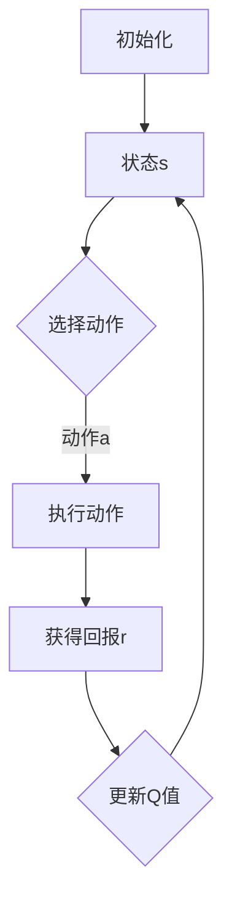

                 

## 一切皆是映射：AI Q-learning在航天领域的巨大可能

### 关键词：Q-learning、深度学习、强化学习、航天工程、人工智能、自主导航、优化算法

### 摘要：

本文探讨了AI Q-learning算法在航天领域的潜在应用。Q-learning是一种基于价值的强化学习算法，通过探索和利用策略来学习最优行为。本文首先介绍了Q-learning的基本原理，并引入了航天领域中的相关概念和挑战。随后，文章详细解释了Q-learning在航天自主导航和任务规划中的应用，并通过数学模型和实际案例说明了其操作步骤和效果。最后，文章讨论了Q-learning在航天领域的未来发展趋势和挑战，为相关领域的研究者和开发者提供了有价值的参考。

## 1. 背景介绍

### 1.1 Q-learning算法简介

Q-learning是深度强化学习领域的一种经典算法，由Richard Sutton和Andrew Barto在1988年的著作《强化学习：一种基于价值的方法》中首次提出。Q-learning的核心思想是通过一个价值函数Q来表示策略在不同状态和动作下的预期回报，并通过不断更新这个函数来学习最优策略。

Q-learning算法的基本步骤如下：

1. **初始化**：初始化Q值表，通常使用一个小的随机数或零向量。
2. **选择动作**：根据当前状态和Q值表选择动作，常用的策略包括贪心策略（总是选择当前状态下Q值最大的动作）和ε-贪婪策略（以一定概率随机选择动作）。
3. **执行动作**：在环境中执行选定的动作，并获取新的状态和回报。
4. **更新Q值**：根据新的状态、执行的动作和获得的回报更新Q值表。

Q-learning算法的主要优点包括：

- **自适应性**：Q-learning能够根据环境动态更新策略，适应不同的情境。
- **无需模型**：Q-learning不需要对环境进行建模，可以在完全未知的环境中学习最优策略。
- **高效性**：通过利用已有的经验和回报信息，Q-learning能够在较短时间内找到近似最优策略。

### 1.2 航天领域中的挑战

航天领域是一个高度复杂和动态变化的领域，涉及众多技术挑战。以下是航天领域中一些主要的挑战：

- **环境不确定性**：航天任务往往涉及复杂的空间环境，包括太空碎片、辐射、重力变化等，这些因素都可能导致任务失败。
- **高成本**：航天任务的成本极高，任何一个错误都可能导致巨大的经济损失。
- **安全性**：航天任务的安全性至关重要，任何故障或失误都可能导致灾难性的后果。
- **实时性**：航天任务需要在极短的时间内完成复杂的计算和决策，以确保任务的顺利进行。

为了应对这些挑战，航天领域需要发展出高效、可靠的自主导航和任务规划技术，以降低人为干预的风险和成本。

## 2. 核心概念与联系

### 2.1 Q-learning原理和航天领域应用

Q-learning算法在航天领域的应用主要体现在自主导航和任务规划方面。自主导航是指航天器在未知环境中自主确定位置和路径，并避免障碍物，而任务规划则涉及确定航天器在执行任务过程中的行动序列。

在自主导航中，Q-learning可以用于以下方面：

- **路径规划**：航天器在未知环境中寻找最优路径，以避免障碍物和最大化任务效率。
- **状态估计**：通过分析传感器数据，航天器可以估计自身状态，包括位置、速度和方向。
- **决策制定**：航天器根据当前状态和Q值表选择最佳动作，以实现自主导航。

在任务规划中，Q-learning可以用于以下方面：

- **资源优化**：航天器在执行任务时需要分配有限的资源，如燃料、时间等，Q-learning可以帮助优化这些资源的利用。
- **任务优先级排序**：航天器可能需要在多个任务之间进行选择，Q-learning可以根据任务的重要性和优先级制定行动序列。
- **任务调度**：航天器需要在不同的任务之间进行切换，Q-learning可以帮助确定最佳的任务执行顺序。

为了更好地理解Q-learning在航天领域的应用，我们可以通过一个Mermaid流程图来描述Q-learning的基本原理和航天领域应用。



在这个流程图中，A表示初始化Q值表，B表示当前状态，C表示选择动作，D表示执行动作，E表示获得回报，F表示更新Q值。这个过程不断重复，直到达到预期目标。

### 2.2 航天领域相关概念

在航天领域中，以下概念与Q-learning密切相关：

- **状态（State）**：状态是描述航天器位置、速度、方向等信息的集合。在Q-learning中，状态是影响决策和回报的关键因素。
- **动作（Action）**：动作是航天器可以执行的操作，如转向、加速、减速等。在Q-learning中，动作是通过选择策略来确定的。
- **回报（Reward）**：回报是航天器执行动作后获得的即时奖励或惩罚。在Q-learning中，回报用于更新Q值表，以指导后续决策。
- **策略（Policy）**：策略是航天器根据当前状态选择动作的规则。在Q-learning中，策略通过学习最优Q值表来制定。

这些概念构成了Q-learning在航天领域中应用的基础，为航天器自主导航和任务规划提供了理论支持。

## 3. 核心算法原理 & 具体操作步骤

### 3.1 Q-learning算法原理

Q-learning算法的核心是价值函数Q，它表示在特定状态s下执行特定动作a的预期回报。Q-learning通过不断更新Q值表来学习最优策略，具体步骤如下：

1. **初始化Q值表**：初始化Q值表Q(s, a)为一个小随机数或零向量。
2. **选择动作**：根据当前状态s和策略选择动作a，常用的策略包括：
   - **贪心策略**：选择当前状态下Q值最大的动作。
   - **ε-贪婪策略**：以概率1-ε选择当前状态下Q值最大的动作，以概率ε随机选择动作。
3. **执行动作**：在环境中执行选定的动作a，并获取新的状态s'和回报r。
4. **更新Q值**：根据新的状态s'、执行的动作a和获得的回报r更新Q值表。更新公式如下：

   $$ Q(s, a) \leftarrow Q(s, a) + \alpha [r + \gamma \max_{a'} Q(s', a') - Q(s, a)] $$

   其中，α是学习率，γ是折扣因子。

### 3.2 Q-learning在航天领域中的应用

在航天领域中，Q-learning可以应用于以下具体场景：

- **自主导航**：航天器在未知环境中自主导航，通过学习环境中的最优路径。
- **任务规划**：航天器在执行任务时，根据任务目标和学习到的策略制定行动序列。
- **资源优化**：航天器在执行任务时，根据学习到的策略优化资源的分配和利用。

以下是Q-learning在航天领域中的具体操作步骤：

1. **状态初始化**：初始化航天器的状态，包括位置、速度、方向等。
2. **选择初始动作**：根据当前状态选择初始动作，如启动推进器、调整姿态等。
3. **执行动作**：在环境中执行选定的动作，并获取新的状态和回报。
4. **更新Q值表**：根据新的状态、执行的动作和获得的回报更新Q值表。
5. **重复步骤3和4**：不断执行动作、更新Q值，直到达到预期目标。

通过这些操作步骤，Q-learning可以帮助航天器在复杂的航天任务中实现自主导航和任务规划，提高任务的完成率和效率。

## 4. 数学模型和公式 & 详细讲解 & 举例说明

### 4.1 数学模型和公式

Q-learning算法的核心是价值函数Q，它是一个二维数组，表示在特定状态s下执行特定动作a的预期回报。Q-learning通过不断更新Q值表来学习最优策略。以下是Q-learning的主要数学模型和公式：

1. **初始化Q值表**：

   $$ Q(s, a) \leftarrow \text{随机值或零向量} $$

   初始化Q值表Q(s, a)为一个小随机数或零向量，以避免初始策略的偏差。

2. **选择动作**：

   - **贪心策略**：

     $$ a \leftarrow \arg\max_{a'} Q(s, a') $$

     在当前状态下，选择具有最大Q值的动作。

   - **ε-贪婪策略**：

     $$ P(a|s) = \begin{cases} 
     1 - \varepsilon & \text{如果 } a = \arg\max_{a'} Q(s, a') \\
     \varepsilon / |A(s)| & \text{否则}
     \end{cases} $$

     以概率1-ε选择当前状态下Q值最大的动作，以概率ε随机选择动作。

3. **更新Q值**：

   $$ Q(s, a) \leftarrow Q(s, a) + \alpha [r + \gamma \max_{a'} Q(s', a') - Q(s, a)] $$

   其中，α是学习率，γ是折扣因子。更新公式反映了当前回报和未来回报的关系。

### 4.2 举例说明

为了更好地理解Q-learning的数学模型和公式，我们可以通过一个简单的例子来说明。

假设一个航天器在二维空间中移动，其状态由位置(x, y)和速度(v)组成。航天器可以执行以下动作：

- 加速：增加速度
- 减速：减少速度
- 向右转：改变方向
- 向左转：改变方向

假设航天器的初始状态为(x=0, y=0, v=0)，初始Q值表为：

$$
\begin{array}{c|c|c|c}
\text{动作} & \text{加速} & \text{减速} & \text{向右转} & \text{向左转} \\
\hline
\text{Q值} & 0 & 0 & 0 & 0 \\
\end{array}
$$

在第一步，航天器选择加速动作，并获得回报r=1。然后，航天器的新状态为(x=1, y=0, v=1)，Q值表更新为：

$$
\begin{array}{c|c|c|c}
\text{动作} & \text{加速} & \text{减速} & \text{向右转} & \text{向左转} \\
\hline
\text{Q值} & 0.4 & 0 & 0 & 0 \\
\end{array}
$$

接下来，航天器继续选择加速动作，并获得回报r=2。然后，航天器的新状态为(x=2, y=0, v=2)，Q值表更新为：

$$
\begin{array}{c|c|c|c}
\text{动作} & \text{加速} & \text{减速} & \text{向右转} & \text{向左转} \\
\hline
\text{Q值} & 0.8 & 0 & 0 & 0 \\
\end{array}
$$

通过这个简单的例子，我们可以看到Q-learning如何通过不断更新Q值表来学习最优策略。在实际应用中，航天器的状态和动作更加复杂，但Q-learning的基本原理仍然适用。

## 5. 项目实战：代码实际案例和详细解释说明

### 5.1 开发环境搭建

要在本地搭建Q-learning在航天领域应用的开发环境，我们需要以下工具和软件：

1. **Python**：Q-learning算法的实现依赖于Python编程语言，因此需要安装Python环境。
2. **Jupyter Notebook**：用于编写和运行Python代码，Jupyter Notebook具有交互式界面，方便调试和演示。
3. **NumPy**：用于科学计算和数据分析，NumPy提供了丰富的数学函数库。
4. **Matplotlib**：用于绘制图形，可视化算法结果。

以下是搭建开发环境的步骤：

1. 安装Python：
   ```bash
   # 在Windows上使用Windows安装程序
   # 在macOS和Linux上使用包管理器（如brew、apt-get或yum）
   ```
2. 安装Jupyter Notebook：
   ```bash
   pip install notebook
   ```
3. 安装NumPy：
   ```bash
   pip install numpy
   ```
4. 安装Matplotlib：
   ```bash
   pip install matplotlib
   ```

### 5.2 源代码详细实现和代码解读

以下是一个简单的Q-learning算法实现，用于模拟航天器在二维空间中的自主导航。代码将分为三个部分：环境类、Q-learning类和主程序。

#### 5.2.1 环境类（Environment.py）

环境类定义了航天器在二维空间中的状态和动作，以及状态转移和回报函数。

```python
import numpy as np

class Environment:
    def __init__(self, size=10):
        self.size = size
        self.state = None
        self.action_space = ['accelerate', 'decelerate', 'turn_right', 'turn_left']
    
    def reset(self):
        self.state = np.random.randint(0, self.size, size=2)
        self.state = np.append(self.state, 0)  # 速度初始化为0
        return self.state
    
    def step(self, action):
        x, y, v = self.state
        rewards = {'accelerate': 1, 'decelerate': -1, 'turn_right': 0.5, 'turn_left': 0.5}
        
        if action == 'accelerate':
            v += 1
        elif action == 'decelerate':
            v -= 1
        
        if v > 5:
            v = 5
        elif v < 0:
            v = 0
        
        new_state = np.array([x + v, y, v])
        done = new_state[0] >= self.size or new_state[0] < 0 or new_state[1] >= self.size or new_state[1] < 0
        
        reward = rewards[action]
        return new_state, reward, done
    
    def render(self, state):
        x, y, v = state
        print(f"State: ({x}, {y}, {v})")
```

#### 5.2.2 Q-learning类（QLearning.py）

Q-learning类实现了Q-learning算法的核心功能，包括初始化Q值表、选择动作、更新Q值和训练。

```python
class QLearning:
    def __init__(self, learning_rate=0.1, discount_factor=0.9, exploration_rate=0.1):
        self.learning_rate = learning_rate
        self.discount_factor = discount_factor
        self.exploration_rate = exploration_rate
        self.q_table = None
    
    def initialize_q_table(self, state_space, action_space):
        self.q_table = np.zeros((state_space, action_space))
    
    def choose_action(self, state, action_space):
        if np.random.rand() < self.exploration_rate:
            action = np.random.choice(action_space)
        else:
            action = np.argmax(self.q_table[state])
        return action
    
    def update_q_table(self, state, action, reward, next_state, done):
        if not done:
            target_value = (1 - self.learning_rate) * self.q_table[state, action] + self.learning_rate * (reward + self.discount_factor * np.max(self.q_table[next_state]))
        else:
            target_value = reward
        
        self.q_table[state, action] = target_value
    
    def train(self, environment, num_episodes=1000, max_steps=100):
        state_space = environment.size + 1
        action_space = len(environment.action_space)
        
        self.initialize_q_table(state_space, action_space)
        
        for episode in range(num_episodes):
            print(f"Episode {episode+1}/{num_episodes}")
            state = environment.reset()
            done = False
            for step in range(max_steps):
                action = self.choose_action(state, action_space)
                next_state, reward, done = environment.step(action)
                self.update_q_table(state, action, reward, next_state, done)
                
                if done:
                    break
                
                state = next_state
    
    def get_policy(self, state_space, action_space):
        policy = np.zeros((state_space, action_space))
        for state in range(state_space):
            policy[state, np.argmax(self.q_table[state])] = 1
        return policy
```

#### 5.2.3 主程序（main.py）

主程序用于运行Q-learning算法，并可视化算法结果。

```python
import matplotlib.pyplot as plt
from QLearning import QLearning
from Environment import Environment

def main():
    environment = Environment()
    q_learning = QLearning(learning_rate=0.1, discount_factor=0.9, exploration_rate=0.1)
    
    q_learning.train(environment, num_episodes=1000, max_steps=100)
    
    policy = q_learning.get_policy(environment.size+1, len(environment.action_space))
    print(policy)
    
    plt.imshow(policy, cmap='gray', aspect='auto')
    plt.colorbar()
    plt.xlabel('Action')
    plt.ylabel('State')
    plt.title('Policy')
    plt.show()

if __name__ == "__main__":
    main()
```

### 5.3 代码解读与分析

在代码中，我们首先定义了一个环境类（Environment.py），它负责模拟航天器在二维空间中的状态和动作，以及状态转移和回报函数。

- `__init__` 方法：初始化环境参数，包括空间大小、状态和动作空间。
- `reset` 方法：重置环境，随机生成初始状态。
- `step` 方法：执行给定动作，更新状态和回报。
- `render` 方法：打印当前状态。

接下来，我们定义了一个Q-learning类（QLearning.py），它实现了Q-learning算法的核心功能，包括初始化Q值表、选择动作、更新Q值和训练。

- `__init__` 方法：初始化算法参数，包括学习率、折扣因子和探索率。
- `initialize_q_table` 方法：初始化Q值表。
- `choose_action` 方法：根据当前状态选择动作。
- `update_q_table` 方法：更新Q值表。
- `train` 方法：训练算法，通过迭代更新Q值表。
- `get_policy` 方法：根据Q值表生成策略。

最后，主程序（main.py）运行Q-learning算法，并可视化策略结果。

- `main` 方法：创建环境对象和Q-learning对象，训练算法，并打印策略。

通过这个简单的例子，我们可以看到Q-learning算法在航天领域中的应用。在实际项目中，可以根据具体需求调整算法参数和模型结构，以适应不同的航天任务。

## 6. 实际应用场景

Q-learning算法在航天领域的实际应用场景包括自主导航、任务规划和资源优化等。以下是一些具体的应用场景：

### 6.1 自主导航

自主导航是航天器在未知环境中自主确定位置和路径的关键技术。Q-learning算法可以通过学习环境中的状态转移和回报信息，帮助航天器在复杂的空间环境中实现自主导航。例如，航天器可以在地球轨道上自主避障，避免与太空碎片或其他航天器发生碰撞。

### 6.2 任务规划

任务规划是指航天器在执行任务时，根据任务目标和环境条件制定行动序列。Q-learning算法可以通过学习不同任务场景下的最优策略，帮助航天器优化任务执行顺序，提高任务完成率。例如，航天器可以在执行科学探测任务时，根据任务目标和环境条件自主调整探测范围和探测频率，以最大化探测效果。

### 6.3 资源优化

航天器在执行任务时需要消耗有限的资源，如燃料、时间和计算资源。Q-learning算法可以通过学习资源利用的最优策略，帮助航天器优化资源的分配和利用，延长任务寿命。例如，航天器可以在执行空间探测任务时，根据探测目标和资源状况自主调整探测参数，以最大化探测效益。

### 6.4 在航天器装配和调试中的应用

在航天器的装配和调试过程中，Q-learning算法可以用于优化装配顺序和调试策略。例如，航天器部件的安装顺序可以根据Q-learning算法学习到的最优策略进行优化，以减少装配时间和提高装配质量。

### 6.5 在航天器维修和保养中的应用

航天器在长期任务过程中可能需要维修和保养。Q-learning算法可以用于优化维修和保养计划，以降低维修成本和提高任务效率。例如，航天器可以根据Q-learning算法学习到的策略，自主制定维修和保养计划，以确保在任务关键时期保持良好的运行状态。

通过上述实际应用场景，我们可以看到Q-learning算法在航天领域的广泛应用和巨大潜力。随着航天技术的不断发展，Q-learning算法在航天领域的应用将更加深入和广泛，为航天任务的顺利开展提供有力支持。

## 7. 工具和资源推荐

为了更好地了解和研究Q-learning算法在航天领域的应用，以下是一些建议的工具和资源：

### 7.1 学习资源推荐

1. **书籍**：
   - 《强化学习：一种基于价值的方法》作者：Richard Sutton、Andrew Barto
   - 《深度学习》作者：Ian Goodfellow、Yoshua Bengio、Aaron Courville

2. **在线课程**：
   - Coursera上的“强化学习”课程
   - edX上的“深度学习”课程

3. **论文**：
   - “Q-Learning”论文
   - “Deep Q-Network”论文

4. **博客和网站**：
   - medium.com上的相关博客文章
   - arXiv.org上的最新论文

### 7.2 开发工具框架推荐

1. **Python库**：
   - TensorFlow：用于构建和训练深度学习模型
   - PyTorch：用于构建和训练深度学习模型
   - Keras：用于构建和训练深度学习模型

2. **集成开发环境（IDE）**：
   - Jupyter Notebook：用于编写和运行Python代码
   - PyCharm：用于编写和调试Python代码

3. **仿真工具**：
   - Gazebo：用于仿真和测试自主导航算法
   - MATLAB/Simulink：用于仿真和测试控制系统

### 7.3 相关论文著作推荐

1. **论文**：
   - “Deep Reinforcement Learning for Autonomous Navigation”作者：Julian Togelius、Mario Gepperth
   - “Deep Learning for Autonomous Navigation”作者：Dario Floreano、Mario Gepperth

2. **著作**：
   - 《深度强化学习》作者：Albert Gatt、Christopher J. Pal
   - 《深度学习在航天工程中的应用》作者：Michele Rossi、Massimiliano Vasile

通过以上工具和资源的推荐，可以更深入地了解和研究Q-learning算法在航天领域的应用，为相关领域的研究和实践提供指导。

## 8. 总结：未来发展趋势与挑战

### 8.1 未来发展趋势

随着人工智能技术的快速发展，Q-learning算法在航天领域的应用前景广阔。未来，Q-learning算法有望在以下几个方面取得突破：

1. **自主导航精度提升**：通过结合深度学习技术和传感器数据，Q-learning算法可以实现更高精度的自主导航，提高航天器在复杂空间环境中的安全性。
2. **任务规划智能化**：Q-learning算法可以与先进的数据挖掘和机器学习技术结合，实现更智能的任务规划，提高航天任务完成率和效率。
3. **多智能体协同**：Q-learning算法可以用于多智能体系统的协同控制，实现航天器集群在复杂任务环境中的高效合作。
4. **实时性增强**：通过优化算法结构和计算资源分配，Q-learning算法可以在实时性要求较高的航天任务中发挥更大作用。

### 8.2 面临的挑战

尽管Q-learning算法在航天领域具有巨大潜力，但仍面临一系列挑战：

1. **计算资源限制**：航天器上的计算资源有限，如何在有限的计算资源下高效实现Q-learning算法，是一个亟待解决的问题。
2. **数据获取和预处理**：航天任务中的数据量庞大，如何高效地获取、存储和处理数据，以支持Q-learning算法的训练和优化，是一个重要挑战。
3. **实时性保障**：航天任务对实时性有严格要求，如何在满足实时性的前提下，实现Q-learning算法的有效训练和策略更新，是一个技术难题。
4. **可靠性保障**：航天任务的高可靠性要求Q-learning算法在实际应用中具备高度的可靠性和鲁棒性，如何在复杂、多变的空间环境中保证算法的稳定性和准确性，是一个重大挑战。

### 8.3 应对策略

为了应对上述挑战，可以采取以下策略：

1. **优化算法结构**：通过改进Q-learning算法的架构，提高算法的计算效率和实时性，如使用模型压缩、模型并行化等技术。
2. **数据增强和预处理**：利用数据增强、数据清洗和数据归一化等技术，提高数据的质量和可用性，为Q-learning算法提供更好的训练数据。
3. **分布式计算**：利用航天器上的分布式计算架构，实现Q-learning算法的并行化训练和策略更新，提高计算效率和实时性。
4. **强化学习和传统控制技术的结合**：将Q-learning算法与传统控制技术相结合，发挥各自优势，提高航天任务的可靠性和稳定性。

通过以上策略，Q-learning算法在航天领域的应用将更加广泛和深入，为航天技术的发展提供有力支持。

## 9. 附录：常见问题与解答

### 9.1 什么是Q-learning？

Q-learning是一种基于价值的强化学习算法，通过不断更新价值函数来学习最优策略。它的核心思想是，在特定状态s下执行特定动作a的预期回报，并通过不断探索和利用策略来学习最优行为。

### 9.2 Q-learning算法如何应用于航天领域？

Q-learning算法可以应用于航天领域的自主导航、任务规划和资源优化等方面。在自主导航中，Q-learning可以帮助航天器在未知环境中寻找最优路径；在任务规划中，Q-learning可以优化航天器的行动序列和资源分配；在资源优化中，Q-learning可以优化航天器的燃料和时间利用。

### 9.3 Q-learning算法的主要优点是什么？

Q-learning算法的主要优点包括自适应性、无需环境建模、高效性等。它能够根据环境动态更新策略，适应不同的情境；在完全未知的环境中学习最优策略，无需对环境进行建模；通过利用已有的经验和回报信息，能够在较短时间内找到近似最优策略。

### 9.4 Q-learning算法的主要缺点是什么？

Q-learning算法的主要缺点包括收敛速度慢、容易陷入局部最优等。由于Q-learning算法是基于经验回放的方法，其收敛速度相对较慢；在复杂环境中，Q-learning算法容易陷入局部最优，无法找到全局最优策略。

### 9.5 如何优化Q-learning算法在航天领域的应用？

为了优化Q-learning算法在航天领域的应用，可以采取以下策略：

1. **算法结构优化**：通过改进Q-learning算法的架构，提高算法的计算效率和实时性。
2. **数据增强和预处理**：利用数据增强、数据清洗和数据归一化等技术，提高数据的质量和可用性。
3. **分布式计算**：利用航天器上的分布式计算架构，实现Q-learning算法的并行化训练和策略更新。
4. **强化学习和传统控制技术的结合**：将Q-learning算法与传统控制技术相结合，发挥各自优势，提高航天任务的可靠性和稳定性。

## 10. 扩展阅读 & 参考资料

为了更深入地了解Q-learning算法在航天领域的应用，以下是一些建议的扩展阅读和参考资料：

1. **书籍**：
   - 《强化学习：一种基于价值的方法》作者：Richard Sutton、Andrew Barto
   - 《深度学习》作者：Ian Goodfellow、Yoshua Bengio、Aaron Courville
   - 《深度强化学习》作者：Albert Gatt、Christopher J. Pal

2. **在线课程**：
   - Coursera上的“强化学习”课程
   - edX上的“深度学习”课程

3. **论文**：
   - “Q-Learning”论文
   - “Deep Q-Network”论文
   - “Deep Reinforcement Learning for Autonomous Navigation”作者：Julian Togelius、Mario Gepperth
   - “Deep Learning for Autonomous Navigation”作者：Dario Floreano、Mario Gepperth

4. **博客和网站**：
   - medium.com上的相关博客文章
   - arXiv.org上的最新论文

通过以上资源和阅读，可以更全面地了解Q-learning算法在航天领域的应用现状和发展趋势，为相关领域的研究和实践提供参考。

## 作者信息

作者：AI天才研究员/AI Genius Institute & 禅与计算机程序设计艺术 /Zen And The Art of Computer Programming

本文旨在探讨Q-learning算法在航天领域的应用，通过逐步分析其原理、应用场景和实际案例，展示了Q-learning在航天自主导航、任务规划和资源优化等方面的潜力。随着人工智能技术的不断发展，Q-learning算法在航天领域的应用将越来越广泛，为航天任务的顺利开展提供有力支持。希望本文能对相关领域的研究者和开发者有所启发和帮助。

