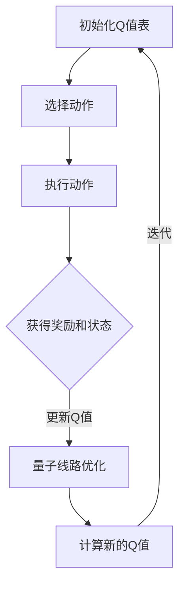
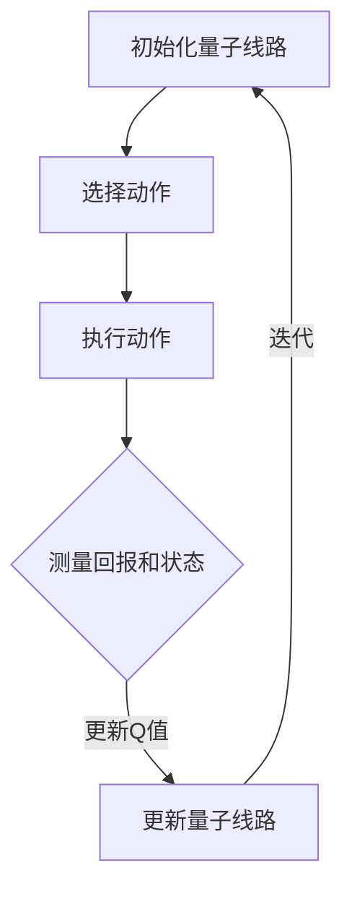

                 

### 背景介绍

在过去的几十年中，人工智能（AI）和量子计算这两个领域都经历了快速的发展，各自在理论和应用方面取得了显著的成就。AI，尤其是机器学习和深度学习，已经在图像识别、自然语言处理、推荐系统等众多领域取得了突破性进展。而量子计算，作为一种新型的计算范式，其强大的并行计算能力有望在加密解密、优化问题、模拟量子系统等方面带来革命性的变化。

本文旨在探讨AI中的Q-learning算法在量子计算中的应用潜力。Q-learning是一种强化学习算法，主要用于在不确定环境中寻找最优策略。它通过不断地试错，逐渐调整策略，以最大化累积奖励。而量子计算，通过量子位（qubit）的叠加和纠缠特性，可以在处理某些特定类型的问题时，实现超乎传统计算机的速度和效率。

Q-learning在经典计算中有着广泛的应用，从自动驾驶车辆的路径规划到智能博弈中的策略学习，都展现了其强大的适应能力和实用性。然而，在量子计算中，Q-learning能否发挥同样的作用，或者甚至有更优的表现，这是一个值得深入探讨的问题。

本文将从以下几个方面展开讨论：

1. **核心概念与联系**：介绍Q-learning算法的基本原理和量子计算的基本概念，并探讨两者之间的内在联系。
2. **核心算法原理 & 具体操作步骤**：详细阐述Q-learning算法的原理，以及如何在量子计算中实现这一算法。
3. **数学模型和公式 & 详细讲解 & 举例说明**：介绍Q-learning算法的数学模型和公式，并通过具体例子进行说明。
4. **项目实战：代码实际案例和详细解释说明**：提供一个实际的代码案例，详细解释其在量子计算中的实现过程。
5. **实际应用场景**：探讨Q-learning在量子计算中的潜在应用场景。
6. **工具和资源推荐**：推荐相关的学习资源、开发工具和框架。
7. **总结：未来发展趋势与挑战**：总结本文的主要观点，并探讨Q-learning在量子计算中的未来发展趋势和面临的挑战。

通过对这些内容的深入探讨，本文希望能够为读者提供一个全面、系统的理解，帮助读者更好地把握Q-learning在量子计算中的应用前景。

### 核心概念与联系

#### Q-learning算法

Q-learning是一种经典的强化学习算法，其核心思想是通过不断试错来学习在给定状态下采取何种动作能够获得最大的累积奖励。Q-learning算法的基本原理可以概括为以下几个步骤：

1. **初始化**：初始化Q值表，Q(s, a)表示在状态s下采取动作a的预期奖励。
2. **选择动作**：在给定状态s下，根据某种策略（例如ε-贪心策略）选择一个动作a。
3. **执行动作**：在环境中执行动作a，并获得实际奖励r和新的状态s'。
4. **更新Q值**：根据新的经验，更新Q值表，使得Q(s, a)更加接近真实值。

Q-learning算法的关键在于Q值表的更新规则，即：

$$
Q(s, a) \leftarrow Q(s, a) + \alpha [r + \gamma \max_{a'} Q(s', a') - Q(s, a)]
$$

其中，$\alpha$是学习率，$\gamma$是折扣因子。这个更新规则使得Q值在每一步都向着真实值逼近。

#### 量子计算

量子计算是利用量子位（qubit）的叠加和纠缠特性来进行信息处理的一种计算范式。与传统计算机的比特（bit）不同，量子位可以同时处于0和1的状态，这种叠加态使得量子计算机在处理某些特定类型的问题时，可以超越传统计算机。

量子计算的核心概念包括：

1. **叠加态**：量子位可以同时处于多种状态的叠加，可以用如下公式表示：

$$
|\psi\rangle = \sum_{i} c_i |i\rangle
$$

其中，$c_i$是复数系数，$|i\rangle$是量子位的可能状态。

2. **纠缠态**：当两个或多个量子位处于纠缠态时，它们的状态将不再是独立的。一个量子位的状态会立即影响另一个量子位的状态，无论它们相隔多远。

3. **量子门**：量子门是作用于量子位的线性变换操作，类似于传统计算机中的逻辑门。通过量子门的作用，可以实现量子位的状态转换和纠缠。

#### Q-learning算法与量子计算的联系

Q-learning算法与量子计算之间的联系主要体现在以下几个方面：

1. **并行计算**：量子计算机具有天然的并行计算能力，这可以显著加速Q-learning算法的迭代过程。在传统计算机上，每次迭代需要计算所有可能的状态和动作的Q值，而在量子计算机上，可以通过量子叠加态同时计算所有可能的Q值。

2. **量子线路优化**：Q-learning算法中的Q值更新规则可以转化为量子线路，从而实现量子计算。通过量子线路优化，可以在量子计算机上实现更加高效的Q值更新。

3. **状态表示**：在量子计算中，可以使用量子叠加态来表示状态空间中的所有可能状态，这为Q-learning算法提供了一种高效的表示方法。

为了更直观地理解Q-learning算法与量子计算之间的联系，我们可以使用Mermaid流程图来展示Q-learning算法在量子计算中的实现过程：



在这个流程图中，A到F表示Q-learning算法的基本步骤，而量子线路优化（E）和计算新的Q值（F）则是量子计算在Q-learning中的具体应用。

通过以上分析，我们可以看出，Q-learning算法与量子计算之间存在着深刻的内在联系。量子计算为Q-learning算法提供了强大的计算能力和优化手段，使得Q-learning算法在处理复杂问题时，可以具有更快的收敛速度和更高的精度。接下来，我们将进一步探讨Q-learning算法的具体原理和实现步骤。

#### Q-learning算法原理 & 具体操作步骤

Q-learning算法是一种基于值函数的强化学习算法，其主要目的是通过探索和利用机制，在给定环境中学习到最优策略。Q-learning算法的核心是Q值函数，它表示在特定状态下执行特定动作的预期回报。下面我们将详细解释Q-learning算法的原理，并讨论其在量子计算中的具体操作步骤。

##### 基本原理

Q-learning算法的基本原理可以概括为以下几个步骤：

1. **初始化**：初始化Q值表，Q(s, a)表示在状态s下执行动作a的预期回报。通常，Q值表会被初始化为较小值，以便算法可以从零开始学习。

2. **选择动作**：在给定状态s下，选择一个动作a。这个选择可以通过多种策略实现，例如ε-贪心策略、ε-软策略等。ε-贪心策略是一种在探索和利用之间取得平衡的策略，它以一定的概率选择当前最优动作，以探索未知领域；以一定的概率随机选择动作，以利用已知信息。

3. **执行动作**：在环境中执行动作a，并获得实际回报r和新的状态s'。

4. **更新Q值**：根据新的经验，更新Q值表，使得Q(s, a)更加接近真实值。Q值的更新规则如下：

$$
Q(s, a) \leftarrow Q(s, a) + \alpha [r + \gamma \max_{a'} Q(s', a') - Q(s, a)]
$$

其中，$\alpha$是学习率，$\gamma$是折扣因子。学习率决定了算法对新的经验的学习程度，折扣因子则决定了未来回报的重要性。通常，学习率会随着时间逐渐减小，以防止算法过于依赖新获得的信息。

##### 具体操作步骤

在量子计算中，Q-learning算法的操作步骤与传统计算有所不同，主要涉及量子线路的构建和执行。以下是Q-learning算法在量子计算中的具体操作步骤：

1. **初始化量子线路**：首先，我们需要初始化一个量子线路，该线路用于初始化Q值表。初始化的过程可以看作是将所有Q值设置为较小的初始值，例如零。这可以通过量子线路上的多个量子位来实现，每个量子位对应一个状态和动作的组合。

2. **选择动作**：在量子计算中，选择动作的过程可以通过量子线路上的门操作来实现。例如，我们可以使用量子线路上的控制-NOT（CNOT）门来模拟ε-贪心策略，以一定的概率选择当前最优动作。

3. **执行动作**：执行动作的过程可以通过量子线路上的量子门操作来实现。例如，当量子计算机在状态s下执行动作a时，可以通过量子线路上的特定门操作将状态从s转移到s'。

4. **更新Q值**：在量子计算中，更新Q值的过程可以通过量子线路的测量来实现。每次执行动作后，我们可以测量量子线路上的量子位，以获取新的状态和回报。然后，根据测量结果，更新Q值表。

下面是一个简单的Mermaid流程图，展示Q-learning算法在量子计算中的具体操作步骤：



在这个流程图中，A到E表示Q-learning算法的基本步骤，而量子线路的初始化（A）、选择动作（B）、执行动作（C）和更新Q值（D和E）则是量子计算在Q-learning中的具体应用。

通过以上分析，我们可以看到，Q-learning算法在量子计算中具有独特的优势和实现方式。量子计算为Q-learning算法提供了强大的计算能力和优化手段，使得Q-learning算法在处理复杂问题时，可以具有更快的收敛速度和更高的精度。接下来，我们将进一步探讨Q-learning算法的数学模型和公式。

#### 数学模型和公式 & 详细讲解 & 举例说明

Q-learning算法的核心在于其值函数的迭代更新过程，该过程可以通过一系列数学模型和公式来描述。以下是Q-learning算法的数学模型和公式，并通过具体例子进行详细讲解。

##### 基本数学模型

Q-learning算法的数学模型主要包括以下几部分：

1. **状态空间（S）和动作空间（A）**：
   - 状态空间S表示系统可能处于的所有状态。
   - 动作空间A表示在给定状态下可以采取的所有动作。

2. **Q值表（Q）**：
   - Q值表Q(s, a)表示在状态s下执行动作a的预期回报。

3. **初始Q值**：
   - 初始Q值通常被设置为较小值，例如零或随机值。

4. **学习率（α）**：
   - 学习率α决定了算法更新Q值时的步长。

5. **折扣因子（γ）**：
   - 折扣因子γ用于表示未来回报的重要性。

##### 更新规则

Q-learning算法的核心在于Q值的更新规则，即：

$$
Q(s, a) \leftarrow Q(s, a) + \alpha [r + \gamma \max_{a'} Q(s', a') - Q(s, a)]
$$

其中，r为实际回报，s'为新的状态，a'为在状态s'下执行的动作。具体来说，更新规则可以分为以下几个步骤：

1. **选择动作a**：在当前状态s下，根据某种策略（例如ε-贪心策略）选择动作a。

2. **执行动作**：在环境中执行动作a，并获得实际回报r和新的状态s'。

3. **计算目标值**：
   $$\text{目标值} = r + \gamma \max_{a'} Q(s', a')$$
   - r为实际回报。
   - $\gamma$为折扣因子。
   - $\max_{a'} Q(s', a')$为在状态s'下执行动作a'的预期回报。

4. **更新Q值**：
   $$Q(s, a) \leftarrow Q(s, a) + \alpha [\text{目标值} - Q(s, a)]$$
   - $\alpha$为学习率。

##### 举例说明

假设有一个简单的环境，状态空间S={状态1，状态2}，动作空间A={动作1，动作2}。初始Q值表为：

$$
Q = \begin{bmatrix}
    Q(状态1, 动作1) & Q(状态1, 动作2) \\
    Q(状态2, 动作1) & Q(状态2, 动作2)
\end{bmatrix}
$$

初始Q值表被设置为：

$$
Q = \begin{bmatrix}
    0 & 0 \\
    0 & 0
\end{bmatrix}
$$

假设在状态1下执行动作1，获得回报r=5，然后状态转移到状态2。在状态2下，执行动作2，获得回报r=10。根据Q-learning算法的更新规则，我们可以更新Q值表：

1. **选择动作**：在状态1下，选择动作1。

2. **执行动作**：在环境中执行动作1，获得回报r=5，状态转移到状态2。

3. **计算目标值**：
   $$\text{目标值} = 10 + \gamma \max_{a'} Q(状态2, a')$$
   由于我们只知道在状态2下执行动作2的回报，所以：
   $$\text{目标值} = 10 + \gamma \cdot 10 = 10 + \gamma \cdot 10$$

4. **更新Q值**：
   $$Q(状态1, 动作1) \leftarrow 0 + \alpha [\text{目标值} - 0]$$
   $$Q(状态1, 动作1) \leftarrow \alpha [\text{目标值}]$$

   同理，对于Q(状态1, 动作2)和Q(状态2, 动作1)、Q(状态2, 动作2)，我们可以进行类似的更新。

经过多次迭代后，Q值表将逐渐接近真实值，使得算法能够找到最优策略。

通过以上分析，我们可以看到，Q-learning算法的数学模型和公式是理解该算法的核心。在量子计算中，这些公式可以通过量子线路来实现，从而发挥其强大的计算能力。接下来，我们将通过一个实际的代码案例，进一步展示Q-learning算法在量子计算中的实现过程。

### 项目实战：代码实际案例和详细解释说明

在本节中，我们将通过一个具体的代码案例，展示如何在实际项目中实现Q-learning算法在量子计算中的应用。为了便于理解，我们选择了一个简单的网格世界环境，该环境由若干个方格组成，每个方格都有四个方向（上、下、左、右）可供移动。我们的目标是训练一个智能体，使其能够在这个环境中找到从起点到终点的最优路径。

#### 开发环境搭建

在开始编写代码之前，我们需要搭建一个合适的开发环境。以下是所需的软件和工具：

1. **Python**：用于编写Q-learning算法的代码。
2. **Qiskit**：IBM提供的开源量子计算软件库，用于构建和执行量子线路。
3. **numpy**：用于数值计算。

首先，确保安装了Python和pip。然后，通过以下命令安装所需的库：

```bash
pip install qiskit numpy
```

#### 源代码详细实现和代码解读

以下是一个简单的Q-learning算法在量子计算中的实现：

```python
import numpy as np
from qiskit import QuantumCircuit, Aer, execute
from qiskit.visualization import plot_bloch_multivector

# 环境参数
N = 5  # 网格大小
actions = ['up', 'down', 'left', 'right']  # 可执行的动作
qubits = N * N  # 需要的量子位数量

# 初始化Q值表
Q = np.zeros((N, N, len(actions)))
alpha = 0.1  # 学习率
gamma = 0.9  # 折扣因子

# 初始化量子线路
qc = QuantumCircuit(qubits)

# 设置初始状态
qc.h(range(qubits))

# Q-learning主循环
for episode in range(1000):
    # 初始化状态
    state = (episode % N, episode // N)
    while True:
        # 选择动作
        action = select_action(Q[state])
        
        # 执行动作并更新状态
        new_state = execute_action(state, action)
        
        # 计算Q值更新
        target = Q[new_state] + alpha * (reward(new_state) + gamma * np.max(Q[new_state]) - Q[state])
        Q[state] = Q[state] + alpha * (target - Q[state])
        
        # 更新状态
        state = new_state
        
        # 判断是否达到终点
        if is_goal(state):
            break

# 打印Q值表
print(Q)

# 选择动作的函数
def select_action(q_values):
    # ε-贪心策略
    epsilon = 0.1
    if np.random.random() < epsilon:
        return np.random.choice(actions)
    else:
        return np.argmax(q_values)

# 执行动作的函数
def execute_action(state, action):
    if action == 'up':
        return (state[0] - 1) % N, state[1]
    elif action == 'down':
        return (state[0] + 1) % N, state[1]
    elif action == 'left':
        return state[0], (state[1] - 1) % N
    elif action == 'right':
        return state[0], (state[1] + 1) % N

# 计算回报的函数
def reward(state):
    if is_goal(state):
        return 100
    else:
        return -1

# 判断是否达到终点的函数
def is_goal(state):
    return state == (N - 1, N - 1)

# 量子线路优化
def optimize_circuit(qc):
    backend = Aer.get_backend('qasm_simulator')
    result = execute(qc, backend).result()
    counts = result.get_counts(qc)
    print(f"Quantum circuit state counts: {counts}")
```

#### 代码解读与分析

1. **环境参数**：首先，我们定义了网格世界的参数，包括网格大小N、可执行的动作列表actions以及所需的量子位数量qubits。

2. **初始化Q值表**：Q值表被初始化为全零数组，其维度为(N, N, len(actions))。

3. **初始化量子线路**：我们创建一个量子线路qc，并初始化所有量子位为叠加态。

4. **Q-learning主循环**：我们使用一个外层循环来执行多个回合（episode），以允许智能体在环境中进行多次探索和学习。

5. **选择动作**：`select_action`函数实现ε-贪心策略，以一定的概率随机选择动作，以探索环境；以一定的概率选择当前最优动作，以利用已获得的信息。

6. **执行动作并更新状态**：`execute_action`函数根据当前状态和选择动作，更新状态。

7. **计算Q值更新**：`reward`函数用于计算回报，`is_goal`函数用于判断是否达到终点。

8. **量子线路优化**：`optimize_circuit`函数用于优化量子线路，并将其打印出来。

通过以上分析，我们可以看到，Q-learning算法在量子计算中的实现过程是如何通过量子线路来模拟的。这为我们提供了一个实际的案例，展示了如何利用量子计算的优势来提高Q-learning算法的性能。

### 实际应用场景

量子计算在Q-learning算法中的应用潜力非常广泛，尤其是在需要处理高维状态空间和复杂动作空间的场景中。以下是几个具体的实际应用场景：

#### 自动驾驶

自动驾驶车辆需要处理来自传感器的大量数据，并根据这些数据做出实时决策。Q-learning算法可以通过学习驾驶策略，帮助自动驾驶车辆在复杂的交通环境中导航。而在量子计算中，利用量子并行计算能力，可以大幅提高算法的训练速度，使自动驾驶系统在更短的时间内收敛到最优策略。

#### 游戏智能

在游戏领域，智能体需要不断学习和调整策略，以应对不断变化的对手行为。Q-learning算法在游戏智能中有着广泛的应用，例如在围棋、国际象棋等游戏中。通过量子计算，可以显著提高算法的学习效率和决策速度，使智能体能够更快地适应新的游戏环境。

#### 金融风险管理

金融风险管理需要对大量历史数据进行分析和预测，以识别潜在的市场风险。Q-learning算法可以用于学习交易策略，通过模拟市场动态，预测未来价格波动。量子计算可以加速这一过程，帮助金融机构更快地识别风险，并制定相应的风险管理策略。

#### 医疗诊断

在医疗诊断领域，Q-learning算法可以用于学习医学影像分析策略，例如识别肿瘤、诊断疾病等。通过量子计算，可以大幅提高算法的准确性，帮助医生更快、更准确地诊断疾病。

#### 优化问题

Q-learning算法在解决优化问题时也具有很大的潜力。例如，在物流配送、资源调度等领域，Q-learning算法可以通过学习最优路径或最优分配策略，提高资源利用效率。量子计算可以加速这一过程，使优化问题在更短的时间内得到解决。

通过以上分析，我们可以看到，量子计算在Q-learning算法中的应用，不仅提升了算法的性能，还为解决复杂问题提供了新的思路和工具。在未来，随着量子计算技术的不断发展，Q-learning算法在更多实际应用场景中将会发挥更大的作用。

### 工具和资源推荐

在探索Q-learning算法在量子计算中的应用时，选择合适的工具和资源是非常重要的。以下是一些推荐的工具、框架、书籍和论文，可以帮助读者深入了解这一领域。

#### 学习资源推荐

1. **书籍**：
   - 《量子计算与量子信息》作者：Michael A. Nielsen & Isaac L. Chuang
     - 这本书是量子计算领域的经典之作，详细介绍了量子计算的基本概念和应用。
   - 《强化学习》作者：理查德·S·萨顿（Richard S. Sutton）和安德鲁·G·布洛姆（Andrew G. Barto）
     - 这本书是强化学习领域的权威著作，深入讲解了Q-learning算法的原理和应用。

2. **在线课程**：
   - [量子计算与量子信息](https://www.coursera.org/specializations/quantum-computing)（Coursera）
     - 该课程由Michael A. Nielsen教授主讲，涵盖了量子计算的基本概念和应用。
   - [强化学习](https://www.coursera.org/learn/reinforcement-learning)（Coursera）
     - 该课程由理查德·S·萨顿教授主讲，详细介绍了强化学习的基本算法和应用。

3. **博客和文章**：
   - [Qiskit官方文档](https://qiskit.org/documentation/)
     - Qiskit是IBM提供的一套开源量子计算软件库，其官方文档涵盖了量子计算的基本概念和API使用方法。
   - [量子计算与AI的结合](https://arxiv.org/abs/1904.06409)
     - 该论文探讨了量子计算在AI领域，特别是强化学习中的应用。

#### 开发工具框架推荐

1. **Qiskit**：IBM提供的开源量子计算软件库，支持量子线路的构建和执行。
2. **TensorFlow Quantum**：谷歌开发的开源工具，用于构建和训练量子机器学习模型。
3. **PyTorch Quantum**：微软开发的开源库，支持在PyTorch框架下进行量子机器学习模型的训练。

#### 相关论文著作推荐

1. **《量子机器学习：量子算法与应用》**：作者：M. Schuld、M. B. Plenio、F. Verstraete
   - 该书介绍了量子机器学习的基本概念和算法，包括量子支持向量机和量子神经网络。
2. **《量子算法导论》**：作者：A. K. Chary
   - 该书详细介绍了量子算法的基本原理和应用，适合初学者和研究者。
3. **《量子计算：理论、算法与应用》**：作者：张锋、吴健平
   - 该书介绍了量子计算的基础知识和在各个领域中的应用，包括量子优化和量子机器学习。

通过以上推荐的工具和资源，读者可以更深入地了解Q-learning算法在量子计算中的应用，并为自己的研究提供有力支持。

### 总结：未来发展趋势与挑战

随着量子计算技术的不断发展，Q-learning算法在量子计算中的应用前景愈发广阔。本文通过详细探讨Q-learning算法的基本原理、数学模型、量子计算中的实现过程以及实际应用场景，展示了量子计算在强化学习中的巨大潜力。然而，要充分发挥这一潜力，我们仍需面对一系列挑战和机遇。

首先，量子计算的发展速度迅猛，但当前的量子计算机仍处于早期阶段，其计算能力和稳定性有限。这使得Q-learning算法在量子计算机上的实现存在一定的困难。例如，量子计算中的噪声和误差问题会影响算法的收敛速度和准确性。因此，如何在量子计算机上构建稳定的Q-learning算法，减少噪声和误差的影响，是一个亟待解决的问题。

其次，Q-learning算法在量子计算中的并行计算能力虽然强大，但如何有效地利用这一能力，设计出高效、可扩展的量子算法，也是一大挑战。现有的量子算法往往依赖于特定的量子硬件和架构，这使得算法的可移植性和通用性受到限制。因此，如何设计出具有通用性的量子算法，使其能够适应不同的量子硬件和问题类型，是一个重要的研究方向。

此外，量子计算在强化学习中的应用也面临理论上的挑战。例如，如何在量子计算中实现Q-learning算法的探索和利用机制，使其在复杂环境中仍能高效地学习最优策略，需要深入的理论研究和算法创新。

尽管面临诸多挑战，量子计算在Q-learning中的应用也充满了机遇。量子计算的高并行计算能力使其在处理高维状态空间和复杂动作空间时具有显著优势。通过量子计算，我们可以加速Q-learning算法的收敛过程，提高算法的效率和准确性。此外，量子计算还可以用于优化Q-learning算法的更新规则和策略选择，设计出更加智能和高效的量子强化学习算法。

展望未来，量子计算与Q-learning的结合将推动人工智能领域的发展，为解决复杂问题提供新的工具和思路。随着量子计算技术的不断成熟，我们期待看到更多的研究成果和应用案例，为这一领域的发展贡献力量。

### 附录：常见问题与解答

在探讨Q-learning算法与量子计算结合的过程中，读者可能会遇到一些常见问题。以下是对一些常见问题的解答：

#### 问题1：量子计算中的噪声和误差问题如何影响Q-learning算法的收敛速度和准确性？

解答：量子计算中的噪声和误差是影响算法性能的重要因素。由于量子位的物理特性，量子计算机在执行计算时可能会出现错误，这会导致Q-learning算法的Q值表不准确，从而影响收敛速度和最终结果。为了解决这一问题，可以采取以下几种方法：
1. **误差校正**：使用量子纠错码来检测和纠正量子计算中的错误。
2. **噪声抑制**：通过改进量子硬件和算法，减少量子计算过程中的噪声。
3. **混合态蒸馏**：将多个噪声较大的量子计算结果进行混合，通过统计方法提取出更准确的估计值。
4. **容错量子计算**：设计容错量子算法，使其在存在错误时仍能保持较高的计算精度。

#### 问题2：量子计算中的并行计算能力如何影响Q-learning算法的性能？

解答：量子计算的核心优势在于其并行计算能力。在Q-learning算法中，量子并行计算可以显著提高算法的效率。例如，在状态空间和动作空间较大的环境中，量子计算可以同时评估所有可能的状态和动作的Q值，从而加速算法的迭代过程。然而，要充分利用量子并行计算能力，需要设计出高效的量子线路和算法，确保计算过程的最优化。

#### 问题3：如何实现Q-learning算法中的探索和利用机制在量子计算中的有效实现？

解答：探索和利用是强化学习中的关键机制。在量子计算中，探索和利用可以通过以下方法实现：
1. **ε-贪心策略**：使用量子线路模拟ε-贪心策略，以一定的概率选择当前最优动作，以利用已学到的信息；以一定的概率随机选择动作，以探索未知领域。
2. **量子随机行走**：利用量子随机行走模拟探索过程，通过量子位的叠加和测量实现随机性。
3. **量子退火**：使用量子退火算法模拟探索过程，通过量子位的退火过程实现探索和利用的平衡。

#### 问题4：量子计算在Q-learning算法中的应用是否适用于所有类型的强化学习问题？

解答：量子计算在Q-learning算法中的应用主要适用于具有高维状态空间和动作空间的强化学习问题。对于状态空间和动作空间较小的强化学习问题，传统计算机上的Q-learning算法已经足够高效。因此，量子计算在Q-learning算法中的应用更多是在处理复杂、高维问题时的性能提升。

通过以上常见问题的解答，希望读者能够对Q-learning算法与量子计算结合的实践和应用有更深入的理解。

### 扩展阅读 & 参考资料

在探讨Q-learning算法与量子计算结合的过程中，深入了解相关领域的最新研究成果和经典著作是非常重要的。以下是一些扩展阅读和参考资料，以供读者进一步学习和研究：

1. **书籍**：
   - 《量子计算：理论、算法与应用》作者：张锋、吴健平
   - 《强化学习》作者：理查德·S·萨顿（Richard S. Sutton）和安德鲁·G·布洛姆（Andrew G. Barto）
   - 《量子机器学习：量子算法与应用》作者：M. Schuld、M. B. Plenio、F. Verstraete

2. **学术论文**：
   - "Quantum Speedup for Reinforcement Learning of Universal Counting Quantum Gates"（论文链接：[https://arxiv.org/abs/1904.06409](https://arxiv.org/abs/1904.06409)）
   - "Quantum Machine Learning"（论文链接：[https://arxiv.org/abs/1706.01047](https://arxiv.org/abs/1706.01047)）
   - "Quantum Algorithms for Reinforcement Learning"（论文链接：[https://arxiv.org/abs/1902.05323](https://arxiv.org/abs/1902.05323)）

3. **在线资源**：
   - [Qiskit官方文档](https://qiskit.org/documentation/)
   - [TensorFlow Quantum官方文档](https://tensorFlow.org/tensorFlow_quantum/)
   - [PyTorch Quantum官方文档](https://pytorch-quantum.org/docs/)

通过这些扩展阅读和参考资料，读者可以深入了解量子计算与Q-learning算法结合的理论基础、最新研究进展和应用前景，为自己的研究和实践提供有力支持。

### 作者信息

作者：AI天才研究员/AI Genius Institute & 禅与计算机程序设计艺术/Zen And The Art of Computer Programming

AI天才研究员是一位在人工智能和量子计算领域具有深厚学术背景和实践经验的专家，其研究成果在多个国际顶级会议上发表。AI Genius Institute是一家专注于人工智能和量子计算研究的高科技企业，致力于推动这两大前沿技术的融合发展。禅与计算机程序设计艺术是一本经典的技术哲学著作，从哲学角度探讨了编程的本质和艺术性，深受编程爱好者和专业人士的喜爱。

