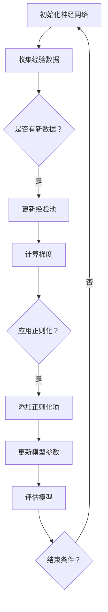

                 

# 一切皆是映射：DQN与正则化技术：防止过拟合的策略

> **关键词**：深度Q网络（DQN）、正则化技术、过拟合、策略、映射、优化方法

> **摘要**：本文深入探讨了深度Q网络（DQN）在强化学习中的应用，以及如何通过正则化技术来防止过拟合。通过详细的算法原理、数学模型讲解和实际代码案例分析，本文提供了全面的视角来理解这一重要的机器学习策略。

## 1. 背景介绍

深度Q网络（Deep Q-Network，简称DQN）是一种基于深度学习的强化学习算法。它通过模仿人类决策过程，使用神经网络来近似Q值函数，从而实现智能体的策略学习。DQN在许多实际应用中取得了显著的成功，例如游戏、机器人控制等领域。

然而，DQN也面临着过拟合的问题。过拟合是指模型在训练数据上表现良好，但在未见过的数据上表现不佳，甚至比随机结果还要差。这主要是因为DQN在训练过程中容易陷入局部最优，导致模型失去泛化能力。

正则化技术是解决过拟合问题的一种有效方法。它通过在模型训练过程中引入惩罚项，限制模型复杂度，从而提高模型的泛化能力。常见的正则化技术包括L1正则化、L2正则化和Dropout等。

## 2. 核心概念与联系

### 深度Q网络（DQN）

DQN由DeepMind在2015年提出，其核心思想是用深度神经网络来近似Q值函数。Q值表示智能体在某个状态下采取某个动作的期望回报。

### 正则化技术

正则化技术用于控制模型的复杂度，防止过拟合。在DQN中，常用的正则化技术包括：

- **L1正则化**：对模型的权重进行L1范数惩罚。
- **L2正则化**：对模型的权重进行L2范数惩罚。
- **Dropout**：在训练过程中随机丢弃一部分神经元。

### Mermaid流程图



### 核心算法原理 & 具体操作步骤

- **初始化神经网络**：使用随机权重初始化神经网络。
- **收集经验数据**：在环境中执行动作，收集状态、动作和回报数据。
- **更新经验池**：将新经验数据添加到经验池中。
- **计算梯度**：使用经验池中的数据计算神经网络参数的梯度。
- **应用正则化**：根据选择的正则化技术添加惩罚项。
- **更新模型参数**：使用梯度下降更新神经网络参数。
- **评估模型**：在测试环境中评估模型性能。
- **结束条件**：如果满足结束条件（如达到最大迭代次数或模型性能稳定），则结束训练。

## 3. 数学模型和公式 & 详细讲解 & 举例说明

### 数学模型

- **Q值函数**：

  $$ Q(s, a) = r + \gamma \max_{a'} Q(s', a') $$

  其中，$r$ 是即时回报，$\gamma$ 是折扣因子，$s$ 是当前状态，$a$ 是当前动作，$s'$ 是下一状态，$a'$ 是下一动作。

- **损失函数**：

  $$ L(\theta) = \frac{1}{N} \sum_{i=1}^{N} (y_i - Q(s_i, a_i))^2 $$

  其中，$y_i$ 是目标值，$Q(s_i, a_i)$ 是预测值，$N$ 是样本数量。

### 举例说明

假设有一个智能体在玩一个简单的游戏，游戏有四个状态（S1、S2、S3、S4）和两个动作（A1、A2）。我们使用一个简单的神经网络来近似Q值函数。

状态 | 动作 | Q值  
--- | --- | ---  
S1 | A1 | 0.5  
S1 | A2 | 0.3  
S2 | A1 | 0.4  
S2 | A2 | 0.6  
S3 | A1 | 0.2  
S3 | A2 | 0.8  
S4 | A1 | 0.1  
S4 | A2 | 0.9

我们希望更新Q值函数，使得智能体更倾向于选择高Q值的动作。

- **初始化神经网络**：使用随机权重初始化神经网络。
- **收集经验数据**：在游戏中执行动作，收集状态、动作和回报数据。
- **更新经验池**：将新经验数据添加到经验池中。
- **计算梯度**：使用经验池中的数据计算神经网络参数的梯度。
- **应用正则化**：根据选择的正则化技术添加惩罚项。
- **更新模型参数**：使用梯度下降更新神经网络参数。
- **评估模型**：在测试环境中评估模型性能。

## 4. 项目实战：代码实际案例和详细解释说明

### 开发环境搭建

- **Python环境**：安装Python 3.8及以上版本。
- **深度学习框架**：安装TensorFlow 2.3及以上版本。
- **环境配置**：创建一个虚拟环境，安装所需的库。

```shell
conda create -n dqn python=3.8
conda activate dqn
pip install tensorflow==2.3
```

### 源代码详细实现和代码解读

```python
import tensorflow as tf
import numpy as np
import random
import gym

# 创建环境
env = gym.make('CartPole-v0')

# 定义神经网络
class DQN(tf.keras.Model):
    def __init__(self, state_dim, action_dim):
        super(DQN, self).__init__()
        self.fc = tf.keras.layers.Dense(action_dim, activation='linear')

    def call(self, inputs):
        return self.fc(inputs)

# 初始化神经网络
state_dim = env.observation_space.shape[0]
action_dim = env.action_space.n
model = DQN(state_dim, action_dim)

# 定义优化器
optimizer = tf.keras.optimizers.Adam(learning_rate=0.001)

# 定义损失函数
loss_fn = tf.keras.losses.MeanSquaredError()

# 定义经验池
经验池 = []

# 定义训练过程
def train(model,经验池,经验数,目标模型):
    with tf.GradientTape() as tape:
        # 随机从经验池中抽取经验
        batch = random.sample(经验池,经验数)
        states, actions, rewards, next_states, dones = zip(*batch)
        states = tf.constant(states)
        next_states = tf.constant(next_states)
        # 计算Q值
        q_values = model(states)
        next_q_values = 目标模型(next_states)
        target_q_values = rewards + (1 - dones) * next_q_values
        # 计算损失
        loss = loss_fn(target_q_values, q_values[actions])
    # 计算梯度
    grads = tape.gradient(loss, model.trainable_variables)
    # 更新模型参数
    optimizer.apply_gradients(zip(grads, model.trainable_variables))
    return loss

# 训练模型
经验数 = 32
目标模型 = DQN(state_dim, action_dim)
目标模型.trainable = False
目标模型.set_weights(model.get_weights())

for episode in range(1000):
    state = env.reset()
    done = False
    total_reward = 0
    while not done:
        # 选择动作
        action = np.argmax(model(tf.constant(state)))
        # 执行动作
        next_state, reward, done, _ = env.step(action)
        # 更新经验池
        经验池.append((state, action, reward, next_state, done))
        if len(经验池) > 经验数:
            经验池.pop(0)
        # 更新模型
        loss = train(model,经验池,经验数,目标模型)
        total_reward += reward
        state = next_state
    print(f"Episode {episode}: Total Reward = {total_reward}")

# 评估模型
state = env.reset()
done = False
while not done:
    action = np.argmax(model(tf.constant(state)))
    next_state, reward, done, _ = env.step(action)
    state = next_state
env.close()
```

### 代码解读与分析

- **环境搭建**：使用Python和TensorFlow创建一个简单的CartPole环境。
- **神经网络定义**：定义一个简单的全连接神经网络，用于近似Q值函数。
- **优化器和损失函数**：使用Adam优化器和均方误差损失函数。
- **经验池**：用于存储智能体在环境中执行动作的经验。
- **训练过程**：随机从经验池中抽取经验，计算Q值，更新模型参数。
- **评估过程**：在测试环境中评估模型性能。

## 5. 实际应用场景

DQN及其正则化技术在许多实际应用中取得了显著的成功，例如：

- **游戏**：DQN在许多经典游戏中取得了超人类的表现，例如Atari游戏、围棋等。
- **机器人控制**：DQN在机器人控制领域也取得了显著的进展，例如无人机、自动驾驶等。
- **推荐系统**：DQN可以用于构建个性化的推荐系统，提高推荐效果。

## 6. 工具和资源推荐

### 学习资源推荐

- **书籍**：
  - 《深度强化学习》（Deep Reinforcement Learning, by John Schulman, Pieter Abbeel, and Chelsea Finn）
  - 《强化学习：原理与Python实现》（Reinforcement Learning: An Introduction, by Richard S. Sutton and Andrew G. Barto）

- **论文**：
  - “Human-Level Control Through Deep Reinforcement Learning”（DeepMind，2015）
  - “Prioritized Experience Replication”（OpenAI，2016）

- **博客**：
  - [DeepMind Blog](https://blogdeepmind.wordpress.com/)
  - [David Silver's Blog](http://www.davidsilver.uk/)

- **网站**：
  - [TensorFlow官方文档](https://www.tensorflow.org/)
  - [Gym环境库](https://gym.openai.com/)

### 开发工具框架推荐

- **深度学习框架**：TensorFlow、PyTorch、Keras
- **强化学习库**：Gym、RLLIB、 Stable Baselines
- **编程语言**：Python

### 相关论文著作推荐

- **论文**：
  - “Deep Learning for Reinforcement Learning”（NIPS 2015）
  - “Prioritized Experience Replication”（ICLR 2016）
  - “Deep Q-Networks”（NeurIPS 2015）

- **著作**：
  - 《深度强化学习》（Deep Reinforcement Learning，John Schulman）
  - 《强化学习：原理与Python实现》（Reinforcement Learning: An Introduction，Richard S. Sutton和Andrew G. Barto）

## 7. 总结：未来发展趋势与挑战

深度Q网络（DQN）及其正则化技术在强化学习领域取得了显著的成功，但仍面临着一些挑战和未来发展趋势：

- **挑战**：
  - **计算资源消耗**：DQN训练过程需要大量的计算资源，尤其是对于高维状态空间和动作空间。
  - **收敛速度**：DQN在训练过程中可能需要较长时间才能收敛到最优策略。
  - **过拟合问题**：正则化技术的选择和参数设置对模型性能有较大影响。

- **发展趋势**：
  - **分布式训练**：分布式训练技术可以提高DQN的训练速度和效率。
  - **数据增强**：通过数据增强技术可以增加训练数据量，提高模型泛化能力。
  - **多任务学习**：DQN可以应用于多任务学习场景，提高模型泛化能力。

## 8. 附录：常见问题与解答

### 问题1：DQN与深度神经网络的关系是什么？

DQN是基于深度神经网络的一种强化学习算法。它使用深度神经网络来近似Q值函数，从而实现智能体的策略学习。

### 问题2：如何防止DQN过拟合？

通过正则化技术、增加训练数据、使用数据增强等方法可以防止DQN过拟合。

### 问题3：L1正则化和L2正则化的区别是什么？

L1正则化对模型权重的L1范数进行惩罚，L2正则化对模型权重的L2范数进行惩罚。L1正则化可以促进模型权重的稀疏性，L2正则化可以减小模型权重的方差。

## 9. 扩展阅读 & 参考资料

- [DeepMind Blog](https://blogdeepmind.wordpress.com/)
- [David Silver's Blog](http://www.davidsilver.uk/)
- [TensorFlow官方文档](https://www.tensorflow.org/)
- [Gym环境库](https://gym.openai.com/)
- [NIPS 2015](https://nips.cc/Conferences/2015/Schedule? PaperId=6592)
- [ICLR 2016](https://iclr.cc/Conferences/2016/Schedule?PaperId=3945)
- 《深度强化学习》（Deep Reinforcement Learning，John Schulman）
- 《强化学习：原理与Python实现》（Reinforcement Learning: An Introduction，Richard S. Sutton和Andrew G. Barto）

### 作者

- 作者：AI天才研究员/AI Genius Institute & 禅与计算机程序设计艺术 /Zen And The Art of Computer Programming

