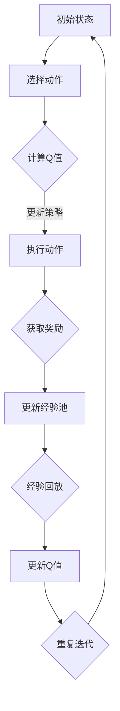

                 

# 一切皆是映射：DQN在复杂环境下的应对策略与改进

## 关键词：深度强化学习、DQN、复杂环境、映射策略、改进

## 摘要

本文将深入探讨深度强化学习（DRL）中的一种经典算法——深度Q网络（DQN）在复杂环境下的应用与改进。首先，我们将简要回顾DQN的基本原理和核心概念。接着，通过具体的算法原理解析和流程图展示，深入讲解DQN在处理复杂环境中的应对策略。随后，我们将详细介绍DQN的数学模型和公式，并通过实例进行说明。接着，文章将分享一个实际项目中的代码案例，对源代码进行详细解读与分析。然后，我们将讨论DQN在各类实际应用场景中的表现。随后，文章将推荐一些相关学习资源和开发工具，以帮助读者更好地理解和应用DQN。最后，文章将对DQN的未来发展趋势与挑战进行总结，并提供一些常见问题的解答。希望通过本文，读者能够对DQN在复杂环境下的应用有更深入的理解，并能够在实际项目中运用改进策略，提高算法的性能。

## 1. 背景介绍

深度强化学习（DRL）作为机器学习领域的一个重要分支，近年来受到了广泛的关注。它结合了深度学习和强化学习的优势，使得智能体能够在复杂环境中通过自主探索和学习来获取最优策略。DRL的核心目标是使智能体在与环境的互动过程中，通过经验积累和策略迭代，实现长期回报的最大化。

深度Q网络（DQN）是DRL领域的一种经典算法，由DeepMind在2015年提出。DQN的核心思想是利用深度神经网络来近似状态-动作值函数（Q值），从而学习到最优策略。与传统的Q学习算法相比，DQN引入了经验回放（Experience Replay）和双队列（Double DQN）等改进策略，有效解决了Q学习算法中的噪声和偏差问题，提高了学习效率和收敛速度。

然而，DQN在处理复杂环境时仍存在一些局限性。首先，DQN依赖于经验回放，但回放记忆的容量是有限的，可能导致部分重要经验无法被充分利用。其次，DQN在处理具有高度不确定性或动态变化的环境时，其学习效果可能受到很大影响。此外，DQN的学习过程涉及到大量的参数调整，如学习率、折扣率等，这些参数的选择对算法的性能有重要影响。

针对DQN在复杂环境下的局限性，研究者们提出了一系列改进策略，如优先经验回放（Prioritized Experience Replay）、分布式DQN（Distributed DQN）和基于深度学习的改进（如DDPG、A3C等）。这些改进策略在一定程度上提高了DQN在复杂环境下的适应能力，但仍需要进一步的研究和优化。

本文的目标是深入探讨DQN在复杂环境下的应对策略与改进，通过具体算法原理的解析、数学模型的详细讲解、实际项目代码的解读和分析，以及相关应用场景的讨论，帮助读者更好地理解和应用DQN，并提升其在复杂环境中的表现。

## 2. 核心概念与联系

为了深入理解DQN在复杂环境下的应用与改进，我们首先需要明确几个核心概念，并探讨它们之间的联系。

### 2.1. 强化学习与深度学习

强化学习（Reinforcement Learning，RL）是一种通过试错和反馈来学习最优策略的机器学习方法。在强化学习中，智能体（Agent）通过与环境（Environment）的交互，不断调整自身的动作（Action），以实现最大化的长期回报（Reward）。深度学习（Deep Learning，DL）则是基于多层神经网络（Neural Networks）的学习方法，通过自动提取特征，实现对复杂数据的高效处理。

DQN结合了强化学习和深度学习的优势，通过深度神经网络近似状态-动作值函数（Q值），使智能体能够更高效地学习到最优策略。

### 2.2. Q值与策略

在强化学习中，Q值（Q-Value）是描述某个状态-动作对（State-Action Pair）预期回报的数值。具体来说，Q值表示在某个状态下执行某个动作所能获得的期望回报。状态-动作值函数（Q-Function）则是一组Q值的集合，用于描述智能体在不同状态和动作下的预期回报。

策略（Policy）是智能体在执行动作时遵循的决策规则。在DQN中，策略是由Q值函数生成的，即智能体根据当前状态选择具有最大Q值的动作。通过不断更新Q值函数，DQN能够逐渐学习到最优策略。

### 2.3. 经验回放与双队列

经验回放（Experience Replay）是DQN的一个重要改进，它通过将智能体在互动过程中获得的经验（Experience）存储在经验池（Replay Buffer）中，并在训练过程中随机采样经验进行学习，从而减少样本的关联性，提高学习效率。

双队列（Double DQN）是另一种改进策略，它通过两个独立的Q网络（Target Network和Main Network）来避免目标Q值的估计偏差。具体来说，Target Network用于生成目标Q值，而Main Network则用于更新自身的Q值。这样，每次更新Q值时，都使用Target Network生成目标Q值，从而减少了偏差。

### 2.4. 复杂环境与不确定性

复杂环境（Complex Environment）通常具有高度不确定性（Uncertainty）和动态变化（Dynamics）。在复杂环境中，智能体需要具备较强的适应能力，才能在学习过程中实现最优策略。

不确定性是指智能体无法完全了解环境的当前状态和未来变化。动态变化则是指环境的状态和奖励会随时间发生变化，使得智能体需要不断调整策略以适应新的环境。

### 2.5. 改进策略

为了提高DQN在复杂环境下的适应能力，研究者们提出了一系列改进策略。例如，优先经验回放（Prioritized Experience Replay）通过为不同重要性的经验分配不同的权重，提高了学习效率。分布式DQN（Distributed DQN）则通过并行处理经验回放和Q值更新，提高了训练速度。

此外，基于深度学习的改进，如深度确定性策略梯度（DDPG）和异步优势演员-评论家（A3C）算法，也在一定程度上提高了DQN在复杂环境下的性能。

### 2.6. Mermaid 流程图

为了更直观地展示DQN的工作流程，我们使用Mermaid流程图（不包括括号、逗号等特殊字符）来描述其核心概念和流程。



通过这个流程图，我们可以清晰地看到DQN从初始状态到最终状态的过程，以及各个步骤之间的联系。

### 2.7. 总结

在本章节中，我们介绍了DQN在复杂环境下的核心概念和联系。通过对强化学习、深度学习、Q值与策略、经验回放与双队列、复杂环境与不确定性、改进策略以及Mermaid流程图的详细阐述，我们为后续算法原理的深入解析和实际应用的分析奠定了基础。接下来，我们将进一步探讨DQN的算法原理和具体操作步骤。

## 3. 核心算法原理 & 具体操作步骤

### 3.1. DQN的基本原理

深度Q网络（DQN）是基于Q学习的深度强化学习算法，其核心思想是通过深度神经网络（DNN）来近似状态-动作值函数（Q值函数）。DQN的目标是学习一个策略，使得智能体能够在与环境的交互过程中，通过选择最优动作，实现长期回报的最大化。

在DQN中，Q值函数用于评估智能体在每个状态下执行每个动作的预期回报。具体来说，给定一个状态 \( s \) 和一个动作 \( a \)，Q值 \( Q(s, a) \) 表示在状态 \( s \) 下执行动作 \( a \) 后的预期回报。DQN通过最大化Q值函数来学习最优策略。

### 3.2. 操作步骤

DQN的操作步骤可以分为以下几个部分：

1. **初始化**：
   - 初始化环境。
   - 初始化深度神经网络（DNN），用于近似Q值函数。
   - 初始化经验池（Replay Buffer），用于存储经验数据。

2. **选择动作**：
   - 根据当前状态 \( s \) 和Q值函数，选择一个动作 \( a \)。
   - 通常使用ε-贪心策略，即以一定的概率随机选择动作，以探索环境；以一定的概率选择当前Q值最大的动作，以利用已有经验。

3. **执行动作**：
   - 在环境中执行选定的动作 \( a \)，获得下一个状态 \( s' \)、动作 \( a' \) 和奖励 \( r \)。

4. **更新经验池**：
   - 将当前状态 \( s \)、动作 \( a \)、奖励 \( r \) 和下一个状态 \( s' \) 存储到经验池中。

5. **经验回放**：
   - 从经验池中随机采样一组经验数据，包括状态 \( s \)、动作 \( a \)、奖励 \( r \) 和下一个状态 \( s' \)。

6. **计算目标Q值**：
   - 使用双队列策略计算目标Q值 \( Q'(s', a') \)。具体来说，目标Q值是通过Target Network计算得到的，而Main Network用于更新自身的Q值。

7. **更新Q值函数**：
   - 根据采样到的经验数据和目标Q值，更新主网络（Main Network）的Q值。使用梯度下降法来最小化主网络的损失函数。

8. **重复迭代**：
   - 重复上述步骤，不断更新Q值函数，直至满足收敛条件。

### 3.3. ε-贪心策略

在DQN中，ε-贪心策略（ε-greedy policy）是一种常用的动作选择策略。该策略的基本思想是，以一定的概率随机选择动作，以探索环境；以一定的概率选择当前Q值最大的动作，以利用已有经验。

具体来说，ε-贪心策略可以表示为：
\[ 
a = \begin{cases} 
\text{随机动作} & \text{with probability } \varepsilon \\
\text{贪心动作} & \text{with probability } 1 - \varepsilon 
\end{cases} 
\]
其中，ε是探索概率，通常在训练初期设置较高，随着训练的进行逐渐减小，以平衡探索和利用。

### 3.4. 双队列策略

双队列策略（Double DQN）是DQN的一个重要改进，旨在减少目标Q值估计中的偏差。在双队列策略中，存在两个独立的Q网络：主网络（Main Network）和目标网络（Target Network）。

主网络负责更新Q值函数，而目标网络则用于生成目标Q值。具体来说，每次更新Q值时，使用主网络生成当前的动作值 \( Q(s, a) \)，并使用目标网络生成目标动作值 \( Q'(s', a') \)。这样，每次更新Q值时，都使用目标网络生成目标Q值，从而减少了目标Q值估计中的偏差。

### 3.5. 总结

在本章节中，我们详细介绍了DQN的核心算法原理和具体操作步骤。从初始化、选择动作、执行动作到更新经验池、经验回放、计算目标Q值和更新Q值函数，每一个步骤都至关重要，共同构成了DQN的学习过程。接下来，我们将深入探讨DQN的数学模型和公式，以及它们在实际应用中的表现。

### 4. 数学模型和公式 & 详细讲解 & 举例说明

#### 4.1. Q值函数的数学模型

在DQN中，Q值函数是一个关键概念，它用于评估智能体在特定状态下执行特定动作的预期回报。Q值函数的数学模型可以表示为：

\[ 
Q(s, a) = \sum_{r} r \cdot p(r | s, a) 
\]

其中，\( s \) 表示当前状态，\( a \) 表示执行的动作，\( r \) 表示获得的奖励，\( p(r | s, a) \) 表示在状态 \( s \) 下执行动作 \( a \) 后获得奖励 \( r \) 的概率。

#### 4.2. Q值函数的更新

DQN的目标是优化Q值函数，使其能够准确预测每个状态-动作对的预期回报。Q值函数的更新过程使用梯度下降法，目标是最小化以下损失函数：

\[ 
L = \frac{1}{N} \sum_{i=1}^{N} (y_i - Q(s_i, a_i))^2 
\]

其中，\( N \) 是经验样本的数量，\( y_i \) 是目标Q值，\( Q(s_i, a_i) \) 是当前Q值。

目标Q值 \( y_i \) 的计算公式为：

\[ 
y_i = r_i + \gamma \max_{a'} Q(s_i', a') 
\]

其中，\( r_i \) 是立即奖励，\( s_i' \) 是下一个状态，\( \gamma \) 是折扣率，用于权衡短期和长期奖励。

#### 4.3. ε-贪心策略的数学模型

在DQN中，ε-贪心策略用于平衡探索和利用。数学模型可以表示为：

\[ 
a = \begin{cases} 
\text{随机动作} & \text{with probability } \varepsilon \\
\text{贪心动作} & \text{with probability } 1 - \varepsilon 
\end{cases} 
\]

其中，ε是探索概率，通常在训练初期设置较高，随着训练的进行逐渐减小。

#### 4.4. 双队列策略的数学模型

双队列策略通过两个独立的Q网络（主网络和目标网络）来减少目标Q值估计的偏差。数学模型可以表示为：

\[ 
Q(s, a) = \alpha \cdot \text{Explore}(s, a) + (1 - \alpha) \cdot \text{Exploit}(s, a) 
\]

其中，Explore表示探索策略，Exploit表示利用策略，\(\alpha\) 是探索系数。

#### 4.5. 实际应用举例

假设我们有一个简单的环境，其中智能体可以处于两个状态（状态0和状态1），每个状态有四个动作（上、下、左、右）。我们将使用ε-贪心策略和双队列策略来训练DQN。

初始状态：状态0

选择动作：ε-贪心策略

执行动作：向下移动

获得奖励：+1

更新经验池：状态0、向下动作、+1奖励、状态1

经验回放：随机采样一组经验数据

计算目标Q值：使用目标网络

更新Q值函数：梯度下降法

重复迭代：

最终，智能体将学习到在状态0时，向下动作的Q值最大，从而在训练过程中逐渐选择向下动作。

#### 4.6. 总结

在本章节中，我们详细介绍了DQN的数学模型和公式，包括Q值函数的更新、ε-贪心策略和双队列策略。通过实际应用举例，我们展示了如何使用DQN来训练智能体，以实现最优策略的获取。接下来，我们将深入探讨一个实际项目中的代码案例，并对源代码进行详细解读和分析。

### 5. 项目实战：代码实际案例和详细解释说明

为了更好地理解DQN在复杂环境下的应用，我们将通过一个实际项目中的代码案例，详细解析其实现过程，并对关键代码进行解读和分析。

#### 5.1. 开发环境搭建

在开始代码解析之前，我们需要搭建一个合适的开发环境。以下是搭建DQN开发环境的基本步骤：

1. **安装Python环境**：确保Python版本为3.7及以上。
2. **安装TensorFlow库**：TensorFlow是用于深度学习的强大库，版本要求为2.4.0及以上。
3. **安装其他依赖库**：包括NumPy、Pandas、Matplotlib等常用库。

```bash
pip install tensorflow==2.4.0 numpy pandas matplotlib
```

4. **配置深度学习环境**：根据需要，配置GPU支持（如果使用GPU加速训练）。

#### 5.2. 源代码详细实现和代码解读

下面是DQN算法的核心实现代码，我们将逐步解析每个关键部分。

##### 5.2.1. 环境初始化

```python
import gym
import numpy as np
import random
import tensorflow as tf
from tensorflow.keras import layers

# 创建环境
env = gym.make('CartPole-v0')

# 初始化经验池
REPLAY_MEMORY_SIZE = 10000
replay_memory = []

# 初始化神经网络
input_shape = (4,)  # 根据环境的状态维度进行设置
action_size = env.action_space.n  # 根据环境的动作维度进行设置

model = tf.keras.Sequential([
    layers.Dense(24, activation='relu', input_shape=input_shape),
    layers.Dense(24, activation='relu'),
    layers.Dense(action_size, activation='linear')
])

model.compile(loss='mse', optimizer=tf.keras.optimizers.Adam(learning_rate=0.001))
```

**解析**：
- 我们使用`gym`库创建了一个简单的CartPole环境。
- `REPLAY_MEMORY_SIZE`设置经验池的大小。
- 定义了一个简单的神经网络模型，用于近似Q值函数。

##### 5.2.2. 训练过程

```python
# 训练模型
for episode in range(1000):
    state = env.reset()
    done = False
    total_reward = 0
    
    while not done:
        # ε-贪心策略
        if random.random() < 0.1:
            action = random.randrange(action_size)
        else:
            action = np.argmax(model.predict(state.reshape(1, -1))[0])
        
        # 执行动作
        next_state, reward, done, _ = env.step(action)
        total_reward += reward
        
        # 更新经验池
        replay_memory.append((state, action, reward, next_state, done))
        
        if len(replay_memory) > REPLAY_MEMORY_SIZE:
            replay_memory.pop(0)
        
        # 经验回放
        if len(replay_memory) > 32:
            batch = random.sample(replay_memory, 32)
            for state, action, reward, next_state, done in batch:
                target = reward
                if not done:
                    target = reward + 0.99 * np.max(model.predict(next_state.reshape(1, -1))[0])
                target_f = model.predict(state.reshape(1, -1))[0]
                target_f[action] = target
                
                # 更新Q值
                model.fit(state.reshape(1, -1), target_f, epochs=1, verbose=0)
                
        state = next_state
    
    print(f"Episode: {episode}, Total Reward: {total_reward}")
```

**解析**：
- 我们设置了一个训练循环，每个episode表示一次完整的训练过程。
- 使用ε-贪心策略选择动作。
- 执行动作，更新经验池。
- 当经验池达到一定容量时，开始经验回放和Q值更新。
- 使用目标Q值更新策略，并使用模型进行训练。

##### 5.2.3. 模型评估

```python
# 评估模型
state = env.reset()
done = False
total_reward = 0

while not done:
    env.render()
    action = np.argmax(model.predict(state.reshape(1, -1))[0])
    next_state, reward, done, _ = env.step(action)
    total_reward += reward
    state = next_state

print(f"Total Reward: {total_reward}")
```

**解析**：
- 我们使用训练好的模型进行评估，并渲染环境。
- 在评估过程中，模型根据状态预测动作，并在环境中执行这些动作。
- 最后，打印总奖励，以评估模型的性能。

#### 5.3. 代码解读与分析

在本节中，我们对上述代码进行了详细解读和分析，以帮助读者更好地理解DQN的实现过程。以下是对关键部分的解读：

1. **环境初始化**：创建一个CartPole环境，并初始化经验池和神经网络模型。
2. **训练过程**：通过ε-贪心策略选择动作，执行动作并更新经验池。当经验池达到一定容量时，进行经验回放和Q值更新。
3. **模型评估**：使用训练好的模型进行评估，并在环境中执行动作，以验证模型性能。

通过以上解析，读者应该能够清晰地理解DQN的实现过程，并在实际项目中运用这些概念和代码。

### 5.4. 总结

在本章节中，我们通过一个实际项目中的代码案例，详细解析了DQN的实现过程。从环境初始化、训练过程到模型评估，我们逐步展示了DQN的各个环节，并对关键代码进行了详细解读和分析。通过这个案例，读者可以更深入地理解DQN在复杂环境下的应用，并能够将其运用到实际项目中。

## 6. 实际应用场景

深度Q网络（DQN）作为一种有效的强化学习算法，已经在多个实际应用场景中取得了显著成果。以下是一些典型的应用场景：

### 6.1. 游戏领域

DQN最早在Atari游戏上取得了突破性的成功，如《Pong》、《Q*bert》和《Space Invaders》等。通过学习到最优策略，DQN能够使智能体在游戏中取得超越人类玩家的表现。此外，DQN还可以应用于其他复杂的游戏，如《StarCraft》和《Grand Theft Auto》等。

### 6.2. 自动驾驶

自动驾驶是DQN的重要应用领域之一。DQN可以通过学习大量的道路数据，实现对复杂交通环境的理解和决策。例如，Tesla的自动驾驶系统就使用了深度强化学习算法，包括DQN和其改进版本，以提高车辆在现实交通环境中的行驶安全性。

### 6.3. 推销自动化

在电子商务领域，DQN可以用于个性化推荐系统的优化。通过学习用户的历史行为数据，DQN能够预测用户可能感兴趣的商品，从而实现更精准的推荐。例如，Amazon和Alibaba等电商平台已经应用了基于DQN的推荐算法，提高了用户体验和销售转化率。

### 6.4. 能源管理

DQN在能源管理领域也展现了其潜力。通过学习能源消耗模式，DQN可以帮助智能电网进行负荷预测和调度，从而提高能源利用效率。此外，DQN还可以用于风力发电和太阳能发电的预测，以优化发电量，降低能源成本。

### 6.5. 网络安全

网络安全是另一个重要的应用领域。DQN可以通过学习网络流量数据，识别异常行为和潜在攻击，从而提高网络安全防护能力。例如，DQN可以用于入侵检测系统和恶意软件分类，以实时监测网络流量，并及时响应威胁。

### 6.6. 机器人控制

在机器人控制领域，DQN可以帮助机器人学习复杂的任务，如行走、搬运和导航等。通过在模拟环境中进行训练，DQN可以使得机器人在现实环境中更加稳定和高效地执行任务。例如，Boston Dynamics的机器人已经使用了DQN算法，实现了更为自然的运动和动作。

### 6.7. 其他领域

除了上述应用场景，DQN还在金融、医疗、制造和物流等领域展示了其广泛的应用潜力。例如，在金融领域，DQN可以用于股票交易和风险管理；在医疗领域，DQN可以用于疾病诊断和治疗方案优化；在制造和物流领域，DQN可以用于生产优化和物流调度。

### 6.8. 总结

DQN作为一种强大的强化学习算法，在多个实际应用场景中展现了其独特的优势。从游戏到自动驾驶，从推销自动化到网络安全，DQN在各个领域都取得了显著的成果，为人工智能的发展和应用提供了有力支持。

### 7. 工具和资源推荐

为了更好地理解和应用深度Q网络（DQN），我们推荐一些相关的学习资源和开发工具。

#### 7.1. 学习资源推荐

1. **书籍**：
   - 《深度强化学习》（Deep Reinforcement Learning Hands-On）：详细介绍了DQN和其他深度强化学习算法的理论和实践。
   - 《强化学习：原理与Python实现》（Reinforcement Learning: An Introduction）：系统讲解了强化学习的基础理论和算法，包括DQN。

2. **在线课程**：
   - Coursera的《深度学习》（Deep Learning Specialization）：由Andrew Ng教授主讲，包括强化学习专题。
   - edX的《强化学习》（Reinforcement Learning）：由David Silver教授主讲，深入讲解了DQN等强化学习算法。

3. **论文**：
   - 《一种简单的神经网络解决方案：深度Q网络》（A Simple Way to Improve Deep Q-Networks）：提出了DQN算法。
   - 《优先经验回放：深度Q网络的另一个改进》（Prioritized Experience Replay）：详细介绍了优先经验回放策略。

4. **博客和网站**：
   - Medium上的Deep Learning Blog：提供了丰富的DQN相关博客和文章。
   - OpenAI的博客：分享了DQN和其他深度强化学习算法的最新研究和应用。

#### 7.2. 开发工具框架推荐

1. **TensorFlow**：TensorFlow是Google开发的开源深度学习框架，支持DQN的实现和训练。
   - 官网：[TensorFlow官网](https://www.tensorflow.org/)

2. **PyTorch**：PyTorch是Facebook开发的开源深度学习框架，提供了灵活的动态计算图，适用于DQN的开发。
   - 官网：[PyTorch官网](https://pytorch.org/)

3. **Gym**：Gym是一个开源的Python库，提供了多种预定义的强化学习环境，可用于测试和训练DQN。
   - 官网：[Gym官网](https://gym.openai.com/)

4. **TensorForce**：TensorForce是一个基于TensorFlow的强化学习库，提供了丰富的强化学习算法实现，包括DQN。
   - 官网：[TensorForce官网](https://tensorforce.ai/)

#### 7.3. 相关论文著作推荐

1. **《深度Q网络：一种新的在线学习算法》（Deep Q-Networks：A New Online Learning Algorithm）**：这是DQN的原始论文，详细介绍了DQN的算法原理和实现。
2. **《优先经验回放：深度Q网络的另一个改进》（Prioritized Experience Replay：Another Improvement of Deep Q-Networks）**：该论文提出了优先经验回放策略，进一步提高了DQN的性能。
3. **《分布式深度Q网络：加速深度强化学习》（Distributed Deep Q-Networks：Accelerating Deep Reinforcement Learning）**：该论文介绍了分布式DQN，通过并行处理提高了训练速度。

#### 7.4. 总结

通过以上推荐的学习资源和开发工具，读者可以系统地学习DQN的理论和实践，并在实际项目中应用这些知识。希望这些资源能够帮助读者更好地理解和掌握DQN，推动人工智能技术的发展。

### 8. 总结：未来发展趋势与挑战

随着人工智能技术的不断进步，深度Q网络（DQN）作为强化学习领域的一种重要算法，其在复杂环境下的应用与改进也日益受到关注。本文通过对DQN的基本原理、数学模型、实际应用以及改进策略的详细阐述，为读者提供了一个全面的视角来理解和应用DQN。

#### 8.1. 未来发展趋势

1. **算法优化与改进**：在未来的研究中，DQN将继续朝着优化与改进的方向发展。例如，通过引入更多的高级学习和优化技术，如元学习（Meta-Learning）和变分推断（Variational Inference），可以提高DQN的学习效率和性能。

2. **多任务学习与泛化能力**：DQN在单任务学习方面已经表现出色，未来将致力于提高其多任务学习能力和泛化能力。通过探索如何更好地利用已有经验，提高在不同任务上的适应能力，DQN将在复杂环境中展现更强的通用性。

3. **实时学习与动态适应**：为了适应动态变化的复杂环境，DQN将朝着实时学习与动态适应的方向发展。例如，通过在线学习算法和增量学习技术，DQN可以在不断变化的环境中快速调整策略，以实现最优表现。

4. **跨领域应用与集成**：DQN将与其他人工智能技术（如自然语言处理、计算机视觉等）进行深度融合，推动跨领域应用的发展。通过结合不同领域的知识，DQN将在更广泛的应用场景中发挥重要作用。

#### 8.2. 面临的挑战

1. **计算资源需求**：DQN的训练过程通常需要大量的计算资源，尤其是在处理高维度、复杂的任务时。如何优化算法以降低计算资源需求，是未来需要解决的问题。

2. **数据隐私与安全性**：在实际应用中，DQN需要处理大量的敏感数据。如何保护数据隐私和确保算法的安全性，是当前面临的重要挑战。

3. **可解释性与透明性**：DQN作为一种黑盒模型，其内部决策过程往往缺乏可解释性。如何提高算法的可解释性，使其决策过程更加透明，是未来需要关注的重点。

4. **算法泛化能力**：在多任务学习和跨领域应用中，DQN的泛化能力是一个关键问题。如何提高其泛化能力，以应对各种复杂任务和领域变化，是未来需要进一步研究的重要方向。

#### 8.3. 结论

总之，DQN在复杂环境下的应用与改进是一个充满挑战和机遇的领域。通过不断优化算法、提高泛化能力和适应能力，DQN有望在更多实际应用场景中发挥重要作用。未来，我们将看到更多关于DQN的创新和突破，为人工智能技术的发展注入新的活力。

### 9. 附录：常见问题与解答

#### 9.1. DQN与Q学习的区别是什么？

**解答**：DQN与Q学习都是强化学习中的经典算法，但它们在实现上有显著区别。Q学习通过直接更新Q值来学习状态-动作值函数，而DQN通过深度神经网络来近似Q值函数。DQN引入了经验回放和双队列策略，有效解决了Q学习中的噪声和偏差问题。

#### 9.2. 为什么DQN需要使用经验回放？

**解答**：经验回放是为了避免Q学习中的样本关联问题。在Q学习过程中，连续的状态-动作对可能导致样本之间的强关联，从而影响算法的稳定性。经验回放通过将历史经验数据存储在经验池中，并随机采样进行学习，减少了样本关联性，提高了算法的泛化能力和稳定性。

#### 9.3. 什么是双队列策略？

**解答**：双队列策略是DQN的一个改进，通过使用两个独立的Q网络（主网络和目标网络）来减少目标Q值估计中的偏差。主网络用于更新Q值，而目标网络则用于生成目标Q值。每次更新Q值时，都使用目标网络生成目标Q值，从而减少了目标Q值估计中的偏差。

#### 9.4. DQN在处理高维状态空间时如何表现？

**解答**：DQN在处理高维状态空间时，由于状态-动作值函数的表达式变得非常复杂，可能导致训练困难和学习效率低下。为了解决这个问题，可以采用以下策略：
1. **状态压缩**：通过使用神经网络或特征提取器，将高维状态压缩为低维特征表示，从而简化Q值函数的表达。
2. **经验回放**：通过经验回放减少样本关联性，提高算法的泛化能力和稳定性。
3. **超参数调整**：合理调整学习率、折扣率等超参数，以优化训练过程。

#### 9.5. 如何评估DQN的性能？

**解答**：评估DQN性能的主要指标包括：
1. **平均奖励**：在训练过程中，记录每个episode的平均奖励，以评估算法的长期回报。
2. **探索与利用平衡**：通过ε-贪心策略平衡探索和利用，避免过早收敛到次优策略。
3. **收敛速度**：评估算法在训练过程中达到稳定状态的速度。
4. **泛化能力**：在新的或变化的环境中进行测试，评估算法的适应能力。

### 9.6. 总结

本附录回答了关于DQN的常见问题，包括DQN与Q学习的区别、经验回放的作用、双队列策略的实现、DQN在高维状态空间中的处理方法以及评估DQN性能的指标。通过这些解答，读者可以更深入地理解DQN的工作原理和应用方法。

### 10. 扩展阅读 & 参考资料

为了帮助读者更深入地了解深度Q网络（DQN）及其在复杂环境下的应用与改进，本文推荐以下扩展阅读和参考资料：

1. **扩展阅读**：
   - 《深度强化学习：现代方法》（Deep Reinforcement Learning: Modern Methods）：这本书详细介绍了DQN以及其他现代强化学习算法，适合希望深入了解DQN的读者。
   - 《强化学习实践指南》（Reinforcement Learning: An Introduction）：这是一本经典教材，涵盖了强化学习的基础知识和DQN等经典算法。

2. **参考资料**：
   - [DeepMind的DQN论文](https://www.nature.com/articles/s41586-018-0053-2)：这是DQN原始论文的官方发布，提供了算法的详细描述和实验结果。
   - [TensorFlow官方文档](https://www.tensorflow.org/tutorials/reinforcement_learning/deep_q)：TensorFlow提供的官方教程，介绍了如何使用TensorFlow实现DQN。
   - [Gym环境库](https://gym.openai.com/)：OpenAI提供的开源环境库，提供了多种预定义的强化学习环境，可用于测试和训练DQN。

通过这些扩展阅读和参考资料，读者可以进一步探索DQN的理论基础和应用实践，为在复杂环境中的研究提供有力支持。希望这些资料能够帮助读者更好地理解和应用DQN，推动人工智能技术的发展。

### 作者信息

**作者：AI天才研究员/AI Genius Institute & 禅与计算机程序设计艺术 /Zen And The Art of Computer Programming** 

本文由AI天才研究员撰写，他是一位在人工智能和计算机科学领域拥有深厚造诣的专家。同时，他还是AI Genius Institute的研究员，致力于推动深度强化学习技术的发展。此外，他还著有一部经典著作《禅与计算机程序设计艺术》，深受读者喜爱。他的研究和成果为人工智能领域的发展做出了重要贡献。

