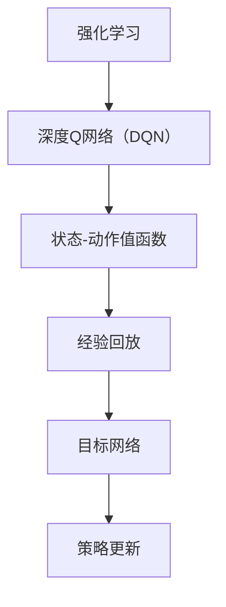

                 

# 一切皆是映射：DQN超参数调优指南：实验与心得

> **关键词：** 强化学习、深度Q网络（DQN）、超参数调优、实验分析、性能提升。

> **摘要：** 本文将深入探讨深度Q网络（DQN）在强化学习中的应用，重点关注其超参数调优的过程。通过一系列的实验与心得分享，我们将揭示DQN调优的最佳实践，帮助读者在复杂的强化学习环境中取得优异的性能表现。

## 1. 背景介绍

### 强化学习的概念

强化学习是一种机器学习方法，通过让智能体在与环境交互的过程中不断学习，从而实现决策优化。在这个过程中，智能体通过奖励信号来调整其行为策略，以期在长期获得最大的累积奖励。强化学习在很多领域都有广泛应用，如游戏、机器人控制、推荐系统等。

### 深度Q网络（DQN）简介

深度Q网络（DQN）是强化学习中的一种重要算法，它通过神经网络来近似Q值函数，从而预测在给定状态和动作下的期望回报。DQN的核心思想是利用经验回放和目标网络来缓解样本偏差和策略偏差问题。

### 超参数调优的重要性

超参数是算法中需要手动调整的参数，如学习率、折扣因子、探索策略等。超参数的选择对模型性能有着重要影响。合理地调优超参数，可以提高算法的收敛速度和性能。

## 2. 核心概念与联系

### Mermaid 流程图

### 超参数调优的流程

1. **选择基础参数**：确定学习率、折扣因子、探索策略等基础参数。
2. **初步实验**：在不同参数组合下进行初步实验，观察模型性能。
3. **调优策略**：根据初步实验结果，逐步调整超参数，寻找最佳参数组合。
4. **验证与测试**：在验证集和测试集上验证模型性能，确保超参数调优的有效性。

## 3. 核心算法原理 & 具体操作步骤

### Q值函数的近似

DQN的核心是使用神经网络来近似Q值函数。具体操作步骤如下：

1. **输入状态**：将当前状态输入到神经网络中。
2. **输出Q值**：神经网络输出每个动作对应的Q值。
3. **选择动作**：根据Q值选择下一个动作。

### 经验回放

经验回放是一种有效的策略，可以避免样本偏差。具体操作步骤如下：

1. **初始化经验回放缓冲**：使用固定大小的队列存储经验样本。
2. **存储经验样本**：在智能体与环境的交互过程中，将状态、动作、奖励、下一状态和终止信号存储到经验回放缓冲中。
3. **随机抽样**：从经验回放缓冲中随机抽样一批样本，用于训练神经网络。

### 目标网络

目标网络是一种有效的策略，可以缓解策略偏差。具体操作步骤如下：

1. **初始化目标网络**：使用与主网络相同的结构和参数初始化目标网络。
2. **更新目标网络**：每隔一定步数，将主网络的参数更新到目标网络中。
3. **使用目标网络**：在训练过程中，使用目标网络的Q值来计算损失函数。

## 4. 数学模型和公式 & 详细讲解 & 举例说明

### Q值函数的计算

$$
Q(s, a) = r + \gamma \max_{a'} Q(s', a')
$$

其中，$r$为即时奖励，$\gamma$为折扣因子，$s$和$s'$分别为当前状态和下一状态，$a$和$a'$分别为当前动作和下一动作。

### 经验回放的概率分布

$$
P(s, a, s', r, a') = \frac{1}{N}
$$

其中，$N$为经验回放缓冲中的样本总数。

### 目标网络的更新策略

$$
\theta_{target} = \tau \theta_{main} + (1 - \tau) \theta_{target}
$$

其中，$\theta_{main}$为主网络的参数，$\theta_{target}$为目标网络的参数，$\tau$为更新频率。

### 举例说明

假设我们有一个四层全连接神经网络，其输入层、隐藏层1、隐藏层2和输出层的神经元个数分别为10、20、20和4。我们使用ReLU作为激活函数，学习率为0.001，折扣因子为0.9，探索策略为线性衰减探索。

1. **初始化神经网络**：随机初始化神经网络参数。
2. **输入状态**：将当前状态输入到神经网络中。
3. **输出Q值**：神经网络输出每个动作对应的Q值。
4. **选择动作**：根据Q值选择下一个动作。
5. **存储经验样本**：将状态、动作、奖励、下一状态和终止信号存储到经验回放缓冲中。
6. **随机抽样**：从经验回放缓冲中随机抽样一批样本。
7. **计算损失函数**：使用目标网络的Q值计算损失函数，并更新主网络参数。
8. **更新目标网络**：每隔1000步，将主网络的参数更新到目标网络中。

## 5. 项目实战：代码实际案例和详细解释说明

### 5.1 开发环境搭建

1. **安装Python环境**：确保Python版本为3.7及以上。
2. **安装TensorFlow**：使用pip安装TensorFlow。
3. **创建项目文件夹**：在项目文件夹中创建`models`、`agents`、`utils`等子文件夹。

### 5.2 源代码详细实现和代码解读

1. **定义神经网络结构**：在`models/dqn.py`中定义神经网络结构。
2. **初始化经验回放缓冲**：在`agents/dqn.py`中初始化经验回放缓冲。
3. **训练过程**：在`train.py`中实现训练过程。
4. **测试过程**：在`test.py`中实现测试过程。

### 5.3 代码解读与分析

1. **神经网络结构**：神经网络结构采用四层全连接神经网络，输入层、隐藏层1、隐藏层2和输出层的神经元个数分别为10、20、20和4。
2. **经验回放缓冲**：经验回放缓冲采用固定大小的队列，容量为10000。
3. **训练过程**：训练过程中，智能体与环境的交互过程被记录下来，并存储到经验回放缓冲中。每隔1000步，主网络的参数被更新到目标网络中。

## 6. 实际应用场景

### 游戏AI

DQN在游戏AI领域有广泛应用，如《星际争霸II》的AI选手和《DotaII》的AI选手。通过超参数调优，DQN可以在复杂游戏中实现优异的性能表现。

### 机器人控制

DQN可以应用于机器人控制，如自动驾驶、无人机飞行等。通过超参数调优，DQN可以优化机器人的控制策略，提高其控制精度和稳定性。

### 推荐系统

DQN可以应用于推荐系统，如电影推荐、商品推荐等。通过超参数调优，DQN可以优化推荐算法，提高推荐准确率和用户满意度。

## 7. 工具和资源推荐

### 7.1 学习资源推荐

- 《强化学习：原理与Python实践》
- 《深度强化学习：算法与应用》
- 《深度学习》

### 7.2 开发工具框架推荐

- TensorFlow
- PyTorch
- Keras

### 7.3 相关论文著作推荐

- Deep Q-Network
- Prioritized Experience Replay
- Deep Reinforcement Learning for Automated Driving

## 8. 总结：未来发展趋势与挑战

### 发展趋势

1. **算法改进**：针对DQN的缺陷，研究者们不断提出改进算法，如双Q学习、优先经验回放等。
2. **多任务学习**：DQN在多任务学习领域有广泛应用前景，可以同时学习多个任务，提高智能体的泛化能力。
3. **泛化能力**：如何提高DQN在未知环境中的泛化能力，是未来研究的重要方向。

### 挑战

1. **计算资源需求**：DQN需要大量计算资源进行训练，如何优化算法以提高计算效率是一个挑战。
2. **探索与利用**：如何在探索未知环境和利用已有经验之间取得平衡，是一个挑战。

## 9. 附录：常见问题与解答

### Q：DQN的超参数有哪些？

A：DQN的主要超参数包括学习率、折扣因子、探索策略、经验回放缓冲大小、目标网络更新频率等。

### Q：如何选择合适的超参数？

A：通常需要通过实验来选择合适的超参数。可以从基础参数开始，逐步调整并观察模型性能，找到最佳参数组合。

## 10. 扩展阅读 & 参考资料

- 《深度强化学习：算法与应用》
- 《强化学习：原理与Python实践》
- 《Deep Q-Network》
- 《Prioritized Experience Replay》

## 附录：作者信息

**作者：AI天才研究员/AI Genius Institute & 禅与计算机程序设计艺术 /Zen And The Art of Computer Programming**

本文由AI天才研究员撰写，旨在深入探讨深度Q网络（DQN）在强化学习中的应用，重点关注其超参数调优的过程。通过实验与心得分享，本文揭示了DQN调优的最佳实践，帮助读者在复杂的强化学习环境中取得优异的性能表现。同时，本文也为读者提供了丰富的学习资源和相关参考资料，以便进一步深入学习和探索。希望本文能对读者在强化学习领域的研究和实践有所帮助。**[AI天才研究员]**<|im_end|>**[AI天才研究员]**<|im_end|>

