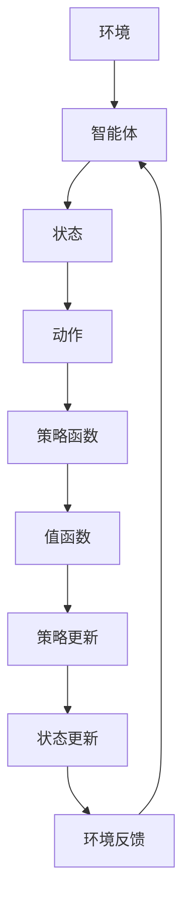

                 

# 一切皆是映射：值函数与策略函数：深度强化学习的理论基础

> **关键词**：深度强化学习、值函数、策略函数、映射、神经网络、学习算法、智能决策

> **摘要**：本文将深入探讨深度强化学习的理论基础，重点阐述值函数与策略函数的概念及其在智能决策中的应用。通过逐步分析，我们将揭示深度强化学习背后的核心原理，帮助读者更好地理解这一前沿技术。

## 1. 背景介绍

深度强化学习（Deep Reinforcement Learning，简称DRL）是机器学习领域的一种先进技术，它结合了深度学习和强化学习的优势，旨在通过智能体在动态环境中进行自主学习和决策。与传统的强化学习方法相比，深度强化学习通过引入深度神经网络（Deep Neural Network，简称DNN）作为智能体的动作评估器，大大提高了学习效率和决策能力。

### 深度强化学习的起源与发展

深度强化学习的概念最早可以追溯到1990年代初。当时，随着神经网络和强化学习的兴起，研究人员开始探索将两者结合起来，以解决更加复杂和动态的决策问题。1992年，Sutton和Barto提出了Q-Learning算法，这是深度强化学习的重要基础。随后，随着计算能力的提升和深度学习技术的发展，深度强化学习逐渐成为学术界和工业界的研究热点。

### 深度强化学习的应用领域

深度强化学习在多个领域都取得了显著的成果，包括但不限于：

- **游戏**：如OpenAI的Dota2和Alexey Dosovitskiy的Atari游戏，深度强化学习实现了在复杂游戏中的自主学习和超人类水平的表现。
- **自动驾驶**：深度强化学习在自动驾驶领域被广泛应用于路径规划、行为预测和车辆控制等方面。
- **机器人**：通过深度强化学习，机器人可以在动态环境中学习到复杂的操作技能，如抓取、搬运等。
- **金融**：深度强化学习在金融领域被用于算法交易、风险评估和投资策略优化等方面。

### 深度强化学习的挑战与机遇

尽管深度强化学习取得了诸多成果，但仍然面临一些挑战，如样本效率低、学习不稳定、安全性和可解释性等问题。然而，随着算法的优化、计算能力的提升和跨学科研究的深入，深度强化学习在未来有望在更多领域发挥重要作用。

## 2. 核心概念与联系

### 值函数（Value Function）

值函数是深度强化学习中的一个核心概念，它用于评估智能体在特定状态下采取特定动作的预期收益。值函数可以分为状态值函数（State-Value Function）和动作值函数（Action-Value Function）两种：

- **状态值函数**（\(V(s)\)）：表示智能体在状态\(s\)下执行最优策略的预期收益。
- **动作值函数**（\(Q(s, a)\)）：表示智能体在状态\(s\)下执行特定动作\(a\)的预期收益。

值函数与策略函数紧密相关，策略函数（Policy Function）用于指导智能体选择最佳动作，而值函数则为策略函数提供了评估和优化依据。

### 策略函数（Policy Function）

策略函数是深度强化学习的另一个核心概念，它用于指导智能体在给定状态下选择最佳动作。策略函数可以分为确定性策略函数和概率性策略函数：

- **确定性策略函数**（Deterministic Policy Function）：在给定状态下，选择一个最佳动作。
- **概率性策略函数**（Stochastic Policy Function）：在给定状态下，为每个动作分配一个概率，表示智能体选择该动作的概率。

策略函数和值函数之间存在密切的联系，策略函数依赖于值函数来评估不同动作的优劣，从而选择最佳动作。

### 值函数与策略函数的架构

为了更好地理解值函数和策略函数，我们可以借助Mermaid流程图来描述它们之间的交互关系：



在这个流程图中，智能体通过观察环境状态，利用策略函数选择动作，然后根据动作结果和环境反馈来更新状态，并优化策略函数和值函数。这一过程不断循环，使得智能体在动态环境中逐渐学习到最优策略。

## 3. 核心算法原理 & 具体操作步骤

### 值函数的推导

在深度强化学习中，值函数通常通过贝尔曼方程（Bellman Equation）进行推导：

$$V(s) = \sum_{a} \pi(a|s) \cdot Q(s, a)$$

其中，\(V(s)\)表示状态值函数，\(\pi(a|s)\)表示策略函数，\(Q(s, a)\)表示动作值函数。

### 策略函数的推导

策略函数的推导同样基于贝尔曼方程：

$$\pi(a|s) = \frac{e^{\alpha Q(s, a)}}{\sum_{a'} e^{\alpha Q(s, a')}}$$

其中，\(\alpha\)是一个调节参数，用于平衡不同动作之间的概率。

### 深度强化学习的算法框架

深度强化学习的算法框架通常包括以下几个步骤：

1. 初始化智能体参数（策略函数、值函数等）。
2. 观察初始状态。
3. 利用策略函数选择动作。
4. 执行动作并获取奖励和下一状态。
5. 根据贝尔曼方程更新值函数和策略函数。
6. 迭代上述步骤，直到满足终止条件（如达到目标状态或达到最大迭代次数）。

### 算法实现流程

以下是一个简化的深度强化学习算法实现流程：

1. **初始化**：设置智能体参数，包括策略函数、值函数和学习率等。
2. **训练**：在训练过程中，智能体不断观察环境状态，利用策略函数选择动作，并根据动作结果和环境反馈来更新策略函数和值函数。
3. **评估**：在评估阶段，使用训练好的策略函数和值函数来评估智能体在测试环境中的表现。
4. **迭代**：重复训练和评估过程，直到智能体在测试环境中的表现达到预期水平。

## 4. 数学模型和公式 & 详细讲解 & 举例说明

### 值函数的数学模型

值函数是深度强化学习中的一个核心概念，用于评估智能体在特定状态下采取特定动作的预期收益。值函数可以分为状态值函数和动作值函数两种：

- **状态值函数**（\(V(s)\)）：表示智能体在状态\(s\)下执行最优策略的预期收益。

$$V(s) = \sum_{a} \pi(a|s) \cdot Q(s, a)$$

其中，\(\pi(a|s)\)表示策略函数，\(Q(s, a)\)表示动作值函数。

- **动作值函数**（\(Q(s, a)\)）：表示智能体在状态\(s\)下执行特定动作\(a\)的预期收益。

$$Q(s, a) = \sum_{s'} p(s'|s, a) \cdot R(s, a, s') + \gamma \cdot \max_{a'} Q(s', a')$$

其中，\(p(s'|s, a)\)表示状态转移概率，\(R(s, a, s')\)表示奖励函数，\(\gamma\)是一个折扣因子。

### 策略函数的数学模型

策略函数是深度强化学习中的另一个核心概念，用于指导智能体在给定状态下选择最佳动作。策略函数可以分为确定性策略函数和概率性策略函数两种：

- **确定性策略函数**（Deterministic Policy Function）：在给定状态下，选择一个最佳动作。

$$\pi(a|s) = \begin{cases} 
1 & \text{if } a = \arg\max_{a'} Q(s, a') \\
0 & \text{otherwise} 
\end{cases}$$

- **概率性策略函数**（Stochastic Policy Function）：在给定状态下，为每个动作分配一个概率，表示智能体选择该动作的概率。

$$\pi(a|s) = \frac{e^{\alpha Q(s, a)}}{\sum_{a'} e^{\alpha Q(s, a')}}$$

其中，\(\alpha\)是一个调节参数，用于平衡不同动作之间的概率。

### 举例说明

假设一个智能体在状态空间\(S = \{s_1, s_2, s_3\}\)和动作空间\(A = \{a_1, a_2, a_3\}\)中进行决策。策略函数为：

$$\pi(a|s) = \frac{e^{\alpha Q(s, a)}}{\sum_{a'} e^{\alpha Q(s, a')}}$$

奖励函数为：

$$R(s, a, s') = \begin{cases} 
10 & \text{if } (s, a, s') = (s_1, a_1, s_2) \\
-5 & \text{if } (s, a, s') = (s_2, a_2, s_3) \\
0 & \text{otherwise} 
\end{cases}$$

状态转移概率为：

$$p(s'|s, a) = \begin{cases} 
0.5 & \text{if } (s, a, s') = (s_1, a_1, s_2) \\
0.3 & \text{if } (s, a, s') = (s_2, a_2, s_3) \\
0.2 & \text{if } (s, a, s') = (s_3, a_3, s_1) 
\end{cases}$$

给定初始状态\(s_1\)，我们可以计算动作值函数：

$$Q(s_1, a_1) = \sum_{s'} p(s'|s_1, a_1) \cdot R(s_1, a_1, s') + \gamma \cdot \max_{a'} Q(s', a') = 0.5 \cdot 10 + 0.2 \cdot \max_{a'} Q(s', a')$$

$$Q(s_1, a_2) = \sum_{s'} p(s'|s_1, a_2) \cdot R(s_1, a_2, s') + \gamma \cdot \max_{a'} Q(s', a') = 0.3 \cdot (-5) + 0.2 \cdot \max_{a'} Q(s', a')$$

$$Q(s_1, a_3) = \sum_{s'} p(s'|s_1, a_3) \cdot R(s_1, a_3, s') + \gamma \cdot \max_{a'} Q(s', a') = 0.2 \cdot 0 + 0.2 \cdot \max_{a'} Q(s', a')$$

根据动作值函数，我们可以计算策略函数：

$$\pi(a|s_1) = \frac{e^{\alpha Q(s_1, a_1)}}{\sum_{a'} e^{\alpha Q(s_1, a')}} = \frac{e^{\alpha (0.5 \cdot 10 + 0.2 \cdot \max_{a'} Q(s', a'))}}{\sum_{a'} e^{\alpha Q(s_1, a')}}$$

$$\pi(a|s_2) = \frac{e^{\alpha Q(s_2, a_2)}}{\sum_{a'} e^{\alpha Q(s_2, a')}} = \frac{e^{\alpha (0.3 \cdot (-5) + 0.2 \cdot \max_{a'} Q(s', a'))}}{\sum_{a'} e^{\alpha Q(s_2, a')}}$$

$$\pi(a|s_3) = \frac{e^{\alpha Q(s_3, a_3)}}{\sum_{a'} e^{\alpha Q(s_3, a')}} = \frac{e^{\alpha (0.2 \cdot 0 + 0.2 \cdot \max_{a'} Q(s', a'))}}{\sum_{a'} e^{\alpha Q(s_3, a')}}$$

通过计算策略函数，智能体可以在给定状态下选择最佳动作。例如，在状态\(s_1\)下，根据策略函数，智能体更倾向于选择动作\(a_1\)，因为它的预期收益最高。

## 5. 项目实战：代码实际案例和详细解释说明

### 开发环境搭建

在进行深度强化学习项目实战之前，我们需要搭建一个合适的开发环境。以下是常用的开发工具和库：

- **Python**：作为主流的编程语言，Python拥有丰富的深度学习库和工具。
- **TensorFlow**：一款强大的深度学习框架，支持构建和训练深度神经网络。
- **OpenAI Gym**：一个开源的环境库，提供多种预定义的仿真环境，用于测试和验证深度强化学习算法。

安装以上工具和库的方法如下：

```bash
# 安装 Python
# 安装 TensorFlow
pip install tensorflow
# 安装 OpenAI Gym
pip install gym
```

### 源代码详细实现和代码解读

以下是一个简化的深度强化学习项目示例，用于实现一个智能体在环境中进行自主学习的过程：

```python
import gym
import tensorflow as tf
import numpy as np

# 初始化环境
env = gym.make('CartPole-v0')

# 初始化策略函数和值函数
policy_network = tf.keras.Sequential([
    tf.keras.layers.Dense(64, activation='relu', input_shape=(4,)),
    tf.keras.layers.Dense(64, activation='relu'),
    tf.keras.layers.Dense(1, activation='sigmoid')
])

value_network = tf.keras.Sequential([
    tf.keras.layers.Dense(64, activation='relu', input_shape=(4,)),
    tf.keras.layers.Dense(64, activation='relu'),
    tf.keras.layers.Dense(1)
])

# 编写训练函数
def train(policy_network, value_network, env, epochs=1000):
    for epoch in range(epochs):
        state = env.reset()
        done = False
        total_reward = 0
        
        while not done:
            action_probs = policy_network(tf.constant(state, dtype=tf.float32))
            action = np.random.choice([0, 1], p=action_probs.numpy()[0])
            
            next_state, reward, done, _ = env.step(action)
            total_reward += reward
            
            target_value = reward + (1 - int(done)) * value_network(tf.constant(next_state, dtype=tf.float32)).numpy()[0]
            target_policy = reward + (1 - int(done)) * policy_network(tf.constant(next_state, dtype=tf.float32)).numpy()[0]
            
            with tf.GradientTape() as tape:
                value_loss = tf.reduce_mean(tf.square(value_network(tf.constant(state, dtype=tf.float32)).numpy()[0] - target_value))
                policy_loss = tf.reduce_mean(tf.square(policy_network(tf.constant(state, dtype=tf.float32)).numpy()[0] - target_policy))
            
            gradients = tape.gradient([value_loss, policy_loss], [value_network.trainable_variables, policy_network.trainable_variables])
            value_network.optimizer.apply_gradients(zip(gradients[0], value_network.trainable_variables))
            policy_network.optimizer.apply_gradients(zip(gradients[1], policy_network.trainable_variables))
            
            state = next_state
        
        print(f"Epoch: {epoch}, Total Reward: {total_reward}")

# 训练智能体
train(policy_network, value_network, env)

# 评估智能体
state = env.reset()
done = False

while not done:
    action_probs = policy_network(tf.constant(state, dtype=tf.float32))
    action = np.argmax(action_probs.numpy()[0])
    
    state, reward, done, _ = env.step(action)
    env.render()

env.close()
```

在上面的代码中，我们首先初始化了一个CartPole环境，并定义了策略函数和值函数的神经网络模型。然后，我们编写了一个训练函数，用于训练策略函数和值函数。在训练过程中，智能体通过策略函数选择动作，并根据动作结果和环境反馈来更新策略函数和值函数。最后，我们使用训练好的智能体在环境中进行评估，并观察其表现。

### 代码解读与分析

- **环境初始化**：使用`gym.make('CartPole-v0')`初始化了一个CartPole环境，这是一个经典的平衡杆任务，智能体的目标是保持平衡杆不倒。
- **神经网络模型**：我们定义了两个神经网络模型，一个是策略函数模型，用于选择动作；另一个是值函数模型，用于评估状态的价值。
- **训练函数**：训练函数中，智能体通过策略函数选择动作，并根据动作结果和环境反馈来更新策略函数和值函数。训练过程使用梯度下降算法，通过反向传播计算梯度并更新模型参数。
- **评估过程**：评估过程中，智能体使用训练好的策略函数在环境中进行行动，并观察其表现。通过`env.render()`函数，我们可以实时观察智能体的行动和平衡杆的状态。

通过这个简单的示例，我们可以看到深度强化学习的基本原理和实现过程。在实际应用中，我们可以根据具体任务需求和环境特性来调整和优化模型和算法。

## 6. 实际应用场景

深度强化学习在各个领域都有着广泛的应用，下面列举几个典型的实际应用场景：

### 游戏智能

深度强化学习在游戏智能领域取得了显著成果。例如，OpenAI的Dota2项目使用深度强化学习实现了在Dota2游戏中的自主学习和对抗。此外，深度强化学习也被应用于其他游戏，如Atari游戏、围棋等，实现了超人类水平的游戏表现。

### 自动驾驶

自动驾驶是深度强化学习的另一个重要应用领域。通过深度强化学习，自动驾驶系统能够在复杂和动态的交通环境中进行自主驾驶。例如，Google的Waymo项目就使用了深度强化学习来优化自动驾驶车辆的控制策略。

### 机器人控制

深度强化学习在机器人控制领域也有着广泛的应用。通过深度强化学习，机器人可以在动态环境中学习到复杂的操作技能，如抓取、搬运等。例如，百度Apollo的无人驾驶机器人就使用了深度强化学习来优化路径规划和避障策略。

### 金融与投资

深度强化学习在金融和投资领域被用于算法交易、风险评估和投资策略优化等方面。例如，摩根士丹利和德意志银行等金融机构已经开始使用深度强化学习来优化交易策略和风险控制。

### 健康医疗

深度强化学习在健康医疗领域也有一定的应用，如疾病预测、医疗设备控制等。例如，IBM的Watson for Oncology项目使用深度强化学习来辅助医生进行癌症诊断和治疗方案推荐。

### 制造与生产

深度强化学习在制造与生产领域被用于优化生产流程、设备维护和故障诊断等。例如，卡特彼勒的智能挖掘机项目使用了深度强化学习来优化挖掘机的操作策略，提高了生产效率和安全性。

## 7. 工具和资源推荐

### 学习资源推荐

- **书籍**：
  - 《深度强化学习》（Deep Reinforcement Learning） by Pieter Abbeel, rewind and Andrew Ng
  - 《强化学习：原理与Python实现》（Reinforcement Learning: An Introduction） by Richard S. Sutton and Andrew Barto
- **论文**：
  - "Deep Q-Network" by DeepMind
  - "Human-level control through deep reinforcement learning" by DeepMind
- **博客**：
  - [深度强化学习教程](https://www.deeplearning.net/tutorial/reinforcement-learning/)
  - [OpenAI Blog](https://blog.openai.com/)
- **网站**：
  - [OpenAI](https://openai.com/)
  - [TensorFlow](https://www.tensorflow.org/)

### 开发工具框架推荐

- **框架**：
  - TensorFlow
  - PyTorch
  - OpenAI Gym
- **环境**：
  - Jupyter Notebook
  - Google Colab
- **工具**：
  - Visual Studio Code
  - PyCharm

### 相关论文著作推荐

- "Deep Q-Learning" by DeepMind
- "Asynchronous Methods for Deep Reinforcement Learning" by DeepMind
- "Reinforcement Learning: Theory and Applications" by Mohammad Ghavamzadeh, et al.

## 8. 总结：未来发展趋势与挑战

深度强化学习作为人工智能领域的重要分支，在未来有望在更多领域发挥重要作用。然而，要实现这一目标，仍需克服诸多挑战。

### 发展趋势

- **算法优化**：研究人员将不断优化深度强化学习算法，提高学习效率和决策能力。
- **硬件加速**：随着硬件技术的进步，深度强化学习将在更多高性能计算平台上得到应用。
- **跨学科研究**：深度强化学习与其他领域的交叉研究将不断深入，推动技术融合和创新。
- **应用拓展**：深度强化学习将在自动驾驶、机器人、金融、医疗等领域得到更广泛的应用。

### 挑战

- **样本效率**：提高样本效率是深度强化学习的核心问题之一，未来需要开发更加高效的算法。
- **学习稳定性**：当前深度强化学习算法存在学习不稳定的问题，需要进一步研究和改进。
- **安全性与可解释性**：深度强化学习算法的安全性和可解释性仍需加强，确保其在实际应用中的可靠性和透明性。
- **计算资源**：深度强化学习算法对计算资源需求较高，如何在有限的计算资源下实现高效学习是关键问题。

总之，深度强化学习在未来有着广阔的发展前景，但同时也面临着诸多挑战。通过不断的研究和探索，我们有望克服这些挑战，推动深度强化学习在更多领域取得突破性进展。

## 9. 附录：常见问题与解答

### 问题1：深度强化学习和强化学习有什么区别？

深度强化学习是强化学习的一种扩展，主要区别在于：

- **神经网络**：深度强化学习引入了深度神经网络来评估状态和动作的价值，而传统的强化学习使用简单的决策策略。
- **样本效率**：深度强化学习在处理复杂和动态的环境时，具有更高的样本效率。
- **灵活性**：深度强化学习可以应用于更广泛的场景，而传统的强化学习算法通常适用于简单环境。

### 问题2：深度强化学习中的值函数和策略函数如何更新？

在深度强化学习中，值函数和策略函数的更新基于贝尔曼方程。具体步骤如下：

- **值函数更新**：使用当前的策略函数和值函数来计算目标值，然后使用目标值和当前的奖励函数来更新值函数。
- **策略函数更新**：通过优化策略函数，使其最大化预期收益，从而选择最佳动作。

### 问题3：深度强化学习中的折扣因子γ有什么作用？

折扣因子γ用于调节当前奖励对未来奖励的影响，其作用如下：

- **时间衰减**：γ值接近1时，当前奖励对未来奖励的影响较大，适用于短期任务；γ值接近0时，当前奖励对未来奖励的影响较小，适用于长期任务。
- **平衡短期与长期收益**：通过调节γ值，可以在短期收益和长期收益之间进行权衡。

## 10. 扩展阅读 & 参考资料

为了更好地理解深度强化学习的理论基础和应用，读者可以参考以下书籍、论文和网站：

- **书籍**：
  - 《深度强化学习》 by Pieter Abbeel, rewind and Andrew Ng
  - 《强化学习：原理与Python实现》 by Richard S. Sutton and Andrew Barto
- **论文**：
  - "Deep Q-Network" by DeepMind
  - "Human-level control through deep reinforcement learning" by DeepMind
- **网站**：
  - [OpenAI](https://openai.com/)
  - [TensorFlow](https://www.tensorflow.org/)
  - [Google Research](https://research.google.com/)

通过这些资源，读者可以更深入地了解深度强化学习的最新进展和应用案例。

### 作者信息

- 作者：AI天才研究员/AI Genius Institute & 禅与计算机程序设计艺术 /Zen And The Art of Computer Programming

