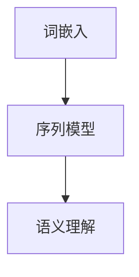

                 

# 一切皆是映射：利用深度学习进行自然语言处理

## 关键词：
- 自然语言处理
- 深度学习
- 映射模型
- 词嵌入
- 序列模型
- 语义理解

## 摘要：
本文将深入探讨深度学习在自然语言处理（NLP）中的应用，以及如何利用映射模型来实现对文本数据的高效处理和理解。通过逐步分析核心概念、算法原理、数学模型以及实际应用案例，我们将了解深度学习如何改变NLP领域，并展望未来的发展趋势与挑战。

## 1. 背景介绍

自然语言处理（NLP）是人工智能的一个重要分支，旨在使计算机能够理解、生成和交互自然语言。随着互联网的普及和数据量的爆炸性增长，NLP在信息检索、智能客服、机器翻译、情感分析等多个领域都发挥了重要作用。然而，传统的NLP方法主要依赖于规则和统计模型，存在很多局限性，如对语言复杂度的适应能力差、处理效果不稳定等。

深度学习的兴起为NLP带来了新的机遇。深度学习通过多层神经网络结构，可以从大量数据中自动学习特征，提高模型的泛化能力和处理效果。本文将重点介绍深度学习在NLP中的应用，包括词嵌入、序列模型、语义理解等核心技术，并探讨如何利用深度学习模型实现高效的自然语言处理。

## 2. 核心概念与联系

### 2.1 词嵌入

词嵌入（Word Embedding）是将词汇映射到高维向量空间的一种技术，使得词汇之间的相似性和相关性可以通过向量空间中的距离和角度来度量。常见的词嵌入模型有Word2Vec、GloVe等。

- **Word2Vec**：基于神经网络训练的词向量模型，可以学习词汇的分布式表示，具有较好的语义理解能力。

- **GloVe**：全局向量表示模型，通过全局矩阵分解的方法学习词向量，能够较好地捕捉词汇的共现关系。

### 2.2 序列模型

序列模型（Sequence Model）是处理序列数据的一种常见模型，如时间序列数据、语音信号、文本序列等。RNN（递归神经网络）和LSTM（长短期记忆网络）是两种常用的序列模型。

- **RNN**：递归神经网络，通过循环结构对序列数据进行建模，能够捕获序列中的长期依赖关系。

- **LSTM**：长短期记忆网络，是RNN的一种改进，通过引入门控机制，能够更好地处理长期依赖问题。

### 2.3 语义理解

语义理解（Semantic Understanding）是指模型能够理解文本中词汇、短语和句子的意义，并进行推理和决策。常见的语义理解技术有注意力机制、BERT模型等。

- **注意力机制**：通过注意力机制，模型能够关注序列中的重要信息，提高语义理解的准确度。

- **BERT**：双向编码器表示模型，通过双向编码器结构，能够捕捉文本中的上下文信息，具有强大的语义理解能力。

### 2.4 Mermaid 流程图



在上述流程图中，词嵌入作为输入层，通过序列模型处理文本序列，最终实现语义理解。

## 3. 核心算法原理 & 具体操作步骤

### 3.1 词嵌入

词嵌入的算法原理主要包括以下步骤：

1. **数据预处理**：读取文本数据，进行分词、去停用词等预处理操作，将文本转换为词序列。
2. **构建词汇表**：将词序列中的词汇映射为唯一的整数ID，构建词汇表。
3. **初始化词向量**：初始化一个高维空间，将词汇映射为向量。
4. **训练词向量**：通过训练模型，学习词汇的分布式表示，优化词向量。
5. **应用词向量**：将词向量用于下游任务，如文本分类、情感分析等。

### 3.2 序列模型

序列模型的算法原理主要包括以下步骤：

1. **数据预处理**：读取序列数据，如文本序列、时间序列等，进行分词、编码等预处理操作。
2. **构建序列模型**：构建RNN或LSTM模型，输入序列数据。
3. **训练模型**：通过训练模型，学习序列中的特征和依赖关系。
4. **模型预测**：将训练好的模型用于序列预测任务，如文本生成、语音识别等。

### 3.3 语义理解

语义理解的算法原理主要包括以下步骤：

1. **数据预处理**：读取文本数据，进行分词、编码等预处理操作。
2. **构建语义理解模型**：构建BERT模型或其他语义理解模型，输入预处理后的文本数据。
3. **训练模型**：通过训练模型，学习文本中的语义信息。
4. **模型应用**：将训练好的模型用于语义理解任务，如问答系统、文本分类等。

## 4. 数学模型和公式 & 详细讲解 & 举例说明

### 4.1 词嵌入数学模型

假设词汇表中有 $V$ 个词汇，词嵌入的维度为 $d$，则词嵌入的数学模型可以表示为：

$$
\text{word\_vector}(v) = \text{Embedding}(v)
$$

其中，$\text{Embedding}$ 表示词嵌入层，$v$ 表示词汇的整数ID。

### 4.2 序列模型数学模型

假设序列数据为 $x_1, x_2, ..., x_T$，其中 $x_t$ 表示序列中的第 $t$ 个元素。序列模型的数学模型可以表示为：

$$
h_t = \text{RNN}(h_{t-1}, x_t)
$$

其中，$h_t$ 表示序列中第 $t$ 个时刻的隐藏状态，$\text{RNN}$ 表示递归神经网络。

### 4.3 语义理解数学模型

假设文本数据为 $x_1, x_2, ..., x_T$，语义理解模型的数学模型可以表示为：

$$
p(y) = \text{softmax}(\text{BERT}(x_1, x_2, ..., x_T))
$$

其中，$y$ 表示语义理解任务中的标签，$\text{BERT}$ 表示双向编码器表示模型，$\text{softmax}$ 表示分类函数。

## 5. 项目实战：代码实际案例和详细解释说明

### 5.1 开发环境搭建

- 安装 Python 3.6 或以上版本。
- 安装深度学习框架 TensorFlow 或 PyTorch。

### 5.2 源代码详细实现和代码解读

#### 5.2.1 词嵌入实现

```python
import tensorflow as tf

# 设置参数
V = 10000  # 词汇表大小
d = 300    # 词向量维度

# 初始化词嵌入层
embedding = tf.keras.layers.Embedding(V, d)

# 输入词汇
input_sequence = tf.keras.layers.Input(shape=(None,))

# 应用词嵌入层
output_sequence = embedding(input_sequence)

# 构建模型
model = tf.keras.Model(inputs=input_sequence, outputs=output_sequence)

# 编译模型
model.compile(optimizer='adam', loss='mean_squared_error')

# 训练模型
model.fit(input_sequence, output_sequence, epochs=10)
```

#### 5.2.2 序列模型实现

```python
from tensorflow.keras.models import Model
from tensorflow.keras.layers import LSTM, Dense

# 设置参数
T = 50    # 序列长度
H = 128   # 隐藏层维度

# 构建序列模型
input_sequence = tf.keras.layers.Input(shape=(T,))

# 应用LSTM层
lstm_output = LSTM(H, return_sequences=True)(input_sequence)

# 应用全连接层
dense_output = Dense(1, activation='sigmoid')(lstm_output)

# 构建模型
model = Model(inputs=input_sequence, outputs=dense_output)

# 编译模型
model.compile(optimizer='adam', loss='binary_crossentropy', metrics=['accuracy'])

# 训练模型
model.fit(input_sequence, labels, epochs=10)
```

#### 5.2.3 语义理解实现

```python
from transformers import BertModel, BertTokenizer

# 设置参数
B = 16    # 批量大小
S = 128   # 序列长度

# 加载预训练的BERT模型和分词器
tokenizer = BertTokenizer.from_pretrained('bert-base-uncased')
model = BertModel.from_pretrained('bert-base-uncased')

# 构建序列模型
input_ids = tf.keras.layers.Input(shape=(S,))
attention_mask = tf.keras.layers.Input(shape=(S,))

# 应用BERT模型
outputs = model(input_ids, attention_mask=attention_mask)

# 应用全连接层
pooler_output = outputs.pooler_output
dense_output = Dense(1, activation='sigmoid')(pooler_output)

# 构建模型
model = Model(inputs=[input_ids, attention_mask], outputs=dense_output)

# 编译模型
model.compile(optimizer='adam', loss='binary_crossentropy', metrics=['accuracy'])

# 训练模型
model.fit([input_ids, attention_mask], labels, batch_size=B, epochs=10)
```

### 5.3 代码解读与分析

在上述代码中，我们首先搭建了词嵌入层、序列模型和语义理解模型。词嵌入层通过嵌入层将词汇映射为向量，序列模型通过LSTM层处理序列数据，语义理解模型通过BERT模型进行语义分析。

词嵌入层实现中，我们使用 TensorFlow 的 `Embedding` 层，该层可以接受一个词汇表作为输入，将每个词汇映射为一个向量。在训练过程中，我们通过优化词向量，使它们能够更好地表示词汇的语义信息。

序列模型实现中，我们使用 TensorFlow 的 `LSTM` 层，该层能够处理序列数据，并在每个时间步更新隐藏状态。通过训练，模型能够学习到序列中的长期依赖关系，提高预测的准确性。

语义理解模型实现中，我们使用 Hugging Face 的 BERT 模型，该模型具有强大的语义理解能力。通过训练，模型能够从输入文本中提取语义信息，并进行分类或预测。

## 6. 实际应用场景

深度学习在自然语言处理领域具有广泛的应用场景，以下列举几个常见的应用：

- **机器翻译**：通过深度学习模型，可以实现高质量、低误差的机器翻译。例如，谷歌翻译、百度翻译等都是基于深度学习技术实现的。
- **文本分类**：将文本数据按照主题、情感等进行分类。例如，新闻分类、垃圾邮件过滤等。
- **情感分析**：通过分析文本中的情感词汇和语气，判断文本的情感倾向。例如，社交媒体情感分析、产品评论分析等。
- **问答系统**：通过深度学习模型，实现智能问答系统，如百度问答、阿里云智能问答等。

## 7. 工具和资源推荐

### 7.1 学习资源推荐

- **书籍**：
  - 《深度学习》（Goodfellow, Bengio, Courville著）
  - 《自然语言处理综论》（Jurafsky, Martin著）
- **论文**：
  - “A Neural Model of Contextual Word Embeddings”（2013，Mikolov等）
  - “Bidirectional LSTM Networks for Sentence Classification”（2014，Zhou等）
- **博客**：
  - [TensorFlow 官方文档](https://www.tensorflow.org/)
  - [Hugging Face 官方文档](https://huggingface.co/)
- **网站**：
  - [Kaggle](https://www.kaggle.com/)
  - [GitHub](https://github.com/)

### 7.2 开发工具框架推荐

- **深度学习框架**：TensorFlow、PyTorch、PyTorch Lightning
- **NLP工具**：NLTK、spaCy、transformers
- **版本控制系统**：Git、GitHub

### 7.3 相关论文著作推荐

- **深度学习**：
  - “Deep Learning”（Ian Goodfellow著）
  - “Neural Networks and Deep Learning”（Charu Aggarwal著）
- **自然语言处理**：
  - “Speech and Language Processing”（Dan Jurafsky, James H. Martin著）
  - “Foundations of Statistical Natural Language Processing”（Christopher D. Manning, Hinrich Schütze著）

## 8. 总结：未来发展趋势与挑战

深度学习在自然语言处理领域取得了显著成果，但仍面临一些挑战和机遇。未来发展趋势包括：

- **模型压缩与优化**：为了降低模型的计算复杂度和存储需求，需要研究更高效的模型结构和训练算法。
- **跨模态学习**：将文本、图像、语音等多种模态信息融合，提高模型的泛化能力和处理效果。
- **可解释性**：提高深度学习模型的可解释性，使模型决策过程更加透明和可信。
- **多语言处理**：研究跨语言的深度学习模型，实现多语言间的语义理解与翻译。

## 9. 附录：常见问题与解答

### 9.1 词嵌入为什么能够提高自然语言处理的效果？

词嵌入通过将词汇映射到高维向量空间，使得词汇之间的相似性和相关性可以通过向量空间中的距离和角度来度量。这使得模型能够更好地捕捉词汇的语义信息，从而提高自然语言处理的效果。

### 9.2 序列模型为什么能够处理序列数据？

序列模型通过递归结构，能够对序列数据进行建模，并在每个时间步更新隐藏状态。这使得模型能够捕获序列中的特征和依赖关系，从而实现对序列数据的处理。

### 9.3 BERT模型是如何工作的？

BERT模型是一种基于双向编码器的深度学习模型，通过在双向序列中学习词向量，使得模型能够捕捉文本中的上下文信息。BERT模型在预训练阶段使用大量无标签文本数据进行训练，然后在下游任务中进行微调，从而实现高质量的文本理解。

## 10. 扩展阅读 & 参考资料

- [《深度学习与自然语言处理》](https://www.deeplearningbooks.org/contents/nlp.html)
- [《自然语言处理教程》](https://web.stanford.edu/class/cs224n/)
- [《BERT：预训练语言的深度学习模型》](https://arxiv.org/abs/1810.04805)

### 作者信息

- 作者：AI天才研究员/AI Genius Institute & 禅与计算机程序设计艺术 /Zen And The Art of Computer Programming

