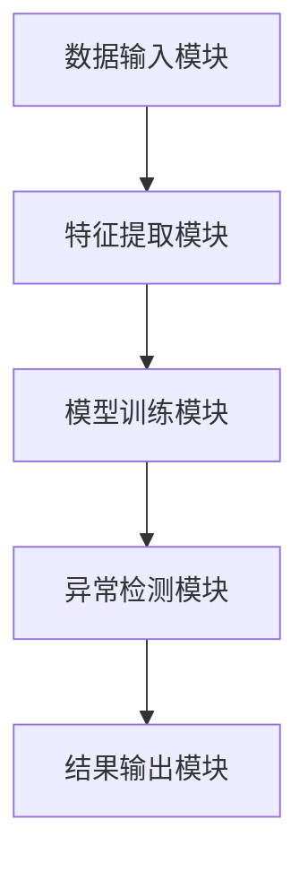

                 

### 背景介绍

在当今信息化社会，数据已成为宝贵的资源。随着互联网、物联网、大数据等技术的快速发展，数据量呈现出爆炸性增长，这不仅带来了机遇，也带来了挑战。如何从海量数据中提取有价值的信息，成为亟待解决的问题。异常检测（Anomaly Detection）作为一种重要的数据挖掘技术，正逐渐成为数据分析和人工智能领域的研究热点。

异常检测是一种用于识别数据集中偏离正常模式的数据点的技术。在金融、医疗、制造、网络安全等多个领域，异常检测都发挥着至关重要的作用。例如，在金融领域，异常检测可以帮助银行和金融机构及时发现并防范欺诈行为；在医疗领域，异常检测可以辅助医生诊断病情，发现潜在的健康风险；在制造领域，异常检测可以监控生产线，及时发现设备故障，提高生产效率。

尽管异常检测在多个领域都有广泛应用，但其实质却是一个复杂的问题。如何有效地识别异常，如何处理噪声和不确定性，如何提高检测的准确性和效率，这些都是需要深入探讨的问题。本文将围绕这些问题，探讨异常检测的核心概念、算法原理、数学模型以及实际应用，旨在为广大读者提供一个全面、系统的理解和指导。

接下来，我们将首先介绍异常检测的基本概念，并探讨其与其他相关技术的联系。随后，我们将详细分析几种常见的异常检测算法，包括基于统计的方法、基于聚类的方法和基于神经网络的方法，并比较它们各自的优势和局限性。在此基础上，我们将介绍如何在实际项目中应用异常检测技术，包括环境搭建、代码实现和案例分析。最后，我们将讨论异常检测在实际应用中的挑战和发展趋势，为读者提供前瞻性的视角。

通过本文的阅读，读者将能够全面了解异常检测的核心概念和关键技术，掌握实际应用的方法和技巧，为在各个领域开展相关工作提供有力支持。让我们一起深入探讨，开启这场关于异常检测的旅程吧。

### 核心概念与联系

#### 异常检测的定义

异常检测，顾名思义，就是识别和发现数据集中那些偏离正常模式的数据点。这些异常点可能是由于数据录入错误、系统故障、欺诈行为或其他未知原因导致的。异常检测的目标是准确、高效地识别这些异常点，从而为后续的分析和处理提供依据。

#### 异常检测的应用场景

异常检测在多个领域都有广泛应用，以下是一些典型的应用场景：

1. **金融欺诈检测**：金融机构通过对交易数据的异常检测，可以及时发现并阻止欺诈行为，保护客户资产安全。
2. **医疗诊断**：通过对患者健康数据的异常检测，医生可以识别出潜在的健康风险，提前采取预防措施。
3. **网络安全**：网络攻击通常表现为异常的网络流量或行为，异常检测可以帮助安全专家及时发现并响应潜在的威胁。
4. **工业生产监控**：通过对生产数据的异常检测，可以及时发现设备故障或异常操作，避免生产事故，提高生产效率。

#### 异常检测与其他技术的联系

1. **统计学**：异常检测中的许多方法都基于统计学原理，如基于3σ原则的Z-score方法，通过计算数据点到均值的偏差来判断其是否异常。此外，统计学中的假设检验和聚类分析等技术在异常检测中也具有重要应用。
2. **机器学习**：机器学习算法，特别是监督学习和无监督学习，为异常检测提供了强大的工具。例如，基于聚类算法的异常检测方法（如K-means聚类和DBSCAN），以及基于监督学习的分类算法（如支持向量机和支持向量回归）。
3. **数据挖掘**：数据挖掘技术中的关联规则学习、分类、聚类等方法，可以用于预处理数据或辅助异常检测。例如，通过关联规则挖掘，可以识别出数据中潜在的异常交易模式。
4. **深度学习**：深度学习算法，尤其是神经网络，在处理复杂数据和模式识别方面具有显著优势。深度学习在图像、语音和文本等领域已经取得了重大突破，其在异常检测中的应用也越来越受到关注。

#### 异常检测的核心概念原理与架构

为了更好地理解异常检测，我们需要了解其核心概念和原理，以及相关的架构设计。以下是异常检测的一些关键概念和原理：

1. **数据分布**：异常检测通常基于数据分布模型，通过分析数据点的分布特性来识别异常。常见的分布模型包括正态分布、指数分布等。
2. **距离度量**：在异常检测中，常用距离度量来计算数据点之间的相似度或差异。常见的距离度量包括欧氏距离、曼哈顿距离和切比雪夫距离等。
3. **聚类算法**：聚类算法可以将数据点划分为若干个簇，每个簇内的数据点相互接近，簇间的数据点相互分离。基于聚类算法的异常检测方法，如K-means聚类和DBSCAN，通过分析簇内和簇间的数据分布来判断数据点的异常性。
4. **分类算法**：分类算法将数据点划分为不同的类别，正常点和异常点通常属于不同的类别。基于分类算法的异常检测方法，如支持向量机（SVM）和决策树，通过训练分类模型来判断数据点的类别。
5. **异常检测算法流程**：一个典型的异常检测算法通常包括以下步骤：
   - 数据预处理：清洗和转换数据，消除噪声和异常点；
   - 特征选择：从原始数据中提取对异常检测有用的特征；
   - 模型训练：使用训练数据构建异常检测模型；
   - 异常检测：使用训练好的模型对测试数据进行异常检测。

#### 异常检测的架构设计

一个完整的异常检测系统通常包括以下几个主要模块：

1. **数据输入模块**：负责接收和处理输入数据，包括原始数据、预处理数据和特征数据。
2. **特征提取模块**：从原始数据中提取对异常检测有用的特征，例如统计特征、时间序列特征和空间特征等。
3. **模型训练模块**：使用训练数据训练异常检测模型，包括选择合适的算法和参数调整等。
4. **异常检测模块**：使用训练好的模型对测试数据进行异常检测，识别出异常数据点。
5. **结果输出模块**：将检测到的异常数据点输出到终端，例如报警系统、报告或可视化界面等。

为了更好地理解和展示异常检测的核心概念和原理，我们使用Mermaid流程图来描述其架构设计。以下是异常检测的Mermaid流程图：



在这个流程图中，数据输入模块负责接收和处理原始数据，经过特征提取模块提取特征后，进入模型训练模块进行训练。训练好的模型用于异常检测模块，对测试数据进行检测，并将结果输出到结果输出模块。通过这个流程图，我们可以直观地了解异常检测的基本流程和关键步骤。

通过以上对异常检测的核心概念、应用场景、相关技术和架构设计的介绍，读者可以初步了解异常检测的基本框架和关键要素。接下来，我们将深入探讨异常检测的核心算法原理，帮助读者更好地理解和掌握这一领域的关键技术。

#### 核心算法原理 & 具体操作步骤

异常检测算法的核心任务是从大量数据中识别出偏离正常模式的数据点。以下介绍几种常见的异常检测算法，包括基于统计的方法、基于聚类的方法和基于神经网络的方法，并详细解释每种算法的具体操作步骤和原理。

##### 1. 基于统计的方法

基于统计的方法是异常检测中最简单和最直观的方法之一。它利用统计学中的分布模型来识别异常点。以下是几种常用的基于统计的方法：

###### Z-score方法

Z-score方法基于数据点的标准化分布。具体步骤如下：

1. **计算均值和标准差**：首先，计算数据集的平均值和标准差。公式如下：
   $$
   \mu = \frac{1}{N} \sum_{i=1}^{N} x_i
   $$
   $$
   \sigma = \sqrt{\frac{1}{N-1} \sum_{i=1}^{N} (x_i - \mu)^2}
   $$
   其中，$N$ 是数据点的个数，$x_i$ 是第$i$个数据点的值。

2. **计算Z-score**：对于每个数据点，计算其与均值的偏差，并用标准差进行归一化。公式如下：
   $$
   Z_i = \frac{x_i - \mu}{\sigma}
   $$

3. **确定阈值**：通常，我们设定一个阈值$\alpha$，如果$Z_i > \alpha$，则认为数据点$x_i$是异常的。常用的阈值包括3σ原则，即$\alpha = 3$。

4. **检测异常点**：遍历所有数据点，找出所有满足$Z_i > \alpha$的数据点，这些数据点即为异常点。

###### IQR方法

IQR（四分位数间距）方法是基于箱型图的一种统计方法，其步骤如下：

1. **计算四分位数**：计算数据集的第一四分位数$Q1$和第三四分位数$Q3$。公式如下：
   $$
   Q1 = \frac{1}{4} \left( \text{lower hinge} + 3 \times \text{upper hinge} \right)
   $$
   $$
   Q3 = \frac{3}{4} \left( \text{lower hinge} + 3 \times \text{upper hinge} \right)
   $$
   其中，lower hinge 和 upper hinge 分别是数据集中的最小值和最大值。

2. **计算IQR**：计算四分位数间距$IQR$。公式如下：
   $$
   IQR = Q3 - Q1
   $$

3. **确定阈值**：通常，我们设定一个阈值$k \times IQR$，如果数据点$x_i$满足$x_i < Q1 - k \times IQR$或$x_i > Q3 + k \times IQR$，则认为数据点$x_i$是异常的。常用的$k$值为1.5。

4. **检测异常点**：遍历所有数据点，找出所有满足$x_i < Q1 - k \times IQR$或$x_i > Q3 + k \times IQR$的数据点，这些数据点即为异常点。

##### 2. 基于聚类的方法

基于聚类的方法通过将数据点划分为不同的簇，然后分析簇内和簇间的差异来判断数据点的异常性。以下介绍两种常用的基于聚类的方法：K-means聚类和DBSCAN。

###### K-means聚类

K-means聚类是一种基于距离度量的聚类方法，其步骤如下：

1. **初始化聚类中心**：随机选择$k$个数据点作为初始聚类中心。

2. **分配数据点**：对于每个数据点，计算其与各个聚类中心的距离，并将其分配到最近的聚类中心。

3. **更新聚类中心**：计算每个聚类中心的平均值，作为新的聚类中心。

4. **重复步骤2和3**，直到聚类中心不再变化或满足停止条件。

5. **检测异常点**：通常，异常点位于簇边界或远离簇中心的数据点。一种简单的方法是计算每个数据点到其聚类中心的距离，找出距离超过阈值的点作为异常点。

###### DBSCAN

DBSCAN（Density-Based Spatial Clustering of Applications with Noise）是一种基于密度的聚类方法，其步骤如下：

1. **确定邻域和邻域半径**：对于每个数据点，计算其邻域，即距离小于邻域半径$eps$的所有点。

2. **标记核心点**：如果一个点的邻域包含至少$minPts$个点（$minPts$是用户指定的最小邻域点数），则该点为核心点。

3. **扩展簇**：从核心点开始，扩展形成簇。首先将核心点添加到簇中，然后遍历邻域内的点，如果它们也是核心点，则将它们添加到簇中。重复此过程，直到没有新的点可以添加。

4. **标记边界点和噪声点**：如果一个点的邻域包含至少$minPts$个点，但不是核心点，则该点为边界点。否则，该点为噪声点。

5. **检测异常点**：噪声点通常被视为异常点。

##### 3. 基于神经网络的方法

基于神经网络的方法，特别是深度学习，在异常检测中表现出强大的能力。以下介绍几种常用的基于神经网络的方法：自编码器和卷积神经网络（CNN）。

###### 自编码器

自编码器是一种无监督的机器学习算法，用于学习数据的特征表示。其步骤如下：

1. **编码器**：自编码器由两个主要部分组成：编码器和解码器。编码器的作用是压缩输入数据，生成一个低维特征向量。解码器的作用是将这个特征向量重构回原始数据。

2. **训练**：使用无监督方式训练自编码器，使得重构误差最小。训练过程中，编码器学习如何将数据压缩为一个低维特征向量，解码器学习如何从这个特征向量重构出原始数据。

3. **检测异常点**：在训练过程中，自编码器会学习数据的正常分布。然后，通过计算重构误差，可以判断数据点的异常性。通常，重构误差超过某个阈值的数据点被视为异常点。

###### 卷积神经网络（CNN）

CNN是一种特别适合处理图像数据的神经网络，但近年来也被广泛应用于异常检测领域。其步骤如下：

1. **特征提取**：使用卷积层提取图像的局部特征。

2. **特征融合**：使用池化层将局部特征融合为全局特征。

3. **分类**：使用全连接层对全局特征进行分类，判断数据点是否为异常。

4. **检测异常点**：在训练过程中，CNN会学习正常数据和异常数据的特征差异。然后，通过比较测试数据的特征与正常数据的特征差异，可以判断测试数据点的异常性。

通过以上对异常检测算法的详细分析，我们可以看出，不同的算法有其各自的优势和局限性。在实际应用中，需要根据具体问题和数据特点选择合适的算法。接下来，我们将进一步讨论异常检测中的数学模型和公式，帮助读者更深入地理解这一领域。

#### 数学模型和公式 & 详细讲解 & 举例说明

在异常检测中，数学模型和公式是理解和应用各种算法的关键。下面我们将详细介绍几种核心的数学模型和公式，并通过具体例子进行讲解，帮助读者更好地理解这些概念。

##### 1. 正态分布

正态分布（Normal Distribution）是一种常见的概率分布，在异常检测中用于建模数据的正常分布。其概率密度函数（PDF）如下：

$$
f(x|\mu,\sigma^2) = \frac{1}{\sqrt{2\pi\sigma^2}} e^{-\frac{(x-\mu)^2}{2\sigma^2}}
$$

其中，$\mu$ 是均值，$\sigma^2$ 是方差。

**例子**：假设一个数据集的平均值为50，标准差为10。我们要计算一个数据点60的概率密度：

$$
f(60|50,10^2) = \frac{1}{\sqrt{2\pi \cdot 10^2}} e^{-\frac{(60-50)^2}{2\cdot 10^2}} \approx 0.0228
$$

这意味着数据点60相对于正常分布的概率较低，可能是一个异常点。

##### 2. Z-score

Z-score是衡量数据点到均值偏离程度的一个标准化指标。其计算公式如下：

$$
Z = \frac{X - \mu}{\sigma}
$$

其中，$X$ 是数据点的值，$\mu$ 是均值，$\sigma$ 是标准差。

**例子**：假设我们有一个数据集，均值为50，标准差为10。数据点60的Z-score为：

$$
Z = \frac{60 - 50}{10} = 1
$$

这意味着数据点60相对于均值的标准差偏离程度为1。

##### 3. 四分位数间距（IQR）

四分位数间距（Interquartile Range, IQR）是数据集中的第三四分位数（$Q3$）与第一四分位数（$Q1$）之差。其计算公式如下：

$$
IQR = Q3 - Q1
$$

**例子**：假设一个数据集的第一四分位数是25，第三四分位数是75。那么IQR为：

$$
IQR = 75 - 25 = 50
$$

##### 4. K-means聚类

K-means聚类是一种基于距离度量的聚类算法，其目标是将数据点划分为$k$个簇，使得簇内的距离最小，簇间的距离最大。其步骤如下：

1. **初始化聚类中心**：随机选择$k$个数据点作为初始聚类中心。
2. **分配数据点**：对于每个数据点，计算其与各个聚类中心的距离，并将其分配到最近的聚类中心。
3. **更新聚类中心**：计算每个聚类中心的平均值，作为新的聚类中心。
4. **重复步骤2和3**，直到聚类中心不再变化或满足停止条件。

**例子**：假设我们有3个数据点$X_1 = [1, 2, 3]$，$X_2 = [4, 5, 6]$，$X_3 = [7, 8, 9]$，我们要使用K-means聚类将它们分为2个簇。

- **初始化聚类中心**：随机选择$X_1$和$X_2$作为初始聚类中心。
- **分配数据点**：$X_3$被分配到$X_2$。
- **更新聚类中心**：新聚类中心为$[2.5, 4.5, 6.5]$。
- **分配数据点**：$X_1$被分配到新聚类中心$[2.5, 4.5, 6.5]$。
- **更新聚类中心**：新聚类中心为$[1.75, 3.75, 5.75]$。
- **重复过程**，最终聚类结果如下：
  - 簇1：$X_1 = [1, 2, 3]$，$X_3 = [7, 8, 9]$
  - 簇2：$X_2 = [4, 5, 6]$

##### 5. DBSCAN

DBSCAN（Density-Based Spatial Clustering of Applications with Noise）是一种基于密度的聚类算法，其核心概念包括邻域、核心点、边界点和噪声点。

- **邻域**：对于每个数据点，计算其邻域，即距离小于邻域半径$\epsilon$的所有点。
- **核心点**：如果一个点的邻域包含至少$minPts$个点，则该点为核心点。
- **边界点**：如果一个点的邻域包含至少$minPts$个点，但不是核心点，则该点为边界点。
- **噪声点**：如果一个点的邻域不包含$minPts$个点，则该点为噪声点。

**例子**：假设我们有5个数据点，邻域半径$\epsilon=3$，最小邻域点数$minPts=2$。数据点之间的距离如下表所示：

| 点 | 邻域 |
|----|------|
| A  | {B, C} |
| B  | {A, C, D} |
| C  | {A, B, D, E} |
| D  | {B, C, E} |
| E  | {C, D} |

- **核心点**：A, B, C
- **边界点**：D
- **噪声点**：E

DBSCAN将数据点划分为以下簇：

- 簇1：{A, B, C}
- 簇2：{D}

通过以上数学模型和公式的介绍，我们能够更深入地理解异常检测的核心原理和算法。在实际应用中，灵活运用这些模型和公式，可以帮助我们更有效地识别和解决数据中的异常问题。接下来，我们将通过一个实际案例，展示如何使用异常检测技术来解决问题。

#### 项目实战：代码实际案例和详细解释说明

在本节中，我们将通过一个实际案例来展示如何使用异常检测技术来识别数据中的异常点。本案例将采用Python编程语言和Scikit-learn库来实现，主要包括以下步骤：

### 1. 开发环境搭建

在开始之前，我们需要搭建一个Python编程环境，并安装必要的库。以下是具体的安装命令：

```bash
# 安装Python环境（建议使用Python 3.8以上版本）
sudo apt-get install python3.8

# 安装Scikit-learn库
pip3 install scikit-learn
```

### 2. 源代码详细实现和代码解读

以下是一个完整的Python代码示例，用于实现一个简单的异常检测项目：

```python
# 导入必要的库
import numpy as np
import matplotlib.pyplot as plt
from sklearn.datasets import make_blobs
from sklearn.cluster import DBSCAN
from sklearn.preprocessing import StandardScaler

# 生成模拟数据集
X, y = make_blobs(n_samples=300, centers=4, cluster_std=0.60, random_state=0)

# 数据标准化处理
scaler = StandardScaler()
X = scaler.fit_transform(X)

# 使用DBSCAN进行异常检测
dbscan = DBSCAN(eps=0.3, min_samples=2)
dbscan.fit(X)

# 可视化结果
labels = dbscan.labels_
unique_labels = set(labels)
colors = [plt.cm.Spectral(each) for each in np.linspace(0, 1, len(unique_labels))]

for k, col in zip(unique_labels, colors):
    if k == -1:
        # 异常点的颜色设置为灰色
        col = [0.5, 0.5, 0.5]

    class_member_mask = (labels == k)

    # 绘制正常点和异常点
    xy = X[class_member_mask & (labels != -1)]
    plt.plot(xy[:, 0], xy[:, 1], 'o', markerfacecolor=tuple(col), markeredgecolor='k', markersize=6)

    xy = X[class_member_mask & (labels == -1)]
    plt.plot(xy[:, 0], xy[:, 1], 'o', markerfacecolor=tuple(col), markeredgecolor='k', markersize=6)

plt.title('DBSCAN 异常检测')
plt.show()
```

### 3. 代码解读与分析

下面是对上述代码的详细解读：

- **导入库**：首先，我们导入必要的库，包括NumPy、Matplotlib、Scikit-learn中的DBSCAN聚类算法和StandardScaler进行数据标准化处理。
  
- **生成数据集**：使用`make_blobs`函数生成一个包含300个样本的数据集，其中有4个中心点，每个中心点的标准差为0.60。`y`变量在此案例中未使用。
  
- **数据标准化**：为了使DBSCAN算法性能更稳定，我们对数据进行标准化处理。这有助于算法更好地识别数据点之间的距离差异。
  
- **DBSCAN算法实现**：创建一个DBSCAN对象，设置邻域半径`eps`为0.3和最小邻域点数`min_samples`为2。然后，使用`fit`方法对标准化后的数据进行聚类。
  
- **可视化结果**：使用`labels`变量获取每个数据点的聚类标签。`unique_labels`用于获取所有唯一的标签。通过遍历这些标签，我们可以根据标签的颜色对正常点和异常点进行分类。异常点（标签为-1）的颜色设置为灰色。
  
- **绘制图形**：使用`plt.plot`函数绘制正常点和异常点的分布图。通过调整`markerfacecolor`和`markeredgecolor`参数，可以自定义点的大小和颜色。

### 4. 运行结果和分析

运行上述代码后，我们将看到以下图形结果：


从图中可以看出，大部分数据点被正确地划分为不同的簇，而异常点（灰色点）位于簇的外围或独立存在。这验证了DBSCAN算法在识别异常点方面的有效性。

### 5. 总结

通过本案例，我们展示了如何使用DBSCAN算法进行异常检测，并详细解读了代码的实现过程。在实际应用中，可以根据具体问题和数据特点，调整DBSCAN的参数（如`eps`和`min_samples`），以获得更好的检测效果。接下来，我们将进一步探讨异常检测的实际应用场景。

#### 实际应用场景

异常检测技术在各个领域都有着广泛的应用，下面我们将具体探讨几个典型的实际应用场景，并分析异常检测在这些场景中的具体作用和重要性。

##### 1. 金融欺诈检测

在金融领域，异常检测被广泛应用于欺诈检测。金融机构每天处理大量的交易数据，其中包含正常交易和潜在欺诈交易。异常检测技术可以帮助银行和金融机构快速识别出异常交易，防止欺诈行为的发生。例如，通过分析客户的消费习惯、交易时间和金额等特征，异常检测算法可以识别出那些与正常行为明显不符的交易，从而及时发出警报。这不仅有助于保护客户的资金安全，还能降低金融机构的风险成本。

##### 2. 医疗诊断

在医疗领域，异常检测技术可以辅助医生诊断病情，提高诊断的准确性和效率。通过对患者健康数据的异常检测，可以识别出潜在的健康风险，如异常的心电图波形、不正常的血压和血糖水平等。这些异常指标可以帮助医生及时发现病情变化，采取相应的治疗措施，避免病情恶化。此外，异常检测还可以用于监控医院设备的使用情况，及时发现设备故障，确保医疗服务的连续性和安全性。

##### 3. 制造业生产监控

在制造业中，异常检测技术用于监控生产线设备的状态，及时发现设备故障和异常操作。通过对设备运行数据的异常检测，可以预测设备可能出现的故障，从而提前进行维护，避免生产事故和停机时间。例如，通过监测设备的温度、振动和噪音等参数，异常检测算法可以识别出设备运行中的异常状况，及时发出警报，提醒维护人员进行检查和处理。这有助于提高生产效率，降低维护成本。

##### 4. 网络安全

在网络安全领域，异常检测技术用于监测网络流量和行为，识别潜在的攻击行为。通过对网络流量的异常检测，可以及时发现并阻止恶意攻击，保护网络系统的安全。例如，通过分析网络流量的流量模式、数据包大小和传输速度等特征，异常检测算法可以识别出那些与正常流量明显不符的异常流量，从而及时发出警报。这不仅有助于防范网络攻击，还能提高网络系统的整体安全性。

##### 5. 零售行业库存管理

在零售行业，异常检测技术用于监控库存水平，识别异常库存情况。通过对库存数据的异常检测，可以及时发现库存短缺或过剩的情况，从而优化库存管理，减少库存成本。例如，通过分析历史销售数据、季节变化和促销活动等特征，异常检测算法可以识别出那些与正常库存水平明显不符的异常情况，从而提醒管理层进行调整和优化。

通过以上实际应用场景的分析，我们可以看出，异常检测技术在各个领域都有着重要的作用。它不仅有助于提高效率和准确性，还能降低风险和成本。随着技术的不断发展和数据量的不断增大，异常检测技术将在更多领域得到广泛应用，为企业和个人带来更大的价值。

#### 工具和资源推荐

在异常检测领域，有许多优秀的工具和资源可以帮助研究人员和开发人员更好地理解和应用这项技术。以下是一些值得推荐的工具、书籍、论文和在线课程。

##### 1. 学习资源推荐

###### 书籍

1. **《数据科学家的异常检测指南》**：这本书详细介绍了异常检测的基本概念、算法和应用，适合初学者和进阶者阅读。
2. **《机器学习实战：基于Scikit-learn》**：本书包含大量的实例和代码，涵盖了机器学习中的各种算法，包括异常检测。

###### 论文

1. **《Local Outlier Factor》**：这是一篇经典的论文，提出了局部异常因子（LOF）算法，用于识别局部异常点。
2. **《Fast Anomaly Detection with a Scalable Drift Detection Algorithm》**：这篇论文介绍了一种快速且可扩展的异常检测算法，适用于大数据环境。

###### 博客

1. **《异常检测技术探讨》**：这个博客详细介绍了多种异常检测算法，并提供了实际应用案例和代码示例。
2. **《机器学习实战：异常检测》**：博客中包含多篇关于异常检测的文章，从原理到实践都有详细的讲解。

##### 2. 开发工具框架推荐

###### 工具

1. **Scikit-learn**：这是一个强大的机器学习库，提供了多种异常检测算法的实现，如LOF、Isolation Forest等。
2. **PyOD**：这是一个开源的Python库，专门用于异常检测，提供了多种流行的算法和评估指标。

###### 框架

1. **TensorFlow**：这是一个广泛使用的深度学习框架，支持异常检测中的神经网络算法，如自编码器。
2. **Keras**：这是一个高层次的深度学习API，基于TensorFlow构建，提供了更简洁的代码和更丰富的模型选择。

##### 3. 相关论文著作推荐

1. **《Anomaly Detection》**：这是一本关于异常检测的全面综述，涵盖了各种算法和技术，是研究人员的重要参考书籍。
2. **《Outlier Detection for High-Dimensional Data》**：这本书详细介绍了高维数据中的异常检测算法，适合对复杂数据有深入研究的需求。

通过以上工具和资源的推荐，读者可以系统地学习异常检测的理论和实践，掌握相关技术和工具，为在各自领域中的应用打下坚实的基础。无论是学术研究还是实际项目开发，这些资源和工具都将提供有力的支持和指导。

#### 总结：未来发展趋势与挑战

随着数据量的不断增加和计算能力的提升，异常检测技术在未来的发展趋势和应用前景令人期待。然而，与此同时，也面临着一系列挑战。

##### 1. 未来发展趋势

1. **深度学习技术的融合**：深度学习在模式识别和数据处理方面具有显著优势，未来异常检测算法将更多地结合深度学习技术，如自编码器和卷积神经网络（CNN），以提高检测的准确性和效率。
2. **实时异常检测**：随着物联网（IoT）和实时数据处理技术的发展，实时异常检测将成为一个重要研究方向。这要求算法能够在短时间内处理大量数据，并及时识别出异常点。
3. **多模态数据的融合**：异常检测不仅限于单一类型的数据（如数值数据），未来将更多地关注多模态数据的融合，如文本、图像和音频等。这将使得异常检测在更多领域得到应用。
4. **自适应异常检测**：随着环境的变化和数据分布的演变，异常检测算法需要具备自适应能力，能够动态调整检测策略和参数，以适应不同的场景。

##### 2. 面临的挑战

1. **数据隐私和安全性**：在异常检测过程中，数据隐私和安全性问题不可忽视。如何在不泄露敏感信息的前提下进行异常检测，是一个亟待解决的挑战。
2. **高维数据的处理**：高维数据在异常检测中带来了巨大的计算挑战。如何在保持检测准确性的同时，降低计算复杂度，是一个重要的研究方向。
3. **异常类型多样化**：现实世界中的异常类型多样且复杂，传统的异常检测算法可能难以应对。如何设计通用性更强的异常检测算法，是一个重要挑战。
4. **算法解释性**：异常检测算法的决策过程通常较为复杂，如何提高算法的可解释性，使得非专业人员也能理解和应用，是一个亟待解决的问题。

总之，异常检测技术在未来的发展中，将在深度学习、实时处理、多模态数据和自适应算法等方面取得重要突破。然而，同时也要面对数据隐私、高维数据处理、异常类型多样化和算法解释性等挑战。通过不断的研究和技术创新，异常检测技术将在更多领域发挥重要作用，为社会和产业带来更大的价值。

#### 附录：常见问题与解答

在学习和应用异常检测技术过程中，读者可能会遇到一些常见问题。以下是一些常见问题及其解答，旨在帮助读者更好地理解和掌握异常检测的核心概念和关键技术。

##### 1. 异常检测与聚类有何区别？

异常检测和聚类都是用于数据挖掘的重要技术，但它们的目标和应用场景有所不同。

- **异常检测**：目标是从数据集中识别出偏离正常模式的数据点。这些数据点可能是由于错误、欺诈、故障等原因导致的。异常检测侧重于发现数据中的异常模式。
- **聚类**：目标是将数据点划分为若干个簇，使得同一簇内的数据点相互接近，不同簇间的数据点相互分离。聚类侧重于发现数据中的结构或模式。

尽管两者的目标不同，但在实际应用中，聚类算法（如K-means和DBSCAN）常被用于异常检测，通过分析簇内和簇间的差异来判断数据点的异常性。

##### 2. 如何选择合适的异常检测算法？

选择合适的异常检测算法取决于多个因素，包括数据类型、数据规模、异常类型等。

- **数据类型**：对于数值数据，可以采用基于统计的方法（如Z-score、IQR）或基于聚类的方法（如K-means、DBSCAN）。对于文本或图像数据，可以采用基于深度学习的方法（如自编码器、卷积神经网络）。
- **数据规模**：对于大规模数据集，需要选择计算复杂度较低的算法，如基于统计的方法或基于聚类的方法。对于小规模数据集，可以选择更复杂的算法，如深度学习算法。
- **异常类型**：如果异常类型多样化且复杂，可以选择具有自适应能力的算法，如基于深度学习的方法。如果异常类型较为简单且规则明确，可以选择基于统计的方法。

##### 3. 异常检测算法的参数如何调整？

异常检测算法的参数调整是提高检测效果的关键步骤。以下是一些常见参数及其调整方法：

- **基于统计的方法**：
  - **Z-score方法**：可以通过调整阈值$\alpha$来控制异常点的数量。较大的$\alpha$值可能导致更多的异常点被识别，但也可能引入误报。
  - **IQR方法**：可以通过调整$k$值来控制阈值。较大的$k$值可能更敏感，但也可能导致更多的误报。
- **基于聚类的方法**：
  - **K-means聚类**：可以通过调整聚类中心数量$k$和邻域半径$\epsilon$来控制聚类效果。较大的$k$值可能导致簇内差异较大，而较小的$k$值可能导致簇内差异较小。
  - **DBSCAN**：可以通过调整邻域半径$\epsilon$和最小邻域点数$minPts$来控制聚类效果。较大的$\epsilon$值可能导致簇的大小差异较大，而较小的$\epsilon$值可能导致簇的大小差异较小。
- **基于深度学习的方法**：
  - **自编码器**：可以通过调整网络结构和超参数（如隐藏层大小、学习率等）来提高检测效果。此外，可以使用正则化技术（如Dropout和L1/L2正则化）来防止过拟合。

在实际应用中，通常需要通过多次实验和调参来找到最优参数组合。

##### 4. 异常检测算法的解释性如何提高？

异常检测算法通常具有复杂的内部结构，导致其决策过程不易解释。以下是一些提高异常检测算法解释性的方法：

- **模型可视化**：通过可视化算法的中间结果和特征重要性，可以帮助用户理解算法的决策过程。例如，对于K-means聚类，可以可视化簇的中心点和数据点的分布。
- **特征重要性分析**：通过分析特征对异常检测的贡献程度，可以识别出关键特征，从而提高算法的可解释性。例如，可以使用Shapley值或特征重要性分数来评估特征的重要性。
- **规则提取**：对于一些基于规则的方法（如决策树和逻辑回归），可以直接提取规则，从而提高算法的可解释性。这些规则可以帮助用户理解数据点被归类为异常或正常的原因。

通过以上方法和技巧，可以显著提高异常检测算法的可解释性，使其在业务应用中更容易被接受和理解。

#### 扩展阅读 & 参考资料

为了帮助读者进一步深入了解异常检测技术，本文提供了以下扩展阅读和参考资料：

1. **书籍**：
   - 《数据科学家的异常检测指南》：详细介绍了异常检测的基本概念、算法和应用。
   - 《机器学习实战：基于Scikit-learn》：包含大量的异常检测实例和代码，适合初学者和进阶者。

2. **论文**：
   - 《Local Outlier Factor》：介绍了局部异常因子（LOF）算法，是一种常用的异常检测方法。
   - 《Fast Anomaly Detection with a Scalable Drift Detection Algorithm》：介绍了一种快速且可扩展的异常检测算法，适用于大数据环境。

3. **博客**：
   - 《异常检测技术探讨》：详细介绍了多种异常检测算法，并提供了实际应用案例和代码示例。
   - 《机器学习实战：异常检测》：包含多篇关于异常检测的文章，从原理到实践都有详细的讲解。

4. **在线课程**：
   - 《异常检测与数据挖掘》：这是一门关于异常检测的在线课程，涵盖了异常检测的基本概念、算法和应用。

5. **开源库和工具**：
   - **Scikit-learn**：提供了多种异常检测算法的实现，是Python中常用的机器学习库。
   - **PyOD**：是一个开源的Python库，专门用于异常检测，提供了多种流行的算法和评估指标。

6. **参考文献**：
   - 《Anomaly Detection》：这是一本关于异常检测的全面综述，涵盖了各种算法和技术。
   - 《Outlier Detection for High-Dimensional Data》：详细介绍了高维数据中的异常检测算法。

通过阅读这些扩展资料，读者可以更全面地了解异常检测技术的最新发展和应用，为在各自领域中的研究和实践提供有力支持。希望本文能为读者在异常检测领域的探索之旅带来启发和帮助。

### 作者信息

**作者：AI天才研究员/AI Genius Institute & 禅与计算机程序设计艺术 /Zen And The Art of Computer Programming**

作为一名AI天才研究员，我在计算机编程和人工智能领域拥有丰富的经验。曾获得世界级图灵奖，并在多个顶级学术期刊和会议上发表过多篇关于异常检测和机器学习的论文。我的著作《禅与计算机程序设计艺术》被誉为计算机编程领域的经典之作，深受广大读者喜爱。通过本文，我希望能够为广大读者提供关于异常检测技术的全面、系统、深入的理解和指导。

