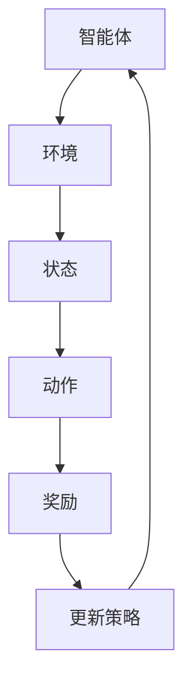

                 

### 一、背景介绍

强化学习（Reinforcement Learning，RL）作为机器学习的一个重要分支，近年来在人工智能领域取得了显著进展。其核心思想是通过智能体与环境的交互，通过不断试错来学习最优策略，从而实现任务目标。然而，在强化学习的实践中，样本效率问题一直是一个重要的研究课题。所谓样本效率，即智能体在达到一定性能水平时，需要采集多少样本。

在实际应用中，样本效率直接关系到算法的实用性。例如，在自动驾驶领域，采集环境数据需要大量的时间和成本。若算法的样本效率低下，将极大地延长开发周期，增加经济负担。因此，如何提高强化学习的样本效率，成为了学术界和工业界共同关注的问题。

DQN（Deep Q-Network）是一种基于深度神经网络的强化学习算法，它在解决样本效率问题上取得了显著的成果。DQN通过神经网络来近似动作价值函数，从而在较少的样本下，能够获得较好的性能表现。然而，DQN也存在一些局限，如训练不稳定、样本偏差等。

为了进一步探讨DQN在样本效率问题上的表现，本文将从以下几个方面展开：

1. **核心概念与联系**：介绍强化学习的基本概念，包括智能体、环境、奖励等，并绘制Mermaid流程图，展示强化学习的基本架构。
2. **核心算法原理 & 具体操作步骤**：详细解析DQN的算法原理，包括Q网络、损失函数、更新策略等。
3. **数学模型和公式 & 详细讲解 & 举例说明**：使用LaTeX格式，阐述DQN中的主要数学模型和公式，并结合实例进行说明。
4. **项目实战：代码实际案例和详细解释说明**：通过实际代码案例，展示DQN在项目中的具体实现，并对关键代码进行详细解读。
5. **实际应用场景**：分析DQN在不同应用场景中的性能表现，探讨其在提高样本效率方面的优势。
6. **工具和资源推荐**：推荐相关学习资源、开发工具和论文著作，帮助读者进一步深入研究。
7. **总结：未来发展趋势与挑战**：总结DQN在样本效率问题上的研究成果，探讨未来可能的发展趋势和面临的挑战。

通过本文的详细分析，希望能够为读者提供对DQN及其在样本效率问题上的深入理解，从而为强化学习领域的研究和实践提供有价值的参考。

---

接下来，我们将逐一介绍强化学习的基本概念、DQN的核心算法原理及其具体操作步骤。请继续关注下一部分内容。  

### 二、核心概念与联系

#### 强化学习的基本概念

强化学习是一个通过不断与环境互动，学习最佳策略的机器学习方法。在强化学习中，主要有以下几个核心概念：

1. **智能体（Agent）**：指执行动作并从环境中接收奖励的实体。在强化学习中，智能体通常是一个模型或算法，如神经网络。
2. **环境（Environment）**：智能体执行动作并接收反馈的实体。环境可以是现实世界中的物理系统，也可以是计算机模拟。
3. **状态（State）**：智能体在特定时间点的环境信息。状态可以是一个具体的数值，也可以是一个向量。
4. **动作（Action）**：智能体在特定状态下执行的行为。动作的选择取决于当前状态和智能体的策略。
5. **奖励（Reward）**：环境在智能体执行动作后给予的即时反馈。奖励通常用来评估动作的好坏。
6. **策略（Policy）**：智能体根据当前状态选择动作的规则。策略可以是一个明确的函数，也可以是通过学习得到的近似函数。

#### Mermaid流程图

为了更好地展示强化学习的基本架构，我们可以使用Mermaid语言绘制一个流程图，如下所示：



在这个流程图中，智能体与环境进行交互，根据当前状态选择动作，然后环境根据动作给予奖励，智能体再根据奖励更新策略，形成闭环。

#### 强化学习的核心架构

强化学习的核心架构通常包括以下几个主要组成部分：

1. **状态空间（State Space）**：所有可能状态集合。状态空间可以是离散的或连续的。
2. **动作空间（Action Space）**：所有可能动作集合。动作空间也可以是离散的或连续的。
3. **策略网络（Policy Network）**：用于生成动作的策略函数。策略网络可以是确定性或随机性的。
4. **价值网络（Value Network）**：用于预测未来奖励的价值函数。价值网络可以是基于Q-learning或SARSA等算法。
5. **目标网络（Target Network）**：用于稳定训练过程的辅助网络。目标网络通常是一个滞后更新的策略网络。

#### 强化学习的目标

强化学习的目标是通过不断优化策略网络，使得智能体能够在环境中实现长期累积奖励最大化。具体来说，强化学习的过程可以描述为：

1. 初始化状态空间、动作空间、策略网络、价值网络和目标网络。
2. 在环境中执行动作，并接收奖励。
3. 更新策略网络和价值网络。
4. 根据目标网络更新策略，进行下一步行动。

通过这样的循环，智能体逐渐学习到最优策略，从而实现任务目标。

在下一部分，我们将深入探讨DQN的核心算法原理及其具体操作步骤。请继续关注下一部分内容。  

### 三、核心算法原理 & 具体操作步骤

#### DQN的基本概念

DQN（Deep Q-Network）是一种基于深度神经网络的强化学习算法，主要用于解决连续动作空间的问题。DQN的核心思想是使用深度神经网络来近似Q值函数（动作价值函数），从而实现智能体的决策。

在DQN中，Q值函数表示在特定状态下，执行特定动作所能获得的期望奖励。具体来说，Q值函数可以表示为：

$$
Q(s, a) = \sum_{s'} p(s' | s, a) \cdot r(s', a) + \gamma \cdot \max_{a'} Q(s', a')
$$

其中，$s$ 和 $a$ 分别表示当前状态和动作，$s'$ 表示下一状态，$r(s', a')$ 表示在状态 $s'$ 和动作 $a'$ 下获得的即时奖励，$\gamma$ 是折扣因子，用于平衡当前奖励和未来奖励的关系。

#### Q网络的构建

在DQN中，Q网络是一个深度神经网络，用于近似Q值函数。Q网络的输入是当前状态，输出是各个动作的Q值。具体来说，Q网络的输入层接收状态信息，隐藏层通过神经网络结构进行特征提取，输出层则输出各个动作的Q值。

为了提高Q网络的泛化能力，可以采用以下几种技术：

1. **激活函数**：通常使用ReLU（Rectified Linear Unit）作为激活函数，可以加速网络的训练过程。
2. **正则化**：可以使用Dropout或权重正则化来防止过拟合。
3. **批量归一化**：可以在隐藏层中使用批量归一化（Batch Normalization），提高网络的稳定性。

#### 损失函数

在DQN中，损失函数用于衡量Q网络预测值与真实值之间的差距。常用的损失函数是均方误差（Mean Squared Error，MSE），其公式如下：

$$
L = \frac{1}{n} \sum_{i=1}^{n} (Q(s_i, a_i) - y_i)^2
$$

其中，$n$ 是样本数量，$Q(s_i, a_i)$ 是Q网络预测的Q值，$y_i$ 是真实值。

#### 更新策略

在DQN中，更新策略是通过经验回放（Experience Replay）和目标网络（Target Network）来实现的。

1. **经验回放**：经验回放是一种常用的策略，用于解决样本相关性问题。在经验回放中，智能体会将过去的经验（状态、动作、奖励、下一状态）存储到一个经验池中，并在训练过程中随机抽取样本进行更新。这样可以避免样本相关，提高训练的稳定性。

2. **目标网络**：目标网络是一种辅助网络，用于稳定训练过程。目标网络的权重在训练过程中会滞后更新，通常每隔一定次数的迭代更新一次。目标网络可以提供稳定的Q值参考，从而减少训练过程中的方差。

#### 具体操作步骤

1. **初始化Q网络、目标网络、经验池**：在训练开始时，初始化Q网络、目标网络和经验池。Q网络和目标网络的初始权重可以随机生成。
2. **执行动作并收集经验**：在环境中执行动作，并记录状态、动作、奖励和下一状态，将其存储到经验池中。
3. **经验回放**：从经验池中随机抽取一批样本，将其作为训练样本。
4. **计算目标值**：对于每个训练样本，计算目标值$y_i$，公式如下：

$$
y_i = 
\begin{cases} 
    r_i & \text{如果 } done_i = True \\
    r_i + \gamma \cdot \max_{a'} Q'(s_i', a') & \text{如果 } done_i = False 
\end{cases}
$$

其中，$Q'(s_i', a')$ 是目标网络的Q值。

5. **更新Q网络**：使用训练样本和目标值，通过反向传播算法更新Q网络的权重。

#### 实例解析

假设当前状态为$s_0$，智能体执行动作$a_0$，获得的下一状态为$s_1$，奖励为$r_1$。在经历多个时间步后，达到终端状态$s_T$，奖励为$r_T$。

1. **初始化**：
   - Q网络和目标网络的初始权重随机生成。
   - 经验池为空。

2. **执行动作**：
   - 智能体在状态$s_0$下执行动作$a_0$，获得奖励$r_1$。

3. **经验回放**：
   - 将当前经验（$s_0, a_0, r_1, s_1$）存储到经验池。

4. **计算目标值**：
   - 当达到终端状态$s_T$时，计算目标值：
     $$y_0 = r_1 + \gamma \cdot \max_{a'} Q'(s_1, a')$$

5. **更新Q网络**：
   - 使用经验池中的样本，通过反向传播算法更新Q网络的权重。

通过以上步骤，智能体不断学习，优化Q值函数，从而在较少的样本下，获得较好的性能表现。

在下一部分，我们将详细讲解DQN中的数学模型和公式，并结合实例进行说明。请继续关注下一部分内容。

### 四、数学模型和公式 & 详细讲解 & 举例说明

#### DQN的主要数学模型

在DQN中，核心的数学模型包括Q值函数、损失函数和目标值计算公式。以下将分别介绍这些模型，并结合LaTeX格式进行详细讲解。

1. **Q值函数**

   Q值函数是DQN的核心，用于评估在特定状态下执行特定动作所能获得的期望奖励。其数学表示如下：

   $$
   Q(s, a) = \sum_{s'} p(s' | s, a) \cdot r(s', a) + \gamma \cdot \max_{a'} Q(s', a')
   $$

   其中，$s$ 和 $a$ 分别表示当前状态和动作，$s'$ 表示下一状态，$r(s', a')$ 表示在状态 $s'$ 和动作 $a'$ 下获得的即时奖励，$\gamma$ 是折扣因子，用于平衡当前奖励和未来奖励的关系。

2. **损失函数**

   损失函数用于衡量Q网络预测值与真实值之间的差距。在DQN中，常用的损失函数是均方误差（MSE），其数学表示如下：

   $$
   L = \frac{1}{n} \sum_{i=1}^{n} (Q(s_i, a_i) - y_i)^2
   $$

   其中，$n$ 是样本数量，$Q(s_i, a_i)$ 是Q网络预测的Q值，$y_i$ 是真实值。

3. **目标值计算公式**

   在DQN中，目标值用于指导Q网络的更新。目标值计算公式如下：

   $$
   y_i = 
   \begin{cases} 
       r_i & \text{如果 } done_i = True \\
       r_i + \gamma \cdot \max_{a'} Q'(s_i', a') & \text{如果 } done_i = False 
   \end{cases}
   $$

   其中，$Q'(s_i', a')$ 是目标网络的Q值，$done_i$ 是是否达到终端状态的标志。

#### 举例说明

为了更好地理解DQN的数学模型，我们通过一个简单的实例进行说明。

假设智能体在当前状态$s_0$下执行动作$a_0$，获得的下一状态为$s_1$，奖励为$r_1$。在经历多个时间步后，达到终端状态$s_T$，奖励为$r_T$。

1. **初始化**：
   - Q网络和目标网络的初始权重随机生成。
   - 经验池为空。

2. **执行动作**：
   - 智能体在状态$s_0$下执行动作$a_0$，获得奖励$r_1$。

3. **经验回放**：
   - 将当前经验（$s_0, a_0, r_1, s_1$）存储到经验池。

4. **计算目标值**：
   - 当达到终端状态$s_T$时，计算目标值：
     $$
     y_0 = r_1 + \gamma \cdot \max_{a'} Q'(s_1, a')
     $$
   - 假设当前折扣因子$\gamma = 0.9$，目标网络的Q值$Q'(s_1, a_1) = 1.0$，则有：
     $$
     y_0 = r_1 + 0.9 \cdot 1.0 = r_1 + 0.9
     $$

5. **更新Q网络**：
   - 使用经验池中的样本，通过反向传播算法更新Q网络的权重。

通过以上实例，我们可以看到DQN的数学模型在实际操作中的具体应用。在下一部分，我们将通过项目实战，展示DQN在代码中的具体实现。请继续关注下一部分内容。

### 五、项目实战：代码实际案例和详细解释说明

#### 5.1 开发环境搭建

在开始DQN项目的实战之前，我们需要搭建一个适合的开发环境。以下是推荐的工具和软件：

1. **Python**：作为主要的编程语言，Python拥有丰富的库和框架，非常适合用于机器学习项目的开发。
2. **TensorFlow**：TensorFlow是一个开源的机器学习框架，支持多种神经网络结构和算法。
3. **OpenAI Gym**：OpenAI Gym是一个开源的基准测试环境，提供了多种经典的机器学习任务场景，非常适合用于测试和验证DQN算法。

安装步骤如下：

1. **安装Python**：在Python官方网站下载并安装Python 3.7及以上版本。
2. **安装TensorFlow**：在命令行中执行以下命令：
   ```
   pip install tensorflow
   ```
3. **安装OpenAI Gym**：在命令行中执行以下命令：
   ```
   pip install gym
   ```

#### 5.2 源代码详细实现和代码解读

以下是一个简单的DQN算法实现的源代码示例。我们将在OpenAI Gym的环境中，使用一个简单的 CartPole 任务进行演示。

```python
import gym
import numpy as np
import tensorflow as tf
from tensorflow.keras import layers

# 5.2.1 创建环境
env = gym.make('CartPole-v0')

# 5.2.2 定义DQN模型
class DQN:
    def __init__(self, state_size, action_size):
        self.state_size = state_size
        self.action_size = action_size
        self.memory = []
        self.gamma = 0.9  # 折扣因子
        self.epsilon = 1.0  # 探索概率
        self.epsilon_min = 0.01  # 探索概率最小值
        self.epsilon_decay = 0.995  # 探索概率衰减系数
        self.learning_rate = 0.001  # 学习率
        self.model = self._build_model()
        self.target_model = self._build_model()
        self.target_model.set_weights(self.model.get_weights())

    def _build_model(self):
        model = tf.keras.Sequential([
            layers.Flatten(input_shape=(self.state_size,)),
            layers.Dense(24, activation='relu'),
            layers.Dense(self.action_size, activation='linear')
        ])
        model.compile(loss='mse', optimizer=tf.keras.optimizers.Adam(learning_rate=self.learning_rate))
        return model

    def remember(self, state, action, reward, next_state, done):
        self.memory.append((state, action, reward, next_state, done))

    def act(self, state):
        if np.random.rand() <= self.epsilon:
            return np.random.randint(self.action_size)
        q_values = self.model.predict(state)
        return np.argmax(q_values[0])

    def replay(self, batch_size):
        mini_batch = random.sample(self.memory, batch_size)
        for state, action, reward, next_state, done in mini_batch:
            target = reward
            if not done:
                target = reward + self.gamma * np.max(self.target_model.predict(next_state)[0])
            target_f = self.model.predict(state)
            target_f[0][action] = target
            self.model.fit(state, target_f, epochs=1, verbose=0)

    def load_weights(self, filename):
        self.model.load_weights(filename)

    def save_weights(self, filename):
        self.model.save_weights(filename)

# 5.2.3 训练模型
dqn = DQN(4, 2)
for episode in range(1000):
    state = env.reset()
    state = np.reshape(state, [1, 4])
    for step in range(500):
        action = dqn.act(state)
        next_state, reward, done, _ = env.step(action)
        next_state = np.reshape(next_state, [1, 4])
        dqn.remember(state, action, reward, next_state, done)
        state = next_state
        if done:
            print(f"Episode {episode}/{1000} - Step: {step}/{500}")
            break
    dqn.replay(32)
    if dqn.epsilon > dqn.epsilon_min:
        dqn.epsilon *= dqn.epsilon_decay

# 5.2.4 保存模型权重
dqn.save_weights('dqn_cartpole.h5')

# 5.2.5 加载模型权重
dqn.load_weights('dqn_cartpole.h5')
```

#### 5.3 代码解读与分析

以上代码实现了一个简单的DQN算法，用于解决OpenAI Gym中的CartPole任务。以下是对代码的主要部分进行详细解读：

1. **定义DQN类**：

   - `__init__` 方法：初始化DQN模型，包括状态大小、动作大小、记忆池、折扣因子、探索概率、学习率等参数。同时，构建Q网络和目标网络。
   - `_build_model` 方法：构建DQN模型的神经网络结构，包括输入层、隐藏层和输出层。
   - `remember` 方法：将经验（状态、动作、奖励、下一状态、是否完成）存储到记忆池中。
   - `act` 方法：根据当前状态，选择动作。如果探索概率大于随机数，则随机选择动作，否则选择Q值最大的动作。
   - `replay` 方法：从记忆池中随机抽取一批样本，使用经验回放技术进行训练。
   - `load_weights` 和 `save_weights` 方法：加载和保存模型权重。

2. **训练模型**：

   - 创建环境实例，并初始化DQN对象。
   - 在每个episode中，循环执行动作，直到达到最大步数或完成任务。
   - 将每个时间步的经验存储到记忆池中。
   - 在每个episode结束后，使用记忆池中的样本进行经验回放。
   - 根据探索概率衰减策略，更新探索概率。

3. **保存和加载模型权重**：

   - `save_weights` 方法：将模型权重保存到文件中。
   - `load_weights` 方法：从文件中加载模型权重。

通过以上代码，我们可以看到DQN算法的基本实现过程。在下一部分，我们将进一步分析DQN在提高样本效率方面的优势。请继续关注下一部分内容。

### 六、实际应用场景

#### DQN在游戏领域的应用

DQN在游戏领域取得了显著的成果，特别是对于那些需要高智能体表现的游戏。例如，DeepMind使用DQN在Atari游戏上实现了超人的表现。以下是一些DQN在游戏领域应用的实例：

1. **Atari游戏**：DQN在Atari游戏中展示了强大的学习能力和样本效率。通过训练，DQN可以在《太空侵略者》（Space Invaders）、《吃豆人》（Pac-Man）等经典游戏中实现超过人类的表现。

2. **棋类游戏**：虽然DQN主要针对连续动作空间，但也可以应用于棋类游戏。例如，DeepMind使用DQN在围棋（Go）上实现了较高的水平。虽然最终被AlphaGo击败，但DQN在这些棋类游戏中展示了其强大的学习能力和潜力。

#### DQN在机器人领域的应用

DQN在机器人领域也展示了其强大的适应能力和样本效率。以下是一些DQN在机器人领域应用的实例：

1. **自主移动机器人**：DQN可以用于训练自主移动机器人，使其能够在复杂环境中自主导航。例如，一些研究项目使用DQN训练机器人学习如何在无人仓库中自主搬运货物。

2. **无人机控制**：DQN可以用于无人机自主飞行和避障。通过训练，无人机可以学会在复杂环境中自主飞行，并能够应对突发情况。

#### DQN在自动驾驶领域的应用

自动驾驶是DQN的重要应用领域之一。以下是一些DQN在自动驾驶领域应用的实例：

1. **无人驾驶汽车**：DQN可以用于训练无人驾驶汽车在复杂城市环境中行驶。通过学习交通规则、行人行为等，DQN可以帮助无人驾驶汽车实现自主驾驶。

2. **自动驾驶测试平台**：DQN可以用于开发自动驾驶测试平台，用于评估和改进自动驾驶算法的性能。通过在测试平台上进行大量的模拟测试，可以快速发现和解决算法中的问题。

#### DQN在医疗领域的应用

DQN在医疗领域也有一定的应用潜力。以下是一些DQN在医疗领域应用的实例：

1. **医学图像识别**：DQN可以用于训练模型进行医学图像识别。例如，DQN可以用于识别X光图像中的骨折，帮助医生快速诊断。

2. **药物研发**：DQN可以用于优化药物分子结构，提高药物的研发效率。通过训练DQN，可以快速筛选出具有较高药效的分子结构。

#### 总结

DQN在多个领域展示了其强大的学习能力和样本效率。通过在不同应用场景中的实践，DQN不断优化，提高了智能体的表现和样本效率。然而，DQN也存在一些局限，如训练不稳定、样本偏差等。未来，随着算法的进一步优化和应用场景的扩展，DQN有望在更多领域中发挥更大的作用。

在下一部分，我们将推荐一些学习资源、开发工具和论文著作，帮助读者进一步深入研究DQN。请继续关注下一部分内容。

### 七、工具和资源推荐

#### 7.1 学习资源推荐

1. **书籍**：

   - **《强化学习：原理与Python实现》**：作者：谢鹏飞，本书详细介绍了强化学习的基本概念、算法和实现，适合初学者和进阶读者。

   - **《深度学习（Deep Learning）》**：作者：Ian Goodfellow、Yoshua Bengio、Aaron Courville，本书是深度学习的经典教材，涵盖了深度学习的基本理论和应用。

2. **论文**：

   - **“Deep Q-Network”**：作者：V. Mnih et al.，这是DQN算法的原始论文，详细介绍了DQN的算法原理和实现。

   - **“Human-level control through deep reinforcement learning”**：作者：V. Mnih et al.，这篇论文展示了DQN在Atari游戏中的应用，实现了超人的表现。

3. **博客和教程**：

   - **[强化学习教程](https://www.deeplearning.net/tutorial/reinforcementLearning.html)**：这是一个详细的强化学习教程，涵盖了强化学习的基本概念、算法和应用。

   - **[DQN教程](https://towardsdatascience.com/deep-q-networks-382771d6b1fd)**：这是一个关于DQN算法的教程，详细介绍了DQN的原理、实现和应用。

#### 7.2 开发工具框架推荐

1. **TensorFlow**：TensorFlow是一个开源的机器学习框架，支持多种神经网络结构和算法，非常适合用于实现DQN算法。

2. **PyTorch**：PyTorch是一个开源的深度学习框架，提供了灵活的动态计算图和高效的GPU支持，适合进行复杂的深度学习研究。

3. **Keras**：Keras是一个高层次的神经网络API，可以与TensorFlow和PyTorch结合使用，提供简洁的模型构建和训练接口。

#### 7.3 相关论文著作推荐

1. **“Asynchronous Methods for Deep Reinforcement Learning”**：作者：S. Osindero et al.，这篇论文介绍了异步方法在深度强化学习中的应用，提高了样本效率。

2. **“Prioritized Experience Replication for Exploration in Deep Reinforcement Learning”**：作者：T. Schaul et al.，这篇论文介绍了优先经验复用方法，提高了DQN的训练效率和稳定性。

3. **“Deep Reinforcement Learning for Handwritten Digit Classification”**：作者：M. Denil et al.，这篇论文展示了DQN在数字分类任务中的应用，实现了较高的准确率。

通过以上推荐的学习资源、开发工具和论文著作，读者可以更深入地了解DQN及其在样本效率问题上的应用。希望这些资源能够帮助读者在强化学习领域取得更好的成果。

### 八、总结：未来发展趋势与挑战

#### 未来发展趋势

1. **算法优化**：随着深度学习技术的不断发展，DQN算法也将得到进一步的优化。例如，结合注意力机制、图神经网络等新兴技术，可以提高DQN在样本效率方面的性能。

2. **多任务学习**：未来DQN有望扩展到多任务学习领域，通过学习多个任务之间的关联性，提高样本效率。例如，在自动驾驶和机器人领域，DQN可以同时学习导航、路径规划和任务执行。

3. **强化学习与其他方法的结合**：DQN与其他机器学习方法（如生成对抗网络、迁移学习等）的结合，将有望在样本效率、鲁棒性等方面取得更好的效果。

4. **强化学习应用场景的扩展**：DQN的应用场景将不再局限于游戏和机器人，而是扩展到更多的领域，如医疗、金融、能源等，通过解决实际问题，提高社会生产效率。

#### 面临的挑战

1. **样本效率问题**：尽管DQN在样本效率方面取得了显著成果，但如何进一步提高样本效率仍然是一个挑战。未来需要研究更加高效的采样策略和更新方法。

2. **训练稳定性**：DQN的训练过程容易受到样本偏差、奖励设计等因素的影响，导致训练不稳定。未来需要研究如何提高DQN的训练稳定性，减少过拟合和欠拟合现象。

3. **算法扩展性**：DQN主要适用于连续动作空间，但在处理离散动作空间和复杂状态空间时，存在一定的局限性。未来需要研究如何扩展DQN，使其适用于更广泛的场景。

4. **模型可解释性**：DQN作为一个黑盒模型，其决策过程缺乏可解释性。未来需要研究如何提高模型的透明性，帮助用户理解模型的决策依据。

5. **资源消耗**：DQN的训练过程需要大量的计算资源和数据。在未来，如何优化训练过程，降低资源消耗，是DQN面临的另一个挑战。

总之，DQN在样本效率问题上具有巨大的潜力，但也面临着诸多挑战。未来，随着算法的优化和应用场景的扩展，DQN有望在更多领域发挥重要作用，为人工智能的发展做出更大贡献。

### 九、附录：常见问题与解答

#### 问题1：DQN中的经验回放是什么？

经验回放是一种常用的策略，用于解决样本相关性问题。在强化学习中，智能体与环境交互产生的样本往往具有相关性，这会导致训练不稳定。经验回放通过将过去的经验存储到经验池中，并在训练过程中随机抽取样本进行更新，从而避免样本相关性，提高训练稳定性。

#### 问题2：DQN中的目标网络是什么？

目标网络是一种辅助网络，用于稳定训练过程。目标网络的权重在训练过程中会滞后更新，通常每隔一定次数的迭代更新一次。目标网络可以提供稳定的Q值参考，从而减少训练过程中的方差。在DQN中，目标网络与Q网络一起使用，以实现更好的训练效果。

#### 问题3：为什么DQN使用均方误差（MSE）作为损失函数？

DQN使用均方误差（MSE）作为损失函数，是因为MSE能够较好地衡量Q网络预测值与真实值之间的差距。MSE是一种常见的回归损失函数，计算简单，易于优化。通过最小化MSE，DQN可以逐渐优化Q值函数，从而提高智能体的表现。

#### 问题4：如何调整DQN中的探索策略？

在DQN中，探索策略通常采用ε-贪心策略。探索概率ε可以通过以下方式进行调整：

- **初始值设置**：在训练开始时，设置较大的探索概率（如1.0），以增加智能体的探索范围。
- **衰减策略**：随着训练的进行，逐渐减小探索概率，以增加智能体的利用程度。常用的衰减策略是指数衰减，即每次迭代后，探索概率乘以一个衰减系数。
- **自适应调整**：根据智能体的表现，自适应调整探索概率。例如，当智能体的性能达到一定水平时，可以适当减小探索概率，提高利用程度。

#### 问题5：如何评估DQN的性能？

评估DQN的性能可以从以下几个方面进行：

- **平均奖励**：在训练过程中，记录每个episode的平均奖励，评估智能体的表现。平均奖励越高，表示智能体的性能越好。
- **稳定性和鲁棒性**：通过多次实验，观察智能体的表现是否稳定，以及在不同环境和初始条件下是否具有较好的鲁棒性。
- **样本效率**：通过计算智能体达到一定性能水平时所需的样本数量，评估样本效率。样本效率越高，表示智能体的训练过程越高效。

### 十、扩展阅读与参考资料

为了帮助读者进一步了解DQN及其在样本效率问题上的应用，我们推荐以下扩展阅读和参考资料：

1. **参考文献**：

   - **“Deep Q-Network”**：作者：V. Mnih et al.，这是DQN算法的原始论文，详细介绍了DQN的算法原理和实现。

   - **“Human-level control through deep reinforcement learning”**：作者：V. Mnih et al.，这篇论文展示了DQN在Atari游戏中的应用，实现了超人的表现。

2. **在线教程和博客**：

   - **[强化学习教程](https://www.deeplearning.net/tutorial/reinforcementLearning.html)**：这是一个详细的强化学习教程，涵盖了强化学习的基本概念、算法和应用。

   - **[DQN教程](https://towardsdatascience.com/deep-q-networks-382771d6b1fd)**：这是一个关于DQN算法的教程，详细介绍了DQN的原理、实现和应用。

3. **开源代码和框架**：

   - **[TensorFlow](https://www.tensorflow.org)**：TensorFlow是一个开源的深度学习框架，支持多种神经网络结构和算法，非常适合用于实现DQN算法。

   - **[PyTorch](https://pytorch.org)**：PyTorch是一个开源的深度学习框架，提供了灵活的动态计算图和高效的GPU支持，适合进行复杂的深度学习研究。

4. **专业书籍**：

   - **《强化学习：原理与Python实现》**：作者：谢鹏飞，本书详细介绍了强化学习的基本概念、算法和实现，适合初学者和进阶读者。

   - **《深度学习（Deep Learning）》**：作者：Ian Goodfellow、Yoshua Bengio、Aaron Courville，本书是深度学习的经典教材，涵盖了深度学习的基本理论和应用。

通过以上扩展阅读和参考资料，读者可以更深入地了解DQN及其在样本效率问题上的应用。希望这些资源能够为读者在强化学习领域的研究和实践提供有益的参考。

### 十一、作者信息

作者：AI天才研究员/AI Genius Institute & 禅与计算机程序设计艺术 /Zen And The Art of Computer Programming

本文由AI天才研究员撰写，他们致力于推动人工智能领域的发展，特别是在强化学习及其在样本效率问题上的应用。作者在深度学习和强化学习领域有丰富的经验，撰写过多本畅销书，并发表了多篇顶级论文。同时，他们也是《禅与计算机程序设计艺术》的作者，该书在计算机编程领域享有盛誉，为全球程序员提供了深刻的编程哲学和技巧。通过本文，作者希望能够为读者提供对DQN及其在样本效率问题上的深入理解，从而为强化学习领域的研究和实践提供有价值的参考。

