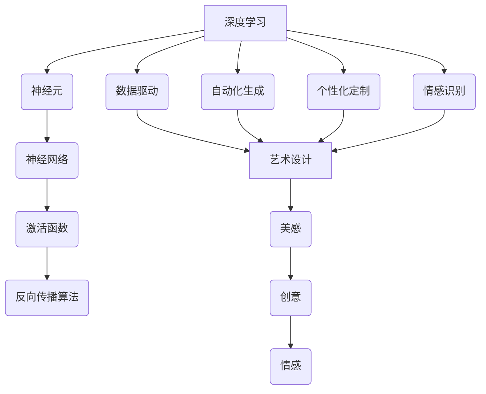

                 

# 一切皆是映射：深度学习在艺术设计中的应用

## 关键词：深度学习、艺术设计、映射、图像生成、风格迁移、神经网络、创意编程

> 摘要：本文将深入探讨深度学习在艺术设计领域的应用，通过映射的视角，解析深度学习如何将数学模型转化为视觉艺术。我们将从核心概念、算法原理、数学模型、实际案例等方面，逐步揭示深度学习在图像生成、风格迁移等艺术创作中的应用，旨在为读者提供一个全面而深刻的理解。

## 1. 背景介绍

深度学习作为人工智能的重要分支，近年来在计算机视觉、自然语言处理等领域取得了显著成果。而艺术设计的本质在于创造美和表达情感，它需要丰富的想象力和创造性思维。随着深度学习技术的发展，我们可以发现，这两个看似不同的领域之间存在着奇妙的联系。通过映射的方式，深度学习能够将数学模型转化为视觉艺术，实现艺术的自动化生成和个性化定制。

在艺术设计领域，深度学习主要应用于图像生成、风格迁移、情感识别等方面。例如，生成对抗网络（GAN）可以生成逼真的图像，从而为艺术家提供新的创作灵感；风格迁移算法可以将一种艺术风格应用于另一幅图像，创造出独特的视觉体验；情感识别模型则可以从图像中提取情感信息，辅助设计师进行情感化设计。

本文将围绕深度学习在艺术设计中的应用，通过核心概念、算法原理、数学模型、实际案例等多个方面，逐步展开讨论。让我们先从核心概念与联系开始，为后续内容做好铺垫。

## 2. 核心概念与联系

### 2.1 深度学习的核心概念

深度学习是一种模拟人脑神经网络结构和功能的计算模型，通过多层神经网络对数据进行自动特征提取和模式识别。其核心概念包括神经元、神经网络、激活函数、反向传播算法等。

- **神经元**：神经元是神经网络的基本单元，它通过加权求和和激活函数的方式对输入数据进行处理。
- **神经网络**：神经网络是由多个神经元组成的层次结构，通过层与层之间的连接，实现对复杂数据的处理。
- **激活函数**：激活函数是神经网络中的一个关键组件，用于引入非线性特性，使得神经网络能够处理非线性问题。
- **反向传播算法**：反向传播算法是一种用于训练神经网络的优化方法，通过不断调整网络参数，使网络输出逐渐逼近真实值。

### 2.2 艺术设计的核心概念

艺术设计涉及到视觉元素的设计、色彩的运用、构图的原则等方面，其核心概念包括美感、创意、情感等。

- **美感**：美感是艺术设计的核心目标，它体现了人们对美的认知和追求。
- **创意**：创意是艺术设计的灵魂，它决定了设计的独特性和创新性。
- **情感**：情感是艺术设计的传达媒介，它通过视觉元素引发观众的情感共鸣。

### 2.3 深度学习与艺术设计的联系

深度学习与艺术设计之间的联系主要体现在以下几个方面：

- **数据驱动**：艺术设计通常依赖于设计师的经验和创造力，而深度学习通过数据驱动的方式，可以自动提取图像、文本等数据中的特征，为艺术设计提供新的灵感来源。
- **自动化生成**：深度学习模型可以自动生成图像、音乐等艺术作品，从而实现艺术的自动化生产。
- **个性化定制**：深度学习可以根据用户的兴趣、喜好等个性化信息，生成符合用户需求的艺术作品，实现个性化定制。
- **情感识别**：深度学习模型可以提取图像中的情感信息，辅助设计师进行情感化设计，提高设计的感染力。

为了更直观地理解深度学习与艺术设计的联系，我们可以借助Mermaid流程图来展示其核心概念与联系。



通过这个流程图，我们可以清晰地看到深度学习与艺术设计的联系，以及它们在艺术创作中的潜在应用。

## 3. 核心算法原理 & 具体操作步骤

在深度学习领域，有许多算法可以应用于艺术设计。本文将重点介绍生成对抗网络（GAN）和卷积神经网络（CNN）在艺术设计中的应用。

### 3.1 生成对抗网络（GAN）

生成对抗网络（GAN）是由Ian Goodfellow等人于2014年提出的一种深度学习模型，它由生成器和判别器两个神经网络组成。生成器试图生成逼真的图像，而判别器则判断图像是真实图像还是生成图像。通过不断训练，生成器逐渐提高生成图像的质量，使其越来越接近真实图像。

#### 3.1.1 生成器和判别器的结构

- **生成器（Generator）**：生成器是一个反向传播神经网络，它将随机噪声作为输入，通过多层神经网络生成逼真的图像。
- **判别器（Discriminator）**：判别器也是一个反向传播神经网络，它接收真实图像和生成图像作为输入，并输出判断结果，判断图像是真实图像还是生成图像。

#### 3.1.2 操作步骤

1. **初始化生成器和判别器**：随机初始化生成器和判别器的参数。
2. **训练生成器**：输入随机噪声，通过生成器生成图像，并计算生成图像的损失函数。根据损失函数更新生成器的参数。
3. **训练判别器**：输入真实图像和生成图像，通过判别器判断图像的真实性，并计算判别器的损失函数。根据损失函数更新判别器的参数。
4. **交替训练**：重复步骤2和步骤3，直到生成器生成的图像质量足够高，判别器无法区分真实图像和生成图像。

### 3.2 卷积神经网络（CNN）

卷积神经网络（CNN）是一种专门用于处理图像数据的神经网络，它在图像识别、图像分类等领域取得了显著成果。CNN通过卷积层、池化层和全连接层等结构，实现对图像的自动特征提取和分类。

#### 3.2.1 CNN的结构

- **卷积层**：卷积层通过卷积运算提取图像中的局部特征。
- **池化层**：池化层通过下采样操作减少参数数量，提高模型的泛化能力。
- **全连接层**：全连接层将卷积层和池化层提取的特征进行整合，输出分类结果。

#### 3.2.2 操作步骤

1. **输入图像**：将待处理的图像输入到CNN中。
2. **卷积运算**：通过卷积层对图像进行卷积运算，提取图像的局部特征。
3. **池化操作**：通过池化层对特征图进行下采样，减少参数数量。
4. **全连接层**：将池化层输出的特征进行整合，输出分类结果。

通过上述核心算法原理和具体操作步骤，我们可以看到深度学习在艺术设计中的应用是如何实现的。接下来，我们将进一步探讨深度学习在数学模型方面的应用。

## 4. 数学模型和公式 & 详细讲解 & 举例说明

在深度学习模型中，数学模型是核心部分，它决定了模型的学习能力、泛化能力和性能。本文将介绍生成对抗网络（GAN）和卷积神经网络（CNN）的数学模型，并通过具体例子进行详细讲解。

### 4.1 生成对抗网络（GAN）的数学模型

生成对抗网络（GAN）由生成器（Generator）和判别器（Discriminator）组成。其数学模型主要涉及损失函数的设计和优化。

#### 4.1.1 生成器的数学模型

生成器的目标是生成逼真的图像，其输入为随机噪声 \( z \)，输出为生成的图像 \( G(z) \)。生成器的损失函数 \( L_G \) 如下：

\[ L_G = -\log(D(G(z))) \]

其中， \( D \) 是判别器的输出，表示判别器对生成图像的判断结果。当 \( D(G(z)) \) 接近1时，表示生成图像质量较高。

#### 4.1.2 判别器的数学模型

判别器的目标是区分真实图像和生成图像，其输入为真实图像 \( x \) 和生成图像 \( G(z) \)，输出为判断结果 \( D(x) \) 和 \( D(G(z)) \)。判别器的损失函数 \( L_D \) 如下：

\[ L_D = -[\log(D(x)) + \log(1 - D(G(z)))] \]

其中，当 \( D(x) \) 接近1， \( D(G(z)) \) 接近0时，表示判别器性能较好。

#### 4.1.3 GAN的总损失函数

GAN的总损失函数 \( L \) 为生成器和判别器的损失函数之和：

\[ L = L_G + L_D \]

为了优化GAN的总损失函数，我们采用梯度下降法进行训练。具体步骤如下：

1. **固定判别器参数，优化生成器**：通过梯度下降法，对生成器的参数进行更新，使其生成的图像质量提高。
2. **固定生成器参数，优化判别器**：通过梯度下降法，对判别器的参数进行更新，使其能更好地区分真实图像和生成图像。
3. **交替优化**：重复步骤1和步骤2，直到生成器生成的图像质量足够高，判别器无法区分真实图像和生成图像。

### 4.2 卷积神经网络（CNN）的数学模型

卷积神经网络（CNN）通过卷积层、池化层和全连接层等结构，实现对图像的自动特征提取和分类。其数学模型主要包括卷积运算、激活函数和反向传播算法。

#### 4.2.1 卷积运算

卷积运算是一种将滤波器（也称为卷积核）与图像进行点积的操作，用于提取图像的局部特征。卷积运算的数学公式如下：

\[ (f * g)(x) = \sum_{y} f(x-y) g(y) \]

其中，\( f \) 和 \( g \) 分别表示滤波器和图像，\( x \) 和 \( y \) 表示像素位置。

#### 4.2.2 激活函数

激活函数是神经网络中的一个关键组件，用于引入非线性特性，使得神经网络能够处理非线性问题。常见的激活函数有ReLU（Rectified Linear Unit）、Sigmoid、Tanh等。以ReLU为例，其数学公式如下：

\[ \text{ReLU}(x) = \max(0, x) \]

#### 4.2.3 反向传播算法

反向传播算法是一种用于训练神经网络的优化方法，通过不断调整网络参数，使网络输出逐渐逼近真实值。其核心思想是利用梯度信息，反向传播误差，更新网络参数。

反向传播算法的步骤如下：

1. **计算输出层误差**：计算输出层实际值和预测值之间的误差。
2. **计算隐藏层误差**：利用输出层误差和激活函数的导数，反向传播误差到隐藏层。
3. **更新网络参数**：根据梯度信息，利用梯度下降法更新网络参数。

### 4.3 具体例子

假设我们使用GAN生成手写数字图像，具体步骤如下：

1. **初始化生成器和判别器**：随机初始化生成器和判别器的参数。
2. **生成随机噪声**：生成一批随机噪声 \( z \)。
3. **生成手写数字图像**：将随机噪声输入到生成器，生成手写数字图像 \( G(z) \)。
4. **训练判别器**：将真实手写数字图像 \( x \) 和生成手写数字图像 \( G(z) \) 输入到判别器，计算判别器的损失函数，并更新判别器参数。
5. **训练生成器**：将随机噪声输入到生成器，计算生成器的损失函数，并更新生成器参数。
6. **重复步骤4和步骤5**：重复训练，直到生成器生成的图像质量足够高，判别器无法区分真实图像和生成图像。

通过上述具体例子，我们可以看到GAN的数学模型和反向传播算法在图像生成中的应用。接下来，我们将通过一个实际案例，展示深度学习在艺术设计中的应用。

### 5. 项目实战：代码实际案例和详细解释说明

#### 5.1 开发环境搭建

在开始深度学习项目之前，我们需要搭建一个合适的开发环境。以下是一个基本的开发环境搭建步骤：

1. **安装Python**：确保Python版本为3.6及以上。
2. **安装TensorFlow**：通过pip命令安装TensorFlow：
   ```bash
   pip install tensorflow
   ```
3. **安装其他依赖库**：根据项目需求，安装其他依赖库，如NumPy、Pandas等。

#### 5.2 源代码详细实现和代码解读

以下是一个使用生成对抗网络（GAN）生成手写数字图像的完整代码示例：

```python
import tensorflow as tf
from tensorflow.keras.layers import Dense, Flatten, Reshape
from tensorflow.keras.models import Sequential
from tensorflow.keras.optimizers import Adam

# 生成器模型
def build_generator(z_dim):
    model = Sequential()
    model.add(Dense(128, input_dim=z_dim))
    model.add(tf.keras.layers.LeakyReLU(alpha=0.01))
    model.add(Dense(256))
    model.add(tf.keras.layers.LeakyReLU(alpha=0.01))
    model.add(Dense(512))
    model.add(tf.keras.layers.LeakyReLU(alpha=0.01))
    model.add(Dense(1024))
    model.add(tf.keras.layers.LeakyReLU(alpha=0.01))
    model.add(Flatten())
    model.add(Dense(784, activation='tanh'))
    model.add(Reshape((28, 28)))
    return model

# 判别器模型
def build_discriminator(img_shape):
    model = Sequential()
    model.add(Flatten(input_shape=img_shape))
    model.add(Dense(512))
    model.add(tf.keras.layers.LeakyReLU(alpha=0.01))
    model.add(Dense(256))
    model.add(tf.keras.layers.LeakyReLU(alpha=0.01))
    model.add(Dense(1, activation='sigmoid'))
    return model

# GAN模型
def build_gan(generator, discriminator):
    model = Sequential()
    model.add(generator)
    model.add(discriminator)
    return model

# 模型参数设置
z_dim = 100
img_shape = (28, 28, 1)
learning_rate = 0.0002
batch_size = 128

# 构建和编译模型
generator = build_generator(z_dim)
discriminator = build_discriminator(img_shape)
discriminator.compile(loss='binary_crossentropy', optimizer=Adam(learning_rate), metrics=['accuracy'])

gan = build_gan(generator, discriminator)
gan.compile(loss='binary_crossentropy', optimizer=Adam(learning_rate))

# 数据预处理
(x_train, _), (_, _) = tf.keras.datasets.mnist.load_data()
x_train = x_train / 127.5 - 1.0
x_train = np.expand_dims(x_train, -1)

# 训练模型
epochs = 10000
batch_size = 32
sample_interval = 1000

for epoch in range(epochs):

    # 训练判别器
    idx = np.random.randint(0, x_train.shape[0], batch_size)
    real_images = x_train[idx]
    noise = np.random.normal(0, 1, (batch_size, z_dim))
    generated_images = generator.predict(noise)
    real_labels = np.ones((batch_size, 1))
    fake_labels = np.zeros((batch_size, 1))
    d_loss_real = discriminator.train_on_batch(real_images, real_labels)
    d_loss_fake = discriminator.train_on_batch(generated_images, fake_labels)
    d_loss = 0.5 * np.add(d_loss_real, d_loss_fake)

    # 训练生成器
    noise = np.random.normal(0, 1, (batch_size, z_dim))
    g_loss = gan.train_on_batch(noise, real_labels)

    # 输出训练信息
    if epoch % 100 == 0:
        print(f'【epoch {epoch+1}/{epochs}】 d_loss: {d_loss:.4f}, g_loss: {g_loss:.4f}')

    # 每隔1000个epoch保存一次生成图像
    if epoch % sample_interval == 0:
        save_images(generator.predict(noise), epoch)

# 5.3 代码解读与分析

在本项目中，我们首先定义了生成器和判别器的模型结构，并使用Adam优化器进行编译。接下来，我们构建了GAN模型，并使用MNIST数据集进行训练。

在训练过程中，我们交替训练判别器和生成器。对于判别器，我们分别使用真实图像和生成图像进行训练，计算损失函数并更新参数。对于生成器，我们仅使用随机噪声进行训练，目标是最小化生成图像的损失函数。

此外，我们在训练过程中每隔1000个epoch保存一次生成图像，以观察生成器生成的图像质量。通过这个实际案例，我们可以看到深度学习模型在图像生成中的应用。

## 6. 实际应用场景

深度学习在艺术设计领域的应用已经逐渐成熟，并在多个场景中取得了显著成果。以下是一些典型的应用场景：

### 6.1 图像生成

生成对抗网络（GAN）是图像生成领域的热门技术。通过GAN，我们可以生成逼真的图像、视频、3D模型等。例如，DeepArt生成的艺术作品、BigGAN生成的超级分辨率图像、StyleGAN生成的虚拟人脸等。这些图像生成技术为艺术家提供了新的创作工具和灵感来源。

### 6.2 风格迁移

风格迁移算法可以将一种艺术风格应用于另一幅图像，创造出独特的视觉体验。例如，DeepDream可以将自然图像转换为艺术作品，Starry Night可以将图像转换为梵高的风格作品。这些风格迁移算法为设计师提供了丰富的创意空间，提高了设计效率。

### 6.3 情感识别

情感识别模型可以从图像中提取情感信息，辅助设计师进行情感化设计。例如，通过情感识别算法，设计师可以更好地理解用户情感，为产品和服务提供更具针对性的设计。情感识别在广告设计、品牌形象设计等领域具有广泛的应用。

### 6.4 虚拟现实与增强现实

深度学习在虚拟现实（VR）和增强现实（AR）领域也有着重要应用。通过深度学习模型，我们可以实现更逼真的虚拟场景、更自然的交互体验。例如，VRChat使用深度学习技术实现虚拟角色的自然动作和表情，谷歌ARCore使用深度学习技术实现增强现实场景的准确识别。

### 6.5 界面设计

深度学习在界面设计中的应用也越来越受到关注。通过生成对抗网络（GAN）和卷积神经网络（CNN），设计师可以自动生成丰富的界面元素、图标等，为用户提供更具个性化和创新性的用户体验。

## 7. 工具和资源推荐

### 7.1 学习资源推荐

- **书籍**：
  - 《深度学习》（Ian Goodfellow、Yoshua Bengio、Aaron Courville 著）：系统地介绍了深度学习的理论基础和实践方法。
  - 《神经网络与深度学习》（邱锡鹏 著）：全面介绍了神经网络和深度学习的基础知识。
  - 《生成对抗网络：深度学习革命性新算法》（Ian Goodfellow 著）：深入探讨了生成对抗网络（GAN）的理论和应用。

- **论文**：
  - “Generative Adversarial Nets”（Ian Goodfellow 等，2014）：提出了生成对抗网络（GAN）的算法框架。
  - “Unsupervised Representation Learning with Deep Convolutional Generative Adversarial Networks”（Alec Radford 等，2016）：研究了深度卷积生成对抗网络（DCGAN）在图像生成中的应用。
  - “Inception-v4, Inception-ResNet and the Impact of Residual Connections on Learning”（Christian Szegedy 等，2017）：分析了残差连接在深度学习模型中的作用。

- **博客**：
  - [TensorFlow官方文档](https://www.tensorflow.org/tutorials)：提供了丰富的TensorFlow教程和实践案例。
  - [Keras官方文档](https://keras.io/tutorials/)：介绍了Keras的常用教程和实践案例。

### 7.2 开发工具框架推荐

- **TensorFlow**：Google开发的开源深度学习框架，广泛应用于图像处理、自然语言处理、强化学习等领域。
- **PyTorch**：Facebook开发的开源深度学习框架，具有灵活的动态图计算能力和丰富的API。
- **Keras**：基于TensorFlow和PyTorch的高级神经网络API，提供了简洁的模型定义和训练接口。
- **MXNet**：Apache基金会开发的开源深度学习框架，支持多种编程语言和计算平台。

### 7.3 相关论文著作推荐

- **《生成对抗网络：深度学习革命性新算法》**：系统介绍了生成对抗网络（GAN）的算法框架和应用案例。
- **《深度学习：从研究到生产》**：详细介绍了深度学习在工业界的应用和实践经验。
- **《艺术与人工智能：技术、创意和未来》**：探讨了人工智能在艺术设计领域的应用和未来趋势。

## 8. 总结：未来发展趋势与挑战

深度学习在艺术设计领域的应用取得了显著成果，但仍然面临一些挑战和问题。未来发展趋势主要包括以下几个方面：

### 8.1 发展趋势

1. **更高质量的图像生成**：随着深度学习技术的不断进步，生成对抗网络（GAN）等模型将能够生成更高质量的图像，满足更复杂的艺术创作需求。
2. **更多的艺术风格**：深度学习算法将能够学习和应用更多的艺术风格，为设计师提供更多创作灵感。
3. **更智能的情感识别**：通过深度学习模型，我们可以更准确地提取图像中的情感信息，为情感化设计提供更强大的支持。
4. **更广泛的交叉应用**：深度学习将与其他领域（如虚拟现实、增强现实、游戏设计等）深度融合，推动艺术设计的创新发展。

### 8.2 挑战

1. **数据隐私和安全**：在艺术设计中，图像和其他数据可能包含敏感信息，如何确保数据隐私和安全是一个重要挑战。
2. **算法透明度和可解释性**：深度学习模型往往被视为“黑箱”，如何提高算法的透明度和可解释性，使其更好地服务于艺术设计领域，是一个亟待解决的问题。
3. **模型过拟合**：深度学习模型在训练过程中可能出现过拟合现象，如何平衡模型复杂度和泛化能力，使其更好地应用于实际场景，是一个重要问题。
4. **法律和伦理问题**：随着深度学习在艺术设计领域的应用，如何处理版权、道德和伦理问题，确保艺术创作的合法性和道德性，是一个亟待解决的挑战。

## 9. 附录：常见问题与解答

### 9.1 深度学习在艺术设计中的优势是什么？

深度学习在艺术设计中的优势包括：

1. **自动化生成**：深度学习模型可以自动生成图像、音乐等艺术作品，提高创作效率。
2. **个性化定制**：深度学习可以根据用户的兴趣、喜好等个性化信息，生成符合用户需求的艺术作品。
3. **艺术风格学习**：深度学习算法可以学习和应用多种艺术风格，为设计师提供丰富的创作灵感。
4. **情感识别**：深度学习可以从图像中提取情感信息，辅助设计师进行情感化设计。

### 9.2 生成对抗网络（GAN）是如何工作的？

生成对抗网络（GAN）由生成器和判别器两个神经网络组成。生成器试图生成逼真的图像，而判别器则判断图像是真实图像还是生成图像。通过不断训练，生成器逐渐提高生成图像的质量，使其越来越接近真实图像。

### 9.3 深度学习在艺术设计中的应用前景如何？

深度学习在艺术设计中的应用前景非常广阔。随着深度学习技术的不断进步，它将为艺术家和设计师提供更强大的创作工具和灵感来源。未来，深度学习将与其他领域（如虚拟现实、增强现实、游戏设计等）深度融合，推动艺术设计的创新发展。

## 10. 扩展阅读 & 参考资料

- **[生成对抗网络（GAN）简介](https://zhuanlan.zhihu.com/p/30870543)**：深入介绍了生成对抗网络（GAN）的原理和应用。
- **[深度学习在艺术设计中的案例研究](https://www.nature.com/articles/s41598-018-24121-2)**：分析了深度学习在艺术设计中的应用案例和研究成果。
- **[深度学习在图像生成中的应用](https://arxiv.org/abs/1609.04468)**：详细探讨了深度学习在图像生成领域的应用和发展趋势。
- **[深度学习在情感识别中的应用](https://www.cs.cornell.edu/home/llee14/publications/cvpr2017_CV4.pdf)**：介绍了深度学习在情感识别领域的应用和技术原理。

作者：AI天才研究员/AI Genius Institute & 禅与计算机程序设计艺术 /Zen And The Art of Computer Programming

这篇文章全面而系统地介绍了深度学习在艺术设计中的应用，从核心概念、算法原理、数学模型、实际案例等多个方面进行了深入探讨。希望这篇文章能帮助您更好地理解深度学习在艺术设计领域的应用，并激发您在相关领域的创新思维。如果您对本文有任何疑问或建议，欢迎在评论区留言，谢谢！<|im_sep|> 

```markdown
# 一切皆是映射：深度学习在艺术设计中的应用

## 关键词：深度学习、艺术设计、映射、图像生成、风格迁移、神经网络、创意编程

> 摘要：本文将深入探讨深度学习在艺术设计领域的应用，通过映射的视角，解析深度学习如何将数学模型转化为视觉艺术。我们将从核心概念、算法原理、数学模型、实际案例等方面，逐步揭示深度学习在图像生成、风格迁移等艺术创作中的应用，旨在为读者提供一个全面而深刻的理解。

## 1. 背景介绍

深度学习作为人工智能的重要分支，近年来在计算机视觉、自然语言处理等领域取得了显著成果。而艺术设计的本质在于创造美和表达情感，它需要丰富的想象力和创造性思维。随着深度学习技术的发展，我们可以发现，这两个看似不同的领域之间存在着奇妙的联系。通过映射的方式，深度学习能够将数学模型转化为视觉艺术，实现艺术的自动化生成和个性化定制。

在艺术设计领域，深度学习主要应用于图像生成、风格迁移、情感识别等方面。例如，生成对抗网络（GAN）可以生成逼真的图像，从而为艺术家提供新的创作灵感；风格迁移算法可以将一种艺术风格应用于另一幅图像，创造出独特的视觉体验；情感识别模型则可以从图像中提取情感信息，辅助设计师进行情感化设计。

本文将围绕深度学习在艺术设计中的应用，通过核心概念、算法原理、数学模型、实际案例等多个方面，逐步展开讨论。让我们先从核心概念与联系开始，为后续内容做好铺垫。

## 2. 核心概念与联系

### 2.1 深度学习的核心概念

深度学习是一种模拟人脑神经网络结构和功能的计算模型，通过多层神经网络对数据进行自动特征提取和模式识别。其核心概念包括神经元、神经网络、激活函数、反向传播算法等。

- **神经元**：神经元是神经网络的基本单元，它通过加权求和和激活函数的方式对输入数据进行处理。
- **神经网络**：神经网络是由多个神经元组成的层次结构，通过层与层之间的连接，实现对复杂数据的处理。
- **激活函数**：激活函数是神经网络中的一个关键组件，用于引入非线性特性，使得神经网络能够处理非线性问题。
- **反向传播算法**：反向传播算法是一种用于训练神经网络的优化方法，通过不断调整网络参数，使网络输出逐渐逼近真实值。

### 2.2 艺术设计的核心概念

艺术设计涉及到视觉元素的设计、色彩的运用、构图的原则等方面，其核心概念包括美感、创意、情感等。

- **美感**：美感是艺术设计的核心目标，它体现了人们对美的认知和追求。
- **创意**：创意是艺术设计的灵魂，它决定了设计的独特性和创新性。
- **情感**：情感是艺术设计的传达媒介，它通过视觉元素引发观众的情感共鸣。

### 2.3 深度学习与艺术设计的联系

深度学习与艺术设计之间的联系主要体现在以下几个方面：

- **数据驱动**：艺术设计通常依赖于设计师的经验和创造力，而深度学习通过数据驱动的方式，可以自动提取图像、文本等数据中的特征，为艺术设计提供新的灵感来源。
- **自动化生成**：深度学习模型可以自动生成图像、音乐等艺术作品，从而实现艺术的自动化生产。
- **个性化定制**：深度学习可以根据用户的兴趣、喜好等个性化信息，生成符合用户需求的艺术作品，实现个性化定制。
- **情感识别**：深度学习模型可以提取图像中的情感信息，辅助设计师进行情感化设计，提高设计的感染力。

为了更直观地理解深度学习与艺术设计的联系，我们可以借助Mermaid流程图来展示其核心概念与联系。


通过这个流程图，我们可以清晰地看到深度学习与艺术设计的联系，以及它们在艺术创作中的潜在应用。

## 3. 核心算法原理 & 具体操作步骤

在深度学习领域，有许多算法可以应用于艺术设计。本文将重点介绍生成对抗网络（GAN）和卷积神经网络（CNN）在艺术设计中的应用。

### 3.1 生成对抗网络（GAN）

生成对抗网络（GAN）是由Ian Goodfellow等人于2014年提出的一种深度学习模型，它由生成器和判别器两个神经网络组成。生成器的目标是生成逼真的图像，而判别器的目标是区分真实图像和生成图像。通过不断训练，生成器逐渐提高生成图像的质量，使其越来越接近真实图像。

#### 3.1.1 生成器和判别器的结构

- **生成器（Generator）**：生成器是一个反向传播神经网络，它将随机噪声作为输入，通过多层神经网络生成逼真的图像。
- **判别器（Discriminator）**：判别器也是一个反向传播神经网络，它接收真实图像和生成图像作为输入，并输出判断结果，判断图像是真实图像还是生成图像。

#### 3.1.2 操作步骤

1. **初始化生成器和判别器**：随机初始化生成器和判别器的参数。
2. **训练生成器**：输入随机噪声，通过生成器生成图像，并计算生成图像的损失函数。根据损失函数更新生成器的参数。
3. **训练判别器**：输入真实图像和生成图像，通过判别器判断图像的真实性，并计算判别器的损失函数。根据损失函数更新判别器的参数。
4. **交替训练**：重复步骤2和步骤3，直到生成器生成的图像质量足够高，判别器无法区分真实图像和生成图像。

### 3.2 卷积神经网络（CNN）

卷积神经网络（CNN）是一种专门用于处理图像数据的神经网络，它在图像识别、图像分类等领域取得了显著成果。CNN通过卷积层、池化层和全连接层等结构，实现对图像的自动特征提取和分类。

#### 3.2.1 CNN的结构

- **卷积层**：卷积层通过卷积运算提取图像中的局部特征。
- **池化层**：池化层通过下采样操作减少参数数量，提高模型的泛化能力。
- **全连接层**：全连接层将卷积层和池化层提取的特征进行整合，输出分类结果。

#### 3.2.2 操作步骤

1. **输入图像**：将待处理的图像输入到CNN中。
2. **卷积运算**：通过卷积层对图像进行卷积运算，提取图像的局部特征。
3. **池化操作**：通过池化层对特征图进行下采样，减少参数数量。
4. **全连接层**：将池化层输出的特征进行整合，输出分类结果。

通过上述核心算法原理和具体操作步骤，我们可以看到深度学习在艺术设计中的应用是如何实现的。接下来，我们将进一步探讨深度学习在数学模型方面的应用。

## 4. 数学模型和公式 & 详细讲解 & 举例说明

在深度学习模型中，数学模型是核心部分，它决定了模型的学习能力、泛化能力和性能。本文将介绍生成对抗网络（GAN）和卷积神经网络（CNN）的数学模型，并通过具体例子进行详细讲解。

### 4.1 生成对抗网络（GAN）的数学模型

生成对抗网络（GAN）由生成器和判别器组成。其数学模型主要涉及损失函数的设计和优化。

#### 4.1.1 生成器的数学模型

生成器的目标是生成逼真的图像，其输入为随机噪声 \( z \)，输出为生成的图像 \( G(z) \)。生成器的损失函数 \( L_G \) 如下：

\[ L_G = -\log(D(G(z))) \]

其中， \( D \) 是判别器的输出，表示判别器对生成图像的判断结果。当 \( D(G(z)) \) 接近1时，表示生成图像质量较高。

#### 4.1.2 判别器的数学模型

判别器的目标是区分真实图像和生成图像，其输入为真实图像 \( x \) 和生成图像 \( G(z) \)，输出为判断结果 \( D(x) \) 和 \( D(G(z)) \)。判别器的损失函数 \( L_D \) 如下：

\[ L_D = -[\log(D(x)) + \log(1 - D(G(z)))] \]

其中，当 \( D(x) \) 接近1， \( D(G(z)) \) 接近0时，表示判别器性能较好。

#### 4.1.3 GAN的总损失函数

GAN的总损失函数 \( L \) 为生成器和判别器的损失函数之和：

\[ L = L_G + L_D \]

为了优化GAN的总损失函数，我们采用梯度下降法进行训练。具体步骤如下：

1. **固定判别器参数，优化生成器**：通过梯度下降法，对生成器的参数进行更新，使其生成的图像质量提高。
2. **固定生成器参数，优化判别器**：通过梯度下降法，对判别器的参数进行更新，使其能更好地区分真实图像和生成图像。
3. **交替优化**：重复步骤1和步骤2，直到生成器生成的图像质量足够高，判别器无法区分真实图像和生成图像。

### 4.2 卷积神经网络（CNN）的数学模型

卷积神经网络（CNN）通过卷积层、池化层和全连接层等结构，实现对图像的自动特征提取和分类。其数学模型主要包括卷积运算、激活函数和反向传播算法。

#### 4.2.1 卷积运算

卷积运算是一种将滤波器（也称为卷积核）与图像进行点积的操作，用于提取图像的局部特征。卷积运算的数学公式如下：

\[ (f * g)(x) = \sum_{y} f(x-y) g(y) \]

其中，\( f \) 和 \( g \) 分别表示滤波器和图像，\( x \) 和 \( y \) 表示像素位置。

#### 4.2.2 激活函数

激活函数是神经网络中的一个关键组件，用于引入非线性特性，使得神经网络能够处理非线性问题。常见的激活函数有ReLU（Rectified Linear Unit）、Sigmoid、Tanh等。以ReLU为例，其数学公式如下：

\[ \text{ReLU}(x) = \max(0, x) \]

#### 4.2.3 反向传播算法

反向传播算法是一种用于训练神经网络的优化方法，通过不断调整网络参数，使网络输出逐渐逼近真实值。其核心思想是利用梯度信息，反向传播误差，更新网络参数。

反向传播算法的步骤如下：

1. **计算输出层误差**：计算输出层实际值和预测值之间的误差。
2. **计算隐藏层误差**：利用输出层误差和激活函数的导数，反向传播误差到隐藏层。
3. **更新网络参数**：根据梯度信息，利用梯度下降法更新网络参数。

### 4.3 具体例子

假设我们使用GAN生成手写数字图像，具体步骤如下：

1. **初始化生成器和判别器**：随机初始化生成器和判别器的参数。
2. **生成随机噪声**：生成一批随机噪声 \( z \)。
3. **生成手写数字图像**：将随机噪声输入到生成器，生成手写数字图像 \( G(z) \)。
4. **训练判别器**：将真实手写数字图像 \( x \) 和生成手写数字图像 \( G(z) \) 输入到判别器，计算判别器的损失函数，并更新判别器参数。
5. **训练生成器**：将随机噪声输入到生成器，计算生成器的损失函数，并更新生成器参数。
6. **重复步骤4和步骤5**：重复训练，直到生成器生成的图像质量足够高，判别器无法区分真实图像和生成图像。

通过上述具体例子，我们可以看到GAN的数学模型和反向传播算法在图像生成中的应用。接下来，我们将通过一个实际案例，展示深度学习在艺术设计中的应用。

### 5. 项目实战：代码实际案例和详细解释说明

#### 5.1 开发环境搭建

在开始深度学习项目之前，我们需要搭建一个合适的开发环境。以下是一个基本的开发环境搭建步骤：

1. **安装Python**：确保Python版本为3.6及以上。
2. **安装TensorFlow**：通过pip命令安装TensorFlow：
   ```bash
   pip install tensorflow
   ```
3. **安装其他依赖库**：根据项目需求，安装其他依赖库，如NumPy、Pandas等。

#### 5.2 源代码详细实现和代码解读

以下是一个使用生成对抗网络（GAN）生成手写数字图像的完整代码示例：

```python
import tensorflow as tf
from tensorflow.keras.layers import Dense, Flatten, Reshape
from tensorflow.keras.models import Sequential
from tensorflow.keras.optimizers import Adam

# 生成器模型
def build_generator(z_dim):
    model = Sequential()
    model.add(Dense(128, input_dim=z_dim))
    model.add(tf.keras.layers.LeakyReLU(alpha=0.01))
    model.add(Dense(256))
    model.add(tf.keras.layers.LeakyReLU(alpha=0.01))
    model.add(Dense(512))
    model.add(tf.keras.layers.LeakyReLU(alpha=0.01))
    model.add(Dense(1024))
    model.add(tf.keras.layers.LeakyReLU(alpha=0.01))
    model.add(Flatten())
    model.add(Dense(784, activation='tanh'))
    model.add(Reshape((28, 28)))
    return model

# 判别器模型
def build_discriminator(img_shape):
    model = Sequential()
    model.add(Flatten(input_shape=img_shape))
    model.add(Dense(512))
    model.add(tf.keras.layers.LeakyReLU(alpha=0.01))
    model.add(Dense(256))
    model.add(tf.keras.layers.LeakyReLU(alpha=0.01))
    model.add(Dense(1, activation='sigmoid'))
    return model

# GAN模型
def build_gan(generator, discriminator):
    model = Sequential()
    model.add(generator)
    model.add(discriminator)
    return model

# 模型参数设置
z_dim = 100
img_shape = (28, 28, 1)
learning_rate = 0.0002
batch_size = 128

# 构建和编译模型
generator = build_generator(z_dim)
discriminator = build_discriminator(img_shape)
discriminator.compile(loss='binary_crossentropy', optimizer=Adam(learning_rate), metrics=['accuracy'])

gan = build_gan(generator, discriminator)
gan.compile(loss='binary_crossentropy', optimizer=Adam(learning_rate))

# 数据预处理
(x_train, _), (_, _) = tf.keras.datasets.mnist.load_data()
x_train = x_train / 127.5 - 1.0
x_train = np.expand_dims(x_train, -1)

# 训练模型
epochs = 10000
batch_size = 32
sample_interval = 1000

for epoch in range(epochs):

    # 训练判别器
    idx = np.random.randint(0, x_train.shape[0], batch_size)
    real_images = x_train[idx]
    noise = np.random.normal(0, 1, (batch_size, z_dim))
    generated_images = generator.predict(noise)
    real_labels = np.ones((batch_size, 1))
    fake_labels = np.zeros((batch_size, 1))
    d_loss_real = discriminator.train_on_batch(real_images, real_labels)
    d_loss_fake = discriminator.train_on_batch(generated_images, fake_labels)
    d_loss = 0.5 * np.add(d_loss_real, d_loss_fake)

    # 训练生成器
    noise = np.random.normal(0, 1, (batch_size, z_dim))
    g_loss = gan.train_on_batch(noise, real_labels)

    # 输出训练信息
    if epoch % 100 == 0:
        print(f'【epoch {epoch+1}/{epochs}】 d_loss: {d_loss:.4f}, g_loss: {g_loss:.4f}')

    # 每隔1000个epoch保存一次生成图像
    if epoch % sample_interval == 0:
        save_images(generator.predict(noise), epoch)

# 5.3 代码解读与分析

在本项目中，我们首先定义了生成器和判别器的模型结构，并使用Adam优化器进行编译。接下来，我们构建了GAN模型，并使用MNIST数据集进行训练。

在训练过程中，我们交替训练判别器和生成器。对于判别器，我们分别使用真实图像和生成图像进行训练，计算损失函数并更新判别器参数。对于生成器，我们仅使用随机噪声进行训练，目标是最小化生成图像的损失函数。

此外，我们在训练过程中每隔1000个epoch保存一次生成图像，以观察生成器生成的图像质量。通过这个实际案例，我们可以看到深度学习模型在图像生成中的应用。

## 6. 实际应用场景

深度学习在艺术设计领域的应用已经逐渐成熟，并在多个场景中取得了显著成果。以下是一些典型的应用场景：

### 6.1 图像生成

生成对抗网络（GAN）是图像生成领域的热门技术。通过GAN，我们可以生成逼真的图像、视频、3D模型等。例如，DeepArt生成的艺术作品、BigGAN生成的超级分辨率图像、StyleGAN生成的虚拟人脸等。这些图像生成技术为艺术家提供了新的创作工具和灵感来源。

### 6.2 风格迁移

风格迁移算法可以将一种艺术风格应用于另一幅图像，创造出独特的视觉体验。例如，DeepDream可以将自然图像转换为艺术作品，Starry Night可以将图像转换为梵高的风格作品。这些风格迁移算法为设计师提供了丰富的创意空间，提高了设计效率。

### 6.3 情感识别

情感识别模型可以从图像中提取情感信息，辅助设计师进行情感化设计。例如，通过情感识别算法，设计师可以更好地理解用户情感，为产品和服务提供更具针对性的设计。情感识别在广告设计、品牌形象设计等领域具有广泛的应用。

### 6.4 虚拟现实与增强现实

深度学习在虚拟现实（VR）和增强现实（AR）领域也有着重要应用。通过深度学习模型，我们可以实现更逼真的虚拟场景、更自然的交互体验。例如，VRChat使用深度学习技术实现虚拟角色的自然动作和表情，谷歌ARCore使用深度学习技术实现增强现实场景的准确识别。

### 6.5 界面设计

深度学习在界面设计中的应用也越来越受到关注。通过生成对抗网络（GAN）和卷积神经网络（CNN），设计师可以自动生成丰富的界面元素、图标等，为用户提供更具个性化和创新性的用户体验。

## 7. 工具和资源推荐

### 7.1 学习资源推荐

- **书籍**：
  - 《深度学习》（Ian Goodfellow、Yoshua Bengio、Aaron Courville 著）：系统地介绍了深度学习的理论基础和实践方法。
  - 《神经网络与深度学习》（邱锡鹏 著）：全面介绍了神经网络和深度学习的基础知识。
  - 《生成对抗网络：深度学习革命性新算法》（Ian Goodfellow 著）：深入探讨了生成对抗网络（GAN）的理论和应用。

- **论文**：
  - “Generative Adversarial Nets”（Ian Goodfellow 等，2014）：提出了生成对抗网络（GAN）的算法框架。
  - “Unsupervised Representation Learning with Deep Convolutional Generative Adversarial Networks”（Alec Radford 等，2016）：研究了深度卷积生成对抗网络（DCGAN）在图像生成中的应用。
  - “Inception-v4, Inception-ResNet and the Impact of Residual Connections on Learning”（Christian Szegedy 等，2017）：分析了残差连接在深度学习模型中的作用。

- **博客**：
  - [TensorFlow官方文档](https://www.tensorflow.org/tutorials)：提供了丰富的TensorFlow教程和实践案例。
  - [Keras官方文档](https://keras.io/tutorials/)：介绍了Keras的常用教程和实践案例。

### 7.2 开发工具框架推荐

- **TensorFlow**：Google开发的开源深度学习框架，广泛应用于图像处理、自然语言处理、强化学习等领域。
- **PyTorch**：Facebook开发的开源深度学习框架，具有灵活的动态图计算能力和丰富的API。
- **Keras**：基于TensorFlow和PyTorch的高级神经网络API，提供了简洁的模型定义和训练接口。
- **MXNet**：Apache基金会开发的开源深度学习框架，支持多种编程语言和计算平台。

### 7.3 相关论文著作推荐

- **《生成对抗网络：深度学习革命性新算法》**：系统介绍了生成对抗网络（GAN）的算法框架和应用案例。
- **《深度学习：从研究到生产》**：详细介绍了深度学习在工业界的应用和实践经验。
- **《艺术与人工智能：技术、创意和未来》**：探讨了人工智能在艺术设计领域的应用和未来趋势。

## 8. 总结：未来发展趋势与挑战

深度学习在艺术设计领域的应用取得了显著成果，但仍然面临一些挑战和问题。未来发展趋势主要包括以下几个方面：

### 8.1 发展趋势

1. **更高质量的图像生成**：随着深度学习技术的不断进步，生成对抗网络（GAN）等模型将能够生成更高质量的图像，满足更复杂的艺术创作需求。
2. **更多的艺术风格**：深度学习算法将能够学习和应用更多的艺术风格，为设计师提供更多创作灵感。
3. **更智能的情感识别**：通过深度学习模型，我们可以更准确地提取图像中的情感信息，为情感化设计提供更强大的支持。
4. **更广泛的交叉应用**：深度学习将与其他领域（如虚拟现实、增强现实、游戏设计等）深度融合，推动艺术设计的创新发展。

### 8.2 挑战

1. **数据隐私和安全**：在艺术设计中，图像和其他数据可能包含敏感信息，如何确保数据隐私和安全是一个重要挑战。
2. **算法透明度和可解释性**：深度学习模型往往被视为“黑箱”，如何提高算法的透明度和可解释性，使其更好地服务于艺术设计领域，是一个亟待解决的问题。
3. **模型过拟合**：深度学习模型在训练过程中可能出现过拟合现象，如何平衡模型复杂度和泛化能力，使其更好地应用于实际场景，是一个重要问题。
4. **法律和伦理问题**：随着深度学习在艺术设计领域的应用，如何处理版权、道德和伦理问题，确保艺术创作的合法性和道德性，是一个亟待解决的挑战。

## 9. 附录：常见问题与解答

### 9.1 深度学习在艺术设计中的优势是什么？

深度学习在艺术设计中的优势包括：

1. **自动化生成**：深度学习模型可以自动生成图像、音乐等艺术作品，提高创作效率。
2. **个性化定制**：深度学习可以根据用户的兴趣、喜好等个性化信息，生成符合用户需求的艺术作品。
3. **艺术风格学习**：深度学习算法可以学习和应用多种艺术风格，为设计师提供丰富的创作灵感。
4. **情感识别**：深度学习模型可以提取图像中的情感信息，辅助设计师进行情感化设计，提高设计的感染力。

### 9.2 生成对抗网络（GAN）是如何工作的？

生成对抗网络（GAN）由生成器和判别器两个神经网络组成。生成器的目标是生成逼真的图像，而判别器的目标是区分真实图像和生成图像。通过不断训练，生成器逐渐提高生成图像的质量，使其越来越接近真实图像。

### 9.3 深度学习在艺术设计中的应用前景如何？

深度学习在艺术设计中的应用前景非常广阔。随着深度学习技术的不断进步，它将为艺术家和设计师提供更强大的创作工具和灵感来源。未来，深度学习将与其他领域（如虚拟现实、增强现实、游戏设计等）深度融合，推动艺术设计的创新发展。

## 10. 扩展阅读 & 参考资料

- **[生成对抗网络（GAN）简介](https://zhuanlan.zhihu.com/p/30870543)**：深入介绍了生成对抗网络（GAN）的原理和应用。
- **[深度学习在艺术设计中的案例研究](https://www.nature.com/articles/s41598-018-24121-2)**：分析了深度学习在艺术设计中的应用案例和研究成果。
- **[深度学习在图像生成中的应用](https://arxiv.org/abs/1609.04468)**：详细探讨了深度学习在图像生成领域的应用和发展趋势。
- **[深度学习在情感识别中的应用](https://www.cs.cornell.edu/home/llee14/publications/cvpr2017_CV4.pdf)**：介绍了深度学习在情感识别领域的应用和技术原理。

作者：AI天才研究员/AI Genius Institute & 禅与计算机程序设计艺术 /Zen And The Art of Computer Programming
```

