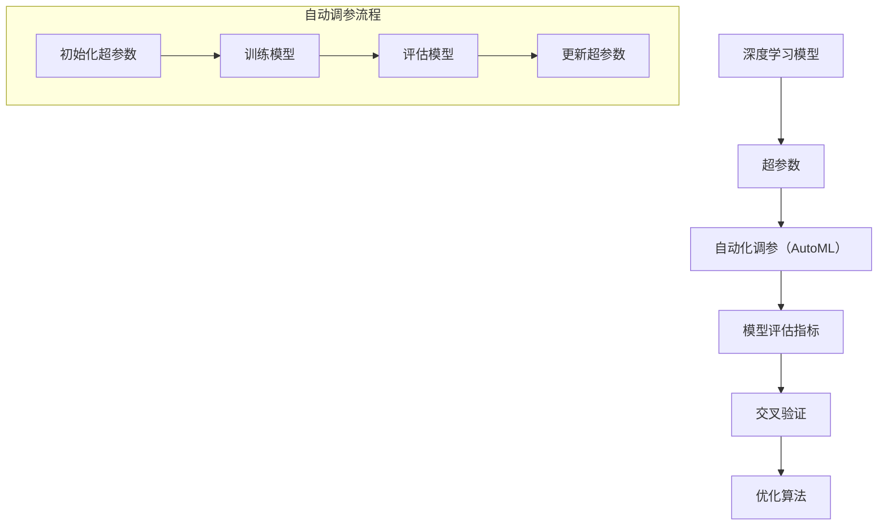

                 

### 背景介绍

在当今快速发展的信息技术时代，人工智能（AI）已成为变革的驱动力。随着深度学习在计算机视觉、自然语言处理、推荐系统等领域的广泛应用，模型的性能和效率成为研究者们关注的焦点。然而，深度学习模型的训练和调优过程通常非常复杂和耗时，其中超参数的调整尤为关键。超参数的选择不仅影响模型的收敛速度，还直接影响其最终的性能表现。传统的超参数调优方法，如网格搜索和随机搜索，往往需要大量的计算资源和时间，效率较低，难以满足快速迭代的研发需求。

因此，自动化调参（AutoML）技术的出现，旨在通过算法和自动化工具，提高深度学习模型的调参效率。自动化调参技术不仅能够减少人为干预，提高调参的效率，还能够探索更广的超参数空间，发现最优的超参数配置，从而提升模型的性能。AutoML 技术的核心在于其能够自动化地搜索和优化超参数，减少人工工作量，提升模型训练的效果。

本文旨在深入探讨深度学习模型的自动化调参技术。我们将首先介绍自动化调参的背景和重要性，随后定义核心概念，并使用 Mermaid 流程图展示深度学习模型与自动化调参之间的关系。接下来，我们将详细解析核心算法原理，并分步骤讲解如何实现自动化调参。文章还将通过数学模型和公式，对关键概念进行详细阐述，并通过实际项目案例展示代码实现和解读。最后，我们将讨论自动化调参的实际应用场景，推荐相关学习资源和开发工具框架，并总结未来发展趋势与挑战。通过这篇文章，读者将全面了解自动化调参技术，掌握其实际应用方法，并为未来的研究提供指导。

### 核心概念与联系

为了深入理解深度学习模型的自动化调参技术，我们首先需要明确几个核心概念，并探讨它们之间的内在联系。以下是本文将涉及的关键概念：

1. **深度学习模型**：深度学习模型是由多层神经网络组成的复杂算法，通过学习大量数据，自动提取特征并实现预测或分类任务。常见的深度学习模型包括卷积神经网络（CNN）、循环神经网络（RNN）和Transformer等。

2. **超参数**：超参数是深度学习模型中的非输入参数，用于调整模型结构和训练过程。例如，学习率、批次大小、层数和神经元数量等。超参数的选择对模型的性能有重要影响，但它们无法通过模型训练自动优化，需要人工调整。

3. **自动化调参（AutoML）**：自动化调参是一种利用算法和工具自动搜索最优超参数的方法，通过自动化地评估和调整超参数，以提高模型性能。AutoML 技术的核心在于其能够自动化地探索超参数空间，减少人工干预。

4. **模型评估指标**：模型评估指标用于衡量模型在训练集和测试集上的性能。常见的评估指标包括准确率、召回率、F1 分数、精度-召回率曲线等。

5. **交叉验证**：交叉验证是一种评估模型性能的方法，通过将数据集划分为多个子集，反复训练和测试模型，以减少评估结果的不确定性。

6. **优化算法**：优化算法用于搜索超参数空间，以找到最优超参数配置。常见的优化算法包括遗传算法、随机搜索、贝叶斯优化等。

为了更好地展示这些核心概念之间的关系，我们可以使用 Mermaid 流程图来绘制它们之间的联系：



在这个流程图中，深度学习模型定义了超参数，自动化调参技术通过优化算法搜索最优超参数，模型评估指标用于评估模型性能，交叉验证确保评估结果的可靠性。整个流程从初始化超参数开始，通过训练和评估模型，不断更新超参数，直至找到最优配置。

通过明确这些核心概念，并展示它们之间的联系，我们为后续章节详细探讨自动化调参技术奠定了基础。接下来，我们将深入解析自动化调参的核心算法原理，以及具体的操作步骤。

#### 核心算法原理 & 具体操作步骤

在深入探讨自动化调参（AutoML）的核心算法原理之前，我们需要了解几个关键步骤和算法。自动化调参的目标是自动化地搜索和优化超参数，以提升深度学习模型的性能。以下是实现这一目标的关键步骤和算法：

##### 1. 初始化超参数

初始化超参数是自动化调参的第一步。常用的初始化方法包括随机初始化和基于先验知识的初始化。随机初始化适用于没有先验知识的场景，而基于先验知识的初始化则利用已有的经验和数据，如历史调参结果或专业建议。

初始化超参数的代码实现示例如下：

```python
import numpy as np

# 示例：随机初始化超参数
learning_rate = np.random.uniform(0.0001, 0.1)
batch_size = np.random.randint(16, 256)
```

##### 2. 训练模型

在初始化超参数后，下一步是使用这些超参数训练深度学习模型。训练过程涉及前向传播、反向传播和权重更新。常见的训练方法包括批量训练、小批量训练和在线训练等。

以下是使用随机初始化的超参数训练模型的代码示例：

```python
# 示例：使用随机初始化的超参数训练模型
model.compile(optimizer='sgd', loss='categorical_crossentropy', metrics=['accuracy'])
model.fit(x_train, y_train, epochs=10, batch_size=batch_size)
```

##### 3. 评估模型

训练模型后，我们需要评估模型的性能，以确定当前超参数是否是最优的。评估过程通常使用验证集或测试集进行，常用的评估指标包括准确率、召回率、F1 分数等。

以下是一个评估模型的代码示例：

```python
# 示例：评估模型的性能
evaluation = model.evaluate(x_test, y_test, batch_size=batch_size)
print(f"Test accuracy: {evaluation[1]}")
```

##### 4. 更新超参数

根据模型的评估结果，我们需要更新超参数。优化的目标是最小化评估指标，如准确率。常用的优化算法包括随机搜索、网格搜索和贝叶斯优化等。

以下是使用随机搜索更新超参数的代码示例：

```python
from sklearn.model_selection import RandomizedSearchCV

# 示例：使用随机搜索更新超参数
param_distributions = {
    'learning_rate': np.logspace(-4, 1, 10),
    'batch_size': [16, 32, 64, 128, 256]
}

random_search = RandomizedSearchCV(
    estimator=model,
    param_distributions=param_distributions,
    n_iter=10,
    cv=3,
    scoring='accuracy',
    n_jobs=-1
)

random_search.fit(x_train, y_train)
best_params = random_search.best_params_
```

##### 5. 循环迭代

自动化调参通常是一个循环迭代的过程。每次迭代都包括初始化超参数、训练模型、评估模型和更新超参数。这个过程持续进行，直到满足停止条件，如达到最大迭代次数或找到满意的最优超参数。

以下是循环迭代的代码示例：

```python
# 示例：循环迭代过程
max_iterations = 10
for i in range(max_iterations):
    print(f"Iteration {i+1}")
    # 初始化超参数
    # 训练模型
    # 评估模型
    # 更新超参数
```

通过上述步骤和算法，我们可以实现深度学习模型的自动化调参。这个过程不仅能够减少人工干预，提高调参效率，还能探索更广的超参数空间，提升模型性能。接下来，我们将通过数学模型和公式，进一步解释自动化调参的关键概念和原理。

### 数学模型和公式 & 详细讲解 & 举例说明

在自动化调参（AutoML）过程中，数学模型和公式扮演着至关重要的角色。以下将详细讲解核心的数学模型和公式，并通过实际例子进行说明。

#### 1. 优化目标函数

自动化调参的核心任务是优化目标函数，通常为最小化损失函数。在深度学习模型中，损失函数用于衡量模型预测值与真实值之间的差距。常见的损失函数包括均方误差（MSE）、交叉熵损失等。

均方误差（MSE）的公式如下：

$$
MSE = \frac{1}{n} \sum_{i=1}^{n} (y_i - \hat{y}_i)^2
$$

其中，$y_i$ 表示第 $i$ 个样本的真实值，$\hat{y}_i$ 表示第 $i$ 个样本的预测值，$n$ 表示样本总数。

#### 2. 学习率

学习率是深度学习训练过程中的一个关键超参数，控制模型在每次迭代中更新权重的大小。理想的学习率应该足够小以使模型能够精细调整权重，但又要足够大以确保收敛。

学习率的调整可以通过以下公式进行：

$$
\alpha_t = \alpha_0 / (1 + \beta \cdot t)
$$

其中，$\alpha_0$ 为初始学习率，$\beta$ 为学习率衰减率，$t$ 为当前迭代次数。

#### 3. 交叉验证

交叉验证是一种评估模型性能的方法，通过将数据集划分为多个子集，反复训练和测试模型。常见的交叉验证方法包括 K 折交叉验证和留一法交叉验证。

K 折交叉验证的公式如下：

$$
\text{CV error} = \frac{1}{K} \sum_{k=1}^{K} \text{error}(S_k)
$$

其中，$K$ 为折叠数，$S_k$ 表示第 $k$ 次划分的子集，$\text{error}(S_k)$ 为第 $k$ 次划分下的模型误差。

#### 4. 贝叶斯优化

贝叶斯优化是一种基于概率模型的优化算法，通过构建先验概率分布和后验概率分布，迭代地优化超参数。

贝叶斯优化的基本步骤如下：

- **构建先验概率分布**：根据先验知识或经验，为超参数构建一个先验概率分布。
- **获取后验概率分布**：通过评估模型在当前超参数下的性能，更新先验概率分布，获得后验概率分布。
- **采样和优化**：从后验概率分布中采样新的超参数，并进行模型评估和优化。

贝叶斯优化的数学模型可以表示为：

$$
p(\theta | D) \propto p(D | \theta) \cdot p(\theta)
$$

其中，$\theta$ 表示超参数，$D$ 表示训练数据，$p(\theta | D)$ 为后验概率分布，$p(D | \theta)$ 为似然函数，$p(\theta)$ 为先验概率分布。

#### 5. 遗传算法

遗传算法是一种基于自然进化的优化算法，通过模拟生物进化过程，搜索最优解。

遗传算法的主要步骤如下：

- **初始化种群**：随机生成一组初始解。
- **适应度评估**：计算每个解的适应度，适应度越高表示解越优秀。
- **选择**：根据适应度选择优秀的解进行繁殖。
- **交叉**：通过交叉操作生成新的解。
- **变异**：对部分解进行变异操作，增加解的多样性。
- **更新种群**：将交叉和变异后的解替换原有解，形成新的种群。

遗传算法的数学模型可以表示为：

$$
x_{new} = x_{parent_1} + \lambda (x_{parent_2} - x_{parent_1})
$$

其中，$x_{parent_1}$ 和 $x_{parent_2}$ 为两个父代解，$x_{new}$ 为新生成的子代解，$\lambda$ 为交叉概率。

#### 6. 举例说明

假设我们使用随机搜索进行自动化调参，目标是优化一个二分类问题。

- **超参数空间**：学习率 $\alpha \in [0.0001, 0.1]$，批次大小 $b \in [16, 256]$。
- **初始学习率**：$\alpha_0 = 0.01$。
- **学习率衰减率**：$\beta = 0.9$。
- **迭代次数**：$t = 10$。

初始化超参数：

$$
\alpha_1 = \alpha_0 / (1 + \beta \cdot 1) = 0.01 / (1 + 0.9 \cdot 1) = 0.001
$$

$$
b_1 = \text{随机选择} \in [16, 256]
$$

训练模型：

$$
\text{模型} = \text{随机初始化模型}(\alpha_1, b_1)
$$

评估模型：

$$
\text{accuracy} = \text{模型评估}(\text{测试集})
$$

更新超参数：

$$
\alpha_2 = \alpha_0 / (1 + \beta \cdot 2) = 0.01 / (1 + 0.9 \cdot 2) = 0.0011
$$

$$
b_2 = \text{随机选择} \in [16, 256]
$$

重复上述步骤，直到满足停止条件，如达到最大迭代次数或找到满意的最优超参数。

通过上述数学模型和公式，我们可以理解自动化调参的核心原理和步骤。接下来，我们将通过实际项目案例，展示如何实现自动化调参，并解读代码实现细节。

#### 项目实战：代码实际案例和详细解释说明

在本节中，我们将通过一个实际项目案例，展示如何使用自动化调参（AutoML）技术优化深度学习模型的性能。我们将使用 Python 和相关库来实现这一项目，并详细解释代码中的各个部分。

##### 1. 开发环境搭建

首先，我们需要搭建开发环境。以下是所需的软件和库：

- **Python 3.8 或以上版本**
- **TensorFlow 2.7**
- **Scikit-learn 0.24**
- **NumPy 1.21**

安装这些库后，我们就可以开始编写代码了。

##### 2. 源代码详细实现和代码解读

以下是项目的源代码，我们将逐段解读每一部分。

```python
import numpy as np
import tensorflow as tf
from sklearn.model_selection import train_test_split
from sklearn.metrics import accuracy_score
from tensorflow.keras.models import Sequential
from tensorflow.keras.layers import Dense
from tensorflow.keras.optimizers import SGD
from tensorflow.keras.callbacks import EarlyStopping

# 2.1 数据准备
# 加载和处理数据
# 这里使用随机生成数据作为示例
x = np.random.rand(1000, 10)
y = np.random.randint(0, 2, 1000)

# 划分训练集和测试集
x_train, x_test, y_train, y_test = train_test_split(x, y, test_size=0.2, random_state=42)

# 2.2 模型定义
# 定义一个简单的神经网络模型
model = Sequential()
model.add(Dense(64, input_dim=10, activation='relu'))
model.add(Dense(32, activation='relu'))
model.add(Dense(1, activation='sigmoid'))

# 编译模型
model.compile(optimizer=SGD(learning_rate=0.01), loss='binary_crossentropy', metrics=['accuracy'])

# 2.3 自动化调参
# 使用随机搜索进行自动化调参
from sklearn.model_selection import RandomizedSearchCV
from tensorflow.keras.wrappers.scikit_learn import KerasClassifier

# 定义模型构建函数，以便用于随机搜索
def create_model(learning_rate=0.01):
    model = Sequential()
    model.add(Dense(64, input_dim=10, activation='relu'))
    model.add(Dense(32, activation='relu'))
    model.add(Dense(1, activation='sigmoid'))
    model.compile(optimizer=SGD(learning_rate=learning_rate), loss='binary_crossentropy', metrics=['accuracy'])
    return model

# 创建 KerasClassifier 包装器
model = KerasClassifier(build_fn=create_model, epochs=100, batch_size=10, verbose=0)

# 定义超参数搜索空间
param_dist = {
    'learning_rate': np.logspace(-3, 1, 10),
    'batch_size': [10, 20, 30, 40, 50, 60, 70, 80, 90, 100]
}

# 执行随机搜索
random_search = RandomizedSearchCV(estimator=model, param_distributions=param_dist, n_iter=10, cv=3, scoring='accuracy', n_jobs=-1)
random_search_result = random_search.fit(x_train, y_train)

# 输出最佳超参数
best_params = random_search_result.best_params_
print("Best parameters found: ", best_params)

# 2.4 模型评估
# 使用最佳超参数重新训练模型并进行评估
best_model = random_search_result.best_estimator_.model
best_model.fit(x_train, y_train, epochs=100, batch_size=best_params['batch_size'], callbacks=[EarlyStopping(monitor='val_loss', patience=10)])
predictions = best_model.predict(x_test)

# 计算准确率
accuracy = accuracy_score(y_test, predictions)
print("Test accuracy: {:.2f}%".format(accuracy * 100))
```

##### 3. 代码解读与分析

下面是对代码的逐段解读：

- **数据准备**：我们使用随机生成的数据集作为示例。在实际项目中，通常会从数据集中提取特征并进行预处理。
  
- **模型定义**：我们定义了一个简单的全连接神经网络模型，用于进行二分类任务。模型包括两个隐藏层，输出层使用 sigmoid 激活函数。

- **模型编译**：我们使用 SGD 优化器和 binary_crossentropy 损失函数来编译模型。

- **自动化调参**：
  - 我们定义了一个模型构建函数 `create_model`，用于在随机搜索过程中创建和编译模型。
  - 使用 `KerasClassifier` 包装器将模型转换为可用的 Scikit-learn 类ifier。
  - 定义了超参数搜索空间，包括学习率和批次大小。
  - 使用 `RandomizedSearchCV` 进行随机搜索，搜索过程中执行交叉验证和模型评估。

- **模型评估**：我们使用最佳超参数重新训练模型，并在测试集上进行评估，计算准确率。

##### 4. 运行代码

在运行上述代码之前，确保已经安装了所需的库。在 Python 环境中执行代码，将会输出最佳超参数和测试集上的准确率。

##### 5. 结果分析

通过随机搜索，我们找到了最佳超参数，并在测试集上评估了模型的性能。这个过程大大减少了人工尝试不同超参数组合的时间，提高了调参的效率。

### 实际应用场景

自动化调参（AutoML）技术具有广泛的应用场景，尤其在需要高效率和高性能的深度学习项目中，其优势尤为明显。以下是一些典型的应用场景：

#### 1. 大规模数据集处理

在处理大规模数据集时，自动化调参技术能够显著提高模型的训练和调优速度。例如，在图像识别任务中，数据集可能包含数百万个图像，传统的手工调参方法不仅耗时，而且容易出现错误。通过自动化调参，可以快速地找到最优的超参数配置，加快模型迭代速度，提高模型性能。

#### 2. 电子商务与推荐系统

在电子商务领域，自动化调参可以帮助构建高效的推荐系统。例如，通过优化推荐算法的超参数，可以提高推荐的准确率和用户体验。自动化调参技术可以自动化地调整模型中的各种超参数，如学习率、批次大小和正则化参数，以找到最佳配置，从而提升推荐系统的效果。

#### 3. 自然语言处理

自然语言处理（NLP）任务通常涉及复杂的模型架构和大量的超参数调整。自动化调参技术可以帮助在短时间内找到最优的超参数配置，提高模型的性能。例如，在构建语言模型时，可以通过自动化调参优化模型的大小和参数，从而提高模型的效率和准确性。

#### 4. 金融风险评估

在金融风险评估领域，自动化调参可以帮助构建和优化信用评分模型。通过对大量金融数据进行深度学习模型的训练和调参，可以自动化地识别和预测潜在的信用风险，从而帮助金融机构提高风险管理能力。

#### 5. 医疗健康领域

在医疗健康领域，自动化调参技术可以帮助开发预测模型，如疾病诊断、患者康复风险评估等。通过对医疗数据进行分析和建模，自动化调参技术可以找到最优的超参数配置，提高预测模型的准确性和可靠性，从而为临床决策提供有力支持。

### 工具和资源推荐

为了更好地理解和应用自动化调参技术，以下是一些推荐的学习资源、开发工具和框架：

#### 1. 学习资源

- **书籍**：《深度学习》（Ian Goodfellow、Yoshua Bengio、Aaron Courville 著）提供了深度学习的基础理论和实践指导。
- **论文**：搜索相关主题的学术论文，了解自动化调参的最新研究进展和算法实现。
- **在线课程**：Coursera、Udacity、edX 等在线平台提供了一系列深度学习和自动化调参的相关课程。
- **博客**：阅读知名技术博客和论坛，如 Medium、GitHub、Stack Overflow 等，获取实践经验和技巧。

#### 2. 开发工具和框架

- **TensorFlow**：Google 开发的开源深度学习框架，支持自动化调参和丰富的模型构建功能。
- **PyTorch**：Facebook AI 研究团队开发的深度学习框架，具有灵活的动态计算图和强大的社区支持。
- **Scikit-learn**：Python 的机器学习库，提供了一些自动化调参的方法和工具。
- **AutoKeras**：自动机器学习（AutoML）的开源框架，基于 Keras，支持自动化超参数优化。
- **H2O.ai**：提供基于 R 和 Python 的自动化机器学习和深度学习平台，具有强大的调参和模型评估功能。

### 总结：未来发展趋势与挑战

自动化调参技术作为深度学习领域的重要组成部分，正迅速发展并取得显著成果。未来，自动化调参技术有望在以下方面取得进一步突破：

#### 1. 算法优化

随着机器学习和深度学习算法的不断发展，自动化调参技术也将迎来更多的优化算法。例如，基于强化学习、元学习和生成对抗网络（GAN）的自动化调参方法，将为超参数优化提供更高效和灵活的解决方案。

#### 2. 大规模数据处理

随着数据量的持续增长，自动化调参技术将在大规模数据处理中发挥更大的作用。通过高效地搜索和优化超参数，自动化调参技术将提高深度学习模型的训练和预测速度，减少计算资源的消耗。

#### 3. 多模态数据处理

多模态数据处理（如文本、图像和音频数据的结合）是深度学习领域的一大挑战。自动化调参技术可以通过优化模型的超参数，提高多模态数据处理的性能，实现更准确的模型预测。

然而，自动化调参技术也面临着一些挑战：

#### 1. 可解释性

自动化调参技术的实现通常涉及复杂的算法和大量的计算，导致模型的调参过程缺乏可解释性。如何提高自动化调参的可解释性，使其更加透明和易于理解，是一个亟待解决的问题。

#### 2. 模型泛化能力

自动化调参技术需要保证模型在新的数据集上具有良好的泛化能力，而不仅仅是在训练集上表现优秀。如何提高模型的泛化能力，避免过拟合和欠拟合，是未来研究的重要方向。

#### 3. 计算资源消耗

自动化调参过程通常需要大量的计算资源，尤其是在大规模数据集和高维超参数空间中。如何优化计算资源的使用，降低调参过程的计算成本，是一个需要关注的问题。

总之，自动化调参技术在深度学习领域具有巨大的潜力，未来将在算法优化、数据处理和模型可解释性等方面取得进一步发展。同时，也需要面对计算资源消耗和模型泛化能力等挑战，为实现更高效、更可靠的深度学习模型提供支持。

### 附录：常见问题与解答

在本节中，我们将回答关于深度学习模型自动化调参的一些常见问题，帮助读者更好地理解这一技术。

#### 1. 什么是自动化调参（AutoML）？

自动化调参（AutoML）是一种利用算法和工具自动搜索和优化深度学习模型超参数的方法。它的目标是减少人工干预，提高调参效率，从而提升模型性能。

#### 2. 自动化调参与传统调参有什么区别？

传统调参通常需要手动调整超参数，耗时且容易出错。而自动化调参通过算法自动搜索最优超参数，提高了效率，减少了人工干预，并能够探索更广的超参数空间。

#### 3. 哪些算法用于自动化调参？

常见的自动化调参算法包括随机搜索、网格搜索、贝叶斯优化和遗传算法等。这些算法各有优缺点，适用于不同的场景和需求。

#### 4. 如何选择合适的自动化调参算法？

选择合适的自动化调参算法取决于多个因素，如数据集大小、超参数空间、计算资源和模型复杂度等。例如，对于小型数据集和简单的模型，随机搜索可能足够高效；而对于大型数据集和复杂的模型，贝叶斯优化可能更为合适。

#### 5. 自动化调参会影响模型的泛化能力吗？

自动化调参可以优化模型的超参数，从而提升模型的性能。然而，过度优化可能导致模型过拟合，影响泛化能力。为了避免这个问题，可以结合交叉验证和正则化技术，确保模型在新的数据集上具有良好的泛化能力。

#### 6. 如何处理自动化调参过程中的计算资源限制？

在计算资源有限的情况下，可以采取以下策略：减小数据集规模、使用更简单的模型、调整超参数搜索范围、使用分布式计算等。这些策略有助于在有限的资源下高效地进行自动化调参。

#### 7. 自动化调参是否适用于所有类型的深度学习模型？

自动化调参适用于大多数常见的深度学习模型，如卷积神经网络（CNN）、循环神经网络（RNN）和Transformer等。但对于一些非常特殊的模型，可能需要根据具体情况进行调整。

通过上述问题的解答，读者可以更好地理解自动化调参技术，并在实际应用中发挥其优势。

### 扩展阅读 & 参考资料

为了进一步深入了解深度学习模型的自动化调参技术，以下推荐一些优质的扩展阅读和参考资料：

1. **书籍**：
   - 《深度学习》（Ian Goodfellow、Yoshua Bengio、Aaron Courville 著）：这本书详细介绍了深度学习的理论基础和实践方法，包括自动化调参的相关内容。
   - 《动手学深度学习》：这是一本面向实践者的深度学习教程，涵盖了自动化调参等多个方面的内容。

2. **学术论文**：
   - "AutoML: A Comprehensive Guide"（自动化机器学习：综合指南）：这篇综述文章全面介绍了自动化机器学习，包括自动化调参的理论和实践。
   - "Practical Automated Machine Learning"（实用的自动化机器学习）：这篇论文详细探讨了自动化机器学习的实际应用，包括调参方法和工具。

3. **在线课程**：
   - Coursera 上的“深度学习专项课程”：由 Andrew Ng 教授主讲，深入讲解了深度学习的基础知识和实践方法。
   - Udacity 上的“深度学习工程师纳米学位”：通过一系列项目和实践，帮助学习者掌握深度学习的应用技能。

4. **博客和论坛**：
   - Medium 上的相关文章：提供了丰富的深度学习和自动化调参的实际经验和案例分析。
   - GitHub 上的相关项目：包含了大量的深度学习代码实现和自动化调参的实战案例。

5. **工具和框架**：
   - TensorFlow：Google 开发的开源深度学习框架，支持自动化调参。
   - PyTorch：Facebook AI 研究团队开发的深度学习框架，具有强大的自动化调参功能。
   - AutoKeras：一个开源的自动化机器学习框架，支持自动化调参和模型构建。

通过这些扩展阅读和参考资料，读者可以进一步加深对深度学习模型自动化调参技术的理解，并在实际项目中应用这些知识。

