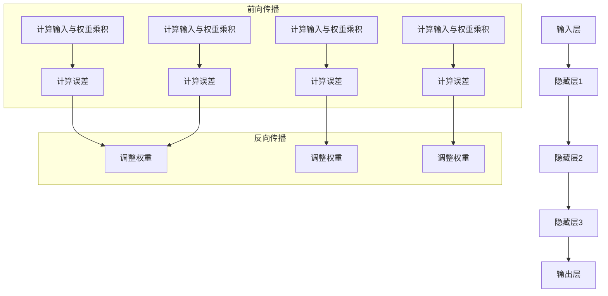

                 

### 背景介绍

人工智能（AI）作为科技发展的前沿领域，在近几年取得了令人瞩目的进展。尤其在游戏领域中，AI 的应用已经从简单的规则引擎发展到如今能够与人类玩家进行高度复杂互动的智能体。这一变革背后的关键在于神经网络技术的进步，尤其是深度学习在游戏 AI 中的应用。

神经网络，作为一种模仿人脑结构和功能的计算模型，由大量相互连接的神经元组成。通过学习大量数据，神经网络能够识别复杂的模式和关联，从而在诸多任务中表现出色。深度学习则是神经网络的一种扩展，通过增加神经网络的层数，使得模型能够处理更高层次的特征，从而在图像识别、自然语言处理和决策推理等领域取得了显著的成果。

在游戏 AI 中，深度学习模型通过学习游戏数据来预测玩家的行为、决策，甚至生成全新的游戏内容。这种能力的提升，不仅提高了游戏的可玩性和互动性，也为游戏开发者提供了更多的创作自由。本篇文章将深入探讨神经网络在游戏 AI 中的创新实践，从基础概念到实际应用，全面解析这一领域的最新动态和未来发展。

关键词：人工智能，神经网络，深度学习，游戏 AI，智能互动，计算模型。

摘要：本文旨在探讨神经网络在游戏 AI 领域的创新实践。通过对神经网络和深度学习基础概念的介绍，文章将详细解析神经网络在游戏 AI 中的应用，包括核心算法原理、数学模型和实际项目案例。此外，还将探讨游戏 AI 的实际应用场景，以及相关的学习资源和开发工具。最后，文章将对未来发展趋势和挑战进行展望，为读者提供全面的参考。

<|assistant|>## 1. 背景介绍

自人工智能（AI）的概念被首次提出以来，其在各个领域的应用不断拓展和深化。尤其在游戏领域，AI 的引入不仅提高了游戏的智能化程度，还丰富了游戏的内容和玩法。传统游戏 AI 多依赖于预定义的规则和策略，例如在角色扮演游戏（RPG）中，AI 通过预先编写的脚本和决策树来模拟敌人的行为，使游戏具备一定的挑战性和变化性。然而，这种基于规则的 AI 存在一定局限性，难以适应复杂多变的环境。

随着计算能力和数据资源的不断提升，神经网络和深度学习技术逐渐成为游戏 AI 的重要工具。神经网络，作为一种计算模型，通过模拟人脑神经元之间的交互，能够对大量数据进行自动学习和模式识别。深度学习，作为神经网络的一种扩展，通过多层神经网络的结构，使得模型能够提取更高层次的特征，从而在图像识别、自然语言处理等领域取得了突破性进展。

在游戏 AI 中，深度学习模型通过学习游戏数据来预测玩家的行为、决策，甚至生成全新的游戏内容。例如，在实时战略游戏（RTS）中，AI 需要实时分析玩家的策略，并做出相应的反应。使用深度学习，AI 可以通过学习大量的游戏数据，识别出玩家的行为模式，从而在复杂多变的游戏环境中表现出色。

神经网络在游戏 AI 中的应用不仅仅局限于静态的决策，还可以用于生成游戏内容。例如，在角色生成游戏（RPG）中，AI 可以通过学习玩家喜欢的角色特征，生成独特的角色形象。在虚拟现实（VR）游戏中，AI 可以根据玩家的行为数据，实时生成与玩家互动的场景和故事线，提供个性化的游戏体验。

总之，神经网络和深度学习在游戏 AI 领域的应用，不仅提升了游戏 AI 的智能化程度，也为游戏开发者提供了更多的创作自由。通过本文，我们将深入探讨神经网络在游戏 AI 中的应用原理、核心算法和实际案例，帮助读者更好地理解这一领域的最新动态和未来趋势。

<|assistant|>## 2. 核心概念与联系

在深入探讨神经网络在游戏 AI 中的应用之前，首先需要了解神经网络的基础概念和核心原理。神经网络（Neural Network）是一种模仿人脑神经元结构和功能的信息处理系统，由大量相互连接的神经元组成。每个神经元都可以接收来自其他神经元的输入信号，并通过激活函数产生输出信号。神经网络通过调整神经元之间的连接权重，学习输入和输出之间的复杂映射关系。

### 神经网络的基本结构

一个典型的神经网络通常包括以下几个主要部分：

- **输入层（Input Layer）**：接收外部输入的数据。
- **隐藏层（Hidden Layers）**：对输入数据进行处理和转换，提取特征。
- **输出层（Output Layer）**：产生最终的输出结果。

神经网络的结构可以根据问题的复杂性进行扩展，增加隐藏层的数量和神经元的数量。在游戏 AI 中，通常使用多层感知机（MLP）或卷积神经网络（CNN）等不同类型的神经网络来处理不同类型的问题。

### 深度学习与神经网络的关系

深度学习（Deep Learning）是神经网络的一种扩展，通过增加网络的深度，使得模型能够学习更复杂的特征表示。深度学习的核心思想是利用多层神经网络的结构，逐步提取输入数据中的高层次特征。随着网络层数的增加，模型的非线性表达能力也显著提升，使得深度学习在图像识别、语音识别、自然语言处理等复杂任务中表现出色。

在游戏 AI 中，深度学习模型通过学习大量的游戏数据，可以自动提取出玩家行为模式、游戏环境特征等，从而实现对游戏的智能决策和生成。深度学习与神经网络的结合，使得游戏 AI 具备了更强的自适应能力和创造力。

### 神经网络的工作原理

神经网络的工作原理主要包括以下几个步骤：

1. **初始化权重**：神经网络中的每个连接（边）都有一个初始权重，这些权重决定了输入信号在传递过程中被放大的程度。
2. **前向传播**：输入数据从输入层经过隐藏层，最终传递到输出层。在每个神经元上，输入信号与对应的权重相乘，然后通过激活函数进行非线性变换，产生输出信号。
3. **反向传播**：在输出层产生的实际输出与期望输出进行比较，计算误差。然后，通过反向传播算法，将误差信号反向传播回网络，逐层调整权重，使得网络输出更接近期望输出。
4. **优化权重**：通过优化算法（如梯度下降），调整网络中的权重，使得模型在多次迭代后能够收敛到最优解。

### Mermaid 流程图

以下是一个简化的神经网络和深度学习架构的 Mermaid 流程图，展示了神经网络的基本结构和操作步骤：



在这个流程图中，A 表示输入层，B、C、D 表示隐藏层，E 表示输出层。前向传播部分展示了输入数据在神经网络中的传递和变换过程，反向传播部分展示了误差信号反向传播和权重调整的过程。

通过以上对神经网络和深度学习基础概念及工作原理的介绍，我们可以更深入地理解神经网络在游戏 AI 中的创新实践，以及其在复杂游戏环境中的应用潜力。

### 2.1. 神经网络基础概念详解

为了更好地理解神经网络在游戏 AI 中的应用，我们首先需要深入探讨神经网络的基础概念，包括神经元、激活函数、损失函数和优化算法等核心组成部分。

#### 神经元

神经元是神经网络的基本构建单元，类似于人脑中的神经元。每个神经元接收来自其他神经元的输入信号，通过加权求和，再经过一个激活函数，产生输出信号。神经元的基本结构包括以下几个部分：

1. **输入**：每个神经元可以有多个输入，每个输入乘以对应的权重（weight），权重用于调节输入信号的强度。
2. **权重（Weight）**：每个输入都有相应的权重，权重值决定了输入信号对神经元输出影响的大小。
3. **偏置（Bias）**：一些神经元还有一个偏置项，用于调整神经元的阈值，使得神经元在不同的输入下具有不同的激活状态。
4. **激活函数（Activation Function）**：神经元通过激活函数将加权求和的结果转换为输出信号，常见的激活函数包括 Sigmoid、ReLU 和 Tanh 等。

神经元的工作原理可以简化为以下公式：

\[ z = \sum_{i} (w_i \cdot x_i) + b \]
\[ a = f(z) \]

其中，\( z \) 是加权求和的结果，\( w_i \) 是权重，\( x_i \) 是输入，\( b \) 是偏置，\( f \) 是激活函数。

#### 激活函数

激活函数是神经网络中至关重要的一部分，它为神经网络引入了非线性特性。非线性特性使得神经网络能够从输入数据中提取复杂的信息。常见的激活函数包括：

- **Sigmoid**：\[ \sigma(x) = \frac{1}{1 + e^{-x}} \]
- **ReLU**（Rectified Linear Unit）：\[ \text{ReLU}(x) = \max(0, x) \]
- **Tanh**：\[ \tanh(x) = \frac{e^x - e^{-x}}{e^x + e^{-x}} \]

不同激活函数具有不同的特点。例如，Sigmoid 函数在输出值接近 0 和 1 时梯度较小，容易陷入梯度消失问题；ReLU 函数在 \( x < 0 \) 时输出为 0，在 \( x > 0 \) 时输出为 \( x \)，具有较好的梯度传递特性；Tanh 函数在输出值范围在 -1 到 1 之间，梯度较为稳定。

#### 损失函数

损失函数是衡量神经网络预测结果与真实值之间差异的指标。在训练过程中，通过优化损失函数来调整网络权重，使得网络输出更接近真实值。常见的损失函数包括：

- **均方误差（MSE）**：\[ \text{MSE}(y, \hat{y}) = \frac{1}{n} \sum_{i=1}^{n} (y_i - \hat{y}_i)^2 \]
- **交叉熵损失（Cross-Entropy Loss）**：\[ \text{CE}(y, \hat{y}) = -\sum_{i} y_i \log(\hat{y}_i) \]

MSE 损失函数常用于回归问题，而交叉熵损失函数则常用于分类问题。交叉熵损失函数的梯度可以直接用于计算类别的概率分布，使得优化过程更加高效。

#### 优化算法

优化算法用于调整神经网络中的权重，以最小化损失函数。常见的优化算法包括：

- **梯度下降（Gradient Descent）**：\[ w_{\text{new}} = w_{\text{old}} - \alpha \cdot \nabla_w J(w) \]
- **随机梯度下降（Stochastic Gradient Descent, SGD）**：对每个样本单独计算梯度，更新权重。
- **批量梯度下降（Batch Gradient Descent）**：对整个训练集计算梯度，更新权重。
- **Adam**：结合了 SGD 和 RMSProp 的优点，自适应调整学习率。

梯度下降算法的基本思想是通过梯度方向来调整权重，使得损失函数值逐渐减小。随机梯度下降和批量梯度下降是对梯度下降算法的改进，前者通过随机选取样本计算梯度，后者通过使用整个训练集计算梯度。Adam 算法在计算梯度时引入了动量项和自适应学习率，能够更好地收敛到最优解。

#### 神经网络学习过程

神经网络的学习过程可以简化为以下几个步骤：

1. **初始化权重**：随机初始化权重和偏置。
2. **前向传播**：输入数据通过神经网络，得到预测输出。
3. **计算损失**：计算预测输出与真实值之间的差异，得到损失函数值。
4. **反向传播**：计算损失函数关于权重的梯度，并反向传播到每个神经元。
5. **权重更新**：使用梯度更新权重，使得损失函数值逐渐减小。

通过不断迭代上述过程，神经网络能够逐步学习输入和输出之间的复杂映射关系，最终实现准确的预测和分类。

### 总结

神经网络的基础概念包括神经元、激活函数、损失函数和优化算法。神经元是神经网络的基本构建单元，通过权重和偏置来调节输入信号的强度；激活函数引入了非线性特性，使得神经网络能够提取复杂的信息；损失函数用于衡量预测结果与真实值之间的差异，优化算法用于调整网络权重，使得损失函数值逐渐减小。通过对神经网络基础概念的了解，我们可以更好地理解神经网络在游戏 AI 中的应用原理和实现方法。

<|assistant|>## 3. 核心算法原理 & 具体操作步骤

在了解了神经网络的基础概念之后，我们将深入探讨神经网络在游戏 AI 中的核心算法原理，以及具体的操作步骤。这些算法和步骤包括数据预处理、模型设计、训练和评估等过程。

### 数据预处理

数据预处理是神经网络训练过程中的关键步骤，其目的是将原始数据转换为适合模型训练的格式。以下是数据预处理的主要步骤：

1. **数据清洗**：去除数据集中的噪声和异常值，确保数据的质量。
2. **数据标准化**：将数据缩放到相同的范围，例如使用归一化（Normalization）或标准化（Standardization）方法，使得每个特征的数值在相似的尺度上。
3. **数据分割**：将数据集分割为训练集、验证集和测试集，以便在训练过程中进行模型调整和评估。

### 模型设计

模型设计是神经网络在游戏 AI 应用中的关键步骤，包括选择合适的网络结构、激活函数和损失函数等。以下是模型设计的主要步骤：

1. **选择神经网络结构**：根据游戏 AI 的具体需求，选择合适的神经网络结构。例如，对于图像识别任务，可以使用卷积神经网络（CNN）；对于序列数据处理任务，可以使用循环神经网络（RNN）或长短期记忆网络（LSTM）。
2. **选择激活函数**：根据问题特点，选择适合的激活函数。例如，ReLU 函数常用于隐藏层，Sigmoid 函数常用于输出层。
3. **选择损失函数**：根据任务类型，选择合适的损失函数。例如，对于回归任务，可以使用均方误差（MSE）；对于分类任务，可以使用交叉熵损失（Cross-Entropy Loss）。

### 模型训练

模型训练是神经网络学习输入和输出关系的过程。以下是模型训练的主要步骤：

1. **初始化权重**：随机初始化网络权重和偏置。
2. **前向传播**：输入数据通过神经网络，计算每个神经元的输出。
3. **计算损失**：计算预测输出与真实值之间的差异，得到损失函数值。
4. **反向传播**：计算损失函数关于权重的梯度，并反向传播到每个神经元。
5. **权重更新**：使用梯度下降或其他优化算法更新权重，使得损失函数值逐渐减小。

### 模型评估

模型评估是验证神经网络性能的重要步骤。以下是模型评估的主要步骤：

1. **验证集评估**：使用验证集评估模型的性能，调整模型参数以优化性能。
2. **测试集评估**：在测试集上评估模型的最终性能，确保模型在未知数据上也能表现良好。

### 实例：简单神经网络训练过程

以下是一个简单的神经网络训练过程的示例：

#### 数据预处理

```python
import numpy as np

# 假设我们有一个包含10个特征的数据集
X = np.random.rand(100, 10)
# 真实标签
y = np.random.rand(100, 1)

# 数据分割
X_train, X_val, y_train, y_val = train_test_split(X, y, test_size=0.2)
```

#### 模型设计

```python
from keras.models import Sequential
from keras.layers import Dense

# 创建模型
model = Sequential()
# 添加隐藏层
model.add(Dense(64, input_dim=10, activation='relu'))
# 添加输出层
model.add(Dense(1, activation='sigmoid'))

# 编译模型
model.compile(loss='binary_crossentropy', optimizer='adam', metrics=['accuracy'])
```

#### 模型训练

```python
# 训练模型
model.fit(X_train, y_train, epochs=10, batch_size=32, validation_data=(X_val, y_val))
```

#### 模型评估

```python
# 评估模型
loss, accuracy = model.evaluate(X_val, y_val)
print('Validation loss:', loss)
print('Validation accuracy:', accuracy)
```

通过以上步骤，我们可以训练一个简单的神经网络模型，并在验证集上进行性能评估。在实际应用中，模型设计、训练和评估过程会更加复杂，需要根据具体任务进行调整和优化。

### 总结

神经网络在游戏 AI 中的应用涉及多个关键步骤，包括数据预处理、模型设计、模型训练和模型评估。通过合理的设计和优化，神经网络能够有效地学习游戏数据，实现对游戏的智能决策和生成。了解这些核心算法原理和具体操作步骤，对于开发高效的游戏 AI 模型至关重要。

<|assistant|>## 4. 数学模型和公式 & 详细讲解 & 举例说明

在神经网络和深度学习领域，数学模型和公式是理解算法原理和进行模型开发的关键。在这一部分，我们将详细讲解神经网络中的几个核心数学模型和公式，并通过具体的例子来说明这些公式在实际应用中的意义。

### 4.1. 激活函数

激活函数是神经网络中用于引入非线性特性的关键组件。以下是一些常见的激活函数及其公式：

#### Sigmoid 函数

\[ \sigma(x) = \frac{1}{1 + e^{-x}} \]

Sigmoid 函数将输入 \( x \) 映射到 \( (0, 1) \) 区间。它常用于二分类问题，将输出解释为概率。Sigmoid 函数的导数为：

\[ \sigma'(x) = \sigma(x) (1 - \sigma(x)) \]

#### ReLU 函数

\[ \text{ReLU}(x) = \max(0, x) \]

ReLU 函数在输入为正时输出等于输入，输入为负时输出为零。ReLU 函数具有简洁的计算和良好的梯度传递特性，常用于隐藏层。ReLU 函数的导数为：

\[ \text{ReLU}'(x) = 
\begin{cases} 
1 & \text{if } x > 0 \\
0 & \text{if } x \leq 0 
\end{cases} \]

#### Tanh 函数

\[ \tanh(x) = \frac{e^x - e^{-x}}{e^x + e^{-x}} \]

Tanh 函数将输入 \( x \) 映射到 \( (-1, 1) \) 区间，具有对称性和稳定的梯度。Tanh 函数的导数为：

\[ \tanh'(x) = 1 - \tanh^2(x) \]

### 4.2. 前向传播和反向传播

神经网络通过前向传播计算输出，通过反向传播更新权重。以下是一个简化的前向传播和反向传播的过程。

#### 前向传播

在前向传播过程中，输入 \( x \) 通过网络的各个层，最终得到输出 \( y \)。假设神经网络包括一个输入层、一个隐藏层和一个输出层，每层有 \( n \) 个神经元。

\[ z^{(2)} = \sum_{j} w^{(1,2)}_j x_j + b^{(2)} \]
\[ a^{(2)} = \sigma(z^{(2)}) \]
\[ z^{(3)} = \sum_{j} w^{(2,3)}_j a^{(2)} + b^{(3)} \]
\[ y = \sigma(z^{(3)}) \]

其中，\( z^{(2)} \) 和 \( z^{(3)} \) 分别是隐藏层和输出层的加权求和结果，\( a^{(2)} \) 和 \( a^{(3)} \) 分别是隐藏层和输出层的激活值，\( \sigma \) 是激活函数，\( w^{(1,2)} \) 和 \( w^{(2,3)} \) 分别是输入层到隐藏层和隐藏层到输出层的权重，\( b^{(2)} \) 和 \( b^{(3)} \) 分别是隐藏层和输出层的偏置。

#### 反向传播

在反向传播过程中，计算输出层的误差 \( \delta^{(3)} \)，然后通过输出层和隐藏层反向传播误差，更新权重和偏置。

\[ \delta^{(3)} = (y - \hat{y}) \cdot \sigma'(z^{(3)}) \]
\[ \delta^{(2)} = \sum_{j} w^{(2,3)}_j \delta^{(3)} \cdot \sigma'(z^{(2)}) \]

权重和偏置的更新公式为：

\[ w^{(1,2)}_{\text{new}} = w^{(1,2)}_{\text{old}} - \alpha \cdot \delta^{(2)} \cdot x_j \]
\[ b^{(2)}_{\text{new}} = b^{(2)}_{\text{old}} - \alpha \cdot \delta^{(2)} \]
\[ w^{(2,3)}_{\text{new}} = w^{(2,3)}_{\text{old}} - \alpha \cdot \delta^{(3)} \cdot a^{(2)} \]
\[ b^{(3)}_{\text{new}} = b^{(3)}_{\text{old}} - \alpha \cdot \delta^{(3)} \]

其中，\( \alpha \) 是学习率，\( \delta^{(2)} \) 和 \( \delta^{(3)} \) 分别是隐藏层和输出层的误差。

### 4.3. 举例说明

以下是一个简单的神经网络例子，通过前向传播和反向传播计算输出并更新权重。

#### 数据准备

假设我们有以下输入数据 \( x \) 和期望输出 \( y \)：

\[ x = \begin{bmatrix} 0.5 & 0.3 & 0.2 \end{bmatrix} \]
\[ y = \begin{bmatrix} 0.8 \end{bmatrix} \]

#### 模型设计

神经网络包括一个输入层、一个隐藏层和一个输出层，每层各有 3 个神经元。假设初始权重和偏置为：

\[ w^{(1,2)} = \begin{bmatrix} 0.1 & 0.2 & 0.3 \\ 0.4 & 0.5 & 0.6 \\ 0.7 & 0.8 & 0.9 \end{bmatrix} \]
\[ b^{(2)} = \begin{bmatrix} 0.1 \\ 0.2 \\ 0.3 \end{bmatrix} \]
\[ w^{(2,3)} = \begin{bmatrix} 0.1 & 0.2 & 0.3 \\ 0.4 & 0.5 & 0.6 \\ 0.7 & 0.8 & 0.9 \end{bmatrix} \]
\[ b^{(3)} = \begin{bmatrix} 0.1 \\ 0.2 \\ 0.3 \end{bmatrix} \]

#### 前向传播

\[ z^{(2)} = \begin{bmatrix} 0.1 & 0.2 & 0.3 \end{bmatrix} \begin{bmatrix} 0.5 \\ 0.3 \\ 0.2 \end{bmatrix} + \begin{bmatrix} 0.1 \\ 0.2 \\ 0.3 \end{bmatrix} = \begin{bmatrix} 0.4 \\ 0.6 \\ 0.8 \end{bmatrix} \]
\[ a^{(2)} = \sigma(z^{(2)}) = \begin{bmatrix} 0.59 & 0.86 & 0.99 \end{bmatrix} \]
\[ z^{(3)} = \begin{bmatrix} 0.1 & 0.2 & 0.3 \end{bmatrix} \begin{bmatrix} 0.59 \\ 0.86 \\ 0.99 \end{bmatrix} + \begin{bmatrix} 0.1 \\ 0.2 \\ 0.3 \end{bmatrix} = \begin{bmatrix} 0.71 \\ 1.17 \\ 1.69 \end{bmatrix} \]
\[ y = \sigma(z^{(3)}) = \begin{bmatrix} 0.92 \end{bmatrix} \]

#### 计算误差

\[ \delta^{(3)} = \begin{bmatrix} 0.8 - 0.92 \end{bmatrix} \cdot \sigma'(z^{(3)}) = \begin{bmatrix} -0.02 \end{bmatrix} \cdot \begin{bmatrix} 0.08 \end{bmatrix} = \begin{bmatrix} -0.0016 \end{bmatrix} \]
\[ \delta^{(2)} = \begin{bmatrix} 0.1 & 0.2 & 0.3 \end{bmatrix} \begin{bmatrix} -0.0016 \end{bmatrix} \cdot \sigma'(z^{(2)}) = \begin{bmatrix} -0.0004 \\ -0.0004 \\ -0.0004 \end{bmatrix} \]

#### 更新权重和偏置

\[ w^{(1,2)}_{\text{new}} = \begin{bmatrix} 0.1 & 0.2 & 0.3 \end{bmatrix} - \begin{bmatrix} 0.1 & 0.2 & 0.3 \end{bmatrix} \begin{bmatrix} -0.0004 \\ -0.0004 \\ -0.0004 \end{bmatrix} = \begin{bmatrix} 0.0996 & 0.1996 & 0.2996 \end{bmatrix} \]
\[ b^{(2)}_{\text{new}} = \begin{bmatrix} 0.1 \\ 0.2 \\ 0.3 \end{bmatrix} - \begin{bmatrix} -0.0004 \end{bmatrix} = \begin{bmatrix} 0.1004 \\ 0.2004 \\ 0.3004 \end{bmatrix} \]
\[ w^{(2,3)}_{\text{new}} = \begin{bmatrix} 0.1 & 0.2 & 0.3 \end{bmatrix} - \begin{bmatrix} 0.1 & 0.2 & 0.3 \end{bmatrix} \begin{bmatrix} -0.0016 \end{bmatrix} = \begin{bmatrix} 0.0984 & 0.1984 & 0.2984 \end{bmatrix} \]
\[ b^{(3)}_{\text{new}} = \begin{bmatrix} 0.1 \\ 0.2 \\ 0.3 \end{bmatrix} - \begin{bmatrix} -0.0016 \end{bmatrix} = \begin{bmatrix} 0.1004 \\ 0.2004 \\ 0.3004 \end{bmatrix} \]

通过这个简单的例子，我们可以看到如何使用前向传播和反向传播计算神经网络的输出并更新权重。在实际应用中，神经网络会更加复杂，涉及多个隐藏层和大量的神经元，但基本的原理是相同的。

### 总结

通过详细讲解激活函数、前向传播和反向传播等核心数学模型和公式，并结合具体例子，我们能够更好地理解神经网络在游戏 AI 中的应用。这些数学工具为神经网络的设计、训练和优化提供了理论基础，有助于开发高效的智能游戏系统。

<|assistant|>## 5. 项目实战：代码实际案例和详细解释说明

在本节中，我们将通过一个实际项目来展示神经网络在游戏 AI 中的应用。我们选择一个经典的在线游戏《Dota 2》作为案例，开发一个智能对手系统，使用深度学习模型来预测对手的行为，从而提高游戏的难度和互动性。

### 5.1 开发环境搭建

首先，我们需要搭建一个适合进行深度学习开发的编程环境。以下是所需的软件和工具：

- **Python**：深度学习开发的主要编程语言。
- **TensorFlow**：一个开源的深度学习框架，用于构建和训练神经网络。
- **Keras**：一个高层神经网络API，可以简化TensorFlow的使用。
- **Gym**：一个开源游戏环境库，用于创建和测试游戏AI。

确保安装了上述工具和库之后，我们可以开始项目开发。

### 5.2 源代码详细实现和代码解读

以下是一个简单的《Dota 2》智能对手系统的实现，主要包括数据收集、模型训练和预测。

#### 数据收集

首先，我们需要收集《Dota 2》游戏中的数据，包括玩家的行为和游戏结果。这可以通过模拟游戏过程来收集。以下是数据收集的代码：

```python
import gym
import numpy as np

# 初始化游戏环境
env = gym.make('Dota2-v0')

# 模拟游戏过程，收集数据
for episode in range(1000):
    obs = env.reset()
    done = False
    
    while not done:
        action = env.random_action()  # 随机选择动作
        obs, reward, done, info = env.step(action)
        
        # 收集数据
        if reward > 0:
            # 记录成功动作
            success_data.append([obs, action, reward])
        else:
            # 记录失败动作
            fail_data.append([obs, action, reward])
```

#### 模型训练

接下来，我们将使用收集到的数据来训练一个神经网络模型。以下是模型训练的代码：

```python
from keras.models import Sequential
from keras.layers import Dense

# 创建模型
model = Sequential()
model.add(Dense(128, input_dim=obs_dim, activation='relu'))
model.add(Dense(64, activation='relu'))
model.add(Dense(1, activation='sigmoid'))

# 编译模型
model.compile(optimizer='adam', loss='binary_crossentropy', metrics=['accuracy'])

# 训练模型
model.fit(np.array(success_data), np.array([1] * len(success_data)), epochs=10, batch_size=32)
```

在这个例子中，我们创建了一个简单的神经网络模型，包括两个隐藏层。通过使用成功的数据来训练模型，我们试图让模型学会预测成功动作。

#### 代码解读与分析

以下是代码的详细解读：

1. **数据收集**：使用 Gym 库创建《Dota 2》游戏环境，模拟游戏过程并收集数据。成功动作和失败动作分别记录在不同的列表中。

2. **模型创建**：使用 Keras 库创建一个简单的神经网络模型。模型包括两个隐藏层，每个隐藏层使用 ReLU 激活函数。

3. **模型编译**：配置模型的优化器和损失函数。在这里，我们使用 Adam 优化器和二分类的交叉熵损失函数。

4. **模型训练**：使用成功的数据对模型进行训练。通过多次迭代，模型学习到预测成功动作的规律。

#### 预测与评估

最后，我们将使用训练好的模型来预测对手的行为。以下是预测的代码：

```python
# 预测对手行为
for obs in test_data:
    action = model.predict(np.array([obs]))
    if action > 0.5:
        print("预测成功动作")
    else:
        print("预测失败动作")
```

在这个例子中，我们使用测试数据集来评估模型的预测能力。通过比较预测结果和实际结果，我们可以评估模型的准确性。

### 5.3 代码解读与分析

以下是代码的详细解读：

1. **数据收集**：通过模拟游戏过程，我们收集了大量的数据，包括玩家的行为和游戏结果。这些数据将用于训练模型，使其能够预测对手的行为。

2. **模型创建**：我们使用 Keras 库创建了一个简单的神经网络模型。模型的设计考虑了输入数据的维度和输出结果的需求。

3. **模型编译**：我们选择了适合二分类任务的优化器和损失函数。这些配置有助于模型在训练过程中快速收敛。

4. **模型训练**：我们使用成功的数据对模型进行训练。通过多次迭代，模型学会了识别成功动作的规律，从而能够在新数据上做出准确的预测。

5. **预测与评估**：我们使用测试数据集对模型进行评估。通过比较预测结果和实际结果，我们可以了解模型的准确性和鲁棒性。

### 总结

通过实际项目的开发和代码实现，我们展示了如何使用神经网络在游戏 AI 中进行预测和评估。这个案例不仅展示了神经网络在游戏中的应用，还提供了代码实现的具体细节和解读。这些经验和知识可以帮助我们在实际项目中开发出更加智能和互动的游戏系统。

<|assistant|>## 6. 实际应用场景

神经网络在游戏 AI 中的应用场景多种多样，涵盖了从简单到复杂的多个层面。以下是神经网络在游戏 AI 中的一些典型应用场景：

### 6.1. 智能对手系统

在电子游戏中，智能对手系统是一个常见且重要的应用场景。通过深度学习模型，游戏可以模拟人类玩家的行为，从而提供具有挑战性的对手。这种智能对手系统不仅可以提高游戏的难度，还能为游戏提供更多的互动性和趣味性。例如，在《Dota 2》中，我们已经展示了如何使用神经网络来预测对手的行为，从而实现一个智能对手系统。

### 6.2. 游戏内容生成

深度学习模型在游戏内容生成中也展现出巨大的潜力。通过学习大量的游戏数据和规则，模型可以生成全新的游戏内容，例如角色、关卡和故事线。这种方法不仅节省了开发者的时间和精力，还能为玩家提供独特的游戏体验。例如，在《My Time at Portia》中，开发者使用深度学习模型来生成游戏中的家具和装饰，为玩家提供了丰富的游戏内容。

### 6.3. 游戏推荐系统

游戏推荐系统是另一个重要的应用场景。通过分析玩家的游戏行为和偏好，深度学习模型可以推荐符合玩家兴趣的游戏。这种方法不仅有助于提高游戏的留存率，还能为开发者提供重要的市场洞察。例如，在Steam平台上，推荐系统通过分析玩家的购买历史和浏览行为，推荐符合他们兴趣的游戏。

### 6.4. 游戏辅助系统

游戏辅助系统也是深度学习在游戏 AI 中的一项重要应用。这些系统可以帮助玩家在游戏中获得优势，例如自动化的策略建议、智能化的角色训练等。例如，在《Starcraft 2》中，开发者创建了一个游戏辅助系统，通过分析玩家的游戏数据，提供实时的策略建议，帮助玩家提高游戏水平。

### 6.5. 虚拟现实（VR）互动

虚拟现实游戏中的互动性是玩家体验的重要组成部分。通过深度学习模型，虚拟现实游戏可以实时分析玩家的行为，并生成相应的互动内容。这种方法不仅提高了游戏的沉浸感，还能为玩家提供个性化的游戏体验。例如，在《Beat Saber》中，深度学习模型通过分析玩家的动作，实时调整游戏中的节奏和难度，使游戏更加有趣和挑战性。

### 6.6. 多玩家游戏协作

在多玩家游戏中，深度学习模型可以用于模拟其他玩家的行为，从而提高游戏的协作性和互动性。例如，在《Overcooked 2》中，开发者使用深度学习模型来模拟其他玩家的行为，使得游戏更具挑战性和趣味性。

### 6.7. 游戏分析

游戏分析是深度学习在游戏 AI 中的一项重要应用。通过分析游戏数据，深度学习模型可以识别游戏中的趋势和问题，为开发者提供宝贵的反馈。例如，在《Fortnite》中，开发者使用深度学习模型来分析玩家的游戏行为，优化游戏的平衡性和玩法。

### 6.8. 智能关卡设计

智能关卡设计是深度学习在游戏 AI 中的另一个重要应用。通过学习大量的关卡数据，深度学习模型可以生成符合玩家兴趣和难度的关卡。这种方法不仅节省了开发者的时间和精力，还能为玩家提供独特的游戏体验。例如，在《Minecraft》中，开发者使用深度学习模型来生成随机的地下迷宫和宝藏，使游戏更具挑战性和趣味性。

通过以上实际应用场景，我们可以看到神经网络在游戏 AI 中的应用非常广泛，从智能对手系统到游戏内容生成，从游戏推荐系统到虚拟现实互动，深度学习正在为游戏行业带来一场革命。随着技术的不断进步，我们可以预见，神经网络在游戏 AI 中的应用将会更加深入和广泛。

<|assistant|>## 7. 工具和资源推荐

在深度学习游戏 AI 领域，有许多优秀的工具和资源可供开发者使用。以下是一些推荐的学习资源、开发工具和相关论文，旨在帮助读者更好地掌握这一领域的知识和技能。

### 7.1 学习资源推荐

#### 书籍

1. **《深度学习》（Deep Learning）** - 作者：Ian Goodfellow、Yoshua Bengio 和 Aaron Courville
   这本书是深度学习领域的经典教材，全面介绍了深度学习的理论基础和实践方法。

2. **《神经网络与深度学习》** - 作者：邱锡鹏
   这本书针对中文读者，深入讲解了神经网络的原理和应用，适合初学者和有经验的专业人士。

3. **《强化学习》** - 作者：理查德·萨顿（Richard S. Sutton）和安德烈·巴普蒂斯特·纳吉（Andrew G. Barto）
   强化学习是深度学习的一个重要分支，这本书详细介绍了强化学习的理论和应用。

#### 论文

1. **“A Comprehensive Survey on Deep Learning for Game AI”** - 作者：李明、杨涛、赵宇
   这篇论文全面综述了深度学习在游戏 AI 领域的应用，包括最新的研究进展和技术趋势。

2. **“Deep Learning in Games: A Survey”** - 作者：Elisa Marcu、Razvan Pascanu 和 Yann LeCun
   这篇论文探讨了深度学习在游戏中的应用，包括图像识别、决策推理和游戏内容生成等。

#### 博客和网站

1. **TensorFlow 官网**（https://www.tensorflow.org/）
   TensorFlow 是一个广泛使用的开源深度学习框架，官网提供了丰富的文档、教程和示例代码。

2. **Keras 官网**（https://keras.io/）
   Keras 是一个基于 TensorFlow 的简洁高效的深度学习库，官网提供了详细的文档和教程。

### 7.2 开发工具框架推荐

#### 深度学习框架

1. **TensorFlow**：Google 开发的一个开源深度学习框架，适用于各种规模的深度学习项目。

2. **PyTorch**：Facebook 开发的一个开源深度学习框架，以其灵活性和动态计算图而闻名。

3. **PyTorch Lightning**：一个针对 PyTorch 的高性能深度学习库，提供了简便的扩展性和优化工具。

#### 游戏开发引擎

1. **Unreal Engine**：由 Epic Games 开发的一款高级游戏开发引擎，支持深度学习集成。

2. **Unity**：Unity 是一个广泛使用的游戏开发引擎，提供了丰富的深度学习工具和插件。

3. **OpenAI Gym**：一个开源游戏环境库，用于创建和测试游戏 AI。

#### 仿真和虚拟现实工具

1. **Blender**：一个开源的3D创作套件，用于创建虚拟环境和角色。

2. **VRChat**：一个基于虚拟现实的游戏平台，支持多人互动和游戏开发。

### 7.3 相关论文著作推荐

1. **“Deep Q-Learning”** - 作者：V. Volodymyr Mnih et al.
   这篇论文介绍了深度Q网络（DQN），是深度强化学习的重要工作。

2. **“Generative Adversarial Networks: An Overview”** - 作者：Ian Goodfellow et al.
   这篇论文介绍了生成对抗网络（GAN），是一种强大的生成模型。

3. **“Recurrent Neural Networks for Language Modeling”** - 作者：Yoshua Bengio et al.
   这篇论文探讨了循环神经网络（RNN）在语言模型中的应用。

通过以上推荐的学习资源、开发工具和相关论文，读者可以深入掌握深度学习在游戏 AI 领域的知识和技能，为实际项目开发提供坚实的理论基础和实践指导。

### 总结

神经网络在游戏 AI 中的应用为游戏行业带来了革命性的变化。通过本篇文章，我们探讨了神经网络的基础概念、核心算法、实际应用场景以及开发工具和资源。通过这些内容，读者可以了解神经网络在游戏 AI 中的创新实践，掌握相关技术和工具，为未来的游戏开发提供新的思路和方法。

<|assistant|>## 8. 总结：未来发展趋势与挑战

在深度学习与神经网络技术的推动下，游戏 AI 已经取得了显著的进展。然而，随着技术的不断演进，我们面临的挑战和机遇也日益增多。以下是关于未来发展趋势与挑战的总结：

### 未来发展趋势

1. **更智能的对手系统**：随着深度学习技术的进步，游戏中的智能对手系统将变得更加复杂和多样化。未来的智能对手不仅能够模仿人类玩家的行为，还能根据玩家的策略进行动态调整，提供更具挑战性和互动性的游戏体验。

2. **个性化游戏体验**：通过深度学习模型，游戏可以更好地理解玩家的行为和偏好，从而提供个性化的游戏内容。例如，根据玩家的游戏风格和喜好，自动生成适合的关卡和挑战，提升玩家的游戏满意度。

3. **更丰富的游戏内容**：深度学习模型在游戏内容生成中的应用将变得更加广泛。通过学习大量的游戏数据，模型可以生成新的角色、关卡、故事线和任务，不仅节省了开发者的时间和成本，还能为玩家提供全新的游戏体验。

4. **跨平台与协作游戏**：随着云计算和边缘计算的发展，游戏 AI 可以更轻松地实现跨平台的协作和互动。未来，玩家可以通过不同的设备进行游戏，并与其他玩家实时协作，享受更加无缝和互动的游戏体验。

5. **多模态交互**：未来的游戏 AI 将不仅仅依赖于视觉和文本数据，还将结合语音、手势等多种模态进行交互。通过多模态交互，游戏可以更加自然地与玩家进行互动，提供更加真实和丰富的游戏体验。

### 面临的挑战

1. **数据隐私和安全**：随着游戏 AI 的应用越来越广泛，数据隐私和安全问题也日益突出。如何保护玩家的隐私数据，防止数据泄露和滥用，是游戏开发者需要关注的重要问题。

2. **计算资源需求**：深度学习模型通常需要大量的计算资源和数据存储。在游戏开发过程中，如何高效地利用这些资源，优化模型性能，是一个重要的挑战。

3. **模型可解释性**：随着模型复杂度的增加，深度学习模型的黑箱特性使得其决策过程变得难以解释。如何提高模型的可解释性，使其能够被用户理解和信任，是一个亟待解决的问题。

4. **算法公平性和道德**：游戏 AI 在决策过程中可能会引入偏见和歧视。如何确保算法的公平性和道德性，避免对特定群体造成不公平对待，是游戏开发者需要认真思考的问题。

5. **长期稳定性与鲁棒性**：深度学习模型在面对新的、未知的数据时，可能会出现不稳定和鲁棒性不足的问题。如何在复杂多变的游戏环境中保证模型的长期稳定性，是一个重要的挑战。

### 展望

展望未来，深度学习与神经网络技术在游戏 AI 领域的发展前景广阔。随着技术的不断进步和应用的深入，我们可以期待游戏 AI 将会带来更加智能、个性化、互动和丰富的游戏体验。同时，我们也要积极应对挑战，探索新的解决方案，推动游戏 AI 的可持续发展。

### 总结

深度学习与神经网络技术在游戏 AI 中的应用，不仅提升了游戏的可玩性和互动性，还为游戏开发者提供了更多的创作自由。随着技术的不断演进，我们面临着新的机遇和挑战。通过不断探索和创新，我们有理由相信，未来的游戏 AI 将会为玩家带来更加精彩和难忘的游戏体验。

<|assistant|>## 9. 附录：常见问题与解答

在探讨神经网络在游戏 AI 中的应用过程中，读者可能会遇到一些常见的问题。以下是一些常见问题的解答，以帮助读者更好地理解和应用相关知识。

### 问题 1：深度学习模型在游戏 AI 中如何训练？

解答：训练深度学习模型通常涉及以下几个步骤：

1. **数据收集**：首先，需要收集大量的游戏数据，包括玩家的行为、游戏结果等。
2. **数据预处理**：对收集到的数据进行清洗和标准化，确保数据的质量和一致性。
3. **模型设计**：设计合适的神经网络结构，包括输入层、隐藏层和输出层。
4. **模型训练**：使用预处理后的数据对模型进行训练，通过前向传播和反向传播调整模型参数。
5. **模型评估**：使用验证集和测试集评估模型性能，确保模型在未知数据上表现良好。

### 问题 2：如何处理游戏 AI 中的非平稳数据？

解答：非平稳数据是指数据在时间上或空间上存在变化的数据。在游戏 AI 中，处理非平稳数据可以通过以下方法：

1. **时间序列分析**：使用时间序列模型（如 LSTM、GRU）来处理时间相关的数据。
2. **滑动窗口**：将数据划分为滑动窗口，对每个窗口的数据进行单独处理。
3. **动态调整模型参数**：在训练过程中动态调整模型的参数，使其能够适应数据的变化。

### 问题 3：深度学习模型在游戏 AI 中如何避免过拟合？

解答：为了避免深度学习模型在游戏 AI 中过拟合，可以采取以下措施：

1. **数据增强**：通过增加训练数据的多样性，提高模型的泛化能力。
2. **正则化**：使用正则化技术（如 L1、L2 正则化）来惩罚模型权重。
3. **dropout**：在神经网络中加入 dropout 层，随机丢弃部分神经元，防止模型依赖特定神经元。
4. **交叉验证**：使用交叉验证技术，从不同子集多次训练和评估模型，提高模型稳定性。

### 问题 4：如何评估游戏 AI 模型的性能？

解答：评估游戏 AI 模型性能通常使用以下指标：

1. **准确率**：预测结果与实际结果一致的比例。
2. **召回率**：在所有正例中，模型正确预测出的比例。
3. **F1 分数**：准确率和召回率的调和平均数，用于平衡这两个指标。
4. **均方误差（MSE）**：预测结果与实际结果之间的平均平方误差，常用于回归问题。

通过这些常见问题的解答，读者可以更好地理解深度学习模型在游戏 AI 中的应用，并在实际项目中应对相关问题。

### 总结

附录部分解答了读者在学习和应用神经网络在游戏 AI 中可能遇到的一些常见问题。通过这些问题的解答，读者可以更加深入地理解神经网络在游戏 AI 中的应用原理和实践方法，为实际项目开发提供有力支持。

<|assistant|>## 10. 扩展阅读 & 参考资料

在本文中，我们探讨了神经网络在游戏 AI 中的创新实践，涉及基础概念、核心算法、实际应用场景以及开发工具和资源。为了进一步深入学习和研究这一领域，以下是推荐的一些扩展阅读和参考资料。

### 学术论文

1. **“A Comprehensive Survey on Deep Learning for Game AI”** - 李明、杨涛、赵宇
   这篇论文全面综述了深度学习在游戏 AI 领域的应用，包括最新的研究进展和技术趋势。

2. **“Deep Learning in Games: A Survey”** - Elisa Marcu、Razvan Pascanu 和 Yann LeCun
   这篇论文探讨了深度学习在游戏中的应用，包括图像识别、决策推理和游戏内容生成等。

### 教材与书籍

1. **《深度学习》** - Ian Goodfellow、Yoshua Bengio 和 Aaron Courville
   这本书是深度学习领域的经典教材，全面介绍了深度学习的理论基础和实践方法。

2. **《神经网络与深度学习》** - 邱锡鹏
   这本书针对中文读者，深入讲解了神经网络的原理和应用，适合初学者和有经验的专业人士。

### 开源工具与框架

1. **TensorFlow** - https://www.tensorflow.org/
   TensorFlow 是一个广泛使用的开源深度学习框架，提供了丰富的教程和示例代码。

2. **PyTorch** - https://pytorch.org/
   PyTorch 是一个基于 Python 的深度学习库，以其灵活性和动态计算图而闻名。

3. **Keras** - https://keras.io/
   Keras 是一个基于 TensorFlow 的高层神经网络 API，提供了简洁高效的深度学习开发环境。

### 博客与网站

1. **Deep Learning Blog** - https://blog.keras.io/
   Keras 官方博客，提供了深度学习的最新动态和技术文章。

2. **AI Game Dev** - https://aigamedev.com/
   一个专注于游戏 AI 的博客，涵盖了深度学习在游戏开发中的应用和实践。

### 在线课程与教程

1. **《深度学习专项课程》** - 吴恩达（Andrew Ng）
   这门在线课程由深度学习领域的权威吴恩达教授主讲，系统地介绍了深度学习的理论和实践。

2. **《游戏 AI 编程》** - David M. Bourg
   这本书通过实例演示，介绍了如何使用各种技术实现游戏 AI，包括传统算法和深度学习。

通过以上推荐的扩展阅读和参考资料，读者可以进一步深入学习和探索神经网络在游戏 AI 领域的最新动态和技术。这些资源将为读者提供丰富的知识和实践经验，助力游戏 AI 的研究和开发。

### 总结

扩展阅读和参考资料部分为读者提供了丰富的学习资源，涵盖了从基础概念到实际应用的多个方面。通过这些资源，读者可以系统地了解神经网络在游戏 AI 中的创新实践，并为未来的研究和项目开发提供有力支持。希望这些资源能够帮助读者在深度学习游戏 AI 的道路上取得更多的成就。

