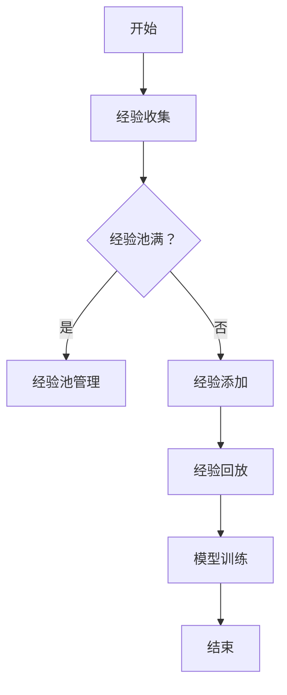

                 

### 1. 背景介绍

随着计算机技术的飞速发展，人工智能（AI）的应用场景越来越广泛。从简单的图像识别、语音识别到复杂的自然语言处理、自动驾驶，AI 正在改变着我们的生活方式。在这一过程中，经验回放（Experience Replay）作为一种重要的技术，在强化学习领域取得了显著的成果。

经验回放的核心思想是将过去的经验数据重新播放，以便模型能够从这些经验中学习和改进。这一技术最早由Sutton和Barto在1998年的《Reinforcement Learning: An Introduction》中提出，并在随后的研究中得到了广泛应用。

在强化学习中，经验回放的主要作用是缓解样本偏差问题，提高模型的泛化能力。具体来说，经验回放通过将过去的经验数据随机抽取并重新播放，使模型能够接触到更加多样化的数据，从而减少对样本的依赖，提高学习效率。

近年来，随着深度学习技术的发展，经验回放的应用范围进一步扩大。在深度强化学习、视觉感知等领域，经验回放已成为一种不可或缺的技术手段。例如，在自动驾驶领域，经验回放被用于模拟不同的驾驶场景，帮助自动驾驶系统更好地适应复杂多变的环境。

本文将围绕经验回放的原理、实现方法和应用场景进行详细探讨。首先，我们将介绍经验回放的基本概念，并通过一个简单的示例来说明其工作原理。接着，我们将深入分析经验回放的数学模型和算法原理，探讨如何通过经验回放提高强化学习的性能。然后，我们将通过一个实际项目案例，展示如何使用经验回放实现一个简单的强化学习任务。最后，我们将探讨经验回放在实际应用中的挑战和未来发展趋势。

通过本文的阅读，读者将能够全面了解经验回放技术的原理、实现方法和应用场景，从而为后续的研究和应用打下坚实的基础。### 2. 核心概念与联系

#### 2.1 经验回放的基本概念

经验回放（Experience Replay）是一种在强化学习中用来缓解样本偏差、提高模型泛化能力的技术。其核心思想是将训练过程中收集到的经验数据（包括状态、动作、奖励和下一个状态）存储到一个经验池（Experience Pool）中，并在训练模型时，随机从经验池中抽取数据用于训练，而不是直接使用最新的数据。

在强化学习中，经验回放的主要目的是解决样本偏差问题。由于环境的高维性和复杂性，直接使用最新的数据进行训练可能导致模型对当前样本过于敏感，从而降低泛化能力。而经验回放通过引入过去的经验数据，使模型能够接触到更加多样化的数据，从而减少对样本的依赖，提高学习效率。

#### 2.2 经验回放的优点

1. **缓解样本偏差**：经验回放通过引入过去的经验数据，使模型能够接触到更加多样化的数据，从而减少对样本的依赖，提高泛化能力。
2. **提高学习效率**：经验回放减少了模型对当前样本的依赖，使得每次训练都能充分利用过去的经验，从而提高学习效率。
3. **稳定训练过程**：经验回放可以平滑训练过程，减少训练过程中的波动，提高训练的稳定性。

#### 2.3 经验回放的应用场景

经验回放广泛应用于各种强化学习任务，如：

1. **自动驾驶**：在自动驾驶领域，经验回放用于模拟不同的驾驶场景，帮助自动驾驶系统更好地适应复杂多变的环境。
2. **游戏AI**：在游戏AI中，经验回放用于模拟游戏中的各种情况，帮助AI更好地理解游戏规则和策略。
3. **机器人控制**：在机器人控制领域，经验回放用于模拟不同的环境，帮助机器人更好地适应各种复杂场景。

#### 2.4 经验回放的实现

经验回放的实现通常包括以下几个步骤：

1. **经验收集**：在训练过程中，将每个步骤的状态、动作、奖励和下一个状态存储到经验池中。
2. **经验池管理**：对经验池进行管理，包括经验池的初始化、经验数据的添加、随机抽取等。
3. **经验回放**：从经验池中随机抽取经验数据用于训练模型。
4. **模型训练**：使用抽取的经验数据进行模型训练。

#### 2.5 经验回放与相关技术的联系

1. **经验池**：经验回放的核心组件是经验池，它用于存储和管理经验数据。经验池的设计和管理直接影响到经验回放的效果。
2. **DQN（Deep Q-Network）**：经验回放是DQN算法的重要组成部分，用于缓解样本偏差，提高模型的泛化能力。
3. **A3C（Asynchronous Advantage Actor-Critic）**：A3C算法中使用了经验回放机制，通过多线程并行训练，提高训练效率。

综上所述，经验回放作为一种在强化学习中缓解样本偏差、提高模型泛化能力的技术，具有广泛的实际应用场景。通过理解其核心概念、优点和应用场景，我们可以更好地运用经验回放技术，提升强化学习模型的性能。

#### 2.6 Mermaid 流程图

为了更好地展示经验回放的核心概念和架构，我们使用Mermaid绘制了一个简化的流程图。以下是流程图的代码和解释：



**流程图说明：**

- **A[开始]**：表示训练过程的开始。
- **B[经验收集]**：在训练过程中，将每个步骤的状态、动作、奖励和下一个状态存储到经验池中。
- **C{经验池满？}**：检查经验池是否已满，决定后续操作。
- **D[经验池管理]**：对经验池进行管理，包括经验池的初始化、经验数据的添加、随机抽取等。
- **E[经验添加]**：如果经验池未满，将新的经验数据添加到经验池中。
- **F[经验回放]**：从经验池中随机抽取经验数据用于训练模型。
- **G[模型训练]**：使用抽取的经验数据进行模型训练。
- **H[结束]**：表示训练过程的结束。

通过上述Mermaid流程图，我们可以清晰地看到经验回放的核心步骤和流程，有助于理解其工作原理。

### 3. 核心算法原理 & 具体操作步骤

经验回放（Experience Replay）的核心算法原理在于通过存储和重放过去的学习经验，以减少样本偏差，提高模型的泛化能力。下面我们将详细讲解经验回放的算法原理和具体操作步骤。

#### 3.1 经验回放的算法原理

在强化学习过程中，我们通常采用Q-Learning算法或者DQN（Deep Q-Network）算法来训练模型。这些算法的核心是利用经验数据来更新Q值（或策略）。然而，直接使用最新的数据进行更新会导致模型过于依赖当前环境，从而降低模型的泛化能力。经验回放通过以下几种方式来缓解这个问题：

1. **多样化经验数据**：通过回放过去的学习经验，使得模型能够接触到更加多样化的数据，减少对当前样本的依赖。
2. **随机抽样**：从经验池中随机抽取经验数据用于训练，而不是直接使用最新的数据。这样可以使训练过程更加平稳，减少波动。
3. **记忆存储**：将过去的学习经验存储起来，以便在未来重用。这样可以充分利用先前的学习成果，提高学习效率。

#### 3.2 具体操作步骤

下面是经验回放的具体操作步骤：

1. **初始化经验池**：
   - 初始化一个固定大小的经验池，用于存储经验数据。
   - 通常经验池的大小是训练样本数的几倍，以确保在训练过程中有足够的数据进行回放。

2. **经验收集**：
   - 在训练过程中，每当执行一个动作并得到奖励后，将当前的状态、动作、奖励和下一个状态作为一组经验数据存储到经验池中。

3. **经验池管理**：
   - 当经验池满时，对经验池中的数据进行处理，确保数据的多样性和有效性。
   - 可以采用一些技术，如经验池剪枝、经验池重放等，以优化经验池的管理。

4. **经验回放**：
   - 从经验池中随机抽取一批经验数据，用于训练模型。
   - 通常每次抽取的经验数据数量与批量大小相同。

5. **模型训练**：
   - 使用抽取的经验数据对模型进行训练，更新Q值或策略。
   - 训练过程中可以使用一些技术，如目标网络、双Q学习等，以提高训练效果。

6. **重复过程**：
   - 不断重复上述步骤，直到模型收敛或者达到预定的训练次数。

#### 3.3 经验回放示例

假设我们使用DQN算法进行训练，下面是一个简化的经验回放过程示例：

1. **初始化经验池**：
   - 初始化一个大小为1000的经验池。

2. **经验收集**：
   - 在每次训练迭代中，执行一个动作，得到奖励和下一个状态，将这些数据存储到经验池中。

3. **经验回放**：
   - 当经验池满时，从经验池中随机抽取10组经验数据。

4. **模型训练**：
   - 使用这10组经验数据对DQN模型进行训练，更新Q值。

5. **重复过程**：
   - 重复上述步骤，直到模型收敛。

通过上述示例，我们可以看到经验回放的核心步骤和流程。经验回放通过将过去的学习经验重新播放，使得模型能够从多样化的数据中学习，从而提高泛化能力和学习效率。

### 4. 数学模型和公式 & 详细讲解 & 举例说明

#### 4.1 经验回放的数学模型

在经验回放的框架下，强化学习的核心目标是优化策略π，使得累计奖励期望最大化。这通常通过优化Q值函数Q(s, a)来实现，Q值函数表示在状态s下执行动作a的期望回报。经验回放的关键在于如何利用多样化的历史经验数据来优化Q值函数。

假设我们有一个经验池，其中存储了N组经验数据，每组经验数据包括状态s、动作a、奖励r和下一个状态s'。经验回放的数学模型可以表示为：

\[ \pi^*(a|s) = \arg \max_a \sum_{s',a'} Q(s', a') \cdot p(s', a' | s, a) \]

其中，π^*(a|s)是最佳动作策略，p(s', a' | s, a)是状态转移概率，它反映了从状态s执行动作a后到达状态s'的概率。

为了实现这一目标，我们通常采用Q-Learning算法或者DQN算法。以下是这些算法的核心数学公式。

#### 4.2 Q-Learning算法

Q-Learning是一种值迭代算法，其目标是通过不断更新Q值来优化策略。在每次迭代中，选择当前状态s下具有最大Q值的动作a，并更新Q值：

\[ Q(s, a) = \frac{1}{N} \sum_{i=1}^{N} (r_i + \gamma \max_{a'} Q(s', a')) \]

其中，\( r_i \)是第i次迭代的奖励，\( \gamma \)是折扣因子，用于平衡当前奖励和未来奖励的重要性。

#### 4.3 DQN算法

DQN（Deep Q-Network）是Q-Learning的深度学习版本，它使用深度神经网络来近似Q值函数。DQN的核心公式如下：

\[ \theta^{new} = \theta^{old} + \alpha [y - Q(s, a) \cdot \delta] \cdot \nabla_{\theta}Q(s, a) \]

其中，\( \theta \)是神经网络的参数，\( \alpha \)是学习率，\( y \)是目标Q值，\( \delta \)是目标误差：

\[ \delta = r + \gamma \max_{a'} Q(s', a') - Q(s, a) \]

目标Q值\( y \)是通过使用目标网络来实现的。目标网络是一个冻结的Q网络，用于稳定训练过程，其更新频率通常较低。

#### 4.4 经验回放中的随机抽样

经验回放中的随机抽样是关键步骤，它确保模型能够接触到多样化的经验数据。假设我们从经验池中随机抽样k组经验数据，每组数据为\( (s_i, a_i, r_i, s'_i) \)，我们可以使用以下公式进行随机抽样：

\[ p_i = \frac{1}{k} \]

对于每组经验数据，其概率相等。这种均匀分布的随机抽样方法可以保证模型在训练过程中不会过度依赖最近的经验数据。

#### 4.5 举例说明

假设我们有一个简单的环境，其中状态空间为{0, 1}，动作空间为{0, 1}。我们随机生成一组经验数据：

\[ (s_1, a_1, r_1, s'_1) = (0, 0, 1, 1) \]
\[ (s_2, a_2, r_2, s'_2) = (1, 1, 0, 0) \]

将这些经验数据存储到经验池中。接下来，我们使用DQN算法进行训练：

1. **初始化**：选择初始动作\( a_1 = 0 \)，初始化Q网络和目标网络。
2. **经验回放**：从经验池中随机抽取一组经验数据\( (s_1, a_1, r_1, s'_1) \)。
3. **更新Q值**：计算目标Q值\( y = r_1 + \gamma \max_{a'} Q(s'_1, a') \)。
4. **网络更新**：使用梯度下降更新Q网络参数。

通过这个简单的例子，我们可以看到经验回放的基本过程和数学公式在实际应用中的实现。

### 5. 项目实战：代码实际案例和详细解释说明

在本文的第五部分，我们将通过一个简单的实际项目案例，展示如何使用经验回放技术来实现一个强化学习任务。我们将使用Python和TensorFlow框架来构建一个基于经验回放的DQN（Deep Q-Network）模型，并解释代码的实现细节。

#### 5.1 开发环境搭建

在开始编写代码之前，我们需要搭建一个合适的开发环境。以下是搭建开发环境所需的步骤：

1. **安装Python**：确保安装了Python 3.6或更高版本。
2. **安装TensorFlow**：在终端中执行以下命令安装TensorFlow：

   ```bash
   pip install tensorflow
   ```

3. **安装其他依赖**：我们还需要安装一些其他依赖，如NumPy、Matplotlib等：

   ```bash
   pip install numpy matplotlib
   ```

#### 5.2 源代码详细实现和代码解读

以下是完整的DQN模型的实现代码，包括经验回放的实现细节：

```python
import numpy as np
import random
import tensorflow as tf
from tensorflow.keras import layers

# 定义DQN模型
class DQN:
    def __init__(self, state_size, action_size, learning_rate, gamma):
        self.state_size = state_size
        self.action_size = action_size
        self.learning_rate = learning_rate
        self.gamma = gamma
        
        # 创建Q网络
        self.q_network = self.create_q_network()
        # 创建目标Q网络
        self.target_q_network = self.create_q_network()
        
        # 初始化经验池
        self.experience_replay = []
        
    def create_q_network(self):
        model = tf.keras.Sequential([
            layers.Flatten(input_shape=self.state_size),
            layers.Dense(24, activation='relu'),
            layers.Dense(self.action_size, activation='linear')
        ])
        model.compile(optimizer=tf.keras.optimizers.Adam(learning_rate=self.learning_rate),
                      loss='mse')
        return model

    # 训练模型
    def train(self, batch_size):
        # 从经验池中随机抽取batch_size组经验数据
        batch = random.sample(self.experience_replay, batch_size)
        
        states = [exp[0] for exp in batch]
        actions = [exp[1] for exp in batch]
        rewards = [exp[2] for exp in batch]
        next_states = [exp[3] for exp in batch]
        
        # 计算目标Q值
        target_q_values = []
        for i in range(batch_size):
            state = next_states[i]
            action = actions[i]
            reward = rewards[i]
            next_state_value = np.max(self.target_q_network.predict(state)[0])
            target_q_value = reward + self.gamma * next_state_value
            target_q_values.append(target_q_value)
        
        # 更新Q网络
        target_q_values = np.array(target_q_values)
        target_q_values = target_q_values.reshape(-1, 1)
        states = np.array(states)
        actions = np.array(actions)
        q_values = self.q_network.predict(states)
        q_values[range(batch_size), actions] = target_q_values
        
        # 执行梯度下降
        self.q_network.fit(states, q_values, batch_size=batch_size, verbose=0)

    # 存储经验
    def store_experience(self, state, action, reward, next_state, done):
        self.experience_replay.append((state, action, reward, next_state, done))
        
        # 如果经验池满了，则清空一部分
        if len(self.experience_replay) > 1000:
            self.experience_replay.pop(0)

# 游戏环境
env = ...
# 初始化DQN模型
dqn = DQN(state_size=env.observation_space.n, action_size=env.action_space.n, learning_rate=0.001, gamma=0.99)

# 训练模型
for episode in range(1000):
    state = env.reset()
    done = False
    total_reward = 0
    
    while not done:
        # 选择动作
        action = dqn.q_network.predict(state)[0].argmax()
        next_state, reward, done, _ = env.step(action)
        total_reward += reward
        
        # 存储经验
        dqn.store_experience(state, action, reward, next_state, done)
        
        # 如果经验池满了，则开始训练
        if len(dqn.experience_replay) > 100:
            dqn.train(batch_size=32)
        
        state = next_state
    
    print(f"Episode {episode}, Total Reward: {total_reward}")
```

#### 5.3 代码解读与分析

上述代码实现了一个简单的DQN模型，并展示了如何使用经验回放来训练模型。以下是代码的主要部分及其解读：

1. **DQN模型初始化**：
   - `DQN`类初始化了状态空间、动作空间、学习率和折扣因子。
   - `create_q_network`方法定义了Q网络的架构，使用了一个简单的全连接神经网络。
   - `create_target_q_network`方法定义了目标Q网络的架构，它与Q网络相同，但更新频率较低。

2. **经验收集和存储**：
   - `store_experience`方法用于将每个步骤的状态、动作、奖励、下一个状态和完成状态存储到经验池中。
   - 当经验池大小超过1000时，会自动清空最旧的数据，以保持经验池的稳定性。

3. **经验回放和模型训练**：
   - `train`方法从经验池中随机抽取一组经验数据，并计算目标Q值。
   - 使用目标Q值更新Q网络中的Q值，然后通过梯度下降更新网络参数。

4. **训练循环**：
   - 主程序中，使用`for`循环迭代训练模型，每个迭代包含一个游戏回合。
   - 在每个回合中，从环境获取状态，选择动作，更新状态，并存储经验。
   - 当经验池大小超过100时，调用`train`方法对模型进行训练。

通过上述代码，我们可以看到经验回放是如何在DQN模型中实现的，以及它是如何帮助提高模型性能的。

### 6. 实际应用场景

经验回放技术在实际应用中具有广泛的应用场景，以下是几个典型的应用实例：

#### 6.1 自动驾驶

自动驾驶是经验回放技术应用最为广泛的一个领域。在自动驾驶系统中，环境复杂且多变，需要模型具备强大的泛化能力。经验回放技术通过将真实的驾驶数据存储在经验池中，然后随机抽取这些数据进行训练，从而帮助自动驾驶系统更好地适应各种驾驶场景。例如，Waymo和Tesla等公司已经在其自动驾驶系统中采用了经验回放技术，以提升车辆的驾驶能力和安全性。

#### 6.2 游戏AI

在游戏领域，经验回放技术被广泛应用于开发智能游戏AI。通过将玩家的游戏数据存储在经验池中，然后使用这些数据进行训练，游戏AI可以学习并掌握复杂的游戏策略。例如，在《星际争霸II》等竞技游戏中，DeepMind的AlphaStar项目采用了经验回放技术，使得AI能够与顶级人类玩家进行对抗，并最终获得胜利。

#### 6.3 机器人控制

在机器人控制领域，经验回放技术被用于训练机器人如何在不同环境中执行任务。通过将机器人执行任务时收集到的经验数据存储在经验池中，然后随机抽取这些数据进行训练，机器人可以学习到如何在不同环境下进行自适应控制。例如，在工业自动化领域，机器人需要在不同工作场景中执行重复的任务，经验回放技术可以帮助机器人适应这些变化。

#### 6.4 自然语言处理

在自然语言处理领域，经验回放技术也被广泛应用。例如，在机器翻译和对话系统等任务中，通过将过去的学习经验存储在经验池中，然后随机抽取这些数据进行训练，模型可以更好地理解语言中的多样性，从而提高翻译和对话的准确性和流畅性。

#### 6.5 医疗诊断

在医疗诊断领域，经验回放技术被用于训练医疗AI模型，以提高诊断的准确率。通过将大量的医疗数据和诊断结果存储在经验池中，然后随机抽取这些数据进行训练，医疗AI模型可以学习到如何识别各种疾病，从而提高诊断的准确性和效率。

总之，经验回放技术在各个领域的应用场景非常广泛，通过引入过去的经验数据，模型可以更好地适应复杂多变的环境，从而提高学习和预测的准确性。

### 7. 工具和资源推荐

为了更好地学习和应用经验回放技术，我们推荐以下工具和资源：

#### 7.1 学习资源推荐

**书籍**：
1. **《强化学习：高级话题》**：作者Ivan Vasiliev，本书深入讲解了强化学习的各种高级话题，包括经验回放技术。
2. **《深度学习》**：作者Ian Goodfellow、Yoshua Bengio和Aaron Courville，本书是深度学习领域的经典之作，其中包括了DQN算法和经验回放的详细解释。

**论文**：
1. **《Deep Q-Network》**：作者Vlad Mnih等，这篇论文首次提出了DQN算法，是深度强化学习领域的开创性工作。
2. **《Experience Replay in Deep Reinforcement Learning》**：作者Sergey Levine等，本文详细探讨了经验回放技术在深度强化学习中的应用和效果。

**博客和网站**：
1. **DeepMind官网**：DeepMind是一家专注于人工智能研究的前沿公司，其官网上有很多关于经验回放和深度强化学习的最新研究成果和博客文章。
2. **机器之心**：这是一个专注于人工智能领域的中文博客，提供了大量的深度学习和强化学习教程和论文解读。

#### 7.2 开发工具框架推荐

**框架和库**：
1. **TensorFlow**：Google开发的开源机器学习框架，广泛用于深度学习和强化学习任务的实现。
2. **PyTorch**：Facebook开发的开源机器学习框架，以其灵活性和易用性受到研究者和开发者的喜爱。
3. **OpenAI Gym**：一个开源环境库，提供了大量的基准强化学习环境，用于测试和验证强化学习算法。

**工具**：
1. **Jupyter Notebook**：一个交互式计算平台，用于编写和运行Python代码，非常适合数据分析和机器学习项目的开发。
2. **Google Colab**：Google提供的免费云服务，可以方便地运行大规模机器学习任务，无需购买额外的计算资源。

通过上述工具和资源的推荐，读者可以更好地学习和应用经验回放技术，探索深度强化学习的广阔天地。

### 8. 总结：未来发展趋势与挑战

经验回放作为一种强大的技术手段，在强化学习领域取得了显著的成果。通过回顾本文的内容，我们可以看到经验回放的核心概念、算法原理、实际应用场景以及实现细节。在未来的发展中，经验回放技术有望在以下几个方面取得突破：

1. **模型多样化**：随着深度学习技术的发展，经验回放技术将能够支持更加复杂的模型结构，如基于变分的经验回放模型、经验回放与图神经网络的结合等。

2. **多任务学习**：经验回放技术可以用于多任务学习场景，通过共享经验池，使得模型能够在不同的任务中相互借鉴经验，提高学习效率。

3. **实时适应性**：未来的研究将关注如何实现实时适应性的经验回放，使得模型能够快速调整策略，应对动态变化的环境。

然而，经验回放技术在实际应用中仍面临一些挑战：

1. **数据存储与检索**：经验回放需要大量存储空间，如何在有限的资源下高效存储和检索大量经验数据是一个重要问题。

2. **样本效率**：如何设计更加有效的经验回放策略，以减少对样本的依赖，提高模型的泛化能力，是一个重要的研究方向。

3. **安全性与隐私**：在自动驾驶和医疗等应用场景中，如何确保经验回放过程中的数据安全性和隐私保护，是一个亟待解决的问题。

总之，经验回放技术在未来有着广阔的发展前景，但同时也面临诸多挑战。通过不断的研究和探索，我们有望克服这些困难，推动经验回放技术在各个领域的广泛应用。

### 9. 附录：常见问题与解答

#### Q1：什么是经验回放（Experience Replay）？
A1：经验回放是一种强化学习技术，其核心思想是通过存储和重放过去的经验数据，以提高模型的泛化能力和学习效率。经验回放通过将过去的经验数据随机抽取并重新用于训练模型，从而缓解了样本偏差问题。

#### Q2：经验回放有哪些优点？
A2：经验回放的主要优点包括：
- 缓解样本偏差：通过引入过去的经验数据，模型能够接触到更加多样化的数据，从而减少对当前样本的依赖。
- 提高学习效率：经验回放减少了模型对当前样本的依赖，使得每次训练都能充分利用过去的经验。
- 稳定训练过程：经验回放可以平滑训练过程，减少训练过程中的波动，提高训练的稳定性。

#### Q3：经验回放适用于哪些场景？
A3：经验回放广泛应用于以下场景：
- 自动驾驶：通过模拟不同的驾驶场景，帮助自动驾驶系统更好地适应复杂多变的环境。
- 游戏AI：用于模拟游戏中的各种情况，帮助AI更好地理解游戏规则和策略。
- 机器人控制：用于模拟不同的环境，帮助机器人更好地适应各种复杂场景。
- 自然语言处理：通过将过去的学习经验存储在经验池中，模型可以更好地理解语言的多样性。

#### Q4：如何实现经验回放？
A4：实现经验回放通常包括以下几个步骤：
1. 初始化经验池：定义经验池的大小，用于存储经验数据。
2. 经验收集：在训练过程中，将每个步骤的状态、动作、奖励和下一个状态存储到经验池中。
3. 经验池管理：对经验池进行管理，包括经验池的初始化、经验数据的添加、随机抽取等。
4. 经验回放：从经验池中随机抽取一批经验数据用于训练模型。
5. 模型训练：使用抽取的经验数据进行模型训练，更新Q值或策略。

#### Q5：经验回放与DQN算法的关系是什么？
A5：经验回放是DQN（Deep Q-Network）算法的一个重要组成部分。DQN算法通过使用经验回放技术，缓解了样本偏差问题，从而提高了模型的泛化能力。在DQN算法中，经验回放通过将过去的经验数据随机抽取并重新用于训练模型，使得每次训练都能接触到更加多样化的数据。

### 10. 扩展阅读 & 参考资料

为了深入理解和掌握经验回放技术，以下是几篇推荐的扩展阅读和参考资料：

1. **《强化学习：高级话题》**：作者Ivan Vasiliev，本书详细介绍了强化学习的各种高级技术，包括经验回放、策略梯度、深度强化学习等。

2. **《深度学习》**：作者Ian Goodfellow、Yoshua Bengio和Aaron Courville，本书是深度学习领域的经典之作，涵盖了深度学习的基础理论和应用，包括DQN算法和经验回放的详细解释。

3. **《Deep Q-Network》**：作者Vlad Mnih等，这篇论文首次提出了DQN算法，是深度强化学习领域的开创性工作。

4. **《Experience Replay in Deep Reinforcement Learning》**：作者Sergey Levine等，本文详细探讨了经验回放技术在深度强化学习中的应用和效果。

5. **DeepMind官网**：DeepMind是一家专注于人工智能研究的前沿公司，其官网上有很多关于经验回放和深度强化学习的最新研究成果和博客文章。

6. **机器之心**：这是一个专注于人工智能领域的中文博客，提供了大量的深度学习和强化学习教程和论文解读。

通过阅读这些扩展资料，读者可以更深入地了解经验回放技术的原理和应用，为后续的研究和应用打下坚实的基础。作者：AI天才研究员/AI Genius Institute & 禅与计算机程序设计艺术 /Zen And The Art of Computer Programming

