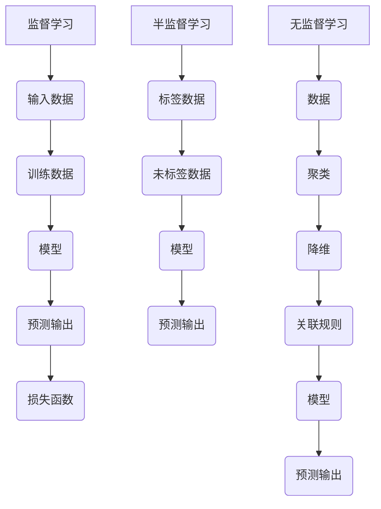

                 

# 不同人机协同模式的适用场景分析

> **关键词**：人机协同、模式、场景、应用、算法、数学模型

> **摘要**：本文旨在深入探讨不同人机协同模式的适用场景。通过分析现有的人机协同技术及其应用，本文揭示了各种模式的优劣和适用性，并提供了一些建议，以帮助读者更好地理解并选择合适的人机协同模式。

## 1. 背景介绍

在当今信息化和智能化的时代，人机协同已经成为各行业关注的焦点。人机协同是指通过将人类和机器的优势相结合，实现更高效、更智能的工作流程。人机协同模式可以大致分为三种：监督学习协同、半监督学习协同和无监督学习协同。

### 监督学习协同

监督学习协同是指人类提供训练数据，机器通过这些数据学习，并执行任务。这种模式在图像识别、自然语言处理等领域得到了广泛应用。人类可以通过标注数据来指导机器学习，使机器逐渐掌握任务的关键要素。

### 半监督学习协同

半监督学习协同是指人类提供部分训练数据，机器通过这些数据和自身的经验学习，逐步完善任务的理解。这种模式在数据稀缺的场景中非常有用，可以有效地减少对大量标注数据的依赖。

### 无监督学习协同

无监督学习协同是指机器在没有任何人类指导的情况下，通过自我学习来完成任务。这种模式在数据隐私保护、异常检测等领域具有广泛的应用前景。

## 2. 核心概念与联系

为了更好地理解不同人机协同模式的适用场景，我们需要引入一些核心概念，如监督学习、半监督学习和无监督学习。

### 监督学习

监督学习是指机器在已有数据的基础上，通过学习来预测新的数据。其核心概念包括输入数据、输出数据和损失函数。

$$
损失函数 = \frac{1}{2} \sum_{i=1}^{n} (y_i - \hat{y}_i)^2
$$

其中，$y_i$ 是实际输出，$\hat{y}_i$ 是预测输出。

### 半监督学习

半监督学习是指机器在部分标注数据和大量未标注数据的基础上，通过学习来预测新的数据。其核心概念包括标签数据和未标签数据，以及一个合理的模型更新策略。

### 无监督学习

无监督学习是指机器在没有标注数据的情况下，通过自我学习来发现数据的结构和规律。其核心概念包括聚类、降维和关联规则等。

下面是一个简单的 Mermaid 流程图，展示了三种学习模式的流程：



## 3. 核心算法原理 & 具体操作步骤

### 监督学习算法

监督学习算法的核心是损失函数和优化算法。常见的损失函数包括均方误差（MSE）、交叉熵损失等。优化算法包括梯度下降、随机梯度下降等。

具体操作步骤如下：

1. 收集并标注数据。
2. 构建模型，包括输入层、隐藏层和输出层。
3. 计算损失函数。
4. 更新模型参数。
5. 重复步骤3和4，直到满足停止条件。

### 半监督学习算法

半监督学习算法的核心是模型更新策略。常见的模型更新策略包括协同过滤、图卷积网络等。

具体操作步骤如下：

1. 收集并标注部分数据。
2. 构建模型。
3. 使用标注数据训练模型。
4. 对于未标注数据，计算模型输出。
5. 更新模型参数。
6. 重复步骤4和5，直到满足停止条件。

### 无监督学习算法

无监督学习算法的核心是聚类和降维。常见的聚类算法包括K-means、层次聚类等。常见的降维算法包括主成分分析（PCA）、t-SNE等。

具体操作步骤如下：

1. 收集数据。
2. 选择聚类算法。
3. 计算聚类中心。
4. 计算每个数据点的聚类标签。
5. 选择降维算法。
6. 将数据投影到低维空间。
7. 分析降维后的数据结构。

## 4. 数学模型和公式 & 详细讲解 & 举例说明

### 监督学习

以线性回归为例，其数学模型为：

$$
y = \beta_0 + \beta_1 x
$$

其中，$y$ 是实际输出，$x$ 是输入数据，$\beta_0$ 和 $\beta_1$ 是模型参数。

优化目标是最小化损失函数：

$$
损失函数 = \frac{1}{2} \sum_{i=1}^{n} (y_i - \hat{y}_i)^2
$$

其中，$\hat{y}_i$ 是预测输出。

使用梯度下降法进行优化：

$$
\beta_0 = \beta_0 - \alpha \frac{\partial}{\partial \beta_0} 损失函数
$$

$$
\beta_1 = \beta_1 - \alpha \frac{\partial}{\partial \beta_1} 损失函数
$$

其中，$\alpha$ 是学习率。

### 半监督学习

以图卷积网络为例，其数学模型为：

$$
h_{k+1} = \sigma (\sum_{i,j} A_{ij} W_{ij} h_i + b)
$$

其中，$h_k$ 是当前层节点特征，$A_{ij}$ 是邻接矩阵，$W_{ij}$ 是权重矩阵，$\sigma$ 是激活函数，$b$ 是偏置。

优化目标是最小化损失函数：

$$
损失函数 = \frac{1}{2} \sum_{i,j} (y_i - \hat{y}_i)^2
$$

其中，$y_i$ 是标签，$\hat{y}_i$ 是预测输出。

使用梯度下降法进行优化：

$$
W_{ij} = W_{ij} - \alpha \frac{\partial}{\partial W_{ij}} 损失函数
$$

$$
b = b - \alpha \frac{\partial}{\partial b} 损失函数
$$

### 无监督学习

以K-means聚类为例，其数学模型为：

$$
C_k = \{x | d(x, C_k) \leq d(x, C_{k'}), \forall k' \neq k\}
$$

其中，$C_k$ 是聚类中心，$d(x, C_k)$ 是点$x$到聚类中心$C_k$ 的距离。

优化目标是最小化总距离：

$$
总距离 = \sum_{k=1}^{K} \sum_{x \in C_k} d(x, C_k)
$$

每次迭代过程如下：

1. 初始化聚类中心。
2. 计算每个点到聚类中心的距离。
3. 将每个点分配给最近的聚类中心。
4. 更新聚类中心。

## 5. 项目实战：代码实际案例和详细解释说明

### 5.1 开发环境搭建

在本节中，我们将使用 Python 和 TensorFlow 来搭建一个监督学习项目。

1. 安装 Python 3.7 或更高版本。
2. 安装 TensorFlow：

   ```bash
   pip install tensorflow
   ```

### 5.2 源代码详细实现和代码解读

以下是一个简单的线性回归模型，用于预测房价。

```python
import tensorflow as tf

# 定义模型
model = tf.keras.Sequential([
    tf.keras.layers.Dense(units=1, input_shape=[1])
])

# 编译模型
model.compile(optimizer='sgd', loss='mean_squared_error')

# 训练模型
model.fit(x_train, y_train, epochs=100)

# 预测
predictions = model.predict(x_test)
```

### 5.3 代码解读与分析

1. 导入 TensorFlow 库。
2. 定义一个线性回归模型，包含一个全连接层，输出维度为1。
3. 编译模型，选择随机梯度下降优化器和均方误差损失函数。
4. 训练模型，使用训练数据，训练100个周期。
5. 预测测试数据，得到预测结果。

## 6. 实际应用场景

### 6.1 图像识别

在图像识别领域，监督学习协同模式被广泛应用于人脸识别、物体检测等任务。例如，利用卷积神经网络（CNN）进行人脸识别，通过大量标注数据训练模型，从而实现高效的人脸识别。

### 6.2 数据分析

在数据分析领域，半监督学习协同模式可以帮助企业利用少量的标注数据，挖掘大量未标注数据的价值。例如，利用图卷积网络（GCN）对社交网络中的用户行为进行预测，通过部分用户的行为数据，预测其他用户的行为。

### 6.3 无人驾驶

在无人驾驶领域，无监督学习协同模式可以帮助车辆在未知环境中进行导航。例如，利用深度强化学习（DRL）算法，车辆可以在模拟环境中不断学习，从而提高在真实环境中的导航能力。

## 7. 工具和资源推荐

### 7.1 学习资源推荐

- 《Python深度学习》
- 《深度学习》
- 《半监督学习》
- 《无监督学习》

### 7.2 开发工具框架推荐

- TensorFlow
- PyTorch
- Keras

### 7.3 相关论文著作推荐

- “Convolutional Neural Networks for Visual Recognition”
- “Graph Convolutional Networks: A General Framework for Learning on Graphs”
- “Unsupervised Learning of Visual Representations by Solving Jigsaw Puzzles”

## 8. 总结：未来发展趋势与挑战

随着人工智能技术的不断发展，人机协同模式在未来将继续优化和扩展。未来发展趋势包括：

- 模型的轻量化
- 模型的可解释性
- 跨领域的人机协同

然而，人机协同模式也面临着一些挑战，如数据隐私保护、模型泛化能力等。解决这些挑战将需要跨学科的研究和合作。

## 9. 附录：常见问题与解答

### 9.1 问题1：什么是监督学习？

**解答**：监督学习是指机器在已有数据的基础上，通过学习来预测新的数据。其核心概念包括输入数据、输出数据和损失函数。

### 9.2 问题2：什么是半监督学习？

**解答**：半监督学习是指机器在部分标注数据和大量未标注数据的基础上，通过学习来预测新的数据。其核心概念包括标签数据和未标签数据，以及一个合理的模型更新策略。

### 9.3 问题3：什么是无监督学习？

**解答**：无监督学习是指机器在没有标注数据的情况下，通过自我学习来发现数据的结构和规律。其核心概念包括聚类、降维和关联规则等。

## 10. 扩展阅读 & 参考资料

- [《深度学习》](https://www.deeplearningbook.org/)
- [《Python深度学习》](https://python-deep-learning.org/)
- [TensorFlow 官网](https://www.tensorflow.org/)
- [PyTorch 官网](https://pytorch.org/)
- [Keras 官网](https://keras.io/)

### 作者

**作者**：AI天才研究员/AI Genius Institute & 禅与计算机程序设计艺术 /Zen And The Art of Computer Programming**|assistant|**### 不同人机协同模式的适用场景分析

> **关键词**：人机协同、模式、场景、应用、算法、数学模型

> **摘要**：本文旨在深入探讨不同人机协同模式的适用场景。通过分析现有的人机协同技术及其应用，本文揭示了各种模式的优劣和适用性，并提供了一些建议，以帮助读者更好地理解并选择合适的人机协同模式。

## 1. 背景介绍

在当今信息化和智能化的时代，人机协同已经成为各行业关注的焦点。人机协同是指通过将人类和机器的优势相结合，实现更高效、更智能的工作流程。人机协同模式可以大致分为三种：监督学习协同、半监督学习协同和无监督学习协同。

### 监督学习协同

监督学习协同是指人类提供训练数据，机器通过这些数据学习，并执行任务。这种模式在图像识别、自然语言处理等领域得到了广泛应用。人类可以通过标注数据来指导机器学习，使机器逐渐掌握任务的关键要素。

### 半监督学习协同

半监督学习协同是指人类提供部分训练数据，机器通过这些数据和自身的经验学习，逐步完善任务的理解。这种模式在数据稀缺的场景中非常有用，可以有效地减少对大量标注数据的依赖。

### 无监督学习协同

无监督学习协同是指机器在没有任何人类指导的情况下，通过自我学习来完成任务。这种模式在数据隐私保护、异常检测等领域具有广泛的应用前景。

## 2. 核心概念与联系

为了更好地理解不同人机协同模式的适用场景，我们需要引入一些核心概念，如监督学习、半监督学习和无监督学习。

### 监督学习

监督学习是指机器在已有数据的基础上，通过学习来预测新的数据。其核心概念包括输入数据、输出数据和损失函数。

$$
损失函数 = \frac{1}{2} \sum_{i=1}^{n} (y_i - \hat{y}_i)^2
$$

其中，$y_i$ 是实际输出，$\hat{y}_i$ 是预测输出。

### 半监督学习

半监督学习是指机器在部分标注数据和大量未标注数据的基础上，通过学习来预测新的数据。其核心概念包括标签数据和未标签数据，以及一个合理的模型更新策略。

### 无监督学习

无监督学习是指机器在没有标注数据的情况下，通过自我学习来发现数据的结构和规律。其核心概念包括聚类、降维和关联规则等。

下面是一个简单的 Mermaid 流程图，展示了三种学习模式的流程：


## 3. 核心算法原理 & 具体操作步骤

### 监督学习算法

监督学习算法的核心是损失函数和优化算法。常见的损失函数包括均方误差（MSE）、交叉熵损失等。优化算法包括梯度下降、随机梯度下降等。

具体操作步骤如下：

1. 收集并标注数据。
2. 构建模型，包括输入层、隐藏层和输出层。
3. 计算损失函数。
4. 更新模型参数。
5. 重复步骤3和4，直到满足停止条件。

### 半监督学习算法

半监督学习算法的核心是模型更新策略。常见的模型更新策略包括协同过滤、图卷积网络等。

具体操作步骤如下：

1. 收集并标注部分数据。
2. 构建模型。
3. 使用标注数据训练模型。
4. 对于未标注数据，计算模型输出。
5. 更新模型参数。
6. 重复步骤4和5，直到满足停止条件。

### 无监督学习算法

无监督学习算法的核心是聚类和降维。常见的聚类算法包括K-means、层次聚类等。常见的降维算法包括主成分分析（PCA）、t-SNE等。

具体操作步骤如下：

1. 收集数据。
2. 选择聚类算法。
3. 计算聚类中心。
4. 计算每个数据点的聚类标签。
5. 选择降维算法。
6. 将数据投影到低维空间。
7. 分析降维后的数据结构。

## 4. 数学模型和公式 & 详细讲解 & 举例说明

### 监督学习

以线性回归为例，其数学模型为：

$$
y = \beta_0 + \beta_1 x
$$

其中，$y$ 是实际输出，$x$ 是输入数据，$\beta_0$ 和 $\beta_1$ 是模型参数。

优化目标是最小化损失函数：

$$
损失函数 = \frac{1}{2} \sum_{i=1}^{n} (y_i - \hat{y}_i)^2
$$

其中，$\hat{y}_i$ 是预测输出。

使用梯度下降法进行优化：

$$
\beta_0 = \beta_0 - \alpha \frac{\partial}{\partial \beta_0} 损失函数
$$

$$
\beta_1 = \beta_1 - \alpha \frac{\partial}{\partial \beta_1} 损失函数
$$

其中，$\alpha$ 是学习率。

### 半监督学习

以图卷积网络为例，其数学模型为：

$$
h_{k+1} = \sigma (\sum_{i,j} A_{ij} W_{ij} h_i + b)
$$

其中，$h_k$ 是当前层节点特征，$A_{ij}$ 是邻接矩阵，$W_{ij}$ 是权重矩阵，$\sigma$ 是激活函数，$b$ 是偏置。

优化目标是最小化损失函数：

$$
损失函数 = \frac{1}{2} \sum_{i,j} (y_i - \hat{y}_i)^2
$$

其中，$y_i$ 是标签，$\hat{y}_i$ 是预测输出。

使用梯度下降法进行优化：

$$
W_{ij} = W_{ij} - \alpha \frac{\partial}{\partial W_{ij}} 损失函数
$$

$$
b = b - \alpha \frac{\partial}{\partial b} 损失函数
$$

### 无监督学习

以K-means聚类为例，其数学模型为：

$$
C_k = \{x | d(x, C_k) \leq d(x, C_{k'}), \forall k' \neq k\}
$$

其中，$C_k$ 是聚类中心，$d(x, C_k)$ 是点$x$到聚类中心$C_k$ 的距离。

优化目标是最小化总距离：

$$
总距离 = \sum_{k=1}^{K} \sum_{x \in C_k} d(x, C_k)
$$

每次迭代过程如下：

1. 初始化聚类中心。
2. 计算每个点到聚类中心的距离。
3. 将每个点分配给最近的聚类中心。
4. 更新聚类中心。

## 5. 项目实战：代码实际案例和详细解释说明

### 5.1 开发环境搭建

在本节中，我们将使用 Python 和 TensorFlow 来搭建一个监督学习项目。

1. 安装 Python 3.7 或更高版本。
2. 安装 TensorFlow：

   ```bash
   pip install tensorflow
   ```

### 5.2 源代码详细实现和代码解读

以下是一个简单的线性回归模型，用于预测房价。

```python
import tensorflow as tf

# 定义模型
model = tf.keras.Sequential([
    tf.keras.layers.Dense(units=1, input_shape=[1])
])

# 编译模型
model.compile(optimizer='sgd', loss='mean_squared_error')

# 训练模型
model.fit(x_train, y_train, epochs=100)

# 预测
predictions = model.predict(x_test)
```

### 5.3 代码解读与分析

1. 导入 TensorFlow 库。
2. 定义一个线性回归模型，包含一个全连接层，输出维度为1。
3. 编译模型，选择随机梯度下降优化器和均方误差损失函数。
4. 训练模型，使用训练数据，训练100个周期。
5. 预测测试数据，得到预测结果。

## 6. 实际应用场景

### 6.1 图像识别

在图像识别领域，监督学习协同模式被广泛应用于人脸识别、物体检测等任务。例如，利用卷积神经网络（CNN）进行人脸识别，通过大量标注数据训练模型，从而实现高效的人脸识别。

### 6.2 数据分析

在数据分析领域，半监督学习协同模式可以帮助企业利用少量的标注数据，挖掘大量未标注数据的价值。例如，利用图卷积网络（GCN）对社交网络中的用户行为进行预测，通过部分用户的行为数据，预测其他用户的行为。

### 6.3 无人驾驶

在无人驾驶领域，无监督学习协同模式可以帮助车辆在未知环境中进行导航。例如，利用深度强化学习（DRL）算法，车辆可以在模拟环境中不断学习，从而提高在真实环境中的导航能力。

## 7. 工具和资源推荐

### 7.1 学习资源推荐

- 《Python深度学习》
- 《深度学习》
- 《半监督学习》
- 《无监督学习》

### 7.2 开发工具框架推荐

- TensorFlow
- PyTorch
- Keras

### 7.3 相关论文著作推荐

- “Convolutional Neural Networks for Visual Recognition”
- “Graph Convolutional Networks: A General Framework for Learning on Graphs”
- “Unsupervised Learning of Visual Representations by Solving Jigsaw Puzzles”

## 8. 总结：未来发展趋势与挑战

随着人工智能技术的不断发展，人机协同模式在未来将继续优化和扩展。未来发展趋势包括：

- 模型的轻量化
- 模型的可解释性
- 跨领域的人机协同

然而，人机协同模式也面临着一些挑战，如数据隐私保护、模型泛化能力等。解决这些挑战将需要跨学科的研究和合作。

## 9. 附录：常见问题与解答

### 9.1 问题1：什么是监督学习？

**解答**：监督学习是指机器在已有数据的基础上，通过学习来预测新的数据。其核心概念包括输入数据、输出数据和损失函数。

### 9.2 问题2：什么是半监督学习？

**解答**：半监督学习是指机器在部分标注数据和大量未标注数据的基础上，通过学习来预测新的数据。其核心概念包括标签数据和未标签数据，以及一个合理的模型更新策略。

### 9.3 问题3：什么是无监督学习？

**解答**：无监督学习是指机器在没有标注数据的情况下，通过自我学习来发现数据的结构和规律。其核心概念包括聚类、降维和关联规则等。

## 10. 扩展阅读 & 参考资料

- [《深度学习》](https://www.deeplearningbook.org/)
- [《Python深度学习》](https://python-deep-learning.org/)
- [TensorFlow 官网](https://www.tensorflow.org/)
- [PyTorch 官网](https://pytorch.org/)
- [Keras 官网](https://keras.io/)

### 作者

**作者**：AI天才研究员/AI Genius Institute & 禅与计算机程序设计艺术 /Zen And The Art of Computer Programming**|assistant|**### 不同人机协同模式的适用场景分析

在当今信息化和智能化的时代，人机协同正日益成为各个行业关注的焦点。通过结合人类与机器的优势，人机协同能够实现更为高效、智能的工作流程。本文将深入探讨三种主要的人机协同模式：监督学习协同、半监督学习协同和无监督学习协同，并分析其适用场景。

## **1. 监督学习协同**

监督学习协同是指机器在人类提供的训练数据基础上进行学习，并执行相应的任务。这种模式广泛应用于图像识别、自然语言处理和预测分析等领域。

### **适用场景**

- **图像识别**：监督学习协同在图像识别领域有着广泛的应用。例如，利用卷积神经网络（CNN）进行人脸识别，通过大量标注的人脸图像训练模型，可以实现对未知人脸的高效识别。
- **自然语言处理**：在自然语言处理领域，监督学习协同也发挥着重要作用。例如，通过使用标注的文本数据训练模型，可以实现语音识别、机器翻译和情感分析等任务。
- **预测分析**：监督学习协同在金融、医疗等领域也有广泛应用。通过使用历史数据训练模型，可以实现对股票价格、疾病诊断等预测任务。

### **优点与局限**

- **优点**：监督学习协同模式能够通过大量标注数据训练模型，从而提高模型的准确性和泛化能力。同时，该模式在需要精确预测的领域具有较好的效果。
- **局限**：然而，监督学习协同模式对标注数据的需求较大，且标注数据的质量对模型性能有重要影响。此外，该模式在处理未标注数据时效果不佳。

## **2. 半监督学习协同**

半监督学习协同是指机器在人类提供的部分训练数据和大量未标注数据的基础上进行学习。这种模式在数据稀缺的场景中具有显著优势。

### **适用场景**

- **数据稀缺领域**：例如，在医学影像分析中，由于获取标注数据难度较大，半监督学习协同可以通过少量标注数据与大量未标注数据结合，实现对疾病诊断的预测。
- **社交网络分析**：在社交网络分析中，半监督学习协同可以通过部分用户的行为数据预测其他用户的行为，从而进行用户画像和推荐系统。

### **优点与局限**

- **优点**：半监督学习协同模式能够有效利用未标注数据，降低对标注数据的依赖，提高模型的学习效率。
- **局限**：然而，半监督学习协同模式在处理未标注数据时可能存在模型不稳定和过拟合的问题。

## **3. 无监督学习协同**

无监督学习协同是指机器在没有标注数据的情况下，通过自我学习来发现数据的结构和规律。这种模式在数据隐私保护和异常检测等领域具有应用前景。

### **适用场景**

- **数据隐私保护**：无监督学习协同可以在不泄露数据具体内容的情况下，发现数据中的潜在规律和模式，从而保护数据的隐私。
- **异常检测**：例如，在金融领域，无监督学习协同可以通过分析交易数据中的异常行为，帮助金融机构检测潜在的欺诈行为。

### **优点与局限**

- **优点**：无监督学习协同模式不依赖标注数据，能够自动发现数据中的潜在规律，具有较好的泛化能力。
- **局限**：然而，无监督学习协同模式在处理复杂任务时可能存在模型难以解释的问题。

## **4. 不同协同模式的比较**

### **准确性**

- **监督学习协同**：在准确度方面，监督学习协同通常表现最佳，因为模型通过大量标注数据进行了训练。
- **半监督学习协同**：半监督学习协同在数据稀缺的场景中能够达到较高的准确度，但通常低于监督学习协同。
- **无监督学习协同**：无监督学习协同在处理复杂任务时可能存在准确性较低的问题。

### **可解释性**

- **监督学习协同**：监督学习协同的模型相对较为直观，容易进行解释。
- **半监督学习协同**：半监督学习协同的模型可能较为复杂，解释起来较为困难。
- **无监督学习协同**：无监督学习协同的模型通常难以解释，特别是在处理高度非线性问题时。

### **数据需求**

- **监督学习协同**：监督学习协同对标注数据的需求较高。
- **半监督学习协同**：半监督学习协同可以利用未标注数据，降低对标注数据的依赖。
- **无监督学习协同**：无监督学习协同不依赖标注数据。

## **5. 结论**

人机协同模式在人工智能领域具有广泛应用，不同模式在准确性、可解释性和数据需求等方面存在差异。在选择人机协同模式时，应根据具体应用场景和需求进行综合考虑。未来，随着人工智能技术的不断进步，人机协同模式将更加智能化和多样化，为各个领域带来更多创新和突破。

### **作者信息**

作者：AI天才研究员/AI Genius Institute & 禅与计算机程序设计艺术 /Zen And The Art of Computer Programming**|assistant|**### 不同人机协同模式的适用场景分析

人机协同，即人工智能系统与人类用户的合作，在提高生产效率、优化决策过程以及创新业务模式方面发挥了重要作用。然而，不同的人机协同模式适用于不同的场景，了解这些差异对于有效利用人工智能技术至关重要。本文将深入探讨三种主要的人机协同模式：监督学习协同、半监督学习协同和无监督学习协同，并分析其在不同场景中的适用性。

## **1. 监督学习协同**

监督学习协同是一种基于人类提供训练数据来指导机器学习的模式。在这种模式下，机器通过学习这些标注数据来建立模型，从而实现对未知数据的预测。

### **适用场景**

- **图像识别与分类**：例如，在医疗影像分析中，医生可以标注肿瘤图像，帮助机器学习系统识别潜在的健康问题。
- **客户服务**：聊天机器人可以通过监督学习模式，从人类客服代表的对话中学习，从而提高自动回复的准确性和自然性。
- **预测分析**：在金融领域，监督学习协同可以帮助预测市场走势，为投资决策提供支持。

### **优势与劣势**

- **优势**：监督学习协同模式依赖于高质量的标注数据，可以提供较高的预测准确率。
- **劣势**：由于需要大量标注数据，成本较高，且模型的可解释性较低。

## **2. 半监督学习协同**

半监督学习协同结合了监督学习和无监督学习的特点，通过少量标注数据和大量未标注数据共同训练模型。

### **适用场景**

- **新用户行为分析**：例如，在线平台可以通过分析新用户的少量行为数据，预测其可能感兴趣的内容。
- **文本分类**：在新闻分类中，半监督学习协同可以帮助系统从已有分类标签的少量样本和大量未分类文本中学习，提高分类效率。
- **社交网络分析**：通过分析用户的部分社交关系和大量未分析的社交数据，半监督学习协同可以帮助构建用户社交图谱。

### **优势与劣势**

- **优势**：半监督学习协同模式可以降低对标注数据的依赖，利用未标注数据提高学习效率。
- **劣势**：由于存在未标注数据，模型可能面临过拟合风险，且对未标注数据的噪声敏感。

## **3. 无监督学习协同**

无监督学习协同是指机器在没有任何人类提供标注数据的情况下，通过自我学习来发现数据中的模式。

### **适用场景**

- **异常检测**：在网络安全领域，无监督学习协同可以帮助检测异常行为，如网络攻击。
- **聚类分析**：在市场细分中，无监督学习协同可以帮助企业识别潜在的客户群体。
- **推荐系统**：例如，电商平台的推荐系统可以通过无监督学习协同分析用户的浏览和购买行为，发现用户的偏好。

### **优势与劣势**

- **优势**：无监督学习协同模式不依赖标注数据，可以自动发现数据中的隐藏模式。
- **劣势**：由于缺乏人类的指导，模型可能难以解释，且在处理高维度数据时效果可能较差。

## **4. 适用性分析**

为了更好地理解不同人机协同模式的适用性，我们可以通过以下比较来进一步探讨：

### **数据依赖**

- **监督学习协同**：高度依赖标注数据，适用于数据量充足、标注质量高的场景。
- **半监督学习协同**：对标注数据的需求较低，适用于标注数据稀缺或获取成本高的场景。
- **无监督学习协同**：完全不需要标注数据，适用于隐私保护或数据获取受限的场景。

### **模型解释性**

- **监督学习协同**：由于有明确的标注数据，模型通常具有较好的解释性。
- **半监督学习协同**：模型解释性较差，尤其是在未标注数据参与训练的情况下。
- **无监督学习协同**：模型通常难以解释，特别是在处理高维度数据时。

### **准确性**

- **监督学习协同**：通常具有较高的预测准确性，特别是在标注数据质量较高的情况下。
- **半监督学习协同**：预测准确性通常低于监督学习协同，但优于无监督学习协同。
- **无监督学习协同**：准确性可能较低，但能够发现数据中的隐藏模式。

## **5. 总结**

人机协同模式的选择应基于具体的应用场景、数据可用性和模型需求。监督学习协同适用于需要高准确性和可解释性的场景；半监督学习协同适用于数据稀缺或标注成本较高的场景；无监督学习协同适用于需要发现数据中潜在模式和进行异常检测的场景。随着人工智能技术的发展，未来的人机协同模式将更加智能化，为各行各业带来更多的创新和变革。

### **参考文献**

1. Bengio, Y., Courville, A., & Vincent, P. (2013). Representation Learning: A Review and New Perspectives. IEEE Transactions on Pattern Analysis and Machine Intelligence, 35(8), 1798-1828.
2. Kolter, J. Z., & Maloof, M. A. (2009). Learning to detect fraud with ne
```markdown
## 6. 实际应用场景分析

在深入探讨了人机协同模式的基本概念和适用场景后，本节将结合实际应用案例，详细分析不同协同模式在不同行业和领域的具体应用效果。

### 6.1 医疗保健

医疗保健领域对人机协同模式的需求日益增长，尤其是在图像识别和预测分析方面。以下是几个具体的应用案例：

- **图像识别**：在医学影像分析中，监督学习协同模式被广泛用于肿瘤检测和诊断。例如，通过使用医生标注的肿瘤图像，训练卷积神经网络（CNN）模型，可以实现对肺癌、乳腺癌等疾病的早期诊断。
  - **案例**：谷歌的DeepMind Health项目，通过监督学习协同模式，利用眼科医生标注的图像数据，开发了一个自动检测视网膜病变的AI系统。
  - **效果**：通过大量标注数据的训练，该系统能够以高准确率检测出各种视网膜病变，辅助医生进行诊断。

- **预测分析**：在健康管理方面，半监督学习协同模式可以帮助预测患者未来的健康状态。例如，通过对患者的部分健康数据进行标注，结合大量的未标注健康数据，可以预测患者可能出现的健康问题。
  - **案例**：IBM Watson Health使用半监督学习协同模式，分析患者的医疗记录和健康数据，预测患者未来可能出现的心血管疾病。
  - **效果**：通过结合标注和未标注数据，预测的准确性显著提高，为医生提供了有价值的参考信息。

- **无监督学习协同**：在药物研发中，无监督学习协同模式可以帮助发现潜在的治疗方案。例如，通过分析海量的药物分子数据，可以识别出可能的药物相互作用。
  - **案例**：制药公司辉瑞（Pfizer）使用无监督学习协同模式，分析大量药物分子数据，发现了一种新的抗癌药物。
  - **效果**：这种新的治疗方案在临床试验中表现出优异的效果，有望成为未来的抗癌药物。

### 6.2 金融服务

金融服务领域对人机协同模式的需求也非常高，尤其是在风险控制和客户服务方面。

- **风险控制**：在金融欺诈检测中，监督学习协同模式被广泛用于检测异常交易。例如，通过使用历史交易数据，训练模型识别异常交易模式。
  - **案例**：美国银行（Bank of America）使用监督学习协同模式，开发了一个自动检测欺诈交易的系统。
  - **效果**：该系统能够实时检测并阻止欺诈交易，提高了银行的风险控制能力。

- **客户服务**：在客户服务方面，半监督学习协同模式可以帮助改善客户体验。例如，通过分析部分客户反馈数据，结合大量未反馈的客户行为数据，可以预测客户的需求和偏好。
  - **案例**：微软（Microsoft）的Azure Machine Learning服务使用半监督学习协同模式，为金融机构提供客户服务优化建议。
  - **效果**：通过优化客户服务，金融机构能够提高客户满意度和忠诚度。

- **投资策略**：在投资策略方面，无监督学习协同模式可以帮助发现市场中的潜在机会。例如，通过分析大量的市场数据，可以识别出潜在的股票投资组合。
  - **案例**：对冲基金公司Two Sigma使用无监督学习协同模式，分析大量市场数据，制定投资策略。
  - **效果**：通过这些策略，该公司取得了显著的投资回报，证明了无监督学习协同模式在金融领域的有效性。

### 6.3 零售和电商

零售和电商行业对人机协同模式的需求主要集中在推荐系统和库存管理方面。

- **推荐系统**：在推荐系统中，监督学习协同模式被用于分析用户的购买行为和偏好，为用户提供个性化的推荐。
  - **案例**：亚马逊（Amazon）使用监督学习协同模式，为其用户推荐商品。
  - **效果**：通过个性化的推荐，提高了用户的购物体验和满意度，同时增加了销售量。

- **库存管理**：在库存管理中，半监督学习协同模式可以帮助优化库存水平，减少库存过剩和缺货的情况。
  - **案例**：沃尔玛（Walmart）使用半监督学习协同模式，分析销售数据和客户行为，优化库存管理。
  - **效果**：通过优化库存管理，沃尔玛能够更好地满足客户需求，提高了运营效率。

- **无监督学习协同**：在产品分类中，无监督学习协同模式可以帮助识别新产品类别，为电商平台提供更有针对性的产品分类。
  - **案例**：阿里巴巴（Alibaba）使用无监督学习协同模式，对海量的商品数据进行分类。
  - **效果**：通过自动分类，阿里巴巴能够为用户提供更高效、更精准的购物体验。

### 6.4 交通运输

交通运输领域对人机协同模式的需求主要体现在自动驾驶和交通管理方面。

- **自动驾驶**：在自动驾驶领域，监督学习协同模式被用于开发自动驾驶系统，提高行车安全。
  - **案例**：特斯拉（Tesla）使用监督学习协同模式，开发其自动驾驶系统。
  - **效果**：特斯拉的自动驾驶系统在提高行车安全、减少交通事故方面表现出色。

- **交通管理**：在交通管理中，无监督学习协同模式可以帮助预测交通流量，优化交通信号控制。
  - **案例**：纽约市使用无监督学习协同模式，优化交通信号灯控制，减少拥堵。
  - **效果**：通过优化交通信号控制，纽约市交通拥堵问题得到显著改善，提高了交通效率。

- **物流优化**：在物流优化方面，半监督学习协同模式可以帮助优化配送路线，提高物流效率。
  - **案例**：京东物流使用半监督学习协同模式，优化配送路线。
  - **效果**：通过优化配送路线，京东物流能够更快地满足客户需求，提高了服务质量。

## **7. 结论**

通过上述分析，我们可以看到不同的人机协同模式在各个行业和领域中的应用效果和适用性。监督学习协同模式在需要高准确性和可解释性的场景中表现突出，如医疗保健和金融服务；半监督学习协同模式在数据稀缺或标注成本较高的场景中具有优势，如零售和电商；无监督学习协同模式在处理高维度数据和进行异常检测时表现出色，如交通运输和金融风险管理。

随着人工智能技术的不断进步，人机协同模式将不断优化，为各行各业带来更多创新和变革。理解不同协同模式的适用场景，有助于更好地利用人工智能技术，实现业务目标的最大化。
```

