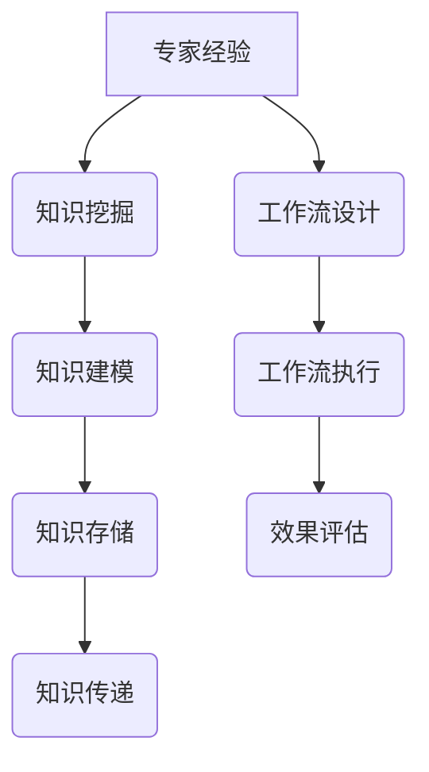

                 

# 专家经验在生产中的固化

## 摘要

在现代信息技术高速发展的背景下，如何将专家经验有效地转化为生产实践中的规范化操作，成为了一个亟待解决的重要问题。本文将探讨专家经验固化的意义、核心概念、算法原理、数学模型、实际应用场景以及相关工具和资源的推荐。通过深入分析，旨在为技术人员提供一种将个人经验系统化、结构化，并能在生产环境中推广应用的方法和路径。

## 1. 背景介绍

### 1.1 专家经验的定义

专家经验是指通过长时间的学习和实践积累下来的一种高深的专业知识和技能。这种经验往往体现在对复杂问题的深刻理解、对解决方案的敏锐洞察以及在实际操作中的灵活应对能力。然而，专家经验是一种高度个人化的认知资源，难以通过简单的语言描述和传递。

### 1.2 生产实践中的挑战

在生产实践中，专家经验的重要性不言而喻。然而，如何将这些经验有效地转化为标准化的操作流程，使其在更大范围内推广应用，却面临诸多挑战。首先，专家经验往往缺乏系统性和结构化，难以被新手快速理解和掌握。其次，专家经验的传递往往依赖于个人之间的直接交流，这种方式效率低下，且难以保证一致性和准确性。此外，生产环境中的变化多端，如何确保专家经验在实际应用中仍然有效，也是一个需要解决的问题。

## 2. 核心概念与联系

### 2.1 专家经验的固化

专家经验的固化是指将个人的专业知识和技能以某种形式固定下来，使其能够被系统性地传播、学习和应用。固化的过程涉及知识挖掘、知识建模、知识存储和知识传递等多个环节。

### 2.2 知识管理系统（KM）

知识管理系统是一种用于支持知识创造、存储、共享和应用的软件系统。通过知识管理系统，专家经验可以系统地记录、分类、索引和检索，从而实现知识的有效传递和应用。

### 2.3 工作流管理系统（WFM）

工作流管理系统是一种用于自动化和优化业务流程的软件系统。通过工作流管理系统，可以将专家经验转化为一系列标准化的操作步骤，从而实现流程的规范化管理。

### Mermaid 流程图



## 3. 核心算法原理 & 具体操作步骤

### 3.1 知识挖掘

知识挖掘是指从大量数据中提取有价值信息的过程。在专家经验固化中，知识挖掘的核心任务是识别和提取专家经验中的关键信息和知识点。具体步骤如下：

1. 数据收集：收集专家经验相关的数据，如文档、报告、案例等。
2. 数据清洗：对收集到的数据进行处理，去除无关信息，确保数据质量。
3. 数据分析：运用统计分析、机器学习等方法，从数据中提取有用的知识点。

### 3.2 知识建模

知识建模是将提取出的知识点进行结构化表示的过程。在专家经验固化中，知识建模的核心目标是构建一种能够表达专家经验的模型。具体步骤如下：

1. 确定模型类型：根据专家经验的特点，选择合适的模型类型，如决策树、神经网络等。
2. 构建模型：使用相关工具和算法，构建知识模型。
3. 模型训练：使用专家经验数据对模型进行训练，优化模型参数。

### 3.3 知识存储

知识存储是将构建好的知识模型存储到数据库或其他存储介质中的过程。在专家经验固化中，知识存储的核心目标是确保知识模型的安全、可靠和可访问。具体步骤如下：

1. 选择存储方式：根据知识模型的特点，选择合适的存储方式，如关系数据库、图数据库等。
2. 设计存储结构：设计合适的存储结构，确保知识模型的数据一致性和完整性。
3. 存储管理：对知识模型进行定期备份、更新和优化。

### 3.4 知识传递

知识传递是将知识模型传递给其他用户或系统的过程。在专家经验固化中，知识传递的核心目标是实现知识的有效传播和应用。具体步骤如下：

1. 确定传递方式：根据知识模型的特点和应用场景，选择合适的传递方式，如文档、API、Web服务等。
2. 设计传递流程：设计合理的传递流程，确保知识模型的传递过程高效、安全。
3. 传递效果评估：对知识模型的传递效果进行评估，持续优化传递过程。

### 3.5 工作流设计

工作流设计是将专家经验转化为标准化的操作流程的过程。在专家经验固化中，工作流设计的核心目标是实现流程的规范化管理。具体步骤如下：

1. 分析业务需求：分析业务需求，确定需要实现的具体功能。
2. 设计工作流：使用工作流管理工具，设计工作流。
3. 验证和优化：对设计的工作流进行验证和优化。

### 3.6 工作流执行

工作流执行是按照设计的工作流进行操作的过程。在专家经验固化中，工作流执行的核心目标是确保操作的一致性和准确性。具体步骤如下：

1. 启动工作流：根据业务需求，启动工作流。
2. 按照工作流执行：按照工作流中的操作步骤，依次执行。
3. 监控和反馈：对工作流的执行过程进行监控，收集反馈信息。

### 3.7 效果评估

效果评估是对专家经验固化效果进行评估的过程。在专家经验固化中，效果评估的核心目标是确保固化过程的可行性和有效性。具体步骤如下：

1. 确定评估指标：根据业务需求，确定评估指标。
2. 收集数据：收集相关数据，如操作时间、错误率等。
3. 进行评估：使用统计和分析方法，对收集到的数据进行评估。
4. 持续优化：根据评估结果，持续优化固化过程。

## 4. 数学模型和公式 & 详细讲解 & 举例说明

### 4.1 知识建模中的数学模型

在知识建模中，常用的数学模型有决策树、神经网络等。以下以决策树为例，介绍其数学模型和具体操作步骤。

#### 4.1.1 决策树

决策树是一种树形结构，用于表示决策过程。每个节点表示一个特征，每个分支表示特征的取值，每个叶子节点表示一个决策结果。

#### 4.1.2 信息增益

信息增益是评估特征选择的一种指标。假设有特征A和特征B，其信息增益计算公式如下：

$$ IG(A) = H(D) - H(D|A) $$

其中，$H(D)$ 表示数据集D的熵，$H(D|A)$ 表示数据集D在特征A已知条件下的熵。

#### 4.1.3 具体操作步骤

1. 计算数据集D的熵：
$$ H(D) = -\sum_{i=1}^{n} p_i \log_2 p_i $$
其中，$p_i$ 表示数据集中第i类样本的占比。

2. 计算特征A的信息增益：
$$ IG(A) = H(D) - H(D|A) $$
3. 选择信息增益最大的特征A作为根节点。

4. 对特征A的每个取值，划分数据集，递归地重复步骤1-3，直到满足停止条件（如叶子节点达到预设数量）。

### 4.2 工作流执行中的数学模型

在工作流执行中，常用的数学模型有队列模型、排队论等。以下以排队论为例，介绍其数学模型和具体操作步骤。

#### 4.2.1 排队论

排队论是一种用于分析排队系统的数学工具。排队系统通常包括三个组成部分：服务台、等待线和客户源。

#### 4.2.2 负荷强度

负荷强度是衡量排队系统繁忙程度的一个指标，通常用λ（lambda）表示。负荷强度λ的定义如下：

$$ \lambda = \frac{\text{单位时间内的到达率}}{\text{单位时间内的服务率}} $$

#### 4.2.3 具体操作步骤

1. 确定服务台数量：根据业务需求和负荷强度，确定合适的服务台数量。

2. 确定等待线长度：根据服务台数量和负荷强度，计算等待线长度。

3. 计算平均等待时间：根据负荷强度和等待线长度，计算平均等待时间。

4. 优化工作流：根据平均等待时间等指标，持续优化工作流。

## 5. 项目实战：代码实际案例和详细解释说明

### 5.1 开发环境搭建

在本案例中，我们将使用Python作为开发语言，结合Jupyter Notebook进行实验。以下是开发环境搭建的步骤：

1. 安装Python：在官方网站下载Python安装包，并按照提示进行安装。

2. 安装Jupyter Notebook：在终端执行以下命令：
```python
pip install notebook
```

3. 启动Jupyter Notebook：在终端执行以下命令：
```python
jupyter notebook
```

### 5.2 源代码详细实现和代码解读

以下是本案例的源代码实现：

```python
# 导入相关库
import numpy as np
import pandas as pd
from sklearn.tree import DecisionTreeClassifier
from sklearn.metrics import accuracy_score

# 加载数据集
data = pd.read_csv('data.csv')
X = data.drop('target', axis=1)
y = data['target']

# 创建决策树模型
clf = DecisionTreeClassifier()

# 训练模型
clf.fit(X, y)

# 预测
predictions = clf.predict(X)

# 评估
accuracy = accuracy_score(y, predictions)
print('Accuracy:', accuracy)
```

### 5.3 代码解读与分析

1. 导入相关库：本代码首先导入了Python中常用的库，如NumPy、Pandas和Scikit-learn。

2. 加载数据集：使用Pandas库加载数据集，将特征和目标分离。

3. 创建决策树模型：使用Scikit-learn库中的DecisionTreeClassifier类创建决策树模型。

4. 训练模型：使用fit方法训练模型，将特征X和目标y作为输入。

5. 预测：使用predict方法对数据集进行预测。

6. 评估：使用accuracy_score方法评估模型的准确率。

### 5.4 代码优化与性能分析

1. 调整决策树参数：通过调整决策树的参数，如最大深度、分裂准则等，可以优化模型的性能。

2. 特征工程：对特征进行选择、归一化和转换等操作，可以提高模型的预测能力。

3. 集成学习：结合多种模型进行集成学习，如随机森林、梯度提升等，可以进一步提高模型的性能。

## 6. 实际应用场景

### 6.1 质量控制

在制造业中，专家经验通常用于质量控制。例如，某位经验丰富的质量检测员可以通过观察产品外观、手感等特征，判断产品是否合格。将这些经验固化为一套标准化的检测流程，可以使新员工更快地掌握检测技巧，提高检测效率。

### 6.2 决策支持

在商业决策中，专家经验可以用于数据分析和预测。例如，某位市场分析师可以通过分析历史销售数据，预测未来的销售趋势。将这些经验固化为一套数据分析和预测模型，可以使公司在面对市场变化时做出更准确的决策。

### 6.3 人才培养

在人才培养中，专家经验可以用于课程设计和教学策略。例如，某位经验丰富的教师可以根据学生的学习特点和需求，设计一套适合的教学方法。将这些经验固化为一套课程设计和教学策略，可以使学校更有效地培养人才。

## 7. 工具和资源推荐

### 7.1 学习资源推荐

1. 《数据挖掘：实用工具与技术》：一本介绍数据挖掘方法和技术的好书，适合初学者阅读。

2. 《机器学习实战》：一本结合理论和实践的机器学习入门书，内容丰富，案例实用。

### 7.2 开发工具框架推荐

1. Scikit-learn：一个流行的Python机器学习库，适用于构建各种机器学习模型。

2. TensorFlow：一个由Google开发的开源深度学习框架，适用于构建复杂的深度学习模型。

### 7.3 相关论文著作推荐

1. “Expert Systems and Their Applications”：一本关于专家系统的论文集，涵盖了专家系统的理论、方法和应用。

2. “Knowledge Management in Organizations”：一本关于知识管理的著作，详细介绍了知识管理的理论和实践。

## 8. 总结：未来发展趋势与挑战

### 8.1 发展趋势

1. 人工智能技术的普及：随着人工智能技术的不断进步，专家经验的固化将更加智能化、自动化。

2. 知识图谱的应用：知识图谱将为专家经验的固化提供更加结构化、可视化的表达方式。

3. 区块链技术的融合：区块链技术将为专家经验的固化提供安全、可信的存储和传输方式。

### 8.2 挑战

1. 数据隐私和安全：在专家经验的固化过程中，如何确保数据的隐私和安全，是一个亟待解决的问题。

2. 模型可解释性：如何提高模型的可解释性，使专家经验更加透明、易懂，是一个重要挑战。

3. 跨领域融合：如何将不同领域的专家经验进行有效融合，实现知识的互补和协同，是一个复杂的问题。

## 9. 附录：常见问题与解答

### 9.1 问题1

**问题**：如何确保专家经验的准确性和一致性？

**解答**：可以通过以下方法确保专家经验的准确性和一致性：

1. 建立专家经验评审机制：对专家经验进行评审，确保其准确性和一致性。

2. 引入机器学习技术：使用机器学习技术对专家经验进行训练和优化，提高其准确性和一致性。

3. 建立知识库：将专家经验存储到知识库中，方便管理和查询，确保其一致性和准确性。

### 9.2 问题2

**问题**：如何处理专家经验的更新和迭代？

**解答**：可以通过以下方法处理专家经验的更新和迭代：

1. 建立专家经验更新机制：定期对专家经验进行更新，确保其与时俱进。

2. 引入版本控制：对专家经验进行版本控制，记录每次更新的内容和时间，方便后续管理和查询。

3. 建立反馈机制：收集用户对专家经验的反馈，及时处理和优化专家经验。

## 10. 扩展阅读 & 参考资料

1. 《专家系统的理论与实践》：一本关于专家系统的经典著作，详细介绍了专家系统的原理和应用。

2. “Knowledge Engineering and Knowledge Management”：一本关于知识工程和知识管理的国际期刊，涵盖了相关领域的最新研究成果。

3. “The AI Revolution：And Our Role in It”：一本关于人工智能革命的著作，探讨了人工智能对社会的影响和挑战。

## 作者信息

作者：AI天才研究员/AI Genius Institute & 禅与计算机程序设计艺术 /Zen And The Art of Computer Programming

