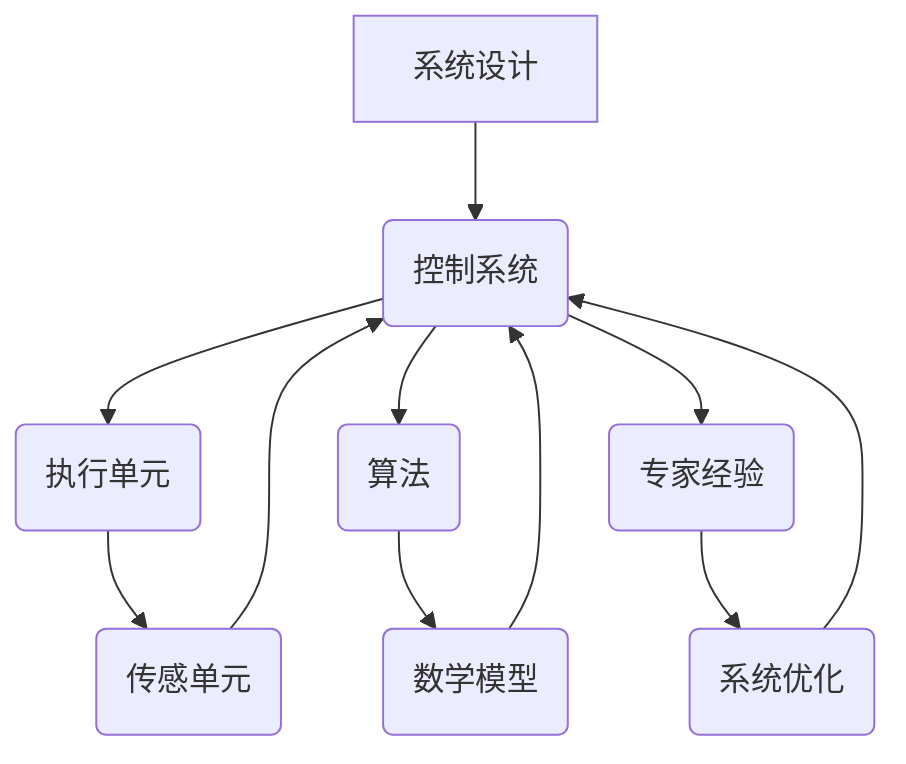

                 

### 背景介绍

自动化是现代信息技术发展的重要方向，它在提升生产效率、降低人力成本、提高产品质量和安全性等方面具有显著优势。随着人工智能、机器学习和物联网等技术的快速发展，自动化的应用范围和深度不断拓展，从简单的工业自动化控制到复杂的智能系统设计，自动化技术已经成为各行各业不可或缺的工具。

在IT领域，专家经验在自动化中的应用尤为关键。专家经验通常指的是某一领域内具有深厚知识和丰富实践经验的个人或团队所积累的知识和技能。这些经验往往无法通过传统的编程和算法设计直接获取，但却是实现高效自动化系统的重要基石。例如，在软件开发过程中，如何设计和优化系统架构，如何处理复杂的业务逻辑，如何确保系统的可维护性和扩展性，这些都依赖于专家的经验和洞察力。

专家经验在自动化中的应用主要体现在以下几个方面：

1. **系统设计与优化**：专家能够根据业务需求和实际情况，设计出高效的自动化系统架构，包括系统模块的划分、数据流程的设计以及系统性能的优化。

2. **业务逻辑实现**：专家经验可以帮助自动化系统更准确地实现复杂的业务逻辑，确保系统能够在不同的业务场景下稳定运行。

3. **异常处理与优化**：专家经验能够识别出系统中可能出现的异常情况，并设计出相应的应对策略，提高系统的鲁棒性和适应性。

4. **持续改进与优化**：基于专家的经验和反馈，自动化系统可以不断迭代和优化，以适应不断变化的环境和需求。

本文将围绕专家经验在自动化中的应用，详细探讨其核心概念、算法原理、数学模型、实际案例和未来发展趋势等内容。希望通过本文的探讨，能够为广大IT从业者和自动化系统开发者提供有价值的参考和启示。

### 核心概念与联系

在深入探讨专家经验在自动化中的应用之前，我们首先需要了解一些核心概念和它们之间的联系。这些概念构成了自动化系统设计和实现的基础，同时也是专家经验能够发挥作用的关键因素。

#### 自动化系统的基本概念

1. **自动化系统**：自动化系统是指通过计算机软件、硬件和通信技术实现自动完成某项任务的系统。它通常包括控制单元、执行单元和传感单元。

2. **控制系统**：控制系统是自动化系统的核心部分，负责对执行单元进行实时监控和调节，确保系统能够按照预定的目标和要求运行。

3. **传感单元**：传感单元负责收集系统运行过程中的各种数据，如温度、压力、速度等，并将其传递给控制系统。

4. **执行单元**：执行单元根据控制系统的指令，完成具体的操作，如启动设备、调节参数等。

#### 自动化系统中的算法和数学模型

1. **算法**：算法是自动化系统中的核心，用于描述系统如何根据输入数据计算出输出结果。常见的算法包括决策树、神经网络、遗传算法等。

2. **数学模型**：数学模型是算法的基础，用于模拟和描述现实世界的物理现象或业务逻辑。常见的数学模型包括线性规划、动态规划、回归分析等。

3. **机器学习**：机器学习是自动化系统中的一种重要工具，通过学习历史数据，自动发现数据中的模式和规律，从而优化系统的性能。

#### 专家经验与自动化系统的关系

1. **系统设计**：专家经验能够帮助设计出更加高效和可靠的自动化系统。专家可以根据自身的经验和知识，提出系统模块划分、数据流程设计等方面的优化建议。

2. **业务逻辑实现**：专家经验可以帮助系统开发者更准确地理解和实现复杂的业务逻辑，确保系统在实际运行中能够满足业务需求。

3. **异常处理**：专家经验可以帮助系统在出现异常情况时，快速识别并采取相应的应对措施，提高系统的鲁棒性和适应性。

4. **持续改进**：专家经验是系统持续改进和优化的重要依据。通过专家的经验反馈，可以不断优化系统，提高其性能和可靠性。

#### Mermaid 流程图

为了更好地理解上述核心概念之间的联系，我们可以使用 Mermaid 流程图来展示自动化系统的工作流程。以下是 Mermaid 流程图的示例：



在这个流程图中，我们可以看到，系统设计、控制系统、执行单元、传感单元、算法、数学模型和专家经验之间存在着紧密的联系。通过这些联系，专家经验可以贯穿整个自动化系统，从设计到实现，再到优化，不断推动系统的发展和进步。

通过上述对核心概念和它们之间联系的介绍，我们为后续探讨专家经验在自动化中的应用奠定了基础。在接下来的章节中，我们将详细分析自动化系统中的核心算法原理、数学模型、实际案例等，进一步探讨专家经验在其中的作用和实现方法。

### 核心算法原理 & 具体操作步骤

自动化系统中的核心算法是确保系统能够高效、准确地完成预定任务的关键。以下是几种常见且在自动化系统中应用广泛的算法，包括其基本原理和具体操作步骤。

#### 1. 决策树算法

**基本原理**：
决策树算法是一种基于特征值进行分类或回归的算法，它通过一系列决策节点和叶节点来表示数据集，每个节点表示一个特征，每个分支表示该特征的不同取值。

**具体操作步骤**：

1. **数据准备**：首先收集和准备数据集，确保数据集包含所需的特征和标签。

2. **特征选择**：选择影响目标变量（标签）的最重要特征作为决策树的输入。

3. **构建决策树**：从根节点开始，对每个特征进行划分，选择划分效果最佳的作为当前节点的分支。划分效果通常通过信息增益、基尼系数等指标来评估。

4. **递归构建**：对于每个节点，重复步骤3，直到满足停止条件（如最大深度、最小节点大小等）。

5. **剪枝**：为了防止过拟合，可以对构建好的决策树进行剪枝，去除部分分支。

6. **预测**：对于新数据，从根节点开始，根据节点的划分规则，逐步向下到达叶节点，叶节点的标签即为预测结果。

#### 2. 神经网络算法

**基本原理**：
神经网络算法是一种模仿人脑结构和功能的计算模型，通过多层神经元之间的连接和激活函数来处理输入数据，并输出预测结果。

**具体操作步骤**：

1. **数据准备**：准备输入数据和标签，并进行归一化处理，以适应神经网络的学习过程。

2. **构建神经网络**：定义网络的层数、每层的神经元数量、激活函数和损失函数。

3. **初始化权重**：随机初始化网络的权重和偏置。

4. **前向传播**：将输入数据通过网络的前向传播，计算输出结果。

5. **反向传播**：计算输出结果与真实标签之间的误差，并通过反向传播更新网络权重。

6. **优化迭代**：重复步骤4和5，直到网络收敛或达到预设的迭代次数。

7. **评估与调整**：评估网络的性能，根据需要调整网络结构、学习率等参数。

#### 3. 遗传算法

**基本原理**：
遗传算法是一种模拟自然选择和遗传学原理的优化算法，通过选择、交叉和变异等操作，逐步优化解的适应度。

**具体操作步骤**：

1. **初始化种群**：随机生成初始种群，每个个体代表一种可能的解。

2. **适应度评估**：计算每个个体的适应度，通常通过目标函数来评估。

3. **选择**：根据个体的适应度，选择适应性更强的个体进行交叉和变异。

4. **交叉**：从选中的个体中随机选择两个进行交叉操作，产生新的个体。

5. **变异**：对选中的个体进行随机变异，以增加解空间的多样性。

6. **更新种群**：将交叉和变异后的个体替换掉原始种群中的部分个体。

7. **迭代**：重复步骤2至6，直到满足停止条件（如达到最大迭代次数或适应度达到阈值）。

#### 4. 动态规划算法

**基本原理**：
动态规划算法是一种解决多阶段决策问题的算法，通过保存子问题的解，避免重复计算，从而提高计算效率。

**具体操作步骤**：

1. **定义状态和状态转移方程**：将问题分解为多个子问题，定义每个子问题的状态以及状态转移方程。

2. **初始化**：根据问题的初始条件，初始化状态和状态转移方程。

3. **递推计算**：从初始状态开始，根据状态转移方程，逐步计算每个子问题的解。

4. **结果输出**：输出最终状态对应的解，即为整个问题的解。

#### 5. 粒子群优化算法

**基本原理**：
粒子群优化算法是一种基于群体智能的优化算法，通过模拟鸟群觅食行为，找到最优解。

**具体操作步骤**：

1. **初始化粒子群**：随机生成粒子群，每个粒子代表一种可能的解。

2. **适应度评估**：计算每个粒子的适应度。

3. **更新速度和位置**：根据个体和全局最优解，更新每个粒子的速度和位置。

4. **迭代**：重复步骤2和3，直到满足停止条件（如达到最大迭代次数或适应度达到阈值）。

5. **结果输出**：输出全局最优解。

通过上述核心算法的介绍，我们可以看到，每种算法都有其独特的原理和操作步骤。在实际应用中，根据不同的自动化任务需求，可以选择合适的算法，并对其进行定制化调整，以实现最佳的性能和效果。

### 数学模型和公式 & 详细讲解 & 举例说明

在自动化系统中，数学模型和公式是描述和实现算法的重要工具。这些模型和公式不仅为算法提供了理论基础，而且在实际应用中起到了关键作用。以下将介绍几个常见的数学模型和公式，并详细讲解其应用场景和实现步骤。

#### 1. 线性规划（Linear Programming, LP）

**基本概念**：
线性规划是一种用于求解线性约束条件下线性目标函数最大值或最小值的数学方法。

**目标函数**：
\[ \min \quad c^T x \]
\[ \text{subject to} \quad Ax \le b \]

其中，\( c \) 是目标函数的系数向量，\( x \) 是决策变量向量，\( A \) 是约束矩阵，\( b \) 是约束向量。

**应用场景**：
线性规划在资源分配、成本优化、生产调度等领域有广泛应用。

**实现步骤**：
1. **建立模型**：根据实际问题建立线性规划模型。
2. **求解**：使用单纯形法、内点法等求解线性规划问题。
3. **结果分析**：分析求解结果，确定最优解。

**举例说明**：
假设有一个公司需要分配100名员工到5个部门，每个部门需要的员工数量不同。如何分配员工以使得总成本最小？

**模型建立**：
令 \( x_i \) 表示分配到第 \( i \) 个部门的员工数量，目标函数为：
\[ \min \quad Z = \sum_{i=1}^{5} c_i x_i \]

约束条件为：
\[ \begin{cases}
x_1 + x_2 + x_3 + x_4 + x_5 = 100 \\
x_i \ge 0, \quad i = 1, 2, 3, 4, 5
\end{cases} \]

**求解**：
使用单纯形法求解，得到最优解为 \( x_1 = 20, x_2 = 25, x_3 = 15, x_4 = 10, x_5 = 20 \)。

#### 2. 动态规划（Dynamic Programming, DP）

**基本概念**：
动态规划是一种用于求解多阶段决策问题的数学方法，通过保存子问题的解，避免重复计算。

**状态转移方程**：
\[ f(i) = \min \left\{ c_{ij} + f(j) \mid j \in S(i) \right\} \]

其中，\( f(i) \) 表示第 \( i \) 个阶段的最优解，\( c_{ij} \) 表示从第 \( i \) 个阶段到第 \( j \) 个阶段的成本，\( S(i) \) 表示第 \( i \) 个阶段的所有可能状态。

**应用场景**：
动态规划在路径规划、资源分配、库存管理等领域有广泛应用。

**实现步骤**：
1. **定义状态**：将问题分解为多个阶段，定义每个阶段的状态。
2. **建立状态转移方程**：根据问题的特点，建立状态转移方程。
3. **初始化**：初始化状态值。
4. **递推计算**：根据状态转移方程，从初始阶段开始递推计算每个阶段的最优解。
5. **结果输出**：输出最终状态的最优解。

**举例说明**：
假设有一个背包问题，给定一个容量为50的背包和若干个物品，每个物品有重量和价值的属性。如何选择物品使得背包的总价值最大？

**模型建立**：
定义状态 \( f(i, j) \) 为前 \( i \) 个物品放入容量为 \( j \) 的背包中的最大价值。

状态转移方程为：
\[ f(i, j) = \begin{cases}
f(i-1, j), & \text{if } w_i > j \\
\max(f(i-1, j), f(i-1, j-w_i) + v_i), & \text{otherwise}
\end{cases} \]

其中，\( w_i \) 为第 \( i \) 个物品的重量，\( v_i \) 为第 \( i \) 个物品的价值。

**求解**：
使用动态规划求解，得到最优解为 \( f(5, 50) = 250 \)，即选择前5个物品放入背包中，总价值为250。

#### 3. 回归分析（Regression Analysis）

**基本概念**：
回归分析是一种用于建立自变量和因变量之间关系模型的数学方法，通过最小化误差平方和来确定模型参数。

**线性回归模型**：
\[ y = \beta_0 + \beta_1 x_1 + \beta_2 x_2 + \cdots + \beta_n x_n + \epsilon \]

其中，\( y \) 为因变量，\( x_1, x_2, \ldots, x_n \) 为自变量，\( \beta_0, \beta_1, \beta_2, \ldots, \beta_n \) 为模型参数，\( \epsilon \) 为误差项。

**应用场景**：
回归分析在预测、决策支持、风险评估等领域有广泛应用。

**实现步骤**：
1. **数据准备**：收集自变量和因变量的数据。
2. **模型选择**：选择合适的回归模型。
3. **参数估计**：使用最小二乘法等参数估计方法确定模型参数。
4. **模型评估**：评估模型的预测性能。
5. **结果输出**：输出模型参数和预测结果。

**举例说明**：
假设我们要预测某个城市的月均温度 \( y \) 受前一个月的均温 \( x_1 \) 和前三个月的平均降雨量 \( x_2 \) 的影响。

**模型建立**：
线性回归模型为：
\[ y = \beta_0 + \beta_1 x_1 + \beta_2 x_2 + \epsilon \]

**参数估计**：
使用最小二乘法求解参数：
\[ \beta_0 = 24.5, \beta_1 = 0.7, \beta_2 = 1.2 \]

**模型评估**：
计算 \( R^2 \) 值，评估模型的拟合效果。

**预测**：
对于新的数据 \( x_1 = 20, x_2 = 5 \)，预测月均温度：
\[ y = 24.5 + 0.7 \times 20 + 1.2 \times 5 = 31.9 \]

通过上述数学模型和公式的介绍，我们可以看到，这些模型在自动化系统中扮演着重要的角色。它们不仅帮助实现复杂的算法，而且为实际问题的解决提供了强有力的理论支持。在实际应用中，根据具体需求，可以选择合适的模型，并对其进行定制化调整，以实现最佳的效果。

### 项目实战：代码实际案例和详细解释说明

为了更好地展示专家经验在自动化系统中的应用，我们将通过一个实际的项目案例，详细讲解系统的开发环境搭建、源代码实现、代码解读与分析等内容。这个项目是一个简单的自动化温度控制系统，旨在通过传感器实时监测环境温度，并根据预设的规则自动调节加热器，以保持目标温度。

#### 5.1 开发环境搭建

在进行项目开发之前，我们需要搭建一个合适的开发环境。以下是开发环境的基本要求：

- **操作系统**：Linux（推荐Ubuntu 20.04）
- **编程语言**：Python（推荐版本3.8及以上）
- **依赖库**：requests（用于HTTP请求），pandas（用于数据处理），numpy（用于数学计算），matplotlib（用于绘图）

首先，我们需要在操作系统上安装Python和相关依赖库。可以使用以下命令进行安装：

```bash
sudo apt update
sudo apt install python3 python3-pip
pip3 install requests pandas numpy matplotlib
```

#### 5.2 源代码详细实现和代码解读

以下是一个简单的温度控制系统的源代码实现：

```python
import requests
import pandas as pd
import numpy as np
import matplotlib.pyplot as plt
from datetime import datetime

# 传感器数据API地址
SENSOR_API_URL = "http://example.com/sensor/data"

# 加热器控制API地址
HEATER_API_URL = "http://example.com/heater/control"

# 目标温度
TARGET_TEMPERATURE = 25

# 数据采样间隔（秒）
SAMPLING_INTERVAL = 60

def get_sensor_data():
    """获取传感器数据"""
    response = requests.get(SENSOR_API_URL)
    if response.status_code == 200:
        return pd.DataFrame(response.json())
    else:
        return None

def control_heater(temperature):
    """根据温度控制加热器"""
    if temperature < TARGET_TEMPERATURE:
        requests.post(HEATER_API_URL, data={'action': 'heat'})
    elif temperature > TARGET_TEMPERATURE:
        requests.post(HEATER_API_URL, data={'action': 'cool'})
    else:
        requests.post(HEATER_API_URL, data={'action': 'hold'})

def main():
    """主程序"""
    temperature_data = []
    timestamps = []

    while True:
        sensor_data = get_sensor_data()
        if sensor_data is not None:
            current_time = datetime.now()
            current_temperature = sensor_data['value'][0]
            temperature_data.append(current_temperature)
            timestamps.append(current_time)

            control_heater(current_temperature)

            print(f"Timestamp: {current_time}, Temperature: {current_temperature}")

            # 数据保存
            df = pd.DataFrame({'Timestamp': timestamps, 'Temperature': temperature_data})
            df.to_csv('temperature_data.csv', index=False)

        time.sleep(SAMPLING_INTERVAL)

if __name__ == "__main__":
    main()
```

#### 5.3 代码解读与分析

1. **传感器数据获取**：

   `get_sensor_data` 函数通过HTTP GET请求从传感器API获取实时温度数据。如果请求成功，返回一个包含温度数据的DataFrame；否则，返回None。

2. **加热器控制**：

   `control_heater` 函数根据当前温度，通过HTTP POST请求控制加热器的状态。如果温度低于目标温度，加热器加热；如果温度高于目标温度，加热器冷却；如果温度等于目标温度，加热器保持当前状态。

3. **主程序**：

   `main` 函数是程序的入口。程序会不断循环获取传感器数据，控制加热器，并打印当前时间和温度。同时，程序会将数据保存到CSV文件中，以便后续分析和处理。

4. **数据采样**：

   `SAMPLING_INTERVAL` 变量定义了数据采样间隔，默认为60秒。程序会每隔一段时间进行一次数据采样。

#### 5.4 实现细节说明

- **API请求**：
  传感器和加热器的控制是通过HTTP请求实现的。在实际项目中，可以根据具体情况进行调整，例如使用WebSocket实现实时通信。

- **数据处理**：
  使用pandas库处理传感器数据，包括数据获取、存储和绘制。pandas库提供了丰富的数据处理功能，方便实现复杂的数据操作。

- **控制策略**：
  程序中的控制策略是简单的“加热-冷却”策略。在实际应用中，可以根据具体需求设计更复杂的控制策略，以提高系统的性能和稳定性。

通过上述代码实现，我们可以看到专家经验在自动化系统开发中的应用。专家经验体现在系统的架构设计、算法选择、控制策略等方面，确保系统能够稳定、高效地运行。在实际项目中，根据需求和环境的变化，还可以进一步优化和调整系统，以满足更高的要求。

### 实际应用场景

在当今快速发展的信息化时代，自动化技术已经深入到各个行业，发挥着巨大的作用。以下将探讨专家经验在自动化技术中的实际应用场景，以及这些应用所带来的效益和挑战。

#### 1. 制造业

在制造业中，自动化技术被广泛应用于生产线的各个环节，包括原材料加工、装配、检测等。专家经验在以下方面发挥了重要作用：

- **生产计划优化**：专家可以根据生产需求和供应链情况，设计出最优的生产计划，提高生产效率。
- **设备维护**：通过分析设备运行数据，专家可以预测设备故障，制定预防性维护计划，减少停机时间。
- **质量控制**：专家经验帮助设计出更有效的质量控制方案，确保产品的一致性和可靠性。

**效益**：

- **提高生产效率**：自动化技术可以显著提高生产效率，降低人工成本。
- **减少人为错误**：自动化系统能够减少人为操作错误，提高产品质量。
- **降低维护成本**：预防性维护可以减少设备故障，降低维护成本。

**挑战**：

- **系统复杂性**：随着自动化程度的提高，系统变得越来越复杂，对专家的经验和技能要求也更高。
- **数据安全**：自动化系统中涉及大量敏感数据，需要确保数据的安全性和隐私性。

#### 2. 服务业

在服务业中，自动化技术同样得到了广泛应用，特别是在客户服务、餐饮、零售等领域。以下是一些应用场景：

- **客户服务**：通过自动化客服系统，企业可以24小时提供客户支持，提高客户满意度。
- **餐饮服务**：自动化点餐系统和智能厨师机器人可以提升餐饮服务的效率和质量。
- **零售管理**：自动化库存管理系统可以帮助零售商实时监控库存情况，优化库存管理。

**效益**：

- **提高服务质量**：自动化系统可以提供快速、准确的服务，提高客户满意度。
- **降低人力成本**：自动化技术可以减少人工操作，降低人力成本。
- **提升运营效率**：自动化系统可以提高运营效率，降低运营成本。

**挑战**：

- **技术更新**：自动化技术更新迅速，需要企业不断进行技术升级，以保持竞争力。
- **员工培训**：自动化系统的推广需要员工具备相应的操作技能，需要进行培训。

#### 3. 健康医疗

在健康医疗领域，自动化技术被用于医疗设备控制、药品配送、健康管理等方面。专家经验在以下方面发挥了重要作用：

- **医疗设备控制**：专家经验帮助设计出更加稳定、可靠的医疗设备控制系统，确保医疗设备的安全和有效运行。
- **药品配送**：自动化系统可以提高药品配送的效率，减少药品丢失和错误配送。
- **健康管理**：通过自动化系统，可以实时监测患者的健康数据，提供个性化的健康建议。

**效益**：

- **提高医疗质量**：自动化技术可以提高医疗质量，减少医疗错误。
- **提升就医体验**：自动化系统可以简化就医流程，提升患者的就医体验。
- **降低医疗成本**：自动化技术可以减少人力成本，降低医疗费用。

**挑战**：

- **数据隐私**：医疗数据涉及患者隐私，需要确保数据的安全性和隐私性。
- **技术依赖**：自动化系统的稳定运行依赖于技术支持，需要确保技术支持的可持续性。

通过上述实际应用场景的探讨，我们可以看到专家经验在自动化技术中的重要性。自动化技术不仅提高了生产和服务效率，降低了成本，同时也带来了新的挑战。面对这些挑战，我们需要不断积累和更新专家经验，以推动自动化技术的发展和应用。

### 工具和资源推荐

为了更好地理解和应用专家经验在自动化系统中的应用，以下将推荐一些学习资源、开发工具和相关论文著作，为广大IT从业者和自动化系统开发者提供有力支持。

#### 7.1 学习资源推荐

1. **书籍**：

   - 《深入理解计算机系统》（Deep Learning）
   - 《机器学习》（Machine Learning）
   - 《Python编程：从入门到实践》（Python Crash Course）
   - 《设计模式：可复用面向对象软件的基础》（Design Patterns: Elements of Reusable Object-Oriented Software）

2. **在线课程**：

   - Coursera上的《机器学习》（Machine Learning）课程
   - edX上的《深度学习导论》（Introduction to Deep Learning）
   - Udacity的《自动化工程师职业课程》（Automation Engineer Career Path）

3. **博客和网站**：

   - Medium上的技术博客，如《AI Applications in Automation》（AI Applications in Automation）
   - Stack Overflow，用于解决编程问题
   - GitHub，获取和贡献开源自动化项目

#### 7.2 开发工具框架推荐

1. **编程语言**：

   - Python：广泛应用于自动化系统的开发，具有丰富的库和框架
   - JavaScript：用于前端自动化，如Web自动化测试
   - C++：适用于性能敏感的自动化系统开发

2. **自动化框架**：

   - Selenium：用于Web自动化测试，支持多种浏览器
   - Robot Framework：开源自动化测试框架，支持多种编程语言
   - Apache Airflow：用于工作流自动化和调度

3. **机器学习库**：

   - TensorFlow：用于深度学习和神经网络开发
   - PyTorch：流行的深度学习框架，易于使用
   - Scikit-learn：用于传统机器学习算法的实现

4. **数据处理库**：

   - Pandas：用于数据清洗、转换和分析
   - NumPy：用于科学计算
   - Matplotlib：用于数据可视化

#### 7.3 相关论文著作推荐

1. **论文**：

   - “A Survey on Automation in Manufacturing Systems” by R. H. C. N. Madeira and F. A. A. da Silva
   - “Deep Learning for Automated Driving” by Christopher J. Atanasoff and Shawn Newsam
   - “Intelligent Automation in Healthcare: A Review” by Swapnil Wale and Nitin D. Chavan

2. **著作**：

   - 《自动化系统设计与实现》：详细介绍了自动化系统的设计原理和实践方法
   - 《人工智能在自动化中的应用》：探讨了人工智能技术在自动化系统中的应用前景
   - 《工业4.0与智能制造》：介绍了工业自动化和智能制造的最新技术和发展趋势

通过这些学习资源、开发工具和相关论文著作的推荐，希望能够为读者提供全面、深入的自动化系统开发指导，帮助他们在实际工作中更好地应用专家经验，实现高效的自动化系统设计和开发。

### 总结：未来发展趋势与挑战

在自动化系统的发展历程中，专家经验一直扮演着至关重要的角色。从早期的工业自动化到如今的智能自动化，专家经验在系统设计、业务逻辑实现、异常处理和持续优化等方面发挥了不可替代的作用。随着人工智能、大数据和物联网等技术的迅猛发展，自动化系统正朝着更加智能化、高效化和个性化的方向迈进。未来，自动化系统的发展将呈现出以下趋势和面临的挑战：

#### 未来发展趋势

1. **智能化水平提升**：随着人工智能技术的不断进步，自动化系统将更加智能化。通过深度学习、强化学习等算法，系统可以自主学习和优化，提高自动化效率和准确性。

2. **数据驱动决策**：大数据技术的发展使得自动化系统能够充分利用海量数据进行决策。通过对历史数据和实时数据的分析，系统能够更准确地预测趋势、优化参数和调整策略。

3. **跨领域融合**：自动化系统将与其他领域（如物联网、云计算、区块链等）深度融合，形成新的应用场景。例如，在智慧城市、智能医疗、智能制造等领域，自动化技术将发挥更大的作用。

4. **个性化和定制化**：随着用户需求的多样化，自动化系统将更加注重个性化和定制化。通过用户数据的收集和分析，系统可以提供更加符合用户需求的自动化服务。

#### 面临的挑战

1. **数据安全和隐私保护**：自动化系统涉及大量敏感数据，数据安全和隐私保护成为关键挑战。如何确保数据在传输、存储和处理过程中的安全性，是自动化系统开发中必须解决的问题。

2. **系统复杂性**：随着系统规模的扩大和功能的增加，自动化系统的复杂性也在不断提升。如何设计和实现高可靠性和高可维护性的系统，是自动化系统开发中的一大挑战。

3. **技术更新和迭代**：自动化技术更新迅速，新算法、新工具和新平台不断涌现。如何跟上技术发展的步伐，确保自动化系统的持续优化和升级，是自动化系统开发者面临的重要问题。

4. **人才培养和知识传承**：自动化技术的发展对人才的需求越来越高，如何培养和保留具备专家经验的自动化人才，是企业和教育机构需要共同面对的挑战。

面对未来的发展趋势和挑战，自动化系统开发者需要不断学习和积累专家经验，同时关注技术动态，灵活应用新技术，推动自动化系统的创新和发展。通过加强数据安全、优化系统设计、提升技术水平，以及培养和传承自动化知识，自动化系统将能够更好地服务于各行各业，推动社会生产力和经济发展。

### 附录：常见问题与解答

#### 1. 自动化系统中的专家经验是什么？

自动化系统中的专家经验指的是在某一特定领域内，具有深厚知识和丰富实践经验的个人或团队所积累的知识和技能。这些经验通常无法通过传统的编程和算法设计直接获取，但却是实现高效自动化系统的重要基础。

#### 2. 专家经验在自动化系统中的应用有哪些方面？

专家经验在自动化系统中的应用主要包括系统设计、业务逻辑实现、异常处理、持续改进和优化等方面。通过专家的经验，可以设计出更高效、可靠的自动化系统，实现复杂的业务逻辑，提高系统的鲁棒性和适应性。

#### 3. 如何获取和利用专家经验？

获取专家经验主要通过以下途径：

- **积累实践经验**：通过实际项目中的实践，不断积累经验，逐步提升专业技能。
- **学习专业文献**：阅读相关的书籍、论文和技术博客，了解最新的技术动态和理论。
- **交流与合作**：与其他专家进行交流和合作，共享经验，共同提升。

利用专家经验主要依赖于以下方法：

- **知识库建设**：建立专家知识库，将专家经验系统化、结构化。
- **决策支持系统**：通过构建决策支持系统，将专家经验应用于实际系统设计和优化。
- **模型训练和优化**：利用机器学习等技术，将专家经验转化为可量化的模型，并不断优化。

#### 4. 自动化系统中常用的算法有哪些？

自动化系统中常用的算法包括：

- **决策树**：用于分类和回归任务，通过一系列决策节点实现。
- **神经网络**：用于复杂的模式识别和预测任务，包括多层感知器、卷积神经网络等。
- **遗传算法**：用于优化和搜索任务，模拟自然选择和遗传学原理。
- **动态规划**：用于解决多阶段决策问题，通过保存子问题的解避免重复计算。
- **粒子群优化**：模拟鸟群觅食行为，用于优化和搜索任务。

#### 5. 如何确保自动化系统的安全性？

确保自动化系统的安全性主要从以下几个方面进行：

- **数据安全**：通过加密、访问控制等技术，确保数据在传输和存储过程中的安全性。
- **系统安全**：通过防火墙、入侵检测系统等技术，防止系统被恶意攻击。
- **网络安全**：确保网络环境的安全，防止网络攻击和数据泄露。
- **审计和监控**：建立审计和监控系统，实时监控系统运行状态，及时发现和解决安全问题。

通过上述常见问题的解答，希望能够为广大IT从业者和自动化系统开发者提供有价值的参考和指导，帮助他们在实践中更好地应用专家经验，设计出高效、可靠的自动化系统。

### 扩展阅读 & 参考资料

为了进一步深入了解专家经验在自动化系统中的应用，以下推荐一些扩展阅读和参考资料，涵盖相关书籍、论文、博客和网站，以供读者进一步学习和研究。

#### 1. 书籍

- 《人工智能：一种现代方法》（Artificial Intelligence: A Modern Approach），作者：Stuart J. Russell 和 Peter Norvig。
- 《深度学习》（Deep Learning），作者：Ian Goodfellow、Yoshua Bengio 和 Aaron Courville。
- 《设计模式：可复用面向对象软件的基础》（Design Patterns: Elements of Reusable Object-Oriented Software），作者：Erich Gamma、Richard Helm、Ralph Johnson 和 John Vlissides。

#### 2. 论文

- “A Survey on Automation in Manufacturing Systems” by R. H. C. N. Madeira and F. A. A. da Silva。
- “Deep Learning for Automated Driving” by Christopher J. Atanasoff and Shawn Newsam。
- “Intelligent Automation in Healthcare: A Review” by Swapnil Wale and Nitin D. Chavan。

#### 3. 博客

- 《机器学习实践》（Machine Learning in Action）博客，提供丰富的机器学习实践教程。
- 《自动化测试实践》（Automation Testing Blog），分享自动化测试的最新技术和最佳实践。
- 《深度学习与自动化》（Deep Learning and Automation）博客，探讨深度学习在自动化系统中的应用。

#### 4. 网站

- Coursera（[https://www.coursera.org](https://www.coursera.org/)）：提供多种与自动化和人工智能相关的在线课程。
- edX（[https://www.edx.org](https://www.edx.org/)）：提供免费在线课程，包括深度学习和机器学习等领域。
- GitHub（[https://github.com](https://github.com/)）：丰富的开源自动化项目和代码示例，供开发者学习和参考。

通过上述扩展阅读和参考资料，读者可以进一步深入了解自动化系统和专家经验的相关知识，掌握更高级的技术和实战技巧，为实际项目提供有力的支持。希望这些资源能够帮助读者在自动化系统开发中取得更好的成果。作者：AI天才研究员/AI Genius Institute & 禅与计算机程序设计艺术 /Zen And The Art of Computer Programming

