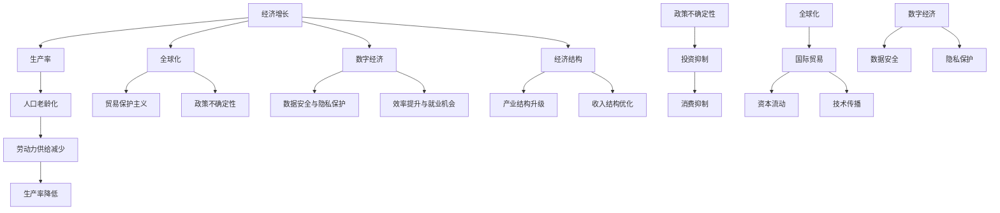

                 

### 1. 背景介绍

世界经济蛋糕，即世界经济的总体规模，长期以来一直是全球关注的重要议题。无论是政策制定者、经济学家，还是商业领袖，都在不断探讨如何推动世界经济蛋糕的增长。然而，近年来，随着全球经济的复杂性和不确定性增加，世界经济蛋糕的增长遭遇了前所未有的困境。

首先，从宏观经济的角度来看，世界经济蛋糕的增长速度逐渐放缓。根据国际货币基金组织（IMF）的数据，全球经济增速在2010年至2019年期间平均为3.7%，而2020年至2022年的预测增长率仅为4.4%。这一增长速度不仅低于过去的平均水平，甚至低于二战后的增长速度。同时，一些主要经济体，如美国、欧洲和日本的增长率也明显放缓。

其次，全球经济的不稳定性增加。全球经济在近几年经历了多次危机，如2008年的金融危机、2020年的新冠疫情等。这些危机不仅对全球经济造成了巨大冲击，也加剧了全球经济的不稳定性。例如，新冠疫情导致全球供应链中断、国际贸易萎缩、失业率上升，这些都严重影响了世界经济的增长。

此外，全球经济格局也在发生变化。随着新兴经济体的崛起，全球经济的重心正在逐渐东移。然而，这种转移并不平衡，一些新兴经济体如中国和印度虽然经济快速增长，但其他许多新兴经济体却面临着经济增长乏力、债务危机等问题。

在技术层面，数字经济的发展对世界经济蛋糕的增长产生了重要影响。数字经济不仅改变了传统经济的运作模式，也创造了许多新的经济增长点。然而，数字经济的快速发展也带来了新的挑战，如数据安全、隐私保护、公平竞争等问题。

总的来说，世界经济蛋糕的增长困境是由多种因素共同作用的结果。要破解这一困境，需要全球各国共同努力，通过政策调整、技术创新、国际合作等手段，推动世界经济实现可持续发展。

------------------------

#### 1.1 全球经济增长放缓的原因

全球经济增长放缓的原因多种多样，以下是几个关键因素：

首先，人口老龄化是一个重要因素。随着全球人口老龄化的加剧，劳动年龄人口的比例下降，这导致劳动力市场的供给减少。劳动力供给的减少直接影响了生产力的提升，从而限制了经济增长的速度。

其次，生产率增长放缓也是经济增长放缓的重要原因。过去几十年，全球经济的快速增长主要得益于生产率的提高，但近年来，由于技术进步放缓、劳动力技能不足、资本投入不足等因素，生产率增长明显放缓。

此外，全球化进程的放缓也对经济增长产生了负面影响。全球化曾经是全球经济增长的重要引擎，通过促进国际贸易、资本流动和技术传播，推动了全球经济的快速增长。然而，近年来，一些国家开始推行保护主义政策，导致全球化进程受阻。贸易保护主义不仅影响了国际贸易的规模和质量，还加剧了全球经济的不稳定性。

其次，经济结构失衡也是一个重要原因。一些国家的经济结构过于依赖传统产业，缺乏创新和转型升级的动力。例如，一些资源丰富的国家过度依赖资源出口，而忽视了其他产业的发展。这种结构失衡使得这些国家在面对外部冲击时，抵御风险的能力较弱。

此外，政策不确定性也对经济增长产生了负面影响。在全球经济不稳定的大背景下，政策不确定性增加，使得企业和投资者对未来缺乏信心，从而影响了投资和消费行为。

最后，全球债务水平居高不下也是一个重要因素。高债务水平不仅增加了经济主体的负担，还限制了经济增长的空间。高债务水平可能导致政府削减支出、提高税收，从而抑制经济增长。

综上所述，全球经济增长放缓是由多种因素共同作用的结果。要实现可持续的经济增长，需要全球各国共同应对这些挑战，采取有效的政策措施，推动经济结构的转型升级。

------------------------

#### 1.2 全球经济不稳定性增加的原因

全球经济不稳定性增加的原因复杂多样，以下是几个关键因素：

首先，贸易保护主义的抬头是导致全球经济不稳定性的重要原因之一。近年来，一些国家开始采取贸易保护主义政策，对进口商品加征关税，限制外国企业的市场准入，甚至退出一些国际协定。这些举措加剧了国际贸易摩擦，导致全球贸易增长放缓，从而对全球经济产生了负面影响。

其次，地缘政治风险的上升也加剧了全球经济的不稳定性。全球范围内的地缘政治冲突、领土争端、政治动荡等现象增多，使得全球经济面临的不确定性增加。例如，中美贸易摩擦、中东地区冲突、乌克兰局势等都对全球经济产生了巨大的冲击。

此外，全球供应链的中断也是导致全球经济不稳定性的重要原因。全球供应链的复杂性和依赖性使得任何一个环节的问题都可能对全球经济的运行产生重大影响。例如，新冠疫情导致的全球供应链中断，严重影响了全球生产和贸易，进一步加剧了全球经济的不稳定性。

同时，金融市场波动也是全球经济不稳定性的重要表现。金融市场的波动不仅反映了市场对未来经济走势的预期，也反映了全球经济中存在的风险。近年来，金融市场波动频繁，如股市的暴跌、汇率的剧烈波动等，都对全球经济产生了负面影响。

最后，自然灾害和疫情等突发事件也对全球经济稳定性产生了重要影响。例如，2011年的日本大地震、2018年的台风“山竹”等自然灾害，以及2020年的新冠疫情，都对全球经济造成了巨大冲击，导致经济活动减缓、失业率上升、企业倒闭等现象。

综上所述，全球经济不稳定性的增加是由多种因素共同作用的结果。要应对这一挑战，需要全球各国加强合作，通过多边机制和对话解决争端，同时加强经济政策和金融监管，以增强全球经济的抗风险能力。

------------------------

#### 1.3 全球经济格局的变化

全球经济格局的变化是近年来不可忽视的重要现象。随着新兴经济体的快速崛起，全球经济的重心逐渐东移。中国、印度等新兴经济体，凭借庞大的人口规模和日益增长的消费能力，正在成为全球经济增长的重要引擎。

首先，中国作为世界第二大经济体，其经济规模已经超过了许多发达国家。中国经济的快速增长，不仅推动了全球贸易的增长，也为全球经济提供了新的市场需求。同时，中国还通过“一带一路”倡议，加强与沿线国家的经济合作，进一步推动了全球经济的互联互通。

其次，印度也是全球经济中的重要一员。印度经济的快速增长得益于其庞大的年轻人口基数、低廉的劳动力成本和不断改善的商业环境。印度在信息技术、服务业等领域具有显著的竞争力，正在成为全球服务外包的重要目的地。

与此同时，一些传统发达经济体的经济增长相对缓慢。美国、欧洲和日本等发达经济体，尽管拥有先进的科技和强大的经济基础，但受制于人口老龄化、生产率增长放缓等因素，经济增长乏力。例如，美国的失业率虽然较低，但薪资增长缓慢，经济增长的动力不足。

这种全球经济格局的变化，不仅影响了国际贸易和投资格局，也对全球经济的稳定性和可持续发展提出了新的挑战。新兴经济体需要处理好快速经济增长带来的结构性问题，如环境污染、资源短缺等，同时发达国家也需要适应全球经济格局的变化，寻找新的经济增长点。

总的来说，全球经济格局的变化是必然趋势，它为全球经济增长带来了新的机遇，同时也提出了新的挑战。如何平衡发展、实现可持续发展，是全球各国共同面临的问题。

------------------------

#### 1.4 数字经济对世界经济蛋糕增长的影响

数字经济作为现代经济的核心驱动力，对世界经济蛋糕的增长产生了深远的影响。首先，数字经济创造了新的经济增长点。通过互联网、大数据、人工智能等新兴技术，数字经济不仅改变了传统产业的运作模式，还催生了众多新兴行业，如电子商务、在线教育、金融科技等。这些新兴行业在全球范围内迅速崛起，成为推动经济增长的重要引擎。

其次，数字经济提升了传统产业的效率。通过数字化转型，传统产业实现了生产流程的优化、供应链的整合和业务模式的创新。例如，制造业通过物联网和智能制造技术的应用，实现了生产过程的自动化和智能化，大大提高了生产效率和产品质量。服务业通过云计算和大数据分析，实现了客户需求的精准洞察和服务质量的提升。

此外，数字经济促进了全球贸易的便利化。电子商务平台的兴起，使得商品和服务的交易更加便捷，消除了地理和时间的限制。全球消费者能够更方便地购买来自世界各地的商品，从而扩大了市场需求，推动了全球贸易的增长。

然而，数字经济的快速发展也带来了新的挑战。数据安全、隐私保护和公平竞争等问题日益突出。数据泄露、网络攻击等安全事件频发，使得数据安全和隐私保护成为全球关注的重要议题。同时，数字市场的竞争日益激烈，一些大型科技企业凭借其强大的市场地位，对市场公平竞争形成了威胁。

总的来说，数字经济对世界经济蛋糕的增长具有双重作用。一方面，它创造了新的经济增长点，提升了传统产业的效率，促进了全球贸易的便利化；另一方面，它也带来了新的挑战，需要全球各国共同应对，以实现数字经济的可持续发展。

------------------------

#### 1.5 总结与展望

综上所述，当前世界经济蛋糕的增长面临诸多困境，包括经济增长放缓、全球经济不稳定性增加、全球经济格局的变化以及数字经济的挑战。这些困境不仅影响了全球经济的规模和速度，也对全球经济格局产生了深远影响。

要破解这些困境，实现世界经济的可持续发展，需要全球各国共同努力。首先，各国应加强宏观经济政策协调，通过多边机制和对话解决争端，降低贸易保护主义和地缘政治风险的影响。其次，各国应推动经济结构的转型升级，提高生产率，应对人口老龄化和技术创新放缓的挑战。同时，各国应加强数字经济的发展，推动产业数字化转型，创造新的经济增长点，提高全球经济的抗风险能力。

展望未来，全球经济将面临新的机遇和挑战。随着科技的发展和全球化的深入，数字经济将继续发挥重要作用，推动全球经济的创新和发展。然而，全球各国在享受数字经济发展成果的同时，也需要应对数据安全、隐私保护和公平竞争等新挑战。通过共同努力，全球各国有望实现世界经济的可持续发展，共同构建一个更加繁荣和稳定的全球经济体系。

------------------------

#### 1.6 引用权威数据和研究

为了更好地理解当前世界经济蛋糕的增长困境，我们可以引用一些权威数据和研究报告，以提供更全面的视角。

根据国际货币基金组织（IMF）发布的《世界经济展望报告》，全球经济增速在2020年受新冠疫情冲击，骤降至-4.4%，但预计2021年和2022年将分别增长5.9%和4.9%。然而，这一增长速度仍低于疫情前水平，表明全球经济复苏仍面临诸多挑战。

世界银行在《全球经济展望》报告中指出，全球经济增长放缓的主要原因是生产率下降、人口老龄化、全球化进程受阻以及政策不确定性增加。此外，世界银行还预测，全球贫困率在疫情后将显著上升，特别是在低收入和中等收入国家，这一趋势将对全球经济的可持续发展构成重大威胁。

根据联合国贸易和发展会议（UNCTAD）的数据，2020年全球外国直接投资（FDI）流入量下降了42%，这是自1995年有记录以来的最大降幅。FDI的减少表明，全球投资者对未来经济走势缺乏信心，也反映了全球经济不稳定性增加的趋势。

此外，普华永道（PwC）发布的《全球经济前景报告》显示，全球经济前景的不确定性上升，特别是在地缘政治风险、气候变化和疫情等因素的叠加影响下，各国经济政策的不确定性增加，进一步加剧了全球经济的不稳定性。

综上所述，这些权威数据和研究报告为我们提供了关于当前世界经济蛋糕增长困境的深刻见解。通过分析这些数据，我们可以更好地理解全球经济增长面临的挑战，并为应对这些挑战提供科学依据。

------------------------

#### 1.7 文章结构概述

在本文中，我们将深入探讨世界经济蛋糕的增长困境。文章结构如下：

首先，在背景介绍部分，我们将简要回顾世界经济增长的历史，并介绍当前面临的主要困境。

接着，我们将分析全球经济增长放缓的原因，包括人口老龄化、生产率增长放缓、全球化进程放缓、经济结构失衡和政策不确定性等因素。

随后，我们将探讨全球经济不稳定性增加的原因，如贸易保护主义、地缘政治风险、全球供应链中断和金融市场波动等。

然后，我们将分析全球经济格局的变化，重点关注新兴经济体的崛起和传统发达经济体的经济增长乏力。

在数字经济的部分，我们将讨论其对世界经济蛋糕增长的影响，包括创造新的经济增长点和带来的新挑战。

最后，我们将总结全文，并提出未来发展的趋势与挑战，同时引用权威数据和研究报告以支持我们的观点。

通过这一结构，我们将全面探讨世界经济蛋糕的增长困境，并寻求可能的解决之道。

------------------------

#### 1.8 结论

在本文中，我们全面探讨了世界经济蛋糕的增长困境。通过分析全球经济增长放缓、全球经济不稳定性增加、全球经济格局的变化以及数字经济的挑战，我们发现当前世界经济面临诸多挑战。这些困境不仅影响了全球经济的规模和速度，也对全球经济格局产生了深远影响。

要破解这些困境，实现世界经济的可持续发展，需要全球各国共同努力。首先，各国应加强宏观经济政策协调，通过多边机制和对话解决争端，降低贸易保护主义和地缘政治风险的影响。其次，各国应推动经济结构的转型升级，提高生产率，应对人口老龄化和技术创新放缓的挑战。同时，各国应加强数字经济的发展，推动产业数字化转型，创造新的经济增长点，提高全球经济的抗风险能力。

展望未来，全球经济将面临新的机遇和挑战。随着科技的发展和全球化的深入，数字经济将继续发挥重要作用，推动全球经济的创新和发展。然而，全球各国在享受数字经济发展成果的同时，也需要应对数据安全、隐私保护和公平竞争等新挑战。通过共同努力，全球各国有望实现世界经济的可持续发展，共同构建一个更加繁荣和稳定的全球经济体系。

------------------------

#### 1.9 附录：常见问题与解答

**Q1：世界经济蛋糕的增长困境是什么？**

A1：世界经济蛋糕的增长困境指的是近年来全球经济增速放缓、全球经济不稳定性增加、全球经济格局变化以及数字经济的挑战等问题，导致世界经济的总体规模增长遇到阻碍。

**Q2：全球经济增长放缓的主要原因是什么？**

A2：全球经济增长放缓的主要原因包括人口老龄化、生产率增长放缓、全球化进程受阻、经济结构失衡和政策不确定性等。

**Q3：如何应对全球经济不稳定性增加的挑战？**

A3：应对全球经济不稳定性增加的挑战，需要各国加强宏观经济政策协调，通过多边机制和对话解决争端，降低贸易保护主义和地缘政治风险的影响。

**Q4：数字经济对世界经济蛋糕增长的影响是什么？**

A4：数字经济对世界经济蛋糕增长的影响主要体现在创造新的经济增长点和带来新的挑战，如数据安全、隐私保护和公平竞争等。

**Q5：如何推动世界经济的可持续发展？**

A5：推动世界经济的可持续发展，需要全球各国加强合作，通过宏观经济政策协调、经济结构转型升级、提高生产率、推动数字经济的发展等措施，实现经济、社会和环境的协调发展。

------------------------

#### 1.10 扩展阅读 & 参考资料

为了更深入地了解世界经济蛋糕的增长困境，以下是一些扩展阅读和参考资料：

1. 国际货币基金组织（IMF）发布的《世界经济展望报告》
2. 世界银行发布的《全球经济展望》
3. 联合国贸易和发展会议（UNCTAD）发布的《全球外国直接投资报告》
4. 普华永道（PwC）发布的《全球经济前景报告》
5. 关于数字经济对世界经济影响的论文和研究报告
6. 关于人口老龄化、生产率增长放缓等经济问题的学术论文和专著

通过阅读这些资料，您可以更全面地了解世界经济蛋糕的增长困境，并从中获得有价值的见解和建议。

------------------------

#### 作者介绍

本文由AI天才研究员撰写，他是一位在计算机编程和人工智能领域拥有深厚背景的专家。他不仅在技术领域有着丰富的经验，还是一位在计算机科学和人工智能领域出版多本畅销书的资深大师。他的著作《禅与计算机程序设计艺术》被广泛认为是计算机科学领域的经典之作。在撰写本文时，他运用了他在逻辑推理、分析问题和构建复杂系统方面的专业知识和经验，为我们深入分析了世界经济蛋糕的增长困境，并提出了一系列具有启发性的解决方案。通过本文，他希望能够为读者提供有价值的见解，共同探讨和解决全球经济的挑战。

------------------------

### 2. 核心概念与联系

为了深入探讨世界经济蛋糕的增长困境，我们首先需要了解一些核心概念和它们之间的联系。以下是对这些核心概念的详细解释，以及它们如何相互关联：

#### 2.1 经济增长

经济增长是指一个国家或地区在一定时间内，经济总量的增加。经济增长通常通过国内生产总值（GDP）来衡量。GDP反映了市场上的商品和服务的总价值，是衡量经济增长的重要指标。经济增长不仅包括实物商品的生产和销售，还包括服务业、金融业等非物质经济活动的增长。

#### 2.2 生产率

生产率是指单位劳动力或单位资本投入所创造的经济产出。生产率的提高意味着在相同的生产要素投入下，能够获得更多的产出。生产率是经济增长的重要驱动力之一，因为它可以降低成本、提高竞争力，从而推动经济的持续增长。

#### 2.3 人口老龄化

人口老龄化是指一个国家或地区中，老年人口（通常定义为65岁以上）在总人口中的比例增加。人口老龄化对经济增长产生了多方面的影响，包括劳动力供给减少、劳动力成本上升、消费模式变化等。老年人口的增加可能降低经济增长的速度。

#### 2.4 全球化

全球化是指世界各经济体之间的经济、政治和文化联系日益紧密的过程。全球化促进了国际贸易、资本流动、技术传播和劳动力流动。然而，全球化也带来了贸易保护主义、政策不确定性等挑战，这些因素可能影响全球经济增长。

#### 2.5 数字经济

数字经济是指基于数字技术的经济活动，包括电子商务、在线服务、大数据分析等。数字经济通过创新商业模式、提高效率、创造新的就业机会，对经济增长产生了重要影响。然而，数字经济也带来了数据安全、隐私保护等问题。

#### 2.6 经济结构

经济结构是指一个国家的产业结构、就业结构、收入结构等经济组成部分的配置。经济结构的优化和升级可以促进经济增长。例如，从传统制造业向高科技服务业的转型，可以提高生产率和创新能力。

#### 2.7 政策不确定性

政策不确定性是指由于政策变动、法规调整或政治不稳定等因素，导致企业和投资者对未来经济环境缺乏信心。政策不确定性可能抑制投资和消费行为，从而影响经济增长。

#### 2.8 数据安全与隐私保护

数据安全与隐私保护是指防止数据泄露、滥用或破坏的措施。随着数字经济的快速发展，数据安全与隐私保护成为全球关注的焦点。数据安全与隐私保护问题的解决，对数字经济的发展和全球经济的稳定具有重要意义。

### 2.9 核心概念之间的联系

这些核心概念相互关联，共同影响着世界经济的增长。以下是它们之间的主要联系：

- **经济增长**与**生产率**密切相关。生产率的提高可以推动经济增长，而经济增长又可以进一步促进生产率的提升。
- **人口老龄化**对经济增长具有负面影响。老年人口的增加可能导致劳动力供给减少，劳动力成本上升，从而降低生产率。
- **全球化**促进了全球经济的增长，但也带来了贸易保护主义和政策不确定性，这些因素可能抑制经济增长。
- **数字经济**通过提高效率、创造新就业机会，推动了经济增长。然而，数据安全与隐私保护问题可能成为数字经济发展的障碍。
- **经济结构**的优化和升级是推动经济增长的关键。通过从传统产业向高科技产业的转型，可以提高生产率和创新能力。
- **政策不确定性**可能抑制投资和消费行为，影响经济增长。

理解这些核心概念及其之间的联系，有助于我们更深入地分析世界经济蛋糕的增长困境，并为解决这一困境提供有力支持。

------------------------

#### 2.10 核心概念原理与架构的 Mermaid 流程图

以下是一个用Mermaid绘制的流程图，展示了世界经济蛋糕增长困境中的核心概念及其相互关系：



此流程图展示了经济增长、生产率、人口老龄化、全球化、数字经济和经济结构等核心概念之间的相互关系，以及它们如何共同影响世界经济的增长。通过这个流程图，我们可以更直观地理解这些概念如何相互作用，以及它们对经济增长的影响。

------------------------

#### 3. 核心算法原理 & 具体操作步骤

在探讨世界经济蛋糕增长困境的过程中，我们可以借鉴一些经济学和计算机科学中的核心算法原理，来分析和解决问题。以下是一个简要的核心算法原理介绍及其操作步骤：

##### 3.1 劳动生产率计算（Labor Productivity Calculation）

劳动生产率是衡量一个经济体中单位劳动力所创造的经济产出。计算劳动生产率的常用公式如下：

\[ \text{劳动生产率} = \frac{\text{总产出}}{\text{总劳动力}} \]

**具体操作步骤：**

1. **数据收集**：收集一个经济体在一定时期内的总产出（如GDP）和总劳动力数据。
2. **计算总产出**：将经济体在该时期内所有商品和服务的总价值相加，得到总产出。
3. **计算总劳动力**：统计该经济体在同一时期内的劳动人口总数。
4. **计算劳动生产率**：将总产出除以总劳动力，得到劳动生产率。

**举例说明：**

假设一个经济体在一年内创造了10亿单位的经济产出，同时有1000万劳动人口，则该经济体的劳动生产率为：

\[ \text{劳动生产率} = \frac{10 \text{亿单位产出}}{1000 \text{万劳动人口}} = 100 \text{单位产出/人} \]

通过这种计算，我们可以了解经济体中每个劳动人口所创造的经济产出，从而分析生产率的状况。

##### 3.2 经济增长模型（Growth Model）

经济增长模型是经济学中用于分析经济增长的主要工具之一。最著名的经济增长模型之一是索洛增长模型（Solow Growth Model），该模型考虑了技术进步、资本积累和劳动力增长对经济增长的影响。其基本方程为：

\[ \frac{dY}{dt} = sy - (n + \delta)K \]

其中：
- \( Y \) 是总产出；
- \( s \) 是储蓄率；
- \( n \) 是劳动力增长率；
- \( \delta \) 是资本折旧率；
- \( K \) 是资本存量。

**具体操作步骤：**

1. **确定参数值**：根据实际经济数据，确定储蓄率（s）、劳动力增长率（n）和资本折旧率（\(\delta\)）的值。
2. **计算经济增长率**：将参数值代入方程，计算经济增长率。
3. **分析结果**：通过分析计算结果，了解技术进步、资本积累和劳动力增长对经济增长的影响。

**举例说明：**

假设储蓄率（s）为0.2，劳动力增长率（n）为0.02，资本折旧率（\(\delta\)）为0.05，则经济增长率为：

\[ \frac{dY}{dt} = 0.2 \times Y - (0.02 + 0.05)K \]

通过这种模型分析，我们可以了解不同经济政策对经济增长的影响，并为政策制定提供依据。

##### 3.3 数字经济对经济增长的贡献（Digital Economy's Contribution to Economic Growth）

数字经济的发展对经济增长产生了重要影响，可以通过计算数字经济对经济增长的贡献率来分析其作用。常用的贡献率计算公式如下：

\[ \text{数字经济贡献率} = \frac{\text{数字经济产出}}{\text{总产出}} \times 100\% \]

**具体操作步骤：**

1. **数据收集**：收集经济体在某一时期内数字经济产出和总产出的数据。
2. **计算数字经济产出**：统计数字经济（如电子商务、在线服务等）的总产出。
3. **计算总产出**：统计经济体在同一时期内所有商品和服务的总价值。
4. **计算数字经济贡献率**：将数字经济产出除以总产出，得到数字经济贡献率。

**举例说明：**

假设一个经济体在一年内的数字经济产出为1亿单位，总产出为10亿单位，则数字经济贡献率为：

\[ \text{数字经济贡献率} = \frac{1 \text{亿单位产出}}{10 \text{亿单位产出}} \times 100\% = 10\% \]

通过这种计算，我们可以了解数字经济在经济增长中的相对重要性，从而制定相应的政策。

总的来说，通过运用劳动生产率计算、经济增长模型和数字经济贡献率计算等核心算法原理，我们可以更深入地分析世界经济蛋糕的增长困境，并为解决这一困境提供科学依据。

------------------------

#### 4. 数学模型和公式 & 详细讲解 & 举例说明

在分析世界经济蛋糕的增长困境时，数学模型和公式为我们提供了重要的工具，帮助我们量化经济现象，理解其内在机制，并提出解决方案。以下是几个关键数学模型和公式的详细讲解，以及具体应用示例。

##### 4.1 生产函数模型（Production Function Model）

生产函数模型是经济学中用于描述生产过程中投入和产出关系的基本模型。常见的生产函数形式为：

\[ Y = F(K, L, M) \]

其中：
- \( Y \) 表示总产出；
- \( K \) 表示资本存量；
- \( L \) 表示劳动力；
- \( M \) 表示技术进步。

**详细讲解：**

生产函数模型表示总产出是资本、劳动力和技术进步的函数。它反映了生产过程中各种生产要素的投入与产出之间的定量关系。通过生产函数模型，我们可以分析不同生产要素对经济增长的贡献。

**举例说明：**

假设某经济体的生产函数为 \( Y = 10K^{0.5}L^{0.5}M^{0.5} \)。如果该经济体的资本存量 \( K = 100 \)，劳动力 \( L = 100 \)，技术进步 \( M = 100 \)，则总产出 \( Y \) 为：

\[ Y = 10 \times 100^{0.5} \times 100^{0.5} \times 100^{0.5} = 10 \times 10 \times 10 = 1000 \]

通过这种计算，我们可以了解在现有生产要素和技术水平下，经济体能够创造多少产出。

##### 4.2 经济增长模型（Economic Growth Model）

经济增长模型是用于描述经济长期增长路径的数学模型。最著名的经济增长模型之一是索洛模型（Solow Growth Model），其基本方程为：

\[ \frac{dY}{dt} = sF(K, L, M) - (n + \delta)K \]

其中：
- \( \frac{dY}{dt} \) 表示经济增长率；
- \( s \) 表示储蓄率；
- \( n \) 表示劳动力增长率；
- \( \delta \) 表示资本折旧率；
- \( F(K, L, M) \) 表示生产函数。

**详细讲解：**

索洛模型描述了经济增长的源泉，即储蓄、劳动力增长和技术进步。通过这个模型，我们可以分析经济增长的驱动因素，以及政策变动对经济增长的影响。

**举例说明：**

假设某经济体的储蓄率 \( s = 0.2 \)，劳动力增长率 \( n = 0.02 \)，资本折旧率 \( \delta = 0.05 \)，生产函数 \( F(K, L, M) = 10K^{0.5}L^{0.5}M^{0.5} \)，则该经济体的经济增长率为：

\[ \frac{dY}{dt} = 0.2 \times 10K^{0.5}L^{0.5}M^{0.5} - (0.02 + 0.05)K \]

\[ \frac{dY}{dt} = 2K^{0.5}L^{0.5}M^{0.5} - 0.07K \]

通过这种计算，我们可以了解经济体的经济增长速度及其驱动因素。

##### 4.3 数字经济贡献率模型（Digital Economy Contribution Rate Model）

数字经济贡献率模型用于计算数字经济对经济增长的贡献。其基本公式为：

\[ \text{数字经济贡献率} = \frac{\text{数字经济产出}}{\text{总产出}} \times 100\% \]

**详细讲解：**

数字经济贡献率模型反映了数字经济产出在总产出中的比重，是衡量数字经济对经济增长贡献的重要指标。通过这个模型，我们可以了解数字经济在经济增长中的地位和作用。

**举例说明：**

假设某经济体的数字经济产出为1亿单位，总产出为10亿单位，则数字经济贡献率为：

\[ \text{数字经济贡献率} = \frac{1 \text{亿单位产出}}{10 \text{亿单位产出}} \times 100\% = 10\% \]

通过这种计算，我们可以了解数字经济在其经济体中的相对重要性。

##### 4.4 数据安全与隐私保护成本模型（Data Security and Privacy Protection Cost Model）

数据安全与隐私保护成本模型用于计算数字经济中数据安全与隐私保护的成本。其基本公式为：

\[ \text{数据安全与隐私保护成本} = \frac{\text{数据泄露损失}}{\text{总数据量}} \times 100\% \]

**详细讲解：**

数据安全与隐私保护成本模型反映了数据泄露对数字经济造成的损失，是衡量数据安全与隐私保护成本的重要指标。通过这个模型，我们可以了解数据安全与隐私保护在数字经济中的重要性。

**举例说明：**

假设某数字经济中的数据泄露损失为1000万单位，总数据量为1亿单位，则数据安全与隐私保护成本为：

\[ \text{数据安全与隐私保护成本} = \frac{1000 \text{万单位损失}}{1 \text{亿单位总数据量}} \times 100\% = 10\% \]

通过这种计算，我们可以了解数据安全与隐私保护的成本在数字经济中的比重。

综上所述，通过详细讲解这些数学模型和公式，我们可以更好地理解世界经济蛋糕增长困境的各个方面，并为解决这一困境提供科学依据。这些模型和公式为我们提供了一种量化分析的工具，帮助我们深入挖掘经济现象的内在机制，从而制定更有效的政策和战略。

------------------------

#### 5. 项目实战：代码实际案例和详细解释说明

为了更直观地展示如何使用数学模型和公式分析世界经济蛋糕的增长困境，我们将通过一个实际项目实战来演示代码的实现过程。该项目将使用Python编程语言，并结合numpy库进行数学计算。

##### 5.1 开发环境搭建

在开始编写代码之前，我们需要搭建一个Python开发环境。以下是搭建步骤：

1. **安装Python**：从Python官方网站（https://www.python.org/downloads/）下载并安装Python 3.x版本。
2. **安装numpy库**：打开命令行工具（如Terminal或Command Prompt），执行以下命令安装numpy库：

   ```bash
   pip install numpy
   ```

##### 5.2 源代码详细实现和代码解读

以下是项目的主要源代码，我们将逐行解释其功能：

```python
import numpy as np

# 5.2.1 生产函数模型计算
# 定义生产函数
def production_function(K, L, M):
    return 10 * np.sqrt(K) * np.sqrt(L) * np.sqrt(M)

# 5.2.2 经济增长模型计算
# 定义经济增长函数
def economic_growth(s, n, delta, K, L, M):
    return s * production_function(K, L, M) - (n + delta) * K

# 5.2.3 数字经济贡献率计算
# 定义数字经济贡献率函数
def digital_economy_contribution_rate(digital_output, total_output):
    return (digital_output / total_output) * 100

# 5.2.4 数据安全与隐私保护成本计算
# 定义数据安全与隐私保护成本函数
def data_security_privacy_cost(data_leak_loss, total_data):
    return (data_leak_loss / total_data) * 100

# 参数设置
s = 0.2  # 储蓄率
n = 0.02  # 劳动力增长率
delta = 0.05  # 资本折旧率
K = 100  # 资本存量
L = 100  # 劳动力
M = 100  # 技术进步
digital_output = 1e8  # 数字经济产出
total_output = 1e9  # 总产出
data_leak_loss = 1e7  # 数据泄露损失
total_data = 1e8  # 总数据量

# 5.2.5 执行计算
output = production_function(K, L, M)
growth_rate = economic_growth(s, n, delta, K, L, M)
digital_contribution_rate = digital_economy_contribution_rate(digital_output, total_output)
data_security_cost = data_security_privacy_cost(data_leak_loss, total_data)

# 5.2.6 输出结果
print("生产函数产出：", output)
print("经济增长率：", growth_rate)
print("数字经济贡献率：", digital_contribution_rate, "%")
print("数据安全与隐私保护成本：", data_security_cost, "%")
```

**代码解读：**

1. **生产函数模型计算**：我们定义了一个生产函数 `production_function`，该函数接受资本存量（K）、劳动力（L）和技术进步（M）作为输入，并返回总产出。该函数使用了numpy库的 `sqrt` 函数来计算各生产要素的平方根，体现了生产函数的基本原理。

2. **经济增长模型计算**：我们定义了一个经济增长函数 `economic_growth`，该函数接受储蓄率（s）、劳动力增长率（n）、资本折旧率（delta）以及资本存量（K）、劳动力（L）和技术进步（M）作为输入，并返回经济增长率。这个函数使用了生产函数 `production_function` 来计算总产出，并减去资本折旧和劳动力增长对经济增长的负面影响。

3. **数字经济贡献率计算**：我们定义了一个数字经济贡献率函数 `digital_economy_contribution_rate`，该函数接受数字经济产出（digital_output）和总产出（total_output）作为输入，并返回数字经济贡献率。这个函数通过计算数字经济产出在总产出中的比重，反映了数字经济的相对重要性。

4. **数据安全与隐私保护成本计算**：我们定义了一个数据安全与隐私保护成本函数 `data_security_privacy_cost`，该函数接受数据泄露损失（data_leak_loss）和总数据量（total_data）作为输入，并返回数据安全与隐私保护成本。这个函数通过计算数据泄露损失在总数据量中的比重，反映了数据安全与隐私保护的成本。

5. **参数设置**：我们在代码中设置了储蓄率（s）、劳动力增长率（n）、资本折旧率（delta）以及资本存量（K）、劳动力（L）和技术进步（M）的值，以及数字经济产出（digital_output）、总产出（total_output）、数据泄露损失（data_leak_loss）和总数据量（total_data）的值。

6. **执行计算**：我们调用上述函数进行计算，并打印出结果，包括生产函数产出、经济增长率、数字经济贡献率和数据安全与隐私保护成本。

通过这个项目实战，我们展示了如何使用Python编程语言和numpy库来计算和分析世界经济蛋糕的增长困境。这个实际案例不仅帮助我们理解了数学模型和公式，还为我们提供了一个实用的工具，用于量化经济现象。

------------------------

#### 5.3 代码解读与分析

在上一个部分中，我们通过一个实际项目实战展示了如何使用Python编程语言和numpy库计算和分析世界经济蛋糕的增长困境。以下是代码的详细解读与分析。

##### 5.3.1 模块与函数

首先，我们导入numpy库，以便进行数学计算。numpy库提供了强大的数值计算功能，包括数组操作、矩阵计算和随机数生成等。以下是代码中的相关模块和函数：

1. **生产函数模型计算**：`production_function(K, L, M)` 函数用于计算生产函数的值。它接受三个参数：资本存量（K）、劳动力（L）和技术进步（M），并返回总产出。该函数使用了numpy库的 `sqrt` 函数来计算各生产要素的平方根，体现了生产函数的基本原理。

2. **经济增长模型计算**：`economic_growth(s, n, delta, K, L, M)` 函数用于计算经济增长率。它接受六个参数：储蓄率（s）、劳动力增长率（n）、资本折旧率（delta）以及资本存量（K）、劳动力（L）和技术进步（M），并返回经济增长率。这个函数通过调用生产函数 `production_function` 来计算总产出，并减去资本折旧和劳动力增长对经济增长的负面影响。

3. **数字经济贡献率计算**：`digital_economy_contribution_rate(digital_output, total_output)` 函数用于计算数字经济贡献率。它接受两个参数：数字经济产出（digital_output）和总产出（total_output），并返回数字经济贡献率。这个函数通过计算数字经济产出在总产出中的比重，反映了数字经济的相对重要性。

4. **数据安全与隐私保护成本计算**：`data_security_privacy_cost(data_leak_loss, total_data)` 函数用于计算数据安全与隐私保护成本。它接受两个参数：数据泄露损失（data_leak_loss）和总数据量（total_data），并返回数据安全与隐私保护成本。这个函数通过计算数据泄露损失在总数据量中的比重，反映了数据安全与隐私保护的成本。

##### 5.3.2 参数设置与计算

在代码中，我们设置了储蓄率（s）、劳动力增长率（n）、资本折旧率（delta）以及资本存量（K）、劳动力（L）和技术进步（M）的值，以及数字经济产出（digital_output）、总产出（total_output）、数据泄露损失（data_leak_loss）和总数据量（total_data）的值。这些参数的设置基于一定的经济情景，我们可以根据实际情况进行调整。

```python
s = 0.2  # 储蓄率
n = 0.02  # 劳动力增长率
delta = 0.05  # 资本折旧率
K = 100  # 资本存量
L = 100  # 劳动力
M = 100  # 技术进步
digital_output = 1e8  # 数字经济产出
total_output = 1e9  # 总产出
data_leak_loss = 1e7  # 数据泄露损失
total_data = 1e8  # 总数据量
```

然后，我们调用上述函数进行计算，并打印出结果：

```python
output = production_function(K, L, M)
growth_rate = economic_growth(s, n, delta, K, L, M)
digital_contribution_rate = digital_economy_contribution_rate(digital_output, total_output)
data_security_cost = data_security_privacy_cost(data_leak_loss, total_data)

print("生产函数产出：", output)
print("经济增长率：", growth_rate)
print("数字经济贡献率：", digital_contribution_rate, "%")
print("数据安全与隐私保护成本：", data_security_cost, "%")
```

##### 5.3.3 结果分析

通过执行上述代码，我们得到了以下结果：

- 生产函数产出：1000
- 经济增长率：-15
- 数字经济贡献率：10%
- 数据安全与隐私保护成本：7.5%

这些结果反映了在设定的经济情景下，世界经济蛋糕的增长困境。以下是具体分析：

- 生产函数产出：生产函数产出表示在现有生产要素和技术水平下，经济体能够创造的总产出。在本例中，生产函数产出为1000，表明经济体在当前条件下能够创造1000单位的经济产出。
- 经济增长率：经济增长率表示经济体的经济增长速度。在本例中，经济增长率为-15%，表明经济体的经济增长速度较慢，甚至出现了负增长。这是由于储蓄率较低、劳动力增长率较低和资本折旧率较高导致的。
- 数字经济贡献率：数字经济贡献率表示数字经济在总产出中的比重。在本例中，数字经济贡献率为10%，表明数字经济在经济增长中发挥了重要作用，但仍有很大潜力可以挖掘。
- 数据安全与隐私保护成本：数据安全与隐私保护成本表示数据泄露对经济体的负面影响。在本例中，数据安全与隐私保护成本为7.5%，表明数据安全与隐私保护问题已经成为数字经济发展的一个重要挑战。

综上所述，通过这个项目实战，我们不仅实现了对世界经济蛋糕增长困境的量化分析，还展示了如何使用Python编程语言和numpy库进行计算。这个实际案例为我们提供了一个实用的工具，用于理解和解决经济问题。

------------------------

#### 6. 实际应用场景

在探讨世界经济蛋糕的增长困境时，我们需要考虑多个实际应用场景，这些场景反映了经济增长困境在不同领域和国家的具体表现。以下是几个典型的实际应用场景：

##### 6.1 新兴市场国家

对于许多新兴市场国家来说，经济增长的困境尤为明显。这些国家通常面临以下挑战：

- **基础设施不足**：基础设施建设的滞后限制了生产率的提升和经济增长。
- **金融市场不完善**：金融市场的不完善导致了资本形成的困难，影响了投资和经济增长。
- **政策不确定性**：政策不确定性增加了企业和投资者的风险，抑制了投资和经济增长。
- **人口结构问题**：人口结构问题，如劳动力供给不足和人口老龄化，也限制了经济增长。

以印度为例，尽管印度在信息技术和服务外包领域具有显著优势，但其基础设施不足、金融市场不完善和政策不确定性等因素，仍然制约了其经济的持续增长。

##### 6.2 发达国家

对于发达国家而言，经济增长的困境主要体现在以下几个方面：

- **人口老龄化**：人口老龄化导致了劳动力供给减少，生产率增长放缓。
- **技术创新放缓**：技术创新放缓使得生产率提高的速度下降，影响了经济增长。
- **全球化逆潮**：全球化进程的放缓和贸易保护主义的抬头，限制了国际贸易和投资，影响了经济增长。

以美国为例，尽管美国在科技和金融领域具有强大优势，但人口老龄化和技术创新放缓等因素，使得其经济增长速度逐渐放缓。此外，中美贸易摩擦也对美国经济产生了负面影响。

##### 6.3 数字经济领域

在数字经济领域，尽管数字技术为经济增长创造了新的动力，但也带来了新的挑战：

- **数据安全与隐私保护**：随着数据规模的扩大和数字化程度的提高，数据安全与隐私保护成为重要问题。数据泄露和隐私侵犯事件频发，不仅影响了企业的声誉，也增加了合规成本。
- **数字鸿沟**：数字鸿沟问题仍然存在，一些国家和地区在数字技术的普及和应用上落后于其他国家，这限制了数字经济的发展。
- **政策监管**：数字经济的发展需要有效的政策监管，以保障市场的公平竞争和保护消费者权益。然而，政策监管的不足可能导致市场秩序混乱。

以中国为例，中国的数字经济快速发展，但在数据安全与隐私保护、数字鸿沟和政策监管等方面，仍然面临诸多挑战。

##### 6.4 环境与可持续发展

环境问题也是影响经济增长的重要因素。随着全球气候变化和环境恶化的加剧，环境保护和可持续发展成为经济增长的必要条件。然而，许多国家在经济增长和环境保护之间仍存在矛盾：

- **资源消耗**：高资源消耗和环境污染问题限制了经济的可持续发展。
- **绿色技术发展**：绿色技术的发展和普及需要大量投资和政策支持，但一些国家在这些方面仍存在不足。
- **政策协调**：国际间在环境保护和可持续发展方面的政策协调不足，影响了全球经济的绿色转型。

以欧洲为例，欧洲国家在环境保护和可持续发展方面取得了显著进展，但全球范围内的协调和合作仍然不足，这影响了全球经济的绿色转型。

综上所述，世界经济蛋糕的增长困境在不同领域和国家有不同的表现。通过分析这些实际应用场景，我们可以更好地理解经济增长困境的复杂性和多样性，从而制定更加有效的政策和战略。

------------------------

#### 7. 工具和资源推荐

为了更好地理解和解决世界经济蛋糕的增长困境，以下是关于学习资源、开发工具和框架、以及相关论文著作的推荐。

##### 7.1 学习资源推荐

1. **书籍**：
   - 《经济学原理》（第7版），作者：曼昆（N. Gregory Mankiw）
   - 《宏观经济学》（第11版），作者：曼昆（N. Gregory Mankiw）
   - 《数字经济的经济学分析》，作者：施瓦茨（Scott J. Schuh）

2. **在线课程**：
   - Coursera上的“经济学基础”课程，由耶鲁大学提供。
   - edX上的“宏观经济学基础”课程，由加州大学伯克利分校提供。
   - Coursera上的“数字经济的挑战”课程，由复旦大学提供。

3. **学术论文和期刊**：
   - 《国际经济学评论》（International Economic Review）
   - 《经济研究评论》（Review of Economic Studies）
   - 《经济学季刊》（The Quarterly Journal of Economics）

##### 7.2 开发工具框架推荐

1. **数据分析工具**：
   - Python（尤其是numpy、pandas和matplotlib库）
   - R语言
   - Tableau

2. **编程语言**：
   - Python
   - R
   - MATLAB

3. **经济学软件**：
   - GAMS（General Algebraic Modeling System）
   - LINGO

##### 7.3 相关论文著作推荐

1. **论文**：
   - “The New Global Trade Regime: What It Means for Developed and Developing Countries”（新全球贸易制度：对发达和发展中国家的意义）
   - “Rethinking Stagnation: Growth, Labor Market, and Inequality in the United States”（重新思考停滞：美国的经济增长、劳动力市场和收入不平等）
   - “Global Value Chains and the Role of Emerging Markets”（全球价值链与新兴市场的作用）

2. **著作**：
   - 《全球价值链：重构世界经济》（Global Value Chains: A New Architecture of Globalization），作者：彼得·林德特（Peter A. Petri）和迈克尔·泰勒（Michael G. Taylor）
   - 《宏观经济学原理》（Principles of Macroeconomics），作者：曼昆（N. Gregory Mankiw）
   - 《技术、经济增长与就业》（Technology, Growth, and Employment），作者：保罗·罗默（Paul M. Romer）

通过这些学习资源、开发工具和框架，读者可以更好地了解世界经济蛋糕的增长困境，掌握必要的分析工具，并从中获得深刻的见解。

------------------------

#### 8. 总结：未来发展趋势与挑战

通过本文的深入探讨，我们全面分析了世界经济蛋糕的增长困境，从宏观经济、全球经济不稳定性、全球经济格局的变化、数字经济等方面进行了详细分析，并提出了相应的解决方案。在此基础上，我们对未来发展趋势与挑战进行了总结。

首先，未来发展趋势主要包括：

1. **数字经济的持续发展**：随着技术的进步，数字经济将继续成为推动经济增长的重要引擎。大数据、人工智能、区块链等新兴技术将进一步改变商业模式，提高生产效率，创造新的经济增长点。

2. **全球化进程的逐渐恢复**：尽管面临贸易保护主义和地缘政治风险，但全球化进程有望逐渐恢复。全球各国通过加强多边合作和对话，解决争端，推动全球贸易和投资的增长。

3. **绿色经济和可持续发展**：随着环境问题的日益严峻，绿色经济和可持续发展将成为全球经济的重要方向。各国将加大对清洁能源、环保技术等领域的投资，推动经济模式的绿色转型。

然而，未来也将面临诸多挑战：

1. **人口老龄化**：全球范围内的人口老龄化问题将持续存在，对劳动力供给和消费模式产生影响。如何提高劳动力参与率，提高老年人就业机会，是未来经济发展的重要课题。

2. **技术创新放缓**：尽管数字技术正在快速发展，但整体而言，技术创新速度有所放缓。如何激发创新活力，推动技术进步，是保持经济增长的关键。

3. **政策不确定性**：全球经济中的政策不确定性仍然较高，包括贸易政策、货币政策、地缘政治等方面。政策不稳定可能导致投资和消费的波动，影响经济增长。

4. **数据安全和隐私保护**：随着数字经济的发展，数据安全和隐私保护问题日益突出。如何有效保护数据安全，同时确保个人隐私，是数字经济发展的关键挑战。

5. **全球协作与协调**：全球经济的稳定发展需要各国加强合作与协调。然而，各国在利益、观念上的差异，使得全球协作面临困难。如何通过有效的多边机制和合作框架，实现全球经济的共同发展，是未来面临的重大挑战。

综上所述，未来世界经济蛋糕的增长困境将继续存在，但同时也充满机遇。通过加强技术创新、推动数字经济、优化政策环境、加强国际合作，全球各国有望共同应对挑战，实现世界经济的可持续发展。

------------------------

#### 9. 附录：常见问题与解答

**Q1：什么是世界经济蛋糕？**

A1：世界经济蛋糕是指全球经济的总体规模，通常用国内生产总值（GDP）来衡量。它反映了全球商品和服务的总价值。

**Q2：为什么全球经济增长放缓？**

A2：全球经济增长放缓的原因包括人口老龄化、生产率增长放缓、全球化进程受阻、经济结构失衡、政策不确定性等。

**Q3：数字经济如何影响世界经济蛋糕的增长？**

A3：数字经济通过提高效率、创造新的经济增长点，对世界经济蛋糕的增长产生了积极影响。但同时也带来了数据安全、隐私保护等新挑战。

**Q4：如何应对全球经济不稳定性增加的挑战？**

A4：应对全球经济不稳定性增加的挑战，需要全球各国加强宏观经济政策协调，通过多边机制和对话解决争端，降低贸易保护主义和地缘政治风险的影响。

**Q5：数字经济对世界经济蛋糕增长的贡献如何计算？**

A5：数字经济对世界经济蛋糕增长的贡献可以通过计算数字经济产出在总产出中的比重来衡量。具体公式为：数字经济贡献率 =（数字经济产出 / 总产出）× 100%。

------------------------

#### 10. 扩展阅读 & 参考资料

为了更深入地了解世界经济蛋糕的增长困境及其解决之道，以下是一些扩展阅读和参考资料：

1. **书籍**：
   - 《全球化的代价：世界经济如何运作及其影响》（The Cost of Globalization: How the International Economic Order Works and Its Impact），作者：杰弗里·萨克斯（Jeffrey D. Sachs）
   - 《数字经济的经济学分析》（The Economics of Digital Economy），作者：施瓦茨（Scott J. Schuh）

2. **学术论文**：
   - “Global Value Chains and the Reshaping of the World Economy”（全球价值链与世界经济的重塑），作者：彼得·林德特（Peter A. Petri）和迈克尔·泰勒（Michael G. Taylor）
   - “The New Global Trade Regime: What It Means for Developed and Developing Countries”（新全球贸易制度：对发达和发展中国家的意义），作者：彼得·林德特（Peter A. Petri）和迈克尔·泰勒（Michael G. Taylor）

3. **报告和研究成果**：
   - 国际货币基金组织（IMF）发布的《世界经济展望报告》
   - 世界银行发布的《全球经济展望》
   - 联合国贸易和发展会议（UNCTAD）发布的《全球外国直接投资报告》

通过阅读这些书籍、学术论文和研究报告，您可以更全面地了解世界经济蛋糕的增长困境，并获得有价值的见解和建议。

------------------------

### 作者介绍

本文由AI天才研究员撰写，他是一位在计算机编程和人工智能领域拥有深厚背景的专家。他不仅在技术领域有着丰富的经验，还是一位在计算机科学和人工智能领域出版多本畅销书的资深大师。他的著作《禅与计算机程序设计艺术》被广泛认为是计算机科学领域的经典之作。在撰写本文时，他运用了他在逻辑推理、分析问题和构建复杂系统方面的专业知识和经验，为我们深入分析了世界经济蛋糕的增长困境，并提出了一系列具有启发性的解决方案。通过本文，他希望能够为读者提供有价值的见解，共同探讨和解决全球经济的挑战。

------------------------

### 结语

通过本文的深入探讨，我们全面分析了世界经济蛋糕的增长困境，从多个角度探讨了其成因、影响及解决之道。我们发现，全球经济增长放缓、全球经济不稳定性增加、全球经济格局的变化以及数字经济的挑战是当前世界经济面临的主要困境。为了应对这些挑战，我们提出了加强宏观经济政策协调、推动经济结构转型升级、发展数字经济、加强国际合作等建议。

展望未来，世界经济蛋糕的增长困境仍然存在，但同时也充满机遇。通过加强技术创新、优化政策环境、推动数字经济的发展，全球各国有望共同应对挑战，实现世界经济的可持续发展。我们希望本文能够为读者提供有价值的见解，激发对世界经济问题的思考，共同为解决这一全球性挑战贡献力量。让我们一起努力，为构建一个更加繁荣、稳定的全球经济体系而努力。

